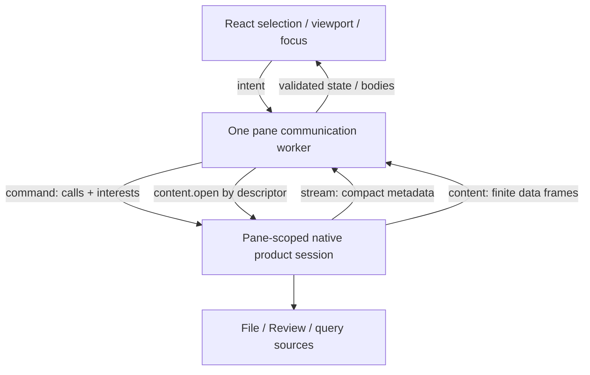
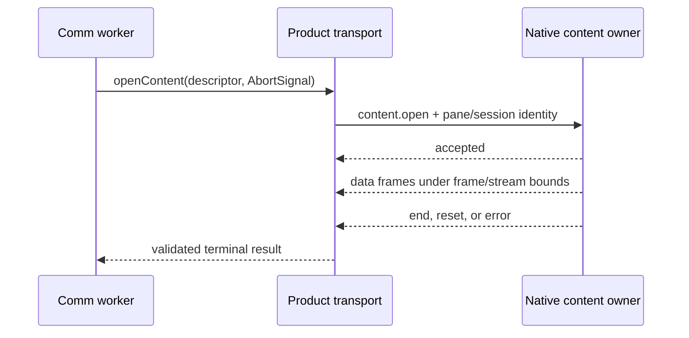

# Bridge Product Transport Architecture

Bridge uses one pane-scoped product transport with three physical routes. The
routes are generic; File, Review, and future Bridge applications give commands,
metadata events, and content their application-specific shape.

Start with [Bridge Viewer Architecture](bridge_viewer_architecture.md). Native
ownership is detailed in [Bridge Native Runtime
Architecture](bridge_native_runtime_architecture.md); worker and demand
ownership are detailed in [Bridge Web Runtime
Architecture](bridge_web_runtime_architecture.md).

**Updated 2026-10-09 for Bridge PR1 (#463).** PR1 replaced the metadata model
with keyed state in sealed batches and split control admission from operation
results. The governing design, with its component table (N1–N10, W1–W6, INST),
is the [Bridge Stability Program
Design](../../specs/2026-09-24-bridge-stability-redesign/2026-09-24-bridge-stability-program-design.md#components-and-ownership).
The current state and next work are in [Bridge after
PR1](../../specs/2026-10-09-bridge-after-pr1/2026-10-09-bridge-after-pr1.md).

## What PR1 built and what comes later

| Built in PR1 | Comes later |
| --- | --- |
| N1 pane session with per-installation authority (E1) and a fence-first session end | **PR2:** the INST page installation receipt core, with #367 multi-root re-carried onto PR1 |
| N2 operation table: admission answered now, results settled separately | **PR3:** the full Review surface reconciler (N5/N6/N7 convergence), the per-member File change filter |
| N3 view sender and N10 view publishers: keyed state, sealed batches, dirty-key coalescing, credits | **PR4:** the Comments surface on migration 018 (N8 version records and persistent receipts) |
| W1 control admission, W2 per-subscription lifecycle, W4 batch receiver, W6 region presentation | The native per-subscription lifecycle state machine (Linear LUNA-408) |
| The File surface reconciler (restart in place, C5) and the Review hide fence (R15, scheduled builds) | |

## The three route jobs

| Route | Direction | Job |
| --- | --- | --- |
| `agentstudio://rpc/command` | BridgeWeb → native | typed commands, mutations, subscription/demand changes, and query initiation/results |
| `agentstudio://rpc/stream` | native → BridgeWeb | compact pushed state, subscription lifecycle, invalidations, and notifications |
| `agentstudio://rpc/content` | native → BridgeWeb | finite application data requested through an authorized descriptor |

The Swift development backend preserves the same contracts and owners while
mapping them to `/__bridge-product/command`, `/__bridge-product/stream`, and
`/__bridge-product/content` for Vite.



## Command is control, not bulk response transport

A typed product call names application intent and returns a bounded typed
result. Mutations such as `review.comparison.update` may complete with no data.
Queries may return a content descriptor:

```text
typed query call
  → native validates pane/session/application request
  → result returns authorized content descriptor
  → worker opens descriptor through rpc/content
  → actual requested application data arrives as finite frames
```

This keeps application semantics in the call/content registries while the
generic transport remains responsible for correlation, admission, sequencing,
bounds, cancellation, and errors.

## Admission is answered now; the result settles later

Control requests keep exact-replay sequence admission, but native answers a
request as soon as it is **admitted**. The operation then runs concurrently and
its result arrives separately, so one slow operation never holds the sequence.
The native operation table (N2) owns each admitted operation's execution task,
settlement and deadline. A cancel or retirement is out-of-band: it never queues
behind the work it ends.

A mutation whose result shape is unknown after it may have taken effect settles
as `outcomeUnknown`, never as a guessed success. The page may then observe that
operation for later evidence for the rest of the session; an observation that
expires returns "still unknown" and never triggers session recovery.

When a pane installation (E1) ends, the session fences first: it advances the
epoch, refuses new admissions, rejects late publications and settles pending
operations as cancelled. A new installation may start immediately; each owner
releases its own resources when its task stops.

## Recent subscription update IDs

`BridgeProductSubscriptionState` owns recent committed update-ID detection for
the [R64 rolling-window contract](../../specs/bridge-viewer-transport/local-first-comm-worker-architecture.md#r64-swift-product-requests-and-streams-are-framed-capable-and-cancellable).
Its existing membership set is paired with fixed-capacity circular slots and an
oldest-slot index, all private value state within each subscription record.
The default window holds 1,024 IDs; it does not limit subscription lifetime.

| Transition | Recent-ID state | Preserved authority |
| --- | --- | --- |
| Valid intermediate batch | unchanged | one staged update and contiguous batch metadata |
| Rejected request or failed candidate | unchanged | prior committed interest revision/hash and recent IDs |
| Successful final batch, window not full | append ID to slots and membership | new interest revision/hash and one commit barrier |
| Successful final batch, window full | remove oldest member, replace its slot, advance circular index, add new member | same commit transaction; no capacity rejection |
| Exact request replay | unchanged | existing exact-byte response replay, no second mutation |
| Retained reconciliation | preserve slots, membership, index | existing matching subscription/revision |
| Reset, cancellation, source retirement or worker revocation | clear/reset history with its owning record | existing lifecycle fences |

The call path remains worker control mux → native session → subscription-state
candidate → required lifecycle-frame admission → committed state and replay
response. Only the candidate's successful-history mutation changes. Value
semantics keep ring rollover from changing the parent when required-frame
admission fails. There is no timer, persistence, new transport route or recovery
mechanism. History space is bounded by active subscriptions and window capacity,
not elapsed session activity. An evicted label loses recent-reuse detection;
stale request sequences, base revisions/hashes and late barriers remain rejected
by their existing independent checks.

Proof covers repeated ring wraparound, recent/evicted labels, invalid and staged
non-eviction, exact replay, candidate rollback, reconciliation and sustained real
Vite/Swift and packaged traffic beyond the window.

## Metadata is keyed state in sealed batches

One metadata stream is installed per pane. Application subscriptions (views)
are multiplexed over it: `pane.presentation`, `file.metadata`,
`review.metadata` and the comment subscriptions.

Native is the single writer. Each view carries an incarnation **handle**, and
each kind's publisher (N10) keeps its **current keyed state** with per-key
revisions minted at commit: File rows keyed by canonical location (with parent
and sort key), Review items keyed by id and staged per publication, comment
sessions and threads keyed by id. Per-key revisions are monotonic within one
page-owned incarnation, even when a native source context is rebuilt under a
retained view.

The view sender (N3) delivers that state as **sealed batches**:

```text
subscription.batchBegin(batchId, handle, mode, partCount, targetRevision [, snapshotCause])
subscription.batchPart(put key rev value | delete key rev | evict key)   × partCount
subscription.batchComplete(batchId, coveredScope)
```

- `mode` is `snapshot`, `change` or `coverage` (progressive first paint, then
  one certifying snapshot).
- Every `snapshot` begin carries `snapshotCause`: `open`, `requested`,
  `recovery` or `newerInput`. Native session state decides it; when several
  are owed the strongest wins (`open` > `requested` > `recovery`). A
  non-snapshot begin never carries a cause.
- Native coalesces changes per key, so a slow page sees the latest values,
  never a backlog. Dirty-key overflow becomes a snapshot.
- Delivery is paced by per-view **credits** (parts and bytes) and cumulative
  acknowledgements. Acknowledgements pace delivery only; an acknowledgement
  that expires makes the view snapshot-required with cause `recovery`.

The page's batch receiver (W4) stages each batch in a side bank, verifies every
declared part, and installs atomically only when the batch is complete. An
incomplete batch is never installed: the previous state stays on screen and the
receiver asks for a resnapshot. A gap is a staged resnapshot, never a dead
subscription or a blank view. The page's per-subscription lifecycle (W2)
charges its "couldn't update" budget only for unsuccessful recovery; newer
input never charges (owner decision R13, 2026-10-08).

Metadata may say that a file or Review item exists, changed, has a particular
extent, and has an authorized content descriptor. It does not carry the file,
diff, or rendered Markdown body.

Item metadata and its content descriptor are not required to arrive in the same
accepted stream event. A consumer may therefore admit selected demand after an
item becomes addressable but before its descriptor is present. That intermediate
condition is nonterminal: the consumer remains loading and waits for the
descriptor mutation. Descriptor arrival is the event that reschedules the
current demand. Only explicit application unavailability or a failed authorized
content request is terminal for that demand.

## Content returns the requested application data

The content route accepts an authorized application descriptor and produces a
finite accepted/data/end, reset, or error stream. Current content kinds include
File and Review bodies. Other finite requested datasets use the same route by
adding an application-specific content kind—not another physical transport.

`content.accepted` establishes transport admission and the framed response
identity for a registered content operation. It does not assert that every
application-specific semantic check has succeeded. A request-scoped descriptor
that becomes stale, replaced, or already claimed after registration therefore
completes as `content.accepted` followed by terminal `content.error`; it does
not produce application data.



## Demand lanes schedule content

Demand lanes are scheduling policy, not transports or data owners:

```text
foreground / selected ─┐
visible                ─┤
nearby                 ─┼─► choose the next content.open request
speculative            ─┤
idle                   ─┘
```

The communication worker derives membership from selection, viewport, focus,
and application policy. Native admission and the content route still authorize
and carry the selected request.

## File and Review application metadata

File subscription interests center on paths. File metadata carries source
identity and keyed rows (one record per tracked path, including symlink rows;
only the worktree root is resolved), Git status facts, descriptor outcomes,
extent facts, and invalidations. Requested file bytes arrive through content;
the content reader validates the resolved target and verifies the bytes.

Review subscription interests center on Review item IDs. Review metadata
carries publication identity, resolved comparison summary, items keyed by id
and staged per publication, per-item roles and descriptors, and invalidations.
Requested base/head/diff bodies arrive through content.

Pane presentation carries only compact pane state needed independently of an
application query. For Review comparison this includes the active target,
attempt, and displayed snapshot status. A selectable branch catalog is not pane
lifecycle, File metadata, Review-item metadata, or a notification; it is a
finite requested dataset.

## Placement test

Use these questions when adding Bridge data:

| Question | Owner |
| --- | --- |
| Does the frontend intend a command, mutation, subscription change, or query? | typed command RPC |
| Must compact state or invalidation arrive without an explicit fetch? | metadata stream |
| Is this the actual finite dataset/body the application requested? | content route |
| Which admitted content request should start first? | demand policy |

UI placement does not choose transport placement. A control in the Review
header may depend on both compact current metadata and an on-demand catalog.

## Review comparison target catalog

The Review comparison branch catalog follows the finite requested-dataset path.
Opening the comparison picker issues the typed
`review.comparisonTargets.query` product call, even when Commit is the
remembered mode, so Branch choices are ready for an immediate mode switch.
Native authorization returns a single-use request-scoped descriptor before
catalog production. The worker opens that descriptor through the product
content route; the registered producer task atomically consumes its reservation
and only a successful claim invokes bounded `agentstudio-git` capture,
encoding, and terminal integrity production. The worker validates and decodes
the complete catalog and publishes it to the picker. Newer requests supersede
older ones, and foreground/session loss cancels the pending request.

The wire descriptor contains only content kind, descriptor identity, and the
maximum response bytes. Existing command and `content.open` envelope fields
carry pane, session, Review-surface, and worker authority. The provider-owned
reservation records the issuing authority and matches it against those existing
fields; the transport does not duplicate authority inside the descriptor.

`pane.presentation` carries only the compact active target, attempt state,
displayed snapshot identity, and repository-default identity needed before a
catalog request. The strict metadata contract rejects a target catalog in pane
presentation. The picker filters the complete returned catalog and virtualizes
visible branch rows, so transport bounds and DOM bounds remain separate.

The governing behavior and internal flow are in
[Bridge Review Comparison Target Loading](../../specs/2026-08-10-bridge-review-comparison-target-loading/specification.md)
and its Program Design.

## Source map

| Concern | Source |
| --- | --- |
| Route names and limits | [`Sources/AgentStudio/Features/Bridge/Models/Transport/BridgeProductSessionContract.swift`](../../../Sources/AgentStudio/Features/Bridge/Models/Transport/BridgeProductSessionContract.swift) |
| Native scheme routing | [`Sources/AgentStudio/Features/Bridge/Transport/BridgeSchemeHandler.swift`](../../../Sources/AgentStudio/Features/Bridge/Transport/BridgeSchemeHandler.swift) |
| Typed native calls/content | [`BridgeProductCallContracts.swift`](../../../Sources/AgentStudio/Features/Bridge/Models/Transport/BridgeProductCallContracts.swift), [`BridgeProductContentContracts.swift`](../../../Sources/AgentStudio/Features/Bridge/Models/Transport/BridgeProductContentContracts.swift) |
| Worker transport API | [`BridgeWeb/src/core/comm-worker/bridge-product-transport.ts`](../../../BridgeWeb/src/core/comm-worker/bridge-product-transport.ts) |
| Packaged route mapping | [`bridge-product-agent-studio-request-executor.ts`](../../../BridgeWeb/src/core/comm-worker/bridge-product-agent-studio-request-executor.ts) |
| Vite route mapping | [`bridge-product-http-request-executor.ts`](../../../BridgeWeb/src/core/comm-worker/bridge-product-http-request-executor.ts) |
| File metadata protocol | [`bridge-product-subscription-contracts.ts`](../../../BridgeWeb/src/core/comm-worker/bridge-product-subscription-contracts.ts) |
| Review metadata protocol | [`bridge-product-review-metadata-contracts.ts`](../../../BridgeWeb/src/core/comm-worker/bridge-product-review-metadata-contracts.ts) |
| Sealed batch wire (native / page; shared fixtures mirrored byte-identically) | [`BridgeProductBatchWireContract.swift`](../../../Sources/AgentStudio/Features/Bridge/Models/Transport/BridgeProductBatchWireContract.swift), [`bridge-product-batch-wire-contracts.ts`](../../../BridgeWeb/src/core/comm-worker/bridge-product-batch-wire-contracts.ts) |
| Operations and observation wire | [`BridgeProductOperationWireContract.swift`](../../../Sources/AgentStudio/Features/Bridge/Models/Transport/BridgeProductOperationWireContract.swift), [`BridgeProductOperationObservationWireContract.swift`](../../../Sources/AgentStudio/Features/Bridge/Models/Transport/BridgeProductOperationObservationWireContract.swift), [`bridge-product-operation-observation-wire-contracts.ts`](../../../BridgeWeb/src/core/comm-worker/bridge-product-operation-observation-wire-contracts.ts) |
| View control wire (scope, resnapshot) | [`BridgeProductViewControlWireContract.swift`](../../../Sources/AgentStudio/Features/Bridge/Models/Transport/BridgeProductViewControlWireContract.swift) |
| Native view sender (N3) and snapshot cause | [`BridgeProductViewSenderState.swift`](../../../Sources/AgentStudio/Features/Bridge/Transport/BridgeProductViewSenderState.swift), [`BridgeProductSession+ViewDelivery.swift`](../../../Sources/AgentStudio/Features/Bridge/Transport/BridgeProductSession+ViewDelivery.swift), [`BridgeProductSession+SnapshotCause.swift`](../../../Sources/AgentStudio/Features/Bridge/Transport/BridgeProductSession+SnapshotCause.swift) |
| Native operations (N2) | [`BridgeProductSession+Operations.swift`](../../../Sources/AgentStudio/Features/Bridge/Transport/BridgeProductSession+Operations.swift) |
| Page control admission (W1) | [`bridge-product-session-authority.ts`](../../../BridgeWeb/src/core/comm-worker/bridge-product-session-authority.ts) |
| Page lifecycle (W2) and batch receiver (W4) | [`bridge-product-view-scope-owner.ts`](../../../BridgeWeb/src/core/comm-worker/bridge-product-view-scope-owner.ts), [`bridge-product-view-batch-receiver.ts`](../../../BridgeWeb/src/core/comm-worker/bridge-product-view-batch-receiver.ts), [`bridge-product-batch-frame-router.ts`](../../../BridgeWeb/src/core/comm-worker/bridge-product-batch-frame-router.ts), [`bridge-product-view-receipt-acknowledger.ts`](../../../BridgeWeb/src/core/comm-worker/bridge-product-view-receipt-acknowledger.ts) |
