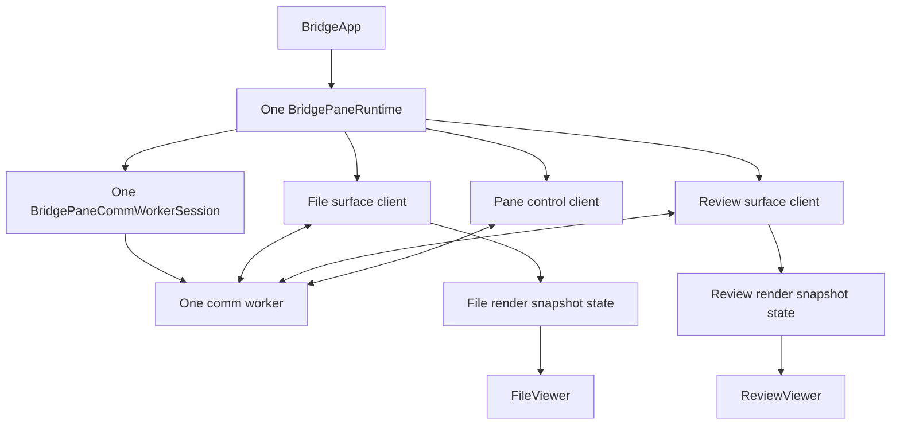
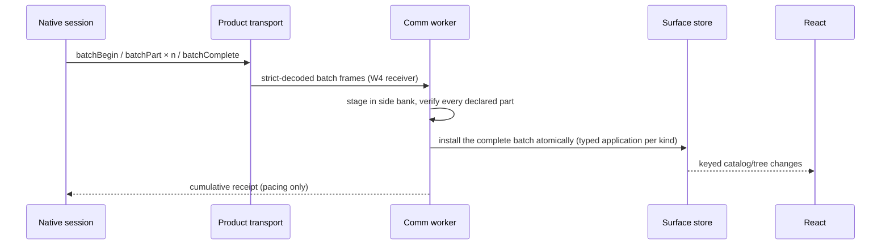
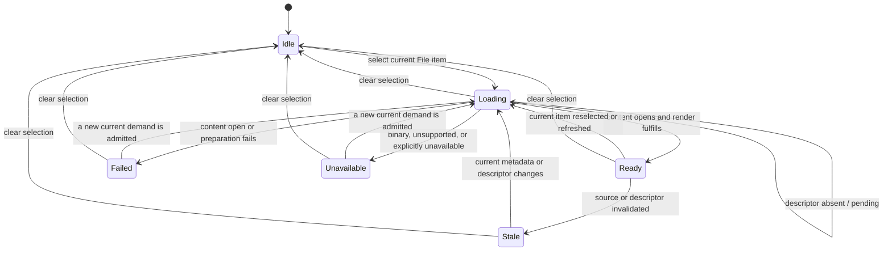
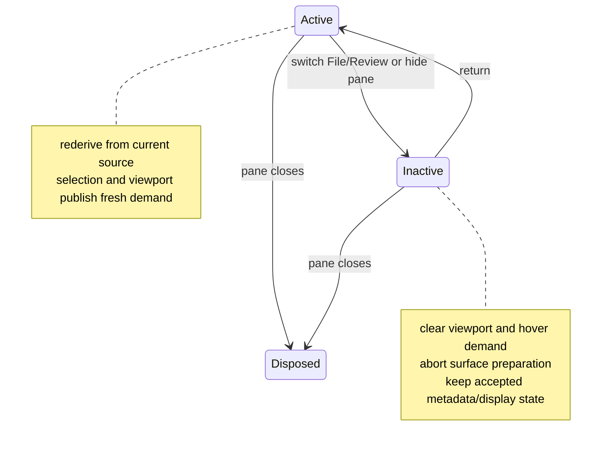

# Bridge Web Runtime Architecture

BridgeWeb is the pane-local React and worker runtime for Bridge Viewer. Each
pane creates exactly one communication worker. File and Review share that
worker and product session, while retaining separate surface clients,
surface-local worker state, main-thread render stores, demand state, and
presentation owners.

Start with [Bridge Viewer Architecture](bridge_viewer_architecture.md). The
native side is documented in [Bridge Native Runtime
Architecture](bridge_native_runtime_architecture.md). Route and payload
placement is defined by [Bridge Product Transport
Architecture](bridge_product_transport_architecture.md).

**Updated 2026-10-09 for Bridge PR1 (#463).** The worker-side owners follow the
[Bridge Stability Program
Design](../../specs/2026-09-24-bridge-stability-redesign/2026-09-24-bridge-stability-program-design.md#components-and-ownership):
W1 control admission, W2 per-subscription lifecycle, W4 batch receiver, W5
surface epochs and W6 region presentation. Next work is in [Bridge after
PR1](../../specs/2026-10-09-bridge-after-pr1/2026-10-09-bridge-after-pr1.md).

## Runtime Topology



`BridgeApp` creates the pane runtime once and obtains the File, Review, and pane
control clients from it. The clients multiplex over one worker session. Creating
a second surface must not create a second comm worker, and switching modes must
not destroy the inactive surface's durable display state.

## State Boundaries

| State | Owner | Examples |
| --- | --- | --- |
| Product/session state | Comm worker | capability, stream, subscriptions, resync, native bootstrap |
| Control admission (W1) | `BridgeProductControlMux` in the comm worker | page-side sequence and admission, operation-result requests, settlement deadline |
| Per-subscription lifecycle (W2) | `BridgeProductViewScopeOwner` | desired vs committed scope, begin obligations, recovery budget, `failedRetryable`, Retry |
| Batch receiver (W4) | `BridgeProductViewBatchReceiver` | side bank, part verification, atomic install, per-key revision rules, resnapshot requests, cumulative receipts |
| Region presentation (W6) | File, Review, Comments and Markdown region mappers | one presentation state per region: content, Loading, Empty, Updating or Failed |
| File runtime state | File-owned fields and projections in the comm worker | tree metadata, source generation, selection, File demand, cached bodies |
| Review runtime state | Review-owned fields and projections in the comm worker | package/catalog, item metadata, Review demand, render fulfillment |
| Main-thread display snapshots | Surface-specific render stores | compact keyed rows/items and transaction cursors |
| React presentation | File or Review component | search, filters, tree expansion, reveal, scroll, local control refs |
| Native truth | Swift | worktree, Git products, publication, content authorization |

Large content and prepared render payloads do not belong in React state or
Zustand. The worker owns byte-oriented preparation and transfers bounded display
artifacts to the main thread. React subscribes to keyed snapshots so one item
change does not rebuild the entire package.

Finite datasets requested by application controls also stay out of continuously
pushed pane metadata. The worker initiates a typed query, opens the returned
content descriptor, validates and materializes that application response, and
exposes request-local loading/ready/error state to the owning control.

## Metadata Intake



Since PR1, metadata arrives as **keyed state in sealed batches** (see [Bridge
Product Transport Architecture](bridge_product_transport_architecture.md#metadata-is-keyed-state-in-sealed-batches)).
The W2 scope owner decides, per subscription, whether a batch begin is owed:
the first open, a new handle, a filter change, or pending recovery require a
snapshot begin; an ordinary same-filter demand change does not, because demand
reprioritizes enrichment and never restarts an in-flight batch. W4 stages the
batch, installs it only when complete, and applies it through the typed
per-kind application (File projection, Review batch installer, comment
sources). An incomplete batch is never installed: the previous state stays on
screen and W4 asks for a resnapshot. A batch from an ended subscription
incarnation (E3) is never applied anywhere.

File and Review metadata keep separate applicators and projections. A reset
clears identities and derived state that belong to the retired source; it does
not leave old items addressable through a new generation.

Metadata intake is not content hydration. It makes tree rows, item descriptors,
content handles, and render semantics available so demand can be derived.

## File Selected-Content Lifecycle

File item metadata and its authorized content descriptor are separate accepted
inputs. Metadata can make a selected item demand-eligible before the descriptor
for that item arrives. Descriptor absence at that point is incomplete ordering,
not terminal unavailability.



`pending` is an internal fetch result, not a React presentation state. It
publishes no terminal content-availability patch, so the selected item remains
`loading`. A later `file.descriptorReady` event applies the content-request
mutation and reschedules preparation for the current selected demand. This is
event-driven retry; File loading does not poll or wait on a timer.

```mermaid
sequenceDiagram
    participant U as User
    participant R as Review
    participant A as BridgeApp
    participant F as File presentation
    participant W as Comm worker
    participant N as Native File source

    U->>R: Click file-corner action
    R->>A: Open exact path in File
    A->>F: Activate retained File host and deliver path command
    F->>W: Commit selected File item
    W-->>F: Publish loading availability
    N-->>W: Item metadata arrives before descriptor
    W->>W: Prepare selected content
    W->>W: Descriptor absent -> pending
    Note over W,F: No terminal patch; File remains visibly loading
    N-->>W: file.descriptorReady
    W->>W: Abort superseded preparation and apply descriptor mutation
    W->>W: Selected content request changed -> reschedule
    W->>N: content.open with current descriptor
    N-->>W: Accepted bounded content bytes
    W->>W: Validate and prepare Pierre/Shiki result
    W-->>F: Transfer render payload and ready availability
    F->>F: Mount current content and fulfill paint
```

The lifecycle invariants are:

- metadata presence does not imply descriptor presence in the same event;
- a missing descriptor for current demand remains `loading`, with no terminal
  publication;
- only an explicit binary/unsupported/unavailable classification or a genuine
  content failure produces a terminal result for the current demand;
- descriptor arrival is the retry owner and must reschedule only the current
  selection epoch;
- `ready` requires ready worker availability plus a prepared File render item;
- every non-ready File presentation renders an explicit status instead of a
  blank canvas; and
- File/Review activation changes foreground demand without disposing either
  retained surface host or its selection, data, and scroll state.

Marker-scoped runtime proof correlates the path with `viewer_activation`,
`selection_commit`, and `file_open_ready`. Those events witness activation,
accepted selection, and terminal ready paint; they do not replace the state
machine or its unit/browser coverage.

## Demand Is A Pipeline

```mermaid
flowchart LR
    Intent[Selection / viewport / hover]
    Membership[Demand membership]
    Rank[Lane and priority]
    NativeInterest[Subscription interest]
    Admission[Native content admission]
    Fetch[Content fetch]
    Cache[Worker byte/body registry]
    Prepare[Pierre/Shiki preparation]
    Apply[Main-thread bounded apply]
    Paint[Paint fulfillment receipt]

    Intent --> Membership --> Rank --> NativeInterest --> Admission --> Fetch --> Cache --> Prepare --> Apply --> Paint
```



A lane is working only when every arrow exists. A policy constant by itself does
not schedule content.

The shared role vocabulary is:

| Role | Intended source | Relative priority |
| --- | --- | --- |
| selected | explicit selection | highest |
| visible | current tree or CodeView viewport | immediate |
| nearby | bounded area around the viewport | warming |
| speculative | hover or prediction | opportunistic |
| background | bounded package-prefix warming | lowest |

The active producer set is surface-specific and must be verified in code before
tuning. Review currently has explicit selected, visible, and hover-speculative
preparation paths. File publishes selected, visible, and nearby metadata
interests. Background retention limits in policy do not, by themselves, prove
that a background producer is installed.

## Selection, Visible Demand, And Heavy Scroll

Selected work is latency-sensitive but cannot starve the viewport forever.
Visible demand is derived from the current accepted package and viewport. The
worker caps concurrent starts, tracks in-flight membership, and reruns a visible
item when source churn makes an active preparation obsolete.

During momentum scrolling:

1. React publishes a new viewport membership.
2. Items leaving demand lose membership; their stale results are rejected even
   if underlying fetch cancellation races completion.
3. Newly visible items enter the immediate queue.
4. Worker preparation produces bounded windows rather than whole-file DOM work.
5. The main-thread apply pump enforces time and unit budgets and sends a render
   disposition receipt.

Look-ahead/behind constants describe membership policy. They do not compensate
for missing cancellation, an unbounded global start rate, or a render job whose
priority is lost before Pierre/Shiki. Those are separate pipeline boundaries.

## Content Fetch, Cache, And Materialization

```mermaid
sequenceDiagram
    participant D as Demand scheduler
    participant P as Product transport
    participant C as Native content source
    participant W as Worker preparation
    participant M as Main render store

    D->>P: fetch authorized descriptor/handle
    P->>C: streamed content request
    C-->>P: framed bytes + identity
    P-->>W: decoded content
    W->>W: verify identity; register/cache body
    W->>W: run bounded Pierre/Shiki job
    W-->>M: transferable render payload
    M-->>D: painted/rejected/stale receipt
```

The byte/body registry is a worker-local optimization, not source authority.
Entries are keyed by content identity, invalidated when metadata changes, and
bounded separately from lane concurrency. A "25% of byte-cache capacity"
policy is a warming admission budget; it does not mean the cache fetches or
evicts twenty-five percent at once.

Materialization has two budgets:

- worker render budgets limit bytes and line windows sent through Pierre/Shiki;
- main-thread apply budgets limit work per animation frame and preserve
  selected/visible fairness.

## Pierre And Shiki Ownership

The comm worker prepares Pierre render work and returns transferable results.
The main thread adapts those results into File or Review display snapshots.
Pierre FileTree and CodeView remain the product renderers; Bridge does not
replace them with route-local lists or `<pre>` fallbacks.

Review uses a continuous CodeView over ordered review items. File uses a single
selected file view. Both may share UI primitives and render couriers, but their
source identities and fulfillment registries stay separate.

## Surface Activation And Suspension



Inactive Review clears hover and visible item IDs and suspends its preparation
lifecycle. Resume creates a fresh abort scope and replays only current metadata,
selected, and visible work. File follows the same ownership rule through its
surface-specific controller.

The pane worker itself survives a File/Review switch. It is disposed only when
the pane runtime closes or is replaced after a worker/session failure.

## Reset, Replacement, And Reconvergence

Stale work can exist at several stages: queued, fetching, cached, preparing,
transferred, or waiting for main-thread apply. Each stage checks current source,
generation, worker derivation epoch, or fulfillment identity before committing.

On source reset or worker replacement:

1. abort active surface work and cancel queued tickets;
2. clear retired demand and fulfillment identities;
3. install a fresh native bootstrap and capability;
4. replay committed metadata through a new session;
5. rederive selection and viewport demand;
6. accept paint receipts only for the new derivation epoch.

Failure must converge to retry, reset, or an explicit unavailable state. A
permanent `loading` entry with no active demand or retry owner is a lifecycle
bug, not a valid idle state.

**Recovery budget (R13, owner decision 2026-10-08).** W2 counts only
unsuccessful recovery against a view's "couldn't update" budget. A snapshot
whose cause is `newerInput` never charges; `recovery` and `requested` snapshots
are charged and, while the view is `failedRetryable`, are acknowledged but not
staged. A view leaves Failed only on a certified install, an explicit Retry, or
a current `open`. The page shows `recovering` as Updating while retaining the
last good content.

## Region States (U13)

Every region (File tree and content, Review items and comparison, Comments,
Markdown) ends in exactly one presentation state: content, Loading, Empty,
Updating or Failed. W6 maps the region's inputs (its surface status, its
demanded identity and its own read) to that state, and one shared renderer
draws Loading, Empty, Updating and Failed. W6 is a presentation boundary only:
it is not a second currentness owner and adds no timer, retry or atom. Each
pane shows one failure message and one Retry; Retry dispatches the jobs that
actually failed (view recovery, comparison, or both). A failed start offers
Reload Bridge (`AppCommand.reloadBridgeWebView`).

## Invariants

- Exactly one comm worker exists per Bridge pane.
- File and Review never share mutable surface state merely because they share a
  worker.
- React owns presentation; the worker owns heavy preparation; Swift owns Git
  and content authority.
- Metadata commits atomically before demand addresses its content.
- Demand membership is re-derivable and stale completion is harmless.
- Inactive surfaces do not continue foreground hydration.
- Cache identity includes source/content freshness, not only a path or item ID.
- Main-thread apply is bounded and returns explicit fulfillment disposition.
- Production rendering uses Pierre/Shiki; production Git uses
  `agentstudio-git` through Swift.

## Source Map

| Concern | Source |
| --- | --- |
| Pane runtime and surface clients | [`BridgeWeb/src/core/comm-worker/bridge-pane-runtime.ts`](../../../BridgeWeb/src/core/comm-worker/bridge-pane-runtime.ts) |
| One worker session | [`bridge-pane-comm-worker-session.ts`](../../../BridgeWeb/src/core/comm-worker/bridge-pane-comm-worker-session.ts) |
| Worker entry and runtime protocol | [`bridge-comm-worker-entry.ts`](../../../BridgeWeb/src/core/comm-worker/bridge-comm-worker-entry.ts), [`bridge-comm-worker-runtime-protocol.ts`](../../../BridgeWeb/src/core/comm-worker/bridge-comm-worker-runtime-protocol.ts) |
| File/Review worker state | [`bridge-comm-worker-store.ts`](../../../BridgeWeb/src/core/comm-worker/bridge-comm-worker-store.ts), [`bridge-comm-worker-file-view-runtime.ts`](../../../BridgeWeb/src/core/comm-worker/bridge-comm-worker-file-view-runtime.ts), [`bridge-comm-worker-review-runtime.ts`](../../../BridgeWeb/src/core/comm-worker/bridge-comm-worker-review-runtime.ts) |
| File selected-content retry | [`bridge-comm-worker-selection-demand.ts`](../../../BridgeWeb/src/core/comm-worker/bridge-comm-worker-selection-demand.ts), [`bridge-comm-worker-file-view-runtime-source.ts`](../../../BridgeWeb/src/core/comm-worker/bridge-comm-worker-file-view-runtime-source.ts) |
| File open-state presentation | [`BridgeWeb/src/file-viewer/bridge-file-viewer-display-model.ts`](../../../BridgeWeb/src/file-viewer/bridge-file-viewer-display-model.ts), [`bridge-file-viewer-code-panel.tsx`](../../../BridgeWeb/src/file-viewer/bridge-file-viewer-code-panel.tsx) |
| Review demand scheduling | [`bridge-comm-worker-review-demand-scheduling.ts`](../../../BridgeWeb/src/core/comm-worker/bridge-comm-worker-review-demand-scheduling.ts) |
| Demand policy | [`BridgeWeb/src/core/demand/bridge-content-demand-policy.ts`](../../../BridgeWeb/src/core/demand/bridge-content-demand-policy.ts) |
| Content preparation pump | [`bridge-worker-content-preparation-pump.ts`](../../../BridgeWeb/src/core/comm-worker/bridge-worker-content-preparation-pump.ts) |
| Pierre/Shiki jobs | [`bridge-worker-pierre-render-job.ts`](../../../BridgeWeb/src/core/comm-worker/bridge-worker-pierre-render-job.ts), [`bridge-worker-pierre-courier.ts`](../../../BridgeWeb/src/core/comm-worker/bridge-worker-pierre-courier.ts) |
| Main-thread snapshots and fulfillment | [`bridge-main-render-snapshot-store.ts`](../../../BridgeWeb/src/core/comm-worker/bridge-main-render-snapshot-store.ts), [`bridge-main-render-fulfillment-coordinator.ts`](../../../BridgeWeb/src/core/comm-worker/bridge-main-render-fulfillment-coordinator.ts) |
| React mode ownership | [`BridgeWeb/src/app/bridge-app.tsx`](../../../BridgeWeb/src/app/bridge-app.tsx), [`bridge-app-file-viewer-mode.tsx`](../../../BridgeWeb/src/app/bridge-app-file-viewer-mode.tsx), [`bridge-app-review-viewer-mode.tsx`](../../../BridgeWeb/src/app/bridge-app-review-viewer-mode.tsx) |
| Control admission (W1) | [`bridge-product-session-authority.ts`](../../../BridgeWeb/src/core/comm-worker/bridge-product-session-authority.ts) |
| Per-subscription lifecycle (W2) | [`bridge-product-view-scope-owner.ts`](../../../BridgeWeb/src/core/comm-worker/bridge-product-view-scope-owner.ts) |
| Batch receiver (W4) and frame routing | [`bridge-product-view-batch-receiver.ts`](../../../BridgeWeb/src/core/comm-worker/bridge-product-view-batch-receiver.ts), [`bridge-product-batch-frame-router.ts`](../../../BridgeWeb/src/core/comm-worker/bridge-product-batch-frame-router.ts), [`bridge-product-batch-delivery.ts`](../../../BridgeWeb/src/core/comm-worker/bridge-product-batch-delivery.ts), [`bridge-product-view-receipt-acknowledger.ts`](../../../BridgeWeb/src/core/comm-worker/bridge-product-view-receipt-acknowledger.ts) |
| Typed batch application | [`bridge-comm-worker-product-batch-application.ts`](../../../BridgeWeb/src/core/comm-worker/bridge-comm-worker-product-batch-application.ts), [`bridge-comm-worker-review-batch-installer.ts`](../../../BridgeWeb/src/core/comm-worker/bridge-comm-worker-review-batch-installer.ts) |
| Region presentation (W6) | [`bridge-review-region-presentation.ts`](../../../BridgeWeb/src/features/review/bridge-review-region-presentation.ts), [`bridge-pane-failure-summary-slot.tsx`](../../../BridgeWeb/src/app/bridge-pane-failure-summary-slot.tsx) |
