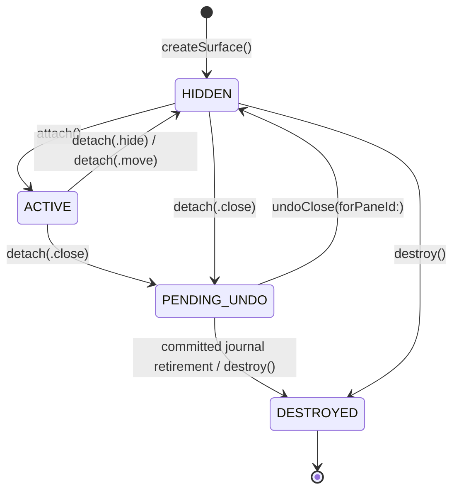

# Ghostty Surface Architecture

## TL;DR

Agent Studio embeds Ghostty terminal surfaces via libghostty. `SurfaceManager` (singleton) **owns** all surfaces. `TerminalPaneMountView` only **displays** them, and it does so from inside a stable `PaneHostView`. `WorkspaceSurfaceCoordinator` is the sole intermediary — views and the model layer never call `SurfaceManager` directly. Surfaces live in exactly one of three collections (active, hidden, undoStack), with dual-layer health monitoring and crash isolation per terminal.

---

## Core Design: Ownership Separation

The key architectural decision is **separation of ownership from display**:
- `SurfaceManager` **owns** all surfaces (creation, lifecycle, destruction)
- `TerminalPaneMountView` containers only **display** surfaces
- `WorkspaceSurfaceCoordinator` is the sole intermediary for surface/runtime lifecycle

```
┌─────────────────────────────────────────────────────────────────────┐
│                        SurfaceManager                               │
│                     (OWNS all surfaces)                             │
│                                                                     │
│  ┌─────────────────┐ ┌─────────────────┐ ┌─────────────────┐       │
│  │ activeSurfaces  │ │ hiddenSurfaces  │ │   undoStack     │       │
│  │  [UUID: Surf]   │ │  [UUID: Surf]   │ │ [UndoEntry]     │       │
│  │                 │ │                 │ │                 │       │
│  │  Rendering: ON  │ │  Rendering: OFF │ │ Journal owned  │       │
│  └────────┬────────┘ └────────┬────────┘ └────────┬────────┘       │
│           │                   │                   │                 │
│           └───────────────────┴───────────────────┘                 │
│                      Surface lives in ONE                           │
└─────────────────────────────────────────────────────────────────────┘
                              │
                    attach() / detach()
                              │
                    (via WorkspaceSurfaceCoordinator)
                              │
                              ▼
┌─────────────────────────────────────────────────────────────────────┐
│                    TerminalPaneMountView                            │
│          (mounted under PaneHostView, displays only)                │
│                                                                     │
│   paneId: UUID       ←─ single identity across all layers           │
│   surfaceId: UUID?   ←─ which surface is displayed here             │
│                                                                     │
│   displaySurface(surfaceView)  ←─ called by coordinator             │
│   removeSurface()              ←─ called by coordinator             │
└─────────────────────────────────────────────────────────────────────┘
```

**Pane-to-surface join key:** the current or most recent attachment ID binds a surface to its pane. Undo uses `previousPaneAttachmentId` with the retained attachment as fallback; creation metadata is not a live binding.

---

## Ghostty Runtime Lifecycle Facts

The embedding contract depends on four independent axes:

1. Surface existence: create/free (`ghostty_surface_new`/`ghostty_surface_free`)
2. Geometry: resize (`ghostty_surface_set_size`)
3. Visibility: occlusion (`ghostty_surface_set_occlusion`)
4. Focus: input focus (`ghostty_surface_set_focus`)

Design implication:

- Geometry updates must not be modeled as visibility-dependent.
- Background panes can be pre-sized and kept occluded.
- Attach orchestration should treat size readiness and visibility readiness as separate signals.

### Renderer visibility and focus delivery

Visibility and focus reach libghostty through exactly one seam,
`SurfaceRendererStateDelivery` (`LiveSurfaceRendererStateDelivery` in production).
`SurfaceManager` owns every visibility and focus-on delivery; views deliver focus-off only,
through the same seam. Nothing else in the app calls `ghostty_surface_set_occlusion` or
`ghostty_surface_set_focus`; an architecture test pins this.

- **Effective visibility** for an attached surface is
  `window.isVisible && !window.isMiniaturized && !window.isOccluded && tier == .p0Visible`, where
  the tier comes from `StoreVisibilityTierResolver` (active tab, zoom, minimized panes, expanded
  drawers). `WorkspaceSurfaceCoordinator+RendererVisibility` joins those facts inside one
  generation-guarded `withObservationTracking` pass and calls
  `SurfaceManager.reconcileAttachedVisibility` for the exact attached set. Attach, detach, move,
  swap and destroy re-arm the pass through the manager's attached-bindings handler; the manager's
  collections themselves are `@ObservationIgnored`.
- **Deliver on change.** `ManagedSurface.lastDeliveredVisibility` records the last value handed to
  the seam; equal values are suppressed at the manager, so a reconciliation over 30 attached
  surfaces normally delivers nothing.
- **Detach delivers hidden while the surface is still attached.** `detach(.hide/.move/.close)`
  turns focus off, delivers `visible == false`, and only then moves the surface between
  collections. Bare removal used to leave the renderer believing it was visible.
- **Focus follows delivered visibility.** `SurfaceManager.setFocus(_, focused: true)` is refused
  unless the surface is active, its last delivered visibility is `true`, **and** it is its
  window's first responder; focus-off is always delivered. The responder-chain callback
  (`SurfaceManager.surfaceDidBecomeFirstResponder(_:)`, called from
  `Ghostty.SurfaceView.becomeFirstResponder`) supplies responder truth itself and gates only on
  active membership and delivered visibility, since AppKit may not have updated
  `window.firstResponder` while `becomeFirstResponder` is still running. Turning visibility on
  re-delivers focus when the view is already its window's first responder. Ghostty starts the
  display link on focus regardless of occlusion, so an ungated focus-on would wake a hidden
  renderer.
- **What hidden buys at Ghostty v1.3.1.** `set_occlusion(false)` stops the display link and
  `drawFrame` early-returns; the renderer thread still services `updateFrame` on wakeups. Hidden
  is a CPU/compositor saving, not a memory release; memory is released only by destroying the
  surface (see the lifecycle telemetry below).
- **Lifecycle telemetry.** `performance.renderer.lifecycle` records
  created/attached/hidden/closed_for_undo/undo_restored/released/freed/reconciled with the
  manager's exact population and the conservation view `live = created − freed`,
  `manager_owned = active + hidden + close_undo`, `orphan_candidate = live − manager_owned`.
  `released` is emitted before the manager drops its last reference; `freed` from
  `Ghostty.SurfaceView.retireNativeSurface` after the existing `ghostty_surface_free` returns. Only bounded aggregates are exported.

---

## Surface State Machine

A surface exists in **exactly one** collection. The collection determines the state:



| State | Collection | Rendering | Notes |
|-------|-----------|-----------|-------|
| HIDDEN | `hiddenSurfaces` | OFF | Alive but not displayed; `detach(.close)` from here enters PENDING_UNDO (closing a background tab) |
| ACTIVE | `activeSurfaces` | ON only while effective visibility is true | Attached to a pane; rendering follows the reconciled visibility, not attachment |
| PENDING_UNDO | `undoStack` | OFF | Retained for an available durable Undo owner; the journal owns the 300-second deadline |
| DESTROYED | (freed) | N/A | Native handle explicitly freed; an inert view may still be retained by AppKit |

---

## Tab Close → Undo Flow

The journal in `core.sqlite` is the durable Undo authority. SurfaceManager's retained surfaces
are a cache of that ownership, with no independent expiration task.

```text
Close command
  -> prepare complete snapshot
  -> commit pane/layout removal and Undo entry in one serialized write
  -> hide/detach the exact surface and retain it for Undo
  -> publish committed state

Undo command
  -> validate the newest restorable entry without consuming invalid placement
  -> commit restored composition and consume the entry atomically
  -> prepare/publish host placement
  -> remount retained surface by pane attachment ID when available

Deadline / oldest-first eviction / permanent discard
  -> commit ownership transition, query remaining owners, mark unowned sessions pending
  -> retire only unowned pane surfaces
  -> wake verified session cleanup (subject to the startup gate)
```

The journal keeps at most ten available operations per workspace and uses a 300-second deadline.
Restart recovers durable Undo deadlines before runtime admission. The session cleanup consumer
waits five minutes after boot before processing journal-known pending sessions, and rechecks native
attachments before retirement. Failed work stays pending; completion requires the applicable
endpoint or recorded-process evidence described in [Session Lifecycle](session_lifecycle.md).

---

## Embedded Ghostty Host Composition

AppDelegate selects and retains one `Ghostty.App` at startup. Consumers receive explicit engine availability or terminal lookup operations. The local `Ghostty.App` type wires four focused host-side responsibilities:

- `Ghostty.AppHandle` owns `ghostty_app_t` and config lifetime.
- `Ghostty.CallbackRouter` owns the C callback table (`wakeup_cb`, `action_cb`, clipboard callbacks, `close_surface_cb`) and reconstructs Swift objects from userdata.
- `Ghostty.ActionRouter` owns the action-tag switch, surface lookup, and runtime routing.
- `Ghostty.AppFocusSynchronizer` observes `AppLifecycleAtom.isActive` and mirrors app-level focus into `ghostty_app_set_focus`.

The boundary is intentionally split by isolation contract: callback trampolines stay nonisolated and capture stable identity synchronously; surface updates and runtime routing hop to `@MainActor`.

---

## Host Scrollback UX Boundary

Agent Studio now consumes libghostty/runtime facts for terminal scrollback UX, but still renders the visible macOS UI on the host side.

- Ghostty core owns terminal scrollback/search state and exposes it through routed runtime events such as `scrollbarChanged` and `search*`.
- High-rate `scrollbarChanged` samples remain contracted by
  `TerminalLocalActionAccumulator`; its compact MainActor drain validates the
  mounted surface, updates the surface host cache, and treats
  `TerminalRuntime` observation as optional.
- `Ghostty.SurfaceView` caches mounted scrollbar presentation independently of
  optional `TerminalRuntime` observation.
- `TerminalPaneMountView` composes host UI around the surface: `TerminalSurfaceScrollView`, `TerminalSearchOverlayView`, and `ScrollToBottomIndicatorView`.
- `TerminalSurfaceScrollView` provides the native scrollbar UI on macOS,
  synchronizes interior thumb movement through `scroll_to_row:N`, and expresses
  the host scrollbar maximum as Ghostty-authoritative `scroll_to_bottom`.
- During an AppKit live-scroll gesture, the wrapper suppresses host-driven clip
  repositioning and reconciles only a Ghostty state received during that
  gesture which acknowledges the last accepted semantic viewport command.
- `Ghostty.SurfaceView` remains the rendering/input bridge and keeps ordinary wheel/trackpad scrolling owned by Ghostty core, matching Ghostty.app more closely than the earlier host-owned scroll prototype.
- `Ghostty.AppHandle` injects an Agent Studio config override before `ghostty_config_finalize` so Ghostty core does not auto-scroll to bottom on keypress or output while the host wrapper is providing explicit scrollback affordances.

This is a deliberate split of responsibilities:

- libghostty owns terminal truth
- Agent Studio owns macOS host presentation

That differs from Ghostty.app only in product choices such as Agent Studio's always-visible scrollbar.

---

## CWD Propagation Architecture

When a user `cd`s in a terminal, the shell's OSC 7 integration reports the new working directory. Ghostty's core parses this and emits `GHOSTTY_ACTION_PWD`. Agent Studio captures this and propagates it through a 5-stage pipeline.

> **Current state:** Surface-local CWD changes already use the modern host-side path: callback router → `SurfaceView` closure callback → `SurfaceManager.surfaceCWDChanges` `AsyncStream` → `WorkspaceSurfaceCoordinator` → `WorkspaceStore`.
>
> **Live routing:** CWD is an exact Ghostty fact after Contract 7 admission. Publish `RuntimeEnvelope` only when coordination needs it. There is no `PaneEventEnvelope`.

```
Terminal shell (cd /foo)
    │ OSC 7
    ▼
① Ghostty C API                             [GHOSTTY_ACTION_PWD]
    │ Ghostty.CallbackRouter.action_cb
    │   └─► Ghostty.ActionRouter.handleAction()
    │ guard target == surface, safe C→String
    │ Task { @MainActor in surfaceView.pwdDidChange(pwd) }
    ▼
② SurfaceView.pwd: String? didSet           [GhosttySurfaceView.swift]
    │ guard pwd != oldValue (dedup)
    │ onWorkingDirectoryChanged?(surfaceViewId, pwd)
    ▼
③ SurfaceManager.onWorkingDirectoryChanged() [SurfaceManager.swift]
    │ SurfaceView → surfaceId (via surfaceViewToId)
    │ CWDNormalizer: String? → URL? (validates absolute path)
    │ SurfaceMetadata.workingDirectory = url
    │ AsyncStream yield SurfaceCWDChangeEvent(surfaceId, paneId, cwd)
    ▼
④ WorkspaceSurfaceCoordinator                          [App/Coordination/WorkspaceSurfaceCoordinator.swift]
    │ for await event in surfaceManager.surfaceCWDChanges
    │ store.updatePaneCWD(paneId, url)
    ▼
⑤ WorkspaceStore                            [WorkspaceStore.swift]
    │ pane.metadata.cwd = url (dedup + markDirty)
    │ @Observable → SwiftUI
    ▼
UI consumers (search by CWD, breadcrumbs, grouping)
```

### Key Design Points

- **1 pane = 1 surface = 1 CWD**. Layout splits create separate panes, so each pane tracks its own CWD independently.
- **`CWDNormalizer`** ([`Infrastructure/CWDNormalizer.swift`](../../../Sources/AgentStudio/Infrastructure/CWDNormalizer.swift)): Pure function — `nil → nil`, `"" → nil`, non-absolute → nil, valid path → `URL.standardizedFileURL`. Defense-in-depth on top of Ghostty's own OSC 7 URI validation.
- **Dual storage**: `SurfaceMetadata.workingDirectory` (surface-level truth) + `PaneMetadata.cwd` (model-level, persisted). Both update synchronously on main thread.
- **Thread safety**: The C callback may fire off-main; the callback router captures stable identity synchronously, then uses `Task { @MainActor ... }` before touching `SurfaceView` or runtime state.
- **Dedup**: Both `SurfaceView.pwd` (didSet guard) and `WorkspaceStore.updatePaneCWD` (equality check) skip redundant updates.
- **Persistence**: `PaneMetadata.cwd: URL?` is Codable. Old persisted panes missing this field decode as `nil` (Swift optional auto-default).

### Public Read API

```swift
surfaceManager.workingDirectory(for: surfaceId) -> URL?
```

---

## Health Monitoring Architecture

```
┌────────────────────────────────────────────────────────────────────┐
│                     Health Detection (2 layers)                    │
├────────────────────────────────────────────────────────────────────┤
│                                                                    │
│  Layer 1: Event-Driven (instant)                                   │
│  ┌─────────────────────────────────────────────────────────────┐   │
│  │ Ghostty.Notification.didUpdateRendererHealth                │   │
│  │              │                                              │   │
│  │              ▼                                              │   │
│  │  surfaceViewToId[ObjectIdentifier] → UUID                   │   │
│  │              │                                              │   │
│  │              ▼                                              │   │
│  │  updateHealth(surfaceId, .healthy/.unhealthy)               │   │
│  └─────────────────────────────────────────────────────────────┘   │
│                                                                    │
│  Layer 2: Polling (every 2 seconds)                                │
│  ┌─────────────────────────────────────────────────────────────┐   │
│  │ Timer → checkAllSurfacesHealth()                            │   │
│  │              │                                              │   │
│  │              ├─► surface.surface == nil?  → .dead           │   │
│  │              ├─► ghostty_surface_process_exited? → .exited  │   │
│  │              └─► !surface.healthy? → .unhealthy             │   │
│  └─────────────────────────────────────────────────────────────┘   │
│                                                                    │
├────────────────────────────────────────────────────────────────────┤
│                   Health Delegate Pattern                          │
├────────────────────────────────────────────────────────────────────┤
│                                                                    │
│  SurfaceManager                                                    │
│    healthDelegates = NSHashTable<AnyObject>.weakObjects()          │
│                         │                                          │
│    notifyHealthDelegates(surfaceId, health)                        │
│                         │                                          │
│           ┌─────────────┼─────────────┐                            │
│           ▼             ▼             ▼                            │
│      Terminal 1    Terminal 2    Terminal 3                        │
│      (Tab A)       (Tab B)       (Tab C)                           │
│                                                                    │
│  Each tab filters: guard surfaceId == self.surfaceId               │
│  Weak refs: auto-cleanup when tabs close                           │
└────────────────────────────────────────────────────────────────────┘
```

---

## Attach Orchestration Notes (LUNA-295)

1. Surface creation and geometry warmup can occur before a pane becomes visible.
2. Occlusion should be used to suppress render cost, not as a proxy for geometry validity.
3. For anti-flicker behavior:
   - prioritize active pane attach on stable size,
   - allow background prewarm/pre-size,
   - reconcile final size on reveal.

This document defines surface lifecycle primitives. Scheduling policy belongs to pane runtime orchestration contracts.

---

## Detach Reasons

| Reason | Target | Expires | Rendering | Use Case |
|--------|--------|---------|-----------|----------|
| `.hide` | hiddenSurfaces | No | Hidden delivered before removal | Background terminal / view switch (no-op if already hidden) |
| `.close` | undoStack | Journal-owned 300-second deadline | Hidden delivered before removal | Tab or pane closed (undo-able); also from hiddenSurfaces |
| `.move` | hiddenSurfaces | No | Hidden delivered before removal | Tab drag reorder (no-op if already hidden) |

---

## Restore Initializer Pattern

```swift
// Worktree-bound (with repo context)
let view = TerminalPaneMountView(worktree: w, repo: r, restoredSurfaceId: id, paneId: paneId)
view.displaySurface(restoredSurface)

// Floating (no repo context — drawers, standalone terminals)
let view = TerminalPaneMountView(restoredSurfaceId: id, paneId: paneId, title: "Terminal")
view.displaySurface(restoredSurface)

// Placeholder-only (no surface yet)
let view = TerminalPaneMountView(paneId: paneId, title: "Terminal")
```

All three initializers require `paneId:`. The view never creates its own surface — the caller attaches one via `displaySurface()` after construction.

---

## Key APIs

| API | Purpose |
|-----|---------|
| `SurfaceManager.createSurface()` | Create with retry and error handling |
| `SurfaceManager.attach(to:)` | Attach to container, resume rendering |
| `SurfaceManager.detach(reason:)` | Hide, close (undo-able), or move |
| `SurfaceManager.undoClose(forPaneId:)` | Restore the retained surface for a pane, wherever it sits in the undo stack |
| `SurfaceManager.reconcileAttachedVisibility(_:)` | Deliver effective visibility to the exact attached set; equal values suppressed |
| `SurfaceManager.setFocus(_:focused:)` | Only focus path; focus-on gated on delivered visibility |
| `SurfaceManager.setAttachedBindingsChangeHandler(_:)` | Re-arms the coordinator's visibility reconciliation |
| `SurfaceManager.withSurface()` | Safe operation wrapper |

---

## Crash Isolation

**Goal:** One terminal crash must NEVER bring down the app.

| Layer | Mechanism |
|-------|-----------|
| **Prevention** | `withSurface()` wrapper validates pointers, retry on creation failure |
| **Detection** | Dual-layer health monitoring (events + polling) |
| **Recovery** | Error overlay in affected tab only, restart button, other tabs unaffected |

> **Limitation:** Zig panics on main thread will crash the app. We minimize this risk but can't eliminate it without IPC.

---

## Files

| File | Purpose |
|------|---------|
| [`Ghostty/SurfaceManager.swift`](../../../Sources/AgentStudio/Features/Terminal/Ghostty/SurfaceManager.swift) | Singleton owner, lifecycle, health monitoring, CWD propagation |
| [`Ghostty/SurfaceManager+RendererState.swift`](../../../Sources/AgentStudio/Features/Terminal/Ghostty/SurfaceManager+RendererState.swift) | Visibility/focus delivery, reconciliation, lifecycle emission |
| [`Ghostty/SurfaceRendererStateDelivery.swift`](../../../Sources/AgentStudio/Features/Terminal/Ghostty/SurfaceRendererStateDelivery.swift) | The only seam to `ghostty_surface_set_occlusion` / `set_focus` |
| [`App/Coordination/WorkspaceSurfaceCoordinator+RendererVisibility.swift`](../../../Sources/AgentStudio/App/Coordination/WorkspaceSurfaceCoordinator+RendererVisibility.swift) | Joins window facts and visibility tier; drives reconciliation |
| [`Infrastructure/Diagnostics/RendererLifecyclePerformanceState.swift`](../../../Sources/AgentStudio/Infrastructure/Diagnostics/RendererLifecyclePerformanceState.swift) | `performance.renderer.lifecycle` conservation counters |
| [`Ghostty/SurfaceTypes.swift`](../../../Sources/AgentStudio/Features/Terminal/Ghostty/SurfaceTypes.swift) | SurfaceState, ManagedSurface (`lastDeliveredVisibility`), SurfaceMetadata, protocols |
| [`Infrastructure/CWDNormalizer.swift`](../../../Sources/AgentStudio/Infrastructure/CWDNormalizer.swift) | Pure normalizer: raw pwd string → validated file URL |
| [`Ghostty/GhosttySurfaceView.swift`](../../../Sources/AgentStudio/Features/Terminal/Ghostty/GhosttySurfaceView.swift) | Surface view with `pwd` property (OSC 7 CWD tracking) |
| [`Ghostty/Ghostty.swift`](../../../Sources/AgentStudio/Features/Terminal/Ghostty/Ghostty.swift) | Thin composition root for the embedded Ghostty host |
| [`Ghostty/GhosttyAppHandle.swift`](../../../Sources/AgentStudio/Features/Terminal/Ghostty/GhosttyAppHandle.swift) | Owns `ghostty_app_t` and config lifetime |
| [`Ghostty/GhosttyCallbackRouter.swift`](../../../Sources/AgentStudio/Features/Terminal/Ghostty/GhosttyCallbackRouter.swift) | Owns the C callback table and userdata reconstruction |
| [`Ghostty/GhosttyActionRouter.swift`](../../../Sources/AgentStudio/Features/Terminal/Ghostty/GhosttyActionRouter.swift) | Owns Ghostty action routing and runtime lookup |
| [`Ghostty/GhosttyAppFocusSynchronizer.swift`](../../../Sources/AgentStudio/Features/Terminal/Ghostty/GhosttyAppFocusSynchronizer.swift) | Mirrors app lifecycle focus into `ghostty_app_set_focus` |
| [`Hosting/TerminalPaneMountView.swift`](../../../Sources/AgentStudio/Features/Terminal/Hosting/TerminalPaneMountView.swift) | Terminal mount container, implements `SurfaceHealthDelegate` |
| [`Views/SurfaceErrorOverlay.swift`](../../../Sources/AgentStudio/Features/Terminal/Views/SurfaceErrorOverlay.swift) | Error state UI with restart/close |

---

## Related Documentation

- **[Architecture Overview](../README.md)** — System overview and document index
- **[Component Architecture](../structure/component_architecture.md)** — Data model, service layer, ownership hierarchy
- **[Session Lifecycle](session_lifecycle.md)** — Session creation, close, undo, restore, zmx backend
- **[App Architecture](../hosting/appkit_swiftui_architecture.md)** — AppKit + SwiftUI hybrid, lifecycle management
- **[Zmx Restore and Sizing](zmx_restore_and_sizing.md)** — attach/readiness and restart reconcile policy

## Ticket Mapping

- `LUNA-295`: `Ghostty Runtime Lifecycle Facts`, `Attach Orchestration Notes (LUNA-295)`
- `LUNA-325`: `Ghostty Runtime Lifecycle Facts` (adapter/runtime boundary assumptions)
- `LUNA-342`: `Ghostty Runtime Lifecycle Facts` (contract freeze grounding)
