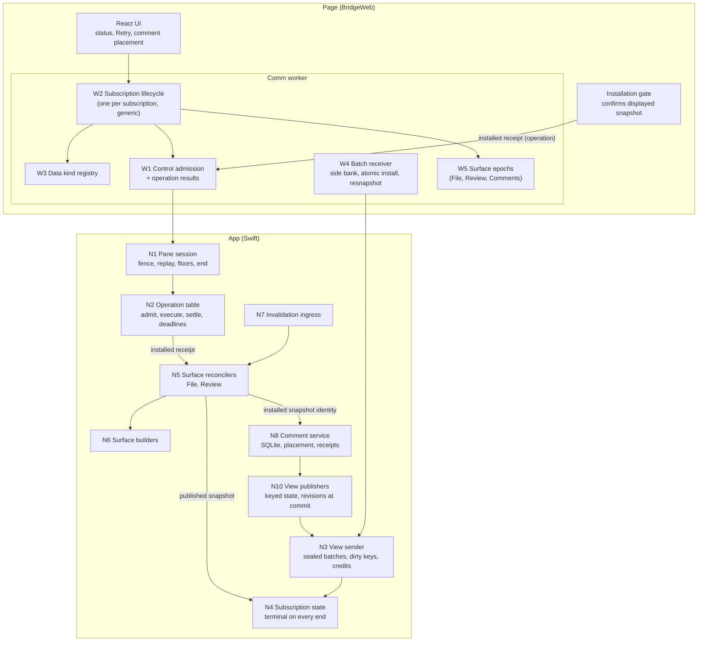
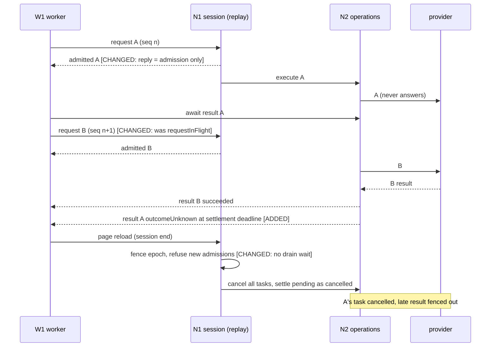
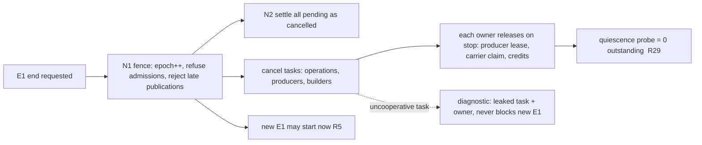
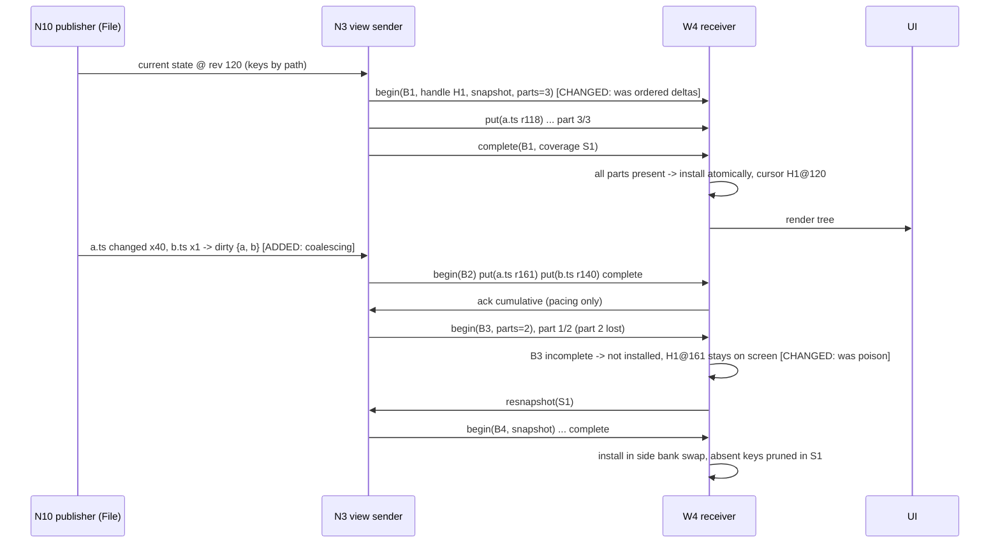
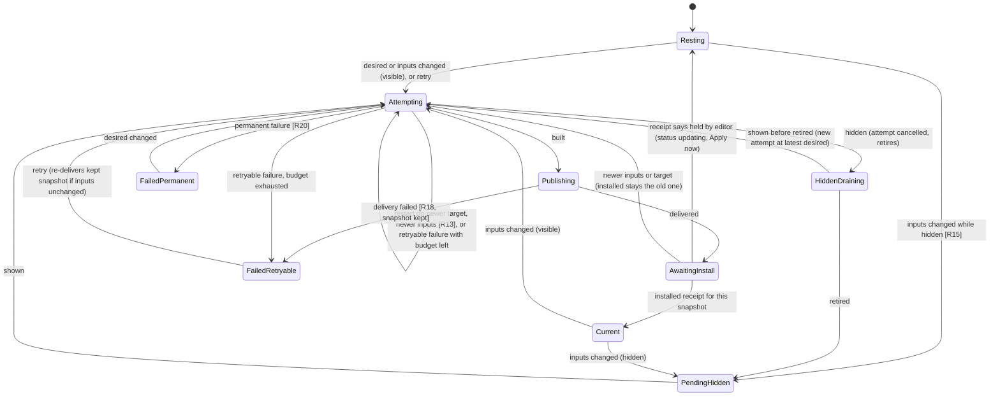
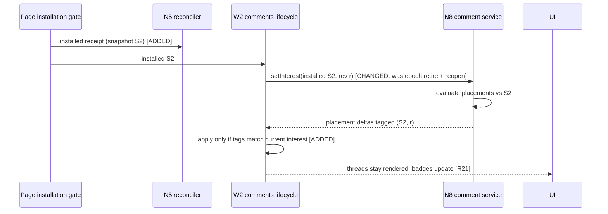
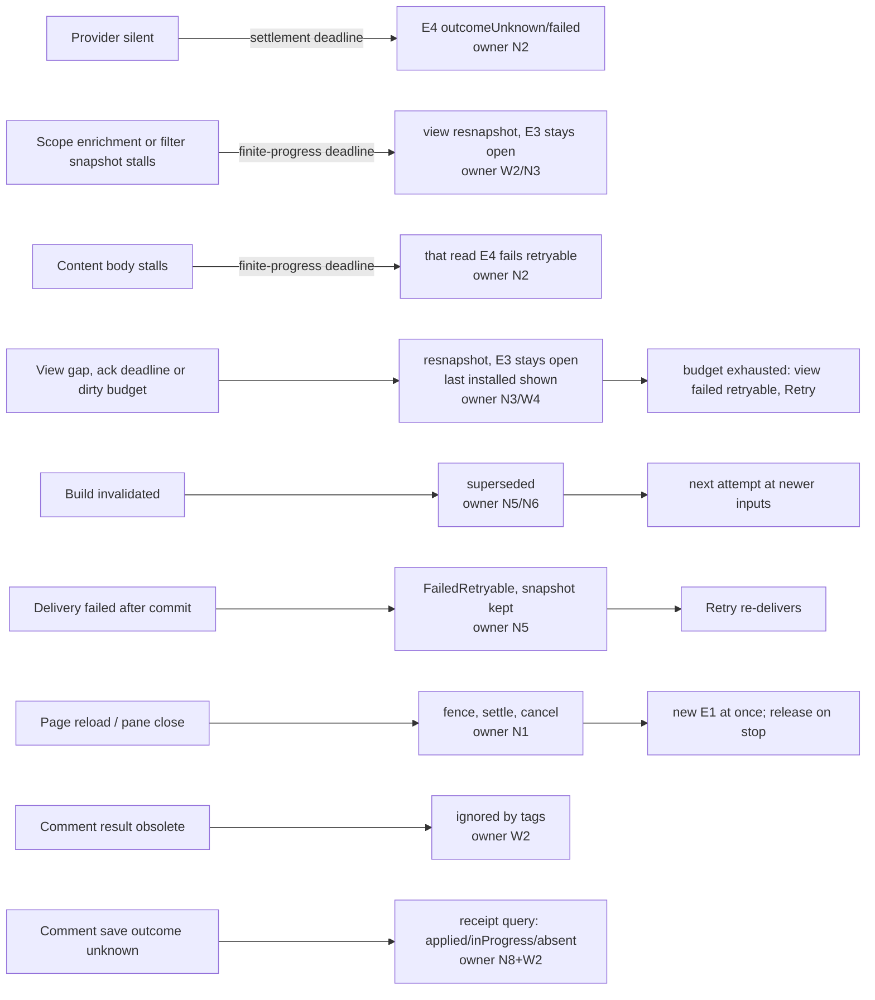
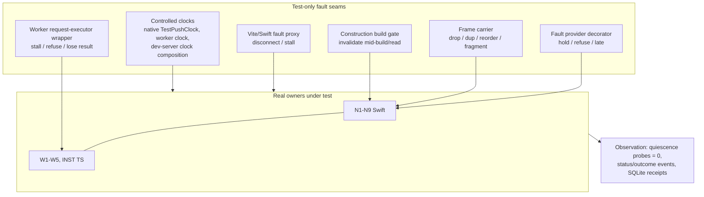

# Bridge Stability: Program Design

**How the Bridge will meet the [Specification](2026-09-24-bridge-stability-specification.md)** (E1–E18, R1–R32). The needs and boundary it serves are in the [Requirements](2026-09-24-bridge-stability-requirements.md). Current-system evidence lives in `tmp/2026-09-24-bridge-stability-research/`; it is cited by `file:line` at HEAD `97725b7ae`.

## The design in one picture

Six decisions carry the design:

1. **Settlement has an owner, and progress has a deadline.** Every wait is registered with the lifecycle owner that can end it: the pane session, the subscription, the operation, or the surface attempt. That owner ends the wait on its own terminal transition. Every wait on a peer's *progress* belongs to one of three deadline categories, each driven by an injected clock:
   - operation settlement;
   - finite progress, which covers a barrier after a response and the rest of a started body;
   - acknowledgement.
2. **Admission is serial and cheap, execution is concurrent.** Control requests keep today's exact-replay sequence protocol. But native answers each request as soon as it is *admitted*, and the operation's result arrives separately. One slow operation therefore never holds the sequence.
3. **Cancel is out-of-band.** A cancel or retirement never queues behind the work it ends. Native always admits it, even below the surface floor.
4. **Surfaces reconcile towards a desired state.** One reconciler per pane per surface (File, Review) replaces the shared task slot, the scattered generation counters, and the self-rescheduling tail. A snapshot counts as displayed only when the page confirms installing it.
5. **Comments are their own surface.** The *installed* File or Review snapshot is an interest of the comment subscription, not its lifetime. Comments are created against the version the user sees.
6. **Metadata is replicated as keyed state, in sealed batches.** Native is the single writer. Each view (subscription) carries an incarnation handle, per-key revisions minted at commit, and atomic batches that are installed only when complete. Per-key revisions are monotonic within one page-owned incarnation, whoever mints them: a native source context rebuilt under a retained view continues the view's revision counter rather than restarting it (clarified 2026-09-30). A gap means a staged **resnapshot**: never a dead subscription, never a blank view. Native coalesces changes per key, so a slow page sees the latest values, never a backlog. There is no CRDT and no Lamport clock; neither is needed with one writer.

*Read top-down: the page asks through admission (W1→N1→N2) and gets results separately. The app streams through per-subscription credits (N3→W4). Surfaces converge in N5, and "displayed" only advances when the page's installation gate confirms it. Comments are placed against whatever the page actually shows.*

## Selected direction and the alternatives we rejected

| Crux | Selected | Rejected alternative (still credible) | Why selected | Falsifier: what would reopen it |
|---|---|---|---|---|
| Where do waits end? | Owner-registered settlement plus three injected-clock deadline categories (R1, R3, R10) | Timeouts on every await | Timeouts on every await are unprovable, and they encode timing in behavior. With owners, a leftover-state probe can prove "nothing left" (R29). | A wait that no owner can end without an ad-hoc timer |
| Control concurrency | Serial admission, concurrent execution, results by operation id (N2, W1). Keeps exact replay (`BridgeProductControlReplayCache.swift:84-87,144`). | (a) One slot plus a deadline. (b) Per-lane sequence numbers. | (a) keeps S13 at deadline length. (b) needs a new multi-sequence replay protocol. Admission-only replay keeps today's proven replay and makes the in-flight window as short as admission. Cancel-before-open can't happen: an open is admitted, so known, before any later cancel. | Admission itself needs I/O |
| Metadata wire model | Keyed state in sealed batches, with resnapshot-only recovery in v1 (N3, N10, W4) | (a) Keep the ordered delta log and harden it with checkpoints. (b) State sync with "resume since cursor" patches. | (a) A gap is fatal (`bridge-product-subscription-state.ts:358`), overflow resets (`BridgeProductProducerRegistry.swift:176-215`), and a reopen wipes the tree (`bridge-comm-worker-file-metadata-projection.ts:103-112`). Hardening keeps all three couplings. (b) needs tombstone retention, a compaction floor and per-client view records. Resnapshot-only needs none of them, and never blanks. | A frame kind that is really a transition; a largest-tree resnapshot causing a visible stall; a second revision minter for the same data |
| Acknowledgement | Per-view credit windows, cumulative acks, pacing only (N3, W4) | (a) Per-frame acks. (b) One window per physical stream. | (a) keeps the one-in-flight pump (`BridgeProductSchemeAdapter.swift:445-460`). (b) lets one busy view end its siblings (R8). Acks carry no correctness once batches seal. | Acks needed to advance retained history (would make them correctness again) |
| Surface currentness | One reconciler per surface, with desired state, attempts, typed outcome and page-confirmed display (N5), plus builders (N6) | Patch the livelock guard (the rejected band-aid) | The band-aid keeps five copies of the Review generation and the self-rescheduling tail. The reconciler deletes them, and File and Review share it (U3). | A builder that can't report a typed outcome |
| Comment lifetime and creation | Comments surface with its own epoch; installed snapshot identity as an interest; creation bound to the displayed version (W3, N8) | Keep annotation subscriptions on the File/Review epochs; create comments by re-reading disk | Epoch binding retires comments on every reload (`bridge-product-metadata-application-registry.ts:99,125`). Re-reading disk rejects comments on a stale view (`WorktreeAnnotationSourceCapture.swift:670-683`), violating R19 and R22. | Placement that needs a lifetime-bound snapshot |

**Cost and who pays.** Three PRs of substantial change across Swift and TypeScript, and the Bridge wire protocol cuts over (approved). The refresh-admission coordinator's dirty facts and authority generations are folded into the reconcilers, so that code is rewritten rather than patched. Old comment data is discarded (approved).

**Accepted debt, builders.** Review construction keeps its shared build model and publication lease. File keeps incremental changeset publication. The builders wrap them and don't rewrite them. The payer is a future performance program.

**Accepted debt, continuous churn.** An attempt superseded by newer inputs restarts at them. While a worktree changes faster than one Review build, Review shows the last good snapshot as `updating` (R19) and publishes nothing intermediate. R12 requires convergence only once the inputs stop. The revisit signal is a measured starvation during agent write bursts. The fix would be "publish the completed attempt, then continue", which changes no contract.

## Components and ownership

| ID | Component | Owns (single source of truth) | Consumers | Status and current anchor |
|---|---|---|---|---|
| N1 | Pane session (`BridgeProductSession`) | E1 lifecycle, the admission fence, exact replay of admission, per-surface floors | Scheme adapter, N2, N4 | Changed. Replay covers admission only. Session end fences first and never awaits providers or drains (`BridgeProductSession.swift:692-702`; `BridgePaneProductSessionOwner.swift:296`) |
| N2 | Operation table | E4 state after admission: execution task, settlement, `outcomeUnknown`, deadlines, the result store, human-wait detachment | N1, scheme dispatcher, result requests | New; replaces the `pendingControl` slot (`BridgeProductSession.swift:459-507`) |
| N3 | View sender | E15 per view: batch parts in flight, cumulative ack acceptance, ack deadline, and the dirty-key set with its budget. Seals batches, and turns "over budget" or "ack deadline" into a resnapshot | Scheme pump, N10 | New; replaces the one-frame observation (`BridgeProductSchemeFramePump.swift:203-224`) and the event queue with its overflow reset (`BridgeProductProducerRegistry.swift:176-215`) |
| N10 | View publishers (File, Review, Comments) | Each kind's **current keyed state** and per-key wire revisions, minted inside the publisher's serialized update: the File manifest index (rows keyed by path, with parent and sort key), the Review publication (items keyed by id, staged per publication), the comment catalog (sessions and threads keyed by id; wire revision minted by N10 when it installs current rows, see *Comment revisions*) | N3 | Changed. The File source stops emitting position-based deltas (`bridge-comm-worker-file-metadata-projection.ts:191-229`). Comment commits stop pushing payloads after awaits (`WorktreeAnnotationServiceActor.swift:548-554`, `+MetadataPublication.swift:163,282-300`); they emit invalidations only. Transitions such as `file.invalidated`, `review.reset` and `controlChanged` become key values ("descriptor X superseded by Y") |
| N4 | Subscription state | E3 records; terminal on every end | N1, producers | Kept; floor terminals already exist (`BridgeProductSession.swift:773-788`) and become the rule |
| N5 | Surface reconciler (File, Review) | E8 desired state, attempts (at most one running and one retiring), the E14 surface failure, surface status, the installed E7 identity (from page receipts) | Invalidation intake, page Retry/visibility, N6, N8 | New; absorbs `activeReviewRefreshTask`, both Review generation counters, the File driver's retry state, and the coordinator's dirty facts |
| N6 | Surface builders (File, Review) | How one attempt builds and publishes | N5 | Wraps the existing File source/binder and the Review binder/package/publication |
| N7 | Invalidation ingress | Deciding whether an envelope is a material change | N5 via construction invalidation | Changed: equal-status snapshots are suppressed (`BridgeDevelopmentProductHost.swift:268`, `WorkspaceSurfaceCoordinator+FilesystemSource.swift:253`) |
| N8 | Comment service and source | E10–E13 in SQLite; placement; creation against the displayed version; mutation receipts | Comments subscription, output effects | Changed: version record, placement states, receipts table, evaluator relocation rule (`WorktreeAnnotationSourceEvaluation.swift:209-255`) |
| N9 | Human-wait effects (the Export destination picker) | Picker lifetime; a per-export write token; write admission fenced against session end | N2 (human-wait operation) | Changed: Export writes to a remembered folder with no dialog; the optional picker is modeless (`beginWithCompletionHandler:`, `NSSavePanel.h:199-201`) instead of `runModal()` (`WorktreeAnnotationOutputEffects.swift:67`); write fence in `WorktreeAnnotationOutputCoordinatorActor.swift:260-302` |
| W1 | Worker control admission (`BridgeProductControlMux`) | Page-side sequence and admission, operation-result requests, the worker settlement deadline | W2, product controller | Changed: admission chain stays serial but is cheap (`bridge-product-session-authority.ts:322-383`); results are awaited per operation |
| W2 | Subscription lifecycle | Each E3's page-side lifecycle, desired vs committed interest, recovery, typed failure, Retry | Product and comments controllers, UI | New; absorbs the per-kind reopen budgets (`bridge-comm-worker-product-controller.ts:466-617,751-807`) and the comment controller's counters |
| W3 | Data kind registry | E16 definitions (C-KIND) | W2 | Changed: comment kinds bound to the Comments surface |
| W4 | Batch receiver | Per view: stages a batch in a side bank, verifies every declared part, installs atomically, applies per-key revision rules, asks for a resnapshot on any gap, and emits cumulative acks | W2, N3 | Changed: no per-frame ack await (`bridge-product-transport.ts:681-742`); no sequence poison (`bridge-product-subscription-state.ts:358`); no wipe on reopen |
| W5 | Surface epoch authority | Transport-incarnation epochs for File, Review and Comments | W1, W2 | Kept; the advance no longer waits for cancels |
| INST | Page installation gate | What the page actually shows, and emitting the installed receipt | N5 (via W1), UI | Changed: sends a receipt on install (`bridge-main-review-presentation-installation-gate.ts:173-211,354-366`). An install-admission failure on the current candidate becomes a retryable surface failure whose Retry redelivers the unchanged publication; it is never a silent discard |
| W6 | Region presentation (U13) | Mapping each E20 region's inputs (its surface status, its demanded identity, its own read) to one presentation state, and the one shared renderer for Loading, Empty, Updating and Failed | File, Review, Comments and Markdown UI | New in PR1 (2026-09-30). A page presentation boundary only: it is not a second currentness owner, and it adds no timer, retry or atom. Pane failed-start Retry projects `AppCommand.reloadBridgeWebView` |

**Dependency and executor rules.**
- N5 and N6 run off the MainActor, in their own actors. The MainActor only publishes the surface status and applies the reconciler's already-decided outcome (CLAUDE.md, "Performance Lane Directive"). Blocking I/O in builders stays `@concurrent nonisolated`.
- The page never decides File/Review currentness. Native never decides comment presentation.
- Builders never schedule. Only N2 settles an operation. Only N4 ends a subscription.
- Deadlines and window sizes are `AppPolicies`. They are sent in session bootstrap.

## Interfaces that matter

**Admission and results (N1, N2, W1).**
- A control request is admitted in sequence with exact replay. Its reply means only `admitted(operationId) | refused`.
- Admission does no provider work, so the in-flight window is microseconds, and the existing single-in-flight replay rule holds.
- The result is fetched with a per-operation result request that native holds open until settlement. The settlement deadline and session end bound it. A repeat of the same result request returns the stored settlement.
- **Result capacity.** An ordinary operation reserves a result slot at admission. When every slot is taken, admission refuses it with a typed `resultCapacityExhausted`, and the page must first acknowledge settled results. The page acknowledges each result after reading it. That frees the slot, and nothing is evicted before acknowledgement or session end.
- **Mutation watch capacity.** A mutation also reserves a **watch** from a separate bounded pool (`AppPolicies`) at admission, before dispatch. A known outcome releases the watch when its result is acknowledged. When the pool is full, new *mutations* are refused `mutationWatchCapacityExhausted`, while reads and controls keep progressing. See [In-session late mutation outcomes](#delivery-shape-four-stacked-prs).
- **Escape controls never need a slot.** Cancel, retire and result acknowledgement settle in their admission reply and reserve nothing. So a full table can never block the way out.
- Human-wait operations reserve from a separate, small pool (`AppPolicies`), so a stuck dialog can't use up the ordinary slots.
- **Lost admission reply.** The wait for an admission reply is itself bounded by W1's settlement deadline, for every request, human-wait ones included, since only the human *effect* is exempt.
  - On expiry, W1 re-sends the identical request, and exact replay returns the stored admission, so the operation never runs twice.
  - After a bounded number of re-sends, W1 declares the session suspect and recovers onto a new session.
  - Recovery never queues behind the stuck admission: the old admission chain is abandoned along with the old session.
- Result requests are outside the serial admission chain. Waiting on one never delays another request's admission.
- A cancel or retire is admitted like any request, but it acts at once on its target, even below the floor. It settles the target's in-flight operations and never waits on them. An operation fenced before its effect began settles `cancelled`. A **mutation already dispatched** may still commit, so it settles `outcomeUnknown` and stays watched (below); acknowledging it never releases the watch early.

**Operation settlement (N2).**
- Every admitted E4 settles exactly once: `succeeded | refused | failed | outcomeUnknown | cancelled`.
- The **settlement deadline** turns silence into `outcomeUnknown` for a mutation that may have started, and into `failed` otherwise.
- Settlement does not stop execution. N2 also cancels the operation's task.
- A **late result is rejected by operation identity**: N2 accepts a completion only for an operation still in a live state. Any publication an operation makes goes through the same check, so a late result can't publish. The one exception is **evidence**, not settlement: a mutation settled `outcomeUnknown` is *watched*, and its later completion is recorded as `lateOutcome` evidence (below). That is never a second settlement, and it never makes the stale operation's own publications valid. Canonical state that a committed mutation changed still flows normally through N10.
- N1's session fence is used only when the whole session ends, never for a single operation's timeout. Healthy siblings in the same session are unaffected.
- A mutation that already started keeps its recorded and reconciled outcome (receipts, R26).
- Execution quiescence is tracked separately (see [Session end](#session-end-fence-then-release)).
- W1's own deadline is longer than N2's by a fixed margin. It only covers a lost result request or a native side that stopped answering. On expiry, W2 resyncs the session, and recovers onto a new session if the resync also fails. **Human-wait operations are declared at admission and exempt from both N2's settlement deadline and W1's.** A pending human result never triggers recovery; only session end cancels it (N9).

**Scope changes (W2, N3, N10).** Interest is the view's **scope**. **Scope is demand, never membership** (PR1 Q54/Q55): a view's keyed inventory, meaning File rows, Review items and the Comment catalog, is always complete for the view's authority (its worktree or comparison). Scope fields only choose what gets fetched or enriched first (content, bodies, placement). A filter on membership creates a loop: the page can't ask for keys it hasn't been told exist.
- `setScope(scope, scopeRevision)` is latest-wins, with at most one in flight.
- **Demand versus filter.** A scope has two kinds of fields.
  - **Demand** (interests: the selected item and the visible items) only **reprioritizes** native's pending enrichment work. Native then sends a sealed **enrichment batch** for newly demanded keys: content, bodies and placement, at each key's current value whatever its revision (R9b). Enriched content for keys that leave demand is evicted, but the inventory keys themselves stay. A demand change **never retires, closes or restarts an in-flight batch**. An in-flight batch completes and may install, because its data is still true, and continuous scrolling therefore can't starve a view.
  - The **filter** is the one membership parameter: the File view's change filter (see *Scope values*). A filter change redefines the inventory. Native answers it with a replacement snapshot under the new filter, which evicts keys that left (R9b), and that snapshot may supersede the in-flight batch. Review and Comments have no filter.
  - **Interim (PR1 review F13, 2026-09-29): File `pathScope` is treated as membership as well.** Whether folder or path scope should be demand, which would make the File inventory worktree-complete, is still open and depends on measuring the File inventory size on the largest worktree. Until that decision, `pathScope` is part of the filter, and W4 installs a File snapshot only if **both** `changeFilter` and `pathScope` equal the current values. That way a delayed narrower snapshot can't prune rows.
- **Demand comes from stable view state.** Interests derive from the view model: the selected item plus the items visible in the viewport. They never derive from active preparation jobs or from a transient empty render during an install. Equal demand mints no new `scopeRevision`. A demand that flips on every install is a feedback loop (PR1 fault-proxy run 7: 507 `setScope`s in 600 s).
- If an enrichment batch doesn't complete within the finite-progress deadline, W2 asks for a resnapshot at the latest desired scope. There is no committed-base rebase to reason about, because the resnapshot establishes the base.
- **Operation versus view barrier (PR1 QUESTION-26).** `setScope` and `resnapshot` are E4 operations ('change interest'): they go through sequenced admission and each **settles exactly once when native accepts the desired scope or resnapshot**. That typed result says nothing about installation. `scopeRevision` is the admission fence for latest-wins settlement only. It is not an install gate. At most one `setScope` per view is in flight, and it is latest-wins. A newer desired scope supersedes an unsettled one, which settles `cancelled`. A view **acknowledgement** (cumulative credits) is a slot-free escape control like result acknowledgement: it answers in its admission reply, is exactly replayable, and never waits behind an occupied result slot.

**Batches, credits and acknowledgement (N3, N10, W4).**
- A batch is `begin(batchId, handle, scope, base→target, parts)`, then `put(key, record, rev)` / `delete(key, rev)` / `evict(key)` parts, then `complete(coverage)`.
- **Snapshot batches** carry the view's whole inventory, and their completion prunes keys absent from that inventory. **Change batches** carry only dirty keys.
- W4 stages each batch in a side bank. At `complete`, it verifies every declared part and installs atomically. The previously installed state stays shown until then.
- A missing part, a conflicting duplicate, or a stale handle abandons the batch, and W4 asks for a **resnapshot** (v1 recovery). Resume-since-cursor is deliberately deferred.
- **Applicability: when a complete batch may install.** Every batch carries `(handle, scopeRevision, base, target)`, and N3 sends one view's batches in increasing `target` order.
  - W4 installs a **snapshot** batch only if its handle is current, its **filter** value equals the current filter, and its `target` is at or above the installed cursor. A batch built under an older demand (an older `scopeRevision` with the same filter) still installs.
  - W4 installs a **change** batch only if its `base` equals the installed cursor. Any other change batch is ignored, and a gap leads to a resnapshot.
  - A duplicate or delayed batch with a lower `target` is ignored. That covers a snapshot at revision 10 arriving after a change at 11.
  - Pruning at snapshot completion removes only keys whose installed revision is at or below the snapshot's `target`, so a newer key survives a delayed snapshot.
  - A scope change increments `scopeRevision`. A demand change evicts only the enriched content of keys that left demand. A filter change evicts the keys that left the filter. On A→B→A, the batch for the new A resends every newly included key at its current value, so re-entry never depends on remembered revisions.
- **Empty is complete, and only a snapshot certifies absence.** Any batch may have zero parts, and the receiver tells "declared zero parts" apart from "parts missing".
  - A zero-record **snapshot** certifies that its declared region is empty, and prunes it.
  - A zero-record **enrichment** batch means "nothing new to enrich". It deletes nothing: expanding a folder with an empty subfolder keeps every file already shown.
- Native keeps the **dirty-key set** per view, not an event queue. Fifty changes to one key coalesce into one record. When the set exceeds its budget, the view is marked resnapshot-required instead of queueing.
- **Credits return when a part is received, not when the batch installs.** Each view may have up to `creditParts` / `creditBytes` of parts not yet received. W4 acks cumulatively as soon as it has validated and staged a part, with one ack request in flight per stream; a lost ack request is re-sent.
  - So a batch larger than the credit window still completes: credits bound what is *in transit*.
  - Staging memory is bounded by the view's own projection size: the page can't display what it can't hold.
  - Install stays atomic, at `complete`.
- When a view's oldest unacknowledged part passes the **ack deadline**, that view resnapshots. Its siblings are unaffected. The stream ends for everyone only on transport-level failure.
- **Bounded resnapshot, without ending the subscription.** A resnapshot never ends the E3 and never clears the installed view. W2 counts consecutive unsuccessful resnapshots per view.
  - When the count reaches its budget, the view shows `failed(retryable)` on its surface. The E3 stays open, and the last installed state stays readable.
  - Retry starts the resnapshot again. **One Retry per surface** (owner 2026-09-27, PR1 Q52): it recovers everything that surface needs, meaning the view resnapshot plus the surface's own recovery job (File source refresh, the Comment body/placement query). Review gains its own metadata failure state for this, separate from its comparison-target Retry. The control and copy come from the command/display spec system.
  - The count resets on a successful install.
  - An abandoned staging bank is dropped, and its in-transit credits are returned.
  - Finite content reads are separate: their failures end only that read.
- **Where it matters for each kind:**
  - **File:** rows keyed by path, carrying parent and sort key, so the page computes the order. **First paint is progressive coverage, then one certifying snapshot (amended 2026-09-30; replaces "windowed per directory range", which needed range certificates this sender and receiver don't have).**
    - While the admitted scan enumerates, N10 sends **coverage** batches: cumulative, base 0, under the exact current handle, domain, incarnation and filter. Each is atomic, carries positive records only, and certifies no absence.
    - The scan ends with one **snapshot** carrying the entire accumulated frozen inventory at its captured target and filter, not just the last window. Only that snapshot prunes, certifies absence, and establishes source readiness. A stale scan is rejected before any batch is minted.
    - W4 admits initial coverage before `hasCertifiedSnapshot` without setting it. Per-key revision, tombstone and absence-floor fences apply to coverage. Behaviour after certification is unchanged.
    - Coverage installs have no certified-install side effects: they renew no recovery budget, don't emit ready, and don't discharge the obligation to deliver the final snapshot. The chain has one inter-window progress ender, owned by W2.
    - Rows from the old handle stay a separately marked stale bank until the final snapshot covers them. Failed enumeration never prunes.
    - The completing snapshot prunes only the single-domain membership it actually enumerated. Multi-root range semantics stay #367's.
    - The admitted scan is frozen while it's sent, so churn can't keep a snapshot from ever completing: newer changes go in the next batch.
    - **What freezes, and when a restart happens (C13 with C5, 2026-09-30).** An admitted File scan holds a consumer lease on its construction. A newer input advances the construction epoch for new acquisitions, but doesn't cancel the leased scan: the scan finishes and certifies. Release, shutdown, E1 end, zero consumers and real failure still cancel it. While the scan runs, N10 defers file changes as dirty keys and sends them as a change batch after the certificate; it doesn't mutate the index mid-scan. The File reconciler supersedes and restarts only when the scan's basis changes (root, change filter, path scope or membership), not for ordinary file churn. This keeps R13, where newer input is never Failed, and R12, which needs bounded work under continuous edits.
  - **Review:** one publication is one batch. Keys from different comparisons are never merged; a superseded, uninstalled publication is replaced whole.
    - **Record set (advisor round 6; PR1 QUESTION-20).** Today's six event kinds (`BridgeProductReviewMetadataEvents.swift:3-12`) are not wire concepts. They become:
      - **Item records**, keyed by the existing item id. Each carries everything an item means today (`BridgeProductReviewMetadataItemValues.swift:178-219`): path and both rename paths, change kind, binary and classification facts, provenance, review state, priority, sort key, and a **role-qualified** content descriptor for each role (base, head, diff, file), each with an explicit `available | unavailable | absent` state. Content invalidation is a new role value; replacing or removing a descriptor also fences stale content reads and caches. A descriptor an editor still holds stays under its separate installed identity. Extents (one line count per content role) stay inside the item. A late extent result merges into N10's **latest** item and emits its complete value, fenced by publication and that role's content identity, so an old count never attaches to replacement bytes, and enrichment never marks a pending comparison current.
      - **One publication record** (a typed reserved key) carries its own `publicationId` (matching the batch's) and revision (PR1 QUESTION-23), a `displayed` identity naming the last installed readable publication, and the comparison identity, target, source endpoints, comparison origin, query, summary, reviewed-subject metadata, publication revision, and status. Reset and failure are current state, never an instruction to clear rows. The failed *desired* comparison is kept distinct from the *still-displayed* publication, so a status put never relabels old content as the new target.
    - **Order and tree rows are derived on the page, preserving today's order.** Items carry explicit sort keys from `package.orderedItemIds` (`BridgePaneProductReviewMetadataSource.swift:510-513`), with a deterministic tie-break and stable derived directory identities; never alphabetical. The complete next index is derived before the atomic install, off the paint path.
    - **A new comparison is a complete replacement snapshot**, not generic coverage, because an item id shared by two comparisons must still take its new value. The whole publication is frozen, including an empty one, staged, derived, then swapped. Every change and enrichment batch names its publication as well as its scope revision, and updates from a retired publication never apply. The old displayed bank stays until installation and INST (R11-R14, editor holds).
    - One `default` domain. A typed Review installer in the page's application owner does the derivation; generic W4 validation stays kind-agnostic.
  - **Comments:** catalog keys (sessions, threads) are keyed state. **Message bodies and placement are pulled on demand** by the page, through the finite comment query, against the Review or File identity the page has installed. The page is the only party that knows which version it displays, so it asks when that changes, and native never guesses (PR1 Q50). Review placement is fenced to the installed publication identity. File placement is evaluated only against bytes verified to be the displayed File version. When those bytes can't be read, placement is **unavailable**, while the thread, its excerpt and editing remain (R23; owner, 2026-09-30, F9 option B, which supersedes PR1 Q51's accepted current-disk lag). The realization lands with comments in PR4. Comment *creation* stays bound to the displayed version. Thread and message changes from one transaction go in one batch.

**Merged seams with #367, the multi-root Files collection plus the annotation subject model** (owner decision C, 2026-09-25; evidence in `tmp/2026-09-24-bridge-stability-research/seam-comparison/2026-09-25-seam-comparison.md`).
- **File record key = identity, not address.**
  - The record key is the file's **canonical document location**. That is its identity, and #367 promises it doesn't change on regroup (#367 PD 653-657).
  - The **display key** (member-group prefix plus member-relative path, or `Open Files/…`) is a field holding the row's position.
  - The **read descriptor** (`m<digest(root)>.`… or `d<digest(path)>.`…; `BridgeFileCollectionLayout.swift:85,118` on `bridge-multi-root`) is a field too. Native descriptor routing stays authoritative, and a position grants no read.
  - When adding a member regroups a loose file (`BridgeFileCollectionLayout.swift:97-117`), that is **one put with the same key**: a new display key and a new descriptor. Selection, pins, drafts, editor, INST correlation and comments all follow the key, so none of them resets.
  - The serialized recipe (the key, and the display key and descriptor fields) is frozen in the shared Swift/TS fixtures (`Tests/BridgeContractFixtures`).
  - PR1 already keys File records by canonical location, which needs no #367 layout code, so #367 rebases with no key change.
  - `file.memberGroups` still maps worktree-relative locations to display keys.
- **One collection index, one revision minter.** #367 forwards each member producer's events asynchronously. The File publisher (N10) keeps one materialized collection index, and mints revisions **inside** that index's serialized update, never after an `await`.
- **The index owns the File record whole, including its newest read descriptor (advisor round 7; PR1 QUESTION-22).** Row, newest descriptor outcome and wire revision change together in one non-suspending index update. Descriptor materialization submits a **guarded outcome**, capturing the view or source incarnation, canonical key, owning member incarnation, the file's content and invalidation generation, a per-key attempt token, and the still-live read and interest admission. The index rejects a stale outcome, whether success or *unavailable*, and mints in the same turn. Once accepted, a descriptor never rolls back on emit failure; delivery recovers by resnapshot. The source actor's separate descriptor map and its rollback path (`BridgePaneProductFileMetadataSource.swift:785-802`) are deleted with the old event path.
  - **Read execution stays with the content reader.** Routing consults the index's canonical outcome directly, never an asynchronously copied map. The reader keeps filesystem containment, open validation, byte verification, and its exact issued-descriptor and admission checks (`+ContentReadPlan.swift:25-52`). The descriptor is evidence of native issuance, not permission derived from a row's path.
  - **An editor-held descriptor stays separate.** Installing newest B never rewrites an editor displaying A, resets its draft, or relabels its comment version. Reads of a retained A go through an explicit **retained-descriptor lease**, released when its display or read lifetime ends or admission is revoked. A retained identity never promises historical bytes.
  - **Multi-root (#367):** member indexes supply source-version *inputs*; only the collection index performs the guarded install and the view-wide mint. A regroup transfers ownership, position and newest descriptor atomically, keeping the canonical key and any held editor's identity; a late outcome from the previous owner is rejected. Descriptor routing still goes to the admitted member or exact loose file, never through a display path.
- **Comment revisions (advisor round 4; PR1 QUESTION-8).** The stored `semantic_revision` is a *per-row* concurrency token: each session, thread and message starts at 0 and counts its own edits. It is not a view cursor. It stays a payload field only.
  - A comment commit emits an **invalidation** (the dirty keys, including deletions, lifecycle and output changes), never a payload. Every relevant mutation emits one after its commit succeeds. Invalidations may coalesce, and their arrival order doesn't matter.
  - The comment publisher (N10) keeps a dirty-key set per view. It reads the **current** rows for those keys in one read transaction, and mints one positive wire revision per install, per handle, inside its own serialized update. Its content is therefore never older than its revision, whatever order the commits' continuations resume in.
  - A snapshot registers for invalidations *before* reading, so no commit falls between the snapshot and live updates. A new handle resets revisions, and recovery is a resnapshot.
  - **Invalidations are ranges (advisor round 5; PR1 QUESTION-15).** A commit invalidates every affected **session**, or its **worktree/subject** for output and lifecycle changes that name no session. A cross-session change invalidates each session. A deleted session keeps its id in the invalidation. The comment publisher reads the range's current rows and diffs them against its **own** installed key→range membership, so cascade-deleted threads and messages are still found after SQLite has forgotten their parents. The diff is taken against N10's canonical materialization, not the page's filtered projection. A range is certified coverage *inside* the domain, not a new cursor or recovery owner.
  - **Capture and install are one serialized discipline.** Overlapping captures (session, worktree, the initial snapshot, a resnapshot) install in order, and each installs its whole diff and mints its revision atomically, only if it was captured under the current handle. Invalidations that arrive during a read are kept for another pass, never cleared by that read's completion. A read isn't discarded merely because a newer edit arrived, so continuous typing can't starve publication.
  - **Pruning needs a complete, successful, coherent range read.** Only then does a range delete absent keys and advance its absence floor. A read failure, missing authorization, or scope exclusion is never certified emptiness; a range leaving scope is an eviction.
  - No migration.
- **Recovery domains (combined review F6; advisor 2026-09-25, rounds 1 and 2).** The generic batch rules above apply per **(view, domain, incarnation)**, not per view. A single-source view has one domain, `default`. The File collection has one `collection` domain (inventory, loose-document mapping, key ownership) plus one domain per member.
  - **Per domain:** each domain has its own cursor, base→target applicability, staging bank, dirty-key budget, resnapshot and retry count, and ack-failure attribution. One slow or churning member never resnapshots another, and never holds one back except through the explicit collection dependency below. A lost collection batch can delay members until the collection domain recovers. Cursors of different domains are never compared. The stream's credits are shared and scheduled round-robin across domains, and each domain's staging is bounded separately, so one domain can't starve another.
  - **Incarnation.** Removing and re-adding a member mints a new incarnation. Batches from an old incarnation are rejected, so nothing revives.
  - **Key ownership is derived from membership.** The installed collection inventory maps each key range (a member's root, or a loose document) to exactly one owning domain; that also answers first admission for a key never seen before. A member batch may put, delete or prune only keys its domain owns under the installed inventory. Ownership moves only through the collection domain's sealed **transfer**, which moves the row's ownership, display key, read descriptor and last-good state together (a regroup is a same-key put). The displayed descriptor that protects an open editor is kept separately from the row's newest descriptor.
  - **Ordering dependency.** Every member batch names the collection revision it was **built** against (`requiresCollection`). That is the revision captured when N10 built the batch, never the latest one at send or retry time. W4 installs it only once the installed collection cursor is at or above that revision; until then it stays staged within the domain's bound, and if the dependency can't arrive, that domain resnapshots. This covers both delivery orders: a delayed member snapshot can't reinstall or prune a transferred key, and a member change that arrives before its transfer waits for it instead of being dropped. An ownership mismatch never counts as coverage. The collection batch never waits on member content, so there's no cycle: membership completion means the inventory and mapping are complete, not that every member has been scanned. It may install new groups with explicit `loading` or `failed` member status.
  - **Newest wins per key.** N10 mints File revisions with one minter, so they compare across domains. A put or delete applies only if its revision is above the key's installed revision. A deletion leaves a bounded **tombstone** (key, revision, owner) until a snapshot of the owning range certifies absence at or above it, so a stale write can't resurrect a deleted key. When a snapshot certifies absence and compacts tombstones, it leaves an **absence floor** for that certified range (the certifying revision). Every later write to a key in that range consults it, including collection-domain transfer and snapshot puts, so a delayed collection batch can't resurrect a key either. N10 rejects stale producer input (an old member incarnation or scan generation) *before* minting, and a snapshot's `target` is captured together with its frozen contents.
  - **Coverage and pruning.** A snapshot prunes only keys that its domain currently owns, within ranges it certified successfully, and with installed revision at or below its target. A failed member keeps its rows marked stale, and they are never pruned. Explicit membership removal evicts them.
  - A keyed **member-status** record lets the page tell "loading" from "empty". There is one per File domain; PR1 has only the `default` domain. It is a reserved record in that domain's sealed batch, not a separate frame or cursor, so it installs atomically with the rows and exists for an empty tree.
    - It carries the source identity and generation, a status of `loading | ready | stale | failed`, and the nullable worktree git facts the File surface shows today: branch, ahead/behind, and staged/unstaged/untracked counts.
    - Its revision is minted by the File index minter, like the rows.
    - `failed` and `stale` keep the last-good facts, marked not current, per the stale-presentation rule; they never clear them.
    - This replaces today's separate `file.sourceAccepted` and `file.statusPatch` events (PR1 QUESTION-28).
- **A new handle replaces everything, range by range.** A new handle resets every domain and per-key revision. The old handle's rows stay as a **stale presentation bank**. They are readable and marked stale, but they're never authority for revisions or descriptors. Each successfully certified range of the new handle replaces its stale rows. A failed range keeps them stale. Stale rows of domains that no longer exist are dropped with the new membership batch. No zombie row survives as current.
- **Multi-root obligations this design keeps** (from #367's `docs/specs/2026-09-12-bridge-navigation/`, as stated by its orchestrator on 2026-09-25):
  - Receiver navigation **ownership** is unchanged. Review stays one worktree; a Files transition never rewrites Review state. Its **persisted shape changes in PR2** (see *Receiver storage* below). #367's unshipped `local_bridge_navigation` is amended before merge.
  - **Pane links are membership, recorded per contribution** (owner, 2026-09-26; Panes, workspace-control and the shared advisor agree, board thread `01a0cdc9` seq 1855–1876).
    - A pane's worktree and repo links ARE its receiver's multi-root membership. There is one source of truth, with no second list.
    - A link is the effective item over one or more **contributions**, one per author. The owning runtime stamps `addedBy: agent(SessionRef) | person | app` and `addedAt`. A caller never nominates its author.
    - An add by a new author inserts a contribution. An agent removes only its own contribution. The person removes the link with all its contributions.
    - Order belongs to the effective item and survives until the item disappears. A contribution owns only its authorship and time.
    - The receiver also keeps **PR references**: a separate contribution kind for pull requests with no local known worktree. They're never members (R16 refuses unknown worktrees).
      - Identity is the canonical forge identity (host, owner, repository, number), never a local repository id.
      - No repository is registered just to fetch a reference.
      - Duplicates merge at presentation only.
    - **The git/PR summary moves owner.** This is #367 navigation-spec R19 (not this Specification's R19), formerly Bridge's B3. See *Pane-link port and git/PR summary delivery* below. Its obligations are unchanged.
    - The current-CWD member stays protected from removal. Protection is **derived** from the owner's current terminal association (`BridgeNavigationRecord.swift:54` on `bridge-multi-root`), never persisted, so no row can restore stale protection. When protection moves, the original insertion provenance is kept.
    - A drawer terminal maps to its owner pane's receiver. If the drawer owner moves while an operation waits, the result is `staleOwner`.
  - **Activation and draft barrier.** A source switch settles drafts first, and a refused flush keeps the old document.
    - **Navigation sequencing stays in `BridgeNavigationCommandHandler`**, at receiver level. It spans old-session preparation and new-session activation. Every *transport* operation stays bound to one pane session: when a session is replaced mid-activation, that session's operations settle `cancelled` and the handler re-issues in the new session. No E4 is carried across a session fence.
    - The receiver **navigation generation is captured before discovery** and checked before every effect and every receipt. Today admission is acquired after awaits (`BridgePaneController+FileActivation.swift:43-58`), and the generation is checked only after arrival (`BridgeNavigationCommandHandler+Activation.swift:58-60`), which is too late.
    - **Across a session replacement**, the receiver-level activation has a finite-progress deadline and a bounded re-issue budget, and ends with a typed outcome when either runs out. A draft flush whose outcome is unknown counts as **refused**: the old document stays.
    - **Capacity.** The receiver-level activation is not an N2 operation and holds no ordinary result slot. Its prerequisite operations (draft flush, installed receipt) have bounded capacity that doesn't depend on the waiting parent.
    - Activation completes on a **generation-matched INST receipt**, and a human selection supersedes it, including for the same file.
  - **Two completion predicates** (combined review F3):
    - **installed**, the INST receipt: model and content are installed, independent of paint and visibility. N5 consumes it for currentness, and activation for sequencing.
    - **shown at line**: the selection is installed **and** the requested line has been scrolled into view. It depends on paint, so it is observed only while the page is visible. navigation and IPC callers that asked for "reveal at line" consume it.

    A hidden page answers "installed, not shown". Losing visibility, or a human superseding the selection, settles "shown at line" with a typed outcome (hidden, or superseded); it never reports success.
  - **The INST receipt core lands in PR2's first integrated slice** (advisor round 4; PR1 QUESTION-11), before #367's activation uses it. The page receipt owner it extends (`use-bridge-file-viewer-selection-receipts.ts`) exists only in #367, and PR1 has no consumer for it. PR3's reconciler extends the same owner. PR1 stands on its own transport proofs. A receipt is emitted when the model and content are installed, independent of paint and visibility. It is correlated by session and source, selection generation, command identity and displayed descriptor. So two selections in one publication are distinguished, and a human selecting the same file never inherits a native command's identity. Today receipts are inactive-gated and correlated by file id alone (`use-bridge-file-viewer-selection-receipts.ts:100-120`). Hidden preparation keeps #367's no-focus, no-visible-selection-change contract. An IPC "shown at line" is never reported from metadata installation alone.
  - **Agent show (R39): background or take over, decided by the agent's request.** Owner decision 2026-09-27: no agent-side waiting states, admission/settlement split, visibility or draft pre-checks, or retention machinery.
    - **Background** writes the file into the receiver's opened-document inventory with its line, through the existing receiver storage. The IPC handler (Panes PR B, `pane.file.show`) posts the one `.notice(importance: .info)` with `.openFile`. Bridge posts no notification. Nothing is sent to the page and nothing on screen changes; a page that is (or later becomes) mounted just shows the new Open files row. Opening that row later is an ordinary human activation at the stored line.
    - **Take over.** The **IPC layer** owns the approval gate (`PermissionBroker`, inbox `approvalRequested`); Bridge never asks. On approval, IPC calls Bridge `show(takeOver)`: a background open, then the **human** activation path below, so unsaved-edit handling is the human's own. The result is `shown`, or `opened` when the human path didn't display it (a kept draft, or the user moved on). On decline, IPC calls `show(background)` and replies `declined`.
    - One request, one reply: `opened · shown · declined · notFound · paneUnavailable`. `declined` is produced only by the IPC gate.
  - **Activation sequence.** An activation carries the dependency it needs: `(handle, domain, incarnation, required domain cursor, key)` plus the selection generation (commands and rows travel on routes with no ordering between them). It validates the key's current ownership **and** current-scope coverage, not only the cursor. If a transfer or a scope change moves the key while the reveal waits, the reveal retargets within the same bounded navigation attempt. It resolves the admitted canonical document, then pins its key into the File view's scope. Native answers a pinned key by **point lookup**, without waiting for its member's scan to finish, and adds the ancestor coverage the pin needs, even when the directory is filtered out or unopened. So a reveal into a member that is still scanning never exhausts a deadline for the whole view. It then awaits a correlated installation. Only successful complete coverage establishes "not found"; a deadline expiry settles unavailable and retryable. Today missing rows are rejected immediately (`use-bridge-file-viewer-control-event-listeners.ts:119-125`), and the selection promise is discarded (`bridge-file-viewer-app.tsx:407-409`).
  - **Non-render state never waits on paint (clarified, advisor round 8).** Batch install, the logical index, selection, content requests and control replies complete while the page is hidden. Applying a tree's model and committing its DOM rows is *application* work, not paint: it runs on a bounded **task** scheduler, not `requestAnimationFrame`, whether the page is visible or hidden. Each turn is bounded by operations and bytes, superseded render state is coalesced, scheduling stops when idle or disposed, and visible panes go first. Applying received state never starts hidden Review builds or speculative content reads. Only visual measurement, scroll, and visible-frame confirmation use rAF. DOM rows existing while occluded are not proof of pixels. So R39's 'shown at line' stays visibility-dependent, and a hidden page answers 'installed, not shown'. The INST receipt means *installed in the page model*, not painted. A coherent previous view is kept until the next complete projection is ready.
  - **Lifetimes are separate, and recovery replays what it re-exposes (PR1 implementation, 2026-09-30).** A native producer's lifetime is not its view's lifetime. Cancelling a producer on resume or context rebuild releases only its own claim on the view's batch scope, and only the view's own end (cancel, incarnation replaced, session revoked) retires the handle. A comment projection that is stale against its source re-queries against the currently installed File or Review snapshot; it never cancels or reopens the File or Review subscription. When a Review successor is re-exposed after a predecessor's installation is refused, Comm republishes that successor's certified display bank before `candidateReady`, and the installation gate re-evaluates a ready candidate once its source becomes ready. A transient refusal is never a terminal state.
  - **A painted fulfillment is a claim about the page, and the page keeps it honest (PR1 implementation, 2026-09-29).** The worker records a render fulfillment as painted when Main reports the paint. Only Main knows when that claim stops being true, so every Main purge of a copy it reported painted sends a `paint.released` render receipt on the existing Main-to-worker receipt channel. On an identity match the worker moves that fulfillment back to desired; a stale identity is a typed no-op. Demand re-admits the item only if it is selected or visible, from resident content where possible. A filter that hides and restores an item within the same exact publication keeps Main's copy, so no release happens. What counts as a changed item is one authority: the runtime item signature (content and render identity, never the publication id). It drives both the refresh impact and source churn. Every loading state reaches exactly one terminal, including a render deduplicated against an identical painted publication.
  - **Pane-link port and git/PR summary delivery** (board thread `01a0cdc9`, final union seq 1876; PR B mirrors it through `PaneLinkMembershipPort` / `PaneRevealPort`). Shared authorization, validation and unavailable errors stay outside these unions.

    | Operation | Outcomes |
    |---|---|
    | Add a member | `added(effect: newItem \| newContribution)` · `alreadyPresent` (this contributor already exists; authorship never transfers) · `refusedUnknownWorktree` · `staleOwner` · `staleReceiver` · `unsupportedReceiver` |
    | Remove a member | `removed` · `alreadyAbsent` (no such item) · `refusedProtectedCurrentDirectory` · `refusedNotAuthor` (an agent with no own contribution on an existing item) · `staleOwner` · `staleReceiver` · `pendingDraftSettlement(operationId)` |
    | Pending removal, terminal | Revalidated after the wait: `removed` · `alreadyAbsent` (no item at all) · `refusedProtectedCurrentDirectory` · `refusedNotAuthor` (agents only: the item now exists only through other authors) · `staleOwner` · `staleReceiver` · `draftKept(reason: refused \| saveFailed \| saveOutcomeUnknown)` (membership **known kept**) · `membershipOutcomeUnknown` (the membership commit was dispatched and its effect is uncertain) |
    | Add or remove a PR reference | The member cases, without `refusedUnknownWorktree`, CWD protection, or draft cases |
    | Agent show (R39) | `opened` (background: inventory + notification) · `shown` (take over, approved, human path) · `declined` · `notFound` · `paneUnavailable`. Exactly one reply. |

    - A draft settlement happens only when the **effective** membership disappears, never when one of several contributions goes.
    - **Precedence.** No other command supersedes a membership mutation. Each one settles by revalidating at its own effect point, after any draft wait, against the authoritative transaction state. The same state therefore maps to the same outcome for immediate and pending removals, for every caller.
    - `requestedBy` is stamped by the runtime. `reason` is bound to that request's selection generation, so a superseded request never relabels later content.
    - Reveal targets are a canonical file, with an optional line.
    - PR and artifact targets settle `unsupportedTarget`. A branch-name match cannot resolve a PR (forks, several matching worktrees, no local checkout, uncommitted work), and a local worktree's Review is not the PR diff. A PR target needs its own contract first, covering canonical PR and head-repository identity, ambiguity, and the Review comparison.
    - **Shared fixtures:** `Tests/BridgeContractFixtures/pane-links/` and `…/reveal/` are published by PR2 and imported by PR B's stand-ins. They cover drawer moves, draft refusal, duplicate contributions, missing targets, page replacement, and lost receipts. The stand-ins stay unverified until the real Bridge integration passes.
    - **Git/PR summary delivery (navigation-spec R19; replaces B3).**
      - PR B owns the pure, off-main summary derivation. It takes values and does no IO.
      - Forge owns fetching and facts. The pane-context revision bumps when the pull-request summary state or any member row changes, not on Forge facts the summary doesn't carry, such as mergeability or draft (PR B Spec R32).
      - PR C owns the one shared stateless chip-and-popover component. Bridge's bottom bar, the Panes row and the drawer row consume it.
      - Any visible consumer keeps the demand alive, and hiding one never cancels another's.
      - The chip shows only a PR icon, a count and a state glyph, with color carrying the state (✓ green, ✗ red, ◌ blue running, grey no info).
      - The navigation-spec R19 words appear only in the tooltip and the popover header, and the popover shows provenance.
      - Bridge adds no variant of its own.
  - **Receiver storage (owner write-pattern rule, 2026-09-26).** Tables are split by write pattern, not by leaf kind. There are no triggers, no CHECK constraints (no boolean remains), no FK cascades, and no JSON records.
    - **`bridge_receiver_state`** holds current values, one row per `(workspace_id, receiver_pane_id, kind, item_key)`.
      - Kinds: `filesFilter | selectedFilesDocument | reviewSelection | surface | reviewComparison` (keyed by worktree) `| itemOrder` (the effective item's ordinal) `| openedDocument`.
      - `openedDocument` is app-owned inventory: one entry per canonical location, with `requested_by` provenance. Closing removes it.
      - Each kind has typed columns.
    - **`bridge_receiver_item`** holds contributions, one row per `(workspace_id, receiver_pane_id, kind, item_key, contributor_key)`.
      - Kinds: `member | prReference`.
      - `contributor_key` is non-null: `app | person | agent:<canonical SessionRef>`.
      - Its typed columns hold the worktree id, or the forge host, owner, repository and number, plus the contributor's session and `added_at`.
    - **Keys.** `item_key` is one lossless canonical codec per typed identity, with no delimiter concatenation. Every read verifies it against the typed columns, and a row whose columns don't fit its kind is rejected and reported.
    - **Ordering.** Every write carries the receiver's command generation and applies only if it is newer **for its own key**. There is no receiver-wide floor, because keys are independent.
      - A keyed delete writes a **tombstone**: the row stays with `is_deleted = 1` (a boolean) and the deleting generation. A stale write to that key is therefore still rejected after deletion.
      - Reads skip tombstones.
      - A tombstone is overwritten by a newer write to its key, or purged with the receiver.
      - A UI save that references a member with no live contribution is rejected in the same transaction (PR2 QUESTION-2.1c-2).
    - **Membership and PR-reference mutations commit durably first.**
      - One repository transaction includes their dependent changes; for example, removing a member drops its `reviewComparison`, its `itemOrder`, and a `selectedFilesDocument` under it.
      - Then the atom publishes, guarded by that generation.
      - If the commit fails, the atom is unchanged and the result is the shared unavailable error.
    - **The current-CWD member is derived for presentation.** Effective membership is the committed contributions plus the derived current-CWD member (`.app`, protected). The synchronous presentation paths render it immediately, and its durable `.app` contribution commits asynchronously through the same commit-first path. Membership mutations are serialized per receiver in the non-MainActor `BridgePaneLinkMembershipActor` (the port implementation, with one ordered ingress stream; the MainActor only yields raw snapshot requests, PR2 QUESTION-2.1c-11), so a later removal always observes an earlier admission's committed row. When the CWD moves, the old member keeps its committed `.app` contribution (PR2 QUESTION-2.1c-4).
    - **Effect-point topology.** After any draft wait, one MainActor hop *reads* the owner and CWD into a Sendable topology snapshot. It is a read only; no processing happens there. Owner preflight, CWD protection, the membership rules, revalidation and the transaction all run in the repository actor from that snapshot. The linearization point is the capture: a drawer move after it is a later event (PR2 QUESTION-2.1c-5).
    - UI current values (filter, surface, selection) stay atom-first, with keyed, generation-ordered saves. Losing the latest unsaved UI preference to a crash is accepted. An orderly shutdown and restore still keep them.
    - **Coupling invariants between the two paths** (shared advisor, seq 1879):
      1. **Membership-induced UI changes commit with the membership.** One transaction carries whatever the removal clears or resets: the Files selection, affected opened documents, a member filter, the Review fallback, and the comparison and order state. `BridgeNavigationMembershipRules` (`BridgeNavigationMembershipRules.swift:103-135` on `bridge-multi-root`) already computes this as one removal result, and that whole valid result is what gets persisted.
      2. **A stale UI save cannot resurrect.** A queued UI save is checked against the authoritative transaction state: its generation, whether the members it references still exist, and retirement. Deleting a row never erases the condition that rejects a stale write.
      3. **Committed membership always publishes.** A newer, unrelated UI generation never suppresses publication of a membership effect that has already committed. The committed membership is reconciled into the latest valid projection, and newer UI choices are kept only where they are still valid. Superseding a command *before* its effect is not the same as publishing an effect that already committed.
    - **Proof:**
      - A queued selection save at g10, then that member removed at g11, then the g10 save delivered: the selection stays cleared.
      - A membership commit at g20 is delayed, an independent UI action at g21 publishes, then g20 commits: the atom shows the g20 membership and keeps g21's UI choice where it is still valid.
      - A crash between the commit and the publication: on restore, the atom shows the committed membership.
    - **Retirement.**
      - Retiring a receiver revokes access at once and records a stable `purge_after`, about 24 h after undo retirement, owned by the same retirement path as PR B.
      - The repository rejects late writes to a retired receiver.
      - It purges all that receiver's rows in one transaction.
      - Retention grants no resurrection.
    - The repository is the only writer. There is never a whole-workspace rewrite; today's `replaceBridgeNavigationRows` DELETE+INSERT is removed.
- **The collection is the File view's content.** #367's `BridgeFileCollectionSource` feeds N10. Members may be **0..n**.
  - **Membership update = one sealed batch.** The ordered inventory, the loose-document mapping, `membershipRevision`, and every eviction or replacement of rows that the membership change affects install together. Today they are emitted separately across suspension points (`BridgeFileCollectionSource+Membership.swift:35-58` on `bridge-multi-root`), which would let new rows install with old mappings. A member's full scan can then complete in later batches, each with its own coverage.
  - **The File view's scope is separate from membership.** Scope = member-qualified browse ranges, plus the change filter, plus pins (the open file, a pending reveal). Membership says which members exist.
  - **Coverage is per member.** A snapshot's completion certifies absence only for the ranges that enumerated successfully. A member that fails keeps its previous rows, marked unavailable or stale, and is never pruned. The current collection-wide final window after a member failure (`BridgeFileCollectionSource+MemberForwarding.swift:47-60,118-135`) must not be translated into a whole-scope snapshot.
  - `membershipRevision` stays a domain payload; `scopeRevision` stays the transport fence.
- **Change filter per member (U12).** Each member computes its own changed set: `uncommitted` against its HEAD, `originDefaultMergeBase` against its own origin default. A member with no origin default (or whose diff fails) reports a member-level failure; it never reports empty matches, and never borrows another member's baseline. The collection's first-member status summary (`BridgeFileCollectionSource.swift:217-227`) is not changed-set authority. Loose documents and the open-file pin are explicit filter exceptions; loose documents are marked "not in git".
- **Comments: subject plus version.**
  - Keep #367's session **subject**, a Git worktree or a local file (the "where").
  - Add our E12 **version record** on the thread and group (the "which bytes"). For local files, it is the file content identity.
  - #367's `scopeKey` becomes the comment view's **scope value**: the Files collection token, or the Review worktree, together with the receiver's current **admitted subject set**. It is no longer a lifetime. Epoch-bound catalog retirement is removed, because the Comments surface owns lifetime.
  - **Authorization is by subject, not by the pane's worktree, and depends on the operation.**
    - **Creating a root thread** establishes source provenance. It needs the admitted subject plus validation against the installed descriptor and version (below).
    - **Editing, replying, and receipt discovery, query and confirmation** need the admitted subject plus thread, revision and edit-token (or operation and payload) identity. They do **not** need the thread's version to be the one currently displayed, so a thread written on A stays usable while B is shown (the current reply path already works this way: `WorktreeAnnotationTransportAdapter.swift` createReply on `bridge-multi-root`).
    - A local-only or multi-root receiver works the same way. E12 records which bytes; it does not replace subject authorization.
  - **A subject survives regrouping.** Adding a member that contains a loose document moves the file out of "Open Files" (`BridgeFileCollectionLayout.swift:97-105`), but the comments' local subject stays as it is, and so do its catalog visibility and exact-file authority. Today annotation scope is recomputed from layout (`BridgeFileCollectionSource+Annotations.swift:12-21`), and local refresh requires the loose entry (:175-180); that would drop the comments from the drawer. Where reading is no longer authorized, placement shows unavailable.
  - Placement uses our labels (attached, moved, outdated, unavailable) and our excerpt-only matching rule, for Git and local subjects alike.
- **Migration.** #367's migration 017 (subject columns on `annotation_session`) is the base. Our **018**:
  - deletes all existing annotation rows (owner: drop old comments);
  - adds `version_record_json` to `annotation_thread` and `annotation_session`;
  - adds `annotation_mutation_receipt(operation_id TEXT PRIMARY KEY, payload_digest TEXT NOT NULL, outcome TEXT NOT NULL, thread_id TEXT, message_id TEXT, created_at REAL NOT NULL, confirmed_at REAL)`. Unconfirmed receipts are never evicted by age.
- **Output.** Copy and export carry the subject, E12 and placement. Delivery stays human-mediated, as in #367.
- **Search is not the tree** (combined review F2). #367's collection search (`bridge.files.search`, `fileCollectionSearch`) is an operation with its **own input coverage**: it gets complete metadata for the search scope it was asked about, from the member sources, independent of the File view's change filter or browse ranges. Its matcher, source authorization and partial-coverage reporting are unchanged. A filtered tree never becomes search's input, and filtered-out coverage is never reported as search completeness.
- **Transport.** All #367 payloads (member groups, annotation catalogs, file-collection search as an operation) ride the v2 envelope. #367's current reliance on per-frame acks, sequence poison and reopen wipes is replaced when it rebases onto PR1.

**Three routes, unchanged in shape.**

| Route | Carries |
|---|---|
| Command | Admission, result requests, acknowledgements |
| Stream | One always-on metadata stream per pane session, multiplexing every E3 (file metadata, review metadata, file and review comments) |
| Content | One finite body per content read (file bytes, review item content), separate from the metadata stream |

A content read is an E4 with a finite body, addressed by descriptor, so a repeat returns the same bytes and it can be retried safely. Its chunks use the same credits and cumulative ack, scoped to that read. That replaces the old per-frame ack await, and both native exact-frame gates are removed. **Content credit lifecycle (PR1 slice 1.5, 2026-09-29):**
- The ack covering the `content.accepted` opening sequence is mandatory before any source access. It is the authority barrier.
- Data acks pace the window.
- The page completes the read once it has received and verified the terminal frame, and sends no final ack.
- Native releases the read's credit scope when the producer ends (terminal sent, failed or cancelled). It never waits for a final ack.
- A late ack for a read that has already ended gets a typed "unknown read" refusal. That is a definite answer, so it is harmless: it never raises session-suspect and is never retried.

Its rest-of-body stall, and the wait before the opening ack, are bounded by the page reader's finite-progress deadline: the page owns the deadline and aborts the read, and native ends the producer when the request stops or the session ends. Native keeps no second content timer (clarified 2026-09-30). A read for a descriptor that has moved on answers a typed `superseded`. A stalled or cancelled content read ends only itself, never the metadata stream.

**File tree change filter (U12, R33–R38).**
- **Scope values.** The File view's scope gains a change filter: `none` (all files), or `changes(baseline, kinds)`. `baseline` is `uncommitted` ("Uncommitted") or `originDefaultMergeBase` ("All Changes"). It is deliberately a union, so that a future checkpoint baseline (`commit(oid)`, for turn- and time-based diffs, which is a separate project) is additive, with no wire break. A filter change is the membership kind of scope change (see *Demand versus filter*): a replacement snapshot under the new filter, with evictions (R9b). A lazily loaded tree can't be filtered page-side, because changed files deep in unexpanded folders aren't loaded.
- **Changed-set sources, owned by the N10 File publisher.**
  - `uncommitted` comes from the **rich SDK status facts** (typed `indexState`, `worktreeState`, untracked, previous path). They are read through the existing Bridge-owned scheduled status read (`AgentStudioGitBridgeReviewDataClient+GitIO.swift:236`), and normalized with Review's existing status-kind normalization (`AgentStudioGitBridgeReviewDataClient.swift:655`), so File and Review classify the same raw facts the same way. The Core `GitWorkingTreeStatusProvider` summary the File source reads today is lossy: it can't tell Added from Modified, or find Deleted or Copied. It is **not** the changed-set source, and the shared Core contract stays unchanged. Untracked counts as Added. A rename keeps its previous path. Deleted paths become ghost rows. (Delta review U12-F1.)
  - `allChanges` comes from a **files-only** diff against the merge-base with the origin default branch. That is Review's default target, `WorkspaceReviewContributionTarget.originDefaultBranch` with basis `.commonCommit` (`Core/Models/BridgePaneState.swift:66`), and it is independent of the pane's current Review selection. It runs through the existing `agentstudio-git` diff that the Review data client uses (`AgentStudioGitBridgeReviewDataClient+Contribution.swift:165`). It is scheduled through the git scheduler, only while that filter is on, and recomputed per input generation. It never starts a Review package build (R36, U8).
- **Rows.** Matching paths plus their ancestor folders. Deleted paths become **ghost rows**, `kind = deleted`, with no descriptor, so they can't be opened; ghost parent folders appear where a folder is gone. Renames carry their old path. An empty result is an empty snapshot (R34).
- **Continuity (R38).** The open file stays in scope, pinned, until the page leaves it. Comment threads don't depend on File scope.
- **UI.** The File facet reuses the shared `BridgeViewerFacetMenu`: a "Changes" group (Uncommitted, All Changes) and a "Git status" kinds group. Review's picker and facet labels change (R37). The File view shows no target control or chip.

**Surface reconciler (N5).** Inputs:
- `setVisibility(visible)`;
- `setTarget(target)` (Review);
- `inputsChanged(generation)`;
- `retry()`;
- `installed(snapshotId)` from the page;
- `sessionRecovered()`.

Output: `status(current | updating | stale(failure) | unavailable(failure))`, the published E7, and the installed E7.

Guarantee: after inputs stop changing, at most `attemptBudget` attempts run per (desired revision, input generation), with at most one running and one retiring at any moment, and then the reconciler rests.

**Builder (N6).** `attempt(desired, inputs, cancellation) → built(snapshot) | superseded(newerInputs) | failed(retryable|permanent, phase: build|delivery)`. Construction `.invalidated` and epoch mismatches map to `superseded`, for File and Review alike.

**Comment creation (N8).**
- **Creating a root thread** carries the page's displayed version (E12) and the selected excerpt and context, as the page shows them. That establishes the thread's source provenance.
- **The claimed version must be authorized, for root creation only.** It must equal the installed E7 identity that N5 holds for that pane and surface, from the page's receipt. Any other version is refused as `displayedVersionUnknown`, and the page retries after its next receipt settles.
- **Edits and replies don't claim a displayed version.** They are authorized by admitted subject plus thread, revision and edit-token identity (see *Merged seams*), so a thread written on version A stays editable and answerable while B is shown.
- **What "installed" means for File.**
  - File's E7 is a pair: the installed metadata cursor for the view, plus, for each file whose content the page actually displays, that content's descriptor.
  - INST sends a receipt when the code panel installs a file's content, or keeps an older descriptor to protect an editor. The receipt names the path and the displayed descriptor.
  - A File comment's E12 is that path plus the displayed descriptor's content identity. N8 authorizes it against N5's recorded pair.
  - The arrival of metadata alone never counts as display. For Review, the installed publication already names its content.
- If native can still read that installed snapshot's content (the current File source, or a retained Review publication), N8 validates the excerpt against it, as today.
- If it can't (the File view is stale and disk has moved on), N8 records the comment against the installed version, with the page-supplied excerpt as provenance, and marks it **attached** to its page-supplied anchor.
- **Placement is evaluated only against a snapshot whose content native can read.** A placement result belongs to the snapshot it was evaluated against, and is kept only for that same snapshot. When a *newly* installed snapshot can't be read, every thread on it shows `unavailable` (retryable), with its thread, excerpt and editing intact, rather than inheriting a placement from an older snapshot. Everything is re-evaluated when the next readable snapshot is installed (R23).
- Source authorization: the path must belong to one of the receiver's **admitted subjects** (a member worktree or an opened local file). Native exact-file descriptor authority is unchanged.
- No historical bytes are stored (U6).

**Comment placement (N8).** Placement results are tagged with the installed snapshot identity and the comment subscription's interest revision. The page applies a result only if both tags match its current interest, so an older evaluation can never overwrite a newer one. Relocation matches the excerpt alone: exactly one match means moved, and several mean outdated. Context lines never select between matches. The evaluator's context requirement (`WorktreeAnnotationSourceEvaluation.swift:250-258`) is removed for relocation.

**Mutation receipts (N8, W2).**
- Every comment mutation carries a client operation id bound to its payload.
- N8 writes the mutation and its receipt in one transaction.
- A reconciliation query answers `applied(result) | inProgress | absent`. `inProgress` is answered by the in-flight operation table, so a query before the commit never reports `absent` for a mutation that is still running.
- Reconciliation uses **only** the receipt query, never the comments catalog. The catalog is coalesced state and can replace one operation's trace with a later one (R9c).
- **The in-progress set lives in the application-scoped comment service** (`WorktreeAnnotationServiceActor`), not in the session-scoped N2 store. A mutation that outlives its pane session is still `inProgress` to a new session's query, until its transaction commits or fails. The service tracks the mutation's execution, so a session end doesn't stop that tracking.
- **Finding pending saves after a reload.** A new page first asks N8 for its **unresolved operations**: every unconfirmed receipt, plus every still-running mutation, for the receiver's **admitted subjects**, within the page's admitted authorization. That list comes from the receipt and in-progress boundary, not from drafts, so it survives a successful save deleting its draft.
  - The page then queries each operation's outcome, and confirms each one after reconciling it.
  - The draft row still carries its pending id and payload digest, to link an unfinished draft to its operation.
- **A receipt outlives its draft.** When a save commits and deletes its draft, the receipt row, holding the outcome and the resulting message id, stays.
- An **unconfirmed** receipt is never evicted by age. It is removed only after the page confirms reconciliation. Its count is bounded by the number of pending saves.
- Age-based retention (`AppPolicies`) applies only to confirmed receipts.
- So for an **unresolved** operation, `absent` always means "never applied": it is never "applied, then forgotten". Confirmed receipts may be removed by retention, because the page has already reconciled them.

**Export destination (N9; owner 2026-09-25).** Export lives in the Comments drawer footer and never blocks the app.
- **Export** writes straight to a remembered folder (`~/Downloads` the first time) under a timestamped name, and never overwrites an existing file: the writer creates the file exclusively and retries with a collision suffix; it doesn't check for existence and then replace. The drawer then shows where it saved, with *Reveal in Finder* and *Change folder…*. There is no dialog.
- **Export to…** opens a **modeless** picker (`beginWithCompletionHandler:`). It is a human-wait operation on its own pool (N2), so it blocks neither other Bridge work nor other panes. The chosen folder becomes the remembered one.
- **Wire (advisor round 4).** A JSON export commit carries `destination: remembered | choose`, and `outputKind` stays `jsonFile`. Clipboard requests carry no destination. **Change folder…** is a separate action that only updates the remembered folder. It never calls `output.scope.commit` and never exports, and its picker cancellation leaves the preference unchanged.
- **Remembered-folder owner.** An App-owned preference is injected into the output effect. Its persistence boundary is an **owner decision** (repo rule: ask before adding persisted state), and the observability `GlobalPreferencesPayload` is not assumed. Until the owner decides, the plan names an explicit interim.
- **Repeat** (`output.repeat`) deliberately rewrites its recorded file, as today.
- A missing folder or a denied permission shows a typed error in the drawer, with *Choose folder…*. It's never silent.
- New drawer controls use the action-spec display pipeline, not hand-rolled labels or tooltips.
- **Write fence.** Each export carries a **write token** issued at admission and passed through the transport adapter → coordinator → effect. Starting the write is one atomic `tryBeginWrite` transition, competing with revocation. It is never check, then await, then write. Cancellation, selection and picker-abort callbacks settle exactly once.
  - A pane close or session end before `tryBeginWrite` revokes the token. An open picker is cancelled, and nothing is written.
  - A write that already began completes. It and its outcome recording have an application-owned lifetime, and the outcome is recorded but not reported to the ended session (R4).
  - A pane close cancels only that pane's picker.
- **E1 authority is per installation (PR1 implementation, 2026-09-30).** The pane admission gate is shared by every installation and never reopens, so it can express pane close but not a page reload or worker replacement. Each E1 installation therefore gets its own admission gate: the same primitive, freshly minted by the session owner, and never reopened. The scheme router composes it with the pane gate once, at product ingress, and that composed context travels unchanged through every route, operation, producer claim and effect. Nothing downstream re-acquires the "current" admission.
  - E1 ends when that installation's own gate closes. The gate closes synchronously at the accepted end or replacement request, before any lifecycle enqueue, actor hop or candidate preparation. Closing is identity-bound, so a late cleanup for A never closes successor B. Session revocation and physical cleanup follow; they don't define the end.
  - Admission holds the pane gate, then the installation gate, for one short synchronous transition, and nothing slow runs under them. The fence covers Export, repeat Export, clipboard, the picker and remembered-folder acceptance, Reveal, frame and completion publication, N2 dispatch, and committed UI effects.
  - Pane-lifetime work such as bootstrap preparation keeps pane-only authority. Begun application writes and dispatched mutations, their outcome recording, and all lease, credit and claim release continue after the fence.
  - A late transition is identity-bound and conditional in both directions. A queued retirement or replacement that captured A never clears, invalidates or activates over a current B. It settles superseded, and candidate cleanup closes only that candidate's gate. When the development host ends E1 because the metadata stream ended, the router evaluates that evidence and closes the captured gate in one admission turn, with no await between them. Otherwise A could gain a new claim in the gap.
  - An open folder picker observes its E1 close. Registering the observer is atomic with the gate: if the gate is already closed, it signals at once; if the close is racing, it signals exactly once. It observes both the pane and installation gates, and notifications are delivered outside the locks. The picker moves through not started, waiting and settled. A short identity-bound launch admission comes before the AppKit launch, and no lock is held across panel callbacks. A late cancel or a late OK after settlement does nothing. Accepting the selected folder and saving the preference are one composed-admission commit.

## How the key paths change

### Control with an unanswered provider (R2–R5, S13)

Removed edges:
- replay rejecting a second in-flight request, because the in-flight window is now only admission (`BridgeProductControlReplayCache.swift:84-87`);
- revocation awaiting `pendingProviderDispatchCompletion` (`BridgeProductSession.swift:698`);
- the owner awaiting `schemeRouter.waitForDrain()` before a new session (`BridgePaneProductSessionOwner.swift:296`).

Kept on purpose: authorization, and exact replay of admission.

**Activation while old claims retire (router and development host).**
- Today the scheme session router refuses to activate a new installation until every claim is gone: `precondition(activeSchemeTaskIds.isEmpty && activeTransportClaimIds.isEmpty)` (`BridgeProductSchemeSessionRouter.swift:63-79`).
- Instead, each claim records the installation it belongs to. Activating the new installation needs only a valid admission, and old claims finish under their own installation's scope.
- Drain, finish and the quiescence probe count claims per installation, so "old is still cleaning up" is honest and never blocks "new is active".
- The development host's retirement barriers and stream drain (`BridgeDevelopmentProductHost` bootstrap path) follow the same rule.
- Capability validation is unchanged.

### Session end: fence, then release

**Bounded cleanup (owner 2026-09-25; advisor round 4).** Pane disposal is bounded **as a whole, from entry**: one deadline is captured on entry, and every admission and publication fence is set synchronously before any external await. That covers the session owner's retirement and every other drain the pane's host owns (comparison retirement, refresh driver, provider and metadata coordinator, caches, the git-read scheduler). Independent drains run concurrently, keeping only the release order a real dependency demands, and one owner's suspended drain never delays another owner's fence. The deadline is `AppPolicies.Bridge` retirement quiescence. After the deadline, the unfinished cleanup keeps the retired host and the minimal resources it uses alive until it completes. The host's deallocation is not a cleanup owner, and that retention cost is accepted. Unfinished and completed cleanup stay observable to the quiescence probe, with one diagnostic at the deadline and no repeated reporting. Pane disposal returns when cleanup finishes or that deadline passes, whichever comes first, with a typed diagnostic counting unfinished executions. It is never an indefinite await. The deadline returns through a separately owned completion signal, never a task-group scope that would itself await an uncooperative child. The fence releases logical authority at once, but physical resources an executing provider still uses stay alive until it exits, and its late publications are rejected. A replacement session succeeds as soon as its own activation succeeds; an old cleanup failure is residue, not a replacement failure.

The frame pump's producer stop and lifecycle acknowledgement (`BridgeProductSchemeFramePump.swift:529-537`) run behind the fence and release claims locally. A stopped scheme task gets no further callbacks, as `WKURLSchemeHandler` requires, so ends destined for a destroyed page are recorded rather than sent (R6).

### Metadata as sealed batches (R8–R10, R9a–R9c, wedges b, i)

Removed edges:
- sequence-gap poison (`bridge-product-subscription-state.ts:358`);
- queue overflow → `closeRequired` / reset (`BridgeProductProducerRegistry.swift:176-215`);
- `file.sourceAccepted` wiping the projection (`bridge-comm-worker-file-metadata-projection.ts:103-112`);
- per-frame ack as a correctness gate (`BridgeProductSchemeAdapter.swift:445-460`).

### Review refresh, comparison switch, hide/show (R11–R15, R17–R19, wedges c, h)

The current loop (verified):
1. invalidation → `retireActiveReviewRefreshTask` (`+RefreshAdmission.swift:137`);
2. `.stale` (`+DiffCommands.swift:829`);
3. `restoreDirtyFact` (`BridgePaneRefreshAdmissionCoordinator.swift:402`);
4. the tail reschedules (`+RefreshAdmission.swift:209`).

A mismatch closes the gates (`+ReviewContribution.swift:14-41`), hiding cancels the build (`+RefreshAdmission.swift:57-74`), and Retry is a no-op on an unchanged target.

**Installed-receipt protocol (INST → N5).**
- A receipt is a latest-wins state report, not an event: "installed X", or "held: showing A, B pending". It carries the publication sequence.
- N5 accepts a receipt only if its sequence is at or above the current installed one. This keeps the existing predecessor, worker and monotonic guards (`BridgeReviewPublicationCoordinator.swift:512-601`), so an older receipt can never regress displayed identity. A duplicate is idempotent.
- INST re-sends its current state until N5 settles the receipt operation as succeeded, so a lost receipt converges without new inputs.
- A deliberate hold, where the page protects an open editor, rests in `updating` with the existing "Apply now" control. It is not a failure and schedules nothing.

Rules:
- The reconciler is the only scheduler.
- A late result from a retired attempt is rejected at publication admission, by attempt identity. It never marks the surface dirty.
- At most one attempt runs and one retires. A restart while one is retiring waits for it, coalescing to the latest desired state.
- A retiring attempt that hasn't stopped by its finite-progress deadline is **abandoned**. Its attempt identity is already fenced, so it can never publish. It is recorded as a leaked task, and N5 proceeds without it. Convergence never waits on an uncooperative attempt.
- **Active attempts are bounded the same way.** Each wait of the *running* attempt (acquiring a shared build, building, delivering) has a finite-progress deadline.
  - On expiry, the attempt ends `failed(retryable, phase)`, and that uses up budget. So an attempt that joined a shared build still held by someone else can't sit there forever.
  - The attempt *detaches logically* from the shared build, and the construction coordinator already lets a waiter detach while the build continues for its other consumers (`BridgeWorktreeProductConstructionCoordinator.swift:621-643`). The physical build releases when it finishes.
  - Git scheduling keeps its own logical deadlines.
- Attempt identity is (desired revision, input generation, nonce). Visibility is part of desired state, so hiding during Attempting fences and cancels the build.
- Hiding does not cancel Publishing or AwaitingInstall, because the snapshot is already built. The page may defer installing while hidden, and its receipt settles it as usual.
- The budget resets only on a new desired revision, a new input generation, or Retry.
- An invalid comparison target is `failed(permanent)` for that target. Changing the target reopens the gates, which no longer close for the whole pane.
- Status maps to C-UI:
  - Attempting, Publishing and AwaitingInstall with a last good snapshot → `updating`;
  - Failed → `stale`, or `unavailable` when there is no last good snapshot.

File uses the same machine with the File builder. Construction `.invalidated` during bootstrap is `superseded` (wedge d, today `BridgePaneProductFileMetadataSource.swift:208-220` → `stale_source`).

### Comments across a surface reload (R21–R27, wedges g, k)

- Removed edge: the File/Review epoch advance → comment subscription retirement (`bridge-product-metadata-application-registry.ts:99,125`; `bridge-comm-worker-annotation-projection-query-controller.ts:363-377`).
- The seven silent `return false` gates (`worktree-annotation-projection-store.ts:148-180`) become typed outcomes. An obsolete result is ignored because its tags don't match. A current result that is rejected leads to a re-query, then `failed(retryable)` on the Comments status after the budget (R25).

### Settled during PR1 (2026-09-30)

The PR1 main assessment, the real-app journey and the Advisor's wedge hunt found that PR1 can't be declared working without a few N5/N6 and page behaviours that were planned for PR3. The bounded slices below are **brought forward into PR1**. Each lands in the owner that PR3 will extend. None is a parallel interim machine, and PR3 grows these same owners rather than replacing them.

**Brought-forward surface slices (N5/N6 minimum).**
- **One surface-attempt owner decides File restarts.** Construction `.invalidated` with evidence of newer input maps to `superseded(newerInputs)`. The producer restarts at that input on the **same E3**, keeping the live handle, the minter and the last good bank; only the old producer and its scan lease retire.
  - Genuine newer input consumes no W2 delivery-resnapshot budget and is never Failed (R13).
  - Repeating a superseded attempt at unchanged input is a logic failure, bounded by the surface budget, never an E3 reopen.
  - Budgets renew only on a material desired or input change, or on Retry. Allocating an E3 or equal status noise renews nothing.
  - Every automatic ensure or reopen entrant goes through W2's generic lifecycle decision.
  - This replaces the classifier fall-through to `unexpected` and the `staleSource` reset (`+ProducerOutcomes.swift:115-156`, `+ProducerLifecycle.swift:82-128`).
  - The Review binder's silent retry on epoch mismatch (`BridgePaneReviewSharedConstructionBinder.swift:81-112`) stays until N5. PR1 records it but doesn't change it.
- **Minimum native progress enders.** Each native surface-attempt wait that can suspend indefinitely gets a finite-progress deadline (`AppPolicies`, injected clock). On expiry the attempt detaches logically, fences its late publications, keeps old content and reports a typed phase failure. Physical tasks that linger are recorded separately. This covers:
  - File descriptor and refresh work;
  - background Review catch-up joining a shared build.
  File first-paint metadata never awaits descriptor enrichment. There is no second native content-body timer: the page's content read owns it (below).
- **Review builds only while shown (U8/R15).** Every Review build entry is admitted on the admitted **desired viewer visibility**, including before the first source exists. The entries are: initial intake, resync, explicit target, refresh tail and the show transition. Gating on `acceptedSignal` alone would deadlock first load, because its active source can be nil before the first package.
  - While hidden, Review retains and coalesces dirty input.
  - On show, it schedules the latest desired state.
  - On hide, it fences building attempts. Publishing and AwaitingInstall follow their own lifecycle.
- **Root enumeration is typed.** The materializer propagates root and range enumeration outcomes. A failed read never synthesizes a successful final coverage, and an existence preflight alone is not enough because removal can race it.
  - A missing or unreadable root is a retryable File surface failure, even before E3, while a healthy Review survives.
  - An authority or configuration refusal is permanent.
  - Old rows stay stale and readable. An existing empty root is Empty.
- **Empty Review is a complete publication.** A zero-item package keeps its package, publication and comparison identity in the publication record. It travels the ordinary candidate, W4 and INST path; the identityless ready-empty shortcut is removed. A null package is never read as settled, and no identity is minted for it.
- **Cancellation is classified by cause.** Newer input or target supersession, hidden suspension, and E1 retirement end the attempt as superseded or cancelled, never Failed. A provider cancellation with current authority and no successor ends in a typed retryable failure or a bounded retry, never stale. That keeps first Loading from having no ender and prevents a stale reschedule loop at unchanged input.
- **Moved File descriptor.** A moved descriptor answers `superseded` (as in *Content*), not `content.reset(staleSource)` (`+ContentObservation.swift:31-53`).
- **A comparison mismatch is target-scoped (R32, wedge h minimum; independent review D1, 2026-09-30).**
  - A comparison that a newer target has replaced is `superseded`.
  - A current bad or mismatched comparison is a target-scoped typed failure: permanent for that target, or retryable when the cause is external. The last good display and the pane's healthy File and Comments keep their authority.
  - Neither the inner handler (`ReviewContribution.swift:11-16,36-42`) nor the outer relay's false-result close (`Bootstrap.swift:117-130`) closes the pane admission gate or the refresh coordinator. Only actual pane removal or retirement ends E1.
  - A later valid target re-opens Review eligibility.
  - The permanent-close oracle (`BridgePaneControllerReviewComparisonPresentationTests.swift:51-83`) is rewritten in PR1.
  - The rest of N5 convergence stays in PR3.

**Liveness and fences settled in PR1.**
- **Bootstrap delivery has an ender (amends RR2-V1).** Installation admission stays serialized and cheap. Bootstrap delivery into the page gets a logical finite-progress, close and supersession ender tied to the captured request and installation, covering both the success and typed-failure replies. The transition never joins an uncooperative sink task: a successor bootstraps without waiting for it. A late predecessor completion neither publishes into nor retires the successor. Latest-request fencing alone is a safety rule, not a liveness one.
- **The Review floor reaches the effect.** A committed Review comparison effect carries its original per-Review admission identity. It is validated synchronously at the canonical target mutation, against the latest admitted Review intent. A floor check at `completeControl` alone leaves a gap before the asynchronous effect runs (`BridgeProductSchemeControlDispatcher.swift:166-175`). The pane-wide request sequence is not used, because it would couple unrelated controls, and providers stay concurrent.
- **A refused install ends, and admission can move on (C15).**
  - When an installing Review candidate's promotion is refused because its source went stale (a metadata failure after W4), the candidate is terminal at once as superseded by recovery: its installing role and source listener are released and no applied call is sent. W2 recovery delivers the next publication.
  - Native admission (`admitDisplayInstallation`) lets a request from the same worker for a different candidate replace an admitted-but-unapplied pin, but only when the request's `expectedDisplayedPublicationId` still matches native's displayed predecessor (nil matches nil on a first empty display). The page is the only party that knows what it shows. If the pinned publication was actually applied and only its receipt was lost, the fence fails and the request is rejected as before. Other workers keep the existing replacement path. No new call or schema; PR2's INST receipt core later replaces this with a latest-wins state receipt.
- **Pane-job publication (RR2-V2).** Only a genuine pane-only producer publishes with pane authority (`BridgeProductAdmissionGate.swift:47-52`). An installation-bound request is never reinterpreted as canonical, and downstream subscription, descriptor and consumer matching stays on the full composed E1.
- **Comment query order (BH4-V1).** The request sequence is compared only under a matching original composed E1, inside its valid guard and before mutating the revision. Sequences are incomparable across E1s.
- **Review generation (BH9), interim.** Explicit loads supersede catch-up and keep same-lineage deltas. BH9 is not a convergence solution. N5 deletes the old scheduler and generation duplication at one cutover in PR3, and both never coexist.
- **Settlement credits (BH6).** A settlement carries zero credits. The receiver reopens before granting explicit credits, and the grant matches the producer generation and barrier.
- **Operation table resume.** The N2 operation table is a value-type state machine and holds a resume callback, not a concurrency primitive. The one production caller owns the continuation.
- **Keepalive (Q56).** Keepalive is transport-only: a carrier or bookend frame that advances no N3 credit or cursor and renews no view readiness or progress. It stays only if the WKWebView carrier reason is proved, with bounded cadence, teardown quiescence and a cross-language envelope. Periodic pulses are dropped if a bookend alone is the proved need.
- **Deadlines are `AppPolicies`.** That includes the page's bootstrap and content-ACK fallbacks, today hard-coded 5000 ms. The bootstrap policy must be available before bootstrap, so it can't come from the response it times out.

**Non-content presentation (W6, U13 minimum for PR1).**
- **File tree:** Loading until the first coverage. Each complete coverage shows its rows while the rest of the inventory is unsettled. A complete zero-row inventory is Empty. The tree stays shown during selected-content work. A failure keeps rows stale, or shows Failed when there are none.
- **File content:** no selection is Empty. A selected descriptor awaiting its first body is Loading. A refresh of the same displayed identity is Updating. A failed read is a scoped Failed. A different selected identity never relabels old bytes.
- **Review:** a first package is Loading. A complete zero-item package is Empty in the centre and the rail. Updating keeps the installed comparison, with no settled-target spinner. Failed takes precedence over any ready-empty fallback. A held update is a quiet Updating with Apply now.
- **Retry:** a surface Retry is W2 view recovery plus the surface's recovery job. A pre-E3 source failure reopens that surface. A pane failed start projects the same Failed control wired to `AppCommand.reloadBridgeWebView`. A permanent failure shows corrective copy and no Retry.
- Comments and Markdown adopt the same primitive over their existing statuses, without changing their lifetime or version contracts.

**PR1 bindings (independent review D3, 2026-09-30).** Each new or extracted piece of PR1 state has one home, a closed shape, and named producers.

- **E20 → W6 derived value (page, presentation only).**
  - Home: `BridgeWeb/src/app/bridge-region-presentation-state.ts` (projection) and `bridge-region-presentation.tsx` (the one renderer).
  - Input: `BridgeRegionPresentationInput { demandedIdentity, read, surface }`.
  - `surface`: `current | loading | updating(rest: held|hidden|none) | failed(failure)`.
  - `read`: `loading | complete|partial(identity, hasContent) | failed(failure, retainedIdentity)`.
  - `failure`: `retryable | permanent(correctiveAction)`, with `scope: pane|surface|read`.
  - Output (closed): `content | loading | empty(noSelection|certified|noSource) | updating(rest) | failed(failure, retainsContent)`. `noSource` is the settled absence of a File source (a typed `file.source.current` unavailable that isn't an authorization or configuration refusal); a refusal is a permanent `failed`.
  - Per-region adapters in each feature folder (File: `file-viewer/bridge-file-region-presentation.ts`; Review, Comments and Markdown alongside their shells) build the input from existing facts only:
    - `surface`: W2 view recovery status (`bridge-product-view-scope-owner.ts`), keyed member/publication status, and the pane bootstrap outcome;
    - `read`: the Main render snapshot store's installed model and the selected content read;
    - `demandedIdentity`: the view's selection/comparison state.
  - The Retry control comes from the existing recovery action spec (`bridge-viewer-recovery-action-spec.ts`). The pane failed-start Retry runs `AppCommand.reloadBridgeWebView` (owner, U13, 2026-09-30). The page gains a Bridge-page command surface, and one page→native "run command" message travels on the channel that exists before the session starts, so it works when the session failed. Native dispatches it through `AppCommandDispatcher`, targeting the pane, and the page takes the control's label and icon from the command catalog. There is no second reload path.
  - W6 holds no state, timer, retry budget or atom, and writes no currentness.
  - **One pane failure message (owner, 2026-10-01).** Every `failed` output (any `scope`) of the active shell's regions and its Comments feeds one pane-level summary. The inactive view's failures are not summarized; they appear when that view becomes active, through its own mounted recovery owner. The summary never allocates command epochs or holds recovery callbacks of its own. The summary is derived on the page from the regions' W6 outputs, with no state of its own. It renders one message at the top of the side rail above the tree, or at the top of the content area when the rail is hidden. It names the failed parts in one direct sentence, and has one Retry that runs each failed part's own recovery (surface: W2 view recovery plus that surface's recovery job; read: a re-read of the selected content). A `pane` failure (failed start) replaces the sentence with "couldn't start", and its Retry runs Reload Bridge alone. The regions themselves render retained content marked stale, or one quiet line, with no alert or Retry. Nothing is pinned to the toolbar. The copy never says "recovering" or "while … recovers".
- **PR1 File attempt owner = the N5 File reconciler, minimum form (native).**
  - An off-MainActor actor `BridgeFileSurfaceReconciler`, home `Sources/AgentStudio/Features/Bridge/Runtime/SurfaceReconciliation/`.
  - It owns, per File surface: the current input generation, the running and retiring attempt identity (input generation + nonce), the surface attempt budget, and the attempt's finite-progress deadline (`AppPolicies`).
  - Inputs, a subset of N5's: `inputsChanged(generation)`, `retry()`, and the N6 builder outcome `built | superseded(newerInputs) | failed(retryable|permanent, phase)`.
  - Output: start, restart on the same E3, or rest; a typed surface failure.
  - The metadata coordinator (`BridgePaneProductMetadataCoordinator`) stops deciding resets for construction outcomes and forwards them to this owner. W2 keeps view-delivery resnapshots only.
  - **Survives into PR3:** this actor. PR3 adds `setVisibility`, `setTarget`, `installed`, `sessionRecovered`, and the Review instance, extending it rather than replacing it.
  - **Retired in PR1:** the coordinator's `.staleSource` reset for construction outcomes (`+ProducerOutcomes`, `+ProducerLifecycle`) and W2's per-kind reset flags (`product-controller.ts:121,126`).
  - **Retired in PR3 at the N5 cutover:** Review's `activeReviewRefreshTask`, both Review generation counters, and the BH9 interim fences.
- **Review in PR1** keeps its existing controller scheduling with the PR1 fences above: visibility admission, the effect floor, and target-scoped mismatch. No second Review attempt owner is added in PR1.

**Deferred with a named PR1 limitation (PR3).**
- A publication delivery failure is still flattened into refresh or load success. R18 and wedge f stay with N5.
- PR1's proof claim names this limitation and doesn't imply the stability program is complete.

## State ownership

| State | Owner | Kind |
|---|---|---|
| E1 lifecycle, fence, floors | N1 | In-memory |
| E4 execution and settlement, result store | N2 (native); W1 mirrors the settlements it has received | In-memory, bounded |
| E15 credits, dirty-key sets, staged batches | N3 (native) and W4 (page), per view, scoped to the handle | In-memory, bounded |
| Current keyed state and per-key wire revisions | N10: File manifest index, Review publication, comment catalog view | In memory and scoped to the view handle, for all three kinds; a new handle resets revisions |
| Canonical comment rows and their per-row `semantic_revision` concurrency tokens | N8 (SQLite repository) | Persisted; the token is a payload field, never a wire revision |
| E8 desired state, attempts, failure; published and installed E7 | N5 | In-memory per pane; the target comes from existing persisted pane state |
| What the page shows | INST | Page memory; reported by receipt |
| E10–E13, drafts, mutation receipts | N8 SQLite | Persisted: `version_record_json` on the thread and the group, and a new receipts table with bounded retention. Placement is derived |
| Comments status | W2 | In-memory |

**Migration.** A forward-only migration recreates the annotation tables with the new columns plus the receipts table. Existing comment rows are discarded (owner decision). There is no dual read path.

## Failure, recovery and concurrency

- **Retries** are bounded by budgets. N5 owns surface retries. W2 owns subscription retries and view resnapshot retries, which never end the E3. Permanent failures never auto-retry.
- **Ordering.** Batches are sent in increasing `target` per view, and installed by the applicability rule. Admission is ordered per session. Execution is unordered, except that scope changes on one view are one at a time.
- **Races.**
  - Cancel vs terminal: the first one wins, and the second is a no-op.
  - Late results are rejected by operation identity. After session end, the fence rejects them too.
  - A delayed or duplicate batch is ignored by the applicability rule.
  - Hide during publish: publication admission checks the attempt identity.
  - Placement evaluated for S2 arriving after S3 is installed: ignored by tags.
- **Backpressure.** Per-view credits bound what is in transit. Native's per-view dirty-key set bounds what is pending. Over budget, only that view resnapshots; nothing ends.

## Cross-cutting realization

- **Security.** N1 keeps authorization and exact replay for admission. Result requests are bound to the session and operation, and can't be used by another session. Cancel below the floor only ends things. Comment creation on a stale version still requires the path to belong to an admitted subject, and passes native descriptor authority.
- **Diagnosability.** N1, N2, N3, N5 and W2 record every forced end, deadline expiry, leaked task and E14 with its reason through the lifecycle trace recorder. The development host gets a recorder. The existing scrub rules apply.
- **Accessibility.** Retry, the status text, Re-attach and Resolve use BridgeWeb's action-spec display path.
- **Platform.** Swift 6.2 isolation: N5 and N6 are actors, and blocking reads are `@concurrent nonisolated`. `WKURLSchemeTask`: a stopped task never receives callbacks.

## Proof architecture

These production interfaces are needed **for correctness**, and are used by tests:
- an injected `any Clock<Duration>` for N2, N3 and N5;
- an injected deadline clock for W1, W2 and W4;
- owner quiescence probes (outstanding operations, credits, claims, attempts);
- the installed-receipt operation.

These seams are **test-only**, in test support or a test-owned host composition, never behind `#if DEBUG`:
- the fault provider decorator;
- the frame carrier;
- the construction build gate;
- the worker request-executor wrapper;
- the Vite/Swift fault proxy;
- a development-server composition that takes a controlled clock.

**Contract suite (R28).** It is parameterized over the four data kinds and runs at three layers: Swift integration, the worker against the real codec, and Vite/Swift E2E. Its properties are: a missing, duplicated, reordered or conflicting part; delete then recreate; a snapshot overlapping live changes; scope expansion with old-revision keys; a slow consumer touching many keys (the budget leads to a resnapshot); worker replacement; and no blank view at any point. All converge to native's state once inputs stop. PR1 lands R1–R10 with R9a–R9c. PR3 adds R11–R14.

**Enforcement.**
- Settlement is exactly once: a runtime guard plus a test.
- Every forget of a subscription goes through its terminal: an interface guarantee.
- A builder holds no reconciler reference: an interface guarantee.
- Records and settlements from an old handle or incarnation are unrepresentable as current: every record carries its handle, and the receiver installs only its current handle.
- A partially received batch can't be installed: the side bank commits only on verified complete coverage.
- A revision can't go backwards: it is minted inside the authority's serialized update (the File collection index, the Review publication, or the comment publisher's installation of current rows).
- No elapsed-time verdicts: lint.

**Wedge tests (R31).** Each is driven through the existing entry points. Where the wedge is already repaired on this branch (b: floor terminals, `BridgeProductSession.swift:773-788`), the failing evidence comes from the revision before the repair, and the test stays as a regression.
- a (FX + W5);
- b (FC, historical);
- c (BG + N5);
- d (BG);
- e (FP);
- f (FP delivery);
- g (W2 obsolete/rejected);
- h (N5 validation);
- i (FC + CK);
- j (FP + session end);
- k (installed-receipt change plus comments).

**Packaged proof.** One WKWebView journey: page replacement during a held operation and frames in flight. The new session is usable at once, and the old one's quiescence probe reaches zero.

## Delivery shape (four stacked PRs)

Each head must pass `mise run test` and leave a working app.

| PR | Delivers | Proves | Oracle rewrites that move with it |
|---|---|---|---|
| **Landing order (owner, 2026-09-25):** #364 (IPC; not ours) → **PR1** transport → **PR2 = #367** multi-root, starting with the INST receipt core, adapted onto PR1 and proved on it → **PR3** surfaces + File change filter per member → **PR4** comments on migration 017 + our 018. Each boundary freezes the shared contracts and fixtures. #367 must pass on PR1 before PR3 may supply any missing behavior. **PR1 lands first; #367 → PR3 → PR4 then stack, so at most three PRs are stacked at once (Requirements limit, reconciled 2026-09-30).** | | | |
| 1 Transport that always settles, with working File and Review states | N1–N4, N9, **N10 (keyed state for all four kinds; File rows keyed by canonical location with parent and sort key; File first paint by coverage then one certifying snapshot; comment wire revisions minted by N10 over current rows from commit invalidations; `semantic_revision` stays a payload concurrency token; no new migration, to avoid colliding with #367's 017)**, **in-session late mutation outcomes** (below), W1, W2 (generic lifecycle, with every consumer cut over), W3, W4 (sealed batches), W5; **W6 region presentation for File and Review; the brought-forward N5/N6 slices and liveness fences in *Settled during PR1***; clocks and quiescence probes; test seams; contract suite, transport part | R1–R10, R9a–R9c, R40–R43 for File and Review, the brought-forward parts of R13, R15 and R17, and R32's target-scoped mismatch; wedges a, b, e, i, j, h's containment, and d's File classification. **The File scope values for U12 are in PR1.** The INST receipt core moves to PR2's first slice, where #367's receipt owner lives. PR1 names the R18 limitation it leaves to PR3. | S13 held-provider tests, the retirement-transport poll helpers, the per-kind reset booleans, the "gates stay closed" comparison test |
| 2 = #367 multi-root, adapted onto PR1 | **First: the INST receipt core** (page receipt, native receiver, correlation by session, source, selection generation, command and descriptor; activation proof). Then #367's receiver, navigation, Files collection and subjects re-carried on PR1: the collection index and one minter, sealed membership updates, per-member cursors and status, the canonical-location key, activation with generation checks and the session-replacement budget, reveal by point lookup, the collection search coverage. Its CI fixes and S10 native proof. **Local-subject comments re-proved on this head.** It gets its own plan (v3 section). | #367's R1–R19 and C1–C7 on PR1, plus the R39 reveal scenarios; the regroup-keeps-editor E2E | #367's tests that assume the old stream (per-frame acks, sourceAccepted wipes) |
| 3 Surfaces that converge | N5, N6, N7, extending the INST owner from PR2; File/Review status and Retry UI; **the File change filter per member** (changed-set sources, ghost rows, facet UI, Review label changes) | R11–R20; contract suite adds R11–R14; wedges c, d, f, h | The "gates stay closed" comparison test; refresh-admission tests |
| 4 Comments stand on their own | N8 (version records, creation on the displayed version, placement tags, persistent receipts, evaluator), comment kinds on the Comments surface, placement UI, **migration 018 after #367's 017** | R21–R27; wedges g, k; **local-subject comments re-proved** | Annotation epoch-cutover tests, the recovery/history browser waits |

PR1 through PR3 keep comment subscriptions on their current epochs, through W2. PR4 moves them to the Comments surface. That is a contained cutover of one binding, with no dual path at any head.

**In-session late mutation outcomes (PR1; combined review F4; advisor 2026-09-25).** PR1's settlement deadline would otherwise remove today's late direct receipt before persistent receipts land in PR4. So the evidence stays attributable, without a second settlement:
- The E4 stays settled `outcomeUnknown(rev1)`. The mutation's watch, reserved at admission, stays held.
- After acknowledging rev1, the page may issue `observe(operationId, after: rev1)`. It is held until evidence arrives or the observation deadline passes. On expiry it returns `stillUnknown(rev1)`, and the page may observe again for the rest of the session. That expiry never triggers session recovery, and it is distinct from actual transport loss.
- A later completion is recorded as `lateOutcome(rev2)` evidence and answered to the observer. Acknowledging rev1 never deletes rev2. The watch is released when rev2 is acknowledged, or at session end. Permanently unknown watches use bounded capacity until session end.
- No mutation is ever replayed automatically. Operation and payload identity are preserved.
- **Across a reload (owner-accepted interim):** the watch ends with the session, and the draft keeps today's unknown-after-dispatch state (`worktree-annotation-surface-client.ts:327-338`) until PR4's persistent receipts. That is no regression against main, and nothing promises eventual confirmation across a reload. PR1 proves that a draft is retained through session loss.

## Requirement → owner → proof

| Requirement | Owner | Proof seam |
|---|---|---|
| R1–R5 | N1, N2, W1, W2 | FP, FX, CK, quiescence probes |
| R6, R8, R9, R9a–R9c | N4, N3, N10, W4 | FC, contract suite (missing/dup/reorder parts, scope expansion, slow consumer) |
| R7, R28 | W2, W3, contract suite | 4 kinds × 3 layers |
| R10 | N3, W4 | FC + CK |
| R11–R15, R17, R18, R20 | N5, N6, INST | BG, FP, reconciler events |
| R16 | N1, N2, N3, N5, W2 plus the recorder | diagnostics assertions |
| R19 | N5 status, UI | visual evidence plus page state |
| R21–R27 | N8, W2, INST, UI | File/Review parity, SQLite receipts, visual |
| R29, R30, R32 | test support, lint | lint, rewritten tests |
| R33–R38 | N10 File publisher, Review data client (files-only diff), UI | scope/filter tests per baseline, a no-Review-build assertion, visual |
| R31 | all | failing-then-passing runs per wedge |
| R40 | W6 projection over the per-region adapters (inputs bound in *PR1 bindings*) | browser: sibling stays settled while one region loads; no settled skeleton/spinner/loading copy; held and hidden rest do no work |
| R41 | W6 + W2 view recovery + the surface recovery job; the pane port for a failed start | browser: surface Retry reopens a pre-E3 failed File source; permanent failure has no Retry; failed start projects the pane control (native wiring after the owner's decision) |
| R42 | W6 `retainsContent`, fed by the Main store's installed model | browser: failed update keeps last good content marked stale; failed start keeps retained content |
| R43 | the one W6 renderer and the command/action display system | browser: the same shapes and Retry placement in File, Review, Comments and Markdown; running-app visual |
| R32 (PR1 minimum) | the Review comparison handler and outer relay | the real comparison callback: A → mismatched B → main; File and Comments stay usable; main installs; actual pane removal still ends E1 |
