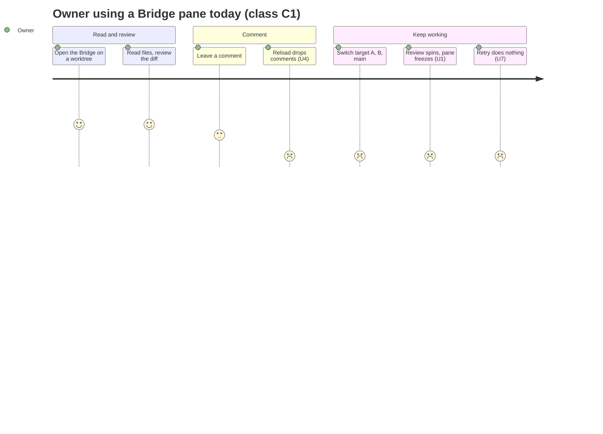
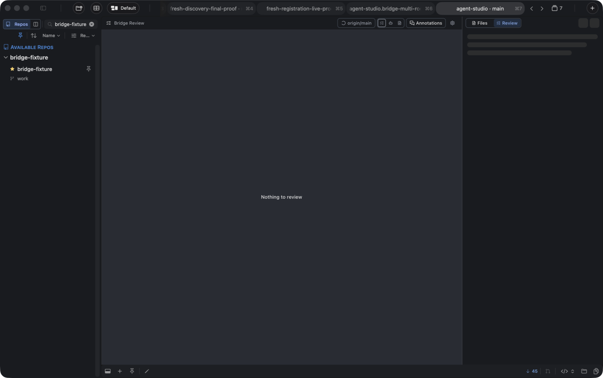

# Bridge Stability: Requirements

**Why this work exists, for whom, and within what boundary.** The observable contract lives in the [Specification](2026-09-24-bridge-stability-specification.md), and the structural realization in the [Program Design](2026-09-24-bridge-stability-program-design.md).

Authority: every row below was stated or confirmed by the owner (Shravan) on 2026-09-23/24. The goal boundary was confirmed as written on 2026-09-24. Evidence sources are listed in [Evidence](#evidence).

## The problem in one picture

The Bridge is the pane that shows a worktree's files (**File**), its diff against a comparison target (**Review**), and the comments left on either. It keeps getting stuck: a spinner that never ends, a frozen pane, "Update unavailable" with a Retry that does nothing, or comments that drop out whenever the view reloads. Each fix so far patched one path, and the next failure came from a sibling path.

The journey above is class C1's experience. Its pain comes from the owner's reports on 2026-09-23: "spinning forever", "first switch was fine then it blocked", "bridge fully frozen", and Retry doing nothing (verified in code). The desired difference is that every one of those steps either finishes, or shows the last good view marked stale with a Retry that does something, and comments stay put.

## Who is affected

| Class | Relationship | What they need |
|---|---|---|
| **C1 Owner as Bridge user** | Direct user. Reads files, reviews diffs and leaves comments in AgentStudio. | A pane that never wedges, and comments that survive view changes. |
| **C2 Agents consuming comments** | Downstream consumers of comment output. | Comments that are stable, identifiable, and tied to the code version they were written on. |
| **C3 Maintainers and CI** | Stakeholders. | Tests that catch real Bridge failures deterministically, and new data types that don't need bespoke recovery code. |

## Requirements

Every row's authority state is **authorized**. Priority was assigned by the owner: "the main goal is good tests for a reliable generic transport that works with files and reviews, and stability, no wedges" makes U1, U2 and U10 the primary goal. The other rows are required and not ranked.

| ID | Need (owner's words, normalized) | Why it matters | Class | Priority |
|---|---|---|---|---|
| **U1** | The Bridge never gets stuck. Every operation in File, Review and comments finishes, fails visibly, or is cancelled. | A wedged pane loses work and trust. The owner can't use comments until this holds. | C1, C3 | Primary |
| **U2** | One generic, consistent transport and lifecycle serves File, Review, comments and future data types, "so we don't have to keep doing this". | Per-type recovery rules are where each new wedge came from. | C1, C3 | Primary |
| **U3** | File and Review behave consistently in freshness, failure and Retry, even though they are built differently. | Today File has typed failure and a working Retry, and Review does not. | C1 | Required |
| **U4** | Comments are decoupled from File/Review reloads. Every comment, and every comment group, records which file version or Review version it belongs to. Comments on files are first-class. | Comments that disappear on reload are unusable. The version record lets people and agents know what code a comment was about. | C1, C2 | Required |
| **U5** | When the code a comment pointed at changes, the comment stays visible. If the excerpt is found at exactly one new place, it follows it and is labelled "Moved". Otherwise it is marked "Outdated", showing its original excerpt and version, and the user can re-attach or resolve it. Nothing moves silently. | Losing or silently misplacing a comment is worse than an honest "outdated". | C1, C2 | Required |
| **U6** | A comment's version is a **record only**: an identity of the file content or Review target. Original file bytes are not stored. | No retention burden. | C1, C2 | Required |
| **U7** | When updates keep failing, the last good File or Review stays readable, marked stale, with a Retry that actually does something. Comments can still be written and saved. | The owner can keep working through backend trouble. | C1 | Required |
| **U8** | Review builds only when it is shown. While hidden, Review only records that it needs a refresh. | Removes background churn and most of the livelock pressure. | C1 | Required |
| **U9** | Delivery acknowledgements are windowed and cumulative, with a bounded window and a deadline, instead of one acknowledgement per frame. | Per-frame acknowledgement round trips were one of the wedge chains. | C1, C3 | Required |
| **U10** | Tests catch real failures: real-path tests with fault injection, no timer-based waits, a test that fails first for every known wedge, and one contract suite every data type must pass. Harmful tests are replaced. | The owner's primary goal. Today, 29 of 60 sampled Bridge tests are harmful as written. | C3 | Primary |
| **U11** | Exporting comments blocks nothing. By default Export saves to a remembered folder with no dialog, and the drawer shows where. An optional folder picker (a wait on the user) blocks no other Bridge operation, pane or window. Closing or reloading the pane cancels an open picker, and the save does not happen; a save that has already started completes (owner, 2026-09-25). | A human-paced wait must not freeze the pane (S13). | C1 | Required |
| **U12** | The File view can filter its tree to changed files, with the same Git status kinds as Review. The two change filters are **"Uncommitted"** (vs HEAD) and **"All Changes"** (vs the merge-base with the origin default branch, e.g. `origin/main`: the same default Review compares against), narrowed by kind. The File view shows no target control; choosing a target is Review-only. With neither selected, all files show. Deleted files appear greyed and can't be opened. Review's picker names **"Uncommitted changes (HEAD)"** explicitly, and its Git status filter's first option reads **"All Changes"**. In a multi-root collection, filters apply per member worktree. Loose documents under "Open Files" are never filtered, and show "not in git". | File and Review should answer "what changed?" the same way, against either baseline. | C1 | Required |
| **U13** | Loading, empty, updating and failed look the same on every Bridge surface (File tree and content, Review, Comments, Markdown): a skeleton shaped like the content while it loads, a quiet empty line, an updating indicator over the last good content, and one failed state with a Retry. A pane that never started shows that same failed state, and its Retry reloads the pane through the existing Reload Bridge command. Nothing ever shows "loading" or "waiting" once it has settled (owner, 2026-09-30). | Today each surface draws these states differently, and some show a loading screen, or "waiting", forever. That looks broken even when it isn't, and hides it when it is. | C1 | Required |

## Goal boundary (confirmed 2026-09-24)

- **Goal:** one reliable, generic Bridge transport and lifecycle for File, Review and comments, with no wedges, and CI tests that catch real failures.
- **Reuse (existing foundation):**
  - the three-route transport (commands, streams, content);
  - native session authorization and replay;
  - the shared worktree construction;
  - git scheduling;
  - content demand lanes;
  - existing UI components;
  - the SQLite comment store and its anchor evaluator;
  - existing draft and source protections.
- **Missing (this work builds it):** every wait ends; windowed cumulative acks; one owner of "is this current?" per surface; typed recoverable failures with a working Retry (Review included); comments independent of reloads, with a version record and outdated/moved states; the degraded state; Review on demand; a four-kind contract suite plus fault seams; replacement of harmful tests; the File tree change filter (U12, added 2026-09-25); one set of non-content states drawn the same on every surface (U13, added 2026-09-30).
- **May change:**
  - the Bridge feature (native);
  - Bridge-related App coordination;
  - the BridgeWeb worker and UI;
  - the native↔page wire contracts (Swift and TypeScript together);
  - the comment SQLite schema, by migration;
  - tests and test support.
- **Protected:** Ghostty/zmx vendors; non-Bridge features; the IPC command catalog; files owned by the CI-guardrails work (PR #358); the release pipeline.
- **Non-goals:** Markdown images and links; *building* multi-root Bridge (#367 delivers it; this design accommodates its Files collection and comment subject model, merged 2026-09-25); performance tuning beyond freedom from wedges; storing original file bytes; background Review prewarm; compatibility shims or dual code paths.
- **Limits:**
  - at most 3 PRs stacked at once (`gh stack`). The owner's landing order of 2026-09-25 puts the transport PR first; it lands before the remaining three stack (the Program Design's delivery shape owns the order);
  - a hard cutover;
  - no `#if DEBUG` hooks in production files;
  - no timed waits in tests.
  - Old comment data may break: this is a greenfield store, and the migration may discard existing comments.
- **Acceptable evidence:**
  - a test that fails first for each known wedge;
  - `mise run test` green on each PR head;
  - a packaged WKWebView journey;
  - a debug-app smoke test: comment on File and Review, switch the comparison target, churn files.

## What the owner will see

Each image shows the requirement for its screen. The Specification owns the exact labels and states.

*U7: when Review can't update, you keep the last good diff, you are told it is stale, and Retry is one click away. Comments keep working. Generated illustration grounded in the current Review screen. Its code content is illustrative.*

*U4–U6: a comment whose code changed stays visible and explains what it was written on, and you choose what to do with it. Generated illustration. The line numbers in the code are not meaningful.*

*U3 and U7: File behaves exactly like Review when updates fail, and comments can still be saved. Generated illustration grounded in the current File screen. The line numbers are not meaningful.*

*U13, today: a settled Review (nothing to review) still shows a loading skeleton and a spinner, so a finished screen looks unfinished. Real screenshot from the PR1 debug app, 2026-09-30. The target picture for U13 is the four-state table in the Specification (C-UI, non-content states).*

The prompts behind these images are kept in [assets/briefs/](assets/briefs/).

## Evidence

The evidence is observational. It records current behavior, not desired meaning.

- Owner reports of freezes and endless spinners (2026-09-23), and the Review comparison-switch livelock (2026-09-23 manual debug session).
- `tmp/2026-09-24-bridge-stability-research/` in this worktree:
  - `synthesis.md` and `2026-09-24-review-digest.md`: verified code findings;
  - `review/lane-{a,b,c,d}-*.md`: native, worker, comment, and File-vs-Review code reviews;
  - `test-audit/2026-09-24-test-audit.md`: test coverage audit;
  - `stale-source-diagnosis.md`: the File invalidation race, which also exists on `main`.
- CI-guardrails handoff (board thread `01a0ce62`): the `stale_source` resets, the producer/uninstall hang, the Markdown→code E2E hang, and the dynamic-import failures.
