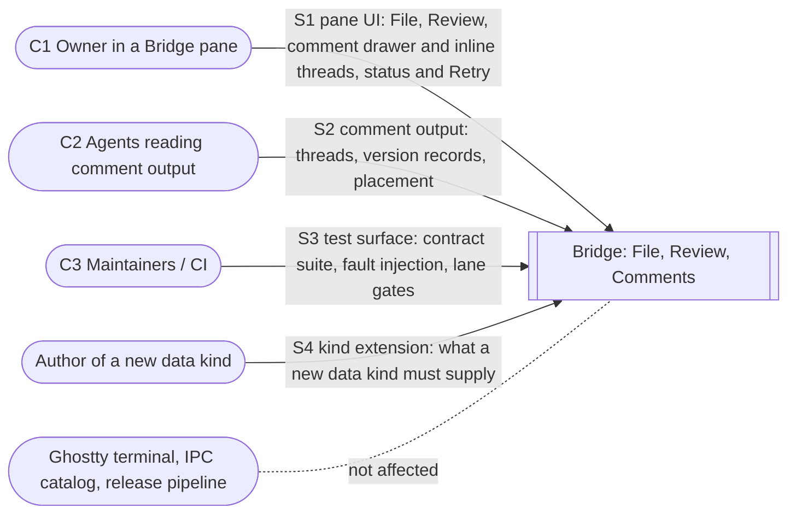
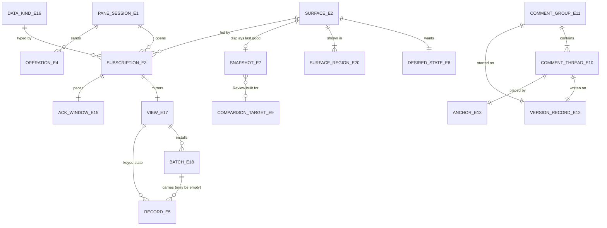
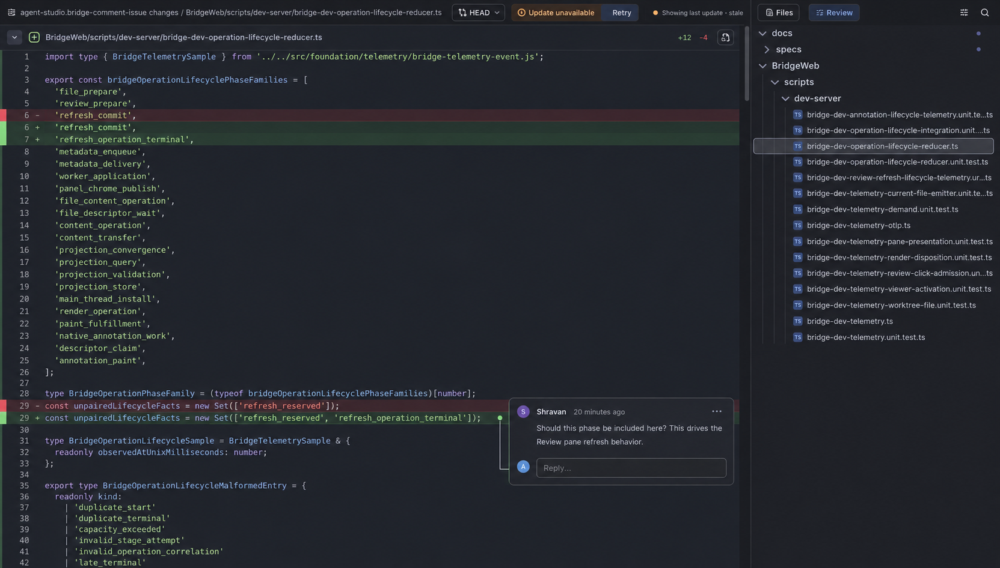
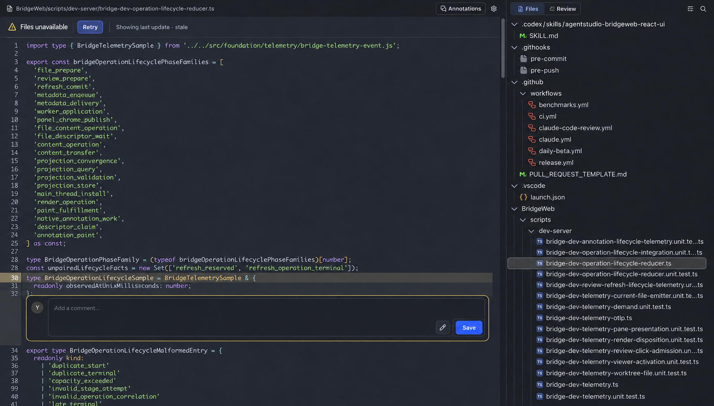
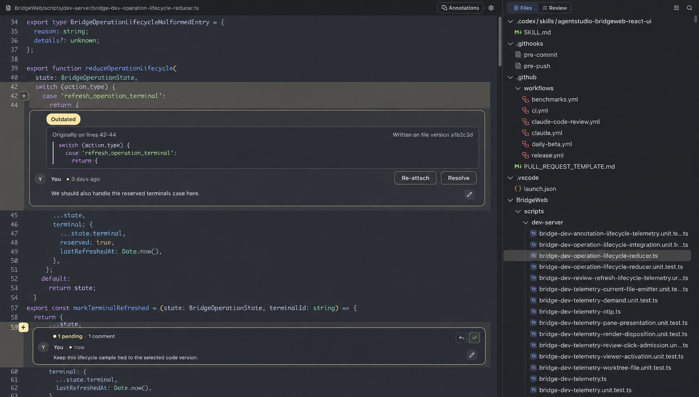

# Bridge Stability: Specification

**What must be observably true.** Every obligation here traces to a need in the [Requirements](2026-09-24-bridge-stability-requirements.md) (U1–U11). How the system meets these obligations is the job of the [Program Design](2026-09-24-bridge-stability-program-design.md).

The Bridge is treated as one opaque system. Its observable surfaces are the three below. Nothing in this document names an internal component, type, table or wire field.

## Terms: the entities every obligation is written over

| ID | Term | Identity: what makes two the same | Relationships | Invariants | Observable states |
|---|---|---|---|---|---|
| **E1** | **Pane session** | One Bridge pane plus one page incarnation. A page reload, or a replacement of the page's background worker, starts a **new** pane session. | A pane has at most one active pane session. A pane session owns 0..n E3 and E4. | Nothing from an ended pane session is ever applied to a newer one. | opening → active → ended. An opening that ends without ever becoming active is a **failed start**: that attempt never delivered anything. Content already shown on the page from before it stays readable and marked stale (R42) |
| **E2** | **Surface** | One pane plus one surface kind: File, Review, or Comments. Comments are a surface of their own, not a part of File or Review (U4). | A pane has exactly one of each surface. A surface has one E8 desired state, 0..1 displayed E7, and 1..n E20 regions. | A surface displays only complete snapshots (E7). | loading (no snapshot yet, first attempt running) · current · updating · stale (last good shown, update failed or pending) · unavailable (nothing good to show) |
| **E20** | **Surface region** | One E2 plus one display area of it: the File tree or File content; the Review list or diff; the Comments drawer or an inline thread area; a Markdown preview. The same area of the same surface is the same region across updates. | Belongs to exactly one E2. Shows its part of that surface's displayed E7 (or E10 threads for Comments). A region also has its own **demanded identity**: what it is currently asked to show (for example, the selected file). Regions of one surface settle independently. | Shows exactly one **presentation state** at a time: content, **Loading**, **Empty**, **Updating** (last good content plus the updating indicator), or **Failed** (keeping any last good content readable, R42) (U13). A region is **settled** when it shows content, Empty or Failed. | loading → content · empty · failed; content → updating → content · failed; content → loading when its demanded identity changes and it has no good content for the new one; failed → loading or updating (Retry) |
| **E3** | **Subscription** | One pane session plus one opening of a data stream of one kind for one surface. A reopen is a new subscription. | Belongs to one E1 and one E2. Has 0..n E5. | Ends exactly once, and its end is announced to both sides. | opening → open → ended(completed \| cancelled \| failed \| retired) |
| **E4** | **Operation** | One pane session plus one request from the page to the app (open, change interest, cancel, call, save, resync). A retry of an operation with the same identity is the same operation. | Belongs to one E1. May belong to one E3. | Settles exactly once. A human-wait operation (U11) is marked as such. | admitted → dispatched → settled(succeeded \| refused \| failed \| outcome-unknown \| cancelled) |
| **E5** | **Record** | One subscription's view plus one **key**: for File, the file's **canonical document location** (its identity, which is stable when a member regroups it); a Review item; a comment thread or session. The collection display key (where the row sits in the tree) and the read descriptor are **fields**, not identity. The same key at a later revision is the same record, updated. | Belongs to one E17 view. Delivered inside one E18 batch. | Carries the latest full value (or a deletion) with a per-key revision. A record for an older revision than the one installed for that key is ignored. Leaving the view's scope is **eviction**, not deletion. | put · deleted · evicted |
| **E17** | **Metadata view** | One E3 plus one **incarnation handle**. The handle changes whenever the app can no longer guarantee its revisions continue (restart, reset). | Belongs to one E3. Has 0..n E5 and 0..n E18. | The page shows only fully installed state of the view. Revisions reflect the app's commit order: a later commit never gets a lower revision. | empty → installed(cursor) → resnapshotting (last installed still shown) |
| **E19** | **File collection** | One receiving pane. It is the set of member worktrees plus opened loose documents that the File view shows (#367), ordered by membership, with a membership revision. | Is the content of the File surface's E17 view. Has **0..n** members (a local-only collection is valid) and 0..n loose documents. | A membership change is one sealed update (R9). A member whose enumeration failed keeps its previous rows, marked unavailable or stale; completion never certifies an unread member's files as absent. Loose documents belong to the "Open Files" group. | members changed → coverage batch |
| **E18** | **Batch** | One view plus one batch id. It declares its scope, base and target revisions, and its expected parts. | Belongs to one E17. Contains 0..n E5. A snapshot or coverage batch may be empty. | Installed all-or-nothing, only when every declared part is present. A snapshot batch's completion proves that keys absent from its scope don't exist. An empty complete **snapshot** certifies that its declared region is empty. An empty complete **coverage** batch means only "no membership changes"; it deletes nothing. Both differ from a batch with missing parts. | staged → complete → installed · abandoned (never installed) |
| **E6** | **Wait** | One point where Bridge work cannot continue until another party acts: a response, a frame, a build, an acknowledgement, a drain, a human. Identified by the E4/E3/E7 it belongs to plus the thing awaited. | Belongs to exactly one E1, E3, E4 or E7. | Has one named **ender**, and ends by success, typed failure, or cancellation. | waiting → ended(succeeded \| failed \| cancelled) |
| **E7** | **Snapshot** | One surface plus one content version. File: the worktree content at a point in time. Review: one comparison target (E9) resolved to commits, plus the build published from it. | Belongs to one E2. Is the "last good view" when it is the latest complete one displayed. | Is complete or is not displayed. A stale snapshot is never labelled current. It counts as **displayed** only once the page has confirmed installing it; publication alone is not display. The page may keep showing an earlier snapshot, for example to protect an open editor. | building → published → displayed (confirmed by the page) → superseded |
| **E8** | **Desired state** | One surface. It is the latest thing the user wants that surface to show: visible or hidden, which comparison target, and whether inputs changed since the displayed snapshot. | One per E2. | Survives cancellation and supersession of the work that serves it. Only a newer user or system intent replaces it. | satisfied · pending · failed(retryable \| permanent) |
| **E9** | **Comparison target** | Review's "compare against" choice: a ref name (for example `main`, a branch, `HEAD`) resolved to a commit at build time. The same name resolving to a new commit is the same target with a new snapshot. | Part of Review's E8. | A no-change Retry still produces a new attempt (U7). | — |
| **E10** | **Comment thread** | A thread id that is stable across reloads, snapshots and pane sessions. | Belongs to one E11. Has 1..n messages, exactly one E12 and one E13. | Never ended, hidden or reloaded because File or Review changed (U4). | Lifecycle: draft → open → resolved. Placement: attached · moved · outdated · unavailable (defined in C-COM). |
| **E11** | **Comment group** | A group id. It is the set of threads a user created in one commenting session on one **subject**: a Git worktree or a local file, per #367's subject model ("comment group" in the owner's words). | Has exactly one subject, 1..n E10, and exactly one E12 describing the source at group start. | The group's version record is shown with the group. | open · completed |
| **E12** | **Version record** | The identity of the code a thread or group was written against. File (Git or local-file subject): a file-content identity (for example a content hash) plus the source-qualified path. Review: comparison target name, the resolved commits, and the published snapshot identity. | Referenced by E10 and E11. | Records identity only, never file bytes (U6). Unknown only for data created before this work, which may be discarded. | known · unknown |
| **E13** | **Anchor** | One thread's placement request: path, line range, which side (File, or Review base/head), plus the selected excerpt and adjacent context lines. | Belongs to one E10. | Re-evaluated against every newly displayed snapshot of its surface. Never silently changed. | see C-COM placement states |
| **E14** | **Failure** | One pane session, surface or subscription plus one failure occurrence. Kind: **retryable** (a Retry may succeed) or **permanent** (authorization, contract or configuration errors; Retry cannot help). | Belongs to one E1 (a failed start), E2, E3 or E4. | Retryable failures offer a Retry that starts a new attempt. Permanent failures stop automatic retries. | shown → retried \| superseded |
| **E15** | **Acknowledgement window** | One subscription's delivered but unacknowledged batch parts. | One per active E3. | Bounded in count and bytes, and acknowledged cumulatively. It paces sending only; correctness never depends on it. Its oldest part has a deadline. | open · full · expired |
| **E16** | **Data kind** | A named category of subscription payload (today: file metadata, review metadata, file comments, review comments). | Defines the key space and record shape for 0..n E3. | Differs from other kinds only in its keys, its record shape, its scope, and how records apply. | — |

The entity table is normative. Every E6 Wait belongs to an E1, E3, E4 or E7, and every E14 Failure belongs to an E1, E2, E3 or E4. The diagram omits those edges for readability.

## Normative requirements

### Every wait ends (U1, U11)

- **R1.** Every E6 Wait MUST end by success, typed failure, or cancellation. No wait may depend on another wait that has no ender. A wait on a peer's progress (a response, a barrier after a successful response, the rest of a finite body, an acknowledgement) MUST be bounded by a named deadline category. That holds after partial progress too: a started body or an accepted request still has a deadline for the rest.
- **R2.** A cancel of an E3 MUST settle even when an E4 on that subscription, or on any other, is unanswered. Cancelling MUST NOT wait behind the operation it cancels.
- **R3.** If an E4 that is not a human wait receives no answer within the **control deadline**, then it MUST settle as `outcome-unknown` (when it may have taken effect) or `failed` (when it certainly did not). The pane session MUST remain usable for new operations.
- **R4.** A human-wait E4 (U11) MUST NOT delay any other E4, E3 or E1 transition, and has no pane-wide deadline. If its E1 ends before the effect has started (for a save, before the write begins), the human-wait operation MUST be cancelled and its effect MUST NOT happen. An effect that has already started completes or fails on its own terms, and its outcome is recorded; it is not reported to the ended E1.
- **R5.** When an E1 ends (pane close, page reload, worker replacement), every E3, E4 and E6 of that E1 MUST end, with no leftover waits, holds or reservations. The next E1 MUST be able to start immediately. It MUST NOT wait for the ended E1's work to finish executing. That work MUST be fenced so that it can't publish into the new E1, and it MUST release its resources when it stops.
- **R6.** Every E3 end MUST be announced to every party of its E1 that is still live. A subscription is never dropped silently by either side. When the page itself has gone, for example after a reload, the app records the end locally; it does not try to deliver it.

### One generic transport (U2, U9)

- **R7.** Every E16 Data kind, present and future, MUST follow the same E3 lifecycle, E4 settlement, E15 windowing, E14 failure and recovery rules. A data kind defines only its payload and how that payload is applied (contract C-KIND).
- **R8.** A failure in one E3 MUST NOT end or stall healthy sibling subscriptions in the same E1.
- **R9.** Metadata MUST be delivered as E18 batches of keyed E5 records for an E17 view.
  - A batch MUST be installed atomically, and only once every declared part is present.
  - A missing, conflicting or out-of-scope part MUST lead to a **resnapshot** of the view: never to a subscription failure, and never to a blank or partial view. The last installed state stays shown until the replacement installs.
  - A record MUST apply only if it is newer than the installed revision of *its own key*.
  - Records of an ended E3, an ended E1, or an older handle MUST NOT be applied anywhere.
  - A snapshot's completion MUST remove keys absent from its declared scope, and nothing outside that scope. An empty snapshot is a valid, complete certificate that its declared region is empty. Only a snapshot certifies absence: a scope-coverage batch, empty or not, never removes keys it doesn't name.
  - A delayed or duplicate batch MUST NOT overwrite or prune newer installed state: completeness alone does not make a batch current.
- **R9a.** While the page is slower than changes arrive, the app MUST send the latest value of each changed key rather than every intermediate change, and MUST keep its pending work bounded. Over the bound, the app resnapshots the view instead of queueing or failing.
- **R9b.** When a view's scope (interest) changes, keys newly inside the scope MUST be delivered at their current value, whatever their revision. Keys leaving the scope MUST be evicted, not reported as deleted.
- **R9c.** An operation or effect (a save, a command, a receipt) MUST NEVER be coalesced or delivered as metadata state.
- **R10.** Acknowledgement MUST be cumulative and windowed **per E3**, and serves only to pace sending. If an E3's oldest unacknowledged part passes the **acknowledgement deadline**, that view MUST resnapshot (R9), and its siblings MUST be unaffected (R8). Only a failure of the shared transport itself may affect every E3 at once. A lost or duplicated acknowledgement MUST NOT stall or double-apply.

### One notion of "current" per surface (U3, U7, U8)

- **R11.** Each E2 MUST display only the latest complete E7 that serves its current E8. A snapshot built for a superseded desired state MUST NOT be displayed as current.
- **R12.** When the inputs to a **visible** E2 whose update is **not deliberately held** stop changing, the surface MUST reach `current` or a typed E14 after a bounded amount of work. It MUST NOT re-run the same failing or superseded build in a loop.
- **R12a.** Two rest states are authorized, and neither counts as a wedge. They do no busy work:
  - a hidden Review with pending changes (R15), which builds when shown;
  - an update the page deliberately holds to protect an open editor (E7), shown as `updating` with "Apply now".

  Showing the surface, or releasing the hold, returns it to R12.
- **R13.** If new input arrives while an E7 is being built, then the build MUST continue or restart at the newer input, and MUST NOT surface as a failure. The same rule holds for File and Review.
- **R14.** Recovery of a surface after a subscription, pane-session or acknowledgement failure MUST restore its E8, including interests, target and visibility, without user action.
- **R15.** While Review is hidden, changes MUST only mark its E8 as pending. Building MUST start when Review is shown (U8).

### Failures are visible and recoverable (U3, U7)

- **R16.** Every E14 MUST be shown on its surface as retryable or permanent, and MUST be recorded with its failure reason in diagnostics.
- **R17.** A Retry on a retryable E14 MUST start a new attempt that is observable (the surface enters `updating`), including when nothing the user chose has changed. File and Review MUST behave the same.
- **R18.** If a snapshot was built but not delivered to the page, then that MUST be an E14, not a success. Retry MUST re-deliver that same snapshot when its inputs are unchanged.
- **R19.** While an E2 has a last good E7 and an update is failing or pending, the surface MUST keep that snapshot readable and marked as not current: `updating` while an attempt is running, and `stale` with Retry once it has failed (contract C-UI). The Comments surface MUST remain fully usable: compose, save, reply and resolve.
- **R20.** A permanent E14 MUST stop automatic retries and MUST state that Retry cannot fix it.

### Comments stand on their own (U4, U5, U6)

- **R21.** E10 threads and their drafts MUST NOT be ended, hidden, reloaded, or shown as refreshing or unavailable because a File or Review snapshot changed, reopened, or was superseded. The comment view's **scope** is the set of subjects the pane shows (the File collection's members and loose documents, or Review's worktree). A scope change adds or evicts threads; it never ends the view.
- **R22.** Every E10 and E11 MUST carry an E12 recorded at creation. That E12 is the version **displayed to the user** when the comment was made, even when that version is stale. The E12 MUST be shown with the thread (C-COM). Creating a comment, editing a message or replying MUST succeed on a stale displayed version (R19).
- **R23.** On every newly displayed E7 of the thread's surface, each E13 MUST be re-evaluated against that displayed E7, never against content the user isn't shown. There are four outcomes:
  - the excerpt is at the original lines → **attached**;
  - the excerpt appears at exactly one other place, whether or not its surrounding lines changed → **moved**, labelled with the original lines;
  - the excerpt is absent, or appears at several places (surrounding lines never pick one) → **outdated**, showing the original excerpt and E12, with Re-attach and Resolve;
  - the source can't be read → **unavailable**, retryable.
- **R24.** File comments and Review comments MUST have identical behavior for creation, placement, drafts, saving and output.
- **R25.** If a comment update from the app is rejected by the page as not current, then the page MUST either obtain the current state or show the Comments surface's retryable E14. It MUST NOT report success or keep showing "refreshing" indefinitely.
- **R26.** A comment save whose outcome is unknown MUST be shown as pending and then reconciled. A Retry of it MUST NOT create a duplicate message.
- **R27.** Comment output (copy and export, a human-mediated handoff) MUST include each thread's subject, E12 and placement state. It does not claim that an agent received it.

### File tree change filter (U12)

- **R33.** In a multi-root collection (E19), change filters apply **per member worktree**: Uncommitted against that member's HEAD, All Changes against that member's origin-default merge-base. Loose documents in "Open Files" are never filtered, and show "not in git". The File view's filter MUST offer **Uncommitted** (paths whose working-tree status differs from HEAD, as `git status` reports) and **All Changes** (paths that differ from the merge-base with the origin default branch, which is Review's default comparison). With neither selected, the tree shows all files.
- **R34.** Git status kinds (Added, Modified, Renamed, Deleted, Copied) MUST narrow the selected change filter. With a change filter active, the tree shows matching files plus their ancestor folders, and nothing else. An empty result shows an empty state; it is not a failure.
- **R35.** Deleted paths MUST appear as greyed rows that can't be opened, including a greyed parent folder when the folder no longer exists. Renamed paths appear at their new path, noting the old one.
- **R36.** "All Changes" in the File view MUST compare against the merge-base with the origin default branch, whatever target Review currently has selected, and MUST NOT start a Review build (U8).
- **R37.** Review's comparison picker MUST name the HEAD baseline **"Uncommitted changes (HEAD)"**, and both views' Git status filters MUST label their all-kinds option **"All Changes"**. Only Review shows a comparison target. The File view MUST NOT show a target control or chip.
- **R39.** An agent shows a file with one IPC request: pane, file, line and mode. The user decides the mode by what they tell the agent; the app never escalates on its own.
  - **Background (the default).** The file MUST open in the pane's Open files at the line without changing what the user sees or where focus is, and the IPC layer MUST post a notification naming the file (the Panes-owned notice; Bridge posts none). The notification is a persistent inbox item, never a toast or popup. No approval is needed. It MUST work with no Bridge page mounted: the file is in Open files when the pane is next shown, and opening it there lands on the line. When the user tells the agent to work in the background and not disturb them, the agent uses only this mode.
  - **Take over the screen.** Anything that changes what the user sees (bringing the pane forward, switching the file it displays, or moving focus) MUST first get the user's approval through the app's existing IPC approval request. Approved: the file is shown at the line through the same path as a human click, including its usual handling of unsaved edits. Declined: the file stays opened in the background.
  - The reply is sent exactly once: **opened** (background), **shown** (take over, approved), **declined**, **not found** (the file doesn't exist in that pane's worktrees), or **pane unavailable**.
- **R38.** The file that is open when a filter is applied stays visible in the tree until the user navigates away. Comment threads on filtered-out files stay listed in the drawer, and selecting one reveals its file.

### Tests prove it (U10)

- **R28.** A single contract suite MUST run every property of R1–R14 (including R9a–R9c) against every E16 data kind, at three layers. It covers missing, duplicated and reordered parts; delete then recreate; a snapshot overlapping live changes; scope expansion; a slow consumer touching many keys; and worker replacement. The three layers:
  - app-side integration;
  - page-side logic against the real frame format;
  - app and page together through the development server.

  A new data kind MUST NOT count as supported until it passes the suite.
- **R29.** The test suite MUST be able to inject each of these faults at the real transport and construction boundaries: drop, duplicate, reorder, stall, refuse, and invalidate mid-read. Tests MUST assert that every E6 ended and nothing was left behind.
- **R30.** No Bridge test MAY decide pass or fail by elapsed wall-clock time. Deadlines (R3, R10) MUST be proven with a controlled clock. The runner's hang bound is the only permitted real-time limit.
- **R31.** Each known wedge MUST have a test that fails on the code where the wedge occurred and passes after this work. For wedges already repaired on this branch, for example (b), the failing evidence comes from the revision before that repair. Failing evidence means a behavioral failure through existing entry points, not a compile error against new interfaces. The wedges:
  - (a) cancel after a surface change;
  - (b) a subscription silently dropped;
  - (c) the Review comparison livelock;
  - (d) the File build invalidated during open;
  - (e) an unanswered operation stalling the pane (S13);
  - (f) delivery failure counted as success;
  - (g) a comment update silently rejected;
  - (h) a comparison mismatch closing Review permanently;
  - (i) an acknowledgement backlog;
  - (j) pane teardown waiting on unended work;
  - (k) comments retired by a File/Review change.
- **R32.** Existing tests whose passing verdict asserts a wedge MUST be rewritten to assert the R1–R27 behavior. That covers the held-provider (S13) oracle and the "gates stay closed" comparison-mismatch oracle. Tests that wait by polling or timers MUST be rewritten.

## Observable contracts

### C-UI: what the owner sees (S1)

| Surface state | File | Review | Comments |
|---|---|---|---|
| loading | Each region that has no good content yet for its demanded identity shows **Loading** (content-shaped skeleton), never an empty panel or "pending" text. An installed tree stays shown while a newly selected file loads | List and diff show **Loading** until the first package installs | Drawer shows **Loading** until its first catalog installs |
| current | Tree and content | Diff for the target | Threads with placement |
| updating | Last good content, plus an unobtrusive updating indicator | Same | n/a (always usable) |
| stale | Last good content, plus **"Showing last update · stale"**, plus **"Files unavailable"** and **Retry** (retryable) | Last good diff, plus **"Showing last update · stale"**, plus **"Update unavailable"** and **Retry** | Unaffected by File/Review staleness |
| unavailable | "Files unavailable" plus Retry, or a permanent message | "Update unavailable" plus Retry, or a permanent message | "Comments unavailable" plus Retry, only when the Comments surface itself fails |

- No modal dialogs, toasts, or full-view overlays for these states. This follows the owner's standing preference for persistent indicators over transient popups.
- Retry, status text and comment actions (Re-attach, Resolve) use the app's command and action display system, like every other control.

#### Non-content states: one set, drawn one way everywhere (U13; owner, 2026-09-30)

Every E20 surface region has exactly four non-content states, and each is drawn the same way on every surface. A region's state comes from two things together: its surface's E2 state (desired, displayed, failure) and the region's own demanded identity and read. So one region can wait while its sibling stays settled. For example, a File tree stays shown while a newly selected file loads, and settled comment threads stay shown while one thread body loads. In outline: nothing good yet for the demanded identity shows **Loading**; complete content shows content, or **Empty** when it certifies nothing to show; a running update over good content shows **Updating**; a failed update keeps good content marked stale with **Failed**'s control (R19, R42); a failure with nothing good shows **Failed**.

| State | When it is shown | What it looks like | Ends in |
|---|---|---|---|
| **Loading** | Only while the region has no good content for its current demanded identity and that content is being fetched or installed | A skeleton shaped like that region's real content (tree rows, code lines, diff hunks, comment cards), with a muted pulse | Content, **Empty** or **Failed**, within R1's bounds. It stops the moment the region settles |
| **Empty** | A **complete** snapshot certifies there is nothing to show (for example, no changes), or the region has no applicable selection (no file selected). A partial snapshot is never Empty, and a failed read is **Failed**, never Empty | One quiet line of copy in the content area. The two cases use different copy | — |
| **Updating** | New content is on its way while the last good content is shown | The last good content stays; a small shared indicator in the header | Content or **Failed** |
| **Failed** | The region cannot show current content | **One message per pane** (owner, 2026-10-01), at the top of the side rail above the file tree; when the rail is hidden, at the top of the content area. It names every failed part of what the pane is showing (the File or Review view on screen, with its tree, content and Comments) in one direct sentence; a failure in the view that isn't on screen appears when that view is shown (for example "Review and comments couldn't update"). A retryable failure adds one shared **Retry** that starts a new attempt for every failed part. A permanent failure states the corrective action and offers no Retry (R20). The failed regions keep their last good content readable and marked stale, or show one quiet line; they show no message or Retry of their own. The copy says what failed and never claims that recovery is in progress | Retryable: a new attempt (Retry). Permanent: a change to its cause |

- **R40.** Every E20 region MUST show exactly one presentation state (E20). A settled region MUST NOT show a Loading skeleton, a spinner, or "loading", "waiting" or "pending" copy anywhere in that region, including its rails and headers. Every attempt behind a Loading or Updating state is an E6 wait: it MUST end by R1, in content, Empty or Failed. A region MAY stay Updating across successive attempts while its inputs keep changing (R13), and MAY rest in Updating while an update is deliberately held or its surface is hidden (R12a). A resting region does no work. It leaves that state on release, show or retirement, never through an expiring spinner or a new automatic retry. When inputs stop and nothing is held, R12's bounded convergence applies.
- **R41.** **Failed has a scope, not a separate state.** A *retryable surface* failure's Retry starts a new attempt for that surface (R17), including a surface whose source failed before any subscription opened while the pane session is healthy. However many surfaces or reads fail, the pane shows one Failed message and one Retry (C-UI Failed row). When the E1 pane session is a **failed start**, that one message says the pane couldn't start (every region keeps any retained content readable, R42), and its Retry runs the app's existing **Reload Bridge** command, the same command as the menu, command bar and automation. There is no second reload path.
- **R42.** A Failed region keeps any last good content readable and marked stale (R19). Failed replaces content only when its surface is `unavailable`.
- **R43.** Loading, Empty, Updating and Failed MUST look and behave the same in every region: the same shape rules, the same placement of the Retry control, and labels from the command and action display system (C-UI).

*Review when updates fail: the diff stays readable, the header says so, and Retry is one click away. Comments keep working (R17, R19).*

*The File view in the same situation, matching Review (R17, R19, R24).*

### C-COM: comments (S1, S2)

| Placement | When | What the thread shows | Actions |
|---|---|---|---|
| attached | The excerpt is at the original lines of the displayed snapshot | Normal thread | Reply, Resolve |
| moved | The excerpt is found at exactly one other place | **"Moved from lines a–b"** | Reply, Resolve |
| outdated | The excerpt is absent or found at several places | **"Outdated"** badge, the original excerpt under **"Originally on lines a–b"**, and **"Written on file version …"** or the Review target and version | **Re-attach**, **Resolve**, Reply |
| unavailable | The thread's source can't be read right now | "Placement unavailable" plus Retry | Retry, Reply |

- Every thread shows its E12 version record: compact, and expanded on demand.
- Comment output for agents (C2) carries thread id, group id, E12, E13, placement, messages and resolution.

*An outdated comment is kept and explained, never moved or deleted silently (R23).*

### C-KIND: adding a data kind (S4)

A new data kind supplies only:
- its name;
- which surface it feeds;
- its **key space and record shape**, with validation;
- how an installed record changes the page's projection;
- what its **scope** (interest) means, if it has one;
- whether several keys must change together, in which case they share one batch.

It inherits, and may not override, opening, cancelling, retiring, batching, per-key revision rules, coalescing, resnapshot, windowed acknowledgement, recovery, failure classification, and the contract suite (R7, R9–R9c, R28).

### Failure, cancellation and compatibility behavior

- **Unknown outcome.** An operation that might have taken effect settles as `outcome-unknown`. The page reconciles it; it never assumes success or failure. Saves are the main case (R26).
- **Pane close or reload** ends everything of that pane session (R5). Human-wait operations are cancelled (R4).
- **Compatibility.** A hard cutover. The page and the app ship together, so no mixed-version protocol support is promised. Comment data created before this work may be discarded by the schema change. No compatibility promise covers comments from before the cutover.
- **Undefined on purpose.** The exact values of the control deadline, acknowledgement window and acknowledgement deadline are policies (Program Design). Ordering across different subscriptions is not guaranteed. Only per-subscription order is (R9).

## Cross-cutting obligations

- **Reliability** is the subject of this work: R1–R20.
- **Diagnosability.** Every E14 and every forced E6 end (deadline, cancellation) MUST be recorded with its reason and owning E1/E3/E4 in diagnostics, including under the development server (R16). Exported telemetry follows the repo's scrub rules: no raw paths, ids, payloads or comment text.
- **Security.** Existing authorization, replay protection and page-to-app admission MUST continue to hold. No new route bypasses them.
- **Accessibility.** The status, Retry and comment actions are reachable by keyboard and labelled through the same display system as other controls.
- **Performance.** No throughput or latency target beyond wedge freedom is in scope (non-goal).
- **Data lifecycle.** Comment data is migrated forward. Data from before the cutover may be dropped (owner decision).

## Proof obligations

| Obligation | Evidence class |
|---|---|
| R1–R6, R8–R10 | Automated behavior with fault injection at real boundaries (R29), leftover-state assertions, and a controlled clock for deadlines |
| R7, R28 | The contract suite passing for all four current data kinds at all three layers |
| R11–R15 | Automated behavior with held and invalidated builds, plus convergence assertions (finite attempts, then quiescence) |
| R16–R20 | Automated behavior plus visual evidence of each C-UI state in the running app |
| R40–R43 | Browser tests of Loading, Empty, Updating and Failed for every region. These include: a sibling region staying settled while one region loads; no-selection vs certified-empty copy; a permanent failure with no Retry; a held or hidden region resting without work; a failed pane start keeping retained content. Plus running-app visual evidence that a settled region never shows a skeleton, spinner or loading/waiting copy |
| R21–R27 | Automated behavior (File and Review parity), SQLite state inspection for E12, and visual evidence of the C-COM states |
| R30–R32 | Repo lint (`no-timed-wait-in-tests` once PR #358 lands) and review of the replaced tests |
| R31 | Each wedge test's failing run on the pre-change code, plus its passing run |
| Whole system | A packaged WKWebView journey (page replacement and drain), and a debug-app smoke test: comment on File and Review, switch the comparison target A→B→main, churn files. Nothing may spin forever. |

## Trace

| U | E | Requirements | Contract | Proof |
|---|---|---|---|---|
| U1 | E1 E3 E4 E6 | R1–R6 | C-UI, failure behavior | fault injection, leftover state, controlled clock |
| U2 | E3 E5 E15 E16 E17 E18 | R7–R10 (incl. R9a–c) | C-KIND | contract suite |
| U3 | E2 E7 E8 E14 | R11–R14, R16–R18 | C-UI | automated, visual |
| U4 | E10 E11 E12 | R21, R22, R24, R27 | C-COM | automated, SQLite, visual |
| U5 | E13 E10 | R23 | C-COM | automated, visual |
| U6 | E12 | R22 | C-COM | SQLite inspection |
| U7 | E7 E8 E14 E9 | R17–R20, R25 | C-UI | automated, visual |
| U8 | E8 | R15 | C-UI | automated |
| U9 | E15 | R10 | failure behavior | controlled clock, fault injection |
| U10 | all | R28–R32 | S3 | lint, failing-then-passing runs |
| U11 | E4 E6 | R4 | failure behavior | automated (held human wait plus pane close) |
| U13 | E1 E2 E6 E14 E20 | R40–R43 | C-UI (non-content states) | browser tests of each state per region; visual evidence in the running app that no settled region shows loading/waiting |
| U12 | E2 E7 E17 | R33–R38 | C-UI (filters) | automated scope/filter tests, no-Review-build assertion, visual |
| U1, U2 (agent show) | E5 E17 E19 | R39 | failure behavior | background open with no mounted page → opened, notification posted, nothing on screen changes; background open into a visible pane → the displayed file and focus unchanged; take over → approval requested, approved → shown at the line via the human-click path, declined → stays opened in background; missing file → not found; closed pane → pane unavailable; exactly one reply each: automated + E2E |
