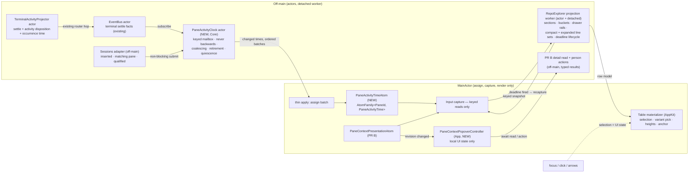
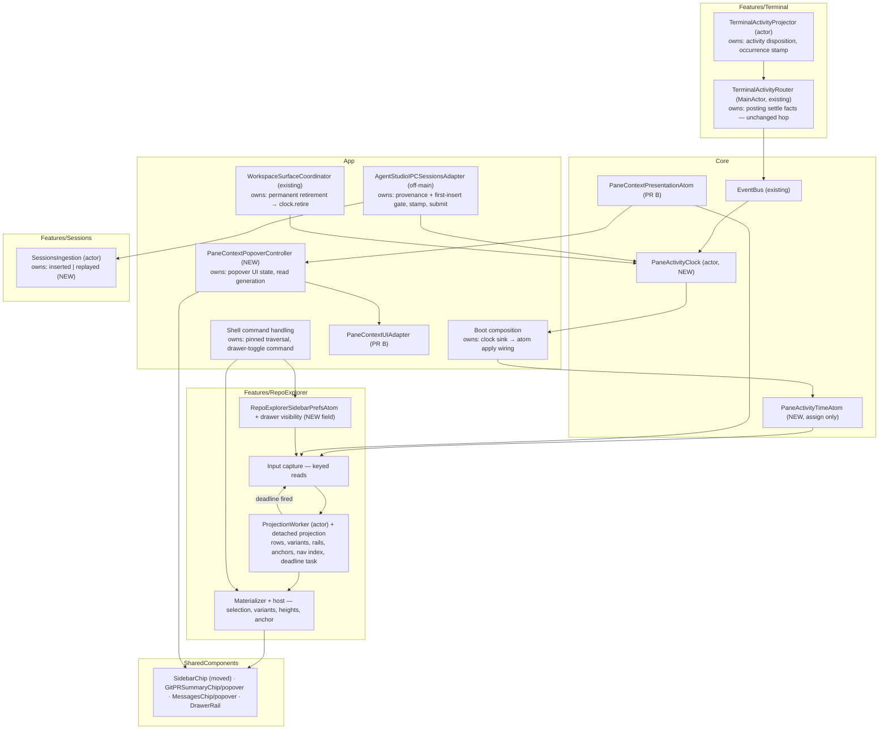
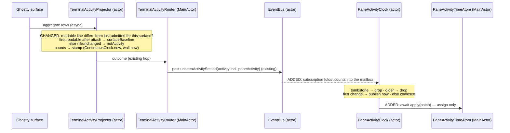
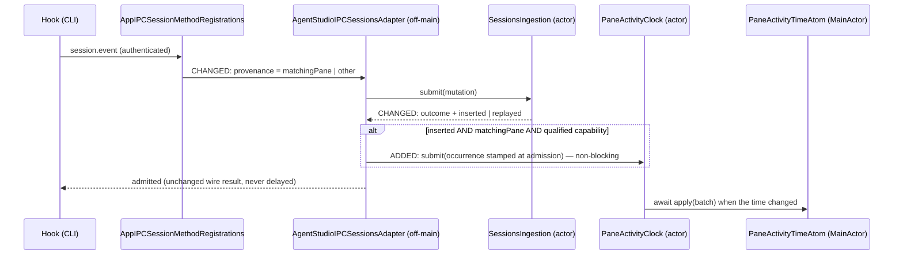
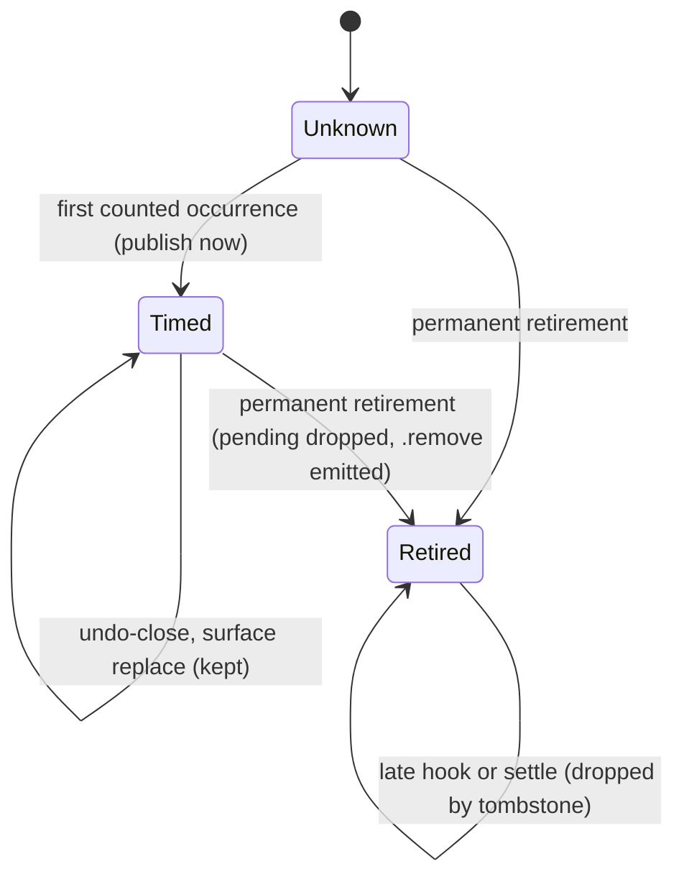
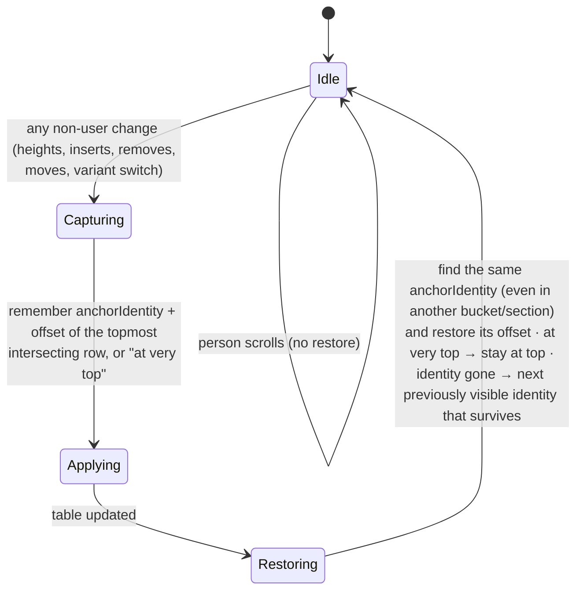
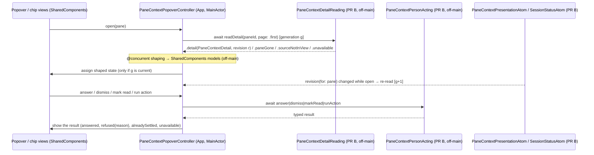

# Panes Stage 1 — Program Design

How the Panes side realizes the [Specification](2026-09-25-panes-stage1-specification.md) (needs in the [Requirements](2026-09-25-panes-stage1-requirements.md)). It covers **PR A** (Panes on existing data) and **PR C** (Panes shows agent context). PR B's IPC, storage, pane-context presentation atom, UI-facing detail/action seams and git/PR summary derivation are designed in `agent-studio.ipc-improvements/docs/specs/2026-09-26-pane-context-ipc/`. This design consumes them and does not restate them. Current-system evidence: `tmp/research-workflows/2026-09-26-panes-current-system/report.md` (anchored at 18cbc3e).

## The whole thing in one picture



One activity time per pane. It is **decided** off-main by one owner, the `PaneActivityClock` actor, and **published** on MainActor by a plain assignment into an `AtomFamily`. Everything the row says about time — group, order, clock chip, ▶ — is computed off-main in the projection worker from that one value. Focus only selects. Selection picks which precomputed row variant is shown; it never goes back through the worker.

## What runs where, and which atom primitive

This section is the contract implementers follow. It applies the repo rules in [Atom Persistence Boundaries — Need An Atom?](../../architecture/state/atom_persistence_boundaries.md#need-an-atom), [Which primitive](../../architecture/state/atom_persistence_boundaries.md#which-primitive), [Atom And Actor Placement](../../architecture/state/atom_persistence_boundaries.md#atom-and-actor-placement), [EventBus Design — Admission And Hop Shape](../../architecture/runtime/pane_runtime_eventbus_design.md#admission-and-hop-shape), [Threading Model](../../architecture/runtime/pane_runtime_eventbus_design.md#threading-model) and [Demand-Driven Refresh — Selection Rule](../../architecture/state/demand_driven_derived_state_refresh.md#selection-rule).

**The rule that governs every row below:** an atom method may only assign, suppress equal writes, and keep observation indexes. It may not order, gate, schedule, admit, derive, or do I/O. MainActor assigns, captures and renders; it does not decide or schedule.

### Input classification (Selection Rule)

| Input | Class | Mechanism | Where |
| --- | --- | --- | --- |
| Terminal settle for a pane | Latest-state projection (the newest occurrence matters) | Source disposition, then keyed latest-value coalescing that never loses a pane | projector → `PaneActivityClock` |
| Qualified hook for a pane | Latest-state projection | Same keyed mailbox, same owner | adapter → `PaneActivityClock` |
| Pane retirement | Ordered fact | Ordered into the same mailbox; tombstone rejects late inputs | coordinator → `PaneActivityClock` |
| Bucket boundaries (60 s, 10 min, 1 h, today, 7 d) | Future eligibility deadline | One reschedulable next-deadline task | `RepoExplorerProjectionWorker` actor (moved from the adapter) |
| Row facts for the sidebar | Expensive refresh | Existing demand admission + stale-result validation | Existing `RepoExplorerProjectionAdapter` seam |
| PR B pane context (summary) | Latest-state projection | Coalesced and equal-suppressed off-main by PR B | PR B's applier into `PaneContextPresentationAtom` |
| PR B pane detail (popover open) | Expensive refresh on demand | Read on open; re-read on revision change; latest read generation wins | `PaneContextPopoverController` awaiting PR B's off-main read |

### Placement table

| Work | Runs on | Owner | Why here |
| --- | --- | --- | --- |
| Decide whether a settle is pane activity and stamp its occurrence time | `TerminalActivityProjector` **actor** | Features/Terminal | It owns per-surface settle state and knows whether the readable line changed. |
| Carry terminal activity to the clock | projector → injected non-blocking `submit` (actor-to-actor mailbox write) | Features/Terminal → Core via App wiring | The bus settle fact excludes attended panes, so it isn't an activity source (see "Terminal activity source"). The router and bus are unchanged. |
| Decide whether a hook is activity (first insert, matching-pane caller, qualified capability) and stamp its occurrence time | `SessionsIngestion` **actor** + `AgentStudioIPCSessionsAdapter` (non-isolated struct, off-main) | Sessions / App composition | Insert-vs-replay is known only by the repository; provenance only at registration. |
| Order occurrences, coalesce per pane, retire panes, report quiescence | `PaneActivityClock` **actor** (NEW) | Core/RuntimeEventSystem/PaneActivity | One owner for the one clock. |
| Publish changed times | one thin `@MainActor` apply per batch | App composition calls `PaneActivityTimeAtom.apply(_:)` | Final application of compact actor output ([Atom And Actor Placement](../../architecture/state/atom_persistence_boundaries.md#atom-and-actor-placement)). |
| Hold the time for observers | `PaneActivityTimeAtom` — `@MainActor @Observable`, one `AtomFamily<UUID, PaneActivityTime>`, grouped writes in one `AtomMutationContext` | Core/State/MainActor/Atoms | "Many keys, one row should wake" → `AtomFamily`. Assign and equal-suppress only. |
| Read keyed facts for the sidebar | `RepoExplorerProjectionInputCapture` (MainActor) | Features/RepoExplorer | Keyed `value(for:)` reads only, no joins — [Sidebar Data Flow](../../architecture/state/workspace_data_architecture.md#sidebar-data-flow). |
| Sections, buckets, order, drawer rails, compact **and** expanded line sets, chips, anchor identities, navigation index, next deadline | detached projection inside `RepoExplorerProjectionWorker` | Features/RepoExplorer | The existing eager seam; no third seam. The navigation index is already built there (`RepoExplorerProjectionWorker.swift:371`, `:438`). |
| Own the bucket-deadline task: cancel/replace, wait, demand gate | `RepoExplorerProjectionWorker` **actor** | Features/RepoExplorer | **Changed** (see "Bucket deadlines"). Today the MainActor adapter owns this task. |
| Selection, which variant each row shows, measured heights, anchor capture/restore | table materializer (AppKit main) | Features/RepoExplorer | UI owner. Cost is O(rows whose variant or height changed) + O(1) anchor work. It derives nothing. |
| Drawer visibility preference | `RepoExplorerSidebarPrefsAtom` — one new `AtomValue` field, assigned by the drawer-toggle command handler | Features/RepoExplorer | A persisted UI preference; the command decides, the atom holds it. |
| Agent title, Agent Line, counts per attention type, revision, pull-request summary | PR B: off-main derivation, thin apply into `PaneContextPresentationAtom` (keyed by pane) | PR B | PR C reads `value(for: paneId)` through capture only. |
| Session status per pane | PR B: off-main, thin apply into `SessionStatusAtom` (`AtomFamily<PaneId, AgentSessionStatus>`, owned by Features/Sessions) | PR B | Features never import siblings, so App injects a keyed reader `(PaneId) -> AgentSessionStatus?` into `RepoExplorerProjectionInputCapture`; capture calls it as a keyed `value(for:)` read. RepoExplorer never imports Sessions. |
| Popover detail and person actions | PR B `PaneContextDetailReading` / `PaneContextPersonActing` (off-main, implemented in `App/PaneContext/PaneContextUIAdapter`) awaited by `PaneContextPopoverController` | PR B / App | MainActor only resumes and assigns local UI state. |

### The two new types

```text
PaneActivityOccurrence  (Sendable value, Core)
  paneId, source: .terminal | .hook
  orderingInstant: ContinuousClock.Instant   ← process-wide monotonic, includes sleep; decides "newer"
  wallTime: Date                             ← source wall stamp, for detail views only (ages use "One age basis")
  Both are stamped by the source owner at the moment the occurrence is admitted, from injected clocks.
  Nobody stamps on receipt.

PaneActivityClock  (actor, Core/RuntimeEventSystem/PaneActivity/)
  ingress (never blocks, never loses a pane):
    submit(_ occurrence)                    ← nonisolated, non-async; used by the hook adapter
    retire(paneIds)                         ← nonisolated, non-async; used by the retirement coordinator
    Both write into a Mutex-guarded keyed mailbox: per pane, keep the occurrence with the newest
    orderingInstant; retirements are appended in order. Then they signal one wake
    (AsyncStream<Void>, bufferingNewest(1)). A dropped wake is harmless: the mailbox holds the data.
    Terminal: the projector calls the same submit(_:) with each counted occurrence (see "Terminal activity source").
  drain loop (actor):  take mailbox → apply rules → emit batch → await sink (MainActor apply) → repeat
  rules:
    pane retired (tombstone)            → drop; late hook or settle can never recreate it
    orderingInstant ≤ latest admitted   → drop (out-of-order sources, delayed facts)
    first change for a pane             → publish now (turning Active is never delayed)
    later changes                       → at most one publish per AppPolicies.Panes.activityTimePublishInterval;
                                          newest pending wins; one reschedulable deadline on an injected Clock
    retire                              → drop pending, tombstone, emit .remove
  output: ordered batches of [.set(paneId, PaneActivityTime) | .remove(paneId)] to an
          async @MainActor sink that returns after the atom apply (apply acknowledgement)
  quiescence (production seam, not a test hook; testing_architecture.md#quiescence):
    func settled() async throws -> PaneActivityClockQuiescence   (.quiescent | .shutDown)
      returns .quiescent only when the mailbox is empty, every admitted input is processed,
      NO coalesced publication is pending, and every emitted batch is acknowledged applied.
      If a deferred publication is held, settled() waits until it is published and applied,
      which in tests happens after the test advances TestPushClock (the deadline registers first;
      tests await waitForPendingSleepCount before advancing).
    pendingDeadline() async -> Bool          ← observation only, for tests that must advance time
    cancellation: a cancelled settled() waiter is removed and throws CancellationError; other waiters are unaffected
    shutdown() async: stops ingress, cancels the deadline and drain loop, resumes every waiter with
      .shutDown, and returns only after the drain loop has exited

PaneActivityTimeAtom  (@MainActor @Observable, Core/State/MainActor/Atoms/)
  AtomFamily<UUID, PaneActivityTime>          (plain Equatable comparator)
  apply(_ batch)  ← setValue / removeValue in one AtomMutationContext
  value(for:) / snapshot()
  nothing else: no max, no gate, no deadline, no clock read
```

`PaneActivityTime` = `orderingInstant` + `wallTime` + `source`. It is runtime-only and never persisted, and after a restart the time is unknown until new evidence (spec). The published value never moves backwards, because the clock only publishes a newer `orderingInstant`.

**One age basis (E3, R4–R6).** Each capture stamps one reference pair, `(continuousNow, wallNow)`. The worker computes every row's `age = continuousNow − orderingInstant`. That is never negative, because every instant was stamped earlier in this process, and it includes sleep. The clock chip text, Active (< 60 s), and the Just Now, Last hour and Last 7 days buckets all come from `age`. Order within a group is `orderingInstant` descending. Only the calendar bucket "Today" needs a wall date: it uses `wallNow − age`, a derived date that stays consistent with `age` when the wall clock steps. `wallTime` is kept for display in detail views only. The existing helpers that clamp or reject negative wall ages (`RepoExplorerActivityBucket.swift:25-31`, `RepoExplorerSnapshot.swift:118,161`) are replaced for Panes by this single age computation.

### Source dispositions

| Source | Counts as activity when | Does not count | Owner |
| --- | --- | --- | --- |
| Terminal settle | the settle has a **readable last line that differs** from the last line admitted for this surface. Ordinary bursts and command-finished settles both qualify (command-finished can have `rowsAdded == 0`, `TerminalActivityProjector.swift:158-213`). | the first readable line after a surface (re)attach (baseline); unchanged or unreadable line (`lastOutputLine == nil`, `PaneRuntimeEvent.swift:54`); row growth alone | projector decides at its activity-window close and submits `.counts` occurrences directly (no event-contract change) |
| Hook | first-committed insert, from the pane's own credential, qualified capability (spec R1) | replayed correlation, late spool replay, another pane's or a foreign conversation, session start/end | adapter, after `SessionsIngestion` returns `inserted` |

The approved baseline flag became an internal projector disposition; no event payload changes. The preview path (`recordSettledActivity`, Repos) is unchanged.

### Why not the existing `PaneActivityStatusAtom`

An earlier draft put "keep the max" in that atom, which breaks the atom rule. That atom also already runs a publish gate, a pending map and a deadline `Task` on MainActor (`PaneActivityStatusAtom.swift:91-190`). That's existing debt, and PR A must not extend it. PR A leaves the preview path untouched. The debt is listed in the MainActor-rules skill PR's known violations.

### Rates

Settles are contracted at the source (Contract 7). Hooks in a tool-heavy turn can be `often` (≥ 10/min per pane). The clock turns both into at most one MainActor apply per batch, and at most one time change per pane per publish interval after the first. The worker wakes on changed keys only.

## What changes and why this shape

| Choice | Selected | Rejected alternative | Why |
| --- | --- | --- | --- |
| Where the clock is decided | `PaneActivityClock` actor | Max/gate in an atom; combining on MainActor | Atom rule; both sources are already off-main. |
| Ingress | Mutex-guarded keyed mailbox + one coalescing wake | A bounded `AsyncStream` of occurrences | A shared bounded buffer can drop one pane's only activity; a keyed mailbox keeps every pane's newest by construction. |
| Occurrence time | Monotonic instant for order and age (see "One age basis"); wall stamp for detail only; both stamped at the source | Stamping on receipt; one `Date` for both | Receipt order is not occurrence order; a wall-clock step must not reorder activity or change ages. |
| Retirement | Permanent retirement from `WorkspaceSurfaceCoordinator.consumeUndoRetirements` (`unownedPaneIDs`) calls `clock.retire` | The bus `paneClosed` fact | `paneClosed` is declared but never posted in production. Undo-closed panes keep their time until retirement, so undo restores it. |
| Where the time is published | New `PaneActivityTimeAtom` with one `AtomFamily` | A field in `PaneActivityStatusAtom` | That atom carries MainActor gating debt and a different fact. |
| Bucket deadlines | Deadline task moves from the MainActor adapter into the worker actor; MainActor only receives "deadline fired" and runs the keyed recapture | Keep the adapter-owned task; a per-row timer | Scheduling off-main per the Performance Lane Directive. See "Bucket deadlines". |
| Compact vs expanded | Worker precomputes **both** line sets and fallback heights for each row; the materializer shows the expanded set for the selected row | Selection as a worker input | Selection changes need no re-projection, so a stale projection can never overwrite a newer selection. |
| Anchor identity | Rows carry a semantic `anchorIdentity` (pane id; section/bucket kind for headers) | Row id | Pane row ids embed the bucket (`RepoExplorerProjection+PaneGroups.swift:35`), so a bucket move looks like a deletion. |
| Drawer rail | Worker emits a `drawerRail` segment per row | Deriving from depth, or by looking at neighbor rows in the cell | An owner with and without drawers are otherwise indistinguishable; cells must not derive. |
| Shared chip | Extract the stateless `SidebarChip` capsule to SharedComponents | New chips in SharedComponents calling Core | SharedComponents cannot import Core (`Package.swift:127`, `:140`). |
| Arrow traversal | All-destination order; nine-row digit list stays separate | Reordering only the numbered list | The host walks only the nine numbered rows today (`RepoExplorerMaterializationHost.swift:442-453`). |

## Components and ownership



Dependency rules (existing architecture lint): Features never import each other; App composes Terminal→Core and Sessions→Core; SharedComponents take values and callbacks only; RepoExplorer reads `PaneActivityTimeAtom` and `PaneContextPresentationAtom` through capture — never Sessions, PR B tables or services.

## How activity reaches a row

### Terminal output (U1, R2)

> **Superseded for the clock path** by "Terminal activity source" below. The projector submits to the clock directly; the router and bus lines in this diagram show the unchanged notification lane only.



- **Unchanged:** the preview write `recordSettledActivity` (Repos) and surface-replacement handling (explorer §1.7). A surface replacement is not retirement: the pane keeps its time, and the new surface's first line is a baseline.

### Terminal activity source (rebind after implementation evidence, 2026-09-26)

**What we assumed:** every terminal settle is posted to the bus as `.unseenActivitySettled`, so the clock could subscribe to it.
**What the implementer found:** for an attended pane, `consumeAggregateState` cancels the unseen window (`TerminalActivityProjector.swift:252-255`). The unseen path deliberately excludes attended panes (`:158-167`). Ordinary output in the pane you are looking at therefore never settles; only `commandFinished` does.
**What it means:** the bus fact is a notification-lane fact, not an activity fact. Terminal activity is admitted by the projector itself and submitted straight to the clock, the same way hooks are:

- The projector keeps a per-pane **activity window**. It is merged for every aggregate with rows added, regardless of attention, and closed after the existing quiet duration by the existing close scheduler.
- **One viewport read per burst.** `resolveLastOutputLine` updates `previousLastOutputLine`, so the activity close and the unseen close must share a single read. For an unattended pane, both windows close from the same read and the unseen path's outcomes stay exactly as today. For an attended pane, only the activity window exists. `commandFinished` uses the same shared read.
- **Disposition** (unchanged rules): readable and changed → `.counts(occurrence)`; first readable line after a surface attach → baseline; unchanged or unreadable → not activity.
- **Submission:** the projector calls an injected `@Sendable (PaneActivityOccurrence) -> Void`, which is the clock's nonisolated non-blocking `submit` wired by App composition. That's a mailbox write between actors. It posts no bus event, adds no MainActor hop, and doesn't change the `TerminalSettledActivity` contract.
- **Removed from the design:** the clock's EventBus subscription and the `paneActivity` field on `TerminalSettledActivity`.
- **MainActor cost added:** one viewport read (the existing `LastOutputLineReader` hop) per quiet-debounced burst in an **attended** pane. That's usually just the focused pane, so at most one read per quiet window. The existing `activity_projection.round_trip_ms` marker measures aggregate admission; the marker-scoped numeric `activity_projection.close_read_ms` measures the shared quiet-close read. PR A reports both.
- **Proof:** existing `TerminalActivityProjectorTests`, `…CommandFinishedTests` and `TerminalActivityRouter*Tests` stay green **unchanged**, proving the unseen/notification path is preserved. New projector tests: an attended pane with changed output submits `.counts`; repeated identical output doesn't; each attach's first line is a baseline; exactly one reader call per burst when the pane is unattended.

### Agent hooks (U1, R1, R3)



- **Changed:** registration stops discarding the principal (explorer §2.2) and passes a two-case provenance; ingestion returns `inserted | replayed` alongside its outcome (explorer §2.5).
- **Submit only on a first-committed insert for the matching pane**, never on a replayed correlation, a late spool replay or a foreign conversation. The submit is a non-blocking mailbox write, so the hook's reply is never delayed and no fire-and-forget `Task` is needed.
- **Merge order (agreed with PR B, 2026-09-26):** PR A owns these additive adapter changes and lands first. PR B's rewrite of the same adapter (removing `session.report` / `session.message`) rebases onto it and keeps them.
- **Qualified:** turn start, tool/subagent activity, turn done/abort, permission, question, elicitation per provider profile. Never session start/end (spec R1).
- **Historical-but-first counts:** a hook first inserted after an app relaunch ended its binding still records activity (spec R1).

### Retirement and interleavings



Batches are emitted and applied in order by the single drain loop, so a `.remove` can never be overtaken by an earlier `.set`. Tombstones are kept for the app's lifetime. Pane ids are UUIDv7 and never reused, and the set grows only with panes retired this run.

## How the row is built

### Capture → worker → materializer

| Stage | Runs on | Owner | Reads | Produces |
| --- | --- | --- | --- | --- |
| Capture | MainActor, keyed reads only | `RepoExplorerProjectionInputCapture` | `PaneActivityTimeAtom` (**replaces** interaction/creation recency for Panes), pin, note, drawer owner id, drawer visibility pref, `PaneContextPresentationAtom` value (PR C) | `RepoExplorerPaneRowFacts` snapshot |
| Organize | detached | organization policy | facts + prefs | sections **Pinned Panes / Panes**; pinned buckets Active/Recent/Older; unpinned seven buckets; drawer order |
| Row model | detached | worker | facts | per row: compact and expanded line sets with fallback heights, chips in fixed order, `drawerRail`, `anchorIdentity`; navigation index; next deadline |
| Deadline | worker actor | worker | next deadline | the one reschedulable wait; on fire → "recapture" to the adapter |
| Materialize | AppKit main | materializer + host | row model + selection | shows the expanded variant for the selected row only; measured heights; anchor restore |

**Line rules (spec "Row and chip design"):** every row, selected or not, shows every existing line (title · worktree/branch · note · Agent Line · Session status) and the chips; selection only adds the changes and ahead/behind chips (owner, 2026-10-01; one visibility table, `RepoExplorerPaneLineVisibilityTable`). The terminal-output secondary line and the "zsh" title fallback line are **removed** (explorer §4.2).

**Changed edges in capture:** Panes rows take their recency from the published `PaneActivityTime` with the capture's reference pair; Repos keeps its basis. `isActive` stops reading focus and comes from the worker's bucket (explorer §3.5).

### Bucket deadlines

Today `RepoExplorerProjectionAdapter` (MainActor) cancels and replaces `recencyDeadlineTask`, checks demand and generation, and on fire sets `recencyReferenceDate` and recaptures. Only the wait escapes, via `@concurrent waitForRecencyDeadline` (`RepoExplorerProjectionAdapter+InputLifecycle.swift:356-400`).

Changed: the worker actor owns the deadline task. After each projection it replaces its one task with the result's `preparedPresentationDeadline`. Demand on/off reaches the worker as a message whenever demand changes, and the worker cancels while undemanded. It waits on an injected `Clock`. On fire it sends one `@MainActor` "deadline fired (generation)" call. MainActor does only the existing generation check (stale-result validation) and the keyed recapture with the current wall time. PR A adds the Panes bucket boundaries to the worker's deadline computation. The 60 s, 10 min, 1 h and 7 d boundaries are points in continuous time (`orderingInstant + threshold`); local midnight comes from the wall clock. The worker waits for whichever is sooner. There are no new timers.

### Anchoring (no-jump rule)



- **Changed:** today restore runs only when a transaction needs a geometry update (materializer :277–:320) and keys on row id. It now wraps every non-user change, including the height-invalidation flush and variant switches, and keys on `anchorIdentity`. The capture takes the topmost *intersecting* row, not the first fully visible one (materializer :31).
- **Owner:** the materializer alone; nothing above it scrolls.

### Drawer tree

When drawers are shown, the worker emits each drawer row directly after its owner row (drawers ordered by their own activity time). Every row carries `drawerRail`:

| Value | Row | Drawn |
| --- | --- | --- |
| `.none` | no drawers shown under it, or an orphan drawer | nothing |
| `.ownerWithDrawers` | owner row with ≥ 1 visible drawer | from just below its last icon-column glyph to the row's bottom |
| `.drawer(isLast: false)` | a drawer with more after it | full height, with a `├` elbow at its title line |
| `.drawer(isLast: true)` | the last drawer | from the top to its title line, with a `└` elbow; no tail |

```text
▢  agent-studio.pane-fixes                  1     .ownerWithDrawers
⑂  agent-studio · pane-fixes
●  Splitting the activity clock
│  [⎇ 2 ✓] [+29 −1] [⏱ now] [▶]
├─ ▤  advisor                                2     .drawer(isLast: false)
│     ⑂ agent-studio · pane-fixes
│     ● Reviewing the IPC spec
│     [▢ Drawer] [⎇ 2 ✓] [🔔 1] [⏱ 2m]
└─ ▤  tests                                  3     .drawer(isLast: true)
      [▢ Drawer] [⏱ 9m]
```

A drawer whose owner is filtered out or sits in another section shows unindented with `.none` and its Drawer chip. `DrawerRail` (SharedComponents) draws from the segment value and the row's measured line geometry only.

### Chips

`SidebarChip`'s stateless capsule moves from `Core/Views/SidebarChips.swift` to SharedComponents with `package` visibility. Its tones already use Infrastructure `AppStyles`, but its `Icon.system` case takes Core's `SystemSymbol` (`Core/Actions/CommandIcon.swift:5`). The moved capsule therefore takes a value-only icon (octicon name or SF Symbol name), and Core callers pass `symbol.rawValue`. The Core domain wrappers that read `GitBranchStatus` stay in Core and call it. New stateless SharedComponents: `GitPRSummaryChip` (icon + count + glyph, color = state; words only in tooltip), its popover, `MessagesChip` + popover (attention-type count and filter), the Agent Line popover, and `DrawerRail`. The PR-loading spinner leaves the leading column and becomes the git/PR chip's neutral state (explorer §4.3). The same popover views serve the pane bottom bar and Bridge.

## Keyboard, drawers, grouping

- **Cmd+Shift+S** (R31): today's behavior is kept (focus the showing surface; `P`/`R` switch). Esc and a second Cmd+Shift+S already route to "return focus" (explorer §6.3–6.4). The owner reports Esc failing, so PR A diagnoses it with a native key-path test before changing code.
- **Arrows** (R31a): the navigation index gains `destinationRowIDs`, every destination row in display order, including drawer rows when emitted. The host's ↑/↓ cut over from `previous/nextNumberedDestinationRowID` to that list. Headers leave ↑/↓ but stay reachable with ←. → on a collapsed header records a pending "select first child of this header" intent and requests expansion. The next accepted snapshot in which that header is expanded consumes the intent and selects the first child; any newer selection clears it. A selection change swaps two rows' variants under the anchor rule.
- **`D`** (R31b): an alternate trigger `d` in the `.sidebarList` context on the new drawer-toggle command (the existing scoped-shortcut mechanism, like `P`/`R`/`F`). `Cmd+D` stays the pane drawer toggle. When the selected drawer row disappears, the host selects the row whose `anchorIdentity` is its owner pane.
- **Number badges** (R31c): the #348 mechanism is unchanged. `numberedDestinationRowIDs` remains the first nine of `destinationRowIDs`, and hints show only while `isListKeyboardActive`.
- **Pinned traversal** (Option+Shift+↑/↓): the commands exist, but no production caller uses the pinned projector (`pinnedPanePreferences` is stored and never read). PR A wires execution in shell command handling to the displayed pinned order.
- **Drawer toggle**: a new `AppCommand` with its spec (label, icon, shortcut, tooltip, IPC classification), and an icon-only control beside the pin toggle in the sidebar control row, never in the window toolbar.
- **Grouping cleanup**: delete the five retired Panes grouping/subgroup cases, their catalog entries, debug IPC projections and tests. Panes already resolves to Activity (explorer §5). The legacy stored column stays for migration safety.

## PR C: agent context on rows and in the pane

PR C renders what PR B derives. Its consumed contracts are PR B's "Contracts PR C consumes" (PR B PD rev 22, plus the rev-23 display change accepted by IPC on 2026-10-01), in `Core/PaneContext/Contracts/`, first green at PR B slice 1 (`f6fcf44e4`). PR C never derives status, counts or the pull-request summary. It reads keyed atom values and awaits the two seams.



### What PR C reads

| Spec entity | Row source (keyed atom read, `value(for: paneId)`) | Detail / action (PR B seam) | Panes consumer |
| --- | --- | --- | --- |
| E5 title, E6 Agent Line | `PaneContextPresentationAtom` (agent title, Agent Line summary and work) | `PaneContextDetail.agentTitle`, `.agentLine: AgentLineDetail?` (summary, work, detail, refs, writer, updatedAt, lifetime, stale) | row lines; the Agent Line popover (R21) |
| E17 session status | `SessionStatusAtom` keyed by `PaneId` → `AgentSessionStatus` (`needsYou(AskReason)`, `failed`, `working`, `idle`, `unknown`) | `PaneContextDetail.session: SessionSummary?` (status, provider prompts) | the row's Session status line (R13, R21a; owner 2026-10-01: its own line, every row); provider-prompt rows shown read-only (R25c) |
| E7 messages | `PaneContextDisplay.own` / `.includingDrawers: PaneMessageCounts` (needsApproval / needsReply / attention / informational counts + `newestOpenBlockingAskId`; IPC-accepted 2026-10-01, PR B PD rev 23). An owner's chip reads `includingDrawers`, a drawer child's chip reads `own`, and any cross-pane total sums `own` only | `.messages: [AgentMessageDetail]`, `.drawerMessages`, `.truncation` (more pages via `page: .more(source:after:)`) | messages chip (R20), bottom-bar button and popover (R24) |
| E16 message actions | — | `AgentMessageDetail.actions: [MessageAction]` (`openFile`, `openPullRequest`, `goToPane`); `runAction` → `MessageActionResult` | action buttons; the file-open outcome names opened / shown / declined / notFound / paneUnavailable |
| E8 links, E19 PR summary | `pullRequests` in `PaneContextPresentationAtom` | `.links: PaneLinksDetail` (`.unknown` until Bridge B2), `.pullRequests: PullRequestSummaryDetail` (`notApplicable` below two worktrees; `summary(state, members)` where a member has worktreeId, number, checks, review) | the shared git/PR summary chip and popover (R18). The popover shows what the contract carries (number, checks, review, per worktree); title, mergeability, who-added and person link removal arrive with B2 and are listed as unverified until then. Person link removal goes through Bridge's B2 removal seam (`PaneLinkMembershipPort`, Bridge-defined; exact API from the Bridge Lead), not `PaneContextPersonActing`; PaneContext only records the committed removal for the contributing session (PR B R19). PR demand: `PullRequestDemandProjection.worktreeIds(from: Input)` is a pure function; PR C adds one Input field, `pullRequestSummaryMemberWorktreeIds: Set<UUID>` (member worktrees of the PR-summary chips currently on screen: visible sidebar rows and visible panes' bottom bars), unioned after the `.visible` guard. The App site that builds Input fills it from `PaneContextDisplay.pullRequests` with keyed `value(for:)` reads only, no joins. One worktree keeps today's PR chip. |
| E15 change feed | — | PR B (agent pull) | none; the atom's revision triggers re-reads |
| Source pane titles (popover group labels) | `titleForPane: (PaneId) -> String?`, an App-injected keyed reader backed by PR B's `PaneDisplayTitleDerived` (wired in stage 2) | — | `PaneContextPopoverShaping.shape(_:sourceTitles:)`; the controller reads titles for the owner and each drawer source on MainActor (keyed reads only) and passes a value dictionary off-main; a missing title falls back to `This pane` / `Drawer pane`, never an id |

### Attention types

The attention type of each message (needs approval / needs reply / attention / informational, R20) is a pure function of `AgentMessageShape` and `MessageImportance`:
- blocking ask → needs approval;
- non-blocking ask → needs reply;
- notice with `attention`/`failure` → attention;
- notice with `info`/`done` → informational.

The classifier is `AgentMessageAttentionType.classify(shape:importance:)` in Core/PaneContext/Contracts, shared with PR B (accepted 2026-10-01), so the counts and the popover agree. It classifies type only (blocking ask → needsApproval, whatever its AskReason); only outstanding messages count (asks `.open`, notices `.unread`). The chip counts arrive precomputed in `PaneContextPresentationAtom`. The popover is shaped OFF the main actor: a `@concurrent nonisolated` shaping step maps `PaneContextDetail` into SharedComponents value models (SharedComponents can't import Core) and precomputes one partition per attention type (open asks first, then notices newest first, drawer attribution). The controller resumes on MainActor only to assign the shaped result; a filter toggle picks a precomputed partition and runs no sort or filter on MainActor.

### Person actions

The controller calls `PaneContextPersonActing` with `PersonActor.localUser`:
- `answer(AnswerAskRequest)` → `answered` / `refused(AnswerRefusal)` / `unavailable`. Refusal reasons are shown as returned: alreadyAnswered, handedBack, dismissed, expired, withdrawn, stale, notFound, invalidAnswer.
- `dismiss` → `done` / `alreadySettled` / `notFound` / `unavailable`. Dismissing a blocking ask hands back to the agent's own prompt (R25).
- `markRead`, and `runAction(MessageActionRequest)`.

An answered ask shows its receipt (not yet confirmed / confirmed / unconfirmed) from the re-read.

### Auto-open (R24)

The controller keeps `lastPresentedAskId` per pane as local UI state. When a visible pane's `includingDrawers.newestOpenBlockingAskId` (owner) or `own.newestOpenBlockingAskId` (drawer child) is non-nil and differs from it, the controller opens the popover (finding a drawer child's ask in `readDetail`'s `drawerMessages`, labelled by source) and records it. That's one equality check on MainActor. Drawer children have no bottom bar of their own: they share their owner's (`PaneLeafContainer` mounts the toolbar host only for non-drawer leaves). So the owner's bar reads `includingDrawers`, auto-opens on `includingDrawers.newestOpenBlockingAskId` and opens the owner's detail, whose drawer items are labelled by source title. A zoom container's bar for a drawer child reads `own`. Only a host whose pane is visible auto-opens; zoom replaces the leaf view, so one host per pane is visible. Nothing else auto-opens, and a notice never takes focus.

**Where the service comes from.** PR B publishes `PaneContextService` asynchronously, after the IPC server prepares (off the first-frame path). It installs it beside `workspaceSurfaceCoordinator.paneContextService` in `AppDelegate+IPC` and clears it before the composition shuts down. PR C never constructs it and never reads it once at host creation. Button presence follows `PaneContextPresentationAtom` (empty when there's no service), and the host resolves a `PaneContextUIAdapter` lazily through an injected `@MainActor` provider when the popover opens or an action runs. If the provider returns nil, the popover shows a plain not-available state with no controls. `.unavailable(StorageFailureSummary)` from a live service is shown as a storage failure. `PaneLinkMembershipPort` is resolved the same way; with no conformer (until Bridge B2), no remove-link control is shown.

### What runs on MainActor

Only these run on MainActor:
- `value(for: paneId)` reads of the two atoms, inside capture and the controller;
- resuming awaited seam calls and assigning local UI state;
- the auto-open equality check.

No subscription other than the two atoms, and no sort, filter or join, runs on MainActor (PR B PD "MainActor and atom boundaries"). Native effects behind `runAction` (goToPane focus, openPullRequest) are PR B's thin calls on their existing MainActor owners.

### Currentness

`.paneGone` closes the popover. `.sourceNotInView` (a `.more` page for a drawer that moved away) drops that drawer's group and re-reads `.first`. `.unavailable` keeps the last shown state with an "unavailable" note. Each read carries a generation, and only the latest generation assigns. An action's result is shown even if a re-read lands later; the re-read then shows the committed state.

### Delivery shape (Lead decision, 2026-10-01)

PR B's slice 1 carries the detail and action contracts. `SessionStatusAtom` (S2) and `PaneContextPresentationAtom` (S3b) come later. PR C is built in two parts, stacked on PR B:
1. **On slice 1's contracts (now, base `f6fcf44e4`):** only what slice 1 carries:
   - the read and action protocols;
   - the `@concurrent` popover shaping and SharedComponents value models;
   - the message popover with answer / dismiss / mark read / run action and every result shown;
   - the Agent Line popover;
   - the git/PR popover over `PullRequestSummaryDetail`;
   - `PaneContextPopoverController` with currentness and the four read results.
   All are tested against fakes that honour the contract shapes.
2. **Row wiring (after PR B S2/S3b green and the 01a0f7b2 display change):** capture reads of the two atoms through the App-injected readers, the Session status line (R21a; owner 2026-10-01: every row shows every existing line, one presentation table of line → shown-when), the chip counts and tint, auto-open for blocking asks, the PR summary on rows with demand registration, and real-seam integration. It re-stacks onto PR B's head.

Unverified until B2: links and their removal, the real file open, and the two-or-more-worktree summary on live data.

3. **Permission hook installer (stage 2, after PR B's `ask --wait`):** the installed Claude Code and Codex permission hooks switch from report-only to `agentstudio ask --wait` (a blocking approval ask; choices allow / deny / ask-hand-back), with the wait ending before the provider's hook timeout and no grant on timeout, withdrawal or hand-back (PR B R13, R6). Owner: the hook installer (confirmed with IPC before editing). Cursor's hook follows only after the owner's timeout decision. Proof: real-socket integration plus installer tests.

Each stand-in fake is recorded as a known gap until the real atom or seam lands.

## When things go wrong

| Failure | Behavior | Owner |
| --- | --- | --- |
| Repeated identical line with row growth | Not activity (`.notActivity`) | projector |
| Changed line on command-finished with no row growth | Activity | projector |
| Hook replayed or from another pane | No activity; Sessions unaffected | adapter gate |
| Delayed settle arrives after a newer hook | Dropped by `orderingInstant` | clock |
| Wall clock steps backwards | Order and ages unaffected (both from the monotonic instant); only the derived "Today" date moves with the wall clock | clock / worker |
| Consumer busy while many panes submit | Every pane keeps its newest occurrence in the keyed mailbox | clock |
| Pane retired with a pending publish | Pending dropped, `.remove` emitted, tombstone rejects late inputs | clock |
| Undo-close then undo | Time kept throughout | clock (no retirement until permanent) |
| App restart | Time unknown ("—") until new evidence; nothing Active from restore | runtime-only clock + atom |
| Sleep past a deadline | Worker wait wakes after sleep; recapture uses current wall time | worker |
| Pane moves bucket under the anchor | View follows the pane by `anchorIdentity` | materializer |
| Approval expires while its popover is open | Revision changes → re-read shows expired; an Allow pressed late returns `expired` | controller + PR B |
| PR B context unavailable | No Agent Line / messages / git chip and no status glyph; activity unaffected | capture |
| Width too small | Chips hide right-to-left: ahead/behind, then changes | row model |

## Performance and privacy

- MainActor work added by this design: one assign-only batch apply per clock batch; keyed capture reads (including the deadline recapture); the materializer's variant swap, height measure and anchor restore; and the popover controller's local state assignment after awaited off-main reads. No ordering, gating, scheduling or derivation runs on MainActor. PR A also moves the existing bucket-deadline scheduling off MainActor.
- New policy constant: `AppPolicies.Panes.activityTimePublishInterval`. It's behavior, so it lives in `AppPolicies`, not `AppStyles`.
- Proof of the `often` hook lane uses marker-scoped probes per [Observability — Proof Model](../../architecture/observability/observability_and_traceability.md#proof-model): clock admissions vs publishes vs MainActor apply count.
- No raw terminal output reaches rows. Agent Line and message text are agent-authored strings, shown as given.

## How each requirement is realized and proved

Tests follow the repo testing standard ([How a test may wait](../../architecture/testing/testing_architecture.md#how-a-test-may-wait)) and the 2026-09-26 test criteria: the cheapest layer that can fail for the stated reason, no time-based waits, and no per-test expensive fixtures.

| Spec | Realized by | Proof seam |
| --- | --- | --- |
| R2 terminal disposition | projector `paneActivity` | Projector unit tests: repeated line with growth → notActivity; changed command-finished line with zero growth → counts; nil line → notActivity; first readable after each attach → surfaceBaseline |
| R1, R3 hook admission | adapter gate | One IPC vertical test on the **shared** IPC harness: first insert vs replay vs other pane vs session start/end, then `await clock.settled()` and assert once |
| Clock rules | `PaneActivityClock` | Unit tests with injected occurrence stamps and `TestPushClock`: out-of-order drop, first-now, coalescing (advance after `waitForPendingSleepCount`, then `settled()`), keyed mailbox under a held sink with many panes, retire with pending, late input after retire; every negative assertion after `settled()` returns `.quiescent` (which requires no held work); a cancelled waiter; `shutdown()` resumes waiters and returns after the loop exits |
| Atom rule | `PaneActivityTimeAtom.apply` | Unit test: set/remove applied; an equal write doesn't bump the revision |
| R4–R7 one truth, deadlines | capture reference pair; worker age + buckets + deadline task | Worker tests with `TestPushClock` and injected reference pairs: 60 s edge, focus independence, wall clock stepped backwards (age, bucket and chip agree; order unchanged), Today across midnight, demand off cancels the wait, "deadline fired" reaches recapture once |
| R7–R10 sections, grouping cleanup, pinned traversal | policy; shell command wiring | Policy tests; catalog tests; traversal equals displayed order |
| R10a/R10b drawers | order + `drawerRail`; prefs field; command | Projection tests: zero/one/many drawers, owner with/without drawers, orphan; catalog test; native visual proof |
| R11–R24 rows, chips, variants | row model; SharedComponents | Row-model tests for both variants; architecture lint passes after the chip move; native visual proof |
| No-jump rule | materializer anchor | Materializer tests: first partly visible pane crosses buckets, pin/unpin, new section at top while at top, selected-row expansion above the anchor, true deletion |
| R31–R31c keyboard | nav index + host | Nav-index unit tests (> 9 destinations, drawers, headers); native key-path test: ↓ past nine, → on a collapsed header selects its first child, `D` with a selected drawer, Esc / repeat Cmd+Shift+S |
| R18, R20–R25c, E7/E16–E19 popovers, status glyph and actions | `PaneContextPopoverController` + PR B seams; capture reads of `SessionStatusAtom` / `PaneContextPresentationAtom` | Unit: the attention-type function over every shape × importance. Controller tests against contract-faithful fakes: ask answered / handed back on dismiss / expired while open (from the re-read) / each refusal reason shown; receipt states; mark read; runAction outcomes (file opened / shown / declined / notFound / paneUnavailable); drawer attribution; truncation paging; auto-open only for a new blocking ask; provider prompts read-only. After S2/S3b: integration through the real seams and atoms, the status glyph per pane (including after the session ends), chip counts excluding informational by default, and the PR summary below and above two worktrees. Native: the debug app via IPC (`pane.message.send/ask`, hooks) showing the chip, popover, glyph and auto-open. |

## Open items

- Approved by the owner 2026-09-26: `PaneActivityClock` actor, `PaneActivityTimeAtom`, drawer-visibility field, the baseline disposition (now the three-case `paneActivity`), the Sessions/IPC typed results, the keyboard decisions (R31–R31c) and the drawer tree (R10b).
- Recorded design decisions from review round 1 (reversible, inside scope):
  - the keyed mailbox;
  - two-part occurrence time;
  - retirement via the coordinator plus tombstones;
  - moving bucket-deadline ownership into the worker actor;
  - precomputed row variants;
  - `anchorIdentity`;
  - `drawerRail`;
  - the SidebarChip extraction;
  - the App-owned popover controller.
- Depends on PR B (presentation atom, detail read, person actions) for PR C, and on Bridge PR2 for real link data. Stand-ins are used until then and are listed as unverified in each PR.
