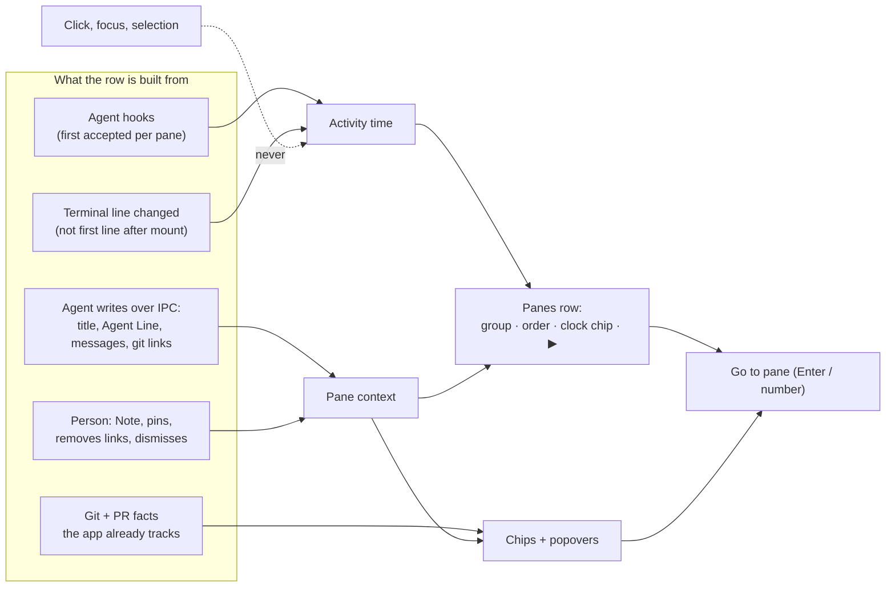

# Panes Stage 1 — Specification

What must be observably true of the Panes sidebar, its popovers and agent-set pane context after Stage 1. Needs, priorities and limits are in the [Requirements](2026-09-25-panes-stage1-requirements.md) (U1–U24). Internal realization belongs to the Program Design.

## The picture



The row tells the person **where** and **what**. Chips summarize and their popovers explain. Acting — approving, opening a view — happens in the pane.

## Domain terms

| ID | Term | Identity and relationships | Invariants and observable states | Basis |
| --- | --- | --- | --- | --- |
| E1 | **Pane** | The existing durable pane identity, independent of tab, focus or section. Pinned or not; drawer or main. | In exactly one section: Pinned Panes or Panes. Has zero or one activity time (E3) and one pane context (E5). | U3–U7 |
| E2 | **Activity occurrence** | One observed event for one Pane: (a) a qualified provider hook **first accepted** for that Pane — the same hook delivered again is the same occurrence; or (b) the Pane's settled terminal line changing to a different line. | Never occurrences: click, focus, selection, creation, scrolling; session start/end hooks; replayed hooks; the first settled line after the Pane's terminal mounts or reattaches; a repeated identical line; any agent IPC write (E5) by itself. | U1, U2 |
| E3 | **Activity time** | Belongs to one Pane: the time of its newest E2 in the current app run. | Never moves backwards. `unknown` until the first E2 of the run and after app restart → `active` (under 60 s) → `aged`. | U1–U3 |
| E4 | **Activity group** | The time bucket of one Pane's E3, chosen by the Pane's section. | Exactly one group while Activity grouping or subgrouping is shown; changes as time passes without any click. | U4, U5 |
| E5 | **Pane context** | Everything written about one Pane by its agent or the person, independent of terminal output: **title**, Note, Agent Line (E6), messages (E7), git links (E8). Title and Agent Line are separate current values (latest write wins for each); links are a set; messages are a log. It also records **which agent runs in the pane** (provider and session reference) with states known / unknown / stale, bound explicitly by a hook session start or the Router — never guessed. | Survives app restart while the Pane exists. Removed with the Pane. The title never goes stale and is not changed by an Agent Line write. | U7, U11–U14 |
| E6 | **Agent Line** (`AgentStatusLine`) | At most one per Pane; the latest write in the **writer's own order** replaces the previous one — order is supplied by the writer's CLI per writer generation and checked by the app, which keeps the last accepted order per writer across clear, expiry and restart; an older write arriving late is ignored. Title and Agent Line are ordered separately. Fields: **summary** (one line, required); **work** — exactly one of: *working* (with progress: indeterminate or step n of m), *monitoring* (what it is watching: CI, a build, another agent), *blocked on you* (with the action the person can take), *done*, *failed* (with a short summary); **detail** (optional prose); **refs** (related items, possibly none); **agent** and **updated time** (set by the app from the writer's authenticated identity, never from the payload); **lifetime** (until replaced, or expires at a time). The Agent Line is the agent's own declaration; it never creates an ask; asks come from the agent's `ask` call or, from PR C on, a permission hook (R25, R25c). | States: `absent` → `current` → `stale` (expiry passed, or the writing provider session ended) → `current` again on a new write, or `absent` when cleared. A stale line stays visible, dimmed; it is never silently removed. | U11 |
| E7 | **Agent message** | One message to the person about one Pane, sent by that Pane's agent session, or by the pane itself when the caller has no session (a pane-level sender can send only notices; an ask needs a bound session). The app stamps the sender and the time; a repeat delivery with the same message identity is the same message. It has an **importance** (info, attention, done, failure) and one of two shapes. A **notice** tells: it never waits and never changes session status (E17). An **ask** needs the person: it gives its **reason** (approval, question or blocked), its **form** (a choice, free text, or a form in the elicitation format), and its **waiting** (non-blocking, or blocking until a deadline). A message may carry actions (E16). | Notice: `unread` → `read` (only when the person opens it; an agent reading context never marks it read) / `dismissed` / `withdrawn` by its sender. Ask: `open` → `answered` (by, value, and whether the agent has received it: not yet confirmed → confirmed, or unconfirmed if the session ended first) / `handedBack` (the person dismissed a blocking ask: the agent's own prompt takes over) / `dismissed` / `expired` / `withdrawn` / `stale`. Each ask settles exactly once. Only the person answers or dismisses an ask (R25b). | U13, U22, U24; PR B S3–S5 |
| E8 | **Git link** | One related item attached to one Pane, recording who added it (agent or person) and when. Two kinds in Stage 1: a **worktree** — a member of the pane's multi-root Bridge membership (known worktrees only) — and a **PR reference** for a PR with no local known worktree. The Pane's current working-directory worktree is a protected member, attributed to the app. | A Pane may have several links across repositories. Links are per-author **contributions**: when the person and an agent (or two agents) add the same item, each authorship is kept and the item shows once. An agent's remove withdraws only its own contribution; the person's remove removes the link itself. The protected current-directory member cannot be removed, and its protection follows the pane's current directory. A drawer pane's links live on its owner pane; its row summarizes them in one git/PR button with a detail popover. | U14 |
| E9 | **Chip** | One small labelled item in a row's chip row, derived from E3, E5, E8, E17, E19 or git facts. | Chips appear in one fixed order (R20). A chip slot that has nothing to say is absent, and its absence never changes row height. | U8–U10 |
| E11 | *(merged into E7, 2026-09-30)* | An approval the person answers in the app is an ask with reason approval (E7). A provider's own permission prompt in its terminal is E18. | — | U22 |
| E12 | *(merged into E7, 2026-09-30)* | An agent question is an ask with reason question (E7): non-blocking unless the agent waits for it. | — | U22 |
| E13 | *(merged into E7 and E16, 2026-09-30)* | A request to open something is a message action (E16) on a notice; taking over the screen is an approval ask (E7). | — | U22 |
| E14 | **Artifact** | One document an agent produced for the person to review: a decision table, a report, a set of pages; markdown, HTML or a file. Identity plus a version record ("which bytes this was written on"). | Authored lifecycle: `active` → `superseded(by another artifact)` or `deprecated`. Messages (E7), their actions (E16) and comments may reference it; an artifact is not a kind of comment. Defined now so references are stable; publishing and viewing arrive in a later stage. | Owner, 2026-09-26 |
| E15 | **Pane change feed** | Per agent session and pane: what the person did since that session last checked — answers to its asks and its messages the person dismissed. Removed links are not in the feed (deferred, owner 2026-10-02); the agent sees them only as absent from current links. | Read by the session's own agent (pull), from the last position that session reported; a lost reply returns the same changes next time. Reading never marks anything read for the person. | Owner, 2026-09-26; PR B S7, R14, R15 |
| E16 | **Message action** | One action on one message (E7): open a file at a line (through Bridge's show), open a PR, or go to a pane. | Its outcome is its owner's: a file open reports opened, shown, declined, notFound or paneUnavailable. Running it never changes the message's read or ask state by itself. | U22; PR B S6 |
| E17 | **Session status** | One per Pane: the status of the agent session currently bound to that Pane (a drawer pane has its own), derived from that session's hook facts, its open provider prompts (E18) and its own open asks (E7). Never derived from a notice, the Agent Line, or a payload claim. | `needsYou(approval / question / blocked)` while any provider prompt or ask of the session is open → otherwise `failed(summary)` / `working(active / monitoring)` / `idle(done / ready / interrupted / ended)` / `unknown`. A drawer session's asks never change its owner pane's status. After its session ends, the Pane keeps that session's last status (`idle(ended)`, or `needsYou` while its own asks are open) until a new session binds or the Pane retires. | U16 (amended 2026-09-30); PR B Spec S2, PD rev 16 value rule |
| E18 | **Provider prompt** | A hook saw the provider ask the person something in its own terminal: an AskUserQuestion, an MCP elicitation, or (before PR C) a permission request. From PR C on, a permission request is NOT a provider prompt: the installed permission hook waits on a blocking approval ask (E7, R25). | Observed, never answered in the app; the hook never waits for it. `open` → `resolved` (its own completion, or a turn boundary) / `ended` (the session ended or was replaced). Makes E17 `needsYou` while open. | U16, U22; PR B S13 |
| E19 | **Pull-request summary** | One per Pane with two or more linked worktrees (E8): a summary of those worktrees' pull requests, derived by the app from forge facts and never stored. A Pane with one linked worktree keeps its existing PR chip. | `needsAttention(count)` (count = members whose PR has failing checks or changes requested) / `running` / `allGood` / `noInfo`. Unknown checks, no PR and unknown are neutral; unknown checks never hide a known review failure. | U19; PR B S14, R32 |
| E10 | **Sidebar list navigation** | Keyboard focus in the Panes list, entered with Cmd+Shift+S; remembers the pane that had typing focus. | `off` → `on` (one selected row) → `off` when a pane is opened or navigation is cancelled; cancel restores prior typing focus. | U15 |

## Obligations

### Activity (U1–U3)

- **R1.** When a qualified agent activity hook is first accepted for a Pane, that Pane's activity time MUST become that moment. Qualified means turn start, tool or subagent activity, turn done or abort, permission, question or elicitation, as each provider profile already supports. A hook that Sessions treats as historical (for example, after an app relaunch ended its binding) still counts if it is first accepted for that Pane.
- **R2.** When a Pane's settled terminal line changes to a different line, that Pane's activity time MUST become that moment, except for the first settled line after the Pane's terminal mounts or reattaches.
- **R3.** Clicking, focusing, selecting, creating, scrolling, session start/end hooks, a replayed hook, and agent IPC writes MUST NOT change any Pane's activity time.
- **R4.** The clock chip MUST show the age of the activity time, or "—" when unknown; never interaction or creation time.
- **R5.** ▶ MUST appear exactly while the activity time is under 60 seconds old, disappear at 60 seconds without any click, and never depend on focus.
- **R6.** Activity grouping and activity sorting MUST use the same activity time as the clock chip. Selecting a Pane only highlights it; a selected Pane keeps its age and group.

### Sections and groups (U4–U6)

- **R7.** Sections are titled **Pinned Panes** and **Panes**.
- **R8.** Pinned Panes MUST group as **Active** (under 60 s), **Recent** (under 1 hour), **Older** (1 hour or more, or unknown).
- **R9.** Panes MUST keep **Active, Just Now** (under 10 min)**, Last hour, Today, Last 7 days, Older, No activity**.
- **R10a.** The Panes sidebar MUST offer an icon toggle, with a keyboard shortcut, to show or hide drawer panes under their owner pane, like showing or hiding sub-issues. It sits in the sidebar's own control row immediately next to the existing pin toggle and matches its style (icon only, accent when on, tooltip and shortcut from the command spec) — never in the window toolbar. A drawer row shows **one git/PR summary button** — colored like today's PR button, using the multi-PR summary vocabulary (needs attention (N) · running · all good · no PR info) — covering every worktree and PR in its owner pane's links; pressing it opens a popover listing each worktree and PR with its state and who added it (owner clarification 2026-09-26).
- **R10b. Drawer tree.** When drawers are shown, each drawer row sits directly under its owner row, ordered by its own activity, and reads as a child like a sub-issue. A thin separator-colored rail starts in the owner's icon column just below the owner's last icon-column glyph (so it never crosses the owner's icons), runs down past the owner's chip line, and turns into each drawer's pane icon at that drawer's title line (├ for each drawer, └ for the last). The rail ends at the last drawer's title line. The drawer's own lines are indented one icon column so its glyphs line up in its own icon column. The rail never crosses the owner's icons, never floats left of the icon column, and is not drawn when drawers are hidden. A drawer whose owner is not in the same section or is filtered out shows unindented with its Drawer chip.

```text
▢  agent-studio.pane-fixes                  1
⑂  agent-studio · pane-fixes
●  Splitting the activity clock
│  [⎇ 2 ✓] [+29 −1] [⏱ now] [▶]
├─ ▤  advisor                                2
│     ⑂ agent-studio · pane-fixes
│     ● Reviewing the IPC spec
│     [▢ Drawer] [⎇ 2 ✓] [🔔 1] [⏱ 2m]
└─ ▤  tests                                  3
      [▢ Drawer] [⏱ 9m]
```
- **R10.** Panes are grouped by activity only: the Repo and Tab grouping options are removed from the Panes sidebar (owner, 2026-09-26: multi-repo work makes Repo grouping misleading; Tab grouping confused pins). With them go the Panes subgroup options, which only applied under Repo/Tab grouping. The matching commands, shortcuts and IPC grouping results are removed in the same change (hard cutover). Pinned-pane traversal (Option+Shift+Up/Down) MUST follow the displayed pinned order. The Repos and Inbox surfaces behave as today.

### The row (U7, U8, U10, U11)

```text
▢ agent-studio.pane-fixes                               1   ← title (agent-set title, else pane name)
  ⑂ agent-studio · pane-fixes                               ← worktree · branch
  ✎ terminal activity fixes + other systems                 ← Note — only if the person wrote one
  ◉ Implementing OAuth controller                           ← Agent Line summary — only if set; glyph = state
  [▢ Drawer] [⎇ all good · 3] [+29 −1] [↑6 ↓0] [🔔 1] [⏱ 4m] [▶] ← chips, fixed order
```

- **R11.** The first line MUST show the agent-set title when one exists, otherwise the pane's current name.
- **R12.** The second line MUST show worktree · branch when the Pane belongs to a worktree.
- **R13.** The Note line MUST appear only when the person has written a Note. The Agent Line MUST appear only while an Agent Line exists (current or stale). The Session status line MUST appear only while the Pane has a session status other than `unknown` (E17), including the last status kept after its session ends. Raw terminal output MUST NOT appear on the row.
- **R14.** The Agent Line MUST show its summary on one line, truncated with an ellipsis, led by a glyph for its state. A stale Agent Line MUST render dimmed.
- **R15.** Chips changing, appearing or disappearing MUST NOT change the row's height or shift the row's text lines. The chip row is always present (the clock chip is always shown).

### Row and chip design (U7–U10, U19)

Every line of a row uses the same grid: a fixed **icon column** on the left (today's `rowLeadingIconColumnWidth`), then text. Nothing is indented outside that grid.

| Line | Icon column | Text | Present when |
| --- | --- | --- | --- |
| Title | pane icon (drawer icon for drawer panes) | title, semibold; number badge at the trailing edge | always |
| Worktree · branch | git-branch icon | `repo · branch`, secondary | the pane belongs to a worktree |
| Note | note (pencil) icon | the person's note, secondary | the person wrote one |
| Agent Line | **work glyph** (below) | the summary, primary weight, one line, tail-truncated | an Agent Line exists (dimmed when stale) |
| Session status | **status glyph** (below) | the status in words, e.g. `Needs you · approval`, `Working`, `Idle · done`, secondary | the Pane's session status is not `unknown` (R13, R21a) |
| Chips | empty (reserved, never used for a spinner) | the chip set, in fixed order | always (the clock chip is always shown) |

**Every row shows every line (owner, 2026-10-01, provisional: "show all for now; change it if I hate it").** Every row, selected or not, shows every line that exists, in order: title; worktree · branch; note; Agent Line; Session status; then the chips. Selection only adds this checkout's changes and ahead/behind chips. This supersedes the 2026-09-26 one-context-line rule for rows that aren't selected. Which lines show is one presentation table, so a later owner change is a one-row edit. Likely revisits: the Agent Line and Session status saying the same thing, and an ended session's `Idle · ended` line.

**Agent Line work glyph** — shows the agent's own declared work when an Agent Line exists, colored with the existing chip colors:

| Work | Glyph | Color |
| --- | --- | --- |
| working | filled dot | success (green) |
| monitoring | dotted circle | info (blue) |
| blocked on you | flag | warning (orange) |
| done | checkmark | neutral (secondary) |
| failed | x in an octagon | danger (red) |

**Session status glyph (R21a)** — on the Session status line, colored with the existing chip colors; the Agent Line keeps the agent's own work glyph, and neither overrides the other:

| Status (E17) | Glyph | Words | Color |
| --- | --- | --- | --- |
| needs you | flag | `Needs you · approval` / `· question` / `· blocked` | warning (orange) |
| failed | x in an octagon | `Failed`, then the summary when present | danger (red) |
| working | filled dot | `Working` (`· monitoring` when monitoring) | success (green) |
| idle | checkmark (done) or hollow circle (ready / interrupted / ended) | `Idle · done` / `· ready` / `· interrupted` / `· ended` | neutral (secondary) |
| unknown | — | no Session status line | — |

**Chips** — each is the existing `SidebarChip` capsule (same height, padding, font and colors), in this order:

| # | Chip | Content | Color | Shown when |
| --- | --- | --- | --- | --- |
| 1 | Drawer | drawer icon + "Drawer" | neutral | drawer panes |
| 2 | Git/PR summary | PR icon + count + state glyph (✓ / ✗ / dotted circle / none) — no words | success · danger · info · neutral | the pane (or its owner) has linked worktrees or PRs, or its branch has a PR |
| 3 | Changes | `+a −d` or `untracked` (today's diff chip) | today's colors | the checkout has changes |
| 4 | Ahead/behind | `↑a ↓b` (today's sync chip) | today's colors | an upstream exists |
| 5 | Messages | bell + count of approvals, replies and attention (R20) | the most urgent counted type: danger (needs approval) · warning (needs reply, attention) · info only when informational is turned on | counted > 0 |
| 6 | Clock | clock + activity age, or "—" | today's recency tiers | always |
| 7 | Active | play icon, no text | accent | activity under 60 s |

**Stability rules:**
- The chip row is always present, so chips appearing or disappearing never change the row's height.
- While PR facts load, the git/PR chip shows its icon and count with no glyph, in neutral. There is no separate spinner, and nothing moves.
- Chips never wrap. If the row is too narrow, chips hide from the right in this order: ahead/behind, then changes. The git/PR chip, messages, clock and Active always stay.
- A row's height changes only when a whole text line appears or disappears: a note is written or cleared, or an Agent Line is set or cleared. It never changes when an existing line's text updates.
- **The view never jumps.** Whenever rows change height, appear, disappear or reorder for any reason other than the person scrolling, the first visible row — the topmost row with any part on screen — MUST keep its position on screen, so everything the person is looking at stays put. The row is followed by the pane (or header) it shows, not by its place in a group: if that pane moves to another group, the view follows the pane. Only if the pane leaves the list does the next previously visible row become the anchor. Exception: when the list is scrolled to the very top, it stays at the very top, so new rows above come into view (owner, 2026-09-26). (Today the list restores its top row only for structural updates, not for height changes inside a row. Owner, 2026-09-26: once this holds, dynamic lines are welcome.)

### Chips (U9, U10, U13, U14)

- **R16.** Chips MUST appear in this order, each only when it has something to say: **Drawer · git/PR summary · changes · ahead/behind · messages · clock · ▶**.
- **R17.** **Drawer** — a drawer pane shows the drawer icon with the text "Drawer", first.
- **R18.** **Git/PR summary** — one button on every row (main and drawer) when the pane (or, for a drawer, its owner pane) has linked worktrees or PRs, including the pane's own branch PR. With two or more linked worktrees it shows the pull-request summary (E19), which Panes displays and never derives; with one, it is the pane's existing PR chip. On the row it is compact like today's PR chip: the git/PR icon, a count, and a state glyph, with color carrying the state — ✓ green (all good), ✗ red (needs attention), ◌ blue (running), no glyph grey (no PR info or unknown). The summary words (needs attention (N) · running · all good · no PR info) appear only in its tooltip and the popover header, never as chip text. Its popover lists each worktree and PR (number, checks and review; title, mergeability and who added it once Bridge's link membership (B2) supplies them), opens it, and lets the person remove links they may remove (B2). In the pane's bottom toolbar the same summary is a worded button — e.g. "needs attention (1)", "running", "all good" — colored the same way, because there is room and the person is acting there. Sidebar chip and toolbar button open the same popover (owner, 2026-09-26).
- **R19.** The changes and ahead/behind chips stay separate: they describe this pane's own checkout, not its linked work.
- **R20.** **Messages** — each message (E7) has one attention type, derived from its shape and importance: **needs approval** (a blocking ask), **needs reply** (a non-blocking ask), **attention** (a notice with importance attention or failure), **informational** (a notice with importance info or done). The chip MUST count needs approval + needs reply + attention, tinted by the most urgent type present; informational messages are listed but not counted unless the person turns that on. The popover MUST list open asks first, then notices newest first, and MUST let the person filter by attention type; an approval is never below an informational message. Opening a notice marks it read; the person can dismiss each or all.
- **R21.** Clicking the Agent Line opens a popover with its summary, state, step, detail, refs, agent and age.
- **R21a. Session status line.** The row's Session status line MUST show the pane session's status (E17) as a glyph plus words: needs you (with its reason), failed, working, or idle (with done / ready / interrupted / ended); `unknown` shows no line. The Agent Line keeps the agent's own work glyph and text; the two lines never override each other. Panes shows no status categories, sections or grouping (U16). A drawer session's status is shown on the drawer's row, not its owner's.
- **R22.** Every chip popover MUST offer **Go to pane**. Sidebar popovers inform and allow only removing links, marking notices read and dismissing them; answering asks, opening files and other actions happen in the pane.
- **R23.** Popovers MUST use the same popover style as the pane arrangement popup.

### In the pane (U13, U18)

- **R24.** A pane with counted messages (R20) — its own or from any of its drawer panes — MUST show a button in its bottom icon bar with the count; clicking opens the pane's message popover, which labels which drawer each item came from. A blocking ask MUST open that popover automatically; nothing else does, and a notice never takes focus or opens anything by itself. *(Exact drawer presentation iterates in UI.)*
- **R24a.** Git links written by an agent in a drawer pane MUST land in the owner pane's links, recorded with the drawer agent as author. A drawer pane's row shows them through its single git/PR summary button (R10a), not as separate chips.
- **R25.** The person MUST answer an agent's ask (E7) in the pane's message popover: a choice, free text, or a form, per the ask's form. Dismissing a blocking ask MUST hand the decision back to the agent's own prompt (`handedBack`); dismissing a non-blocking ask records it as dismissed. An ask nobody answers before its deadline shows as expired, and its agent decides. **Permission requests (from PR C on):** the installed Claude Code / Codex permission hook (and Cursor's) waits on a blocking approval ask whose choices are **Allow**, **Deny** and **Ask** (hand the decision back to the agent's own prompt); its timeout, withdrawal or hand-back MUST NEVER grant permission, and what the provider then does on its own is shown truthfully (Cursor's timeout behavior is an owner decision). After answering, the pane MUST show whether the agent has received the answer (not yet confirmed, confirmed, or unconfirmed if the session ended first). A take-over request to open a file is an approval ask: Allow opens it on screen through the normal human path; Deny, dismissal or expiry opens it in the background instead (the agent receives `declined`).
- **R25c. Provider prompts.** A provider prompt (E18: an AskUserQuestion, an MCP elicitation, or a permission request before PR C) MUST show only as the session status needs you (R21a) until it resolves; the app MUST NOT offer to answer it. The person answers it in that terminal.
- **R25a.** Sessions keeps recording provider-prompt evidence as today; answering an agent's ask happens through the pane, not through Sessions.
- **R25b.** Only the person, through the app, MAY answer or dismiss an ask. An agent MUST NOT answer or dismiss its own or another agent's ask, and writing to its own pane never grants that. An answer to an ask that has already settled (answered, handed back, dismissed, expired, withdrawn or stale) MUST be refused with that reason.

### Agent writes (U11–U14, U17)

- **R26.** An agent MUST be able to set and clear its pane's Agent Line, set its pane's title, send its pane a notice or an ask, withdraw its own messages, and add or remove git links — through Agent Studio IPC and its CLI, never through zmx.
- **R27.** An agent's own credential MUST write only its own pane, with one exception: an agent in a drawer pane MAY write git links into its owner pane, and only links, re-checked when the write commits. Writing any other pane requires an explicit existing grant.
- **R28.** The installed Claude, Codex and Cursor hooks MUST report what they see through the same IPC path as agents: session facts (including provider prompts, E18) for status, notices for events worth telling the person (for example, a finished turn); and from PR C the permission hooks wait on a blocking approval ask (R25).
- **R29.** Adding a link that already exists MUST have no second effect, and removing one that is absent MUST succeed with no effect (idempotent). An agent MAY remove or discard links it added. A re-add after the person removed a link is a normal add; the agent learns of the removal from its pane's change feed, and the person tells the agent directly if a link should stay gone (owner decision 2026-09-26, relayed by the IPC orchestrator). Link kinds beyond git (artifacts and others) may be added later without changing these rules.
- **R30.** Pane context MUST survive app restart for as long as the Pane exists, and MUST disappear with the Pane.

### Switching (U15)

- **R31.** Cmd+Shift+S MUST focus the sidebar list that is showing (Panes or Repos), keeping the current selection or else selecting the first pane row; `P` and `R` switch between Panes and Repos as today (owner delegated, 2026-09-26). Switching with `P` or `R` MUST keep list focus: the newly shown list keeps keyboard navigation, and only R32's exits leave it (owner, 2026-09-30).
- **R31a. Arrows.** ↑/↓ MUST move the selection through pane rows in displayed order: main rows and, when drawers are shown, drawer rows under their owner. Section and bucket headers and the rows of collapsed buckets are skipped. ← moves to the row's bucket header (a second ← collapses it); → on a header expands it and moves to its first pane. Moving the selection expands the newly selected row and compacts the previous one, under the no-jump rule. Enter opens the selected pane (owner, 2026-09-26).
- **R31b. Drawers key.** While the list has focus, `D` MUST show or hide drawer rows — the same command as the sidebar's drawer icon toggle. If the selected row is a drawer when drawers are hidden, the selection moves to its owner pane (owner, 2026-09-26).
- **R31c. Number badges.** The number badges are keyboard hints. They appear only while the list has keyboard focus, and number the first nine selectable pane rows top to bottom: pinned rows first, and drawer rows when drawers are shown. Pressing that digit opens the pane. A number belongs to the row's position on screen, not to the pane, so it always matches what is shown. Pinning a pane is how to give it a low, steady number. `Option+1…9` (pane in tab) and `Cmd+1…9` (tab) keep their existing meanings (owner delegated, 2026-09-26).
- **R32.** Escape, or Cmd+Shift+S again, while the list has focus MUST leave list navigation, cancel any preview and return typing to the previously focused pane. If the filter field has focus, its first Escape returns to the list as today.

## Pane context contract

This is the shared contract the IPC workstream (PR B) implements and Panes (PR C) displays. It fixes meaning; method names, wire shapes and limits belong to the IPC design, which cites this section.

| Operation | Written by | Meaning |
| --- | --- | --- |
| Set / reset title | Pane's agent | Replaces the pane's displayed title (R11); reset returns it to the pane's own name. |
| Set / clear Agent Line | Pane's agent | Replaces or removes E6. The app stamps agent identity and time. |
| Send a notice or ask | Pane's agent; installed hooks (notices, and from PR C the permission hook's blocking approval ask) | Adds one E7: a notice unread, an ask open. |
| Withdraw | The message's sender | Moves its notice or open ask to withdrawn. |
| Answer / dismiss an ask | The person (app) | Settles one open ask once: answered, or dismissed (a blocking ask is handed back to the agent's own prompt). The asking agent learns the outcome from its change feed (E15), or from its own wait for a blocking ask. |
| Report session facts | Installed hooks | Updates session status (E17), including provider prompts (E18); never answered in the app. |
| Show a file | Pane's agent | Opens a file through Bridge in the background and adds one informational notice with an open-file action (E16); take-over is an approval ask first. |
| Add / remove git link | Pane's agent (own links), the person (any link) | Adds or removes one E8 with its author. |
| Read pane context | Panes, the pane's agent | The current E5 for one pane: title, Note, Agent Line, open asks then unread notices, links with the pull-request summary (E19), and the bound session and its status (E17). |
| Pane context changed | IPC → Panes | Tells Panes one pane's context changed; Panes reads the latest state. No history replay is required. |

Rejected writes (wrong pane, missing grant, invalid field) MUST change nothing and return an error the agent can read.

## What this does not promise

- Activity is best effort: identical repeated lines do not refresh it, and a TUI that redraws with a changed line after focus can register.
- Activity time does not survive restart; pane context does.
- No Running, Needs You or Done category, section or grouping appears in Panes; a row's Session status line shows its session status (R21a), and notices never change it.
- No new keyboard shortcut; no zmx change.

## Examples

| Situation | Result |
| --- | --- |
| A Codex tool hook arrives for pane 4 | Pane 4 moves to Active, "⏱ now" and ▶; after 60 s ▶ goes. |
| The person clicks a pane idle for 3 hours | Highlighted; still "3h" and in its group. |
| App relaunch restores all terminals | No pane becomes Active from the restore; clocks show "—"; Agent Lines and links are still there. |
| An agent sets its Agent Line to "Writing tests", state working, then its session ends | The line stays, dimmed as stale, until the agent writes again or it is cleared. |
| A Claude permission hook fires (PR C on) | The hook waits on a blocking approval ask: the messages chip counts it as needs approval, the pane's message popover opens with Allow, Deny and Ask, and the status glyph shows needs you (approval). Allow or Deny reaches the waiting hook; Ask hands the decision back to Claude's own prompt; timeout never grants. No Needs You section appears in Panes. |
| Claude asks a question in its own terminal (AskUserQuestion) | The status glyph shows needs you (question) until it is answered in the terminal; nothing in the app offers to answer it. |
| An agent sends a blocking approval ask (for example a take-over show) | The messages chip counts it as needs approval; the pane's message popover opens automatically with Allow and Deny; for a take-over show, Deny, dismissal or expiry opens the file in the background and the agent receives `declined`; for a permission ask, dismissing hands the decision back to the agent's own prompt. |
| An agent links a second repo's PR | The git/PR summary chip counts it once the pane has two or more linked worktrees; the git/PR popover lists it, and the person removes it there (through Bridge, once B2 lands). |
| No Note and no Agent Line | Row shows title, worktree · branch and the chip row only. |

## Screens

These show the target screens. The obligations above govern; labels are illustrative, and visual details iterate after the first working version.


*The whole sidebar. Notice: clocks match their groups; ▶ only on Active rows; the selected row in Older still reads 19d; the drawer row sits under its owner with its own Agent Line and the owner's git/PR summary; no row shows raw terminal output.*


*What each line and chip means. Chips never change the row's height.*


*One popover for all linked work. Notice: the current directory is protected (no remove), each link says who added it, and a PR with no fetched facts is "status unknown", listed but not counted.*


*Acting happens in the pane. Notice: the approval shows who asked, what, why and when it expires; the question below never blocks and comes from a drawer.*

## How each obligation is proven

| Obligations | Evidence |
| --- | --- |
| R1–R6 | Automated tests on the real hook and settle paths with a controlled clock: first accept vs replay, historical-but-first hooks, session start/end, first line after mount, repeated line, click/focus, the 60 s edge. |
| R7–R10, R16 | Automated projection tests: sections, groups, pinned traversal order, chip order; Repos unchanged. |
| R11–R15, R17–R24, R31–R32 | Visual and keyboard evidence from the running debug app: row lines present/absent, stable height while chips change, each popover's contents and actions, bottom-bar button, auto-open approval, Cmd+Shift+S entry and both exits, arrow order through drawers, `D` toggle, number badges only while focused. |
| R25–R30 | Integration tests through real IPC and CLI: a permission ask's Allow / Deny reach the waiting hook, Ask hands back, a timeout or withdrawal never grants, and the hook's wait ends before the provider's own hook timeout; own-pane writes accepted, other-pane writes rejected without a grant, hook notices and session facts arrive, asks answered/dismissed/expired settle once and reach the asking agent's change feed, provider prompts show as status and are never answerable, link add/remove with author, removed link not silently restored, pane context present after app restart. |
