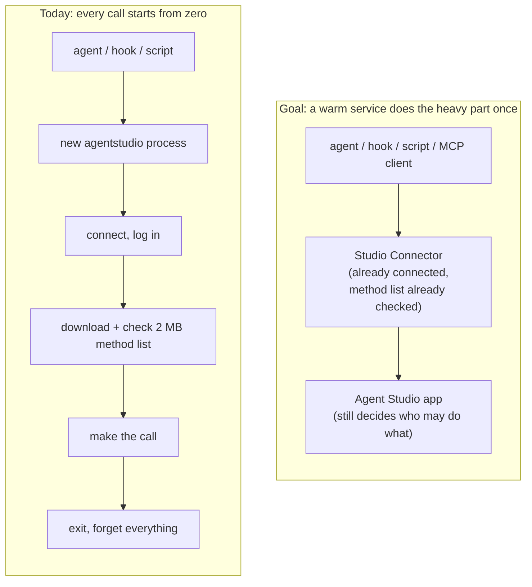
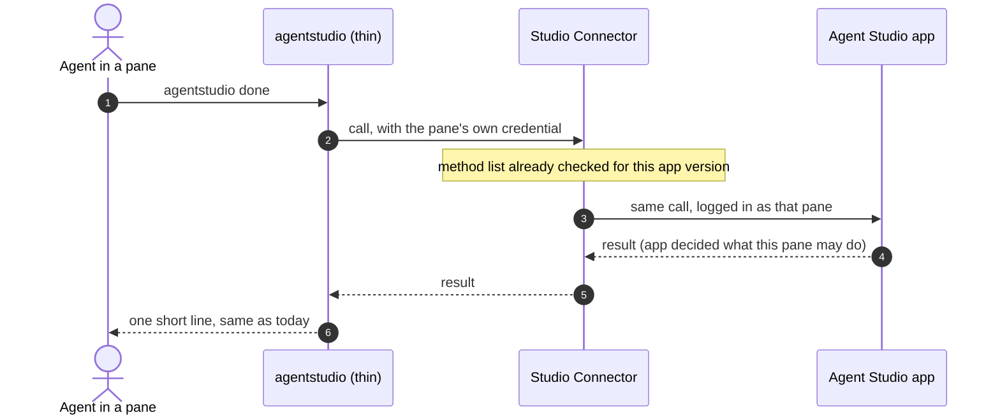
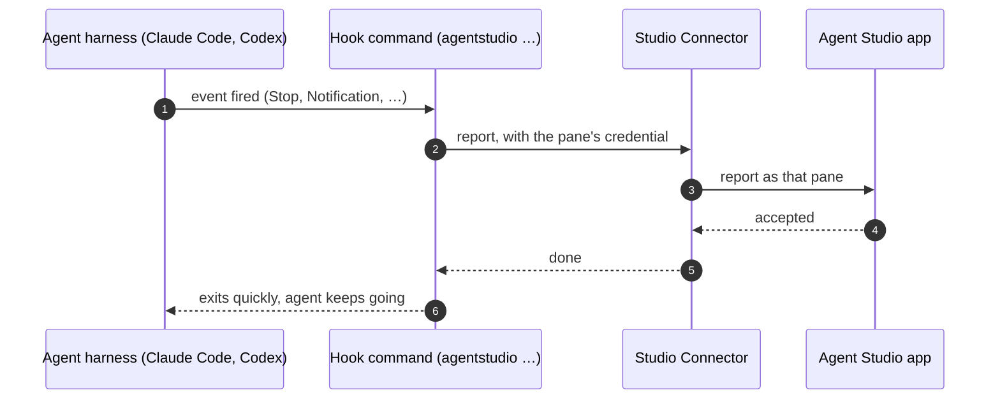
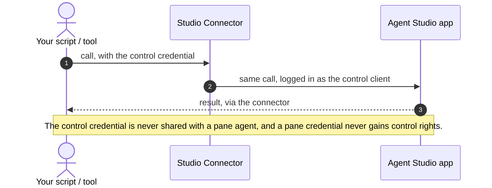
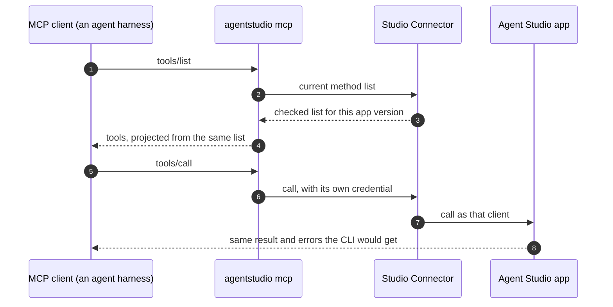
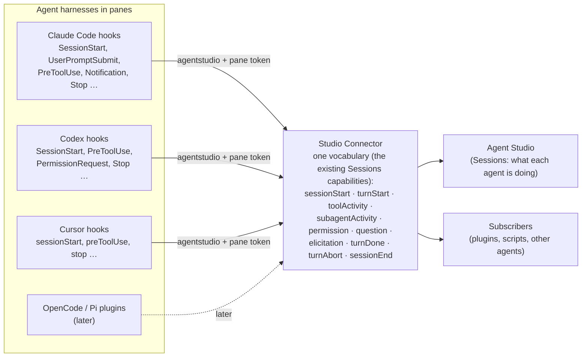
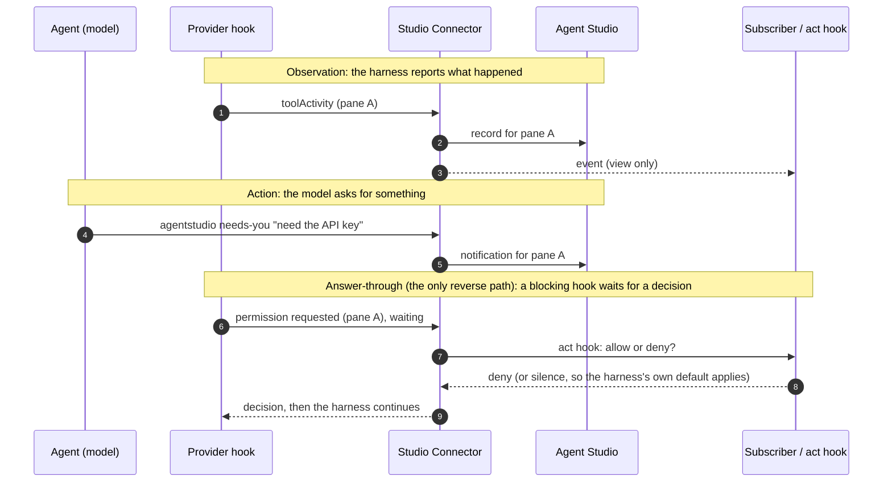
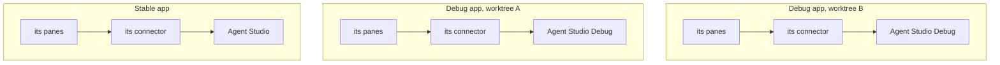

# Studio Connector: what we need and why

Date: 2026-09-25. These are the owner-approved needs behind the [Studio Connector specification](2026-09-25-studio-connector.md). They build on [Agent IPC v2](../2026-09-12-agent-ipc-v2/specification.md), whose rules stay in force unless a need below changes them.

## The idea in one picture

Every time an agent, a hook or a script talks to Agent Studio today, it starts a brand new `agentstudio` process. That process connects, downloads the full 2 MB list of methods, checks every entry, makes one call, and exits. The next call does it all again.

The Studio Connector is a small service that the app starts next to itself. It stays connected and keeps the checked method list, so each call only pays for the work the app actually does. Every client still logs in with its own credential, and the app still decides what each client may do.

Measured on 2026-09-25 with a release build and a warm app: listing methods takes 2.7 s and listing commands takes 5.7 s. The app's own share of that is under 1 s.

## Who needs this

| Who | What they do | What they need |
| --- | --- | --- |
| Agent in a pane | A Claude, Codex or Cursor agent calling Agent Studio through `agentstudio` or its skill | Calls that answer about as fast as the app can do the work |
| Provider hook | A short command the agent harness runs on events such as Stop or Notification | To finish fast enough never to slow the agent down |
| Owner automation | Your own scripts and tools, using the control credential | The same fast, typed surface agents get |
| MCP client | An agent or harness that speaks MCP | Agent Studio methods as MCP tools that behave exactly like the CLI |
| Maintainers | Keep one method catalog and one authority model | No second catalog, no weaker login, no slower app startup |
| Future plugins and remote terminals | Register hooks at runtime; run terminals on other machines | Nothing built now should block them later |

## How each of them works with the connector

### An agent in a pane (needs 1, 2, 3, 6, 7, 8)

Today each call spends most of its time rebuilding what the connector already holds. With the connector, the command, its arguments and its replies stay the same. Only the waiting goes away.

### A provider hook (needs 1, 2, 3)

Hooks are installed per provider (IPC v2). They keep calling the same `agentstudio` command, so nothing reinstalls.

### Owner automation (needs 1, 2, 7)

### An MCP client (needs 4, 2, 6)

### Every agent reports its lifecycle through the connector (needs 11, 12, 17, 18)

Claude Code has no socket or app server that Agent Studio can listen to, while Codex has an app server and some agents speak ACP. The common path is the provider's own hooks. Installed per provider, each hook calls `agentstudio` with the pane's own identity from the environment. That turns the connector into one socket for every agent, whatever its harness.

Two things stay separate, because the providers mix them:

- **An observation** says that something happened: an agent finished, a permission prompt appeared, a tool ran. Claude's `Notification` hook is an observation.
- **An action** is something the agent or a hook asks Agent Studio to do, such as telling you it needs you. `agentstudio needs-you`, `done` and `message` are already actions the model can call (IPC v2).

### Many app instances at once (need 5)

Each running app gets its own connector, which starts and stops with it. Several debug apps often run at once, one per worktree, and they never share.

## The needs

These are numbered so the specification can point to them. "Build" means round 1 delivers it; "design" means the design must cover it now, but it is built later.

| # | Need | Why it matters | Scope | Priority |
| --- | --- | --- | --- | --- |
| 1 | A call does not re-download or re-check the method list. After the first client, a call costs about what the app's own work costs. | Agents call often, and 3 to 6 s per call wastes their time. | Build | Must |
| 2 | Every client keeps exactly its own authority. The connector never widens, shares or swaps a client's identity, and the app still checks every call against the real caller. | Pane agents must never gain another pane's rights or the owner's control rights. | Build | Must |
| 3 | `agentstudio` keeps its verbs, arguments, one-line replies and exit codes. It becomes a thin client of the connector. | Installed hooks and skills keep working unchanged. | Build | Must |
| 4 | MCP clients get the methods as MCP tools, built from the same method list, with the same meaning, rights and errors as the CLI. | One contract for CLI and MCP, so they never drift apart. | Build | Must |
| 5 | Exactly one connector per running app, started and stopped by that app, never shared, including when several debug apps run at once. | Each app has its own data, sockets and version; mixing them breaks all three. | Build | Must |
| 6 | When the app's method list changes, clients see the new list and never a stale one. | Upgrades today, plugin registrations later. | Build | Must |
| 7 | App startup, the first window and terminals never wait for the connector, and a broken connector never breaks them. | The app must stay usable even if the connector fails. | Build | Must |
| 8 | Checking stays strict: bad input still fails with the same clear reasons and fixes as today. The strict check happens once per method list, not once per call. | Speed must not cost correctness. | Build | Must |
| 9 | One method list. The connector, CLI and MCP add no second catalog and no hand-written mapping. | A second catalog would drift. | Build | Must |
| 10 | Hooks and events are fully designed now, so round 1 cannot close their doors. | You want plugins that register hooks in real time later. | Design | Must |
| 11 | Events: a client can subscribe to named facts and receive them in order, with no reply expected. Facts include agent lifecycle facts reported by provider hooks (need 17) and app facts IPC v2 already emits (a command finished, a pane changed). Slow subscribers never slow the app, and lost events are reported, not silent. | Agents and plugins react to what happens without polling. | Design | Must |
| 17 | Every agent harness reports its lifecycle through its provider's hooks, which call `agentstudio` with the pane's own identity from the environment. The shared vocabulary is the one Agent Studio already has: the Sessions provider capabilities (`sessionStart`, `sessionEnd`, `turnStart`, `turnDone`, `turnAbort`, `permission`, `question`, `elicitation`, `toolActivity`, `subagentActivity`, defined in `SessionsProviderCapability`), with each provider profile declaring which ones it supports. Each event keeps the provider's original hook name alongside it. The connector adds no second vocabulary. | Claude Code has no socket or app server to listen to, so hooks are the one path that works for every harness. Panes Stage 1 already counts pane activity from these same capabilities. | Design (build per provider later) | Must |
| 20 | Agents write their pane's context over IPC: a title, a status note (separate from the person's pinned note), notifications (shown on the pane's sidebar row and in the pane's inbox), and related git links (link or unlink repositories, worktrees and PRs to the pane). The person can see and remove every link an agent made. Only the pane's own agent, or an identity with rights over that pane, can write it. The shared pane-context contract is authored in the Panes work; this design supplies the IPC methods and permissions (PR B). | You want to see at a glance what each agent is doing and which PRs and worktrees belong to it, without opening the pane. Owner direction 2026-09-26, via the Panes Stage 1 alignment. | Design now; PR B builds the IPC methods on IPC v2 (it does not wait for the connector) | Must |
| 18 | Observations and actions stay separate. An observation reports that something happened. An action asks Agent Studio to do something: notify you (`needs-you`, `done`, `message`, already in IPC v2), and later more. The same action can be called by the model, by a hook, or by a plugin. | Providers mix the two (Claude's `Notification` is an observation, Pi's `notify()` is an action); mixing them would make hooks guess. | Design | Must |
| 19 | The only reverse path is answer-through. A blocking provider hook (for example a permission or pre-tool hook) can wait for a decision from Agent Studio or an act hook within the hook's own time limit. Silence means the harness's own default applies. Agent Studio typing into an agent (steering) stays out of scope. | Lets Agent Studio or a plugin approve or deny what an agent is about to do, without breaking the agent when nobody answers. | Design | Should |
| 12 | Act hooks: at a named decision point, the app asks registered hooks and lets them allow, deny or change what happens, within a deadline. Silence, errors or timeouts fall back to what the app would have done anyway, and the user is never blocked. | Plugins can route, filter or enrich things before they happen. | Design | Must |
| 13 | One way to register: provider hooks and plugins register events and act hooks the same way, live, over the connector. A registration disappears when its owner disconnects or loses its credential. | No stale hook outlives its owner. | Design | Must |
| 14 | A hook never exceeds its owner's rights. It only sees what its owner may see and only changes what its owner may change. When several act hooks apply, their order is fixed and predictable. | Plugins must not become a way around the app's rules. | Design | Must |
| 15 | Registering or removing a hook changes the method list's identity, just like any other change, so clients and MCP tool lists stay truthful. | Clients should always know what is currently available. | Design | Should |
| 16 | Nothing in round 1 blocks a later remote setup (a connector or terminal service on another machine). | Your long-term plan includes terminals on any server. | Design | Could |

## What is not in round 1

Round 1 does not build hooks, events, plugin registration, remote or network access, a connector shared between apps, or a connector that runs while its app is closed. Offline notification spooling stays in `agentstudio` as it works today. There is no SDK or Rust client, and no Router integration.

## Open questions for the owner

A. **Events.** Settled on 2026-09-25. Events flow from provider hooks through the connector to Agent Studio and subscribers (needs 11 and 17). The only reverse path is answer-through (need 19).

B. **Which act-hook points to design first.** Your pick: notification delivery, command execute and permission request. What each point can prove today:

| Hook point | What a hook would do | Can we prove it now? |
| --- | --- | --- |
| Notification delivery | Route a needs-you or message elsewhere, hide it while you are looking at that pane, merge duplicates, add context | Yes. Notifications already exist, so a hook's effect is visible end to end. |
| Command execute | Allow, deny or adjust an app command an agent runs through IPC | Yes, but it is powerful, because a hook here can stop or change commands. |
| Permission request | Approve or deny an agent's request for extra rights | Not yet. IPC v2 issues no extra rights in round 1, so there is nothing to decide. |

The proposed cut: design notification delivery and command execute fully, and write down why permission requests wait until grants exist.

## Where these needs come from

- **Your decisions in the 2026-09-25 design chat:**
  - make the client stateful and spin it out;
  - one service where each client is authorized separately;
  - round 1 is the core plus MCP;
  - the app starts the connector;
  - call it Studio Connector;
  - one per app instance;
  - hooks that act and hooks that only view, registered live;
  - three tiers (app, connector, remote terminals);
  - keep checking strict;
  - design hooks and events now even though they are built later.
- **The measurements** from PR #364 (2.7 s and 5.7 s per call, under 1 s of app work).
- **How login works today:** each connection logs in with its own credential as a pane agent, a control client or a debug client.
- **Your Router:** it already works this way (a long-lived service, one schema identity, an MCP server built from that schema).
- **opencode's plugin hooks:** some change what happens, and one kind only observes.
- **The existing Sessions provider capabilities** (`SessionsProviderAdapterRegistry.swift`, per-provider `qualifiedCapabilities` in the Claude Code, Codex and Cursor profiles), which Panes Stage 1 also uses for pane activity. The Panes Stage 1 orchestrator agreed on 2026-09-26 to this shared vocabulary and asked the connector design to own the agent status-line action (need 20).
- **A provider lifecycle comparison the owner shared on 2026-09-25** (Claude Code, Cursor, Codex, OpenCode v2 and Pi hook vocabularies; the observation vs. action distinction for notifications). The specification checks each provider's hook names against current provider docs before relying on them.
