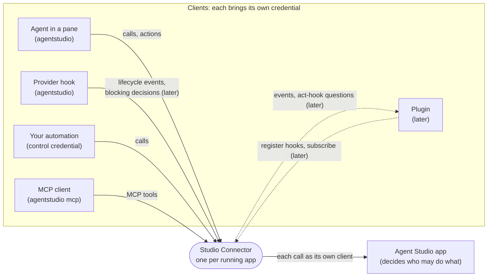
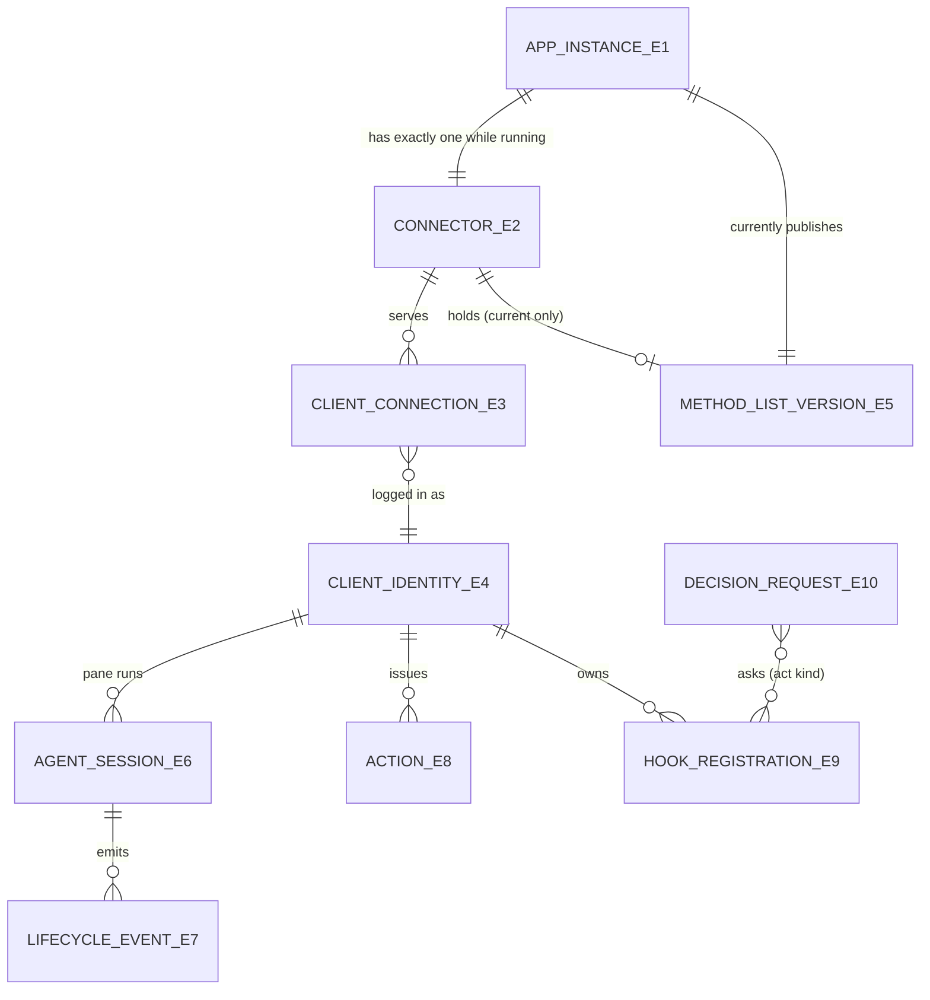
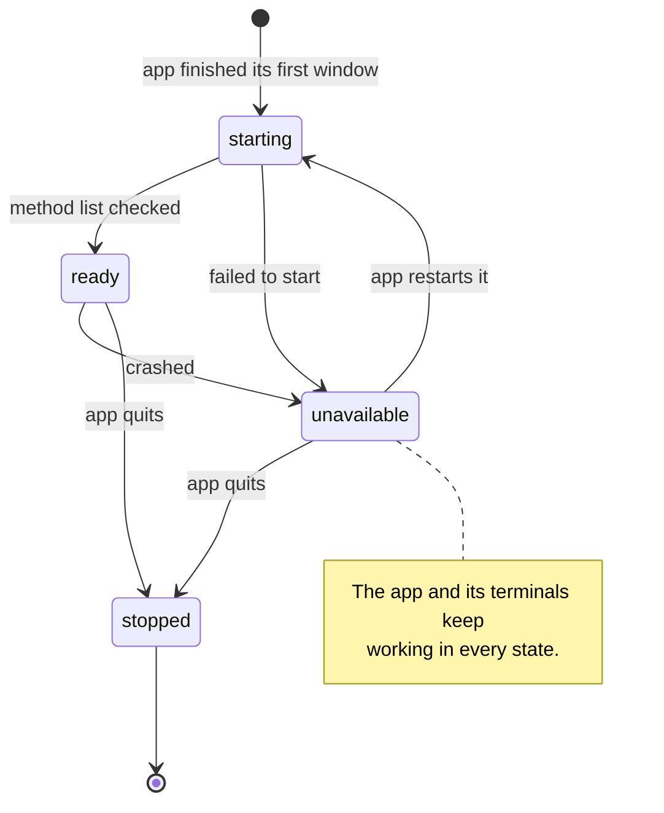
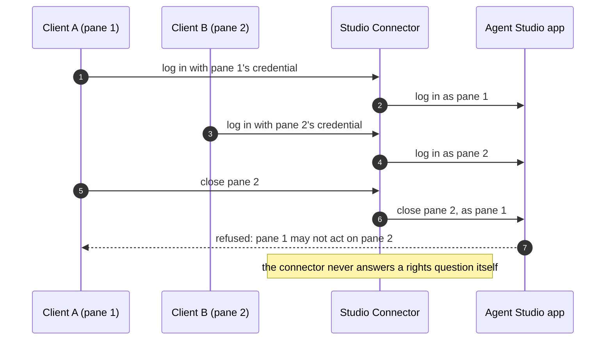
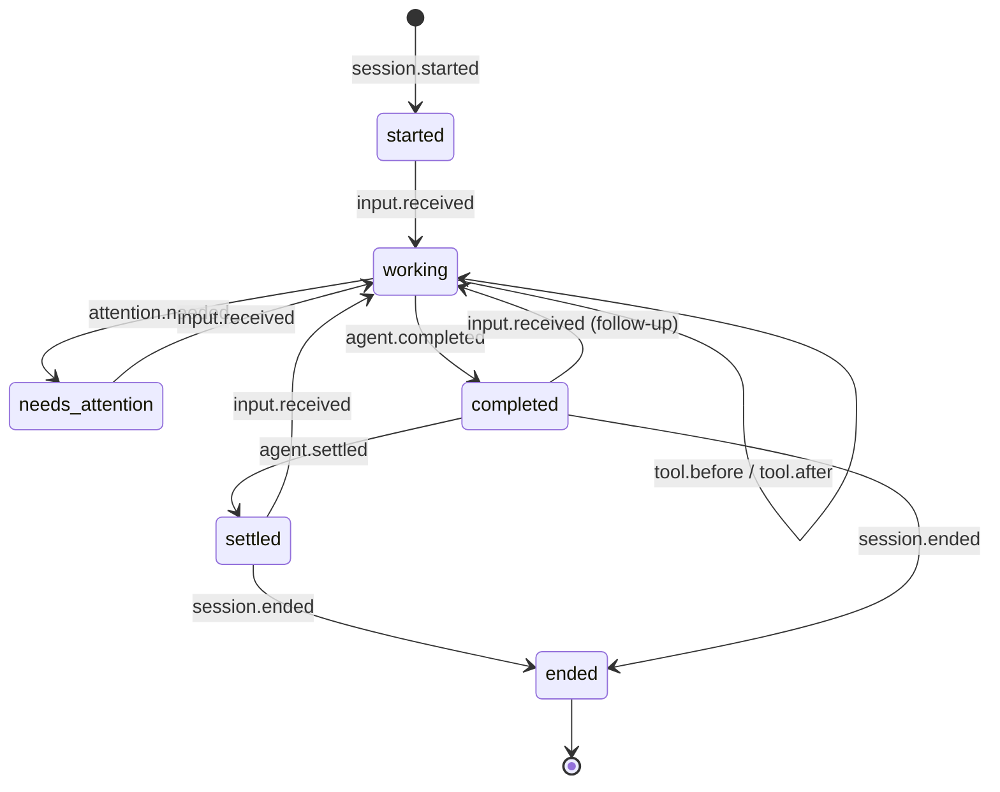
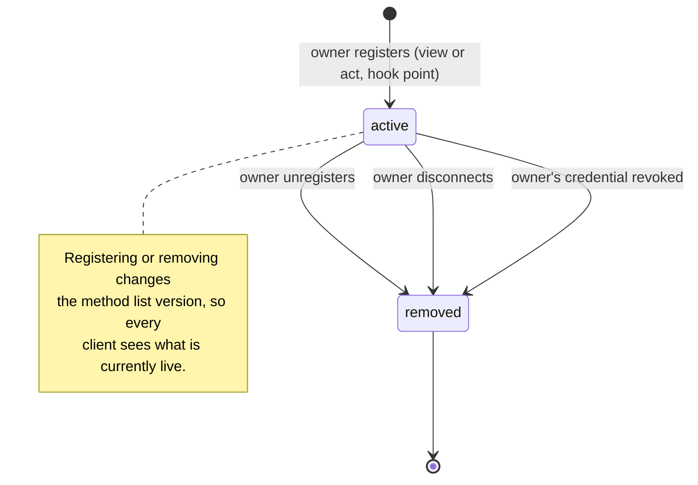

# Studio Connector: what must be true

Date: 2026-09-25. This specification turns the [Studio Connector needs](2026-09-25-requirements.md) into observable rules. It extends [Agent IPC v2](../2026-09-12-agent-ipc-v2/specification.md); every IPC v2 rule stays in force unless a rule here names a change. How the connector is built belongs to the program design, which comes next.

Round 1 builds the connector, the thin `agentstudio` client and MCP (needs 1 to 9). Lifecycle events, actions, act hooks, answer-through and live registration (needs 10 to 19) are specified here in full so round 1 cannot contradict them, but round 1 does not build or advertise them.

## The system from the outside

The connector is one sealed box per running app. Everything the rules below talk about is what clients and the app can see at its edges.



Not reachable in round 1: plugin registration, event subscription through the connector, act hooks, answer-through, network access from another machine, and a connector running without its app.

## The things these rules talk about

| Id | Thing | Two of them are the same when… | Related to | Always true | States you can observe |
| --- | --- | --- | --- | --- | --- |
| E1 | App instance | they are the same running app process. Two debug apps from different worktrees are different instances; a relaunch is a new instance. | has exactly one connector while running | never shares a connector | running, stopped |
| E2 | Connector | they serve the same app instance | serves many client connections | never outlives its app for longer than its own shutdown; never serves another app | starting, ready, unavailable, stopped |
| E3 | Client connection | they are the same accepted connection (for MCP: the same `agentstudio mcp` session) | carries exactly one client identity | its identity never changes while it is open | not logged in, logged in, closed |
| E4 | Client identity | the app derives the same identity from the credential: a specific pane's agent, the control client, or a debug client | used by one or more connections | only the app creates it; the connector never creates, widens, merges or swaps one | valid, revoked |
| E5 | Method list version | the app's full method list has the same content | published by the app; held by the connector | the connector only serves the version the app currently publishes | current, replaced |
| E6 | Agent session | the same provider session in the same pane (the provider's session id plus the pane) | belongs to one pane (E4); has many lifecycle events | events of one session arrive in the order the provider emitted them | started, working, needs attention, completed, settled, ended |
| E7 | Lifecycle event | the same provider event occurrence (provider, session, event name, occurrence id or order) | belongs to one agent session | is an observation: it reports and never asks for a reply | delivered, lost (disclosed) |
| E8 | Action | the same request id from the same client identity | issued by one client identity | changes something only within that identity's rights | accepted, rejected |
| E9 | Hook registration | the same owner, hook point and kind | owned by one client identity | lives only while its owner is connected and valid; kind is `view` or `act` | active, removed |
| E10 | Decision request | the same hook point occurrence | asked of zero or more act hooks | resolves exactly once: an answer, or the default when nobody answers in time | pending, answered, defaulted |



## Round 1: the connector, the thin client and MCP

### One connector per app, and the app never waits for it



| Rule | What must be true | Needs |
| --- | --- | --- |
| R1 | Each running app has exactly one connector. The app starts it after the app's first window is up, and it stops when the app stops. Two apps running at once, including several debug apps, have separate connectors that never see each other's clients. | 5 |
| R2 | App startup, the first window, creating a terminal and reattaching a terminal never wait for, depend on, or fail because of the connector. If the connector fails to start or dies, the app and its terminals keep working, and the connector's state shows as unavailable. | 7 |
| R3 | A client can only reach the connector of the app whose pane or credential it belongs to. | 5, 2 |

### Every call keeps its caller's identity



| Rule | What must be true | Needs |
| --- | --- | --- |
| R4 | Every client logs in with its own credential. Each call reaches the app as that client, and the app sees that client as the caller. The connector never runs a call as anyone else, never reuses a rights decision, and never answers a rights question itself. | 2 |
| R5 | Only things that carry no rights may be shared between clients: the checked method list and what is derived from it. Credentials, identities, grants and per-client results are never shared. | 1, 2 |
| R6 | When a client's credential is revoked (for example, its pane closed and the undo window passed), its next call fails with the IPC v2 reason, and the connector stops using that identity. | 2 |

### The method list is checked once per version

| Rule | What must be true | Needs |
| --- | --- | --- |
| R7 | Once the connector holds the checked method list for the app's current version, a call does not download or re-check it. | 1, 8 |
| R8 | When the app publishes a new method list version, the connector stops using the old one before it serves any call that depends on it, checks the new one, and then continues. No client sees a mix of the two. | 6 |
| R9 | Checking stays as strict as IPC v2. Unknown fields, wrong types, ambiguous choices, unknown methods and results that do not fit their schema all fail with the IPC v2 reasons and fix hints. | 8 |
| R10 | Clients can see which method list version they are talking to. | 6, 16 |
| R11 | There is one method list. The connector, the CLI and MCP add no second catalog and no hand-written mapping. | 9 |

### `agentstudio` stays the same on the outside

| Rule | What must be true | Needs |
| --- | --- | --- |
| R12 | `agentstudio` keeps every IPC v2 verb, argument, default, one-line reply, detail flag and exit code. Only its path changes: it talks to its app's connector, and has no second way to reach the app. | 3, 9 |
| R13 | When the connector is unavailable, `agentstudio` fails with its own reason, `connectorUnavailable`, which is different from "app unreachable". IPC v2 spooling stays the same: notifications still spool when the app is unreachable, and login or protocol refusals never spool. | 3, 7 |

### MCP from the same list

| Rule | What must be true | Needs |
| --- | --- | --- |
| R14 | `agentstudio mcp` is an MCP server over standard input and output. It logs in with the credential in its environment, like the CLI. Its tool list is built from the connector's current method list, and when that version changes it tells the MCP client the tool list changed. A tool call gets the same rights, result and errors as the same call through the CLI. | 4, 9 |

### Speed

| Rule | What must be true | Needs |
| --- | --- | --- |
| R15 | With a ready connector on the app's current version, a call through `agentstudio` costs the app's own work plus local message passing, with no method-list download or check. Proof compares it with the 2026-09-25 baseline: 2.7 s for the method list and 5.7 s for the command list, release build, warm app. | 1 |

### Security and privacy

| Rule | What must be true | Needs |
| --- | --- | --- |
| R16 | The connector's socket has the same owner-only permissions as the IPC v2 socket folder. Credentials never appear in logs or exported telemetry (IPC v2 R-21 and the telemetry scrub rules still apply). A connector crash leaves no credential on disk. | 2 |

## Designed now, built later: events, actions and hooks

### Lifecycle events: every harness, one vocabulary

Every provider's hooks call `agentstudio` with the pane's identity from the environment, so the connector hears every agent the same way, whether or not the harness has its own server. The connector maps each provider's event names onto one shared set and keeps the original name alongside it.



| Shared event | Meaning | Where it comes from (to be confirmed against current provider docs) |
| --- | --- | --- |
| `session.started` | A provider session began or resumed in this pane | Claude `SessionStart`, Codex `SessionStart`, Cursor `sessionStart` |
| `input.received` | The user's prompt reached the agent | Claude `UserPromptSubmit`, Codex `UserPromptSubmit`, Cursor `beforeSubmitPrompt` |
| `tool.before` | The agent is about to run a tool | Claude `PreToolUse`, Codex `PreToolUse`, Cursor `preToolUse` |
| `tool.after` | A tool finished, successfully or not | Claude `PostToolUse` / `PostToolUseFailure`, Codex `PostToolUse`, Cursor `postToolUse` |
| `attention.needed` | The agent is waiting on the person (permission, input) | Claude `Notification`, Claude and Codex `PermissionRequest` |
| `agent.completed` | The agent finished its response | Claude `Stop`, Codex `Stop`, Cursor `stop` |
| `agent.settled` | Nothing else is scheduled (no retry, compaction or queued input) | Pi `agent_settled`; for others, the same as `agent.completed` unless a later event arrives |
| `session.ended` | The provider session closed | Claude `SessionEnd`, Codex `SessionEnd`, Cursor `sessionEnd` |

| Rule | What must be true | Needs |
| --- | --- | --- |
| R17 | A provider hook reports a lifecycle event through `agentstudio` using its pane's own identity. The event carries the shared name, the provider's original name, the provider session id and its order within that session. | 17 |
| R18 | Events of one agent session reach Agent Studio and subscribers in the order the provider emitted them. A repeated report of the same occurrence counts once. | 11, 17 |
| R19 | A lifecycle event is an observation: nothing replies to it, and it never changes what the agent does. | 18 |
| R20 | A subscriber receives only events its own identity may see. A pane agent sees its own pane's events unless the app grants more. | 14 |
| R21 | Slow or absent subscribers never slow the app, the connector, or the reporting hook. When a subscriber falls behind and events are dropped for it, it is told how many it lost. It never loses them silently. | 11 |
| R22 | A provider hook's report never makes the agent wait for Agent Studio. If the connector is unavailable, the hook finishes quickly and the agent continues (IPC v2 R-22, fail open). | 7, 17 |

### Actions: asking Agent Studio to do something

`needs-you`, `done` and `message` are actions today (IPC v2). The model can call them, and so can a hook or, later, a plugin. They stay separate from lifecycle events.

| Rule | What must be true | Needs |
| --- | --- | --- |
| R23 | An action is a request by one client identity with a request id. It changes something only within that identity's rights. Retrying the same request id has no extra effect (IPC v2 R-09). | 18 |
| R24 | The same action behaves the same whether a model, a hook or a plugin sends it. | 18 |

### Act hooks: allow, deny or change before it happens

```mermaid
sequenceDiagram
    autonumber
    participant Src as What is about to happen
    participant C as Studio Connector
    participant H1 as Act hook 1 (earlier order)
    participant H2 as Act hook 2 (later order)
    Src->>C: decision request, with a deadline
    C->>H1: may this proceed? (only what its owner may see)
    H1-->>C: change it (within its owner's rights)
    C->>H2: may the changed version proceed?
    Note over H2: no answer before the deadline
    C-->>Src: result: hook 1's change; hook 2 counted as "no opinion"
    Note over Src,H2: if nobody answers, the default applies and nothing blocks the person
```

| Hook point | What an act hook can do | Default when nobody answers | Who may register |
| --- | --- | --- | --- |
| `notification.deliver` | Deliver, suppress, add context, or also route elsewhere, before a needs-you or message is shown | Deliver as normal | Any identity, for notifications it may see |
| `command.execute` | Allow, deny, or change the arguments of an app command a client runs through IPC | Allow as requested (the app's own rights check still applies) | Only identities with rights over the command's target |
| `permission.request` (answer-through) | Allow or deny what a provider's own permission or pre-tool hook is asking | The provider's own default (usually: ask the person) | The pane's own identity, or an identity the app grants |

| Rule | What must be true | Needs |
| --- | --- | --- |
| R25 | A decision request resolves exactly once, before its deadline: with the combined answers, or with the hook point's default when nobody answers in time, a hook errors, or the connector is unavailable. The person is never blocked waiting on a hook. | 12, 19 |
| R26 | Act hooks at one point run in a fixed, visible order. Each sees the request as changed by the ones before it. A deny stops the chain. | 14 |
| R27 | An act hook sees only what its owner may see and changes only what its owner may change. After every change, the app still checks the final request against the original caller's rights. | 14 |
| R28 | Answer-through is the only way a decision flows back to an agent. A blocking provider hook waits at most its own time limit. Silence means the provider's default applies. Agent Studio never types into an agent. | 19 |

### One way to register, live



| Rule | What must be true | Needs |
| --- | --- | --- |
| R29 | Provider hooks and plugins register view hooks (subscriptions) and act hooks the same way, over the connector, at runtime. | 13 |
| R30 | A registration is removed when its owner unregisters, disconnects, or loses its credential. No registration outlives its owner. | 13 |
| R31 | Adding or removing a registration that other clients can discover produces a new method list version (R8, R10). | 15 |

### Room for other machines later

| Rule | What must be true | Needs |
| --- | --- | --- |
| R32 | The client-facing protocol does not depend on the client sharing a filesystem with the connector, or on a same-user check beyond round 1's local transport. A later authenticated network transport can carry the same protocol unchanged. | 16 |

## What round 1 must not do

| Rule | What must be true | Needs |
| --- | --- | --- |
| R33 | Round 1 exposes none of the following: lifecycle event reporting or subscription through the connector, act hooks, answer-through, registration, network access, a shared connector, or a connector that serves while its app is closed. None of them is advertised or reachable. Their names and shapes above are reserved and must not be used for anything else. | 10, O-3 |

## When things go wrong

| Situation | What clients and the app see | Rules |
| --- | --- | --- |
| Connector not started yet, or crashed | `agentstudio` returns `connectorUnavailable`; the app and terminals keep working; spooling unchanged | R2, R13 |
| App quits | The connector stops; clients get `connectorUnavailable` or "app unreachable"; nothing is served stale | R1, R33 |
| A client's credential is revoked | Its next call fails with the IPC v2 reason | R6 |
| The method list changes during use | Calls in flight finish or fail with a version-skew reason; later calls use the new list; never a mix | R8 |
| Two debug apps running | Each client reaches only its own app's connector | R1, R3 |
| (later) A subscriber falls behind | It receives a "lost N events" notice, and the app is unaffected | R21 |
| (later) An act hook is slow or broken | The decision resolves with the default at the deadline | R25 |
| (later) A hook's owner disconnects | Its registrations disappear | R30 |

## How each rule will be proven

| Rules | Evidence |
| --- | --- |
| R1, R2, R3 | Launch the real app: the connector starts after the first window; killing the connector leaves the app and terminals usable; two debug apps get two connectors that cannot see each other |
| R4, R5, R6 | Through the real socket: each client's call reaches the app as that client; a cross-pane attempt is refused; a revoked credential fails |
| R7, R15 | Release-build timings against the 2026-09-25 baseline, with the method list checked once per version |
| R8, R10 | An integration test that changes the method list version mid-session; no call sees a mix |
| R9 | The IPC v2 negative cases, re-run through `agentstudio` and MCP |
| R12, R13 | CLI transcripts match IPC v2 fixtures; `connectorUnavailable` differs from "app unreachable"; spooling cases unchanged |
| R14 | MCP `tools/list` equals the method list projection; a tool call has the same rights and result as the CLI |
| R16 | Permission inspection plus a log and telemetry scrub check |
| R17 to R32 | Specified now, proven when built: each rule gets a scenario test at build time; round 1 proves only R33 |
| R33 | Capability inspection: nothing reserved is reachable or advertised |

## Which need each rule serves

| Need | Rules |
| --- | --- |
| 1 Calls pay only for the app's work | R5, R7, R15 |
| 2 Each client keeps its own identity | R3, R4, R5, R6, R16 |
| 3 `agentstudio` unchanged outside | R12, R13 |
| 4 MCP from the same list | R14 |
| 5 One connector per app | R1, R3 |
| 6 Never a stale list | R8, R10 |
| 7 The app never waits | R2, R13, R22 |
| 8 Checking stays strict | R7, R9 |
| 9 One method list | R11, R12, R14 |
| 10 Hooks and events designed now | R17 to R33 |
| 11 Events | R18, R21 |
| 12 Act hooks | R25 |
| 13 One way to register | R29, R30 |
| 14 Hooks within their owner's rights | R20, R26, R27 |
| 15 Registrations change the version | R31 |
| 16 Other machines later | R10, R32 |
| 17 Provider lifecycle through hooks | R17, R18, R22 |
| 18 Observations and actions separate | R19, R23, R24 |
| 19 Answer-through only | R25, R28 |
