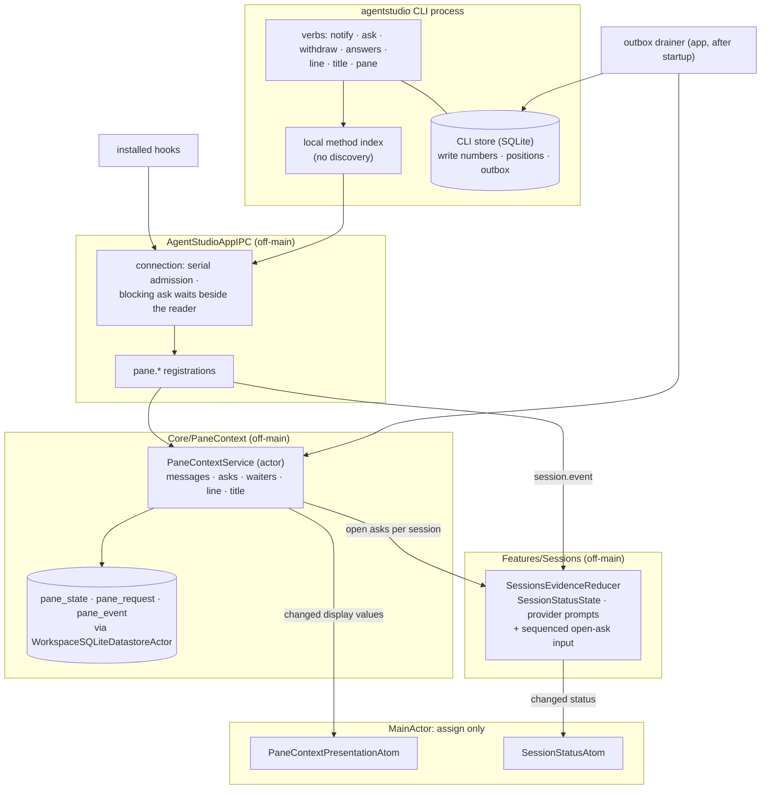
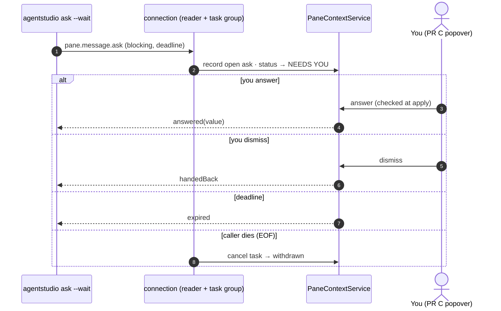

# Enable pane agents: how it is built

Date: 2026-10-07. **Revision 37, follow-up to PR B** (owner, 2026-10-06): (#5, F1) a main restored from before the app started counts as live only after its first hook in this app run, so a new agent in that pane binds; (#4) a SessionStart that names a turn closes that turn as done, which ends a compaction. Both are rows in step 3 and step 5; no new mechanism. Date of rev 36: 2026-10-05. **Revision 36, owner identity rules** (owner, 2026-10-05 evening, relayed by the Panes Lead): step 3 is the pane's main-session table, with no cross-pane effects; the agent's `commandFinished` ends the live main session. **Revision 36, review round 2 corrections** (Lead): binding table rows by precedence, with `SessionStart` the only revive/move authority; launch ends no binding (R1's `.cold` restore outcome is the later signal) plus a one-time upgrade repair; a closed turn guard replaces source-time order; CLI refusals use their own `session.refusal` method; stale permission-wait, spool, late-adapter and launch-preparation clauses removed. Date: 2026-10-05. **Revision 36** (owner-approved inventory, 2026-10-05): hook admission is cut down to the owner's requirement: pane credential plus session id, recorded for that pane. Version and capability qualification, hook replay, source generations, freshness, launch-time binding ends and rev 34's implied binds are removed. See "Hook admission, simplified (rev 36)". It supersedes rev 34 and the hook parts of revs 23 and 32. **Revision 35** (Lead, 2026-10-05; owner: IPC exists so the Panes agent can do its job): a pane's activity time and its source can be read over IPC, and the Claude and Cursor installers quote the hook script path. See "Reading pane activity over IPC (rev 35)". **Revision 34** (Lead, 2026-10-04, from the PR B final review, finding 1): with async lifecycle hooks, a session's first hooks can arrive in any order. The first qualified hook naming a conversation this pane has never bound now binds it; a late SessionStart is absorbed or historical. See "Hooks that arrive before their start (rev 34)". **Revision 33** (Lead, 2026-10-04, from PR C review finding 1): when PR C turns a permission request into a blocking ask, the hook still reports it, flagged `permissionHandling: blockingAsk`. So the permission keeps counting as activity, and opens no duplicate provider prompt. See "A permission answered by an ask (rev 33)". **Revision 32** (owner rule, 2026-10-02, restated 2026-10-04): hooks never make an agent wait. Every lifecycle and activity hook is registered async. The only waits left are the ones the agent asks for itself: a waiting ask, and the permission ask from PR C. Sessions orders hook facts by the time the hook fired, not by arrival. See "Hooks never make the agent wait (rev 32)". **Revision 31** (owner, 2026-10-04: F2 = A, co-designed with the Panes Lead): `session.query` reads the one status engine. It returns the pane's S2 session summary, in the same wire shape as `pane.context.get`'s `session`, plus `sourceHealth`. Both come from one read of the Sessions status runtime, so they can't disagree. Deleted: the old four-state projection, the reply fields `state`, `origin`, `needsYou` and `messages`, and the five producer-less mutation cases (`message`, `deliberateNeedsYou`, `clearDeliberateNeedsYou`, `deliberateDone`, and `acknowledgeMessage`, which acknowledged the retired messages). Kept: the mutation → evidence/binding reduction, and provider prompts (S13) with the attention rows they use. Rows the retired kinds stored stay inert, with no migration. See "Reading status over IPC (rev 31)". **Revision 30** (Lead, 2026-10-04; PR B S6 review round 1): this revision restates rules the code drifted from; it adds no new mechanism. First, session end touches only Agent Lines and unconfirmed receipts: an ended or replaced session's open asks stay open and answerable. Second, permanent retirement is durable: it is processed off-main even before the service's first use, shutdown commits pending retirements, and each commit arms the purge deadline. Third, the render (item 4 of "What PR B adds") ships in PR C, which reads `value(for:)` and `PaneDisplayTitleDerived`, as agreed with Panes. PR B proves line, title, notices and asks through the app's own reads. **Revision 29** (Lead, 2026-10-03; PR B S5): `notify` reserves `CLIPolicy.noticeQueueReserve` (250 ms) of its 5 s total for the outbox write, so a `notSent` notice always reaches the outbox when the app accepts but never reads. **Revision 28** (Lead, 2026-10-03): three delivery decisions from the fast CLI round-1 review, anchored on `fast-cli-store` at 5a921b816. First, `--reload-catalog` is removed, because the catalog is fixed per runtime and the CLI is the same build. Second, a brand-new CLI store is created atomically under a private name and published with an exclusive rename. Third, opening and migrating the store gets a first-open busy budget of at most 1 s within the call total; notice writes and purges keep 50 ms. Storage contents, ownership and the single-writer rule are unchanged. **Revision 27** (owner, 2026-10-02): choice 4 now leads with agents finding their way through `help` and `--help` (Spec R33). Discovery drops rev 26's catalog digest, because the CLI ships in the app bundle and is always the same build. There's no client re-check and discovery gets 500 ms. The digest, cache and filter wait for the Studio service design. **Revision 26** (owner, 2026-10-02): two changes to choice 4. Discovery is identified by a catalog digest, with a name filter, a one-row CLI-store cache and no client re-validation, and it comes within the 250 ms budget. Every hook verb is silent: no stdout, no stderr in normal operation, exit 0.

**Revision 25** (owner, 2026-10-02): link removal ships without agent notification for now (Spec R19 deferred). Gaps item 4 is rewritten: no removal facts are consumed, and the replay request to Bridge is withdrawn.

**Revision 24** records two decisions from 2026-10-02:
- the fast CLI's light index is realized as one typed-entry inventory, shared by the app's full catalog and the CLI's on-demand resolver (choice 4; built on `fast-cli-store`);
- the pull-request chip registers no Forge demand until B2 links exist (agreed with Panes).

**Revision 23** folds in the decisions settled during delivery, 2026-10-01/02. Each was recorded first on board threads 01a0cdcb (IPC) and 01a0cdc9 (coordination), and each is anchored in code on `pane-context-ipc` or `fast-cli-store`:
- the display contract change Panes asked for (`own` / `includingDrawers` `PaneMessageCounts` and the `AgentMessageAttentionType` classifier; board 01a0f7b4);
- the newest-blocking-ask tie-break;
- the bounded `pane.context.get` reply (exact envelope overhead, a binary search on the detail budget) and source-list continuation;
- `omittedPromptCount`;
- the wire rules for `pane.*` (safe-integer numbers, single-case enums, the uniform form bound, id-less requests);
- `sessionEnded(bindingGenerationId:)`;
- the Elicitation field cut;
- `pendingAffectedOwners` collapsing to `.all`;
- auth reading the membership directory synchronously;
- the publication lane fencing by current membership;
- the one App-only `SessionsPaneContextComposition`;
- for the fast CLI PR: the raw `command.execute` request and its error data, `terminal.wait` clamping and reporting (this replaces the short-lived `IPCTerminalWaitUpperBound` idea), the store-identified `cliStoreReadThrough`, and the `SessionsCommitParticipant` drain seam.

**Revision 22**: the status value type is renamed `AgentSessionStatus`, because main already has `Core/Models/SessionStatus.swift` (the zmx backend session lifecycle state machine) and CI's compile caught the redeclaration. The atom keeps its owner-approved name, `SessionStatusAtom`, and its state stays `SessionStatusState`. **Revision 21**: the owner allowed the directory's thin publish at the graph commit. The rule, clarified: main-actor touches to main-owned state are fine; derivation and work stay off-main. **Revision 20** (advisor membership-directory review, M1–M3 accepted): mirror the existing structural placement with no tab id; one publisher at `commitPaneStates`; an atomic boot install; a stated linearization; auth parity; a bounded affected-owner invalidation with a lazy-start handshake. The main-actor allowance for the publication is pending the owner. **Revision 19** (owner decisions): the R3a exception is accepted. Membership source B, a directory, with its draft written into Gaps item 6 for review by the Sol xhigh advisor. Owner rule: nothing on the main actor. **Revision 18**: A1's remaining double-loss, identical-content case is named. The content fold is an exception to Spec R3a, so it needs the owner's acceptance (Gaps item 7). Until then, R3a's strict rule governs. **Revision 17** (advisor rev-16 verification):
- F1: the last zero-main-actor claims are corrected (the person-action row and the proof boundary).
- F4: the old producer paragraph is replaced.
- A1: a fold needs exactly one open prompt with identical `questions`.
- A2: a no-id elicitation result never resolves; prompts wait for the turn boundary.

**Revision 16** (advisor's rev-14 check, five findings plus A1/A2, all accepted after the Lead verified the anchors):
- F1: the main-actor list now names the inherited authentication hop and the native person-action effects.
- F2: the equality baseline is the last *desired* value, and removal joins the lane.
- F3: the pane-keyed status keeps an ended binding's value.
- F4: pane viewed comes from person-initiated, successful focus, ordered by a monotonic instant against done.
- F5: the claim of an existing topology feed is withdrawn; it's now an owner decision (Gaps item 6).
- A1: an AskUserQuestion permission folds into the question, or opens a conservative question prompt.
- A2: no elicitation FIFO; an ambiguous result resolves nothing.

**Revision 15** (provider traces, gap 1 closed): the provider table is re-based on Claude Code 2.1.286 and Codex 0.159.2. A PermissionRequest for AskUserQuestion opens no approval prompt. Elicitation has no `elicitation_id`, so correlation by server and order is the normal path. The StopFailure summary is its `error`. **Revision 14** (owner: "as little work on the main actor as possible"): "MainActor and atom boundaries" is redesigned from the repo's owning docs:
- a complete list of main-actor work;
- a what-runs-where table;
- one publication lane (off-main equal-check, a latest-value mailbox, one awaited sink call per batch, following `PaneActivityClock`);
- Update Rule rows for both atoms;
- `SessionStatusAtom` keyed by pane (no join on the main actor);
- pane viewed as one non-awaiting mailbox submit where focus lands (the `.activePaneChanged` case exists but nothing posts it);
- `pane.*` targets resolved off-main;
- the `often` lane proof.

**Revision 13** (owner, 2026-09-30): the R32 counting rule is confirmed; `PaneContextPresentationAtom` is approved as a runtime cache, with its field renamed `gitSummary` → `pullRequests`; the main-actor rule is stated (drop unchanged values off-main, one batched assign-only apply). **Revision 12** (plan re-anchor): the S12 binding row names GRDB and says which PR lands which CLI-store table (the fast CLI + store PR, R3, then this PR). **Revision 11** (advisor A6 check): unknown checks no longer hide a changes-requested review; the revision rule is stated as "summary or member row changed", matching Spec R32 rev 9. **Revision 10** (closeout A6): the pull-request summary moves here from Bridge (navigation R19). `PaneContextDetail.pullRequests`, a pure off-main fold over the pane's linked worktrees and Forge's cached facts; the counting rule awaits owner confirmation. **Revision 9** (owner, 2026-09-30): the CLI store has one writer, the CLI. The app reads it read-only; outbox rows carry no delivery state; the app's progress lives in `local.sqlite`, and the CLI purges only rows at or below the mark the app returns at login. Unread rows are never deleted. Date: 2026-09-27. **Revision 8** (round 6: a stale refusal is final for its payload). **Revision 7**, answering round 5 (R5-F1 permission
prompts resolve only at turn boundaries; R5-F2 epoch claims are a separate
idempotent step). Revision 6 answered round 4 (R4-F1 to R4-F6). Revision 5 answered round 3 and the owner's simplified show;
revision 4 answered round 2. This is the Program Design for PR B. It builds the
[Specification revision 6](2026-09-26-pane-context-ipc.md) (rules R1–R31,
with R3a, R7a and R11a), which serves [Requirements revision 3](2026-09-26-requirements.md)
(N1–N15). Scope is the owner's option B: PR B merges before Bridge's #367, and
`show` and `link` land in the follow-up **B2**. The revision-2 design is
superseded. Its storage categories, the title layer, the MainActor lanes and
the dead-hook fix carry over; everything built for cut needs is gone.

## In one paragraph

PR B has five parts:

- **Hooks become session status.** The existing Sessions reducer learns
  failed, interrupted and ended, provider prompts (report-only permission,
  AskUserQuestion, elicitation), and "an open ask means NEEDS YOU". It keeps
  running off the main thread, and replay is decided by the occurrence.
- **One AgentMessage store.** Notices and asks live in a new pane-context
  service with one settle point per ask. A blocking ask waits beside its
  connection's reader, so a closed connection withdraws it.
- **Agent Line and title.** They're current values with write numbers from the
  CLI.
- **The `agentstudio` CLI gets fast and stateful.** Every compiled method goes
  straight to the app, with no catalog discovery and one auth. A small SQLite
  store holds write numbers, answer positions and the notice outbox that
  replaces the NDJSON spool.
- **A runtime-only presentation atom and a keyed session-status atom** carry
  computed values to the UI through one thin apply each.

Nothing computes on the main thread.

## What exists today (checked in code)

| Area | What is true | Anchor |
| --- | --- | --- |
| CLI call path | Only system, auth and session methods resolve locally. Every other call first runs a discovery round trip: fetch `system.capabilities`, decode and validate the whole catalog, then rebuild and compare every compiled descriptor. Then a second connection makes the call. Each connection sends `auth.login`, so there are two per call. Socket reads block. | `AgentStudioIPCClientCommandLineRunner.swift:74-90`; `IPCBuiltInMethodCatalog+Discovery.swift:42-118`; `AgentStudioIPCClientCore.swift:31-42,145-153,204-209` |
| Hook events | Claude Code: sessionStart, userPromptSubmit, preToolUse, permissionRequest, subagentStart/Stop, stop, sessionEnd. Codex adds `interrupt` (→ turnAbort). Nothing maps to `question`, `elicitation` or a failure. | `ClaudeCodeHookProjection.swift:8-16`; `CodexHookProjection.swift:8-29,169,173`; `IPCSessionContracts.swift:38-49` |
| Sessions state | `unknown \| running \| needsYou \| done`. The `.aborted` evidence exists but only suppresses done/running. | `SessionsDomainModels.swift:3-8,59-75`; `SessionsEvidenceReducer.swift:29-90` |
| Session binding | A sessionStart event already opens a binding generation per pane. | `WorkspaceLocalMigrations+Sessions.swift:78-81`; `AgentStudioIPCSessionsAdapter.swift:340-364` |
| Spool | CLI: `<paneId>.notifications.ndjson` under `flock`. App: `PaneReportSpool` drains with truncate or rename. Only `session.report`/`session.message` are eligible. | `PaneNotificationSpoolWriter.swift:12-127`; `PaneReportSpool.swift:68-356` |
| CLI dependencies | `AgentStudioIPCClientCore` and the CLI executable don't link GRDB. | `Package.swift:287-319` |
| IPC server loop | It processes one request at a time and awaits the handler before reading again, so a waiting handler never sees EOF. Auth state is per connection; pre-auth methods are an allowlist. | `AgentStudioAppIPCServer.swift:225-285,315-322,556-591` |
| Socket writes | One writer actor per connection; the transport loops over partial writes, but the blocking `write` runs on a cooperative thread and never reports backpressure. | `AgentStudioAppIPCServer.swift:593-629`; `UnixSocketTransport.swift:86-116` |
| Replay | The Sessions fingerprint hashes the whole mutation, including admission time and freshness; Claude events without a `tool_use_id` get a fresh occurrence id; correlation ids are fresh per CLI process. | `SessionsIngestion.swift:335-375`; `ClaudeCodeHookProjection.swift:144-160`; `SessionsRepository+OperationReplay.swift:9-66` |
| CLI deadlines | None: connect, auth, send and receive all block without a limit. | `AgentStudioIPCClientCore.swift:169-218` |
| SQL home | `local.sqlite` through `WorkspaceSQLiteDatastoreActor` (off-main). Sessions uses the same path. | `WorkspaceSessionsSQLiteAccess.swift` |
| Title | Ghostty's OSC title overwrites `PaneMetadata.title`. | `WorkspaceSurfaceCoordinator.swift:725-728` |

## The choices, in plain words

1. **Status stays in Sessions.** It's the owner of hook evidence and already
   reduces it off-main. PR B extends that reducer and adds one input: the
   session's open asks from the message store. There's no second status engine:
   `session.query` reads the same value (rev 31).
   *What would reopen it:* a status that needs facts Sessions can't see.
2. **Messages get their own store, not Sessions'.** Sessions records what the
   agent's lifecycle did; messages are conversations with you and have their
   own lifecycle. One `PaneContextService` actor owns messages, asks, the
   Agent Line, the title and write numbers, stored in category tables in
   `local.sqlite`.
3. **A blocking ask is the only request that runs beside its connection's
   reader.** Everything else keeps today's one-at-a-time order. The reader
   keeps reading while the ask waits, so it sees EOF and the service settles
   the ask `withdrawn`, unless something settled it first. Writes leave the
   cooperative pool, and a peer that stops reading is detached. This is a
   shared IPC-server change; the rules are in "Connections".
4. **A fast CLI by doing less (Spec R31).** Every method compiled into the
   CLI resolves locally from a light name → method index built on demand.
   There's no catalog discovery, no descriptor rebuild or compare, and one
   connection with one `auth.login` per call. The app already validates
   parameters, resolves the target and authorizes before any handler runs
   (`AppIPCTypedMethodRegistration.swift:148-205`), so skipping the client
   check removes nothing the app relies on.
   - **One method inventory feeds both sides.** Each built-in method is one
     typed entry (`IPCBuiltInMethodEntry`, in ProgrammaticControl). An entry
     holds the method's name, summary, model-call metadata, a deferred
     parameter-schema factory and a factory for its one descriptor. Making
     an entry builds nothing. `IPCBuiltInMethodIndex` lists the entries once.
     - **The app** builds its full catalog by walking that same list, so its
       catalog content and its typed group accessors are unchanged.
     - **The CLI** resolves through `IPCCompiledInvocationResolver`
       (ClientCore). It looks up the exact method name, or the longest
       model-call prefix, and builds only that method plus `auth.login`. An
       unknown name is refused before anything is built. A hook builds
       `auth.login` and `session.event` and nothing else.
     - **A hook is silent (rev 26; owner, 2026-10-02; Spec R6).** Every hook
       verb writes nothing to stdout, because Claude Code feeds a SessionStart
       hook's stdout to the model. It writes nothing to stderr in normal
       operation and always exits 0. That holds whether the app is up, down,
       slow or refusing, and outside a pane, where it returns at once without a
       pane token. Diagnostics go to the CLI's own log or record, never to the
       provider. Proof is a process-level test over every hook verb.
     - **Help:** the overview reads names and summaries straight from the
       entries. `METHOD --help` builds only that method's parameter schema.
     - **Hard cutover:** the old eager CLI admission path
       (`locallyResolvableDescriptors`) is gone, with no fallback to it.
     - **At PR B's merge,** its eight `pane.*` recipes become entries, and the
       inventory's exact-name check grows from 47 to 55.
   - **`command.execute` goes straight to the app too.** Today it costs three
     round trips (`system.capabilities`, `command.list`, then the call;
     `AgentStudioIPCClientCommandLineRunner.swift:84-118,194-227`). Now the CLI
     sends the raw strings the person or agent typed (`--arg key=value`):
     - **The wire is a hard cutover** to `IPCRawCommandExecutionRequest
       { commandId, correlationId, arguments: [String: String] }`.
     - **The app parses.** It parses the arguments against the command's own
       `AppCommand.ipcSpec`, infers the one variant they fit, and honours an
       explicit `kind`.
     - **One generic stage is added.** `AppIPCTypedMethodRegistration` gains
       a prepare stage (decode → prepare → validate → authorize → execute).
       Every other registration uses an identity prepare, so its behaviour is
       unchanged.
     - **Errors reuse the existing vocabulary.** A bad argument is
       `invalidArguments { reason, fieldPath: "$.arguments.<name>", expected }`
       (-32602). An unknown command is
       `unknownCommand { reason, commandId, closestMatches }`, with at most
       5 matches.
   - **Server-owned limits stay on the server.** `terminal.wait` sends the
     requested wait, and the CLI never reads or copies the maximum.
     - The intake admits any finite, non-negative timeout.
     - The app clamps it to `AppPolicies.IPC.maximumTerminalWaitSeconds`.
     - `IPCTerminalWaitResponse` gains the required fields `timeoutSeconds`
       (the effective wait) and `wasClamped`.
     - The advertised schema has no maximum.
   - **Discovery is explicit only:** `system.capabilities`, `command.list`
     and `agentstudio help --live`. There's no `--reload-catalog` flag (rev 28).
     The app's catalog is fixed for the life of its runtime, and the CLI is the
     same build, so a reload could only re-fetch the same bytes. Rebuilding the
     catalog on demand waits for the Studio service design.
   - **Discovery (rev 27; owner, 2026-10-02; Spec R31).** The CLI ships
     inside the app bundle (`Contents/Helpers/agentstudio`), and an agent calls
     its own app's copy through `AGENTSTUDIO_CLI`, so the CLI and the app are
     always the same build. The CLI therefore doesn't re-validate the catalog
     the app sends (client `IPCValidatedJSONSchema.normalize` was about 77% of
     the 1.45 s p95); the app validated it when composing it. This is a hard
     cutover. Explicit discovery is held to 500 ms.
     - **Deferred to the Studio service design:** rev 26's catalog digest,
       its cache and `--filter`. That design covers one tier-2 process that
       the app starts and that stops with the app, serving the CLI, MCP (a
       local network server) and plugins. Auth doesn't change: callers' own
       pane tokens, and the app authorizes. The service restarts on a version
       change. The Swift CLI is an intermediate step.
   - **Agents find their way through `help` (rev 27; owner, 2026-10-02:
     "more important than capabilities"; Spec R33).**
     - **What an agent may do moves onto the entry.** Each
       `IPCBuiltInMethodEntry` carries its `agentEligibility` (own pane,
       any target / read-only, or not yet allowed). The descriptor factory
       reads it from the entry, so there's one source and the overview
       builds nothing.
     - **`agentstudio help`** lists, from the entries alone and with no app
       connection, every method with its summary and what an agent in a pane
       may do with it.
     - **`agentstudio <method> --help`** prints that method's arguments and
       one example call, built only for that method.
     - **An unknown method** is refused locally. The refusal names
       `agentstudio help` and up to 3 closest method names (by edit distance
       over the entry names), and never `system.capabilities`.
     - **The shipped skill** (`AgentPackage/skills/agentstudio/SKILL.md`)
       gains a short "Everything else" section: `"$AGENTSTUDIO_CLI" help`
       lists what you can call, and `"$AGENTSTUDIO_CLI" <method> --help`
       shows how. An agent acts on its own pane only.
   - **Budget:** p95 of `cli.call_total_ms` (process start to exit) on a warm
     debug app, measured over 50 calls: ≤ 150 ms for hook verbs and
     `line`/`title`/`notify`, ≤ 250 ms for other verbs.
5. **The CLI gets its own small SQLite store,** agreed with Panes and
   endorsed by the owner ("safety, type safety, discriminated unions, good
   types"). The owner's direction is a per-machine host daemon ("agentd") with
   the app, the CLI and a phone as its clients, and possibly a Rust CLI later.
   The store is **agentd-in-waiting**: its ordering and outbox ownership move to
   that daemon later, and it holds no truth itself.

   **Engine and file:**
   - **GRDB, the repo's standard** (owner, 2026-09-30; this replaces the
     earlier system-`SQLite3` choice). The store has one way to do SQLite, the
     same as the app's `local.sqlite`: GRDB's `DatabaseMigrator`, typed records
     and transactions. The only reason for avoiding GRDB was a hypothetical
     future Rust process opening the same file, and that's speculative; such a
     daemon would take over migrations when it exists. The CLI doesn't link
     GRDB today, so the PR measures CLI start-up against the ≤ 150 ms budget.
   - WAL mode, a short busy timeout, and **fail open**: if the store is locked,
     corrupt or unwritable, the hook still returns at once, tries a direct send,
     and logs.
   - It lives in the channel's stable per-user data root (for example
     `~/.agentstudio/ipc/`, and the beta/debug roots separately), never a path
     derived from the app bundle.

   **Schema and migrations (owner, 2026-09-27):**
   - Ordinary migrations are fine. What's avoided is anything that forces a
     table rebuild: dropping or reshaping columns, or copying data into a new
     table.
   - So: plain TEXT/INTEGER columns; enums are TEXT parsed in Swift; a `CHECK`
     only for booleans; no triggers. A new enum case is then a code change,
     never a rebuild.
   - Migrations are additive (new tables, or `ALTER TABLE … ADD COLUMN` with a
     safe default), registered with GRDB's `DatabaseMigrator`, and applied on
     open. The already-applied check is one read of GRDB's migration table, and
     migrations run only when the file is behind.
   - A CLI that finds migrations newer than it knows doesn't write
     (`DatabaseMigrator.hasBeenSuperseded`); it sends directly or fails open.

   **Typed at the read boundary:**
   - Every row parses into a union. `CLIStateEntry` is
     `titleWriteNumber | lineWriteNumber | answerPosition`, each with pane,
     session and an integer. `CLIOutboxEntry` is one recorded notice. It's
     immutable once written and carries no delivery state, because the app
     never writes this store (below).
   - An unknown kind or state is a field-tagged decode error: the row is
     skipped and logged, never defaulted.
   - `payload_json` is a **recorded exception** to the no-JSON rule. It's the
     exact versioned wire envelope, opaque to SQL and never queried, and on
     drain it goes through the same decoder and validator as a live request.

   **Delivery:**
   - **One writer: the CLI** (owner, 2026-09-30: "should be single writer …
     app should only read").
     - Only `agentstudio` processes write, migrate and purge this file. Many
       short-lived CLI processes share SQLite's write lock (WAL, the 50 ms busy
       timeout, fail open).
     - **A brand-new store is created atomically (rev 28).**
       - Why: two CLI processes could both find the file missing. Switching a
         shared fresh file to WAL can then return `SQLITE_BUSY` at once,
         without calling the busy handler (SQLite does this to avoid
         deadlock), and one of them would lose its notice.
       - How: each creator builds a complete store under a private name: WAL,
         `synchronous=FULL`, migrations and identity, then a TRUNCATE
         checkpoint and close. It then publishes with an exclusive rename. The
         loser opens the winner's store. A published store is already in WAL,
         so its writers skip the switch. Only an older store that isn't in WAL
         yet still switches once on upgrade, which keeps the existing upgrade
         path.
       - The creator turns off persistent WAL on its private connection only,
         so nothing private is left behind. The published store keeps Apple
         SQLite's default of persistent `-wal`/`-shm`, which the app's
         read-only opener needs.
       - Between the rename and the first writer access, a read-only open may
         be refused. It can never see a partial store, and no notice can exist
         yet in that window.
     - The app opens the file **read-only** (GRDB `readonly`). In WAL mode it
       still takes shared read locks, but never the write lock, so a hook never
       waits on the app.
     - This is the repo's rule of one writable owner per database
       (`workspace_data_architecture.md`). agentd later takes over the same
       writer role.
   - The store is a transactional outbox. The app (later agentd) is the only
     authority on what a notice means.
     - The app keeps its own progress in `local.sqlite`
       (`pane_context_cli_outbox_cursor`, below). A notice it refuses only
       advances that cursor and emits telemetry with the reason class.
     - It never marks rows in the CLI store.
     - The drain is idempotent by `message_id`.
     - **The cursor joins the effect's commit (rev 23).** Sessions exposes
       one general seam, `SessionsCommitParticipant { commit(in: Database) }`,
       for "a write that joins the Sessions commit".
       - `SessionsRepository.apply` runs it inside its single write closure on
         all three return paths: operation replay, occurrence replay and insert.
         A throw rolls back the whole write, effect included. A duplicate still
         advances the cursor.
       - Live callers pass no participant and are unchanged.
       - The App's drain implements it as the cursor upsert. The App owns the
         table and its migration.
       - A refusal never reaches Sessions. It advances the cursor in its own
         transaction, through the same `local.sqlite` writer that
         `WorkspaceSessionsSQLiteAccess` wraps. There's no second writer.
       - Session-restore R3's planned hook lifecycle intake is not built: hooks store nothing in the CLI store (rev 36), so `lifecycleReport` is never set. Removing that field is checked in the rip-out plan.
   - **Cleanup stays with the writer.**
     - The app's `auth.login` result carries the required field
       `cliStoreReadThrough`. It's either `null` or the closed object
       `{ storeId, outbox, lifecycleReport? }`: the store it describes and the
       highest row each of the app's cursors has handled for that store.
     - The CLI purges only when `storeId` equals its own store's identity
       (`cli_store_identity.store_id`). A `null`, unknown or mismatched
       `storeId` purges nothing (rev 23). Why: a replaced or foreign file on
       the same channel can hold unread ids at or below the app's counter for
       the old file.
     - After its call, the CLI deletes rows at or below the matching store's
       marks once they're about a day old. Age alone never deletes a row
       above them.
     - **A row the app hasn't read is never deleted.** Deleting an unread
       `sessionEnd` would leave the pane's last "agent running" look
       standing, with no end and no loss marker, and a reboot would then
       resume an agent that had already exited (advisor, 2026-09-30).
       Unread rows are a few hundred bytes each and only pile up while the
       app isn't run, so there's no age limit.
   - **Only the CLI migrates.** After an update, the file stays one schema
     version behind until the first CLI call migrates it. The app's reader
     accepts the current and the previous version; a column added since reads
     as absent. Both binaries ship in the same bundle, so the gap is short.
   - `answerPosition` is a bookmark, not a record.
   - The NDJSON spool is deleted.

   **Contract for later clients:**
   - The CLI finds its server only through the socket environment variable.
   - Nothing persisted or on the wire holds bundle paths, PIDs or
     process-monotonic instants, and wall time is UTC.
   - The CLI surface is a written contract: no verb renames, additive flags
     only, a fixed exit-code table, stable stdout JSON. Provider hook configs
     embed it.

6. **Hook facts are recorded once per invocation; only messages replay (Spec R7a, rev 36).**
   - A hook process makes one delivery and is never retried or queued, so hook facts aren't replay-checked. Each hook invocation is recorded under a fresh record identity. Provider ids (tool call, elicitation) are kept only to correlate a prompt's open and close; they never de-duplicate records. See "Hook admission, simplified (rev 36)".
   - Hook facts apply in arrival order, behind the turn guard (rev 36 step 5): a late fact naming the last closed turn changes no status. `occurredAt` is the admission time, used for display and ages. Hooks carry no source time.
   - Messages (notices and asks, including the CLI outbox drain) keep their identity replay: same identity and same content replays, while different content is a conflict (R7a). Older rows written with the removed hook fingerprints are left as they are and are never compared again.

7. **Provider prompts are Sessions evidence in PR B (Spec S13, R3a, R13).**
   A permission request, a Claude AskUserQuestion and an MCP elicitation are
   hook facts. They open and resolve an S13 prompt inside the Sessions
   reducer, and the hook returns at once. They never create an AgentMessage,
   so nothing is answerable in the app. This holds in PR C too: the
   permission hook stays report-only and async, and the person answers the
   provider's permission prompt in the agent's own terminal (owner's standing
   async direction; rev 33's blocking path is removed).
8. **The agent title is a layer.** The pane keeps its own name (the OSC title
   or the default), and the agent title sits above it in the presentation atom.
   `PaneMetadata` is unchanged.

## Provider signals for the status tree

Checked against the live Claude Code hooks reference (re-read 2026-09-27 for
the round-2 review), the provider research report (pane-fixes), and our hook
projections. **Installed** means Agent Studio wires it today; **PR B** means
PR B adds it. A row counts as supported only after a recorded trace from the
installed provider version (Spec R6).

| Status input | Claude Code 2.1.286 (traced 2026-09-30) | Codex CLI 0.159.2 |
| --- | --- | --- |
| working(active) | `UserPromptSubmit`, `PreToolUse`, `SubagentStart/Stop` (installed) | `PreToolUse`, `SubagentStart/Stop` (installed) |
| idle(done) | `Stop` (installed). It does **not** run when the person interrupts. A compaction sends no `Stop`; its `SessionStart(source=compact)` names the turn and closes it (rev 37, #4). | `Stop` (installed) |
| idle(interrupted) | no hook reports it; see the silent-case rule below | `Interrupt` → turnAbort (installed) |
| idle(ended) | `SessionEnd` (installed) | `SessionEnd` (installed) |
| failed(summary) | **`StopFailure`** (PR B). The summary is its `error` category; the trace shows `"error":"authentication_failed"` | not in hooks (app-server only), so it stays unknown |
| provider prompt, approval (S13) | `PermissionRequest` (installed; report-only) opens it. It carries `tool_name`/`tool_input` but no `tool_use_id`, so no completion can be proved to be its own. It resolves at the turn boundary (`Stop`, `StopFailure`, `UserPromptSubmit`) or session end, whether you allowed or denied it in the terminal | `PermissionRequest` (installed; report-only) opens it. The same rule: it resolves at a turn boundary (`Stop`, `UserPromptSubmit`) or session end |
| provider prompt, question (S13) | **`PreToolUse` with `tool_name == "AskUserQuestion"`** (PR B decodes `tool_name`, `tool_use_id`, question and choices) opens it; that tool's `PostToolUse` resolves it | not in hooks (app-server `requestUserInput` only) |
| provider prompt, MCP form (S13) | **`Elicitation`** opens it and **`ElicitationResult`** resolves it. Rev 23: the `session.event` carries only the tool name, tool call id, elicitation id and a bounded message summary. `requested_schema`, `content`, `mcp_server_name` and `action` are dropped at the projection, so no form content or answer is ever kept as Sessions evidence (board 01a0f897, corrected in 01a0f89b). The 2.1.286 trace carries **no `elicitation_id`** on either event. A no-id result resolves nothing, and prompts without an id resolve at a turn boundary or session end. That's the conservative R3a rule: a lost opening makes any attribution unprovable (rev 17, A2) | none |
| `Notification` | not a status input. Its `agent_needs_input` type covers only background agent-view sessions and one setup question, not a foreground blocked agent. | none |
| agent ask | the session's own open `ask` from `agentstudio` (PR B) | same |

Rules this sets for the reducer:
- **Unknown, never a guess.** A state the provider doesn't report stays at the
  last hook-derived value, or unknown.
- **Silent Claude interrupts.** After a person interrupts Claude, no hook runs.
  The session keeps its last value (usually working) until its next fact,
  normally the next `UserPromptSubmit`. An open provider prompt stays open the
  same way, carrying when it was observed (Spec R3a). PR B doesn't infer
  interrupts.
- **What that costs in PR B.** After you allow a permission in the Claude or
  Codex terminal, the session stays NEEDS YOU(approval) until the turn ends,
  even while the agent works. The prompt carries `observedAt`, so the panel
  can show its age. This is honest rather than guessed. Permission hooks stay
  report-only in PR C as well, so this cost stays until a provider emits a
  permission-resolved event we can use.
- **Resolution needs evidence.** A prompt resolves on its own completion
  (the matching tool completion, or `ElicitationResult`) or at a turn boundary
  (`UserPromptSubmit`, `Stop`, `StopFailure`). A `PreToolUse` or completion of
  a different tool call, including a parallel one in the same batch, never
  resolves it. `SessionEnd` or a replacing sessionStart ends it. The recorded
  provider traces (gap 1) must show these boundaries on the installed
  versions.
- **Codex CLI never shows FAILED or a hook-derived question.** That changes
  once Agent Studio hosts Codex through its app-server, which is later.
- **An agent can still cover the gaps.** Any provider's agent can raise NEEDS
  YOU itself with `agentstudio ask`, so the skill tells Codex agents to ask in
  Agent Studio for important questions.

## Binding table

| Entity | Semantic owner | Home (new / modified / existing) | Type home | Shape at boundaries | Kind |
| --- | --- | --- | --- | --- | --- |
| S1 Agent session | Sessions | modified `Features/Sessions` binding + resume info | `SessionsBindingRecord` gains `resumeHint`, `ownerPaneId` | existing `session.event` sessionStart params gain an optional resume hint | persisted (Sessions tables) |
| S2 Session status | Sessions reducer | modified `SessionsEvidenceReducer`; new keyed atom `SessionStatusAtom` (owner-approved) | `AgentSessionStatus = .needsYou(reason) \| .failed(summary) \| .working(active \| monitoring) \| .idle(done \| ready \| interrupted \| ended) \| .unknown` | UI: `AtomFamily<PaneId, AgentSessionStatus>` (the status of the pane's current binding) via the batched publication lane; IPC: in `pane.context.get` and `session.query` (rev 31) | derived |
| S3–S5 AgentMessage | PaneContextService | new `Core/PaneContext/` | `AgentMessageDetail` and its unions ("Contracts PR C consumes") | wire: `IPCPaneMessageSendParams { handle, messageId, writer?, sourceOccurredAt?, importance, body, why?, actions, shape }`, where an ask shape carries its `reason` → `.created(id) \| .existing(id)`; `pane.message.ask` → `AskOutcome = .answered(value) \| .handedBack \| .expired \| .withdrawn \| .stale` (a repeat of a settled ask returns its outcome) | persisted |
| S6 Message action | PaneContextService (record); owner of each effect | new | `MessageAction = .openFile(path, line?) (B2) \| .openPullRequest(ForgePullRequestIdentity) \| .goToPane(PaneId)` | embedded in S3 | value |
| S7 Answer position | CLI store + PaneContextService | new | `AnswerPosition(UInt64)` per (session, pane) | wire: `pane.message.changes { handle, writer, after }` → `{ entries, nextPosition, more }`; reporting `after` confirms receipt of answers at or before it | persisted (both sides) |
| S8 Agent Line | PaneContextService | new | Panes E6 `AgentStatusLine` | wire: `pane.line.set { handle, line, writeNumber }` | persisted |
| S9 Agent title | PaneContextService | new; displayed via `PaneDisplayTitleDerived` | `String` | wire: `pane.title.set { handle, text, writeNumber }` | persisted |
| S10 Write number | CLI store + PaneContextService | new | `WriteNumber { epoch: UInt64, counter: UInt64 }` per (writer, stream); epoch minted by the app, counter by the CLI store ("Writers and write numbers") | wire field; `stale(lastAccepted)` or `stale(writerReplaced)` result | persisted (both sides) |
| S13 Provider prompt | Sessions | modified `SessionsEvidenceReducer` / `SessionStatusState` | `ProviderPrompt { key, reason: .approval \| .question, observedAt, summary }`, keyed by `ProviderPromptKey = .toolCall(id) \| .elicitation(id) \| .permission(sequence)` | existing `session.event` params gain the decoded tool name, tool call id and elicitation id | derived from stored evidence |
| S11 Link (B2) | Bridge | Bridge contract PR types | `BridgeLinkContributor`, membership unions v3 | port `PaneLinkMembershipPort` (Bridge-defined) | persisted by Bridge |
| S12 CLI store | `agentstudio` CLI (later agentd) | new target `AgentStudioCLIStore`. The fast CLI + CLI store PR lands the foundation: `cli_store_identity`, `cli_outbox` for today's notice kinds, the read-through and the purge. Session-restore R3 adds `cli_lifecycle_report`. This PR adds `cli_state` and the `pane.message.send` notice kind in the outbox | GRDB repository; rows parse into `CLIStateEntry` / `CLIOutboxEntry` unions | one SQLite file in the channel's per-user IPC data root; additive GRDB `DatabaseMigrator` migrations | persisted |
| Display value | PaneContextService (computes) | new runtime atom `PaneContextPresentationAtom` (owner-approved 2026-09-30: a runtime cache only, with as little main-actor work as possible) | `PaneContextDisplay { revision, agentTitle?, agentLine?, own: PaneMessageCounts, includingDrawers: PaneMessageCounts, pullRequests }` (rev 23 hard cutover; "Contracts PR C consumes") | UI: `AtomFamily<PaneId, …>` via a thin apply | derived, never stored |

**Wire rules for `pane.*` (rev 23):**
- **Numbers are safe integers.** Every integer on the wire is a JSON number
  no larger than `IPCSchemaScalars.maximumExactInteger`. A value above that
  is refused, never rounded.
- **Ownership is declared.** Every `pane.*` method targets
  `.credentialPaneOnly`, executes in `IPCExecutionOwner.paneContextService`,
  and writes need `IPCPrivilegeClass.paneContextWrite`.
- **A single-case wire enum's schema is that case's object schema**,
  discriminator included. It's never a one-alternative `oneOf`, which
  `IPCJSONSchema` rejects. The fast test
  `IPCPaneContextWireContractTests/productionBuiltInCatalogConstructs` pins it.
- **Session summaries say what they left out.** The DTO
  `IPCPaneSessionSummary` carries a required `omittedPromptCount`: a
  non-negative safe integer with no initializer default, required on decode.
  It maps one to one from Core's `SessionSummary.omittedPromptCount`, so a
  bounded projection never truncates silently on the wire. The existing
  `session.*` DTOs are unchanged.

## Connections (shared IPC server change)

Today (`AgentStudioAppIPCServer.swift`): each connection runs a serial loop,
receive (a blocking `read` on a GCD thread, `:510-521`) → `process` →
`writer.sendResponse`, so a waiting handler blocks its own reader and never
sees EOF (`:225-285`). Auth state is per connection (`:556-591`), and
pre-auth methods are an allowlist (`:315-322`). The writer is one actor per
connection (`:593-617`), and the transport already loops over partial writes
(`UnixSocketTransport.swift:86-116`), but the blocking `write` runs on the
writer actor's cooperative thread.

The change keeps what works and adds five rules:

1. **Admission stays serial and in order.** The reader decodes frames and
   admits them one at a time. `auth.login` and pre-auth checks run inline, so
   a pipelined `auth.login` then call is still ordered. Every existing method
   and every `pane.*` write runs inline too, so dependent mutations keep
   their order and each method's behaviour is unchanged.
2. **A waiting ask owns the connection.** A method descriptor declares
   `execution: .inline | .waitsBesideReader`. In PR B only blocking
   `pane.message.ask` is `.waitsBesideReader` (B2's take-over show will be
   too). It starts as a child task in the connection's task group, and the
   reader continues. While that waiter is in flight, the reader refuses
   **every** further request with `unavailable(connectionBusy)` before any
   asynchronous processing: no credential check, target resolution or
   handler runs. So nothing can suspend the reader, and it always reaches the
   next receive and sees EOF. Without a waiter in flight, every method,
   including `terminal.wait`, behaves exactly as today. The CLI uses one
   connection per call, so it never meets the refusal.
3. **EOF, error and shutdown are distinct causes.** When the reader sees EOF
   or a read error, it cancels the task group. The ask's cancellation handler
   calls `PaneContextService.settleAsk(id, cause: .callerGone)`. `stop()` and
   `stopAcceptingConnections()` first mark the server `stopping`, so the same
   handler passes `cause: .appStopping`, which settles as `stale` (Spec R11:
   shutdown is a restart, not a withdrawal). A crash leaves the ask open, and
   the service's first open marks it `stale`.
4. **Writes are accepted on enqueue and completed off the pool.**
   - `sendFrame` now returns when the frame is **enqueued**, as
     `.accepted | .overloaded`. It doesn't wait for the bytes to leave. The
     writer actor appends the frame to one per-connection serial GCD queue,
     which runs the existing partial-write loop. One queue keeps the byte order
     single-writer.
   - The actor counts queued bytes. If a frame would take the total above
     4 MiB (`AppPolicies.IPC.maximumQueuedOutputBytes`), `sendFrame` returns
     `.overloaded` at once and the connection closes.
   - A write that later fails on the queue also closes the connection.
   - Either way, the reader then sees EOF or an error, and the existing
     teardown removes that connection's subscriptions
     (`eventBroker.removeSubscriptions`, server `:222`). A waiting ask on it
     settles `callerGone`.
   - `IPCEventBroker` still delivers to subscribers one at a time
     (`IPCEventBroker.swift:119-137`), but each delivery now costs only an
     enqueue. So one stalled subscriber can't hold up publication to the
     others.
5. **A request without an id gets no reply (rev 23, decided 2026-10-01).**
   The connection reader skips JSON-RPC notifications before any handler
   runs. So an id-less `pane.context.get` gets no reply and spends no read
   budget. Every handler that replies gets its request id as a non-optional
   value.

**One settle point.** `PaneContextService.settleAsk(id, cause)` is the only
writer of an ask's terminal state. Causes are `answer`, `dismiss`,
`deadline`, `withdraw`, `callerGone` and `appStopping`. It runs one
transaction, `UPDATE … WHERE id = ? AND state = 'open'`. The first cause to
commit wins, and the others get the settled state back. **The deadline is
checked at commit, not by the scheduler.** Inside the same transaction, any
cause other than `deadline` first compares the stored deadline with the
service clock's `now`. If the deadline has passed, the transaction settles
`expired` instead, and an answer is refused `expired`. So a late answer can
never win just because the deadline task hasn't run yet. The waiter then
returns whatever was committed. So an answer that commits before EOF stays
answered, and the retried `pane.message.ask` with the same identity returns it
(Spec R8).

## CLI call lifetime

Today every client step blocks with no deadline
(`AgentStudioIPCClientCore.swift:169-218`). The client gets one `CallDeadline`,
a `ContinuousClock` instant fixed when the call starts. Socket timeout options
(`SO_RCVTIMEO`, `SO_SNDTIMEO`) are inactivity timers that restart on progress,
so they can't enforce a total. Instead:
- The client socket is non-blocking.
- Every `connect`, `read` and `write` in the partial-I/O loops
  (`UnixSocketTransport.swift:94-110`, `AgentStudioIPCClientCore.swift:270-275`)
  is preceded by `poll` with the remaining time, recomputed from the deadline
  on every loop iteration.
- A peer that trickles one byte at a time still hits the absolute deadline.
  When the remaining time reaches zero, the client closes the socket and
  returns.

| Caller | Total limit |
| --- | --- |
| Hook verbs (report-only) | 2 s (`CLIPolicy.hookCallLimit`) |
| `line`, `title`, `notify`, `answers`, `pane`, `withdraw` | 5 s |
| `ask --wait --timeout T` | T + 2 s. The app's ask deadline is T, so the app settles `expired` before the transport limit (Spec R8). |

On timeout the call ends as one of two typed outcomes, never a guess:
- `notSent(step)`: the request frame was not completely written. A notice
  goes to the outbox; anything else exits `unavailable`.
- `outcomeUnknown`: the frame was written but no reply came. Nothing is
  queued (Spec R31), and nothing is granted. A hook exits 0 so the provider
  continues. A verb exits with the `outcomeUnknown` code.

Store access has its own short busy timeout (50 ms) for notice writes and
purges. Opening and migrating the store waits for the smaller of the remaining
call budget and `CLIStorePolicy.firstOpenMigrationLockWaitCap` (1 s), so a
first open behind another process's migration doesn't drop its notice (rev
28). Both waits stay inside the same total; an exhausted budget fails as a
typed busy result and the hook still fails open.

**A notice keeps budget for its own queue write (rev 29).** `notify` is the
verb whose `notSent` outcome queues a notice. It spends at most the total minus
`CLIPolicy.noticeQueueReserve` (250 ms) on the network, so a `notSent` notice
always has budget to reach the outbox inside the same total. Without the
reserve, an app that accepts the connection but never reads could use the
whole 5 s, and the notice would fail to queue as busy. When the app isn't
running at all, connect fails at once and the reserve is never touched.
`outcomeUnknown` still queues nothing (Spec R31). Asks and every other verb
exit `unavailable` on `notSent`, as before.

## Writers and write numbers

**Who is writing.** A pane credential names a pane, not a provider session
(`IPCContracts.swift:33-37`). The CLI reads its provider session from the
environment the provider sets (`CLAUDE_CODE_SESSION_ID`, `CODEX_THREAD_ID`),
and sends it as `writer: { provider, conversationId }` on every `pane.*` write
(and inside the outbox envelope). At admission the app looks it up with
Sessions' existing per-pane binding lookup
(`AgentStudioIPCSessionsAdapter.swift:340-364`):

| Claimed writer | Line / title | Notice | Ask |
| --- | --- | --- | --- |
| the pane's active binding | accepted, stamped with that binding generation | accepted | accepted |
| an earlier binding of this pane | refused `stale(writerReplaced)` | accepted, attributed to that earlier session; shown in the pane, never counted for the current session | refused `stale(writerReplaced)` |
| no claim (a shell, a person) | accepted as writer `pane` | accepted as writer `pane` | refused `bindingRequired` |
| unknown to this pane | refused `bindingRequired` | refused `bindingRequired` | refused `bindingRequired` |

The claim can't write another pane: the credential still limits every call to
its own pane. So the claim only chooses between this pane's own sessions.

**Checked again at commit.** The lookup at admission gives early refusals, but
a binding can be replaced while a write waits. So `PaneContextService`
captures the binding generation at admission and re-checks it **inside the
committing transaction** for line, title and ask writes. It reads Sessions'
current binding for the pane through a Sessions repository read
(`currentBindingGeneration(paneId:in: transaction)`), on the same
`WorkspaceSQLiteDatastoreActor` connection that serialises Sessions' own
binding writes. A mismatch refuses `stale(writerReplaced)` with no effect.
Sessions stays the only writer of bindings. Notices from an earlier session
are still admitted and attributed to it.

**Write numbers.** Numbers are per (writer, stream), so a new session starts
its own sequence and never competes with the old one. A number is a pair
`(epoch, counter)`, compared in that order:
- **Claiming an epoch is its own step and never writes a value.** A CLI
  store with no epoch for a (writer, stream) first writes a fresh `claimId`
  into its store. It then calls `pane.writer.claimEpoch { writer, stream,
  claimId }` on the same connection, before its write. The app handles the
  claim in one transaction:
  - It looks up `claimId` in `pane_epoch_claim`. If found, it returns that
    epoch, so a lost reply is retried safely.
  - Otherwise it mints `current_epoch + 1`, sets it as the current epoch for
    (pane, writer, stream), resets `last_counter` to 0, and records the claim.
  - It applies no payload.
- **Ordered writes must carry the current epoch.** A write is accepted only if
  its epoch equals the current epoch and its counter is above `last_counter`.
  Any other epoch is refused `stale(epochSuperseded)`.
- **Every stale refusal is final for its payload.** A write refused `stale`
  for any reason (a lower counter or `epochSuperseded`) is dropped: the CLI
  reports it and never resends that payload, under any number or epoch. After
  `epochSuperseded`, the CLI clears its stored epoch, so its **next distinct**
  line or title write claims a fresh epoch first. A refreshed claim only ever
  serves an intent created after it.
- **A late claim can't reverse anything.** If an older store's claim arrives
  after a newer one, it mints a newer epoch but writes nothing. The newer
  store's pending write is refused and dropped; its next distinct write claims
  again. No value is ever accepted under an epoch that isn't current, and no
  refused value is ever resubmitted, so a delayed older intent can't replace
  a newer one.
- **The CLI allocates counters under one lock.** `counter = stored + 1`,
  inside one `BEGIN IMMEDIATE` transaction. Two concurrent CLI processes never
  share a number.
- **A recreated store makes a new claim.** A write still in flight from the
  lost store carries the old epoch, so it is refused.

There is no clock in the ordering.

- **No store, no ordered write.** When the store can't allocate (locked past
  its busy timeout, corrupt, or a newer `user_version`), `line` and `title`
  don't send. They exit `unavailable(orderingStoreUnavailable)`, because
  without the allocator the CLI can't prove a delayed write is older than a
  newer one.
- **Everything else still goes out.** Notices, asks and hook facts don't use
  write numbers, so they still send directly (fail open).
- **After a refusal.** A write refused `stale(lastAccepted)` is never resent.
  The CLI stores `lastAccepted`, so its next allocation starts above it.

**Answer position.** The bookmark only moves forward:
`UPDATE cli_state SET value = max(value, ?)`. Two concurrent `answers` calls
can't move it back.

## Session status: inputs and transitions

The Sessions actor keeps one `SessionStatusState` per session, off-main, and
derives `AgentSessionStatus` from it after every input. Only a changed value is
published (below).

```swift
struct SessionStatusState: Sendable, Equatable {
    var binding: SessionBindingPhase        // .bound(generation) | .ended(at) | .replaced(by, at)
    var turn: TurnPhase                     // .none | .working | .done(at) | .interrupted(at) | .failed(summary, at)
    var providerPrompts: [ProviderPromptKey: ProviderPrompt]   // open S13 only
    var openAsks: OpenAskSummary            // { sequence, approval, question, blocked counts }
    var lineWork: AgentLineWork?            // from the current Agent Line; refines WORKING only
    var seenAfterDone: Bool                 // the person viewed the pane after `done`
}
```

| Input (admission order) | Changes | Derived status |
| --- | --- | --- |
| sessionStart | new state `.bound(g)`; the replaced session gets `.replaced`, its prompts end | recomputed for both |
| UserPromptSubmit | `turn = .working`; a turn boundary: resolves every open prompt | WORKING unless NEEDS YOU |
| PreToolUse, SubagentStart/Stop | `turn = .working`; resolves **no** prompt (a parallel tool is not an answer) | WORKING unless NEEDS YOU |
| PermissionRequest | if `tool_name == "AskUserQuestion"` (rev 17, A1): it **folds into** an open AskUserQuestion prompt of the same turn only when exactly one such prompt has an identical `tool_input.questions` and hasn't already absorbed a permission. It never opens an approval prompt. Otherwise, whether PreToolUse was lost, a different question was asked, or two prompts are identical, it opens a **question** prompt keyed `permission(sequence)`. That prompt resolves only at a turn boundary or session end, never by some other call's completion. **Known limit, the owner-accepted exception in Spec R3a (2026-09-30):** the hooks carry nothing that tells question A's permission apart from an identical question B's. Take the case where A's PermissionRequest *and* B's PreToolUse are both lost, and B repeats A's exact questions: B's permission folds into A, and A's completion clears the NEEDS YOU that B still needs. Never folding would be exact in that case, but it would leave every normal question NEEDS YOU(question) until its turn ends. So the fold keeps the common path correct, and the double-loss, identical-content case is accepted and named here. Any other PermissionRequest opens an approval prompt keyed `permission(sequence)`. It has no `tool_use_id`, and no reliable causal link to one call exists, so it's never tied to a tool call. It resolves only at a turn boundary or session end. | NEEDS YOU(approval), or NEEDS YOU(question) for AskUserQuestion |
| AskUserQuestion `PreToolUse`, Elicitation | opens a question prompt keyed by `toolCall(id)` or `elicitation(id)` | NEEDS YOU(question) |
| PostToolUse / PostToolUseFailure | resolves the `toolCall(tool_use_id)` prompt (an AskUserQuestion) with this id, if open. It never resolves a permission prompt. | recomputed |
| ElicitationResult | resolves `elicitation(elicitation_id)` **only when an id is present**. With no id (the 2.1.286 trace), a result resolves nothing, because it can't prove which request it answers: that request's opening may have been lost. Elicitation prompts without an id resolve at a turn boundary or session end (R3a). What that costs: after the person answers an MCP form, the pane stays NEEDS YOU(question) until the turn ends, the same honest cost as report-only permissions | recomputed |
| Stop | `turn = .done(at)`, `seenAfterDone = false`; a turn boundary: resolves every open prompt (a denied tool fires no failure event, and its turn then stops) | IDLE(done), then IDLE(ready) once seen |
| StopFailure | `turn = .failed(category)`; a turn boundary: resolves every open prompt | FAILED |
| Codex Interrupt | `turn = .interrupted(at)` | IDLE(interrupted) |
| SessionEnd | `.ended(at)`; prompts end | IDLE(ended); Agent Lines it wrote go stale |
| open-ask snapshot (sequence n) | applied only if n > `openAsks.sequence` | NEEDS YOU while any count > 0 |
| Agent Line change for the session | `lineWork = .monitoring` or `nil` | WORKING(monitoring) only when `turn == .working` |
| pane viewed (pane focused by the person) | `seenAfterDone = true` if `turn` is `.done` | IDLE(done) → IDLE(ready) |

Derivation, in this order:
1. NEEDS YOU if any open prompt or any open-ask count. The reason is
   approval > question > blocked, from the prompt kind and each ask's
   declared reason.
2. IDLE(ended) if the binding ended or was replaced, whatever `turn` last
   was. An ended session's open asks still come first (step 1), because they
   remain answerable messages.
3. FAILED if `turn` is `.failed`.
4. WORKING(`lineWork == .monitoring ? .monitoring : .active`) if `.working`.
5. IDLE(interrupted), then IDLE(done) or IDLE(ready) by `seenAfterDone`.
6. UNKNOWN.

A silent interrupt (Claude sends no hook) leaves `turn = .working` and any
prompt open until the next UserPromptSubmit, Stop or SessionEnd; the prompt
carries `observedAt` for its age. A drawer session's asks feed only
that drawer session's state.

**Ordering of the two actors' inputs.** `PaneContextService` mints the
per-session `OpenAskSummary.sequence` inside the same transaction that changes
an ask, and sends the summary through the App-composed `SessionOpenAskInput`
port after commit. Sessions drops any summary whose sequence isn't newer, so a
delayed older summary can't republish NEEDS YOU after the ask resolved. On
Sessions' lazy open it asks once for `openAskSummaries()` (each with its
sequence) and joins them the same way.

**Pane viewed** comes from the point where a **person-initiated** focus has been
applied successfully (`PaneTabViewController`'s focus path, after
`paneFocusExecutor.apply` returns true), drawer-child selection included. That
point makes one `nonisolated` submit into Sessions, `(paneId, viewedAt)`. Sessions
applies it only to a `done` admitted before `viewedAt` (rev 16; see "MainActor and
atom boundaries", item 5).

### Reading status over IPC (rev 31)

Owner decision F2 = A (2026-10-04). Before this revision, `session.query` still
served the old Sessions projection, so a pane with an open ask read `needsYou` in
`pane.context.get` and `running` in `session.query`.

**The reply.** `session.query {handle}` returns `{ paneId, sourceHealth, session }`:

- `session` is the `IPCPaneSessionSummary` that `pane.context.get` already returns. It holds provider, sessionRef, bindingGeneration, the S2 `status`, providerPrompts and omittedPromptCount, and goes through the same mapper (`AgentStudioIPCPaneContextDetailMapping`). One session has one wire shape.
- `sourceHealth` is `unbound | live | ended`.
- `session` is null exactly when `sourceHealth` is `unbound`. An ended binding still answers with its last S2 value, `idle(ended)`, so a script can see the end. If the runtime read drops an ended binding, that read is fixed; the reply rule stays.
- Both fields come from one actor read in `SessionsIngestion`: the status runtime's current binding, its phase and its `SessionSummary`. The handler doesn't call `loadSnapshot` and doesn't hop to the main actor.

**Deleted (hard cutover, no alias):**

- The reply fields `state`, `origin`, `needsYou` and `messages`.
  - Their contract and schema types go too: `IPCSessionAgentState`, `IPCSessionEvidenceOrigin`, `IPCSessionAttentionProjection`, `IPCSessionMessageProjection` and `maximumQueryMessageCount`.
  - The descriptor example and help follow from the catalog.
- The old projection: `SessionsAgentState`, `SessionsProjection`, `SessionsEvidenceReducer.reduce(SessionsReductionInput)` and its helpers.
  - `SessionsSnapshot` loses `state`, `messages`, `currentAttention` and message paging.
  - `loadSnapshot` keeps loading bindings for its remaining readers: the provider-event binding checks, and R3's restore readers.
- The five mutation cases (the four above plus `acknowledgeMessage`, found during implementation with no production constructor) and every branch they own:
  - the structs and enum cases, and the reducer branches;
  - the ingestion branches: pane id, context query, operation kind, occurrence, time and semantic intent;
  - the status no-op, the helpers only they use, and their replay outcome decodes.
- Tests:
  - Tests that exist only for these cases are deleted.
  - Tests that used a retired case to reach something else (commit participant, replay, pagination) switch to a live mutation kind.
  - Tests of the old state move to S2.

**Kept:**

- The mutation → evidence/binding reduction.
- Provider prompts (S13), and the attention rows and evidence join they use. PR C's `needsYou(approval)` and its read-only prompt rows depend on them (Panes Lead, 2026-10-04).
- `evidenceOrder` and `currentTurnId`, which S2 shares.

**Stored data.**

- The migration's `operation_kind` values and the `deliberate` attention kind stay in the schema.
- Rows written by retired producers are never read again. A stored replay row of a retired kind can't be looked up, because nothing can submit that operation any more.
- No migration and no data change. Dropping the inert rows is a later cleanup.

**R3 merge note.** `restore-r3` predates the deletion. It still has live producers of the retired cases (`recordDeliberateReport` and `recordAgentMessage`, with commit-participant overloads). Whichever of PR B and R3 merges second drops them. R3's binding-order change in `loadBindings` stays.

### Hooks never make the agent wait (rev 32; its ordering part is superseded by rev 36)

**Owner rule.** It was set 2026-10-02 and restated 2026-10-04: an agent waits on Agent Studio only when it makes a tool call that waits for an answer. That means `agentstudio ask --wait`, and nothing else: no hook waits, including the permission request (rev 36). Lifecycle and activity hooks never make an agent wait, not even when the app is slow or down.

**Why hooks waited before.**
- Both providers run a command hook synchronously by default, so the agent waits for the hook process to exit.
- Both support `"async": true`:
  - Claude Code: hooks reference, `async`. The output is ignored.
  - Codex: `codex-rs/hooks`, `HookHandlerConfig::Command`, `async`.
- Our installers never set it, so each hook held the agent for up to the CLI's `hookCallLimit` of 2 s. The 0.0.104 CLI had no limit at all.

**Registration.** Both installers (`AgentPackage/ClaudeCodePackageInstaller`, `CodexPackageInstaller`) write `"async": true` on every hook entry they own, with two exceptions:
- **Codex `SessionEnd`.** This is a provider rule we can't change: Codex always runs it synchronously, warns if it's marked async, and caps its timeout at 3 s.
  - The installer writes this entry without `async`, with `timeout` 1, which is Codex's default.
  - Our hook for it uses a dedicated short limit, `CLIPolicy.synchronousLifecycleHookLimit` of 250 ms, and exits 0 silently when that limit passes.
  - It makes one delivery under that limit and records nothing in the CLI store (rev 36 removed the after-hook store work). A missed `SessionEnd` leaves the session's last-known status, shown with its age.
- **The permission request.** Report-only and async, in PR B and PR C (rev 36). The only wait an agent asks for is its own `agentstudio ask --wait` tool call.

Async output is ignored by both providers. Our hooks are silent anyway (rev 26).

**Order of hook facts.** *(HISTORICAL, superseded by rev 36 step 5's turn guard. Not an instruction; kept for the record.)*
- Async hooks can reach the app out of order, because two hook processes can race by milliseconds: for example `PostToolUse`, then `Stop`.
- Sessions orders hook facts by `sourceOccurredAt`, which the CLI stamps when the hook starts (F8). Facts without one keep admission order, and admission order breaks ties.
- Live path:
  - A hook fact newer than the binding's latest applied hook fact applies as today.
  - An older one makes Sessions re-reduce that binding's `SessionStatusState` from its stored evidence, in this order. That's the path restore already uses.
  - The re-reduce keeps the separately sequenced inputs: the open-ask summary, the Agent Line work and the pane-viewed mark.
  - Out-of-order arrival is a millisecond race, so the re-read is rare.
- **Precondition:** every hook-derived status input must be reproducible from stored evidence. If one isn't, the implementation stops and reports it.

**Not in scope:** Cursor hooks. Logged as a follow-up.

**Installing globally** (owner-settled: `~/.claude`, `~/.codex`, backed up first, diff reported) happens from the first release that carries this. Nothing is installed before then.

### A permission answered by an ask (rev 33, REMOVED by rev 36: it violated the owner's standing async direction)

**Problem.** In PR C (C9), the permission hook becomes the one blocking ask. If it only calls `ask --wait`, two things break:
- Activity: Panes Spec R1 counts a permission as qualified activity, and the only activity ingress is the first matching `session.event` occurrence in `AgentStudioIPCSessionsAdapter`.
- Status: a report-only permission would also open an S13 provider prompt beside the ask's NEEDS YOU.

**Contract.**
- `session.event` params gain an optional `permissionHandling`, either `reportOnly` or `blockingAsk`. It's typed and parsed in Swift, never stored as free text.
  - It's valid only on a permission-request event. On any other event it's refused as `invalidParams`.
  - When it's absent, the value is `reportOnly`. Hooks installed by older builds send exactly that, so the field must be explicit; it can't be "every permission is an ask now".
  - The field is part of the occurrence fingerprint, so the same occurrence sent with a different value is an `occurrenceConflict`.
- With `blockingAsk`, Sessions:
  - records the hook evidence as today;
  - admits activity through the same first-matching-occurrence `PaneActivityClock` ingress;
  - opens no S13 provider prompt. NEEDS YOU(approval) comes only from the open ask's summary.
- `reportOnly` is unchanged.
- `pane.message.ask` itself never counts as activity (Panes R3).

**Hook order (PR C, C9).**
1. Send the permission `session.event` with `blockingAsk`.
2. Then run `ask --wait`.
If the event fails or times out, the ask still runs: activity is best-effort, and the agent's wait never depends on it.

**Split.** The contract field, its validation, the Sessions handling and its tests are in PR B. The hook call is in PR C.

### Hooks that arrive before their start (rev 34, HISTORICAL: superseded by rev 36 step 3. Not an instruction.)

**Problem.** Rev 32 made the lifecycle hooks async. A conversation's `SessionEnd`, or an early activity hook, can then reach the app before its `SessionStart`. Today:
- on an unbound pane, an End is rejected as `unqualified` and activity is refused `bindingRequired`;
- on a pane bound to an older conversation, either one is rejected as `foreignConversation`.

The Start that follows binds a live session that has already exited. Source-time sorting can't repair a fact that never entered storage.

**Rule.** Every hook reaches the app with the pane's own credential, so a conversation it names is running on this pane.
- The first qualified hook naming a conversation this pane has **never bound** binds it before applying itself. It builds the same bind a `SessionStart` would: the provider, the conversation id, a new source generation, the fallback resume hint from provider and id, the owner pane, and this hook's `sourceOccurredAt`.
  - An activity hook then records its evidence against that binding.
  - A `SessionEnd` then ends it.
- A `SessionStart` that arrives later for that conversation:
  - while the binding is still active, it is absorbed as `unchanged`. Its resume hint isn't written: the implied binding keeps the fallback hint built from provider and conversation id, which is what R3's exact-id resume uses;
  - once the binding has ended, it is historical, under the existing rule that a start for a retired conversation is historical.
- Conversations this pane has already bound keep today's rules: a retired generation stays historical, and replacement works as before.
- No new store, column, mutation kind or public contract. The bind mutation and the end mutation already exist.

**Proof.** Every test delivers the hooks out of order through the real adapter and real migrations, and checks restore as well:
- End before Start on an unbound pane gives `idle(ended)` on `session.query` and on `pane.context.get`;
- activity before Start on an unbound pane gives working, and the late Start is unchanged;
- a new conversation's End before its Start on a pane bound to an older conversation ends the new conversation and leaves the old one retired.

### Reading pane activity over IPC (rev 35)

**Why.** The owner's core complaint is that pane activity doesn't work for real agents. Activity time lives only in `PaneActivityTimeAtom`: there's no IPC field, no SQLite row, and OTLP drops pane ids. So no agent can prove that a real turn moves it.

**Contract.**
- `IPCPaneSummary`, shared by the `pane.list` rows and `pane.snapshot`, gains an optional `activity`:
  - `at`: the wall time of the pane's latest admitted activity;
  - `source`: `hook` or `terminal`.
  It reads `PaneActivityTime` from `PaneActivityTimeAtom`, and it's `null` when the pane has no activity yet.
- Read-only.
- **Who sees it.** An agent reads activity only for its own pane: the pane its credential is bound to, and that pane's drawer children. The diagnostic debug principal reads any pane's. `pane.list` and `pane.current` are global reads (`.anyTarget`), and their eligibility doesn't change: they still list every pane, but `activity` is `null` on panes the caller doesn't own. It's filled at the response boundary from the authenticated principal. No new privilege.
- `AgentStudioIPCQueryAdapter` is already `@MainActor` for its workspace reads. The atom read is one keyed lookup in that same pass, with no new hop and no derivation.
- No store, no atom, no bus case. It's additive, so older readers ignore it.

**Installer quoting.**
- The Claude installer (and the Cursor one, which rev 36 removes) wrote `"<script path> <event> <version>"` with the path unquoted. Any app path containing a space ("AgentStudio Beta.app", every "AgentStudio Debug <code>.app") split in the shell, so every hook exited 127 and Claude only logged a non-blocking error.
- Both now shell-quote the path, the same way Codex already does.
- Ownership detection matches the quoted form, and a reinstall replaces old unquoted entries.

**Proof.**
- An IPC-boundary test: a pane with hook activity reads `source: hook` and the matching wall time through `pane.snapshot` and `pane.list`; a terminal-only pane reads `terminal`; a fresh pane reads null.
- An installer test runs each generated Claude command through `/bin/sh` from a path containing a space.

### Hook admission, simplified (rev 36)

**Owner requirement (Requirements N3, 2026-10-05).** A hook fires. We know it's this pane, from the pane's credential, and we know the session, from the provider's session id. The call is accepted for that pane and recorded, and it drives status and activity. Each mechanism below either traces to that requirement or is removed. The owner approved this inventory on 2026-10-05.

**The admission, in order:**
1. **Pane.** The CLI logs in with the pane token, and the server resolves `handle: self` to the token's bound pane (the existing `provenance` check). A call from any other principal isn't a hook for this pane, and it's refused.
2. **Session.** The payload must carry the provider's session id: Claude `session_id`, Codex `session_id`. Without one, the event is refused (step 6).
3. **Binding: the pane's main session (owner, 2026-10-05 evening). One per-pane decision table, evaluated in the existing serialized Sessions step (the ingestion FIFO).**
   The key is (pane, provider, session id). **Nothing looks at other panes.** Each pane has at most one **live main** binding. An ended binding stays as the pane's latest binding until a new main binds, so `session.query` reads it as an ended summary (`idle(ended)`), never null. Admission looks only at the hook's own pane.

   Rows are checked top to bottom; the first match wins.

   | A hook from pane P for session S | Result |
   |---|---|
   | S is P's live main session (confirmed or not) | apply. S is now confirmed. |
   | S has an ended binding on P, and the event isn't SessionStart | **record-only** against that ended binding (a late fact, even while another main is live on P). No status change. |
   | S has an ended binding on P, the event is SessionStart, and P has no **confirmed** live main | reopen S's binding as P's main (a resume). An unconfirmed main on P ends. |
   | P has a **confirmed** live main session other than S | **ignored**: not stored, no status, no activity. This is a child agent with inherited env (`claude -p`, Codex spawned by Claude, a script), or a new session whose start beat its predecessor's end. Ignoring it, rather than recording it, self-heals `/clear`: once the old main ends, the new session's next hook binds it. |
   | P has no live main, or only an unconfirmed one, any other case | S binds as P's main session (any event; a SessionStart isn't required). An unconfirmed main on P ends. |

   An ended session's SessionStart while a confirmed main is live on P falls to the ignored row: it never replaces that main. Ignored facts stop here; steps 4-5 never see them.

   **Confirmed vs unconfirmed (rev 37; owner F1, 2026-10-06: a restored main counts as live only after its first hook in this app run).**
   - A live main is **confirmed** once it's bound in this app run, or once any of its hooks is applied in this app run. A live main restored from before the app started is **unconfirmed** until then.
   - The marker is in memory only, kept beside the exit fence's bind instants (step 3, Agent exit). Nothing about it is stored, and a relaunch starts every restored main unconfirmed again.
   - An unconfirmed main is still the pane's binding for reads (`session.query` shows its last status) until another session binds. Then it ends, at that hook's admission, like any ended binding.
   - This frees a pane whose old main's end was never seen: an agent that died while the app was closed (finding #5, reproduced 2026-10-06).
   - **The boundary this sets (accepted with F1; review F37-1).** Once a restored main's own hook is admitted, it's confirmed and protected: another session's hooks, a child's included, are ignored. Before that, the first admitted hook from another eligible session binds as main, and that can be a child. For example, the parent was mid-Bash-call across the relaunch, or its async hook was admitted after the child's. Hooks are async, so firing order isn't admission order, and a child's startup payload looks like a new main's. Nothing is added to tell them apart: no waiting, no process ancestry, no stored confirmation.

   **The same conversation in two panes** gets two independent bindings; each pane's facts apply only to its own. The old "SessionStart ends the session on every other pane" rule and the "active on another pane, record only" row are removed (owner).

   **Agent exit (owner-approved).** When the agent's command exits in its pane, **that** session ends. The signal is the existing terminal `commandFinished` runtime fact. `WorkspaceSurfaceCoordinator` already receives it in its terminal-event switch, where it's only logged; it forwards the pane id and the envelope's `timestamp`, with no logic of its own. **That timestamp must be the exit's source instant.** The Ghostty `commandFinished` C callback captures `ContinuousClock.now` synchronously, before its MainActor `Task` hop and before the ordered activity-control await. It carries that instant in the feature-local Ghostty command-finished payload. `TerminalRuntime` passes it to `PaneRuntimeEventChannel.emit` as an explicit timestamp for this event, instead of the channel's publication-time `clock.now`. The shared `PaneRuntimeEvent` contract is unchanged. Nothing re-stamps it on the way to Sessions.
   - **Fence, so a delayed exit can't end a newer main.** Sessions keeps, in memory, the `ContinuousClock` instant at which each live binding was bound. That's the hook's admission instant, the same clock the adapter already reads for activity. A binding restored after a relaunch has none, and counts as bound before anything this process observed. The exit ends P's live main only if that main was bound **before** the exit instant. Example: A exits, A's SessionEnd arrives first, B binds, then the delayed exit arrives. B was bound after the exit, so the exit is inert. A new agent can only start in the pane after the previous foreground command has exited, so this ordering holds.
   - Sessions applies it inside its FIFO, and status reads `idle(ended)`. No timer, no poller, no new bus case. A `commandFinished` on a pane with no live main changes nothing. The agent's own late SessionEnd is then recorded only.
   **Launch.** An app restart ends no binding. A health probe that fails is not proof that the terminal is gone, so PR B never ends a binding at launch. When session-restore R1 lands, its per-pane restore outcome is the one launch signal: `.cold` (absent from a complete zmx inventory, or refused) ends that pane's live main binding; `.warm` and `.unverified` keep it. That handoff is R1's `mount()` result, already computed off-main before the first frame; Sessions consumes it and runs no probe, timer or poller of its own.
4. **Record.** Each hook invocation is recorded once, under a **fresh record identity** minted by the existing identifier facility. Provider ids (tool call, elicitation) are stored only to correlate a prompt's open and close; they never de-duplicate records. The reducer then applies the fact to that session's status (subject to step 5), and a hook event bumps the pane's activity (source `hook`).
5. **Order: a turn guard, not timestamps.** Hook facts apply in arrival order (the existing admission sequence). Async hooks can arrive late, so one guard decides whether a fact may change status. The session's status keeps two turn ids: the **open** turn and the **last closed** turn.
   - **Which turn a fact names.** Claude's `prompt_id` and Codex's `turn_id`. A fact without one names the open turn.
   - **Closing.** `Stop` and `StopFailure` close the turn they name; with no id, they close the open turn. The closed id becomes the last closed turn.
   - **A SessionStart that names a turn closes it as done (rev 37, #4).** Claude's `/compact` sends `SubagentStop` and then `SessionStart(source=compact)` for the live main, both naming the compaction's `prompt_id`, and no `Stop`. They're async, so they can arrive in either order; on 2026-10-06 the app admitted the SessionStart 5 ms before the SubagentStop. The SessionStart closes the named turn as `done`, and that id becomes the last closed turn, so a late `SubagentStop` for it changes nothing. If the SubagentStop came first, it set working and the SessionStart closes it. A SessionStart with no turn id keeps its existing effect; the traced startup and clear SessionStarts carry none. Resume's SessionStart and Codex's compaction hooks haven't been traced.
   - **Disposition, for every status input** (working, prompt open and close, terminal outcome):

     | The fact names… | Status effect |
     |---|---|
     | the open turn | applies |
     | the last closed turn | none: it's recorded, but it can't reopen working, open a prompt (NEEDS YOU), or replace the outcome |
     | any other id | it opens a new turn, which becomes the open turn, then it applies |

   - **What it covers.** `Stop(A)` → viewed `ready` → a late `PermissionRequest(A)`: no NEEDS YOU. `Stop(A)` → turn B working → a late `StopFailure(A)`: B stays working.
   - **Accepted limits.** Only the last closed turn is remembered. A fact delayed across two whole turns is treated as new. A provider event with no turn id can't be guarded, and it applies in arrival order. The open-ask summary, Agent Line work and pane-viewed mark aren't hook facts; they keep their own sequencing.
   - **Removed with this:** `sourceOccurredAt` ordering, the live re-derivation and the field itself. The CLI's process start time was never the provider's event time.
6. **Refusal is readable.**
   - **Shape.** One bounded record per pane: `{reason, event, at}`. It holds only the last refusal, which overwrites the one before. Reasons, a closed Swift enum: `noSessionId`, `undecodablePayload`, `queueFull`.
   - **Owner and storage.** Sessions owns it, in memory. It's cleared when the pane retires, and it isn't kept across an app restart.
   - **Read.** `session.query` returns it as `lastRefusal`, whether or not the pane has a binding.
   - **Producers.** The CLI decides `noSessionId` and `undecodablePayload`; the app decides `queueFull`.
     - **CLI-decided refusals** use their own typed method, `session.refusal {handle: self, reason, event?}`. It has its own small schema, so it never pretends to be a session event:
       - it authenticates the pane exactly as step 1 does;
       - it writes only the refusal record;
       - it never touches bindings, status or activity, and never enters the ingestion FIFO.
     - **`queueFull`.** The adapter writes the record synchronously, before the rejected enqueue returns, so a full queue can still record it.
     - **Outside a pane** (no token), the CLI does nothing and exits 0: there's no pane to record against.
   - **Observation limit** (Spec R6). When the app can't be reached, or the hook's deadline is already spent, the refusal can't reach the app and isn't readable there. The CLI still exits 0 silently. No outbox or retry is added for refusals.
**Retained records, and reload after a restart.**
- `sessions_conversation`, `sessions_pane_binding` (including `owner_pane_id`, which N2 requires for a drawer session), `sessions_evidence`, and the provider question tables are retained. `sessions_evidence` keeps the typed status input, its turn id, its admission sequence (arrival order), its record identity and its **status effect**. The status effect is a closed Swift enum, `applied | recordedOnly`, holding step 3's decision at admission. It's how a record-only fact (a late fact for a session whose binding on this pane has ended) stays out of status after a reload too. Reload reduces only `applied` facts, then the turn guard runs over them in arrival order. Until the cleanup migration it's stored in the existing `freshness` column (`applied` = 'live', `recordedOnly` = 'historical').
- On the first read or mutation of a pane after launch, Sessions loads that pane's bindings and evidence once, in admission order, and reduces status in memory through the same reducer and turn guard (step 5). This happens once per pane per launch; nothing re-derives after that. This is the existing lazy restore, with its loader cut over to read only the retained tables. Open-ask summaries are hydrated through the existing sequenced path.
- `sessions_operation` and `sessions_source` stay as tables, because every Sessions row's `committed_revision` and every evidence row's `source_id` reference them.
  - `sessions_operation` keeps one row per commit as the revision log. Nothing looks it up for replay any more.
  - `sessions_source` keeps one row per binding. No freshness or generation decision reads it.
- The cleanup migration runs only after the loader no longer reads the dropped data. In order:
  1. the one-time upgrade repair (below), which reads `sessions_operation.operation_kind`;
  2. it rebuilds `sessions_evidence` without `attention_id`, `source_occurred_at` and migration 026's `permission_handling`, copying every retained column and keeping its primary key, so the provider question tables' foreign keys still resolve. In the same rebuild, `freshness` becomes `status_effect` TEXT, holding 'applied' for 'live' and 'recordedOnly' for anything else, with no enum CHECK (the SQLite rule: enums are parsed in Swift);
  3. it drops `sessions_message`, `sessions_result`, `sessions_loss` and then `sessions_attention`.
  Replay-only columns on `sessions_operation` are left in place, unused. Rebuilding that parent table is a later cleanup.
- A populated pre-cut database must upgrade with an open provider question intact, and still show NEEDS YOU before any new hook.

**Removed, with the reason none of it earns its place:**

| Removed | Was for | Why it goes |
|---|---|---|
| Provider profiles: exact version, operating mode, per-event capability qualification (checked three times) | trusting only traced provider versions | Not a requirement. It silently dropped every real agent on a newer Claude or Codex. The version is recorded as a label only. |
| Announced-event vs payload-event check | catching a wrong install | It's silent; the payload's own event name is used. |
| Correlation and occurrence replay, fingerprints and `fingerprint_version`, for hooks | de-duplicating re-delivered hooks | Hooks have no re-delivery path (no outbox, no retry). Notices and asks keep their replay (R7a). |
| Separate source generations | an extra identity per binding | One binding per session per pane is enough. |
| Freshness `live/late/historical`, the historical-bind short-circuit, the late adapter | keeping replaced sessions out of current status | Replaced by keying status to the session. It also caused the restart bug. |
| `prepareForLaunch` ending every binding at boot | treating a restart as session end | zmx keeps agents running across app restarts, and this silenced them for good. A restart now ends no binding; only session-restore R1's `.cold` restore outcome ends one (step 3, Launch). |
| Implied binds and the two-revision ordered commit (rev 34) | out-of-order first hooks | Step 3, binding on the first hook with a session id, covers it with no extra machinery. |
| SQLite re-reduce on a late fact, and kept Stop admission instants | rebuilding status after late facts | Nothing re-derives after a late fact: the turn guard (step 5) decides whether it may change status. |
| `sessions_attention`, `sessions_result`, `sessions_loss`, `sessions_message` (dead), `loadSnapshot` | snapshot views and the loss audit | No product reader. A full queue now leaves a readable refusal instead. |
| CLI-store open, migrate and purge after every hook | outbox cleanup piggybacking on hook calls | A hook writes nothing to the CLI store. Purging stays with the CLI calls that use the outbox. |
| The Cursor provider (profile, installer, hook) | Cursor hooks | The owner cut Cursor on 2026-09-26. |
| `session.event permissionHandling` (`reportOnly`/`blockingAsk`), its validation, fingerprint field and Sessions handling, and migration 026 `sessions_evidence.permission_handling` (rev 33) | a permission answered by a blocking ask | It violated the owner's STANDING direction that hooks are async ("I kept saying async"). It was never a requirement; agents built it, PR B's rev 33 seam and PR C's C9. A permission request is report-only: needs-you approval plus activity, answered in the agent's own terminal. The app never answers provider prompts. PR C removes C9. Migration 026 is dropped by the cleanup migration. `agentstudio ask --wait`, an agent's own tool call, is a different thing and stays. |

**Kept (they earn their place):**
- the shell guard: exit 0 outside a pane;
- installer entries, every one async (the owner's standing direction), except Codex's SessionEnd, which Codex itself forces sync and which keeps the 250 ms CLI limit;
- the pane token and `handle: self`;
- session id required, plus per-provider event mapping and turn ids;
- bounded stdin under one hook deadline;
- the ingestion FIFO;
- the status tree, provider prompts, open-ask summaries with their sequence and hydration, pane-viewed done to ready, and Agent Line monitoring. PR C reads all of these;
- the activity clock, and the activity read-back (rev 35).

**Stored data.**
- Tables and columns that are no longer used are dropped by one new migration. Their rows have no reader.
- Bindings keep their meaning.
- No existing binding row changes shape.
- **Bindings an old build's launch ended.** Pre-cut builds ended every active binding at launch, and the new table never re-binds an ended session on an ordinary hook. So the cleanup migration reopens, once, each pane's latest binding when all of these hold:
  - it ended;
  - no later binding exists on that pane;
  - the operation that ended it is a launch preparation. That's the binding's `committed_revision`, joined to `sessions_operation.operation_kind = 'prepareForLaunch'`.
  A `SessionEnd` commits a `sourceEnded` operation and writes no evidence row, so evidence can't tell the two apart; the operation kind can. The repair reads `sessions_operation` before the same migration drops the replay tables. It's a one-time data repair at upgrade, not a runtime rule. A running agent then keeps updating on its next hook, and a dead one shows its last-known status with its age.

**Proof.**
- IPC-boundary tests for each admission step: pane, session, first-hook binding, replacement, older-session facts, restart continuity and each refusal reason.
- Turn-guard tests through the real adapter and reducer, and again after reload: `Stop(A)` → view → late `PermissionRequest(A)` stays `ready`; `Stop(A)` → B working → late `StopFailure(A)` keeps B working; a delayed `Stop(A)` + `PreToolUse(A)` pair never reopens working.
- Binding tests (main-session rule): a child session's hooks while the main is live are ignored (no record, no status, no activity); the main session's SessionEnd, then a new session binds as main; a `/clear` whose new Start arrives before the old End heals on the new session's next hook; the same conversation resumed in pane B leaves pane A unchanged; a pane `commandFinished` ends the live main (`idle(ended)`), and the agent's later SessionEnd is recorded only; an ended summary through `session.query`; the upgrade repair on a populated pre-cut database.
- Refusal tests: `session.refusal` for a missing session id and an undecodable payload records `lastRefusal` with no binding, status or activity change; a full queue records `queueFull`; an unreachable app leaves the hook silent with exit 0.
- A real Claude and a real Codex on their installed versions, run in a debug pane, through two turns, then an app restart, then a third turn. Status and `hook` activity must move on every turn, read through `session.query` and `pane.snapshot`.

## Keeping displayed values current

- **Publication:** one batched, awaited main-actor sink per owner, after an off-main
  equal-check. See "MainActor and atom boundaries", "The publication lane".
- **Deadlines are off-main.** `PaneContextService` owns one deadline
  scheduler on its injected `any Clock<Duration>`: the earliest Agent Line
  expiry and blocking-ask deadline across its panes. When it fires, the service
  settles expired asks and marks lines stale, then publishes. Nothing waits for
  another write.
- **Session end reaches lines.** Sessions sends
  `sessionEnded(bindingGenerationId:)` through the App-composed port; the
  service marks the Agent Lines written under that binding generation stale,
  turns that generation's `notYetConfirmed` receipts into `unconfirmed`
  (R11a), and publishes. It never settles an ask: an ended or replaced
  session's open asks stay open and answerable (Session status, step 2), and a
  blocking ask still settles only through its own connection (`callerGone`) or
  `appStopping` (rev 30). Keying by binding generation, not by conversation, means a
  resumed conversation's new binding is never marked stale by its old one's
  end.
- **Any detail change bumps the revision.** `PaneContextRevision` (per pane)
  advances inside every transaction that changes anything `readDetail`
  returns, including answers, receipts, read state and settled-message
  retention. So an open popover re-reads even when counts don't change.
- **Drawer moves.** The source is the membership directory (Gaps item 6). A
  drawer's owner change bumps both owners' revisions, and a `.more(source:)`
  read admits the source only if it's the owner or one of its drawers **at read
  time**, by one locked directory read.

## Contracts PR C consumes (the typed seams)

PR B owns these shapes; PR C rebinds to them (Panes `pr-c-rebind-list.md`),
and any change is posted on thread 01a0cdc9 before code. They live in
`Core/PaneContext/Contracts/`, and `App/PaneContext/PaneContextUIAdapter`
implements the two protocols off-main.

```swift
protocol PaneContextDetailReading: Sendable {
    func readDetail(_ request: PaneContextReadRequest) async -> PaneContextReadResult
}
struct PaneContextReadRequest: Sendable, Equatable {
    let paneId: PaneId                     // the owner view being read
    let page: PaneContextReadPage
}
enum PaneContextReadPage: Sendable, Equatable {
    case first
    case more(source: PaneId, after: LiveMessageCursor)   // continue one source pane's live messages
    case moreSources(after: PaneId)        // rev 23: continue the list of sources itself
}
/// Live messages of one source pane are ordered by (asks before notices, then
/// newest event position first); the cursor is the last (rank, position) returned.
struct LiveMessageCursor: Sendable, Equatable { let rank: Int; let position: UInt64 }
struct DetailTruncation: Sendable, Equatable {
    let omitted: [OmittedLiveMessages]     // one per source pane with live messages left out
    let remainingLiveSources: Int          // rev 23: sources with live messages not even listed
    let nextSourcesAfter: PaneId?          // pass back as .moreSources(after:) while > 0
}
struct OmittedLiveMessages: Sendable, Equatable {
    let source: PaneId; let openAsks: Int; let unreadNotices: Int
    let next: LiveMessageCursor            // pass back as .more(source:after:)
}
enum PaneContextReadResult: Sendable, Equatable {
    case detail(PaneContextDetail)
    case paneGone                      // retired or purged
    case sourceNotInView               // .more named a pane that is no longer the owner or one of its drawers; start again from .first
    case unavailable(StorageFailureSummary)  // bounded, no payload text
}
struct PaneContextDetail: Sendable, Equatable {
    let paneId: PaneId
    let revision: PaneContextRevision  // bumps on ANY change the detail shows
    let agentTitle: String?
    let agentLine: AgentLineDetail?    // Panes E6 fields + writer + stale
    let session: SessionSummary?       // bound session, AgentSessionStatus, provider prompt ages;
                                       // its prompt list is bounded and carries omittedPromptCount (rev 23)
    let messages: [AgentMessageDetail] // open asks, unread notices, then settled (retention below)
    let drawerMessages: [DrawerMessageGroup]  // owner pane only, labeled by source pane
    let links: PaneLinksDetail         // .unknown until B2
    let pullRequests: PullRequestSummaryDetail  // Spec R32 / S14; .notApplicable for fewer than two linked worktrees
    let truncation: DetailTruncation?  // set when a bound below was hit
}
struct AgentMessageDetail: Sendable, Equatable {
    let id: AgentMessageId; let sourcePaneId: PaneId
    let sender: AgentMessageSender     // .session(provider, sessionRef, bindingGeneration) | .pane(PaneId)
    let sentAt: Date; let sourceOccurredAt: Date?  // nil when absent or rejected as future
    let importance: MessageImportance  // .info | .attention | .done | .failure (Requirements)
    let body: String; let why: String?
    let actions: [MessageAction]
    let shape: AgentMessageShape
}
enum PullRequestSummaryDetail: Sendable, Equatable {
    case notApplicable                 // fewer than two linked worktrees: the pane keeps its existing PR control
    case summary(PullRequestSummary)
}
struct PullRequestSummary: Sendable, Equatable {
    let state: PullRequestSummaryState
    let members: [PullRequestMemberRow]   // every linked worktree, in link order
}
enum PullRequestSummaryState: Sendable, Equatable {
    case needsAttention(count: Int)    // members with failing checks or changes requested
    case running                       // none need attention; some member's checks are running
    case allGood                       // none need attention or run; at least one member has a PR with passing checks
    case noInfo                        // every member has no PR or unknown facts
}
enum PullRequestMemberRow: Sendable, Equatable {
    case noPullRequest(worktreeId: UUID)
    case unknown(worktreeId: UUID)              // Forge facts not fetched yet; neutral
    case pullRequest(worktreeId: UUID, number: Int, checks: PullRequestCheckStatus, review: PullRequestReviewStatus)
}   // PullRequestCheckStatus / PullRequestReviewStatus are Forge's existing enums (RepoBranchPullRequestFacts.swift:14,21)
enum AgentMessageShape: Sendable, Equatable {
    case notice(NoticeState)           // .unread | .read | .dismissed | .withdrawn
    case ask(AskReason, AskForm, AskWaiting, AskState)
}
enum AskReason: Sendable, Equatable { case approval; case question; case blocked }  // declared by the sender
enum AskForm: Sendable, Equatable {
    case choice(options: [AskChoice], allowsMultiple: Bool)  // AskChoice { id, label }
    case freeText(placeholder: String?)
    case elicitation(ElicitationSchema)  // the supported subset below
}
enum AskWaiting: Sendable, Equatable { case nonBlocking; case blocking(deadline: Date) }
enum AskState: Sendable, Equatable {
    case open
    case answered(by: PersonActor, value: AskAnswerValue, receipt: AnswerReceipt)
    case handedBack; case dismissed; case expired; case withdrawn; case stale
}
enum AnswerReceipt: Sendable, Equatable { case notYetConfirmed; case confirmed(at: Date); case unconfirmed }
enum AskAnswerValue: Sendable, Equatable {
    case choices([AskChoiceId]); case text(String); case form(ElicitationValues)
}

protocol PaneContextPersonActing: Sendable {
    func answer(_ request: AnswerAskRequest) async -> AnswerAskResult
    func dismiss(messageId: AgentMessageId, paneId: PaneId) async -> DismissResult
    func dismissAllNotices(paneId: PaneId, includingDrawers: Bool) async -> DismissAllNoticesResult
    func markRead(messageId: AgentMessageId, paneId: PaneId) async -> MarkReadResult
    func runAction(_ request: MessageActionRequest) async -> MessageActionResult
}
enum DismissAllNoticesResult: Sendable, Equatable {
    case dismissed(count: Int)            // 0 when there was nothing to dismiss
    case unavailable(StorageFailureSummary)
}
enum AnswerAskResult: Sendable, Equatable {
    case answered
    case refused(AnswerRefusal)        // .alreadyAnswered | .handedBack | .dismissed | .expired
                                       // | .withdrawn | .stale | .notFound | .invalidAnswer(AnswerInvalidity)
    case unavailable(StorageFailureSummary)
}
enum DismissResult: Sendable, Equatable { case done; case alreadySettled(AskOrNoticeTerminal); case notFound; case unavailable(StorageFailureSummary) }
enum MarkReadResult: Sendable, Equatable { case done; case alreadyRead; case notFound; case unavailable(StorageFailureSummary) }
enum MessageActionResult: Sendable, Equatable {
    case openPullRequest(ForgeOpenOutcome)  // the forge link opener's own outcome
    case goToPane(PaneFocusOutcome)         // .focused | .paneGone
    case openFile(BridgeAgentShowResult)    // B2: .opened | .shown | .declined | .notFound | .paneUnavailable
    case notFound; case unavailable(StorageFailureSummary)
}
```

**The display value (rev 23 hard cutover; Panes' request, board 01a0f7b2,
accepted in 01a0f7b4).** Rev 22's `openAskCount`, `unreadNoticeCount` and
`newestOpenAskId` couldn't drive the chip count, its tint or the
blocking-ask auto-open without PR C deriving them on the main actor. They're
removed:

```swift
struct PaneContextDisplay: Sendable, Equatable {
    let revision: PaneContextRevision
    let agentTitle: String?; let agentLine: AgentLineDetail?
    let own: PaneMessageCounts               // this pane's messages only
    let includingDrawers: PaneMessageCounts  // own + its drawer children's; equals own for a drawer child
    let pullRequests: PullRequestSummaryDetail
}
struct PaneMessageCounts: Sendable, Equatable {
    let needsApprovalCount: Int    // open blocking asks
    let needsReplyCount: Int       // open non-blocking asks
    let attentionCount: Int        // unread notices, attention | failure
    let informationalCount: Int    // unread notices, info | done
    let newestOpenBlockingAskId: AgentMessageId?
}
enum AgentMessageAttentionType: Sendable, Equatable {   // Core/PaneContext/Contracts, pure
    case needsApproval; case needsReply; case attention; case informational
    static func classify(shape: AgentMessageShape, importance: MessageImportance) -> Self
}
```

- **The classifier picks the type only.** A blocking ask is `needsApproval`
  and a non-blocking ask is `needsReply`. A notice is `attention` for
  attention or failure, and `informational` for info or done. `AskReason`
  doesn't pick the type. Both sides use it: PR B for the counts, and PR C for
  the popover partitions.
- **Counts include outstanding messages only.**
- **The drawer rule.** An owner's chip reads `includingDrawers`, and a drawer
  child's chip reads `own`. Every cross-pane aggregate sums `own` only, so
  nothing is counted twice.
- **The newest blocking ask** is the one with the greatest `sentAt`.
  - Ties break by composed view order: the owner first, then its drawers.
  - Within one source, ties break by that source's position.
  - Positions are never compared across sources.
- **Where it's computed:** off-main in the service, by `PaneMessageCountFold`,
  then published through the lane like any other display change.

Rules the implementations keep:
- **Answer validation is part of the commit.** `answer` checks, in one
  transaction on the datastore actor, that the ask is `open`, then that the
  value fits its form: choice ids exist (one unless `allowsMultiple`), text is
  within its size limit, form values satisfy the elicitation subset. It then
  writes `answered` and the change entry. A refusal or a failed commit leaves
  the row exactly as it was; the caller re-reads and shows the reason.
- **Elicitation subset (PR B):** a flat object of `string` (with optional
  `enum`, `minLength`, `maxLength`, `format` of `email`/`uri`/`date`),
  `number`/`integer` (with `minimum`/`maximum`), and `boolean`, plus
  `required`. Anything else (nested objects, arrays, `oneOf`) is refused at
  send time with `invalidField(form)`, so no unanswerable form is ever
  stored.
- **Every form has one size bound (rev 23).** Any `AskForm` (choices, free
  text or elicitation) larger than 8 KiB encoded is refused `tooLarge(form)`.
  So is an elicitation with more than 16 properties. A form that's the
  wrong *shape* is a different refusal, `invalidField(form)`: empty or
  duplicate choice ids, or an unsupported schema. Size is never reported as
  shape, or shape as size.
- **Terminal records answer honestly.** A `dismiss` or `answer` on a settled
  message returns its terminal state; a purged id returns `notFound`; a
  withdrawn notice reads back as `.notice(.withdrawn)` after a restart.
- **Dismiss all notices (rev 36, PR C request).** One write that replaces PR C's client-side paging drain, whose two bugs existed only because the drain did: a re-read loop when a drawer leaves mid-drain, and a self-cancelling revision.
  - **Scope.** It covers the pane's **current** membership at commit time: the pane, plus its current drawer children when `includingDrawers`. It reads the existing membership directory inside the transaction.
  - **What changes.** Every open notice (unread or read) is dismissed. Asks are untouched.
  - **One transaction.** Each dismissed notice gets its dismissal row (a `pane_event` `dismissal`, so its sender sees it through `pane.message.changes` as R14 requires). Each affected pane's revision bumps once.
  - **Publication.** It publishes once after commit, the same as single `dismiss`.
  - **No new mechanism.** No queue or retry. A storage failure returns `.unavailable` and changes nothing.
- **The outer channel is bounded.** `StorageFailureSummary` is a closed enum
  (`.databaseUnavailable | .commitFailed | .decodeFailed(field)`) with no
  payload text.

### The pull-request summary (Spec R32, S14; closeout A6)

> **Rev 36: deferred to B2.** The fold below had no production consumer: `pane.context.get` and the presentation return `pullRequests: .notApplicable` until B2 links exist, and PR C cut its chip. `PullRequestSummaryFold` and its exclusive tests are removed. The `pullRequests` wire field stays, reading `notApplicable`. B2 brings the fold back with its first consumer. The text below is the B2 design, not current code.

- **What it is:** a pure fold, `PullRequestSummaryFold.summarize(members:) -> PullRequestSummaryDetail`, in `Core/PaneContext/`. It takes values and does no I/O.
- **Members:** the pane's linked worktrees (B2 links, in link order). Each member's row comes from Forge's existing cached facts (`RepoBranchPullRequestFacts`, keyed by repository and branch).
  - no pull request → `.noPullRequest`;
  - facts not fetched yet → `.unknown`;
  - otherwise `.pullRequest(number, checks, review)`.
- **The rule, applied to the rows:**
  - a member **needs attention** when `checks == .failed` or `review == .changesRequested`;
  - `needsAttention(count)` when the count is above 0;
  - otherwise `running` when any member's `checks == .running`;
  - otherwise `allGood` when at least one member has a pull request with `checks == .passed`;
  - otherwise `noInfo`.
  - `.unknown` and `.noPullRequest` members are neutral: they never count as good or bad.
  - The two axes are read separately. A pull request whose `checks == .unknown` gives no check evidence (it's not failed, running or passed), but its review still counts: `review == .changesRequested` makes it need attention. With unknown checks it can't make the state `allGood`, whatever its review.
- **Where it runs:** inside `PaneContextService`'s off-main detail derivation, like the rest of `PaneContextDetail`. A Forge fact change for any member re-derives the summary. The pane's revision bumps only when the derived `PullRequestSummaryDetail` changed, which includes any member row, not only the state (Spec R4 and R32: publish on change). A fact the summary doesn't carry (mergeability, draft) re-derives an equal value and doesn't bump. This is the same rule as "Any detail change bumps the revision" above.
- **Who keeps the facts fresh:** Forge's existing demand owner (`PullRequestDemandProjection`); PR B adds no poller.
  - **Until B2, the chip registers no demand.** Without B2 links a pane has no member worktrees, so there is nothing to ask Forge for. PR C's chip registers nothing yet (agreed with Panes, 2026-10-02).
  - **B2 adds the demand** as part of its links work: the union of every linked pane's member worktrees, registered with `PullRequestDemandProjection`.
  - **Constraint for B2:** the existing demand input is built on the main actor (`visibleActiveTabWorktreeIds` and its helpers in `WorkspaceSurfaceCoordinator+RepositoryFactDemand.swift`). B2 must not grow that main-actor set-building with the member union. The main actor captures keyed facts; the union is computed off-main.
  - Two or more members are required. A single-worktree pane gets `.notApplicable` and keeps today's PR control (`PanePullRequestToolbarActionFactory`).
- **Confirmed by the owner, 2026-09-30:** changes requested counts as attention; review required doesn't; N counts worktrees, not checks; attention beats running.

## Bounds and retention

All limits live in `AppPolicies.PaneContext` (behaviour, not paint); each IPC
method's descriptor states its own limit, and exceeding it returns `tooLarge`
before anything is written.

| Limit | Value | Over the limit |
| --- | --- | --- |
| Message `body` | 4 KiB UTF-8 | `tooLarge` |
| `why` | 1 KiB | `tooLarge` |
| Choices | ≤ 12, each label ≤ 200 B | `tooLarge` |
| Any ask form (rev 23: uniform) | ≤ 8 KiB encoded; an elicitation also ≤ 16 properties | `tooLarge(form)`; a wrong shape is `invalidField(form)` |
| Answer text / form values | 8 KiB | `invalidAnswer(tooLarge)` |
| Actions per message | ≤ 4, each encoded ≤ 1 KiB | `tooLarge` |
| Agent Line (E6 fields) | summary ≤ 200 B; detail ≤ 2 KiB; monitoring target, blocked action or failed summary ≤ 200 B; step n and m ≤ 10 000; refs ≤ 8, each ≤ 512 B (PR B owns these numbers; Panes E6 delegates limits to the IPC design) | `tooLarge` |
| Title | 256 B | `tooLarge` |
| Open asks per pane | 32; a 33rd `send`/`ask` | refused `tooLarge(openAsks)`, nothing written |
| Unread notices per pane | 200 | a 201st is refused `tooLarge(unreadNotices)`, nothing written (only the person marks read, Spec R15); a drained outbox row refused this way only advances the app's outbox cursor (plus telemetry), and the CLI store row is untouched |
| Settled messages kept for reads | 30 min and ≤ 20 per pane (Panes' `paneContextResolvedRequestVisibility`) | older settled rows leave reads; rows stay until pane purge |
| `pane.context.get` / `readDetail` composed response | one budget of 1 MiB for the whole response, owner and drawers together. Filled in order: the caller pane's open asks; each drawer's open asks; the caller pane's unread notices, newest first; each drawer's unread notices, newest first; settled messages | when the budget is reached, `truncation` lists, per source pane, what was left out and a `messagesAfter` cursor. `readDetail(.more(source:after:))` and the same shape on `pane.context.get { page }` return the next page of that source pane's live messages, so no open ask is unreachable. The source must be the owner or one of its current drawers at read time, else `sourceNotInView`; a pagination request can never read an arbitrary pane. When even the list of sources doesn't fit, `remainingLiveSources` and `nextSourcesAfter` continue it through `.moreSources(after:)` (rev 23) |
| `pane.context.get` reply on the wire (rev 23) | the encoded reply must fit `min(maximum response frame, maximum queued output − 1)` minus the exact measured reply-envelope overhead | the adapter first reads with the full 1 MiB budget. If the encoding doesn't fit, it binary-searches the detail budget between `minimumDetailBytes` and the full budget, at most ⌈log2(range)⌉ reads, and returns the largest page that fits. The floor holds one maximal message plus bounded owner metadata and continuations, so every open ask stays reachable. If even the floor doesn't fit, the reply is `tooLarge(context)`. There's no attempt cap or retry constant |
| `pane.message.changes` page | ≤ 200 entries or 256 KiB | reply carries `more: true` and `nextPosition`; the CLI reads again |

**Retention of change entries.** A change entry is kept until the session that
owns it has reported a position past it **and** it is older than a day, or
until the pane is purged. So "CLI store lost → position 0 → entries repeat,
none lost" holds for the retention window, and an entry the session never
read is never pruned while its pane lives.

**Event identity.** A `pane_event` row has its own `id` and `position`. A
notice row references its message by `message_id`; a change entry references
the message or link it describes by `subject_id` and has its own `kind`. So
"notice sent" and "notice dismissed" are two rows with different ids, and the
uniqueness rule is `UNIQUE (pane_id, message_id)` on notice rows only.

## Components and who may call whom



Dependency rules:
- `AgentStudioAppIPC` sees only ports.
- Core never imports Features. The open-ask input reaches the Sessions reducer
  through an App-composed port.
- The UI reads the two atoms through derived readers and never reads tables or
  services.
- Popovers use the typed seams (`PaneContextDetailReading`,
  `PaneContextPersonActing`) through App composition.

**One assembly (rev 23).** Production composition goes through one App-only
type, `SessionsPaneContextComposition`. Boot and the integration tests call
the same `make`, so there's no second registry or admission implementation
in Boot.
- **What it wires.** Ingestion gets the real `openAskSource` and
  `sessionEnded` ports. Owner-pane lookup is
  `PaneContextMembershipDirectory.ownerPaneId(for:)`: a drawer resolves to its
  parent, and anything else to nil (R5). One Sessions adapter uses that
  ingestion and directory; rev 36 removed the late adapter and the spool. The
  live server gets the IPC pane-context adapter; the CLI outbox drain carries
  messages only.
- **When it's built.** The composition is built with the IPC server, off the
  first-frame path. There's no launch preparation step (rev 36 removed
  `prepareForLaunch`). It is published only after the cancellation check
  passes. The coordinator's reference to the service is weak; consumers that
  need the service (PR C's popover) take it from that same publish point and
  clear it at shutdown, never from a one-shot read at window creation.
- **Shutdown order.** Ingress closes before the workspace flush. Then the
  durable half runs: the outbox drain task joins, then connection handlers, then
  credential persistence drains. Then `service.stop` runs, so settlements can
  still reach Sessions, and `ingestion.finish` runs last.

## MainActor and atom boundaries

**The rule (owner, 2026-09-30): as little work on the main actor as possible.** This section follows the repo's owning docs:
- `atom_persistence_boundaries.md` ("Need An Atom?", "Which primitive", "Update Rule");
- `demand_driven_derived_state_refresh.md` ("Selection Rule", "Per-Stage Outcome Telemetry");
- `pane_runtime_eventbus_design.md` ("Admission And Hop Shape");
- the MainActor And Atom Boundaries skill.

### Everything the main actor does in PR B

**The inherited hop PR B removes (rev 23).**
- **Authentication used to hop.** Every authenticated pane-agent request, hooks included, awaited the `@MainActor` `canonicalPaneMembership` callback (`AgentStudioIPCAuthentication.swift:109`, awaited at `:384`). That was an O(1) presence check, but a main-actor hop per request.
- **Now it reads the membership directory.** It's a synchronous `@Sendable` read (Gaps item 6), so login and revalidation no longer await anything. The predicate, leases, revocation and shutdown rules are unchanged. `PaneIPCIdentityOwner`'s environment check uses the same read.
- **The directory is installed with the graph.** It's installed atomically, in the same synchronous step that replaces the prepared composition graph. So a reader never sees one without the other.
- **Other hops stay outside PR B.** The existing `query`-port target tools still hop, even for `self` (server `:407-430`, `AgentStudioIPCQueryAdapter`). PR B's `pane.*` methods don't use them: the own-pane target comes from the authenticated context.

**What PR B adds:**
1. **Apply display values.** One sink call per batch assigns already-decided `PaneContextDisplay` values into `PaneContextPresentationAtom`.
2. **Apply status values.** One sink call per batch assigns already-decided `AgentSessionStatus` values into `SessionStatusAtom`.
3. **Person-action native effects (PR C).** The seam decides off-main. The native effect then runs through its existing main-actor owner as one thin call:
   - `goToPane` → `PaneFocusAppControl` / `PaneFocusExecutor`;
   - `openPullRequest` → the existing external opener callback.
   The popover then assigns its own local view state.
4. **Render (PR C, rev 30).** Views read keyed values with `value(for:)`. `PaneDisplayTitleDerived` composes the pane's own title with the agent title as it's read. PR B publishes both atoms and ships `PaneDisplayTitleDerived`; PR C's pane chrome is their only reader (Panes rebind list: "PR C MUST only read `value(for: paneId)` from the two atoms"). PR B and PR C should merge together, so no release carries values nobody shows.
5. **Pane viewed (rev 16, F4).** After `paneFocusExecutor.apply(decision)` returns true in `PaneTabViewController`'s focus path (`PaneTabViewController.swift:1031`), and only for **person-initiated** triggers (a click, or a person's keyboard focus including drawer-child selection), one `nonisolated` submit carries `(paneId, viewedAt: ContinuousClock.Instant)`. It's a `Mutex` write with no await.
   - Excluded: restore tail, parked replay, automatic repair, IPC focus, and a failed apply.
   - Sessions applies a view only to a `done` whose admission instant is earlier than `viewedAt`. So a view can never acknowledge a later Stop or a replacement binding.
   - Coalescing keeps the latest instant per pane, which is safe: a later view acknowledges everything an earlier one could.
6. **Retirement.** `retirePanesPermanently` makes one `nonisolated retire(_:)` call beside the existing `paneActivityClock?.retire`.

Nothing else. No PR B handler, write, read, deadline or reduction runs on the main actor. The proof trace measures actual main-actor occupancy separately from await time, and it includes the inherited authentication hop.

### What runs where

| Work | Input class (Selection Rule) | Runs on | Mechanism |
| --- | --- | --- | --- |
| `pane.*` writes: send, ask, withdraw, line, title, claimEpoch | ordered fact, per writer | `PaneContextService` actor; SQL on `WorkspaceSQLiteDatastoreActor` | Ordered and never coalesced. The target is always the credential's own pane (`handle: "self"`), resolved off-main by the principal registry. There's no main-actor target resolution, unlike `command.execute`'s `@MainActor` resolver |
| `session.event` hooks | ordered fact | Sessions ingestion actor, the existing path (`AgentStudioIPCSessionsAdapter`: "nothing here touches MainActor") | ordered |
| Pane existence and drawer ownership | ordered membership change | `PaneContextMembershipDirectory`, published inside `WorkspacePaneGraphAtom.commitPaneStates` (owner decision B, Gaps item 6) | one locked read at each point of use: auth, source-in-view, the lane's current-membership fence, `ownerPaneId(for:)` |
| Pane viewed | an ordered occurrence per pane, coalesced to the latest instant | the person-initiated, successful-apply point in `PaneTabViewController`'s focus path (item 5 above), with `(paneId, viewedAt)` into a `nonisolated` Sessions mailbox | Sessions applies it only to a `done` admitted before `viewedAt` (monotonic, same process) |
| Ask deadlines and Agent Line expiry | future eligibility deadline | one reschedulable next-deadline task in the service, on its injected clock | no fleet-wide timer |
| Retirement | ordered fact | `retirePanesPermanently` calls the service's `nonisolated retire(_:)`, which appends to a `Mutex` mailbox without awaiting, as `PaneActivityClock.retire` already does. The mailbox wakes off-main processing even before the service's first use; `stop()` commits pending retirements before closing; each commit refreshes the deadline so the purge fires about a day later (rev 30) | no await on the main actor |
| Per-pane display (title, line, counts, newest ask, PR summary) | latest-state projection | computed by the service after each commit | the publication lane below |
| Per-pane session status | latest-state projection | computed by the Sessions reducer after each input | the publication lane below |
| Pull-request summary | latest-state projection | `PullRequestSummaryFold` in the service, on a Forge fact change | a pure fold; an equal result publishes nothing |
| `readDetail` and `pane.context.get` | query | service actor | returns a value; nothing is kept in an atom |
| Person actions | intent with a typed result | the decision and the record run on the service actor | the caller awaits. The native effect (`goToPane` focus, the `openPullRequest` opener) is one thin call on its existing main-actor owner (item 3 above) |

### The publication lane (one shape, used twice)

It follows the shipped `PaneActivityClock` shape: "orders both activity sources before one thin, acknowledged MainActor publication" (`PaneActivityClock.swift`).

1. **Distinct-until-changed, off-main, against the last *desired* value (rev 16, F2).** After a commit, the owner actor (the service, or Sessions) computes the new value for each affected pane. It compares that value with `lastDesired[pane]`: the last value it put in the mailbox, whether that value is still pending, in flight or applied. It never compares against the last *applied* value.
   - An equal value is counted as suppressed, and nothing is sent.
   - A changed value updates `lastDesired`.
   - So A → B → A always ends at A: the return to A differs from the desired B, so it's enqueued and replaces B, or follows B if B is already in flight.
2. **Latest-value coalescing.** Changed values go into a `Mutex`-guarded mailbox keyed by pane, and the newest value wins.
3. **One awaited main-actor call per batch.** One drain task takes the whole mailbox and awaits one `@MainActor` sink call with the batch. The sink applies every key inside one `AtomMutationContext` (one aggregate revision bump) and returns.
   - While that call is in flight, new changes coalesce in the mailbox. So a busy main actor gets fewer wakes, never more.
   - Publication order is commit order per pane.
   - **Removal joins the same lane, fenced by current membership (rev 23).**
     - **Temporary absence.** An undoable close or a drawer move enqueues a
       `remove` for the key.
     - **Later values for that key** are accepted or refused by one
       synchronous directory read: a key the directory has again is
       published again. So an Undo that restores the same pane id resumes
       publishing, with no reactivation API, generation, atom or bus case.
     - **Only permanent retirement is absorbing.** That's undo expiry or a
       committed discard, the shared final-retirement edge. After it, the
       actor drops every later set for the key, so a pending or late set can
       never resurrect it.
     - At shutdown the drain stops; both atoms are runtime-only.
4. **Backstop only.** The atom's `isContentEqual` comparator never does the suppression work; the actor already did it.

Two shapes are deliberately not used:
- a `for await` over a per-pane stream on the main actor: that's a hop per element (a red flag in the boundaries skill; lint `agentstudio_mainactor_hop_per_element`);
- `BackgroundFactApplyGovernor`: it runs one `MainActor.run` per fact. The batch sink takes one call per batch.

### The two atoms (Update Rule steps 0–8)

| Step | `PaneContextPresentationAtom` | `SessionStatusAtom` |
| --- | --- | --- |
| Owner approval | 2026-09-30, as a runtime cache | recorded earlier |
| Who observes (step 0) | pane title layer, NEEDS YOU and unread badges, PR C's shared PR chip | pane chrome and PR C's status line |
| Lane / role | runtime/presentation; write-owner of a runtime cache of the service's output | same |
| Primitive | `AtomFamily<PaneId, PaneContextDisplay>`; hot reads use `value(for:)` | `AtomFamily<PaneId, AgentSessionStatus>`, **keyed by pane** (see below) |
| Comparator | content equality of the small struct | enum equality |
| Methods | `apply(_ batch:)` and `remove(_ paneIds:)`, assign only | same |
| Persistence | never written to SQLite; a restart refills it from rows | same |
| Home | `Core/State/MainActor/Atoms/`; `PaneContextDisplay` lives in `Core/PaneContext/` | `Features/Sessions/State/MainActor/Atoms/`, injected (a Feature atom) |

**Why status is keyed by pane (rev 14; corrected rev 16, F3).** Views are per pane, and Sessions knows each pane's latest binding off-main, so it publishes that binding's status keyed by the pane. The value **stays** when that binding ends: IDLE(ended), or NEEDS YOU while its own open asks remain (R2). It changes only when a new binding replaces it (the key then shows the new binding) or when the pane retires (a `remove`). A replaced session keeps its per-session state in Sessions (`SessionStatusState`). `readDetail` carries only the pane's **current** binding summary. Historical per-session statuses aren't exposed in PR B; that read boundary is deferred.

**Never in an atom:** message bodies, asks, answers, change entries, or any list. Those are read on demand through `readDetail`, which is paged and bounded to 1 MiB.

### Lane class and proof

- **Class `often`:** a busy agent can write its Agent Line or cross status transitions more than 10 times a minute. Hook traffic itself is higher, but step 1 turns it into rare publications.
- **Telemetry (Per-Stage Outcome Telemetry)** for `pane_context.presentation_apply` and `sessions.status_apply`: the computed count, the equal-suppressed count, the coalesced count, the batch size, and main-actor held time (total and max per batch).
- **Proof:** a marker-scoped trace with 15–20 active panes (agents writing lines and asks, hooks flowing). It must show main-actor held time per batch under 1 ms, the `heavy` threshold, with main-actor occupancy measured separately from await time. Allowed on the main actor: the membership directory's few locked assignments inside the existing graph commit (Gaps item 6), the O(1) pane-viewed and retirement submits, and the thin native person-action effects. Authentication no longer hops (rev 23). No PR B handler, write, read, deadline or reduction may run there. The CLI's `cli.call_total_ms` is measured separately.

## Call paths

### A notice, and its offline path

```text
agentstudio notify "tests pass"
  ├─ local index resolves pane.message.send (no discovery)
  ├─ app up:   connect → auth.login → send → .created(id)   (one connection)
  └─ app down: INSERT cli_outbox(pending, messageId)          (one SQLite write)
app starts → drainer reads rows past its cursor → pane.message.send(same messageId) → advances its cursor in local.sqlite
next CLI call → auth.login reply carries the cursor → CLI deletes handled rows a day old
```

### A blocking ask



The answer path (`answer` → settle) and an EOF race through one settle point in the service (see \"Connections\"). Permission hooks don't use this path until PR C.

### Answers by position

```text
agentstudio answers
  CLI store: after = N (last processed)  →  pane.message.changes(after: N)
  app returns entries (N, M] and records the session's position = N
  CLI processes entries, then stores N := M
  a lost reply → the next call sends N again → same entries
```

## Tables

**CLI store** (one SQLite file, GRDB, TEXT/INTEGER only, boolean CHECKs only, no triggers, additive `DatabaseMigrator` migrations):

| Table | Key | Columns |
| --- | --- | --- |
| `cli_store_identity` (fast CLI PR, migration 001) | one row | `store_id` (a UUIDv7 minted on first open) and `channel` (TEXT `stable` \| `beta` \| `debug`, parsed in Swift; an unknown value fails closed). The app exports the store's path and channel into pane environments as `AGENTSTUDIO_CLI_STORE` and `AGENTSTUDIO_CLI_STORE_CHANNEL`; if either is absent, the CLI skips the store and fails open. A later open with a different channel doesn't write. The app's read-only reader refuses a mismatched or foreign store. The governing row is session-restore PD R3 item 6 |
| `cli_state` | PK `id`; `UNIQUE (kind, pane_id, session_ref)` | `kind` (`titleWriteNumber` \| `lineWriteNumber` \| `answerPosition`), `pane_id`, `session_ref`, `epoch` and `claim_id` (NULL until claimed; write numbers only), `value` |
| `cli_outbox` | PK `id`; `UNIQUE (message_id)` | `kind` (`notice`), `pane_id`, `message_id`, `payload_json` (the versioned wire envelope: a recorded exception, decoded only by the live request decoder), `created_at` (UTC). Immutable once written. The CLI deletes rows at or below the app's reported mark after about a day; unread rows are never deleted |

**App side** (`local.sqlite`, owner's category rules: `id` then `kind`, TEXT
enums parsed in Swift, no triggers, boolean CHECKs only; the app's normal
GRDB migrations, additive, never a rebuild):

| Table | Key | Holds |
| --- | --- | --- |
| `pane_state` | PK `id`; `UNIQUE (pane_id, kind)` | `agentLine`, `agentTitle`, with writer, write number and time |
| `pane_request` | PK `id`; `UNIQUE (pane_id, message_id)` | asks: sender (`session` with binding generation, or `pane`), importance, `reason` (`approval` \| `question` \| `blocked`), form, waiting, deadline, state, answer, answered_by, answered_at, answer_position (its change entry's position), receipt (`notYetConfirmed` \| `confirmed` \| `unconfirmed`), receipt_at |
| `pane_event` | PK `id`; `UNIQUE (pane_id, position)`; partial unique `(pane_id, message_id) WHERE kind = 'notice'` | `kind` (`notice` \| `answer` \| `dismissal` \| `withdrawal` \| `linkRemoved`), sender (`session` with binding generation, or `pane`), importance, `subject_id`, notice read state, source and receive times |
| `pane_write_order` | PK `(pane_id, writer_key, stream)` | `current_epoch`, `last_counter` |
| `pane_epoch_claim` | PK `claim_id` | `pane_id`, `writer_key`, `stream`, `epoch`, `claimed_at`; purged with the pane |
| `pane_answer_position` | PK `(pane_id, session_ref)` | the last reported position |
| `pane_retirement` | PK `pane_id` | `retired_at`, `purge_after` (about a day later) |
| `pane_context_cli_outbox_cursor` | PK `store_id` | `last_handled_id`: every outbox row at or below it has been drained or refused. It advances in the same transaction as the notice's effect. A refusal only advances it and emits a telemetry event with its reason class (no raw text). Nothing reads refusals, so there's no refusal table |

## When things go wrong

| Situation | What happens |
| --- | --- |
| App down | Notices go to the CLI outbox. A hook makes its one delivery attempt, fails, and exits 0 silently; nothing is stored or replayed (rev 36). The session keeps its last-known status. Everything else returns unavailable. |
| A caller dies while waiting | The reader sees EOF, and `settleAsk(.callerGone)` makes it withdrawn unless something settled it first. |
| You answer, and the caller's connection drops before the reply | The answer committed first, so the ask stays answered with receipt `notYetConfirmed`; the CLI's retry or next `answers` returns it. |
| The app accepts a connection but stalls | The CLI's deadline ends the call: `notSent` (notice → outbox) or `outcomeUnknown` (nothing queued, nothing granted; a hook exits 0). A hook stores nothing and isn't retried (rev 36); its fact is lost, and the session keeps its last-known status. |
| The app shuts down while an ask waits | `settleAsk(.appStopping)` → stale, never withdrawn. |
| App restart while an ask waits | The first service open marks it stale. |
| A late, lower or equal write number | `stale(lastAccepted)`; the refused write is not resent, and the next one starts above it. |
| A delayed write from a replaced session | Line/title/ask: `stale(writerReplaced)`. A notice is kept, attributed to the earlier session, and never counted for the current one. |
| The CLI store is lost, locked or corrupt | Hooks are unaffected: they don't use the CLI store (rev 36). `line` and `title` exit `unavailable(orderingStoreUnavailable)` rather than send an unordered write; notices and asks still send; the answer position restarts at 0, and entries repeat within the change-entry retention ("Bounds and retention"). Only notices captured while the app was down and not yet drained are lost. |
| A slow event reader | Past 4 MiB queued output its connection is closed and its subscriptions removed; others keep receiving. |
| Old NDJSON spool files at first start | Drained once through the new path, then the old code is deleted. |
| A notice or ask re-delivered (retry, restart, outbox drain) | Message identity replay: the same identity and content replays, and changed content conflicts (R7a). Hooks are never re-delivered: each invocation is recorded once (rev 36). |
| A Claude permission prompt answered in the terminal, then interrupted | Stays NEEDS YOU(approval) until the session's next fact; the status carries when it was observed. |

## Trust

- A pane credential writes only its own pane.
- There's no IPC method to answer, dismiss or withdraw someone else's ask.
- Answers come only from app actions and are checked again at apply.
- Permission outcomes never become grants on timeout, withdrawal or hand-back.
- Telemetry holds no message text, answers or reasons.

## Proof seams

| Seam | Proves |
| --- | --- |
| Reducer unit tables | R1–R4, R3a: the transition table row by row; precedence and declared reason order; a pending permission with a parallel tool's PreToolUse and PostToolUse still NEEDS YOU; a permission prompt unaffected by any tool completion and resolved at Stop, StopFailure or UserPromptSubmit; an AskUserQuestion prompt resolved by its own `tool_use_id`; manual deny then Stop; silent interrupt keeps the prompt; end or replacement from working, failed and done gives IDLE(ended), with and without open asks; a stale open-ask sequence ignored; done → ready after pane viewed |
| Sessions hook-admission tests over a temp SQLite (rev 36) | every per-pane main-session row (live main applies, other session ignored, ended late fact recorded only, bind/reopen as main) and the `commandFinished` end; no cross-pane effect; launch ends no binding; the one-time upgrade repair of launch-ended bindings; each hook invocation is recorded once under a fresh identity (two same-turn same-tool Codex hooks both persist); the turn guard's three dispositions, live and after reload; refusal record shape and overwrite through `session.refusal`, with no binding, status or activity side effect; reload of a populated pre-cut database with an open provider question; message replay unchanged. Rev 37, red first: (#5) a binding restored live from a reloaded database is unconfirmed, and another session's first hook (SessionStart or not) binds as main and ends it; the same restored main sending a hook first is confirmed, and a child's SessionStart is then ignored; (#5, F37-1) after a lazy restore, both FIFO orders: child first → the child binds and the restored main ends; parent first → the parent confirms and the child is ignored; (#4) the real 2026-10-06 `/compact` hook payloads in both admission orders (SessionStart then SubagentStop, and the reverse) end at `idle(done)`, never `working`. **Real-agent gate (owner: "a real-agent failing test first for each"; F37-2):** the red is the 2026-10-06 real runs (#4: panes-pr-c `experiments-f96c1f283` DATA.md and hooks.jsonl, Claude 2.1.292, stuck `working`; #5: `tmp/workspace-control/rev36-experiments` case a, Claude, the new agent ignored). The green is the same two real journeys rerun on the fix's head by the Panes Lead: `/compact` ends `idle(done)`; an agent killed while the app is closed, then a new agent in that pane, binds as main. The deterministic tests above don't replace that gate |
| Real socket + service over a temp SQLite + `TestPushClock` | R7–R15: dedupe, blocking outcomes, EOF → withdrawn, restart → stale, position read |
| IPC server connection tests | pipelined `auth.login` + call; two dependent writes stay ordered; held ask + EOF → withdrawn; ask then an ordinary `session.event` or read refused `connectionBusy` before any await, and a close still withdraws the ask; answer vs EOF vs deadline races settle once; a late answer after the deadline with the expiry task held → expired; `stop()` → stale, not withdrawn; one blocked subscriber write while a healthy subscriber keeps receiving; overload at the byte bound; a queued write failure closes and cleans up |
| CLI integration against a test app socket | R31: one connection, request trace with no `system.capabilities` or `command.list` on a normal call, `command.execute` or `terminal.wait`; stalled and trickling auth and reply frames, slow partial writes and a stalled connect all end at the absolute deadline as `notSent` / `outcomeUnknown`; outbox write and drain with a locked and a newer-version store; concurrent write-number allocation; a delayed old-store write after store loss and clock rollback refused `epochSuperseded`; a late older claim after a newer store's write mints an epoch but changes no value, and the newer store's refused payload is dropped (never resent) while its next distinct write claims a fresh epoch; an older intent refused `epochSuperseded` never reappears under a new epoch; a lost claim reply retried with the same `claimId`; `line`/`title` refused with no store while `notify` still sends |
| Writer race test | A passes admission, B replaces A and writes a title, A commits → `stale(writerReplaced)`, B's title stays |
| Contract tests for PR C seams | invalid answer, already-settled ask, purged id, failed commit leaves the row unchanged, withdrawn notice after restart; a composed read over the budget paged to the end through `.more`, a drawer moved between pages → `sourceNotInView`, a `.more` naming an unrelated pane refused |
| Measured budget (debug app) | `cli.call_total_ms` p95 over 50 calls per verb class against the stated budget |
| Installer tests and recorded provider traces | R6, R13: permission hooks report-only; each wired event checked against a recorded trace from the installed Claude Code and Codex versions |
| Skill content check | R24 |
| Debug app smoke (computer use, focus-safe) | PR B: line, title, notices and asks are proven through the app's own reads (`pane`) in a real pane; nothing takes focus. PR C: they show up on screen (rev 30) |

## Trace table

| Rule | Realized by |
| --- | --- |
| R1–R4 | `SessionStatusState` + transition table + sequenced open-ask port + ordered `SessionStatusAtom` apply |
| R5 | Sessions binding gains resume hint and owner pane |
| R6 | installer adds Claude `StopFailure`, `PostToolUse`/`PostToolUseFailure`, `Elicitation`/`ElicitationResult`, and decodes `PreToolUse` `tool_name`/`tool_use_id`/`tool_input`; `Notification` is not a status input; Codex keeps its installed set; hook calls bounded by the CLI deadline ("CLI call lifetime") |
| R7a | message identity replay only; hook facts recorded once per invocation, in arrival order behind the turn guard (rev 36 step 5, choice 6) |
| R7, R12, R15 | `pane.message.send` / `withdraw`; `pane_event` / `pane_request` rows; no read writes |
| R3a, R13 | Sessions evidence: S13 prompt open/resolve/end in `SessionStatusState`; installer keeps permission hooks report-only |
| R8–R11, R11a | `pane.message.ask` + waiter + one settle point + connection lifetime (\"Connections\"); receipt columns confirmed by `pane.message.changes` |
| R14 | `pane.message.changes` + `pane_answer_position` + CLI position; paging and change-entry retention (\"Bounds and retention\") |
| R16–R20 | B2: Bridge's single `show(pane:target:mode:)` (background default; take-over only after the handler's blocking approval ask is answered allow); R19 deferred: no removal facts are consumed; a removed link is simply absent from `pane.context.get` links |
| R21–R23 | `pane_state` + write order + writer check ("Writers and write numbers") + title layer via `PaneDisplayTitleDerived`; expiry and session-end staleness ("Keeping displayed values current") |
| R24 | bundled skill update |
| R25 | `pane.context.get` composing service, Sessions status and (B2) links |
| R26, R28 | registrations with own-pane rights; limits in `AppPolicies.PaneContext` (\"Bounds and retention\") |
| R27 | CLI outbox + app drainer; NDJSON spool deleted |
| R29 | `pane_retirement` + purge on undo retirement |
| R30 | lazy service open; atoms filled after the first window |
| R31 | local method index; `command.execute` sends raw arguments to the app; discovery only when asked; `CallDeadline` (choice 4, "CLI call lifetime") |

## Gaps and open items

1. **Provider signals: traced 2026-09-30** (`tmp/workspace-control/prb-provider-traces/2026-09-30-report.md`, with S0 and S0b raw payloads).
   - **Claude Code 2.1.286:** every row in the provider table was traced: SessionStart, UserPromptSubmit, PreToolUse (including AskUserQuestion's `questions[]`), PostToolUse (with the same `tool_use_id` and `answers`), PostToolUseFailure, PermissionRequest (after its PreToolUse, with no `tool_use_id`), Stop, StopFailure, SessionEnd, Elicitation and ElicitationResult (no `elicitation_id`).
   - `CLAUDE_CODE_SESSION_ID` reaches commands the model runs.
   - **Codex CLI 0.159.2:** `CODEX_THREAD_ID` reaches commands. Hook payloads weren't re-traced: project hooks are gated by directory trust in the owner's config, and we don't touch that. Codex hooks are installed by PR B. A hook makes one delivery and is never replayed; each invocation is recorded once under a fresh record identity (rev 36).
   - Re-invocation by either provider wasn't observed.
2. **The shared IPC-server change** (one waiter beside the reader, writes off
   the cooperative pool, bounded output; "Connections") touches every
   connection. It needs its own focused test set, and a note
   to the CI program because it affects IPC test timing.
3. **B2 show contract: on main as #385 (squash 33acea5ae; owner decision
   2026-09-27, board seq 2516/2560/2742).** Bridge's `PaneAgentShowPort` has
   two methods, each returning only what it can produce:
   - `openInBackground(receiver:target:)` returns `opened | notFound | paneUnavailable`;
   - `takeOver(receiver:target:)` returns `shown | opened | notFound | paneUnavailable`
     (called only after the gate; `opened` = approved but not displayed).

   Both throw `.unavailable` (not dispatched) or `.outcomeUnknown` (applied,
   unconfirmed). The IPC wire types are `BridgeAgentShowMode = background |
   takeOver` and `BridgeAgentShowReply = opened | shown | declined | notFound |
   paneUnavailable`, with pure mappers. `BridgeAgentShowTarget` holds the
   worktree, a validated relative path and an optional line. Fixtures are in
   `Tests/BridgeContractFixtures/agent-show/`.

   The B2 handler for `pane.file.show` is the **only** notice producer and the
   only asker. Bridge's `BridgeBackgroundOpenNotificationPosting` seam stays
   unwired (its unavailable default), and App composition never provides it.
   - **Background:** `openInBackground`; on `opened`, one
     `.notice(importance: .info)` with `.openFile`. `notFound` /
     `paneUnavailable` return as they are, with no notice.
   - **Take-over** (`.waitsBesideReader`): `openInBackground` first, so the
     file is durable before anyone is asked. On `notFound` or
     `paneUnavailable`, it returns that with no ask. On `opened`, it records a
     blocking `.ask(reason: .approval, choices: allow | deny)` from the
     caller's session on the caller's pane (a drawer's own ask stays on the
     drawer).
     - Allow → `takeOver`, returning its real outcome: `shown`, `opened`
       (kept in the background because of an unsaved edit, or the person
       moved on), `notFound` or `paneUnavailable`.
     - Deny, dismissed, expired or withdrawn → it posts the info notice and
       returns `declined`.
     - An app restart during the ask leaves the file open in the background,
       and the ask becomes stale.
   - **Port throws:** `.unavailable` → IPC refusal `unavailable`, nothing
     happened. `.outcomeUnknown` → IPC result `outcomeUnknown`, never
     reported as opened or shown.
   - `AgentStudioIPCHumanApprovalPort` (#364's grant policy) is not used.
     Projecting grant approvals into AgentMessage is a recorded follow-up.
   - The membership port is unchanged from #376.
4. **Person removals: deferred (owner, 2026-10-02).** Link removal ships
   without agent notification. PR B and B2 consume no removal facts, and the
   change feed has no link-removal kind (`PaneMessageChangeKind` is answer,
   dismissal and withdrawal). An agent sees a removed link only as absent
   from its pane's current links.
   - The replay request to Bridge (`membershipFacts(after: generation)`,
     board 2026-09-27) is **withdrawn**. Bridge builds no removal-fact
     producer, replay or event store for now.
   - Main's `PaneLinkMembershipPort.membershipFacts()` contract is unchanged
     and has no consumer here.
   - Deferred, not dropped: the earlier design (Bridge emits
     `BridgeLinkContributionsRemoved` after its commit; PR B keeps the last
     consumed generation per receiver) comes back only through a new owner
     decision.
5. **Contract row change.** The AgentMessage detail shapes, the `SessionStatusState` inputs (including "pane viewed") and the `SessionStatusAtom` value are hand-off contracts (delivery order). They are posted on thread 01a0cdc9 for Panes' acknowledgement before code.

6. **Pane and drawer membership for off-main readers. Owner decision 2026-09-30: B, a membership directory** (no "crazy new machinery"; reviewed by the Sol xhigh advisor, `tmp/workspace-control/prb-review/membership-directory-review.md`, findings M1–M3 accepted). Design (rev 20):
   - **What it mirrors, and nothing more (M1).** It holds `workspaceId`, each present pane's existing `PaneStructuralFacts.Placement` (`.layout` / `.drawerChild(parentPaneID)`), each pane's owned drawer-child ids, and a `membershipRevision`.
     - There's **no tab id**. A valid backgrounded or orphan pane has no tab and must stay present, exactly as today's auth sees it.
     - Tab moves, repository removal, residency, title, CWD and content changes don't touch it: equal membership publishes nothing.
   - **One publisher, the real owner.** `WorkspacePaneGraphAtom.commitPaneStates` is the private commit that every graph writer passes through: open, create, close, undo restore, discard, detach and its rollback, purge, legacy restores, the development-server add and the fixtures. It updates the mirror inside the loop where it already populates the structural slots, from the changed and removed entries it already has. No App handler, executor, SQL save or Undo-expiry path writes it. (Undo expiry is a membership no-op: close already removed the pane.)
   - **One atomic whole-workspace install.** At boot, the composition applier installs identity, the full membership and the revision in **one** locked write. The value is prepared off-main by the existing composition preparation, and installed before the IPC listener accepts and before the live publisher can run. There's no live workspace switch at this head, so none is added; the install is simply atomic if one ever exists.
   - **Linearization (M2).** Each `commitPaneStates` call is one directory version, written under one lock. Every reader decision is one locked read of one version:
     - auth's `contains(paneID:inWorkspace:)` keeps today's exact predicate (workspace matches and the pane is present);
     - a drawer-source check needs the owner's child list and the child's parent to agree in that same version.
     The mutable map stays private, and reads return compact values; no snapshot copies are handed out. Nothing runs under the lock except assignments and reads.
   - **Auth.** The `@MainActor` `canonicalPaneMembership` closure is replaced (a hard cutover) by a synchronous `@Sendable` directory read, for request revalidation, login and `PaneIPCIdentityOwner`'s environment check. Login and revalidation no longer await (rev 23). The principal registry keeps credential validation, leases, invalidation sequencing, final revocation and shutdown unchanged; directory presence alone grants nothing.
   - **Invalidation, not a feed (M3).** The directory keeps a bounded `pendingAffectedOwners`: every owner and source whose membership changed since the service last took it. It also has one `AsyncStream<Void>` wake (`bufferingNewest(1)`) with one consumer, the service. On a wake, the service takes and clears it atomically, then bumps those owners' revisions and recounts.
     - **The bound (rev 23).** It's `PendingAffectedOwners = .owners(Set<PaneId>) | .all`. Past `AppPolicies.PaneContext.maximumPendingAffectedOwners` (256) it collapses to `.all`. Consuming `.all` is a full reconcile: publish every live owner's current compact facts, and retire every atom key that's no longer live. That's the resnapshot pattern, as in the Bridge state-sync decision.
     - Correctness never depends on the wake: auth and source-in-view checks always read the directory at the point of use.
     - **Lazy-start handshake:** the service subscribes first, then reads the current revision and membership, then reconciles any newer revision. So no change falls between the snapshot and the subscription.
   - **Main-actor cost (allowed by the owner on 2026-10-01, M2: "jumps are fine as ghostty and panes and metal exist there").** The publication is a few locked assignments inside the existing graph commit, on the main actor because the canonical pane graph lives there. It replaces a main-actor hop on **every** agent request. Commit-held time and lock contention are measured in the 15–20-pane trace.
   - **Proof:** through real graph writers, never a hand-fed `apply`:
     - boot seed;
     - every insertion, deletion and drawer path with its rollback;
     - close during Undo (absent at close, not at expiry); restore; a no-tab pane stays present;
     - tab, repo and residency no-ops;
     - development-server and fixture adds.
     Auth parity is tested against the real predicate, including invalidated vs fresh leases and final revocation. A concurrent install is observed only as complete versions. A held consumer across a detach plus restore still invalidates every affected owner.

7. **Decided (owner, 2026-09-30): the R3a exception is accepted** (Spec rev 11). The rev-18 options below are kept for the record. The options:
   - **Strict R3a:** every AskUserQuestion permission opens its own question prompt, which clears at the turn boundary. It never misses a waiting question, but it leaves NEEDS YOU after each answer until the turn ends.
   - **The exception:** fold the permission into exactly one open question with identical content. It's exact on the normal path; a double delivery loss with identical questions can clear a still-waiting question early.

   If the exception is accepted, the Spec's R3a gains that sentence.

## Follow-ups this design must not block (not in PR B)

- An exportable, language-neutral catalog (JSON Schema or OpenRPC, plus a
  digest), so a non-Swift CLI can generate its verbs at build time.
- Per-verb CLI golden fixtures (arguments → socket request JSON → stdout JSON
  and exit code), starting with the hook verbs. These are the proof for a hard
  cutover to a Rust CLI.
- The per-machine host daemon (agentd) taking over the CLI store's ordering and
  outbox.
