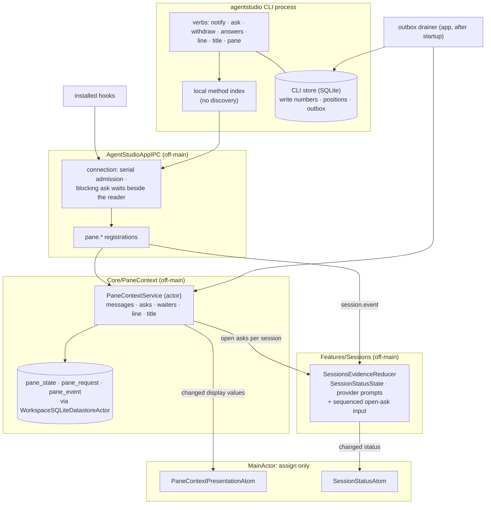
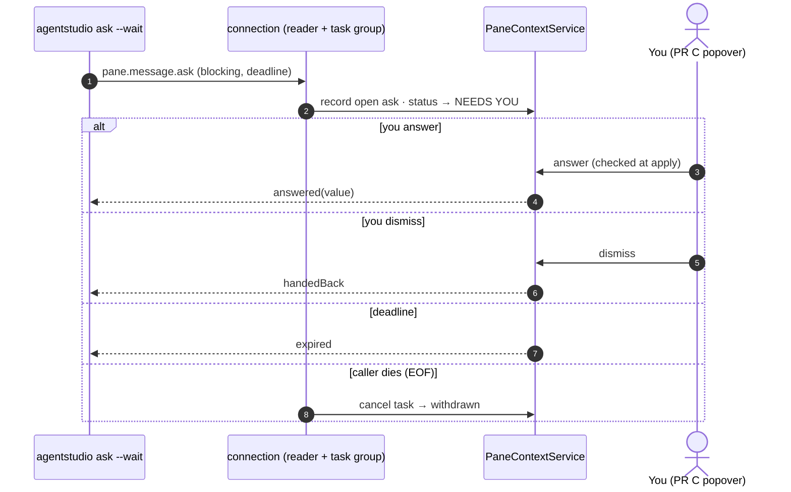

# Enable pane agents: how it is built

Date: 2026-09-30. **Revision 10** (closeout A6): the pull-request summary moves here from Bridge (navigation R19). `PaneContextDetail.pullRequests`, a pure off-main fold over the pane's linked worktrees and Forge's cached facts; the counting rule awaits owner confirmation. **Revision 9** (owner, 2026-09-30): the CLI store has one writer, the CLI. The app reads it read-only; outbox rows carry no delivery state; the app's progress lives in `local.sqlite`, and the CLI purges only rows at or below the mark the app returns at login. Unread rows are never deleted. Date: 2026-09-27. **Revision 8** (round 6: a stale refusal is final for its payload). **Revision 7**, answering round 5 (R5-F1 permission
prompts resolve only at turn boundaries; R5-F2 epoch claims are a separate
idempotent step). Revision 6 answered round 4 (R4-F1 to R4-F6). Revision 5 answered round 3 and the owner's simplified show;
revision 4 answered round 2. This is the Program Design for PR B. It builds the
[Specification revision 6](2026-09-26-pane-context-ipc.md) (rules R1–R31,
with R3a, R7a and R11a), which serves [Requirements revision 3](2026-09-26-requirements.md)
(N1–N15). Scope is the owner's option B: PR B merges before Bridge's #367, and
`show` and `link` land in the follow-up **B2**. The revision-2 design is
superseded. Its storage categories, the title layer, the MainActor lanes and
the dead-hook fix carry over; everything built for cut needs is gone.

## In one paragraph

PR B has five parts:

- **Hooks become session status.** The existing Sessions reducer learns
  failed, interrupted and ended, provider prompts (report-only permission,
  AskUserQuestion, elicitation), and "an open ask means NEEDS YOU". It keeps
  running off the main thread, and replay is decided by the occurrence.
- **One AgentMessage store.** Notices and asks live in a new pane-context
  service with one settle point per ask. A blocking ask waits beside its
  connection's reader, so a closed connection withdraws it.
- **Agent Line and title.** They're current values with write numbers from the
  CLI.
- **The `agentstudio` CLI gets fast and stateful.** Every compiled method goes
  straight to the app, with no catalog discovery and one auth. A small SQLite
  store holds write numbers, answer positions and the notice outbox that
  replaces the NDJSON spool.
- **A runtime-only presentation atom and a keyed session-status atom** carry
  computed values to the UI through one thin apply each.

Nothing computes on the main thread.

## What exists today (checked in code)

| Area | What is true | Anchor |
| --- | --- | --- |
| CLI call path | Only system, auth and session methods resolve locally. Every other call first runs a discovery round trip: fetch `system.capabilities`, decode and validate the whole catalog, then rebuild and compare every compiled descriptor. Then a second connection makes the call. Each connection sends `auth.login`, so there are two per call. Socket reads block. | `AgentStudioIPCClientCommandLineRunner.swift:74-90`; `IPCBuiltInMethodCatalog+Discovery.swift:42-118`; `AgentStudioIPCClientCore.swift:31-42,145-153,204-209` |
| Hook events | Claude Code: sessionStart, userPromptSubmit, preToolUse, permissionRequest, subagentStart/Stop, stop, sessionEnd. Codex adds `interrupt` (→ turnAbort). Nothing maps to `question`, `elicitation` or a failure. | `ClaudeCodeHookProjection.swift:8-16`; `CodexHookProjection.swift:8-29,169,173`; `IPCSessionContracts.swift:38-49` |
| Sessions state | `unknown \| running \| needsYou \| done`. The `.aborted` evidence exists but only suppresses done/running. | `SessionsDomainModels.swift:3-8,59-75`; `SessionsEvidenceReducer.swift:29-90` |
| Session binding | A sessionStart event already opens a binding generation per pane. | `WorkspaceLocalMigrations+Sessions.swift:78-81`; `AgentStudioIPCSessionsAdapter.swift:340-364` |
| Spool | CLI: `<paneId>.notifications.ndjson` under `flock`. App: `PaneReportSpool` drains with truncate or rename. Only `session.report`/`session.message` are eligible. | `PaneNotificationSpoolWriter.swift:12-127`; `PaneReportSpool.swift:68-356` |
| CLI dependencies | `AgentStudioIPCClientCore` and the CLI executable don't link GRDB. | `Package.swift:287-319` |
| IPC server loop | It processes one request at a time and awaits the handler before reading again, so a waiting handler never sees EOF. Auth state is per connection; pre-auth methods are an allowlist. | `AgentStudioAppIPCServer.swift:225-285,315-322,556-591` |
| Socket writes | One writer actor per connection; the transport loops over partial writes, but the blocking `write` runs on a cooperative thread and never reports backpressure. | `AgentStudioAppIPCServer.swift:593-629`; `UnixSocketTransport.swift:86-116` |
| Replay | The Sessions fingerprint hashes the whole mutation, including admission time and freshness; Claude events without a `tool_use_id` get a fresh occurrence id; correlation ids are fresh per CLI process. | `SessionsIngestion.swift:335-375`; `ClaudeCodeHookProjection.swift:144-160`; `SessionsRepository+OperationReplay.swift:9-66` |
| CLI deadlines | None: connect, auth, send and receive all block without a limit. | `AgentStudioIPCClientCore.swift:169-218` |
| SQL home | `local.sqlite` through `WorkspaceSQLiteDatastoreActor` (off-main). Sessions uses the same path. | `WorkspaceSessionsSQLiteAccess.swift` |
| Title | Ghostty's OSC title overwrites `PaneMetadata.title`. | `WorkspaceSurfaceCoordinator.swift:725-728` |

## The choices, in plain words

1. **Status stays in Sessions.** It's the owner of hook evidence and already
   reduces it off-main. PR B extends that reducer and adds one input: the
   session's open asks from the message store. There's no second status engine.
   *What would reopen it:* a status that needs facts Sessions can't see.
2. **Messages get their own store, not Sessions'.** Sessions records what the
   agent's lifecycle did; messages are conversations with you and have their
   own lifecycle. One `PaneContextService` actor owns messages, asks, the
   Agent Line, the title and write numbers, stored in category tables in
   `local.sqlite`.
3. **A blocking ask is the only request that runs beside its connection's
   reader.** Everything else keeps today's one-at-a-time order. The reader
   keeps reading while the ask waits, so it sees EOF and the service settles
   the ask `withdrawn`, unless something settled it first. Writes leave the
   cooperative pool, and a peer that stops reading is detached. This is a
   shared IPC-server change; the rules are in "Connections".
4. **A fast CLI by doing less (Spec R31).** Every method compiled into the
   CLI resolves locally from a light name → method index built on demand.
   There's no catalog discovery, no descriptor rebuild or compare, and one
   connection with one `auth.login` per call. The app already validates
   parameters, resolves the target and authorizes before any handler runs
   (`AppIPCTypedMethodRegistration.swift:148-205`), so skipping the client
   check removes nothing the app relies on.
   - **`command.execute` goes straight to the app too.** Today it costs three
     round trips (`system.capabilities`, `command.list`, then the call;
     `AgentStudioIPCClientCommandLineRunner.swift:84-118,194-227`). Now the CLI
     sends `{ commandId, arguments }` with arguments as the raw strings the
     person or agent typed (`--arg key=value`), and the app parses and
     validates them against the command's own spec, returning
     `invalidArguments { field, expected }` or
     `unknownCommand { closestMatches }` with correction data.
   - **Server-owned limits stay on the server.** `terminal.wait` sends the
     requested wait; the app clamps it to its live maximum and says so in the
     result, instead of the CLI reading the maximum from discovery.
   - **Discovery is explicit only:** `system.capabilities`, `command.list`
     and `agentstudio help --live`. A `--reload-catalog` flag asks the app to
     rebuild its catalog on demand.
   - **Budget:** p95 of `cli.call_total_ms` (process start to exit) on a warm
     debug app, measured over 50 calls: ≤ 150 ms for hook verbs and
     `line`/`title`/`notify`, ≤ 250 ms for other verbs.
5. **The CLI gets its own small SQLite store,** agreed with Panes and
   endorsed by the owner ("safety, type safety, discriminated unions, good
   types"). The owner's direction is a per-machine host daemon ("agentd") with
   the app, the CLI and a phone as its clients, and possibly a Rust CLI later.
   The store is **agentd-in-waiting**: its ordering and outbox ownership move to
   that daemon later, and it holds no truth itself.

   **Engine and file:**
   - **GRDB, the repo's standard** (owner, 2026-09-30; this replaces the
     earlier system-`SQLite3` choice). The store has one way to do SQLite, the
     same as the app's `local.sqlite`: GRDB's `DatabaseMigrator`, typed records
     and transactions. The only reason for avoiding GRDB was a hypothetical
     future Rust process opening the same file, and that's speculative; such a
     daemon would take over migrations when it exists. The CLI doesn't link
     GRDB today, so the PR measures CLI start-up against the ≤ 150 ms budget.
   - WAL mode, a short busy timeout, and **fail open**: if the store is locked,
     corrupt or unwritable, the hook still returns at once, tries a direct send,
     and logs.
   - It lives in the channel's stable per-user data root (for example
     `~/.agentstudio/ipc/`, and the beta/debug roots separately), never a path
     derived from the app bundle.

   **Schema and migrations (owner, 2026-09-27):**
   - Ordinary migrations are fine. What's avoided is anything that forces a
     table rebuild: dropping or reshaping columns, or copying data into a new
     table.
   - So: plain TEXT/INTEGER columns; enums are TEXT parsed in Swift; a `CHECK`
     only for booleans; no triggers. A new enum case is then a code change,
     never a rebuild.
   - Migrations are additive (new tables, or `ALTER TABLE … ADD COLUMN` with a
     safe default), registered with GRDB's `DatabaseMigrator`, and applied on
     open. The already-applied check is one read of GRDB's migration table, and
     migrations run only when the file is behind.
   - A CLI that finds migrations newer than it knows doesn't write
     (`DatabaseMigrator.hasBeenSuperseded`); it sends directly or fails open.

   **Typed at the read boundary:**
   - Every row parses into a union. `CLIStateEntry` is
     `titleWriteNumber | lineWriteNumber | answerPosition`, each with pane,
     session and an integer. `CLIOutboxEntry` is one recorded notice. It's
     immutable once written and carries no delivery state, because the app
     never writes this store (below).
   - An unknown kind or state is a field-tagged decode error: the row is
     skipped and logged, never defaulted.
   - `payload_json` is a **recorded exception** to the no-JSON rule. It's the
     exact versioned wire envelope, opaque to SQL and never queried, and on
     drain it goes through the same decoder and validator as a live request.

   **Delivery:**
   - **One writer: the CLI** (owner, 2026-09-30: "should be single writer …
     app should only read").
     - Only `agentstudio` processes write, migrate and purge this file. Many
       short-lived CLI processes share SQLite's write lock (WAL, the 50 ms busy
       timeout, fail open).
     - The app opens the file **read-only** (GRDB `readonly`). In WAL mode it
       still takes shared read locks, but never the write lock, so a hook never
       waits on the app.
     - This is the repo's rule of one writable owner per database
       (`workspace_data_architecture.md`). agentd later takes over the same
       writer role.
   - The store is a transactional outbox. The app (later agentd) is the only
     authority on what a notice means.
     - The app keeps its own progress in `local.sqlite`
       (`pane_context_cli_outbox_cursor`, below). A notice it refuses only
       advances that cursor and emits telemetry with the reason class.
     - It never marks rows in the CLI store.
     - The drain is idempotent by `message_id`.
   - **Cleanup stays with the writer.**
     - The app's `auth.login` result carries
       `cliStoreReadThrough { lifecycleReport, outbox }`: the highest row each
       of its cursors has handled for this `store_id`.
     - After its call, the CLI deletes rows at or below those marks once
       they're about a day old.
     - **A row the app hasn't read is never deleted.** Deleting an unread
       `sessionEnd` would leave the pane's last "agent running" look
       standing, with no end and no loss marker, and a reboot would then
       resume an agent that had already exited (advisor, 2026-09-30).
       Unread rows are a few hundred bytes each and only pile up while the
       app isn't run, so there's no age limit.
   - **Only the CLI migrates.** After an update, the file stays one schema
     version behind until the first CLI call migrates it. The app's reader
     accepts the current and the previous version; a column added since reads
     as absent. Both binaries ship in the same bundle, so the gap is short.
   - `answerPosition` is a bookmark, not a record.
   - The NDJSON spool is deleted.

   **Contract for later clients:**
   - The CLI finds its server only through the socket environment variable.
   - Nothing persisted or on the wire holds bundle paths, PIDs or
     process-monotonic instants, and wall time is UTC.
   - The CLI surface is a written contract: no verb renames, additive flags
     only, a fixed exit-code table, stable stdout JSON. Provider hook configs
     embed it.

6. **Replay is decided by the occurrence, not by arrival (Spec R7a).**
   Checked in code: the Sessions fingerprint hashes the whole evidence
   mutation (`SessionsIngestion.swift:335-375`), which today includes the
   admission-time `occurredAt = now()` (`AgentStudioIPCSessionsAdapter.swift:239`)
   and the resolved freshness (`:286-304`). A Claude tool event re-invoked by
   the provider derives the same occurrence id
   (`ClaudeCodeHookProjection.swift:144-160`) but a new time, so it throws
   `occurrenceConflict`. Codex derives a deterministic occurrence id for every
   event (`CodexHookProjection.swift:110-131`); Claude only for events with a
   `tool_use_id`, else a fresh one. Correlation ids are fresh per CLI process
   (`ClaudeCodeHookInvocation.swift:70-76`), so correlation replay only covers
   retries inside one process.

   The fix:
   - **Canonical intent.** The fingerprint hashes only what the provider
     said: provider, conversation, event name, occurrence id, turn, subject,
     kind and the event's provider fields. It excludes everything the app adds
     on arrival: admission time, resolved freshness, correlation id. Freshness
     and admission time are still stored, outside the fingerprint.
   - **Ordering is durable admission order.** Each evidence row gets an
     additive `admission_sequence` column: the `commit_revision` of the
     operation that admitted it. The reducer orders by it, so a wall-clock
     step can't reorder facts. Rows written before the upgrade have no
     sequence; they sort before every sequenced row, and among themselves by
     their stored `occurredAt`, in the same comparator. `occurredAt` stays the
     admission time, used for display and ages. The hook's own time travels as
     a new optional `sourceOccurredAt` field in `IPCSessionEventIdentity` and in
     message params. It's validated (at most 5 minutes in the future, else
     stored as absent), stored and shown, and never ranks anything. PR A's
     activity clock is untouched.
   - **No delayed duplicates exist for keyless events.** Claude's
     sessionStart, UserPromptSubmit, Stop and StopFailure carry no provider
     key, so a second delivery can't be recognised by content. The design
     therefore gives them no second delivery. A hook process makes one
     delivery attempt. If that attempt ends `notSent`, it may retry within
     its deadline with the **same** correlation id, which correlation replay
     recognises. Hook facts are never written to the outbox (notices only,
     Spec R27). **Amended 2026-09-30 (owner):** the four **lifecycle** hooks (Claude Code and Codex `SessionStart`/`SessionEnd`) are recorded in the same CLI store's `cli_lifecycle_report` table. Its columns are typed, with no JSON: they're the live `session.event` fields plus `report_id` as the occurrence id. A store sequence gives at-most-once intake in recording order (session-restore Program Design, R3 item "Lifecycle reports in the CLI store"). `IPCSessionEventIdentity` gains the optional `endReason`. Activity hooks are still never kept. So Agent Studio never re-delivers a keyless fact after a
     later one. Whether a provider itself ever re-invokes a hook is a
     qualification item (gap 1). If a trace shows a provider re-invoking
     a keyless event, that event isn't claimed supported until PR B derives a
     provider key for it from the payload.
   - **A sessionStart for a replaced conversation is refused.** If the
     conversation is already a retired binding of this pane, the admission
     returns `historical` and mints no generation. If it is the active
     binding, the admission returns that binding. Only an unseen
     conversation binds. **Amended 2026-09-30 (session-restore R3):**
     lifecycle hooks now carry a per-run `report_id` as their occurrence id.
     A **live** `SessionStart` (recorded after the app's readiness watermark
     S0) with a **new** occurrence binds a new source generation, even for a
     conversation that is a retired binding of this pane. That's how a
     resumed session re-binds (session-restore SR13). Historical starts
     (`sequence ≤ S0`) and replays of an already-applied occurrence still get
     `historical` and never revive a conversation.
   - **Hard cutover for stored rows.** An additive column
     `sessions_operation.fingerprint_version` (NULL on old rows) marks the
     new canonical intent as version 1. The lookups stay as they are: by
     `(operation_scope, correlation_id)` and by occurrence. A version-1 row
     is compared by fingerprint as today. A version-NULL row that matches is
     **replayed without a compare**: its recorded outcome is returned, and
     nothing is written. So the existing `UNIQUE (operation_scope,
     correlation_id)` never collides, no evidence row is half-written, and
     PR A's adapter sees `.replayed`, not `.inserted`, so pane activity isn't
     refreshed (`SessionsRepository.swift:15-43` and
     `AgentStudioIPCSessionsAdapter.swift:170-187` on the PR A branch). This is the Spec's
     stated hard-cutover exception (R7a): changed content isn't detected
     against a pre-upgrade row, because the old fingerprint included the
     admission time and can't be recomputed without keeping the old encoder.
   - **Changed content still conflicts.** The same occurrence id with a
     different canonical intent throws `occurrenceConflict`, as today.

   This changes Sessions' persisted replay contract, which PR B owns; it rebases
   on PR A's admission additions first (delivery-order hand-off contract).

7. **Provider prompts are Sessions evidence in PR B (Spec S13, R3a, R13).**
   A permission request, a Claude AskUserQuestion and an MCP elicitation are
   hook facts. They open and resolve an S13 prompt inside the Sessions
   reducer, and the hook returns at once. They never create an AgentMessage,
   so nothing is answerable in the app while no hook waits. PR C adds the
   answer UI and flips the installer's permission policy to "wait": from then
   a permission request calls `pane.message.ask` and becomes a blocking ask.
8. **The agent title is a layer.** The pane keeps its own name (the OSC title
   or the default), and the agent title sits above it in the presentation atom.
   `PaneMetadata` is unchanged.

## Provider signals for the status tree

Checked against the live Claude Code hooks reference (re-read 2026-09-27 for
the round-2 review), the provider research report (pane-fixes), and our hook
projections. **Installed** means Agent Studio wires it today; **PR B** means
PR B adds it. A row counts as supported only after a recorded trace from the
installed provider version (Spec R6).

| Status input | Claude Code 2.1.283 | Codex CLI 0.157.1 |
| --- | --- | --- |
| working(active) | `UserPromptSubmit`, `PreToolUse`, `SubagentStart/Stop` (installed) | `PreToolUse`, `SubagentStart/Stop` (installed) |
| idle(done) | `Stop` (installed). It does **not** run when the person interrupts. | `Stop` (installed) |
| idle(interrupted) | no hook reports it; see the silent-case rule below | `Interrupt` → turnAbort (installed) |
| idle(ended) | `SessionEnd` (installed) | `SessionEnd` (installed) |
| failed(summary) | **`StopFailure`** (PR B), with its documented error category as the summary | not in hooks (app-server only), so it stays unknown |
| provider prompt, approval (S13) | `PermissionRequest` (installed; report-only) opens it. It carries `tool_name`/`tool_input` but no `tool_use_id`, so no completion can be proved to be its own. It resolves at the turn boundary (`Stop`, `StopFailure`, `UserPromptSubmit`) or session end, whether you allowed or denied it in the terminal | `PermissionRequest` (installed; report-only) opens it. The same rule: it resolves at a turn boundary (`Stop`, `UserPromptSubmit`) or session end |
| provider prompt, question (S13) | **`PreToolUse` with `tool_name == "AskUserQuestion"`** (PR B decodes `tool_name`, `tool_use_id`, question and choices) opens it; that tool's `PostToolUse` resolves it | not in hooks (app-server `requestUserInput` only) |
| provider prompt, MCP form (S13) | **`Elicitation`** opens it; **`ElicitationResult`** resolves it, correlated by `elicitation_id` when present, otherwise by server name and order (PR B; payload re-checked against a recorded trace before wiring) | none |
| `Notification` | not a status input. Its `agent_needs_input` type covers only background agent-view sessions and one setup question, not a foreground blocked agent. | none |
| agent ask | the session's own open `ask` from `agentstudio` (PR B) | same |

Rules this sets for the reducer:
- **Unknown, never a guess.** A state the provider doesn't report stays at the
  last hook-derived value, or unknown.
- **Silent Claude interrupts.** After a person interrupts Claude, no hook runs.
  The session keeps its last value (usually working) until its next fact,
  normally the next `UserPromptSubmit`. An open provider prompt stays open the
  same way, carrying when it was observed (Spec R3a). PR B doesn't infer
  interrupts.
- **What that costs in PR B.** After you allow a permission in the Claude or
  Codex terminal, the session stays NEEDS YOU(approval) until the turn ends,
  even while the agent works. The prompt carries `observedAt`, so the panel
  can show its age. This is honest rather than guessed, and it lasts only
  while permission hooks are report-only: from PR C a permission request is
  an ask answered in the app, whose answer settles it exactly.
- **Resolution needs evidence.** A prompt resolves on its own completion
  (the matching tool completion, or `ElicitationResult`) or at a turn boundary
  (`UserPromptSubmit`, `Stop`, `StopFailure`). A `PreToolUse` or completion of
  a different tool call, including a parallel one in the same batch, never
  resolves it. `SessionEnd` or a replacing sessionStart ends it. The recorded
  provider traces (gap 1) must show these boundaries on the installed
  versions.
- **Codex CLI never shows FAILED or a hook-derived question.** That changes
  once Agent Studio hosts Codex through its app-server, which is later.
- **An agent can still cover the gaps.** Any provider's agent can raise NEEDS
  YOU itself with `agentstudio ask`, so the skill tells Codex agents to ask in
  Agent Studio for important questions.

## Binding table

| Entity | Semantic owner | Home (new / modified / existing) | Type home | Shape at boundaries | Kind |
| --- | --- | --- | --- | --- | --- |
| S1 Agent session | Sessions | modified `Features/Sessions` binding + resume info | `SessionsBindingRecord` gains `resumeHint`, `ownerPaneId` | existing `session.event` sessionStart params gain an optional resume hint | persisted (Sessions tables) |
| S2 Session status | Sessions reducer | modified `SessionsEvidenceReducer`; new keyed atom `SessionStatusAtom` (owner-approved) | `SessionStatus = .needsYou(reason) \| .failed(summary) \| .working(active \| monitoring) \| .idle(done \| ready \| interrupted \| ended) \| .unknown` | UI: `AtomFamily<SessionId, SessionStatus>` via a thin apply; IPC: in `pane.context.get` | derived |
| S3–S5 AgentMessage | PaneContextService | new `Core/PaneContext/` | `AgentMessageDetail` and its unions ("Contracts PR C consumes") | wire: `IPCPaneMessageSendParams { handle, messageId, writer?, sourceOccurredAt?, importance, body, why?, actions, shape }`, where an ask shape carries its `reason` → `.created(id) \| .existing(id)`; `pane.message.ask` → `AskOutcome = .answered(value) \| .handedBack \| .expired \| .withdrawn \| .stale` (a repeat of a settled ask returns its outcome) | persisted |
| S6 Message action | PaneContextService (record); owner of each effect | new | `MessageAction = .openFile(path, line?) (B2) \| .openPullRequest(ForgePullRequestIdentity) \| .goToPane(PaneId)` | embedded in S3 | value |
| S7 Answer position | CLI store + PaneContextService | new | `AnswerPosition(UInt64)` per (session, pane) | wire: `pane.message.changes { handle, writer, after }` → `{ entries, nextPosition, more }`; reporting `after` confirms receipt of answers at or before it | persisted (both sides) |
| S8 Agent Line | PaneContextService | new | Panes E6 `AgentStatusLine` | wire: `pane.line.set { handle, line, writeNumber }` | persisted |
| S9 Agent title | PaneContextService | new; displayed via `PaneDisplayTitleDerived` | `String` | wire: `pane.title.set { handle, text, writeNumber }` | persisted |
| S10 Write number | CLI store + PaneContextService | new | `WriteNumber { epoch: UInt64, counter: UInt64 }` per (writer, stream); epoch minted by the app, counter by the CLI store ("Writers and write numbers") | wire field; `stale(lastAccepted)` or `stale(writerReplaced)` result | persisted (both sides) |
| S13 Provider prompt | Sessions | modified `SessionsEvidenceReducer` / `SessionStatusState` | `ProviderPrompt { key, reason: .approval \| .question, observedAt, summary }`, keyed by `ProviderPromptKey = .toolCall(id) \| .elicitation(id) \| .permission(sequence)` | existing `session.event` params gain the decoded tool name, tool call id and elicitation id | derived from stored evidence |
| S11 Link (B2) | Bridge | Bridge contract PR types | `BridgeLinkContributor`, membership unions v3 | port `PaneLinkMembershipPort` (Bridge-defined) | persisted by Bridge |
| S12 CLI store | `agentstudio` CLI (later agentd) | new target `AgentStudioCLIStore` (foundation and `cli_lifecycle_report` land with session-restore R3; this PR adds `cli_state` and `cli_outbox`) | repository over the system `SQLite3` module; rows parse into `CLIStateEntry` / `CLIOutboxEntry` unions | one SQLite file in the channel's per-user IPC data root; additive migrations numbered by `PRAGMA user_version` | persisted |
| Display value | PaneContextService (computes) | new runtime atom `PaneContextPresentationAtom` | `PaneContextDisplay { revision, agentTitle?, agentLine?, openAskCount, unreadNoticeCount, newestOpenAskId?, gitSummary }` | UI: `AtomFamily<PaneId, …>` via a thin apply | derived, never stored |

## Connections (shared IPC server change)

Today (`AgentStudioAppIPCServer.swift`): each connection runs a serial loop,
receive (a blocking `read` on a GCD thread, `:510-521`) → `process` →
`writer.sendResponse`, so a waiting handler blocks its own reader and never
sees EOF (`:225-285`). Auth state is per connection (`:556-591`), and
pre-auth methods are an allowlist (`:315-322`). The writer is one actor per
connection (`:593-617`), and the transport already loops over partial writes
(`UnixSocketTransport.swift:86-116`), but the blocking `write` runs on the
writer actor's cooperative thread.

The change keeps what works and adds four rules:

1. **Admission stays serial and in order.** The reader decodes frames and
   admits them one at a time. `auth.login` and pre-auth checks run inline, so
   a pipelined `auth.login` then call is still ordered. Every existing method
   and every `pane.*` write runs inline too, so dependent mutations keep
   their order and each method's behaviour is unchanged.
2. **A waiting ask owns the connection.** A method descriptor declares
   `execution: .inline | .waitsBesideReader`. In PR B only blocking
   `pane.message.ask` is `.waitsBesideReader` (B2's take-over show will be
   too). It starts as a child task in the connection's task group, and the
   reader continues. While that waiter is in flight, the reader refuses
   **every** further request with `unavailable(connectionBusy)` before any
   asynchronous processing: no credential check, target resolution or
   handler runs. So nothing can suspend the reader, and it always reaches the
   next receive and sees EOF. Without a waiter in flight, every method,
   including `terminal.wait`, behaves exactly as today. The CLI uses one
   connection per call, so it never meets the refusal.
3. **EOF, error and shutdown are distinct causes.** When the reader sees EOF
   or a read error, it cancels the task group. The ask's cancellation handler
   calls `PaneContextService.settleAsk(id, cause: .callerGone)`. `stop()` and
   `stopAcceptingConnections()` first mark the server `stopping`, so the same
   handler passes `cause: .appStopping`, which settles as `stale` (Spec R11:
   shutdown is a restart, not a withdrawal). A crash leaves the ask open, and
   the service's first open marks it `stale`.
4. **Writes are accepted on enqueue and completed off the pool.**
   - `sendFrame` now returns when the frame is **enqueued**, as
     `.accepted | .overloaded`. It doesn't wait for the bytes to leave. The
     writer actor appends the frame to one per-connection serial GCD queue,
     which runs the existing partial-write loop. One queue keeps the byte order
     single-writer.
   - The actor counts queued bytes. If a frame would take the total above
     4 MiB (`AppPolicies.IPC.maximumQueuedOutputBytes`), `sendFrame` returns
     `.overloaded` at once and the connection closes.
   - A write that later fails on the queue also closes the connection.
   - Either way, the reader then sees EOF or an error, and the existing
     teardown removes that connection's subscriptions
     (`eventBroker.removeSubscriptions`, server `:222`). A waiting ask on it
     settles `callerGone`.
   - `IPCEventBroker` still delivers to subscribers one at a time
     (`IPCEventBroker.swift:119-137`), but each delivery now costs only an
     enqueue. So one stalled subscriber can't hold up publication to the
     others.

**One settle point.** `PaneContextService.settleAsk(id, cause)` is the only
writer of an ask's terminal state. Causes are `answer`, `dismiss`,
`deadline`, `withdraw`, `callerGone` and `appStopping`. It runs one
transaction, `UPDATE … WHERE id = ? AND state = 'open'`. The first cause to
commit wins, and the others get the settled state back. **The deadline is
checked at commit, not by the scheduler.** Inside the same transaction, any
cause other than `deadline` first compares the stored deadline with the
service clock's `now`. If the deadline has passed, the transaction settles
`expired` instead, and an answer is refused `expired`. So a late answer can
never win just because the deadline task hasn't run yet. The waiter then
returns whatever was committed. So an answer that commits before EOF stays
answered, and the retried `pane.message.ask` with the same identity returns it
(Spec R8).

## CLI call lifetime

Today every client step blocks with no deadline
(`AgentStudioIPCClientCore.swift:169-218`). The client gets one `CallDeadline`,
a `ContinuousClock` instant fixed when the call starts. Socket timeout options
(`SO_RCVTIMEO`, `SO_SNDTIMEO`) are inactivity timers that restart on progress,
so they can't enforce a total. Instead:
- The client socket is non-blocking.
- Every `connect`, `read` and `write` in the partial-I/O loops
  (`UnixSocketTransport.swift:94-110`, `AgentStudioIPCClientCore.swift:270-275`)
  is preceded by `poll` with the remaining time, recomputed from the deadline
  on every loop iteration.
- A peer that trickles one byte at a time still hits the absolute deadline.
  When the remaining time reaches zero, the client closes the socket and
  returns.

| Caller | Total limit |
| --- | --- |
| Hook verbs (report-only) | 2 s (`CLIPolicy.hookCallLimit`) |
| `line`, `title`, `notify`, `answers`, `pane`, `withdraw` | 5 s |
| `ask --wait --timeout T` | T + 2 s. The app's ask deadline is T, so the app settles `expired` before the transport limit (Spec R8). |

On timeout the call ends as one of two typed outcomes, never a guess:
- `notSent(step)`: the request frame was not completely written. A notice
  goes to the outbox; anything else exits `unavailable`.
- `outcomeUnknown`: the frame was written but no reply came. Nothing is
  queued (Spec R31), and nothing is granted. A hook exits 0 so the provider
  continues. A verb exits with the `outcomeUnknown` code.

Store access has its own short busy timeout (50 ms), inside the same total.

## Writers and write numbers

**Who is writing.** A pane credential names a pane, not a provider session
(`IPCContracts.swift:33-37`). The CLI reads its provider session from the
environment the provider sets (`CLAUDE_CODE_SESSION_ID`, `CODEX_THREAD_ID`),
and sends it as `writer: { provider, conversationId }` on every `pane.*` write
(and inside the outbox envelope). At admission the app looks it up with
Sessions' existing per-pane binding lookup
(`AgentStudioIPCSessionsAdapter.swift:340-364`):

| Claimed writer | Line / title | Notice | Ask |
| --- | --- | --- | --- |
| the pane's active binding | accepted, stamped with that binding generation | accepted | accepted |
| an earlier binding of this pane | refused `stale(writerReplaced)` | accepted, attributed to that earlier session; shown in the pane, never counted for the current session | refused `stale(writerReplaced)` |
| no claim (a shell, a person) | accepted as writer `pane` | accepted as writer `pane` | refused `bindingRequired` |
| unknown to this pane | refused `bindingRequired` | refused `bindingRequired` | refused `bindingRequired` |

The claim can't write another pane: the credential still limits every call to
its own pane. So the claim only chooses between this pane's own sessions.

**Checked again at commit.** The lookup at admission gives early refusals, but
a binding can be replaced while a write waits. So `PaneContextService`
captures the binding generation at admission and re-checks it **inside the
committing transaction** for line, title and ask writes. It reads Sessions'
current binding for the pane through a Sessions repository read
(`currentBindingGeneration(paneId:in: transaction)`), on the same
`WorkspaceSQLiteDatastoreActor` connection that serialises Sessions' own
binding writes. A mismatch refuses `stale(writerReplaced)` with no effect.
Sessions stays the only writer of bindings. Notices from an earlier session
are still admitted and attributed to it.

**Write numbers.** Numbers are per (writer, stream), so a new session starts
its own sequence and never competes with the old one. A number is a pair
`(epoch, counter)`, compared in that order:
- **Claiming an epoch is its own step and never writes a value.** A CLI
  store with no epoch for a (writer, stream) first writes a fresh `claimId`
  into its store. It then calls `pane.writer.claimEpoch { writer, stream,
  claimId }` on the same connection, before its write. The app handles the
  claim in one transaction:
  - It looks up `claimId` in `pane_epoch_claim`. If found, it returns that
    epoch, so a lost reply is retried safely.
  - Otherwise it mints `current_epoch + 1`, sets it as the current epoch for
    (pane, writer, stream), resets `last_counter` to 0, and records the claim.
  - It applies no payload.
- **Ordered writes must carry the current epoch.** A write is accepted only if
  its epoch equals the current epoch and its counter is above `last_counter`.
  Any other epoch is refused `stale(epochSuperseded)`.
- **Every stale refusal is final for its payload.** A write refused `stale`
  for any reason (a lower counter or `epochSuperseded`) is dropped: the CLI
  reports it and never resends that payload, under any number or epoch. After
  `epochSuperseded`, the CLI clears its stored epoch, so its **next distinct**
  line or title write claims a fresh epoch first. A refreshed claim only ever
  serves an intent created after it.
- **A late claim can't reverse anything.** If an older store's claim arrives
  after a newer one, it mints a newer epoch but writes nothing. The newer
  store's pending write is refused and dropped; its next distinct write claims
  again. No value is ever accepted under an epoch that isn't current, and no
  refused value is ever resubmitted, so a delayed older intent can't replace
  a newer one.
- **The CLI allocates counters under one lock.** `counter = stored + 1`,
  inside one `BEGIN IMMEDIATE` transaction. Two concurrent CLI processes never
  share a number.
- **A recreated store makes a new claim.** A write still in flight from the
  lost store carries the old epoch, so it is refused.

There is no clock in the ordering.

- **No store, no ordered write.** When the store can't allocate (locked past
  its busy timeout, corrupt, or a newer `user_version`), `line` and `title`
  don't send. They exit `unavailable(orderingStoreUnavailable)`, because
  without the allocator the CLI can't prove a delayed write is older than a
  newer one.
- **Everything else still goes out.** Notices, asks and hook facts don't use
  write numbers, so they still send directly (fail open).
- **After a refusal.** A write refused `stale(lastAccepted)` is never resent.
  The CLI stores `lastAccepted`, so its next allocation starts above it.

**Answer position.** The bookmark only moves forward:
`UPDATE cli_state SET value = max(value, ?)`. Two concurrent `answers` calls
can't move it back.

## Session status: inputs and transitions

The Sessions actor keeps one `SessionStatusState` per session, off-main, and
derives `SessionStatus` from it after every input. Only a changed value is
published (below).

```swift
struct SessionStatusState: Sendable, Equatable {
    var binding: SessionBindingPhase        // .bound(generation) | .ended(at) | .replaced(by, at)
    var turn: TurnPhase                     // .none | .working | .done(at) | .interrupted(at) | .failed(summary, at)
    var providerPrompts: [ProviderPromptKey: ProviderPrompt]   // open S13 only
    var openAsks: OpenAskSummary            // { sequence, approval, question, blocked counts }
    var lineWork: AgentLineWork?            // from the current Agent Line; refines WORKING only
    var seenAfterDone: Bool                 // the person viewed the pane after `done`
}
```

| Input (admission order) | Changes | Derived status |
| --- | --- | --- |
| sessionStart | new state `.bound(g)`; the replaced session gets `.replaced`, its prompts end | recomputed for both |
| UserPromptSubmit | `turn = .working`; a turn boundary: resolves every open prompt | WORKING unless NEEDS YOU |
| PreToolUse, SubagentStart/Stop | `turn = .working`; resolves **no** prompt (a parallel tool is not an answer) | WORKING unless NEEDS YOU |
| PermissionRequest | opens an approval prompt, keyed `permission(sequence)`. It has no `tool_use_id`, and no reliable causal link to one call exists, so it is never tied to a tool call. It resolves only at a turn boundary or session end. | NEEDS YOU(approval) |
| AskUserQuestion `PreToolUse`, Elicitation | opens a question prompt keyed by `toolCall(id)` or `elicitation(id)` | NEEDS YOU(question) |
| PostToolUse / PostToolUseFailure | resolves the `toolCall(tool_use_id)` prompt (an AskUserQuestion) with this id, if open. It never resolves a permission prompt. | recomputed |
| ElicitationResult | resolves `elicitation(elicitation_id)`; with no id, the oldest open elicitation from the same MCP server | recomputed |
| Stop | `turn = .done(at)`, `seenAfterDone = false`; a turn boundary: resolves every open prompt (a denied tool fires no failure event, and its turn then stops) | IDLE(done), then IDLE(ready) once seen |
| StopFailure | `turn = .failed(category)`; a turn boundary: resolves every open prompt | FAILED |
| Codex Interrupt | `turn = .interrupted(at)` | IDLE(interrupted) |
| SessionEnd | `.ended(at)`; prompts end | IDLE(ended); Agent Lines it wrote go stale |
| open-ask snapshot (sequence n) | applied only if n > `openAsks.sequence` | NEEDS YOU while any count > 0 |
| Agent Line change for the session | `lineWork = .monitoring` or `nil` | WORKING(monitoring) only when `turn == .working` |
| pane viewed (pane focused by the person) | `seenAfterDone = true` if `turn` is `.done` | IDLE(done) → IDLE(ready) |

Derivation, in this order:
1. NEEDS YOU if any open prompt or any open-ask count. The reason is
   approval > question > blocked, from the prompt kind and each ask's
   declared reason.
2. IDLE(ended) if the binding ended or was replaced, whatever `turn` last
   was. An ended session's open asks still come first (step 1), because they
   remain answerable messages.
3. FAILED if `turn` is `.failed`.
4. WORKING(`lineWork == .monitoring ? .monitoring : .active`) if `.working`.
5. IDLE(interrupted), then IDLE(done) or IDLE(ready) by `seenAfterDone`.
6. UNKNOWN.

A silent interrupt (Claude sends no hook) leaves `turn = .working` and any
prompt open until the next UserPromptSubmit, Stop or SessionEnd; the prompt
carries `observedAt` for its age. A drawer session's asks feed only
that drawer session's state.

**Ordering of the two actors' inputs.** `PaneContextService` mints the
per-session `OpenAskSummary.sequence` inside the same transaction that changes
an ask, and sends the summary through the App-composed `SessionOpenAskInput`
port after commit. Sessions drops any summary whose sequence isn't newer, so a
delayed older summary can't republish NEEDS YOU after the ask resolved. On
Sessions' lazy open it asks once for `openAskSummaries()` (each with its
sequence) and joins them the same way.

**Pane viewed** comes from the existing active-pane change on MainActor as a
fire-and-forget port call into Sessions (the value is captured on MainActor;
nothing is derived there). It is a port input, not a new bus event.

## Keeping displayed values current

- **One publisher per actor, in order.** Each actor pushes changed values
  into one `AsyncStream` (buffering newest per key) consumed by one MainActor
  apply task, so publication order is commit order. The atom methods only
  assign and equal-suppress.
- **Deadlines are off-main.** `PaneContextService` owns one deadline
  scheduler on its injected `any Clock<Duration>`: the earliest Agent Line
  expiry and blocking-ask deadline across its panes. When it fires, the service
  settles expired asks and marks lines stale, then publishes. Nothing waits for
  another write.
- **Session end reaches lines.** Sessions sends `sessionEnded(sessionKey)`
  through the App-composed port; the service marks that writer's Agent Lines
  stale and publishes.
- **Any detail change bumps the revision.** `PaneContextRevision` (per pane)
  advances inside every transaction that changes anything `readDetail`
  returns, including answers, receipts, read state and settled-message
  retention. So an open popover re-reads even when counts don't change.
- **Drawer moves.** The service observes the existing topology facts on
  `PaneRuntimeEventBus` (off-main subscriber). A drawer's owner change bumps
  both the old and the new owner's revision and recomputes their aggregated
  counts; in-flight B2 effects from the drawer return stale.

## Contracts PR C consumes (the typed seams)

PR B owns these shapes; PR C rebinds to them (Panes `pr-c-rebind-list.md`),
and any change is posted on thread 01a0cdc9 before code. They live in
`Core/PaneContext/Contracts/`, and `App/PaneContext/PaneContextUIAdapter`
implements the two protocols off-main.

```swift
protocol PaneContextDetailReading: Sendable {
    func readDetail(_ request: PaneContextReadRequest) async -> PaneContextReadResult
}
struct PaneContextReadRequest: Sendable, Equatable {
    let paneId: PaneId                     // the owner view being read
    let page: PaneContextReadPage
}
enum PaneContextReadPage: Sendable, Equatable {
    case first
    case more(source: PaneId, after: LiveMessageCursor)   // continue one source pane's live messages
}
/// Live messages of one source pane are ordered by (asks before notices, then
/// newest event position first); the cursor is the last (rank, position) returned.
struct LiveMessageCursor: Sendable, Equatable { let rank: Int; let position: UInt64 }
struct DetailTruncation: Sendable, Equatable {
    let omitted: [OmittedLiveMessages]     // one per source pane with live messages left out
}
struct OmittedLiveMessages: Sendable, Equatable {
    let source: PaneId; let openAsks: Int; let unreadNotices: Int
    let next: LiveMessageCursor            // pass back as .more(source:after:)
}
enum PaneContextReadResult: Sendable, Equatable {
    case detail(PaneContextDetail)
    case paneGone                      // retired or purged
    case sourceNotInView               // .more named a pane that is no longer the owner or one of its drawers; start again from .first
    case unavailable(StorageFailureSummary)  // bounded, no payload text
}
struct PaneContextDetail: Sendable, Equatable {
    let paneId: PaneId
    let revision: PaneContextRevision  // bumps on ANY change the detail shows
    let agentTitle: String?
    let agentLine: AgentLineDetail?    // Panes E6 fields + writer + stale
    let session: SessionSummary?       // bound session, SessionStatus, provider prompt ages
    let messages: [AgentMessageDetail] // open asks, unread notices, then settled (retention below)
    let drawerMessages: [DrawerMessageGroup]  // owner pane only, labeled by source pane
    let links: PaneLinksDetail         // .unknown until B2
    let pullRequests: PullRequestSummaryDetail  // Spec R32 / S14; .notApplicable for fewer than two linked worktrees
    let truncation: DetailTruncation?  // set when a bound below was hit
}
struct AgentMessageDetail: Sendable, Equatable {
    let id: AgentMessageId; let sourcePaneId: PaneId
    let sender: AgentMessageSender     // .session(provider, sessionRef, bindingGeneration) | .pane(PaneId)
    let sentAt: Date; let sourceOccurredAt: Date?  // nil when absent or rejected as future
    let importance: MessageImportance  // .info | .attention | .done | .failure (Requirements)
    let body: String; let why: String?
    let actions: [MessageAction]
    let shape: AgentMessageShape
}
enum PullRequestSummaryDetail: Sendable, Equatable {
    case notApplicable                 // fewer than two linked worktrees: the pane keeps its existing PR control
    case summary(PullRequestSummary)
}
struct PullRequestSummary: Sendable, Equatable {
    let state: PullRequestSummaryState
    let members: [PullRequestMemberRow]   // every linked worktree, in link order
}
enum PullRequestSummaryState: Sendable, Equatable {
    case needsAttention(count: Int)    // members with failing checks or changes requested
    case running                       // none need attention; some member's checks are running
    case allGood                       // none need attention or run; at least one member has a PR with passing checks
    case noInfo                        // every member has no PR or unknown facts
}
enum PullRequestMemberRow: Sendable, Equatable {
    case noPullRequest(worktreeId: UUID)
    case unknown(worktreeId: UUID)              // Forge facts not fetched yet; neutral
    case pullRequest(worktreeId: UUID, number: Int, checks: PullRequestCheckStatus, review: PullRequestReviewStatus)
}   // PullRequestCheckStatus / PullRequestReviewStatus are Forge's existing enums (RepoBranchPullRequestFacts.swift:14,21)
enum AgentMessageShape: Sendable, Equatable {
    case notice(NoticeState)           // .unread | .read | .dismissed | .withdrawn
    case ask(AskReason, AskForm, AskWaiting, AskState)
}
enum AskReason: Sendable, Equatable { case approval; case question; case blocked }  // declared by the sender
enum AskForm: Sendable, Equatable {
    case choice(options: [AskChoice], allowsMultiple: Bool)  // AskChoice { id, label }
    case freeText(placeholder: String?)
    case elicitation(ElicitationSchema)  // the supported subset below
}
enum AskWaiting: Sendable, Equatable { case nonBlocking; case blocking(deadline: Date) }
enum AskState: Sendable, Equatable {
    case open
    case answered(by: PersonActor, value: AskAnswerValue, receipt: AnswerReceipt)
    case handedBack; case dismissed; case expired; case withdrawn; case stale
}
enum AnswerReceipt: Sendable, Equatable { case notYetConfirmed; case confirmed(at: Date); case unconfirmed }
enum AskAnswerValue: Sendable, Equatable {
    case choices([AskChoiceId]); case text(String); case form(ElicitationValues)
}

protocol PaneContextPersonActing: Sendable {
    func answer(_ request: AnswerAskRequest) async -> AnswerAskResult
    func dismiss(messageId: AgentMessageId, paneId: PaneId) async -> DismissResult
    func markRead(messageId: AgentMessageId, paneId: PaneId) async -> MarkReadResult
    func runAction(_ request: MessageActionRequest) async -> MessageActionResult
}
enum AnswerAskResult: Sendable, Equatable {
    case answered
    case refused(AnswerRefusal)        // .alreadyAnswered | .handedBack | .dismissed | .expired
                                       // | .withdrawn | .stale | .notFound | .invalidAnswer(AnswerInvalidity)
    case unavailable(StorageFailureSummary)
}
enum DismissResult: Sendable, Equatable { case done; case alreadySettled(AskOrNoticeTerminal); case notFound; case unavailable(StorageFailureSummary) }
enum MarkReadResult: Sendable, Equatable { case done; case alreadyRead; case notFound; case unavailable(StorageFailureSummary) }
enum MessageActionResult: Sendable, Equatable {
    case openPullRequest(ForgeOpenOutcome)  // the forge link opener's own outcome
    case goToPane(PaneFocusOutcome)         // .focused | .paneGone
    case openFile(BridgeAgentShowResult)    // B2: .opened | .shown | .declined | .notFound | .paneUnavailable
    case notFound; case unavailable(StorageFailureSummary)
}
```

Rules the implementations keep:
- **Answer validation is part of the commit.** `answer` checks, in one
  transaction on the datastore actor, that the ask is `open`, then that the
  value fits its form: choice ids exist (one unless `allowsMultiple`), text is
  within its size limit, form values satisfy the elicitation subset. It then
  writes `answered` and the change entry. A refusal or a failed commit leaves
  the row exactly as it was; the caller re-reads and shows the reason.
- **Elicitation subset (PR B):** a flat object of `string` (with optional
  `enum`, `minLength`, `maxLength`, `format` of `email`/`uri`/`date`),
  `number`/`integer` (with `minimum`/`maximum`), and `boolean`, plus
  `required`. Anything else (nested objects, arrays, `oneOf`) is refused at
  send time with `invalidField(form)`, so no unanswerable form is ever
  stored.
- **Terminal records answer honestly.** A `dismiss` or `answer` on a settled
  message returns its terminal state; a purged id returns `notFound`; a
  withdrawn notice reads back as `.notice(.withdrawn)` after a restart.
- **The outer channel is bounded.** `StorageFailureSummary` is a closed enum
  (`.databaseUnavailable | .commitFailed | .decodeFailed(field)`) with no
  payload text.

### The pull-request summary (Spec R32, S14; closeout A6)

- **What it is:** a pure fold, `PullRequestSummaryFold.summarize(members:) -> PullRequestSummaryDetail`, in `Core/PaneContext/`. It takes values and does no I/O.
- **Members:** the pane's linked worktrees (B2 links, in link order). Each member's row comes from Forge's existing cached facts (`RepoBranchPullRequestFacts`, keyed by repository and branch).
  - no pull request → `.noPullRequest`;
  - facts not fetched yet → `.unknown`;
  - otherwise `.pullRequest(number, checks, review)`.
- **The rule, applied to the rows:**
  - a member **needs attention** when `checks == .failed` or `review == .changesRequested`;
  - `needsAttention(count)` when the count is above 0;
  - otherwise `running` when any member's `checks == .running`;
  - otherwise `allGood` when at least one member has a pull request with `checks == .passed`;
  - otherwise `noInfo`.
  - `.unknown` members, `.noPullRequest` members, and a pull request whose `checks == .unknown` are neutral: they never count as good or bad.
- **Where it runs:** inside `PaneContextService`'s off-main detail derivation, like the rest of `PaneContextDetail`. A Forge fact change for any member re-derives the summary, and bumps the pane's revision only when the derived value changed (Spec R4: publish on change only).
- **Who keeps the facts fresh:** Forge's existing demand owner (`PullRequestDemandProjection`). PR C's visible chip registers a demand source there; PR B adds no poller. Two or more members are required; a single-worktree pane gets `.notApplicable` and keeps today's PR control (`PanePullRequestToolbarActionFactory`).
- **Pending:** the counting rule is the orchestrator's default, awaiting owner confirmation (Spec R32).

## Bounds and retention

All limits live in `AppPolicies.PaneContext` (behaviour, not paint); each IPC
method's descriptor states its own limit, and exceeding it returns `tooLarge`
before anything is written.

| Limit | Value | Over the limit |
| --- | --- | --- |
| Message `body` | 4 KiB UTF-8 | `tooLarge` |
| `why` | 1 KiB | `tooLarge` |
| Choices | ≤ 12, each label ≤ 200 B | `tooLarge` |
| Elicitation schema | ≤ 16 properties, ≤ 8 KiB encoded | `tooLarge` |
| Answer text / form values | 8 KiB | `invalidAnswer(tooLarge)` |
| Actions per message | ≤ 4, each encoded ≤ 1 KiB | `tooLarge` |
| Agent Line (E6 fields) | summary ≤ 200 B; detail ≤ 2 KiB; monitoring target, blocked action or failed summary ≤ 200 B; step n and m ≤ 10 000; refs ≤ 8, each ≤ 512 B (PR B owns these numbers; Panes E6 delegates limits to the IPC design) | `tooLarge` |
| Title | 256 B | `tooLarge` |
| Open asks per pane | 32; a 33rd `send`/`ask` | refused `tooLarge(openAsks)`, nothing written |
| Unread notices per pane | 200 | a 201st is refused `tooLarge(unreadNotices)`, nothing written (only the person marks read, Spec R15); a drained outbox row refused this way only advances the app's outbox cursor (plus telemetry), and the CLI store row is untouched |
| Settled messages kept for reads | 30 min and ≤ 20 per pane (Panes' `paneContextResolvedRequestVisibility`) | older settled rows leave reads; rows stay until pane purge |
| `pane.context.get` / `readDetail` composed response | one budget of 1 MiB for the whole response, owner and drawers together. Filled in order: the caller pane's open asks; each drawer's open asks; the caller pane's unread notices, newest first; each drawer's unread notices, newest first; settled messages | when the budget is reached, `truncation` lists, per source pane, what was left out and a `messagesAfter` cursor. `readDetail(.more(source:after:))` and the same shape on `pane.context.get { page }` return the next page of that source pane's live messages, so no open ask is unreachable. The source must be the owner or one of its current drawers at read time, else `sourceNotInView`; a pagination request can never read an arbitrary pane |
| `pane.message.changes` page | ≤ 200 entries or 256 KiB | reply carries `more: true` and `nextPosition`; the CLI reads again |

**Retention of change entries.** A change entry is kept until the session that
owns it has reported a position past it **and** it is older than a day, or
until the pane is purged. So "CLI store lost → position 0 → entries repeat,
none lost" holds for the retention window, and an entry the session never
read is never pruned while its pane lives.

**Event identity.** A `pane_event` row has its own `id` and `position`. A
notice row references its message by `message_id`; a change entry references
the message or link it describes by `subject_id` and has its own `kind`. So
"notice sent" and "notice dismissed" are two rows with different ids, and the
uniqueness rule is `UNIQUE (pane_id, message_id)` on notice rows only.

## Components and who may call whom



Dependency rules:
- `AgentStudioAppIPC` sees only ports.
- Core never imports Features. The open-ask input reaches the Sessions reducer
  through an App-composed port.
- The UI reads the two atoms through derived readers and never reads tables or
  services.
- Popovers use the typed seams (`PaneContextDetailReading`,
  `PaneContextPersonActing`) through App composition.

## MainActor and atom boundaries

| Lane | Input class | Runs where | MainActor touch |
| --- | --- | --- | --- |
| IPC writes | ordered fact per writer | service actor; SQL on the datastore actor | none |
| Hook facts → status | ordered fact, then latest-state per session | Sessions ingestion and reducer (off-main) | one coalesced apply of changed statuses |
| Display values | latest-state per pane | the service computes them | one coalesced, equal-suppressed apply |
| Blocking ask waits | future deadline + cancellation | service actor, injected clock | none |
| Person actions | intent with a typed result | a popover controller awaits the seam | the await resumes, then a local assign |
| Pane viewed | latest-state per pane | captured on MainActor from the existing active-pane change, sent as a port call; Sessions decides done → ready off-main | a capture only |
| Deadlines (Agent Line expiry, ask deadline) | future deadline | one scheduler in the service on its injected clock | none |
| Outbox drain | batch | app actor after startup | none |
| CLI | own process | no MainActor | — |

The two atoms follow the atom rules:
- Both are runtime-only, and a restart refills them from rows.
- Both are keyed `AtomFamily`s with content comparators.
- Their methods only assign.

Probes record `pane_context.presentation_apply`, `sessions.status_apply` and the
CLI's `cli.call_total_ms`.

## Call paths

### A notice, and its offline path

```text
agentstudio notify "tests pass"
  ├─ local index resolves pane.message.send (no discovery)
  ├─ app up:   connect → auth.login → send → .created(id)   (one connection)
  └─ app down: INSERT cli_outbox(pending, messageId)          (one SQLite write)
app starts → drainer reads rows past its cursor → pane.message.send(same messageId) → advances its cursor in local.sqlite
next CLI call → auth.login reply carries the cursor → CLI deletes handled rows a day old
```

### A blocking ask



The answer path (`answer` → settle) and an EOF race through one settle point in the service (see \"Connections\"). Permission hooks don't use this path until PR C.

### Answers by position

```text
agentstudio answers
  CLI store: after = N (last processed)  →  pane.message.changes(after: N)
  app returns entries (N, M] and records the session's position = N
  CLI processes entries, then stores N := M
  a lost reply → the next call sends N again → same entries
```

## Tables

**CLI store** (one SQLite file, GRDB, TEXT/INTEGER only, boolean CHECKs only, no triggers, additive `DatabaseMigrator` migrations):

| Table | Key | Columns |
| --- | --- | --- |
| `cli_state` | PK `id`; `UNIQUE (kind, pane_id, session_ref)` | `kind` (`titleWriteNumber` \| `lineWriteNumber` \| `answerPosition`), `pane_id`, `session_ref`, `epoch` and `claim_id` (NULL until claimed; write numbers only), `value` |
| `cli_outbox` | PK `id`; `UNIQUE (message_id)` | `kind` (`notice`), `pane_id`, `message_id`, `payload_json` (the versioned wire envelope: a recorded exception, decoded only by the live request decoder), `created_at` (UTC). Immutable once written. The CLI deletes rows at or below the app's reported mark after about a day; unread rows are never deleted |

**App side** (`local.sqlite`, owner's category rules: `id` then `kind`, TEXT
enums parsed in Swift, no triggers, boolean CHECKs only; the app's normal
GRDB migrations, additive, never a rebuild):

| Table | Key | Holds |
| --- | --- | --- |
| `pane_state` | PK `id`; `UNIQUE (pane_id, kind)` | `agentLine`, `agentTitle`, with writer, write number and time |
| `pane_request` | PK `id`; `UNIQUE (pane_id, message_id)` | asks: sender (`session` with binding generation, or `pane`), importance, `reason` (`approval` \| `question` \| `blocked`), form, waiting, deadline, state, answer, answered_by, answered_at, answer_position (its change entry's position), receipt (`notYetConfirmed` \| `confirmed` \| `unconfirmed`), receipt_at |
| `pane_event` | PK `id`; `UNIQUE (pane_id, position)`; partial unique `(pane_id, message_id) WHERE kind = 'notice'` | `kind` (`notice` \| `answer` \| `dismissal` \| `withdrawal` \| `linkRemoved`), sender (`session` with binding generation, or `pane`), importance, `subject_id`, notice read state, source and receive times |
| `pane_write_order` | PK `(pane_id, writer_key, stream)` | `current_epoch`, `last_counter` |
| `pane_epoch_claim` | PK `claim_id` | `pane_id`, `writer_key`, `stream`, `epoch`, `claimed_at`; purged with the pane |
| `pane_answer_position` | PK `(pane_id, session_ref)` | the last reported position |
| `pane_retirement` | PK `pane_id` | `retired_at`, `purge_after` (about a day later) |
| `pane_context_cli_outbox_cursor` | PK `store_id` | `last_handled_id`: every outbox row at or below it has been drained or refused. It advances in the same transaction as the notice's effect. A refusal only advances it and emits a telemetry event with its reason class (no raw text). Nothing reads refusals, so there's no refusal table |

## When things go wrong

| Situation | What happens |
| --- | --- |
| App down | Notices go to the CLI outbox, and lifecycle hooks (`SessionStart`/`SessionEnd`) are recorded in `cli_lifecycle_report` (they're always recorded before sending). Everything else returns unavailable. |
| A caller dies while waiting | The reader sees EOF, and `settleAsk(.callerGone)` makes it withdrawn unless something settled it first. |
| You answer, and the caller's connection drops before the reply | The answer committed first, so the ask stays answered with receipt `notYetConfirmed`; the CLI's retry or next `answers` returns it. |
| The app accepts a connection but stalls | The CLI's deadline ends the call: `notSent` (notice → outbox) or `outcomeUnknown` (nothing queued, nothing granted; a hook exits 0). A lifecycle hook was already recorded before its send, so the intake takes it in later and dedupes it by occurrence. |
| The app shuts down while an ask waits | `settleAsk(.appStopping)` → stale, never withdrawn. |
| App restart while an ask waits | The first service open marks it stale. |
| A late, lower or equal write number | `stale(lastAccepted)`; the refused write is not resent, and the next one starts above it. |
| A delayed write from a replaced session | Line/title/ask: `stale(writerReplaced)`. A notice is kept, attributed to the earlier session, and never counted for the current one. |
| The CLI store is lost, locked or corrupt | The hook fails open: it sends directly if it can, logs, and never waits. `line` and `title` exit `unavailable(orderingStoreUnavailable)` rather than send an unordered write; notices, asks and hooks still send; the answer position restarts at 0, and entries repeat within the change-entry retention ("Bounds and retention"). Only notices captured while the app was down and not yet drained are lost. A lifecycle hook sends live without a sequence, and that pane's evidence becomes unordered (session-restore R3), so it's never auto-resumed on that evidence. |
| A slow event reader | Past 4 MiB queued output its connection is closed and its subscriptions removed; others keep receiving. |
| Old NDJSON spool files at first start | Drained once through the new path, then the old code is deleted. |
| A hook or notice re-delivered (retry, restart, outbox drain) | The canonical intent excludes arrival data, so the same occurrence replays. A Claude event with no provider key is a new occurrence of the same phase. Changed content conflicts. |
| A Claude permission prompt answered in the terminal, then interrupted | Stays NEEDS YOU(approval) until the session's next fact; the status carries when it was observed. |

## Trust

- A pane credential writes only its own pane.
- There's no IPC method to answer, dismiss or withdraw someone else's ask.
- Answers come only from app actions and are checked again at apply.
- Permission outcomes never become grants on timeout, withdrawal or hand-back.
- Telemetry holds no message text, answers or reasons.

## Proof seams

| Seam | Proves |
| --- | --- |
| Reducer unit tables | R1–R4, R3a: the transition table row by row; precedence and declared reason order; a pending permission with a parallel tool's PreToolUse and PostToolUse still NEEDS YOU; a permission prompt unaffected by any tool completion and resolved at Stop, StopFailure or UserPromptSubmit; an AskUserQuestion prompt resolved by its own `tool_use_id`; manual deny then Stop; silent interrupt keeps the prompt; end or replacement from working, failed and done gives IDLE(ended), with and without open asks; a stale open-ask sequence ignored; done → ready after pane viewed |
| Sessions replay tests over a temp SQLite | R7a: same occurrence after restart, after binding replacement and across freshness change replays; changed content conflicts; a version-NULL row found by correlation or occurrence replays with no write and no PR A activity; sessionStart for the active binding returns it, for a retired one returns historical; ordering by admission sequence across a wall-clock step back |
| Real socket + service over a temp SQLite + `TestPushClock` | R7–R15: dedupe, blocking outcomes, EOF → withdrawn, restart → stale, position read |
| IPC server connection tests | pipelined `auth.login` + call; two dependent writes stay ordered; held ask + EOF → withdrawn; ask then an ordinary `session.event` or read refused `connectionBusy` before any await, and a close still withdraws the ask; answer vs EOF vs deadline races settle once; a late answer after the deadline with the expiry task held → expired; `stop()` → stale, not withdrawn; one blocked subscriber write while a healthy subscriber keeps receiving; overload at the byte bound; a queued write failure closes and cleans up |
| CLI integration against a test app socket | R31: one connection, request trace with no `system.capabilities` or `command.list` on a normal call, `command.execute` or `terminal.wait`; stalled and trickling auth and reply frames, slow partial writes and a stalled connect all end at the absolute deadline as `notSent` / `outcomeUnknown`; outbox write and drain with a locked and a newer-version store; concurrent write-number allocation; a delayed old-store write after store loss and clock rollback refused `epochSuperseded`; a late older claim after a newer store's write mints an epoch but changes no value, and the newer store's refused payload is dropped (never resent) while its next distinct write claims a fresh epoch; an older intent refused `epochSuperseded` never reappears under a new epoch; a lost claim reply retried with the same `claimId`; `line`/`title` refused with no store while `notify` still sends |
| Writer race test | A passes admission, B replaces A and writes a title, A commits → `stale(writerReplaced)`, B's title stays |
| Contract tests for PR C seams | invalid answer, already-settled ask, purged id, failed commit leaves the row unchanged, withdrawn notice after restart; a composed read over the budget paged to the end through `.more`, a drawer moved between pages → `sourceNotInView`, a `.more` naming an unrelated pane refused |
| Measured budget (debug app) | `cli.call_total_ms` p95 over 50 calls per verb class against the stated budget |
| Installer tests and recorded provider traces | R6, R13: permission hooks report-only; each wired event checked against a recorded trace from the installed Claude Code and Codex versions |
| Skill content check | R24 |
| Debug app smoke (computer use, focus-safe) | line, title, notify and ask show up; nothing takes focus |

## Trace table

| Rule | Realized by |
| --- | --- |
| R1–R4 | `SessionStatusState` + transition table + sequenced open-ask port + ordered `SessionStatusAtom` apply |
| R5 | Sessions binding gains resume hint and owner pane |
| R6 | installer adds Claude `StopFailure`, `PostToolUse`/`PostToolUseFailure`, `Elicitation`/`ElicitationResult`, and decodes `PreToolUse` `tool_name`/`tool_use_id`/`tool_input`; `Notification` is not a status input; Codex keeps its installed set; hook calls bounded by the CLI deadline ("CLI call lifetime") |
| R7a | canonical replay intent without arrival data; `fingerprint_version` cutover; ordering by admission time then `commit_revision`; `sourceOccurredAt` recorded and shown only (choice 6) |
| R7, R12, R15 | `pane.message.send` / `withdraw`; `pane_event` / `pane_request` rows; no read writes |
| R3a, R13 | Sessions evidence: S13 prompt open/resolve/end in `SessionStatusState`; installer keeps permission hooks report-only |
| R8–R11, R11a | `pane.message.ask` + waiter + one settle point + connection lifetime (\"Connections\"); receipt columns confirmed by `pane.message.changes` |
| R14 | `pane.message.changes` + `pane_answer_position` + CLI position; paging and change-entry retention (\"Bounds and retention\") |
| R16–R20 | B2: Bridge's single `show(pane:target:mode:)` (background default; take-over only after the handler's blocking approval ask is answered allow); R19 person removals from Bridge's post-commit `membershipFacts()`, resumed by generation once Bridge adds replay |
| R21–R23 | `pane_state` + write order + writer check ("Writers and write numbers") + title layer via `PaneDisplayTitleDerived`; expiry and session-end staleness ("Keeping displayed values current") |
| R24 | bundled skill update |
| R25 | `pane.context.get` composing service, Sessions status and (B2) links |
| R26, R28 | registrations with own-pane rights; limits in `AppPolicies.PaneContext` (\"Bounds and retention\") |
| R27 | CLI outbox + app drainer; NDJSON spool deleted |
| R29 | `pane_retirement` + purge on undo retirement |
| R30 | lazy service open; atoms filled after the first window |
| R31 | local method index; `command.execute` sends raw arguments to the app; discovery only when asked; `CallDeadline` (choice 4, "CLI call lifetime") |

## Gaps and open items

1. **Provider signals:** settled in "Provider signals for the status tree". Before wiring, a recorded trace from each installed provider version confirms: the `Elicitation`/`ElicitationResult` payload and `elicitation_id`; that `PermissionRequest` follows its `PreToolUse`; that `CLAUDE_CODE_SESSION_ID` / `CODEX_THREAD_ID` reach commands the model runs; and whether either provider re-invokes a hook on its own ("Writers and write numbers"). If a variable is missing, that provider's writes are accepted as writer `pane`, and asks from it are refused `bindingRequired` until it is qualified.
2. **The shared IPC-server change** (one waiter beside the reader, writes off
   the cooperative pool, bounded output; "Connections") touches every
   connection. It needs its own focused test set, and a note
   to the CI program because it affects IPC test timing.
3. **B2 show contract: on main as #385 (squash 33acea5ae; owner decision
   2026-09-27, board seq 2516/2560/2742).** Bridge's `PaneAgentShowPort` has
   two methods, each returning only what it can produce:
   - `openInBackground(receiver:target:)` returns `opened | notFound | paneUnavailable`;
   - `takeOver(receiver:target:)` returns `shown | opened | notFound | paneUnavailable`
     (called only after the gate; `opened` = approved but not displayed).

   Both throw `.unavailable` (not dispatched) or `.outcomeUnknown` (applied,
   unconfirmed). The IPC wire types are `BridgeAgentShowMode = background |
   takeOver` and `BridgeAgentShowReply = opened | shown | declined | notFound |
   paneUnavailable`, with pure mappers. `BridgeAgentShowTarget` holds the
   worktree, a validated relative path and an optional line. Fixtures are in
   `Tests/BridgeContractFixtures/agent-show/`.

   The B2 handler for `pane.file.show` is the **only** notice producer and the
   only asker. Bridge's `BridgeBackgroundOpenNotificationPosting` seam stays
   unwired (its unavailable default), and App composition never provides it.
   - **Background:** `openInBackground`; on `opened`, one
     `.notice(importance: .info)` with `.openFile`. `notFound` /
     `paneUnavailable` return as they are, with no notice.
   - **Take-over** (`.waitsBesideReader`): `openInBackground` first, so the
     file is durable before anyone is asked. On `notFound` or
     `paneUnavailable`, it returns that with no ask. On `opened`, it records a
     blocking `.ask(reason: .approval, choices: allow | deny)` from the
     caller's session on the caller's pane (a drawer's own ask stays on the
     drawer).
     - Allow → `takeOver`, returning its real outcome: `shown`, `opened`
       (kept in the background because of an unsaved edit, or the person
       moved on), `notFound` or `paneUnavailable`.
     - Deny, dismissed, expired or withdrawn → it posts the info notice and
       returns `declined`.
     - An app restart during the ask leaves the file open in the background,
       and the ask becomes stale.
   - **Port throws:** `.unavailable` → IPC refusal `unavailable`, nothing
     happened. `.outcomeUnknown` → IPC result `outcomeUnknown`, never
     reported as opened or shown.
   - `AgentStudioIPCHumanApprovalPort` (#364's grant policy) is not used.
     Projecting grant approvals into AgentMessage is a recorded follow-up.
   - The membership port is unchanged from #376.
4. **Person removals in B2 (owner-approved, Bridge seq 2114).** Bridge emits
   `BridgeLinkContributionsRemoved { receiver, item, removedContributions,
   removedBy, generation }` after its durable commit, on
   `PaneLinkMembershipPort.membershipFacts()`. That replaces "route every
   removal through PR B's seam". A live stream isn't durable across an app
   exit, so PR B stores the last consumed generation per receiver and asks
   Bridge to replay facts after it on start. **Gap on main:** `membershipFacts()` is a live stream with no replay. Asked Bridge for an additive `membershipFacts(after: generation)` replay (board, 2026-09-27) before B2.
5. **Contract row change.** The AgentMessage detail shapes, the `SessionStatusState` inputs (including "pane viewed") and the `SessionStatusAtom` value are hand-off contracts (delivery order). They are posted on thread 01a0cdc9 for Panes' acknowledgement before code.

## Follow-ups this design must not block (not in PR B)

- An exportable, language-neutral catalog (JSON Schema or OpenRPC, plus a
  digest), so a non-Swift CLI can generate its verbs at build time.
- Per-verb CLI golden fixtures (arguments → socket request JSON → stdout JSON
  and exit code), starting with the hook verbs. These are the proof for a hard
  cutover to a Rust CLI.
- The per-machine host daemon (agentd) taking over the CLI store's ordering and
  outbox.
