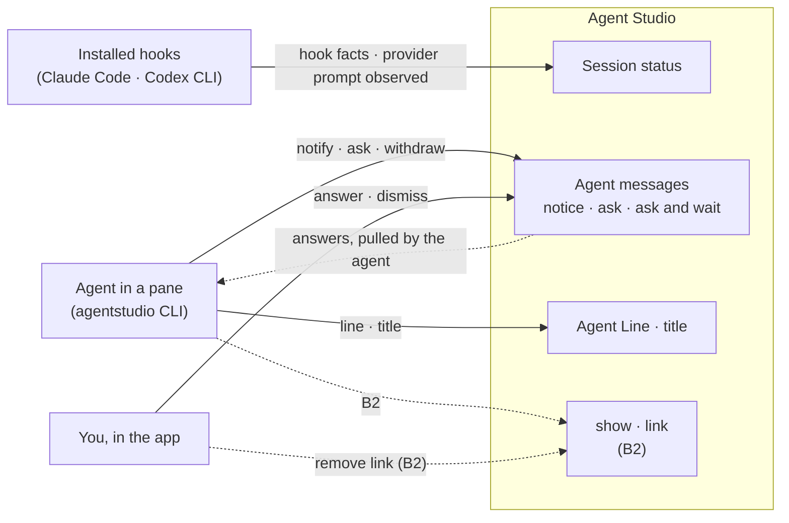

# Enable pane agents: what must be true

Date: 2026-10-06. **Revision 20** (owner): a SessionStart takes over the pane's main. **Revision 19** (owner, 2026-10-05 evening): R5 is the pane's main-session rule, with no cross-pane effects and the agent's command exit ending the session. **Revision 18** (Lead, design review round 2, 2026-10-05): R7a replaces source-time order with a turn guard (a late hook from a finished turn changes no status); R5 says when a session moves or comes back; R6 states when a refusal can't be read. **Revision 17** (owner, 2026-10-05): R6 drops the provider-version qualification and makes refusals readable; R7a limits replay to messages and states source-time order for hook facts (reconciling PD rev 32). **Revision 16** (owner, 2026-10-04: F2 = A): `session.query` reports the one status (R1) plus its source health. The old four-state value, its explanation and the retired message list are gone. **Revision 15** (Lead, 2026-10-04): a naming reconcile with the Program Design; behavior is unchanged. Clearing the Agent Line and resetting the title are `pane.line.set` and `pane.title.set` with no value, so there are no separate `pane.line.clear` / `pane.title.reset` methods. The CLI's `line --clear` and `title --reset` stay. **Revision 14** (owner, 2026-10-02): new R33 makes the CLI discoverable to agents through `help` and `--help`. R31 drops rev 13's catalog digest: the CLI ships inside the app bundle, so it's always the same build as the app. Discovery keeps no client re-check and has a 500 ms budget. The digest, cache and filter wait for the Studio service design. **Revision 13** (owner, 2026-10-02): R6 makes hooks silent to the agent and the person, and R31 identifies discovery by a catalog digest with a name filter (superseded by rev 14). **Revision 12** (owner, 2026-10-02): link removal ships without agent notification for now. R19 is deferred, not dropped, and R14's change feed carries no link removals. **Revision 11** (owner, 2026-09-30): R3a gains its one exception, the AskUserQuestion permission attributed by identical questions. **Revision 10** (owner, 2026-09-30): R32's counting rule is confirmed. **Revision 9** (advisor A6 check): R32 states that unknown checks don't hide a known review failure, and that the revision bumps when the summary or a member row changes, not on every Forge fact (reconciled with R4). **Revision 8** (closeout A6): S14 pull-request summary and R32 (Bridge navigation R19's rule, now derived here; counting pending owner confirmation). **Revision 7** (round 5: epoch claim added to the surface). **Revision 6** (round-4 review: legacy replay exception stated, ambiguous completions don't resolve prompts). **Revision 5** (round-3 review: a provider prompt resolves
only on its own completion or a turn boundary; importance and ask reason are
explicit; owner's simplified show). Revision 4 separated provider prompts from
messages and answered from received. This is the
Specification for PR B. It turns
[Requirements revision 3](2026-09-26-requirements.md) (needs N1–N15) into
rules you can check. Revision 2 was built around separate notifications,
approvals, questions and open requests. This one is built around the
owner's four jobs and one message system. The meaning of pane terms is shared
with the Panes Stage 1 specification (pane-fixes branch), and Panes merges its
E7/E11/E12/E13 into the AgentMessage defined here. Program Design comes next.

**Scope by owner decision (2026-09-26, option B):** PR B merges before
Bridge's #367. Opening files and linking work are specified here as contracts,
but their IPC methods and CLI verbs register in the follow-up **PR B2**, once
#367 slice 2.3 lands. Rules that only apply in B2 are marked **(B2)**.

## The surface from the outside

## The things these rules talk about

| Id | Thing | Two are the same when | Always true | States |
| --- | --- | --- | --- | --- |
| S1 | Agent session | same provider and session reference | bound to one pane by the first hook that carries its session reference; a drawer session also knows its owner pane | active, ended; a later session in the pane replaces the earlier |
| S2 | Session status | one per S1 | derived from hook facts, S1's open S13, and S1's own open asks, never from a notice or a payload claim | needsYou(approval \| question \| blocked), failed(summary), working(active \| monitoring), idle(done \| ready \| interrupted \| ended), unknown |
| S3 | Agent message | same pane and same message identity | the app stamps the sender (the session, or the pane when the caller has no session) and the time; carries an importance: info, attention, done or failure; a repeat delivery with the same identity is the same message | see S4 and S5 |
| S4 | Notice (a message shape) | as S3 | never changes S2; never waits | unread → read \| dismissed \| withdrawn |
| S5 | Ask (a message shape) | as S3 | an agent wrote it through `agentstudio`, from a bound session; it declares its reason (approval, question or blocked); form is choice, free text or elicitation schema; waiting is non-blocking or blocking until a deadline | open → answered(by, value, receipt) \| handedBack \| dismissed \| expired \| withdrawn \| stale. receipt is notYetConfirmed → confirmed, or unconfirmed once the session ends first |
| S6 | Message action | same message and same action | open file:line (B2), open PR, go to pane | its outcome is its owner's outcome |
| S7 | Answer position | same session and same pane | the last position of answers and changes that session has processed | only moves forward, and only to a position the session reports |
| S8 | Agent Line | one per pane | the Panes E6 schema | absent, current, stale |
| S9 | Agent title | one per pane | a layer above the pane's own name (terminal title or default) | absent, set |
| S10 | Write number | same writer (session) and same stream (line or title) | supplied by the CLI from its own store; only goes up | the last accepted number per writer and stream |
| S11 | Link (B2) | Bridge's receiver item and contributor | lives in Bridge's membership; PR B only stamps the contributor | Bridge's states |
| S12 | CLI store | one per app data root | owned by `agentstudio`; holds write numbers, answer positions and the notice outbox | — |
| S13 | Provider prompt | same session and same provider prompt occurrence | a hook saw the provider ask the person something in its own terminal (a permission request, an AskUserQuestion, an MCP elicitation); it is observed, never answered in the app, and the hook never waits for it | open → resolved (its own completion, or a turn boundary) \| ended (the session ended or was replaced) |
| S14 | Pull-request summary | one per pane with two or more linked worktrees | derived by the app from Forge's facts about those worktrees' pull requests; never stored; it doesn't exist for a single-worktree pane (that pane keeps its existing PR control) | needsAttention(count) \| running \| allGood \| noInfo |

## One surface, organized by domain object

IPC has no outside clients, so this replaces IPC v2's `session.message` and
`session.report` outright. `session.event` (hook facts) and `session.query`
stay. `session.query` reports the session's one status (R1) and its source
health. It no longer returns the retired message list or the old four-state
value (rev 16).

| Object | IPC method | CLI verb |
| --- | --- | --- |
| Message | `pane.message.send` (notice, or non-blocking ask) | `agentstudio notify [--kind …] "<text>" [--open file:line]`, `agentstudio ask "<question>" [--choice a,b]` |
| Blocking ask | `pane.message.ask` (waits for the answer) | `agentstudio ask --wait [--timeout …]` (permission hooks call it from PR C) |
| Withdraw | `pane.message.withdraw` | `agentstudio withdraw <id>` |
| Answers and changes | `pane.message.changes` (after position N) | `agentstudio answers` (the CLI keeps N) |
| Agent Line | `pane.line.set` (no value clears it) | `agentstudio line "
" --working [--step 3/7]` … `--clear` |
| Title | `pane.title.set` (no value resets it) | `agentstudio title "<text>"`, `--reset` |
| Read | `pane.context.get` | `agentstudio pane` |
| Write order | `pane.writer.claimEpoch` | none; `line` and `title` call it themselves when their store has no epoch |
| Hook facts, including provider prompts (S13) | `session.event` (existing) | installed hooks only |
| Open file (B2) | `pane.file.show` | `agentstudio show <file>[:line] [--take-over]` |
| Link (B2) | `pane.link.add`, `pane.link.remove` | `agentstudio link …`, `unlink …` |

Person actions (answer, dismiss, mark read, remove link) are app actions,
never agent IPC methods.

## Rules

### Status from hooks (N1, N2, N3)

| Rule | What must be true | Needs |
| --- | --- | --- |
| R1 | Each S1 has exactly one S2 value, by the precedence NEEDS YOU > FAILED > WORKING > IDLE > UNKNOWN. | N1 |
| R2 | S1's own open asks and open provider prompts (S13) always put it in NEEDS YOU, whatever other hook facts arrive. The reason comes from what is open: approval (a permission prompt, or an ask declaring approval), question (an AskUserQuestion, an elicitation, or an ask declaring question), blocked (an ask declaring blocked); an ask's reason is what it declares, never inferred from its text; with several open, approval > question > blocked. A non-blocking ask stays open across turns until it's answered, dismissed or withdrawn. | N1 |
| R3 | Hook facts decide WORKING, IDLE and FAILED. The agent's own Agent Line declaration is shown as detail and never overrides a hook fact. A notice never changes S2. A drawer session's asks never change its owner pane's session status. | N1 |
| R3a | A provider prompt (S13) opens when its hook reports it, and the hook returns at once without waiting. It resolves only on evidence that it is no longer waiting: its own completion (the correlated tool call's completion or failure; for an elicitation, its result), or a turn boundary of that session (the turn stops or fails, or the person submits a new prompt). Another tool starting or finishing, including one running in parallel, never resolves it. A completion resolves a prompt only when it is known to belong to that prompt's own call. When that can't be established (for example, identical calls with the same tool and input), the completion resolves nothing, and the prompt waits for a turn boundary. **One exception (owner, 2026-09-30):** a Claude Code permission request for AskUserQuestion carries no call id, and it's attributed to the one open AskUserQuestion prompt of the same turn with identical questions, so answering clears NEEDS YOU at once. If two identical questions in one turn both lose a hook delivery, the second may clear early; that cost is accepted. It ends when the session ends or is replaced. When the provider reports nothing after the person answers in the terminal (an interrupt, for example), the prompt stays open until the session's next fact, and the status carries when the prompt was observed so the panel can show its age. The app never offers a way to answer it; the person answers in the provider's terminal. | N1, N3, N5 |
| R4 | The status is derived off the main thread, and only a changed value is published. | N1, N14 |
| R5 | The first hook carrying a session reference binds S1 to its pane (a session-start hook isn't required), with provider, session reference, pane, owner pane (for a drawer), start time and how to resume it. That session is the pane's **main session** (owner). While it's live, a different session's hooks from the same pane never change the pane's status, except a **SessionStart**, which takes over: the old main ends and the new session becomes main (owner, 2026-10-06). When it ends (SessionEnd, or the agent's command exiting in the pane), the next session that starts in the pane becomes main; an ended session comes back only by starting again (SessionStart, e.g. a resume), and a late hook for it is recorded but changes no status. Panes never affect each other: the same conversation resumed in another pane gets its own binding there and leaves the first pane alone. An app restart never ends a session that is still running. Records keep the session that wrote them. | N2 |
| R6 | The installed Claude Code and Codex CLI hooks send every event R1–R3 need. Each hook returns without stalling the agent: every hook call, including connecting and authenticating, finishes within a small stated bound, and on timeout the hook gives up, grants nothing, and lets the agent continue. In PR B no hook waits for the person (R13). Only events the provider actually documents and emits are relied on; where a provider is silent, the status keeps its last hook-derived value, or unknown. The provider's reported version is recorded, never used to accept or refuse an event (owner, 2026-10-05). **A hook is silent to the agent and the person (owner, 2026-10-02):** it writes nothing to standard output (a provider may feed it to the model), nothing to standard error in normal operation, and always exits 0. It causes no message, prompt or notification in the provider, and it does nothing outside an Agent Studio pane. A hook that can't be recorded leaves its reason on its pane: `session.query` returns the pane's last refusal (reason, event name, time). When the app can't be reached, or the hook's time is already spent, the reason can't reach the app and isn't readable there; the hook still exits 0 silently. | N3 |

### Messages (N4–N7)

| Rule | What must be true | Needs |
| --- | --- | --- |
| R7 | `pane.message.send` records one notice or non-blocking ask, stamped with sender and time. A repeat with the same message identity changes nothing and returns the existing message. | N4 |
| R7a | A re-delivery of the same message identity (a notice or ask, including from the CLI outbox) with the same content replays: it changes nothing and returns the recorded result, whenever it arrives. The same identity with different content is refused as a conflict. Hook events have no re-delivery path, so they aren't replay-checked (owner, 2026-10-05). Hook facts apply in arrival order. A late hook fact from a turn that already finished (stopped or failed) is recorded but changes no status: it can't reopen working, raise NEEDS YOU, or replace a newer turn's state. Only the most recent finished turn is remembered, and a fact without a turn id applies in arrival order. | N3, N4, N13 |
| R8 | `pane.message.ask` records a blocking ask and waits for its outcome: answered(value), handedBack, expired or withdrawn. When nobody answers before its deadline, it returns expired, and the caller falls back to its own prompt or judgment (owner decision). The wait ends before the caller's own time limit. Calling it again with the identity of an ask that already settled returns that settled outcome (including the answer), and never opens a second ask. | N4, N5 |
| R9 | Only the person answers or dismisses an ask, through app actions. An agent can never answer or dismiss its own or another's ask. There's no IPC method for it. Each ask resolves exactly once. A late or second answer applies nothing and returns why (alreadyAnswered, expired, withdrawn, stale). | N5 |
| R10 | Dismissing a blocking ask returns handedBack to the waiting caller, which hands the decision to its own terminal prompt (owner decision). Dismissing a non-blocking ask records it as dismissed. | N5 |
| R11 | Each ask settles exactly once, by whichever comes first: the person's answer or dismissal, its deadline, its sender's withdrawal, or (blocking only) its waiting caller disconnecting, which makes it withdrawn. Once settled, nothing else changes it: an answer that settled first stays answered even if the caller disconnects before the reply reaches it. After an app restart, a blocking ask that was still waiting becomes stale; an app shutting down is a restart, not the caller withdrawing. | N5, N14 |
| R11a | An answered ask keeps "you answered" apart from "the agent received it". Its receipt is confirmed only when the asking session reports, through `pane.message.changes`, a position at or past that answer. A reply written to the socket is not receipt. Until then the receipt is notYetConfirmed; if the session ends first, it stays unconfirmed. The app shows which. | N5, N6 |
| R12 | `pane.message.withdraw` lets the sender withdraw its own notice while unread, or its own ask while open. It never touches another sender's message or the person's read state. | N7 |
| R13 | In PR B the installed permission hooks run in **report-only mode**: a permission request is a provider prompt (S13) under R3a, reported as a hook fact. It never creates an agent message, is never answerable in the app, and the hook doesn't wait. This holds in PR C too: the person answers a provider's permission prompt in the agent's own terminal (owner's standing async direction; the blocking path built for PR C was removed). | N5, N3 |
| R14 | `pane.message.changes` returns, for the calling session, the answers to its asks and the person's changes to its things (messages dismissed) after the position it sends. Link removals are not in the feed (R19, deferred). It moves the session's S7 to that position, never beyond it, and confirms receipt (R11a) for answers at or before it. A lost reply is read again from the same position. Reading never marks anything read for the person. Answers to blocking asks appear here too, so a CLI that received one by waiting confirms it on its next read. | N6 |
| R15 | Reading through IPC never changes read state. Only the person's app actions mark read or dismiss. | N4 |

### Agents act in the app (N8, N9), all B2

| Rule | What must be true | Needs |
| --- | --- | --- |
| R16 | `pane.file.show` opens the file at the line in the pane's Open files through Bridge's `show`, in the background by default: nothing on screen or in focus changes, and it works with no Bridge page mounted. The pane gets one informational notice with an open-file action. The reply is opened, notFound or paneUnavailable. | N8 |
| R17 | `pane.file.show` with take-over records a blocking ask (reason approval, choices allow and deny) from the caller's session before anything changes on screen. Allow: Bridge takes the normal human open path, and the reply is shown. Deny, dismissal, expiry or withdrawal: the file is opened in the background as in R16, and the reply is declined. The app never escalates to take-over on its own. After a restart the ask is stale and the file stays a background open. | N8, N14 |
| R18 | `pane.link.add` and `pane.link.remove` use Bridge's membership (outcome unions v3). The contributor is stamped from the caller's authenticated pane and its bound S1. A caller with no bound session is refused with bindingRequired. An agent removes only its own contribution. | N9 |
| R19 | **Deferred (owner, 2026-10-02), not dropped.** A person's removal of an agent-contributed link is not reported to the agent. The agent sees the link only as absent from its pane's current links (R25). Re-adding it is a normal add (R18), and the person tells the agent directly if a link should stay gone. Bridge stays the only writer of membership. No removal facts, replay or event store are consumed or built for this. | N9 |
| R20 | A drawer session's show and link target its owner pane's Bridge and record the drawer as source; a take-over ask from a drawer session appears on the drawer. A drawer move before the effect returns stale and is never redirected. | N8, N9, N13 |

### Agents drive the display (N10, N12)

| Rule | What must be true | Needs |
| --- | --- | --- |
| R21 | `pane.line.set` replaces the pane's Agent Line, or removes it when sent with no value (Panes E6 schema). `pane.title.set` sets the agent title layer, or clears it when sent with no value. The pane shows the agent title when set, otherwise its own name. | N10 |
| R22 | Line and title writes carry the CLI's write number from its store. The app accepts a write only if its number is greater than the last accepted number for that writer and stream, and keeps that number across clear and restart. A write number is an app-issued epoch plus the CLI's counter; claiming an epoch never applies a value. A lower or equal number, or an epoch that is no longer current, returns stale, with the last accepted number. The CLI raises its counter past that value for its next write, and never resends the refused write under a new number, so an older intent can't overwrite a newer one. | N10 |
| R23 | The Agent Line becomes stale when its lifetime passes or its session ends, and stays visible while stale. | N10 |
| R24 | The bundled `agentstudio` skill and the hook setup ship with these methods. They teach agents to: keep the Agent Line and title current; send messages rather than only print; ask in Agent Studio for important decisions; withdraw resolved messages; and link their work. Until B2 they never mention show or link. | N12 |

### Reading, rights, speed and lifetime (N11, N13, N14, N15)

| Rule | What must be true | Needs |
| --- | --- | --- |
| R25 | `pane.context.get` returns the caller's pane: title, Agent Line, open asks first, then unread notices, links with their PR summary (unknown until B2), and its bound session. An owner pane's read includes its drawers' messages, labeled by source. It's a plain read of current state, with no one-instant promise and no subscription. | N11 |
| R26 | A caller reads and writes only its own pane's records. A drawer session's show and link are its own Bridge operations on its owner's receiver, not writes to the owner's messages (B2). A rejected call changes nothing and returns a stable reason: notOwnPane, bindingRequired, invalidField, tooLarge, stale, unavailable, notFound, conflict, alreadyAnswered, expired, withdrawn. | N13 |
| R27 | When the app is unreachable, only notices are queued: in the CLI store's outbox, which the app drains after it starts, admitting each through `pane.message.send` with its original identity. Everything else returns unavailable. The NDJSON spool is removed. | N13 |
| R28 | Every method has a stated size limit, and oversized input returns tooLarge. | N13 |
| R29 | Records survive restart while the pane exists, follow close and Undo, and are deleted about a day after the pane is permanently gone. | N14 |
| R30 | None of this runs on app startup, the first window, or terminal creation and reattach. The main thread only receives computed values to show. | N14 |
| R31 | A CLI call does no command-catalog loading or catalog validation. The app validates every request and returns a typed result or refusal with correction data. Only discovery commands read the catalog. The CLI ships inside the app bundle, and an agent calls its own app's copy, so the CLI and the app are always the same build (owner, 2026-10-02). The CLI doesn't re-check the catalog the app sends, and explicit discovery returns within 500 ms. A warm-app call returns within the budget stated in the proof. The CLI prints the result or refusal reason for a person running it by hand. Every CLI call has one end-to-end time limit covering connecting, signing in, sending and the reply (for `ask --wait`, its own stated limit). On timeout it stops, and says whether the request was never sent or was sent with its outcome unknown; it never queues a request whose outcome is unknown. | N15, N3 |
| R32 | When a pane has two or more linked worktrees, the app shows one pull-request summary (S14) for them, derived off the main thread from Forge's facts and part of `pane.context.get` and the pane's detail. The count is the number of members whose pull request needs attention (checks failing or changes requested). The state is needsAttention(count) when the count is above 0, otherwise running when any member's checks are running, otherwise allGood when at least one member has a pull request with passing checks, otherwise noInfo. A member with no pull request, or whose facts haven't been fetched, is listed as "no PR" or "unknown" and never counts as good or bad. A pull request whose checks are unknown gives no check evidence (it isn't failing, running or passing), but its review still counts: changes requested makes that member need attention. When a member's facts change, the summary is derived again, and the pane's context revision bumps when the summary or any member row changes (R4: publish on change); a fact the summary doesn't show, such as mergeability or draft state, doesn't bump it. This is Bridge navigation R19 (formerly B3), whose derivation Bridge's design moved here; Forge owns the facts and keeps them current while a summary is visible, and PR C owns the one shared chip. *(Counting rule confirmed by the owner, 2026-09-30: changes requested counts as attention; review required doesn't; N counts worktrees; attention beats running.)* | N11 |
| R33 | **An agent in a pane can learn what it may call, and how, from the CLI alone (owner, 2026-10-02: "more important than capabilities").** `agentstudio help` lists every method with its one-line purpose and what an agent in a pane may do with it (its own pane, read-only, or not yet allowed). The list comes from the CLI itself and needs no app connection. `agentstudio <method> --help` prints that method's arguments and one example call. When a method is refused as unknown, the refusal points to `agentstudio help` and names the closest matches. It never points to the full `system.capabilities` dump. The skill shipped to agents tells them that `help` and `--help` exist and that they are the way in. | N15 |

## When things go wrong

| Situation | What callers and you see | Rules |
| --- | --- | --- |
| An agent writes another pane | notOwnPane, nothing changes | R26 |
| The same notice delivered twice | one notice | R7 |
| You dismiss a blocking ask | the agent's own prompt appears (handedBack) | R10 |
| Nobody answers `ask --wait` | expired, and the agent decides | R8 |
| The hook or agent dies while waiting | withdrawn, and you can't answer it | R11 |
| You answer, then the agent's connection drops before the reply arrives | answered, receipt not yet confirmed; the agent's retry or next `answers` read returns the answer | R8, R11, R11a |
| A permission prompt in Claude's terminal, answered there | NEEDS YOU (approval) while open, cleared by the tool's next fact; nothing to answer in the app | R3a, R13 |
| The app restarts while an ask waits | stale | R11 |
| A late, older Agent Line write | stale, the newer one stays | R22 |
| The app is closed | notices queue in the CLI outbox; everything else is unavailable | R27 |
| A reply to `answers` is lost | the same answers come back on the next read | R14 |
| The app accepts the connection but stalls | the call times out: not sent, or sent with outcome unknown; a hook lets the agent continue | R6, R31 |
| show or link before B2 | not registered (unknown method) | scope |

## Security and privacy

- **Assets:** answers, the permission decisions, pane records.
- **Prohibited outcomes:**
  - an agent answering any ask;
  - a timeout or dismissal turning into a grant;
  - a message written to another pane;
  - an answer applied to a different ask or session.
- **Telemetry:** message text, questions, answers and reasons never enter
  telemetry or logs. The CLI store's event log (if any) records method and
  outcome only.

## How each rule will be proven

| Rules | Evidence |
| --- | --- |
| R1–R4, R3a | Reducer unit tests over hook-fact, provider-prompt and ask sequences; the precedence table and reason order; a drawer ask not affecting the owner; a prompt resolved by the tool's completion, left open by a silent interrupt, ended by session end |
| R5, R6 | Integration: first-hook binding (including a non-start first hook), replacement, a late fact from a replaced session, a child session ignored while the main is live, the same conversation resumed in another pane leaving the first unchanged, the agent's command exit ending the session, an app restart with a still-running session; a refused hook's reason is readable through `session.query`, and an unreachable app leaves the hook silent. Real-agent run: Claude and Codex on their installed versions, two turns, an app restart, a third turn. |
| R7–R15, R7a | Integration through the real socket: message replay after restart and on changed content (messages only; hooks aren't replayed); a late hook from a finished turn changes no status, live and after restart; blocking ask answered, handed back, expired, withdrawn on disconnect, stale after restart; answer-then-disconnect stays answered and a retry returns it; receipt confirmed only by a later position; no agent answer path; the position read survives a lost reply; a report-only permission hook returns at once |
| R16–R20 | B2: integration against Bridge's real ports, including a background show with no page mounted, a take-over allowed, denied and expired, and a removal made in Bridge's own UI showing as absent from the pane's links; Bridge's regenerated show fixtures; a drawer move before the effect |
| R21–R24 | Integration: title layer over the terminal title; write-number order across restart and CLI-store loss; the skill's content check |
| R25–R28 | Integration: owner read with drawer messages; rights refusals; outbox drain after the app starts; size limits |
| R29, R30 | Restart and retirement integration; startup-path proof (IPC v2 R-25) |
| R31 | Measured warm-call latency against the budget, and explicit discovery within 500 ms; a trace showing no catalog fetch on a normal call |
| R33 | Process-level tests with a pane token: `help` lists every method with its summary and what an agent in a pane may do with it, with no app connection; `<method> --help` prints its arguments and one example; an unknown method's refusal names `agentstudio help` and the closest matches, never `system.capabilities`. The shipped skill text names `help` and `--help` |
| R6 (silence) | Process-level test of every installed hook verb: empty standard output, empty standard error and exit 0 when the app is up, down, slow or refusing, and outside a pane |
| R32 | Unit, as a table over the rule: every combination of members' states (failing, changes requested, running, passing, no PR, unknown), including mixed axes (unknown checks with changes requested counts; unknown checks with approval is not good), gives the stated summary and count. Integration: a Forge fact change that changes one member's row bumps the pane's context revision, even when the summary state is unchanged; a fact change the summary doesn't show (mergeability, draft) doesn't bump it; a single-worktree pane has no summary |
