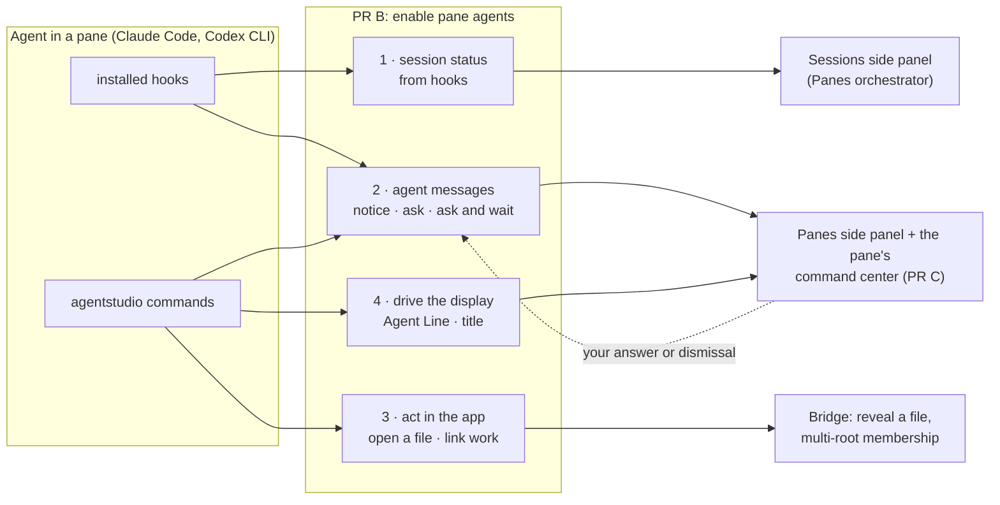

# Enable pane agents: what PR B needs and why

Date: 2026-09-26, N8 amended 2026-09-27 (owner's simplified show). **Revision 3.** The owner reframed PR B the same day:
*"really your job is to enable pane agents, and all the Bridge file opening
and hooks, and help build the Sessions side panel to complement the Panes side
panel."* This revision replaces the earlier needs list, which was organized
around IPC plumbing. The Panes orchestrator (Claude 1c8b74a0) agreed to the
shape on 2026-09-26. It owns the meaning of the pane entities and both side
panels. Items marked **owner-pending** have a proposed default and are waiting
on the owner.

## What PR B is for

Agents running in Agent Studio panes should be able to use Agent Studio as
their display and their way to reach you, instead of only their own terminal
UI. PR B gives them that through the `agentstudio` command and the installed
hooks. Panes PR C and the Sessions side panel show the result.



## Who needs this

| Who | What they need |
| --- | --- |
| You | See what every agent is doing and which ones need you. Answer an agent from Agent Studio when it asks there. Get its PRs, links and messages in one place per pane. |
| Agent in a pane | One `agentstudio` command to report its work, message you, ask you something (waiting or not), open a file for you, and link the work it touches. A bundled skill tells it when and how. |
| Installed hooks (Claude Code, Codex CLI) | Turn the harness's own events into session status and messages, fast enough never to stall the agent |
| Panes side panel and command center (PR C) | Each pane's title, Agent Line, messages, links and PR status, read in the app |
| Sessions side panel (Panes orchestrator) | One status per agent session, its identity and its counts |

## The four jobs

### 1 · Hooks drive session status

```text
Claude Code / Codex hook ──agentstudio──► Sessions ──► one status per session
   turn start, tool activity  → WORKING (active)
   turn done                  → IDLE (done → ready once seen)
   turn aborted, error        → FAILED (summary) or IDLE (interrupted)
   session end                → IDLE (ended)
   an open ask to you         → NEEDS YOU (approval · question · blocked)
   nothing heard              → UNKNOWN
```

### 2 · One message system: notices, questions and approvals

```text
AgentMessage (one entity)
  shape: notice                       → no answer: unread → read | dismissed | withdrawn
         ask(form, waiting)           → open → answered | handed back | expired | withdrawn | stale
            form:    choice | free text | elicitation schema
            waiting: non-blocking | blocking until a deadline (provider hook, or `agentstudio ask --wait`)
  actions: open file:line · open PR · go to pane
  importance: info · attention · done · failure

  "tests failing" + [open file]   notice
  "pg or sqlite?"                 ask(choice, non-blocking), answer pulled later
  "OK to force-push?"             ask(choice, blocking)
  Claude's permission prompt      ask(allow/deny/ask, blocking via its hook)
```

### 3 · Agents act in the app

`agentstudio show <file>[:line]` opens it in the pane's Bridge through
Bridge's own reveal, showing who asked and why. `agentstudio link` and
`unlink` add and remove the worktrees and PRs the agent works on, through
Bridge's membership. Both land with Bridge PR2's fixes.

### 4 · Agents drive the display

`agentstudio line` and `agentstudio title` set what the pane shows. The
bundled `agentstudio` skill teaches agents to keep them current, to send
messages instead of only printing to the terminal, and to withdraw a message
that's resolved.

## The needs

| # | Need | Why it matters | Priority |
| --- | --- | --- | --- |
| N1 | Each agent session has exactly one status from the status tree (Panes register K): NEEDS YOU (approval, question, blocked) > FAILED > WORKING (active, monitoring) > IDLE (done, ready, interrupted, ended) > UNKNOWN. It's derived off the main thread from Claude Code and Codex hook facts plus the session's own open asks. An open ask always wins NEEDS YOU, even while working hooks arrive, and a non-blocking ask stays open across turns until you answer, dismiss or it's withdrawn. Hook facts win over the agent's own Agent Line declaration, which stays as detail. A notice never changes status, and a drawer session's ask never makes its owner pane's session NEEDS YOU. | You see at a glance which agents need you, and the Sessions panel has one truthful value per session. | Must |
| N2 | Each session records its identity once its session-start hook binds it: session reference, provider, pane (and the owner pane for a drawer), started and ended times, and how to resume it. A later session replaces an earlier one in the pane, and old records keep their author. | The Sessions panel can list sessions, and Stage 2 can resume the right one after a restart. | Must |
| N3 | The installed hooks for Claude Code and Codex CLI cover every event the status tree needs, and deliver through `agentstudio` without stalling the agent (a permission hook's bounded wait for your answer is the one intended wait). Each combination is qualified against the installed version before it counts as supported. | Status comes from the harness itself, not from guessing. | Must |
| N4 | An agent or hook can send its pane an AgentMessage: a notice, or an ask that is non-blocking or blocking until a deadline. The form is a choice, free text or an elicitation schema, with optional actions (open file:line, open PR, go to pane) and an importance. The app stamps who sent it and when. A repeat delivery of the same message creates one message. | Agents reach you in Agent Studio instead of only their terminal. | Must |
| N5 | Only you answer or dismiss an ask; an agent can never answer its own. Each ask resolves exactly once. A late or second answer applies nothing and says why. Dismissing a non-blocking ask records it as dismissed. Dismissing a blocking ask hands the decision back to the agent's own terminal prompt (owner decision). A permission ask's timeout, withdrawal or hand-back never grants permission. When the waiting hook or `agentstudio ask --wait` dies, the ask shows as withdrawn and its waiter settles without an answer. At the deadline with no answer, `ask --wait` returns "no answer" and the agent decides (owner decision). The record keeps "you answered" apart from "the agent received it". | You can answer from one place, safely, and never answer into nothing. | Must |
| N6 | A non-blocking answer reaches the agent when it next checks: the agent reads "answers and changes since position N", and a lost reply is simply read again. | Agents stay in step with you without being interrupted, and nothing is lost. | Must |
| N7 | The sender may withdraw its own notice while unread, and its own ask while it's open. | "Tests failing" followed by "fixed" doesn't leave you two alerts. | Must |
| N8 | An agent can ask the pane's Bridge to show a file at a line (`agentstudio show`). **Background is the default** (owner decision 2026-09-27, relayed by Bridge on board seq 2516): the file opens in the pane's Open files at that line, nothing on screen or in focus changes, it works with no Bridge page mounted, and the pane gets an informational notice with an open-file action. **Taking over the screen** (bringing the pane forward, switching its displayed file, moving focus) happens only when the person tells the agent to, and each time it needs the person's approval, asked as a blocking ask in the one message system. Approved: the normal human open. Declined, dismissed or unanswered: the file stays a background open. The result is one of opened · shown · declined · notFound · paneUnavailable. A drawer agent's show targets its owner pane's Bridge and records the drawer as the source; a drawer move before the effect is reported as stale, never redirected. | You know why you're looking at something, and an agent never takes over your screen without your yes. | Must |
| N9 | An agent can link and unlink the worktrees and PRs it works on, through Bridge's membership (Bridge PR2). The app stamps the author from the caller's authenticated pane and its bound agent session: `agent(provider, session)`, you (`person`), or the app itself. A caller with no bound agent session is refused with a typed "binding required" result. An agent removes only its own contribution; you can remove any link. A drawer agent's links go to its owner pane. When you remove an agent's link, the agent learns it the next time it checks (N6). | Related work is one click away in the command center, and Bridge and Panes never disagree. | Must |
| N10 | An agent can set and clear its pane's Agent Line (the Panes E6 schema) and title. The title sits above the terminal's own title. A delayed older write never replaces a newer one: the `agentstudio` CLI numbers its writes in its own local SQLite store, and the app keeps the last accepted number per writer. | The pane shows what the agent says it's doing, never stale news. | Must |
| N11 | Each pane's command center has, in one read inside the app: title, Agent Line, messages (asks first), links with their PR status summary, and for an owner pane its drawers' messages labeled by drawer. An agent can read its own pane's current state through `agentstudio pane`. There's no one-instant promise and no change subscription over IPC. | PR C draws one place per pane, and an agent can check itself. | Must |
| N12 | The bundled `agentstudio` skill and the hook setup teach and enable agents to use all of this: keep the Agent Line and title current, message instead of only printing, ask in Agent Studio for important decisions, withdraw resolved messages, and link the work they touch. | Nothing here helps unless agents actually use it. | Must |
| N13 | An agent writes only its own pane's records. A drawer agent's links and file shows are its own Bridge operations targeting its owner pane's receiver; they never let it write the owner pane's messages. A rejected write changes nothing and says why. If the app is down, only notices are queued: in the CLI's own SQLite outbox, which the app drains later, replacing IPC v2's NDJSON spool. Payloads and reads have size limits. | Agents can't tamper with each other's panes, and nothing happens behind your back. | Must |
| N14 | Records survive app restart while the pane exists, follow close and Undo, and are purged about a day after the pane is permanently gone. A blocking ask never survives a restart as a live wait. None of this sits on the startup path or does work on the main thread beyond showing results. | Nothing is lost on relaunch, and the app stays fast. | Must |
| N15 | `agentstudio` calls are fast enough to run on every turn and every Agent Line update: well under a second on a warm app, measured and stated as a budget in the proof. The app builds and validates its full command catalog once per launch, off the main thread, as it does since #364. The CLI does no catalog loading or catalog validation for a call: it builds the request and the app validates it, returning a typed result or refusal with correction data. Only discovery commands fetch the catalog, and a command can ask the app to reload it on demand. Output is useful to a person running it by hand: it prints the result or refusal reason. | The owner's own test on 2026-09-26 found each call "very very slow". Slow calls make every agent slower, and hooks would stall turns. The app is already the single gate, so client-side catalog checks only duplicate it. | Must |

## Settled cuts and decisions (owner, 2026-09-26)

**Cut or deferred:**
- the one-revision read and the IPC change subscription (the UI reads inside the app);
- the Router/ACP approval route (the owner's Router agents are Codex CLI in panes);
- Cursor (Claude Code and Codex CLI first);
- artifacts;
- delegated approvers;
- control-credential grants;
- notification history over IPC.

**Kept and reshaped:**
- IPC v2's `session.message` and `session.report` are replaced by AgentMessage.
- Storage uses category tables (current values, requests, events), with plain
  TEXT enums parsed in Swift.
- The CLI keeps its own SQLite store: write numbers, answer position, and the
  notice outbox.

**Settled with Panes:** opening a file follows Bridge's one rule (N8), so a hidden reveal becomes an Open view notice.

**Owner decisions (2026-09-26, recorded in the Stage 1 delivery-order doc):**
- PR B is one PR, its own, not #364.
- The keyed session-status atom is approved.
- Dismissing a blocking ask = handed back.
- `ask --wait` with no answer = no answer, and the agent falls back.
- The Sessions side panel comes after PR C.
- Bridge's multi-root plumbing (reveal v4 and membership) is Bridge's, agreed directly between the Bridge and IPC agents.

## How revision 2's needs map here

| Revision 2 | Now |
| --- | --- |
| 1, 2 (Agent Line, title) | N10 |
| 3, 6, 14, 15, 16, 17 (notifications, approvals, questions, open requests) | N4, N5, N7, N8 (one AgentMessage) |
| 4, 5, 19 (links) | N9 |
| 7 (read) | N11 |
| 8, 10, 12 (rights, restart, startup) | N13, N14 |
| 9 (qualification) | N3 |
| 11 (CLI) | N10, N12, N13 |
| 13 (binding) | N2 |
| 21 (app actions) | N5 |
| 22 (change feed) | N6 |
| new | N1 (status), N12 (enable agents) |

## Where these needs come from

- **The owner's reframe of 2026-09-26** ("enable pane agents"; approvals are
  elicitation; notices and questions are one system with different
  parameters).
- **The Panes orchestrator's agreement:** the AgentMessage union and the
  Sessions panel's inputs (Router message, 2026-09-26). Also its register
  entries K (status tree) and J (restart resilience).
- **Bridge's program design** (membership v2, reveal and outcome unions v3).
- **The independent design review** (board 01a0df04) and the provider
  approvals research of 2026-09-26.
