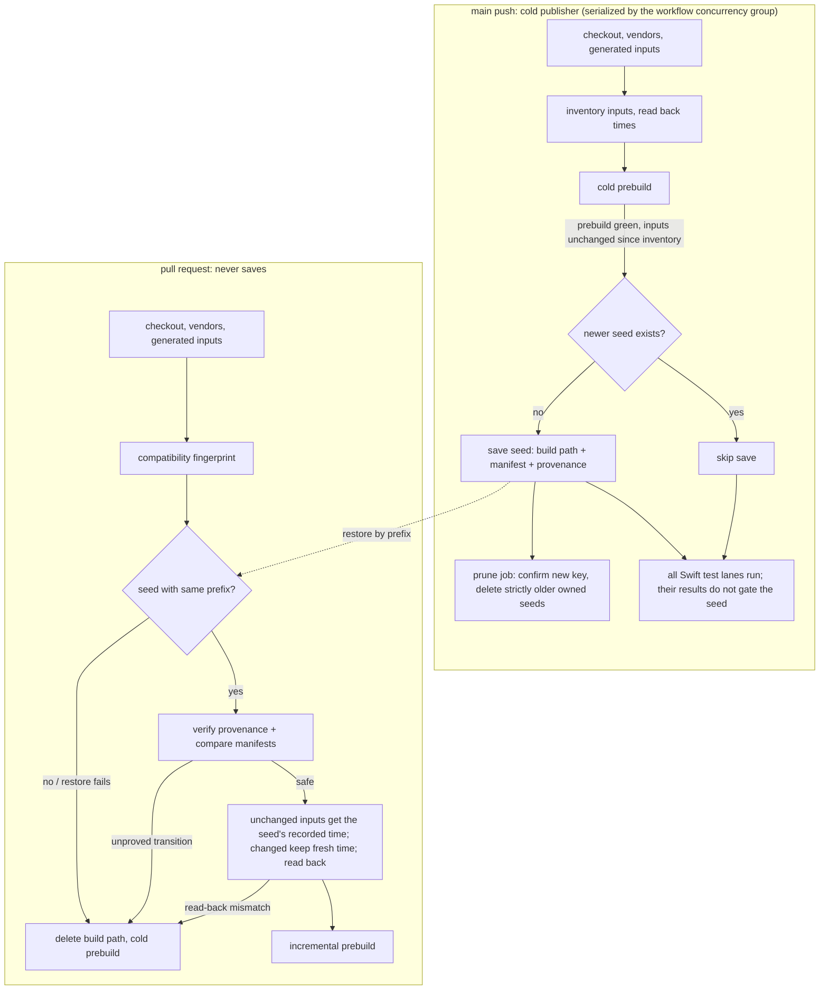

# CI Swift build cache — Program Design

Status: reviewed (advisor rounds 4–5 in tmp/ci-speed/, round-5 remediation applied) · 2026-09-27 · Owner decision: option B.

Artifacts: [Requirements](2026-09-27-ci-swift-build-cache-requirements.md) · [Specification](2026-09-27-ci-swift-build-cache.md) · [Program Design](2026-09-27-ci-swift-build-cache-program-design.md)

Realizes Specification O1–O7.

## Mental model

SwiftPM and the Swift driver skip an input whose modification time **equals** the recorded one ([FirstWaveComputer](https://github.com/swiftlang/swift-driver/blob/main/Sources/SwiftDriver/IncrementalCompilation/FirstWaveComputer.swift#L355)). A fresh checkout gives every file a new time, so a plain restore recompiles most things (measured 727 s). If an unchanged input gets back the exact time the seed recorded, SwiftPM reuses its outputs (measured 92 s against 1128 s cold, run 36338272699, same runner, unchanged inputs). The manifest, not the timestamp, is the correctness boundary.

## Components

| Component | Where | Owns |
|---|---|---|
| `scripts/ci-swift-build-inputs.sh` (`fingerprint`, `inventory`, `verify`, `restamp`) | Swift job | Input inventory, full-content digests, manifest comparison, applying and reading back times |
| Restore step (PR only) | Swift job, before prebuild | Fetching the newest seed for the prefix |
| Publish step (main only, after a successful prebuild, before the Swift test lanes) | Swift job | Skip-if-newer check (needs `actions: read`), save, save disposition output |
| `prune-swift-build-cache` job (main push only, ubuntu, `actions: write`) | separate job, needs the Swift job | The only deleter: consumes the save disposition and key, confirms, deletes strictly older owned entries |
| Prebuild and receipts (`swift-test-helpers.sh:511–527`) | unchanged | Building; receipts that name the tested commit |

Serialization: `ci.yml`'s existing group `${{ github.workflow }}-${{ github.event.pull_request.number || github.ref }}` never cancels main runs and allows one running main workflow at a time. Publication and pruning therefore never interleave across main runs. This dependency is explicit, and a contract test guards it.

## Inputs

Inventoried after every producer finishes (vendor restore or build, `copy-xcframework` including `normalize-ghostty-xcframework.py`, `setup-dev-resources`, `bridge-web-build`) and before SwiftPM:

| Class | Paths |
|---|---|
| Sources and manifests | tracked files under `Sources/`, `Tests/`, plus `Package.swift`, `Package.resolved` |
| Resource roots (every `.copy`/`.process` in `Package.swift`) | `Sources/AgentStudio/Resources/{Icons.xcassets, AppIcon.icns, AppLogoTransparent.svg, AppIcon.iconset, terminfo, ghostty, BridgeWeb}`, `Tests/AgentStudioIPCClientTests/Fixtures`, tracked and generated |
| Linked binaries | `Frameworks/GhosttyKit.xcframework` |

Each record: path, kind (file, directory, symlink), mode, full SHA-256 of the bytes (for a directory, a canonical digest of its sorted membership), the symlink target plus the resolved referent's record when the referent is inside the inventory, and the **read-back** modification time.

Never inventoried or touched: the build path, receipts, compiler stats, dependency checkouts inside the build path (fixed by `Package.resolved` in the fingerprint), and anything a symlink points to outside the admitted roots.

## Compatibility fingerprint (the cache key prefix)

`swift-build-v1-<os>-<arch>-<fp>-r<run_number>-<sha>`, where the restore prefix is `swift-build-v1-<os>-<arch>-<fp>-`.

`fp` hashes everything that decides *whether objects are compatible at all*:
- `swift --version`, the Xcode and SDK build numbers, the deployment target and configuration;
- `Package.swift` and `Package.resolved`;
- the vendor gitlinks and the final `GhosttyKit.xcframework` digest (a changed framework means cold);
- the effective prebuild command line and environment: build path, stats mode and path. The stats directory must exist, otherwise the flag set differs; see `swift-test-helpers.sh:1358–1379`;
- the digest of `scripts/ci-swift-build-inputs.sh` itself, so any change to the verifier means cold.

Ordinary source and resource content belongs to the manifest, not the fingerprint. Editing a source file keeps the prefix and changes the manifest.

## PR verification (O2, O3)

After restore, before any compilation:
1. Provenance: the seed's metadata names this prefix, a main producer commit and run, the scheme version and the manifest digest. The manifest is well-formed, with no duplicate or path-escaping records. Otherwise cold.
2. Compare the union of seed and current paths:
   - **Unchanged** (same kind, mode, digest, symlink target and referent): restore the seed's recorded time.
   - **Content changed, same kind** (a source or resource file): keep the fresh time, and check it differs from the seed's recorded time.
   - **Added source file**: keep the fresh time.
   - **Anything under a resource root added, deleted, renamed, or changing kind or mode**: cold. SwiftPM copy resources can keep stale files in the bundle.
   - **Deleted or renamed source file**: incremental only once acceptance case A4 proves it; until then, cold.
   - **Any other kind or mode transition, or a symlink leaving the admitted roots**: cold.
3. Apply the times, then read them back. If any read-back time differs from what was requested (precision or rounding), or a changed input equals its seed time, go cold.
4. Cold always means deleting the whole Swift build path first, including after a partial restore or a stamp failure.

## Main publication and pruning (O1, O4, O5)

- The main job inventories inputs before the cold build and verifies them again right after the prebuild, before any test lane starts. If anything changed, or the prebuild failed, it doesn't publish.
- Test results don't gate publication. A build cache is valid for its verified inputs whatever the tests say, and a red main must not stop the seed from following main. Gating on green used to leave PRs on a seed hours old, recompiling main's changes. Every Swift test lane still runs on main.
- The prune job runs with `always()`, so a later failing lane can't suppress it. It still acts only on a `saved` or `skipped-budget` disposition.
- Each PR run reports its restored seed commit, the merge tree it tested, and how many Swift inputs differ between them. A warm run that still rebuilt a lot therefore explains itself.
- Skip-if-newer: list owned main-ref entries (paginated, run numbers parsed as integers, across all compatibility families). Skip saving if any has a higher run number.
- Budget check before saving: current total + measured seed size must stay ≤ 8.5 GB, otherwise skip and report. Seeds are about 2 GB (2.05 GB measured with gzip; the real zstd size is recorded at the first publication). Today's usage is 4.33 GB.
- The save step outputs a disposition (`saved <key>`, `skipped-newer`, `skipped-budget`, `failed`). The prune job acts on `saved` and on `skipped-budget`. On `saved` it first confirms that exact key exists on `refs/heads/main`. In both cases it then deletes owned (`swift-build-v1-`, main-ref) entries with a strictly lower run number. On `skipped-budget` this frees space so the next main run can save. Until that run saves, there may be no seed, and PRs build cold, which is correct and only slower. It never touches PR, branch, experiment or other entries.
- Failures: a failed save deletes nothing. A failed prune keeps the confirmed new seed and reports what's left over. The next run's budget check sees those entries and skips saving until they're cleaned up.
- The namespace belongs to this workflow. Renaming or replacing the workflow means a new namespace version (`v2`).

## Acceptance proof (before relying on it)

**Trusted identity is an input.** `scripts/ci-swift-build-inputs.sh` and `scripts/ci-swift-build-cache-publish.sh` take the trusted producer ref (`CI_SWIFT_TRUSTED_PRODUCER_REF`, default `refs/heads/main`) and the key namespace (`CI_SWIFT_CACHE_NAMESPACE`, default `swift-build-v1-`). The verification and publication logic is identical in every mode; only which producer and namespace are trusted changes. Production `ci.yml` never sets either variable, and a topology contract test asserts that. The acceptance workflow sets them to its exact branch ref and `swift-build-exp-`, so its seeds carry true provenance. Tests prove that with the defaults, a seed from any other ref or namespace is rejected. This doesn't widen trust: whoever could set these could already edit the workflow.

An experiment workflow on a scratch branch with its own namespace (`swift-build-exp-`). A seed job builds cold and saves. Each scenario job runs on a **fresh runner** using the real restore path (normal vendor restores, full BridgeWeb regeneration, the same stats flags) and the **production verifier**, and is compared with a cold job whose build path is empty. Scenarios are committed revisions on the branch, and the evidence is labeled experimental.

| Case | Change | Required observation |
|---|---|---|
| A1 | None | Restored key and producer, count of compiled jobs, restore/verify/stamp/build times |
| A2 | Behavior change in a public declaration used from another module | The built test bundle shows the new behavior, warm and cold; no test reads source text |
| A3 | Added Swift file used by a test | Warm and cold pass |
| A4 | Deletion, and separately a rename, of a Swift declaration and file | Test inventory shows the removed test absent and the new one present; a consumer of the removed API fails to compile, warm and cold |
| A5 | Changed bytes in a generated BridgeWeb file and a tracked copied resource | The **built bundle** holds the new bytes |
| A6 | Deleted resource file (generated, and a tracked test fixture) | Seed discarded, build path emptied, the built bundle lacks the file |
| A7 | Real dependency revision change | Prefix miss, empty build path, cold build, new dependency behavior |
| A8 | Collision, precision loss, kind/mode/symlink change, partial restore with missing or invalid manifest, driven through the production verifier with fixtures | Seed discarded, or cold with the build path emptied |

Permanent behavior tests (fixture trees and a fake cache listing) for the verifier and publisher:
- each fingerprint input, varied alone, changes the fingerprint, while a source edit changes only the manifest;
- every transition row above;
- publication interleavings: older-run skip, numeric ordering, pagination and ref filtering, the save, skip and prune dispositions, prune failure, family rollover, and the budget skip.

`CITopologyWorkflowTests` asserts the workflow shape:
- PR jobs never save;
- restore runs only on PRs;
- publishing requires `push` to `main`;
- only the prune job holds `actions: write`, and the publisher holds `actions: read`;
- the concurrency group is unchanged.

After merge: the first publication's zstd size, the prune result, and the next PR's restore, verify, stamp and build times get reported to the owner.
