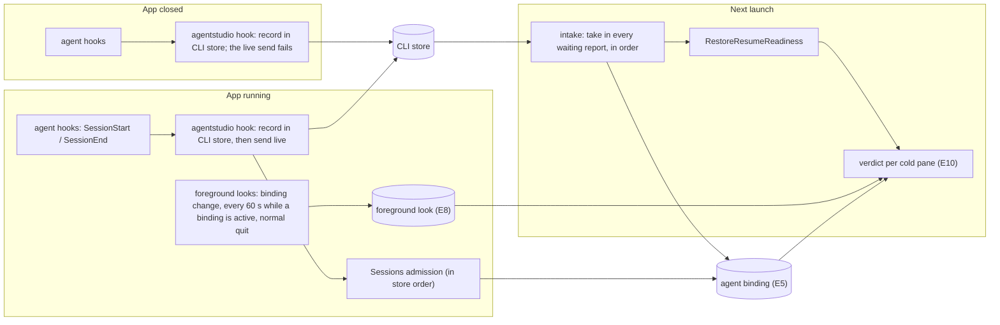

# Session restore after a reboot: how it is built

Date: 2026-09-30, revision 21 (owner, option A: warm and unverified reconnects carry the restore script as a fallback plan; the post-attach check is telemetry only). Revision 20 (owner: the CLI store has one writer). `cli_lifecycle_report` rows are immutable, the hook writes once, the app's settlement pass is gone, and cleanup deletes only rows at or below the mark the app returns at login. Unread rows are never deleted. Revision 19 (the N3 residual). The output trigger now comes from the projector's activity window, which opens and closes once per burst and repeats after every quiet. The compact output state has no repeating start edge. Every discarded window sends its close.

Revision 18 (R3 review round 3, N1–N3):
- an exit is a trigger for a fresh look, never a record by itself, so a zmx-killed agent keeps its positive look;
- the watch is checked against the sampled process after registration, only the current watch (`watchId`) counts, and a refused watch has a typed failure with a per-pane retry;
- output arms a look when it starts; a trigger during a running look is kept as a follow-up; sequences are taken at snapshot;
- silent transitions are an accepted residual.

Revision 17. The pull is **trigger-driven** instead of a fleet-wide 60 s poll, with typed evidence interfaces and an explicit no-main-actor table (owner, 2026-09-30). Revision 16 adds the agent **exit watch**, which pushes each agent's exit, with the 60 s look as the pull fallback (owner, 2026-09-30). Revision 15 gives unordered evidence a durable "awaiting cutoff" state and a conservative fence (the F3 residual). Revision 14 answers R3 review round 2:
- F3: unordered evidence recovers only from a report recorded after it;
- F6: typed lifecycle columns plus an `endReason` wire field; typed identity columns; no blobs;
- F7: the late-end limitation is stated honestly;
- F2: the stale window is in the Spec.

Revision 13 answers R3 review round 1 (F1–F7):
- a binding ended only by sweeps stays eligible, and looks track the latest binding;
- the intake reads a handled prefix and tolerates gaps;
- provenance is decided by S0;
- every cold pane waits for readiness;
- the envelope reuses the same qualification;
- a resumed start is a new occurrence (`report_id`).

Revision 12 writes R3 from the owner's 2026-09-29/30 settlements: lifecycle hooks are kept in the `agentstudio` CLI's own SQLite store while the app is closed, a final look runs at normal quit, and the flock handoff is gone. Revision 11 moves the startup handoff witness from the terminal leader's **environment** to its **arguments**: implementation found that macOS returns no environment to a third-party reader for any process (R1 S3 stop, confirmed below), while arguments stay readable. Revision 10 answered design review round 7: discovering the new session is event-driven, not a failure, and the startup observer's outcome is total, including `.unobservable`.

**Owner confirmed (2026-09-30):**
- SR12a: a stopped or background agent isn't resumed;
- SR12b: a session lost without a reboot resumes only with no reported end;
- the full RS7 evidence window;
- the SR13 late-end limitation;
- the push exit watch plus pull looks.

R1 and R2 don't depend on R3.

## What exists (checked)

| Area | Fact | Anchor |
| --- | --- | --- |
| Attach | `zmx attach <id> <shell> -i -l` is built by `ZmxBackend.buildAttachCommand` with no liveness check. | `Core/RuntimeEventSystem/Runtime/ZmxBackend.swift:194-217` |
| Startup command | `TerminalRestoreRuntime` is `@MainActor`, synchronous and has no lifecycle state. A restored pane whose attach preparation fails gets a `.failedToStart` placeholder. | `Features/Terminal/Restore/TerminalRestoreRuntime.swift:5-60`; `WorkspaceSurfaceCoordinator+ViewLifecycle.swift:394-453` |
| Mount | `WorkspacePreparedContentMountCoordinator.mount()` is async. It joins the terminal and nonterminal lanes for one generation, and panes without geometry wait. | `App/Coordination/WorkspacePreparedContentMountCoordinator.swift:137-206,393-404` |
| Activation | `TerminalActivationScheduler` is an actor. A fixed worker fleet admits panes, visible ones first. | `Features/Terminal/Restore/TerminalActivationScheduler.swift:5-9,383` |
| zmx inventory | In zmx 0.8.1, `list` gives `name`, `pid`, `clients`, `created=<epoch>`, `cwd`, and `cmd` (**frozen at attach**). A dead session shows `status=cleaning up` once, then is absent. `pid=` is zmx's pty wrapper process; the shell is its child. | lab 2026-09-29; `loop.zig:1093-1118` |
| Foreground program | The wrapper's `tpgid` names the tty's foreground group, and `ps` rows with `pgid == tpgid` are the foreground job. `args`' first token identifies the program; `comm` is cut at 16 characters. **Agent tools run detached** (`tty=??`, own group) and never take the foreground. | POC 2026-09-29 (Claude `Bash(sleep 30)`, Codex background terminal) |
| Session identity | Claude: `--session-id` or `--resume` with the UUID is visible in `args`; plain `claude` shows no id. Codex: never visible; the id is the UUID in `~/.codex/sessions/.../rollout-<ts>-<uuid>.jsonl`. Neither holds its transcript open (`lsof`). | POC 2026-09-29 |
| Daemon death | A SIGKILL of the daemon ends the whole tree. Labels live only in memory (`loop.zig:580`) and die with it. zmx persists nothing about a session. | lab 2026-09-29 |
| zmx pre-exec crash | zmx 0.8.1 sometimes dies in the forked child before exec (`mfm_free` → `main.main`, SIGTRAP). The pane is then left with only a cursor. The lab reproduced it twice. | `~/Library/Logs/DiagnosticReports/zmx-2026-09-29-0723*.ips`, `-0727*.ips` |
| Cold command | `/bin/sh -c '<script>'` after the name is `execvpe`'d directly (`daemonize.zig:15-27,74`). Inside it, `exec zsh -i -l -c '<resume argv>; exec zsh -i -l'` loads the person's rc files and PATH, runs the resume, and leaves an interactive shell when the agent exits. **The same conversation came back:** Claude's transcript grew in place (39 → 51 lines), and Codex showed its earlier marker. Folders containing spaces and quotes worked. | POC 2026-09-29 |
| History | `history --vt` is capped at **10,000 lines** (`cfg.zig:12`): 60k lines gave 0.92 MB in 0.13 s. A dead socket exits 1. A hung daemon exits **0 with empty stdout** (`main.zig:1473-1478`, source only). | lab 2026-09-29 |
| Process introspection | `KERN_PROCARGS2` returns a same-uid process's **arguments** but **no environment** to a third-party reader: `omit_env_vars` stays set unless the reader holds a private Apple entitlement (`kern_sysctl.c`, `sysctl_procargsx`). Reproduced: `ps -E` shows no environment for our own child on macOS 26.5 with SIP on, and a child's arguments carry a token until its `exec` replaces them, with the same pid. | R1 S3 grounding 2026-09-30; orchestrator repro 2026-09-30 |
| Inherited agent env | A process launched with `CLAUDE_CODE_CHILD_SESSION` and related variables turns off Claude's transcript saving, which silently breaks a later `--resume`. | POC 2026-09-29 |
| Permanent retirement | **The shared final-retirement step is `WorkspaceSurfaceCoordinator.retirePanesPermanently(_:)`.** It was added by #381, which reached this branch with the 2026-09-29 main merge. It's called from `consumeUndoRetirements` (undo expiry, boot recovery, undo receipt) **and directly** from the background and drawer discards. Today it retires the pane activity clock. | `WorkspaceSurfaceCoordinator.swift:437-454`; `+PaneDiscard.swift:18,47` |
| Repository removal isn't retirement | `removeRepo` only filters topology. `Pane.worktreeId` is an optional link. Removing or changing a repository or worktree unassigns its panes and never removes their sessions or snapshots. | `WorkspaceMutationCoordinator+RepositoryTopology.swift:111-118`; `Core/Models/Pane.swift:131` |
| Hook reasons dropped | Claude sends `reason` (`prompt_input_exit`, `other`, and others); the Codex fixture shows `exit`. Our payload decoders don't read it. | `ClaudeCodeHookProjection.swift:35-63`; `CodexHookProjection.swift:39-78`; fixtures `claude-code-2.1/SessionEnd.json`, `codex-0.154/session-end.json` |
| Hooks when the app is closed | Lost: a failed IPC call writes stderr and returns. The only offline spool (`PaneNotificationSpoolWriter`: locked, append-only, drained by the app) accepts only offline-eligible model notifications. | `ClaudeCodeHookInvocation.swift:79-81`; `OfflineSpool/PaneNotificationSpoolWriter.swift:86-215`; `AgentStudioIPCClientCommandLineRunner.swift:55-63,282-294` |
| End cause in Sessions | `reduceSourceEnd` drops the end of an already-ended source (`:124-128`). `reducePrepareForLaunch` ends every active source at launch (`:167-186`) and can't tell quit from crash. It runs after the first interactive frame. | `SessionsEvidenceReducer+Completion.swift`; `AppDelegate+IPC.swift:44-58,180,299-333` |
| Provider end hooks | Claude: none on SIGKILL or reboot; `other` on SIGHUP. Codex: flaky (missed 3 of 10 normal closes), and its reason is documented as always `other`. `claude --resume <id>` keeps the id. | code.claude.com hooks and sessions docs; developers.openai.com/codex/hooks; openai/codex#49003 |
| Input path | All person input arrives on main through `GhosttySurfaceView` overrides: `keyDown`/`keyUp`/`flagsChanged` (`:45-68`), mouse, `paste` (`:408`), `insertText` (`:490`). Programmatic `SurfaceManager.sendInput` is separate. Ordered activity ingress detaches the preceding aggregate, then applies the control. | `GhosttySurfaceView+Input.swift`; `GhosttyActionRouter+LocalActions.swift:140-161`; `TerminalActivityProjector.swift:382-400` |
| Sessions migrations | The local migrator's latest is `014_ipc_credentials_pane_only`; boot-optional migrations append to `migrator`. | `WorkspaceLocalMigrations.swift:14-21`, `+IPCCredentials.swift:118` |
| zmx session identity | `ZmxSessionControl.observe(path:bootID:)` returns `ZmxSessionIdentity`: the boot id, the daemon's and the terminal leader's process incarnations, the process group, and `sessionCreatedAt`. It verifies the peer and parent relationships. `retire` already relies on "a local process can't survive a kernel boot". The ownership journal records an identity only for sessions whose cleanup is pending. `created=` in `zmx list` is whole-second wall clock (`loop.zig:616`). | `ZmxSessionControl.swift:26-43,45-60`; `ZmxBackend.swift:323-333`; `WorkspaceCoreRepository+SessionOwnership.swift:88-104` |
| Launch ordering | Launch holds terminal activation, starts `mount()` as an `async let`, waits for the first interactive frame, releases activation, schedules IPC initialization (ingestion, sweep, spool drain, server), and only then awaits mount settlement. IPC initialization and terminal activation run independently of each other. | `AppDelegate+LaunchRestore.swift:63-72`; `AppDelegate+IPC.swift:180-191` |
| Activation settlement | The activation fleet releases a pane once its native surface is mounted, not once zmx, the shell or an agent is ready. | `TerminalActivationScheduler.swift:347-368`; `PreparedTerminalMountAdmissionPort.swift:264-270`; `WorkspaceSurfaceCoordinator+TerminalContentMounting.swift:116-122` |
| Activity input sink | `submitTerminalActivityInput` awaits an optional sink and returns `Void`. With no router bound, it silently does nothing. The router binds in a boot `Task` after `projector.configure`. | `GhosttyActionRouter+TerminalActivityInput.swift:33-40`; `AppDelegate+TerminalActivityBoot.swift:42-44`; `TerminalActivityRouter.swift:139-160` |
| Synchronous ordered boundary | `TerminalLocalActionAccumulator` orders its per-surface state under an `NSLock`, taken synchronously from callbacks; title barriers already detach this way. | `TerminalLocalActionAccumulator.swift:343-365,455-460` |
| Process output | `ProcessExecutor` decodes stdout to a trimmed `String`, so bytes aren't preserved. zmx doesn't bound scrollback by bytes (`max_scrollback_bytes = null`, `loop.zig:219-223`). | `Infrastructure/ProcessExecutor.swift:131-134` |

## Entity binding

| Spec entity | Owner | Home | Shape at boundaries | Kind |
| --- | --- | --- | --- | --- |
| E1 Terminal pane | Workspace (existing) | pane row + `zmx_session_id` | unchanged | persisted |
| E2 zmx session | zmx (external) | `ZmxSessionInventory` (new, `Core/RuntimeEventSystem/Runtime/`) | `.complete([ZmxSessionID: ZmxInventoryEntry])` where `ZmxInventoryEntry = .alive(wrapperPid) \| .refused \| .unresponsive`, and an absent key means absent. zmx prints `cleaning up` for a refused connection and `unreachable` for a timeout or unexpected error (`util.zig:964-977`), so `.refused` is proof and `.unresponsive` isn't; or `.unavailable(ZmxInventoryFailure = .timedOut \| .exitedNonZero(Int32) \| .unparsable)` | derived per probe |
| E3 Scrollback snapshot | `ScrollbackStore` (new, `Features/Terminal/Restore/`) | `<data root>/scrollback/<paneId>.vt`, mode 0600 | `.present(Data) \| .absent \| .unreadable(ScrollbackUnreadableReason)` | persisted (file) |
| E4 Restore kind | the terminal restore decision | `TerminalRestoreKind` | `.warm \| .cold(TerminalColdRestorePlan) \| .unverified(checkedAt)` | derived per launch |
| E5 Agent binding | Sessions (existing) | `sessions_pane_binding` + `provider_end_reason` (TEXT), `provider_end_reason_text` (TEXT, display only), `provider_ended_at`, `started_from_historical_report` (boolean CHECK), `evidence_unordered` (boolean CHECK), `unordered_fence_sequence` (INTEGER, nullable) (migration 015) | `SessionsBindingRecord` + `providerEndReason: ProviderEndReason?`, `providerEndedAt: Date?`, `startedFromHistoricalReport: Bool`, `evidenceOrdering: EvidenceOrdering = .ordered \| .unorderedAwaitingFence \| .unorderedFenced(Int64)` (parsed from the two columns; an invalid pair is a field-tagged decode error, read as awaiting-fence); "ended only by sweeps" = `status == .ended && providerEndedAt == nil` | persisted |
| E8 Foreground look | `PaneForegroundObserver` writes through its repository; Sessions reads it through an App port | `terminal_pane_foreground_observation` (Foreground looks) | `PaneForegroundObservation`, a Core restore contract | persisted, current state |
| E9 Lifecycle report | the CLI records every one; the app's `CLILifecycleReportIntake` dispositions it | the CLI store's `cli_lifecycle_report` (`AgentStudioCLIStore`), with the app's `sessions_cli_report_cursor` as the handled-prefix mark | `CLILifecycleReport` (a union by `event_name`, with its own state union); typed columns that rebuild the live `IPCSessionEventParams`, with `occurrenceId = report_id` and the new `endReason` field; provenance is historical when `sequence ≤ S0`, otherwise live | persisted |
| E10 Resume verdict and E6 Resume command | `SessionResumeResolving` (Sessions port, composed in App) | computed | `ResumeEvidence = .knownExited(ProviderEndReason) \| .interruptedCandidate(ResumeInvocation) \| .unknown(ResumeUnknownReason)`; E6 is the `ResumeInvocation` | derived |
| E7 Restore phase | `TerminalActivityProjector` (existing Panes owner) | in memory | `.active(restoreGeneration) \| .ended` | derived |

## Choices

### R1: detect and restore

1. **One inventory per mount, off-main, behind the existing first-frame gate (SR1, SR2, SR4).** `ZmxSessionInventoryProbe` (`@concurrent nonisolated`) runs `zmx list` once, with a deadline (`AppPolicies.Restore.inventoryProbeDeadline`), inside `mount()` before the terminal lane activates. **Only proof means dead**:
   - `.alive` → `.warm`;
   - absent from a complete inventory, or `.refused` → `.cold`;
   - `.unresponsive` (a timeout or unexpected error for that one session) → `.unverified` for that pane only;
   - a whole-inventory `.unavailable` → `.unverified` for every pane.

   **The warm baseline:** for each `.alive` session, the probe also takes one `ZmxSessionControl.observe(path:bootID:)`, which gives its `ZmxSessionIdentity` (boot id plus daemon and terminal-leader process incarnations). If the identity can't be observed, the pane is `.unverified`, never `.warm` on the PID alone.

   **The first window isn't delayed** because of the existing launch shape (confirmed in round 3): activation is held, `mount()` runs as an `async let`, the first interactive frame is awaited independently, then activation is released. The map travels with the mount generation. `TerminalRestoreRuntime.startupCommand(for:kind:)` stays pure and synchronous.
2. **The cold command (SR3, SR6a, SR10, SR11).** `ZmxBackend.buildColdRestoreCommand(_ plan: TerminalColdRestorePlan)` produces `zmx attach <id> /bin/sh -c '<script>' agentstudio-restore-<attemptID>`. The last argument is the script's `$0`: the startup **token** (item 3). `TerminalColdRestorePlan` is a **Core** contract (`Core/RuntimeEventSystem/Runtime/`). It carries **every value the command needs**, so the builder reads nothing ambient:
   - `zmxExecutable: URL` and `zmxDirectory: URL`, which `TerminalRestoreRuntime` already resolves for today's attach;
   - `sessionID: ZmxSessionID`, the pane's stored id, never derived;
   - `loginShell: URL`, the configured shell;
   - `folderCandidates: [URL]`
   - `notice: ColdRestoreNotice`
   - `replayFile: URL?`
   - `resume: ResumeInvocation?`
   - `attemptID: ColdRestoreAttemptID`

   `TerminalRestoreRuntime` builds the plan from the pane and configuration it already reads, and passes it to the builder.

   The script:
   1. unsets the inherited `CLAUDE_CODE_*` markers;
   2. `cd`s to the first existing folder;
   3. **prints the notice line first**;
   4. `cat`s the replay file and prints the marker;
   5. `exec`s the login shell (with `-c '<argv>; exec <shell> -i -l'` when resuming). This is the script's **only** in-process `exec`; everything else is a builtin or a child process (`cat`). Item 3 relies on that.

   Each value is quoted once by the existing helper.

   **Every restore reconnect carries the script (owner, 2026-09-30, option A; Spec SR2a).**
   - `TerminalRestoreKind.warm` and `.unverified` also carry a **fallback** `TerminalColdRestorePlan`, built like a cold plan: the same folder candidates and notice, R2's replay file when there is one, and never a resume.
   - `TerminalRestoreRuntime.startupCommand(for:kind:)` sends `buildColdRestoreCommand` for all three kinds. `nil` (a new pane, or a repair outside the launch cohort) keeps the plain attach.
   - zmx ignores a startup command when the session is alive (`loop.zig:704-712`, "session already exists, ignoring command"), so a correct warm check changes nothing.
   - **What this path doesn't get (accepted by the owner):** no restore phase is armed and no `ColdStartObserver` watches it, since both are set up only for panes classified cold. A failed start there shows the ordinary exited-pane view, and with R2 the replay may briefly count as activity.

3. **Start outcome in the current launch (SR5; R2-4).** A **startup window**, owned by R1, runs from the cold start until the shell handoff is confirmed or has failed. It's **independent of the activity restore phase** (SR6b): your first input ends activity suppression as SR6b says, but it neither confirms nor cancels startup. The two can overlap in time; they don't share a flag. Nothing the terminal *shows* can confirm the handoff:
   - process identity: zmx's parent returns from `forkpty` before the child execs (`daemonize.zig:98-124`);
   - output: zmx prints `session "<id>" created` and clear-screen bytes itself (`loop.zig:769-776`, `main.zig:1636-1641`);
   - a title token: the rest of the script can't be relied on after a failed `exec`, because macOS `/bin/sh` is bash, and non-interactive bash exits on a failed `exec`.

   So the **OS** confirms it:
   - **The token.** The plan carries a `ColdRestoreAttemptID` (UUIDv7), and the command passes `agentstudio-restore-<attemptID>` as the script's `$0`. It is in the terminal leader's **argument vector** in every image before the handoff: zmx's forked child (a copy of the daemon, whose arguments include the whole command), `/bin/sh`, and any re-exec of `/bin/sh` into bash. The final `exec <loginShell>` replaces the arguments, and the token disappears. The token lives in the arguments, not the environment, because macOS returns no environment to our reader (see What exists).
   - **The watch** runs off-main in `ZmxSessionControl`'s Darwin layer, beside `observe`, in two event-driven stages. Each stage registers first and checks second, so no event is missed:
     1. **Discovery.** A mounted surface isn't a running session: Ghostty starts the subprocess on its own I/O thread (`Surface.zig:732-738`, `termio/Exec.zig:86-103`), and zmx creates its socket later, inside the new process (`loop.zig:739-763`). So the observer:
        1. registers `kqueue` `EVFILT_VNODE` (`NOTE_WRITE`) on the zmx directory;
        2. **then** checks whether the socket exists;
        3. on its appearance, calls `observe(path:bootID:)` for the new session's identity.

        While the socket is absent, the window is **discovering**. That isn't failure: an early `ENOENT` after mount is normal.

        **The socket appears before it listens.** zmx calls `bind` and then `listen` (`socket.zig:113-114`), so a connection in between is **refused** (`ECONNREFUSED`). The R1 diagnostic on 2026-09-30 hit this in 16 of 30 cold starts. `ZmxSessionControl` reports a refused connect as its own typed failure, `.connectionRefused`, separate from `.unavailable`. During discovery, a refusal means **still discovering**. The observer retries the connect on a short bounded backoff (`AppPolicies.Restore.discoveryConnectRetryDelays`: 1, 2, 4, 8, 16 and 32 ms, via `Task.sleep(nanoseconds:)` in the observer actor). That delay is unavoidable, because the kernel gives no event for `listen`. If the socket is still refusing after the last retry, the window **stays discovering**, and settles only on a real fact: the surface's command exiting, or the socket being removed. It never fails on time alone.

        **Connected before the child's `setsid`.** zmx forks after it's listening, so a connect can also succeed before the pty child has become its own process-group leader. `observe` then throws `unexpectedProcessGroup` or `unexpectedProcessParent`, and those are also **still discovering**. The typed failure carries `info.terminalPID`. The observer registers `EVFILT_PROC` `NOTE_EXEC | NOTE_EXIT` on that pid **first**, then re-observes once. forkpty's child always calls `setsid` before its first exec, so it re-observes again at that `NOTE_EXEC`. A `NOTE_EXIT` before any successful observe is a failure. There's no sleep for this case.
     2. **Handoff.** With the terminal leader's pid from that identity, the observer:
        1. registers `EVFILT_PROC` with `NOTE_EXEC | NOTE_EXIT` on it;
        2. **then** reads its argument vector with **one** `sysctl KERN_PROCARGS2` call into a buffer of `KERN_ARGMAX` bytes, as `ps` does. Only the arguments are used. There's no separate size query: a size query followed by a read races an exec that happens in between, and that race returns `EIO`. The R1 diagnostic on 2026-09-30 hit `EIO` in 30 of 30 real cold starts, every one at an intermediate exec (zmx child or `/bin/sh`), and every one readable on the very next read. An `EIO` from the single read is retried **immediately**, up to `AppPolicies.Restore.processArgumentsReadAttempts` (3) times, with no sleep. Only then does the read count as unreadable. So an intermediate exec never ends the window as unobservable because of that race, and a later failure of the final exec is still reported (SR5).

        Feasibility was checked in XNU: `EVFILT_PROC` doesn't require the target to be our child, `KERN_PROCARGS2` requires the same uid and returns arguments (never the environment, for us), and `NOTE_EXEC` fires after a successful exec.
   - **Outcomes:**
     - **Handed off:** at a `NOTE_EXEC` or at the post-registration check, the leader is alive, it is still the process from the discovered session's identity (same pid **and** start time, so a reused pid can't pass), and its arguments **no longer carry this attempt's token**. The login shell is running. This is sound because the only way a live leader loses the token is the script's final `exec`: every earlier image carries it, and the script execs nothing else in-process (item 2). A check that still finds the token keeps the window pending, including across `/bin/sh`'s own re-exec.
     - **Failed:**
       - `NOTE_EXIT` before handoff;
       - once the session was discovered, `observe` finds its endpoint gone or refused;
       - or the surface's command exits before handoff, **including while discovering**. A session that never creates its socket ends its attach client, and that exit is the failure fact. No timer is involved.

       This covers a zmx child dying before exec, a script error, a zmx diagnostic followed by an exit, and a failed final `exec`. **It doesn't depend on whether you've typed anything.** The pane shows a restore-start failure reason in this launch, carrying the exit status when there is one, through the existing placeholder and overlay owner (a specific reason, not the generic "Process Exited"). There's no retry.
     - **Unobservable:** the observer couldn't establish the witness at all. That's the case when:
       - the `kqueue` registration returned an error;
       - `observe` returned `timeout` or `processUnverifiable`;
       - or the process-args read failed, or returned no argument vector (`EINVAL`, `EIO`, or a zombie leader).

       The window ends as `.unobservable(reason)`. No failure is shown (the shell may be running fine), and the reason goes to telemetry as a closed case. **Can't tell** is never reported as **died**, and never left pending.
     - **Pending:** discovering or awaiting handoff, with a watch installed. There's no time-only failure. Retiring the surface or cancelling activation ends the window and removes its `kqueue` registrations.

   The result type is `ColdStartOutcome = .handedOff | .failed(ColdStartFailure) | .unobservable(ColdStartUnobservableReason)`, where `ColdStartUnobservableReason = .watchRegistrationFailed(errno: Int32) | .identityUnverifiable | .processArgsUnreadable(errno: Int32)`. It's the observer's total result.
   - **Nothing is left behind.** The token disappears with the final `exec`, so the person's shell carries no restore variable. The token never reaches logs, telemetry or OTLP.
4. **Staggered starts (SR4).** Cold starts use the existing activation scheduler unchanged. `TerminalActivationScheduler` claims and activates **one prepared terminal at a time**, visible first (`AppPolicies.TerminalActivation.restoreMaximumConcurrentAdmissions = 1`; its single worker is what keeps candidate selection race-free). Activating a cold pane mounts its surface, which starts its `zmx attach`, and the worker moves on once it's mounted. So starts are staggered by activation, but the login shells may still be initializing together. **There's no separate start-slot limit:** gating the single worker on a slot would stall warm panes behind a cold pane's handoff, and a claim-time "not yet" outcome would be a new scheduler seam. That seam is added only if the 20-cold-pane measurement (Proof, R1) shows a real CPU or latency problem. The startup observer (item 3) runs per cold pane, with no slot. Its watch task is owned by the coordinator, cancelled on retirement and at teardown, and announces its outcome as a typed fact.
5. **Recreation after attach (SR2a).** For warm and unverified panes, one off-main `observe` after the attach settles is compared by **identity** with the warm baseline from item 1:
   - a different identity means zmx recreated the session. The pane has already shown SR3's notice, because the reconnect carried the restore script (item 2), so this check only records the recreation in telemetry;
   - a missing baseline or a failed observation is recorded as unverifiable. Nothing is shown in the pane.

   A PID or a clock is never a substitute for identity.

### R3: resume evidence (Spec SR11–SR14, E8–E10)

Items keep their earlier numbers (5–10); R1 also has an item 5, so they're referred to by name.

No single signal proves "the machine killed this exact agent". The design stores **evidence only**, never `shouldResume`, and decides once per cold pane at launch.



5. **Which hooks, and what each carries (SR11a).** Only these four, decoded leniently (unknown fields ignored, a missing `session_id` fails loudly as today):

   | Provider | Hook | Fields read | Use |
   | --- | --- | --- | --- |
   | Claude Code | `SessionStart` | `session_id` | binds the pane to that exact id (after `/clear`, the new id) |
   | Claude Code | `SessionEnd` | `session_id`, `reason` (`prompt_input_exit` \| `clear` \| `logout` \| `other`; others kept verbatim) | ends that binding; the reason is kept |
   | Codex | `SessionStart` | `session_id` | binds the pane to that exact id |
   | Codex | `SessionEnd` | `session_id`, `reason` (seen: `exit`, `other`) | ends that binding; the reason is kept |

   `SessionStart`'s `source` isn't read: nothing in R3 depends on it, because `/clear` binds through the new id.

   **Wire contract:** `IPCSessionEventIdentity` gains one additive optional field, `endReason: String?`. It's the provider's raw `reason`, set only for `sessionEnd` (nil on every other event and from older CLIs). On the app side, `AgentStudioIPCSessionsAdapter`'s end path parses it into `ProviderEndReason`: nil → `.notGiven`, an unknown value → `.unrecognized`. It adds `providerEndReason` and the display-only `providerEndReasonText` to the end mutation, and `reduceSourceEnd` writes both with `provider_ended_at`.

   **Any** reported end means the agent ended: no resume. The reason is for display only (`ProviderEndReason = .personExit | .providerOther | .notGiven | .unrecognized`; Claude's `prompt_input_exit` and Codex's `exit` are `.personExit`). Telemetry carries only the closed case, never the raw text. A zmx daemon's death hangs up its terminal (SIGHUP). Claude then reports `other`, which counts as an end, so SR12b's same-boot resume applies only when no end was reported. Evidence from the 2026-09-29 lab: Claude sends no `SessionEnd` on SIGKILL or reboot, and `other` on SIGHUP. Codex missed 3 of 10 normal closes and reported `other` each time, which is why the looks in item 7 exist. Every other hook (`UserPromptSubmit`, `Stop`, `PreToolUse`, `PermissionRequest`, `Subagent*`, `Interrupt`, compaction) stays live-only and never affects resume.

6. **Lifecycle reports in the CLI store (E9, SR11b).** The owner settled it on 2026-09-30: "that IPC CLI has its own [store] and hooks are fine". This is the store PR B designed (`docs/specs/2026-09-26-pane-context-ipc`, "CLI store", S12): one SQLite file per channel in the per-user IPC data root, **GRDB** (the repo standard; owner, 2026-09-30), TEXT/INTEGER columns, `CHECK` only for booleans, no triggers, and additive `DatabaseMigrator` migrations. **R3 lands the store's foundation** with its first table. PR B adds `cli_state` and its notice outbox. This amends PR B's rule that hook facts are never kept: **lifecycle** reports are recorded, and activity hooks still never are.
   - **Home and access:**
     - **Target:** a new SwiftPM target, `AgentStudioCLIStore` (`Sources/AgentStudioCLIStore/`), depending only on GRDB. It's a separate, composable target: the CLI links it as the writer. The app links it for the intake, because the app target doesn't link `AgentStudioIPCClientCore`. PR B's S12 home moves here.
     - **File:** the directory is mode 0700 and the file 0600. It runs WAL with `synchronous=FULL`, because WAL alone isn't power-loss durable. The path reaches panes through the pane environment (`AGENTSTUDIO_CLI_STORE_PATH`).
     - **Version handling:** a CLI that finds migrations newer than it knows (`DatabaseMigrator.hasBeenSuperseded`) doesn't write. The app refuses to read a newer or corrupt store, and readiness is then `.unavailable`.
   - **Occurrence identity (fixes the replay seam).** For `SessionStart` and `SessionEnd` (both providers), the hook mints one `report_id` (UUIDv7) per hook run, and **that is the occurrence id**. It replaces the derived UUIDv5 that Codex uses today for these two events (`CodexHookProjection.derivedIdentifier`), and the absent key Claude has today. The same run delivered live and drained shares one occurrence, so Sessions' operation replay applies it once. A resumed agent's new start is a new run, so it's a new occurrence.
   - **Tables** (split by write pattern):

     | Table | Key | Columns |
     | --- | --- | --- |
     | `cli_store_identity` | one row | `store_id` (UUIDv7, minted on first open), `channel` (`stable` \| `beta` \| `debug`) |
     | `cli_lifecycle_report` | `sequence INTEGER PRIMARY KEY AUTOINCREMENT`; `UNIQUE (report_id)` | `report_id` (also the occurrence id), `pane_id`, `provider_identifier`, `provider_version`, `provider_mode`, `event_name` (`sessionStart` \| `sessionEnd`), `conversation_id`, `end_reason` (nullable, raw), `correlation_id`, `recorded_at` (UTC), `boot_session_id`. Immutable once written: the app never writes this store (owner, 2026-09-30), so there's no delivery state |

     These are typed columns only, with no JSON: they're exactly the fields of the live `IPCSessionEventParams` for these two events. The intake rebuilds the params from them: `handle: "self"`, with the pane taken from the validated `pane_id` rather than a connection; `provider(identifier, version, mode)`; `event(name, conversationId, occurrenceId = report_id, endReason)`, with no turn, request, tool or subagent; and `correlationId`. It then runs the **same qualification** as a live request (`AgentStudioIPCSessionsAdapter`), so a drained report is admitted exactly as a live one would be. Rows parse into `CLILifecycleReport`, a union by `event_name` with its own state union. An unknown value is a field-tagged decode error, which the intake refuses.
   - **Write, then send.** For those four hooks only, `agentstudio hook`:
     1. **records** the report in one transaction. SQLite serializes writers, so `sequence` numbers **commit in increasing order** across processes. They aren't contiguous: a failed insert or a purge leaves gaps;
     2. **then** sends the same envelope live, adding `(store_id, sequence)`;
     That's the hook's only store write; nothing is updated after the send.

     If the store is unavailable, the hook sends live **without** a sequence, and that pane's evidence becomes unordered (below). If that also fails, the report is lost and logged. There's no retry loop.
   - **Intake: one handled prefix, at most once.** `CLILifecycleReportIntake` (an actor, `App/IPCComposition/`) keeps a mark per store in `local.sqlite`: `sessions_cli_report_cursor(store_id TEXT PRIMARY KEY, last_handled_sequence INTEGER)`. **Invariant:** every stored row with `sequence ≤ mark` has been read and dispositioned.
     - **Reading:** it reads rows with `sequence > mark` in ascending order. Missing numbers are just absent: it never waits for `mark + 1`.
     - **Disposition:** each row it reads is admitted, found to be a duplicate (its occurrence was already applied), or refused with a reason. A refusal covers an undecodable row, an unknown kind, a failed qualification, a retired pane, or a foreign `store_id`. The mark advances to that row **in the same `local.sqlite` transaction** as the Sessions mutation, so a crash can't separate them. A refusal only advances the mark and emits telemetry with its reason class (no raw text); nothing reads refusals, so no table keeps them.
     - **Live reports:** a live report with `sequence > mark + 1` first causes the intake to read and disposition every stored row with `mark < sequence < N`, then it's admitted and advances the mark. One with `sequence ≤ mark` is a duplicate.
     - **Cleanup follows the single-writer rule** (owner, 2026-09-30; the CLI store's "Delivery" rules in PR B's Program Design):
       - The app opens the store read-only and never marks rows.
       - Its `auth.login` result carries this mark as `cliStoreReadThrough.lifecycleReport`. The CLI deletes rows at or below it once they're about a day old. **A row the app hasn't read is never deleted**: an unread `sessionEnd` that expired would leave a stale positive look with no end and no loss marker, which is a wrong resume.
       - The crash case "app committed, CLI acknowledgment lost" needs no settling: the cursor never re-reads rows at or below the mark, and they're purged by it later.
     - **Unsequenced reports** (the store was unavailable) are admitted, and make the pane **unordered**. That state is durable on the binding, in two columns: `evidence_unordered` (a boolean CHECK) and `unordered_fence_sequence` (INTEGER, nullable). There are three states:
       - **ordered:** `evidence_unordered = 0`, fence NULL.
       - **unordered, awaiting its fence:** `evidence_unordered = 1`, fence NULL. Admitting the unsequenced report writes this in the **same transaction** as its Sessions effect.
       - **unordered, fenced:** `evidence_unordered = 1`, fence set to the store's highest committed sequence from the **first successful store read after admission**. It's written atomically, and before any stored row is dispositioned for that pane. If that read happens during admission itself, the pane goes straight to fenced.
       - **What refusing costs:** while a pane is unordered, **any** sequenced report for it recorded at or below the fence is refused `supersededByUnorderedReport`, and never changes the binding. So is every stored row for it while it's still awaiting a fence. That includes a report that was in fact made after the unordered one but committed before the fence read. Refusing it is a **missed recovery** (the pane stays unknown), never a wrong resume.
       - **Clearing:** a sequenced report with `sequence >` the fence applies normally, and clears the pane to ordered in the same transaction.
       - **Verdict:** both unordered states read as unknown. The state is durable, so it survives an app or machine restart. A foreground look can never attribute the unordered report's provider to an older binding.
   - **Provenance is decided by when a report was recorded, not how it arrived.** When this launch's listener becomes ready, the intake reads the store's highest `sequence` as **S0**.
     - A report with `sequence ≤ S0` was recorded while the app was closed or starting: it's **historical**. A historical start binds the pane to that exact id with `started_from_historical_report = 1`, mints no live source generation, and shows no activity.
     - A report with `sequence > S0` is **live**, whether it arrived directly or through the drain for a gap. A live start mints a live source generation, exactly like a direct delivery. An unsequenced report is live.
   - **Trust boundary:** the store is owner-only local state, trusted like the user's own shell. Rows aren't authenticated per pane; there's no signature or attestation. The intake checks the `store_id` and channel, that the pane exists and isn't retired, that the envelope decodes, and exact qualification. The worst a forged row can do is bind a pane to some UUID, which could later run the provider's **fixed** resume template with that UUID in that pane. It can't inject arguments or a command.
7. **Foreground looks (E8, SR11c).** `PaneForegroundObserver` is an actor in `Features/Terminal/Restore/`. One pass runs one `ps` for all panes, and one `observe(path:bootID:)` per pane whose latest binding has no reported end, bounded by `maximumConcurrentIdentityObservations`. Per pane it records a `PaneForegroundObservation` (a Core restore contract):

   ```
   PaneForegroundObservation {
     paneId: UUID
     zmxSessionId: ZmxSessionID
     sessionIdentity: Data                 // the opaque ZmxSessionIdentity: boot id + daemon/leader incarnations
     bindingGenerationId: UUID?            // the pane's LATEST binding when the look started, active or sweep-ended
     program: .shell | .claudeCode | .codex | .other | .unknown
     observerLaunchId: UUID                // one per app launch (UUIDv7)
     sequence: UInt64                      // monotonic within observerLaunchId; the actor owns it
     observedAt: Date                      // display only; never an ordering key
   }
   ```

   - **Never `zmx list` here.** zmx's session listing deletes any socket that refuses a connection (`util.zig:70-75`). A new pane's session sitting between `bind` and `listen` would lose its socket to a periodic list. So looks enumerate the zmx directory and call `ZmxSessionControl.observe` per pane, which never deletes. They don't run `zmx list`.
   - **Why "latest", not "active":** after a warm restart, the launch sweep has ended every binding, but the agent is still running in its live zmx session. Looks keep attributing to that sweep-ended binding, so a later reboot still resumes it (F1).
   - **Storage:** `terminal_pane_foreground_observation`, one current row per pane, with a single writer (its repository).
     - **Columns:** `pane_id` TEXT PK, `zmx_session_id` TEXT, `binding_generation_id` TEXT (nullable), `program` TEXT (parsed into the enum), `observer_launch_id` TEXT, `sequence` INTEGER, `observed_at` TEXT (UTC).
     - **The session identity** is stored as typed columns: `identity_version`, `boot_id`, `daemon_pid`, `daemon_start_seconds`, `daemon_start_microseconds`, `leader_pid`, `leader_start_seconds`, `leader_start_microseconds`, `process_group_id`, `session_created_at`. There's no blob. The repository maps them to and from `ZmxSessionIdentity`, and a row that fails its validation is dropped as no observation.
     - **The Core contract** keeps `sessionIdentity` opaque, as R1's `.warm(identity:)` does.
   - **The exit watch: push, with the look as the pull fallback** (owner, 2026-09-30). When a look classifies a pane's foreground as an agent, the observer registers one kernel exit watch on **that agent process**: `kqueue` `EVFILT_PROC` `NOTE_EXIT` on macOS, behind the same syscall seam as R1's handoff watch (`pidfd_open` plus `epoll` is the Linux equivalent for a later adapter).
     - **An exit is a trigger, not a record (N1).** `NOTE_EXIT` says the process exited (`kqueue(2)`). It says nothing about what holds the pane's foreground now, or whether the session survived. So the watch writes nothing itself. It makes the pane's look **due now** (`processExited`), and that ordinary look decides:
       - the session answers `observe` with the **same** identity as the look that armed the watch → classify its foreground as any look does and write that: usually `.shell`, or whatever program or agent took over;
       - the session is gone, refuses, answers with a **different** identity, or can't be verified → **write nothing**. The look from before the death stands. That's the positive evidence SR12b needs after `zmx kill` or a zmx crash with no end reported (`loop.zig:1062` is zmx's kill path).
     - **Attached to the sampled process (N2).** At registration the kernel attaches `EVFILT_PROC` by pid (XNU `filt_procattach` → `proc_find`). A pid reused between the look's `ps` sample and registration would therefore be watched by mistake. The adapter closes this the way R1's handoff watch does (item 3):
       1. register first;
       2. then read the pid's start time (`proc_pidinfo` `PROC_PIDTBSDINFO`, `pbi_start`) and compare it with the sampled `ProcessIncarnation`.

       A mismatch, or `ESRCH` at registration, means the sampled process is already gone. The watch yields `.alreadyGone` (treated exactly like `.exited`) and deregisters. Only a match yields a live watch.
     - **Only the current watch counts (N2).** The observer gives each watch a `watchId` (UUIDv7) and keeps one `CurrentExitWatch { watchId, incarnation, bindingGenerationId }` per pane. Every watch event carries its `watchId`, and the observer acts on it only when it's the pane's current watch. Replacing, retiring or quitting clears the current watch **first**, so an event from an older watch that is already on its way is dropped, whatever its timing. Cancelling a kernel watch can't recall an event that was already delivered; the id check can. Because an exit only makes a look due, a stale event that got through would cost one extra look, never a wrong record.
     - **A watch that can't be registered (N2).** Registration can also fail for reasons other than a gone process: `EACCES`, `ENOMEM`, or any other error that isn't `ESRCH` (`kqueue(2)` ERRORS). These yield `.unavailable(ProcessExitWatchFailure)`, which is neither an exit nor a shell.
       - Nothing is written.
       - The pane gets a **watch-retry deadline** of `lookMaxDelay`. Each retry is an ordinary look that tries the watch again, until one registers or the look no longer finds an agent.
       - This is the only per-pane repeat, and only panes whose watch failed get it.
       - Telemetry counts the failures by class.
     - **Replacement and cleanup:** a look that finds a different agent process in the pane replaces the current watch (old one cancelled, new `watchId`). Retiring the pane, or quitting the app, removes its watches.
     - **Limits:** there's at most one watch per pane (bounded by panes), and nothing runs until an exit.
     - **What stays with the look:** noticing a new agent, Ctrl-Z (the kernel doesn't report a suspension), and re-registering watches after a relaunch. Nothing watches while the app is closed; that gap belongs to the future always-on helper.
   - **A trigger-driven pull, not a periodic poll** (owner, 2026-09-30). Under the repo's selection rule this is a latest-state projection plus an expensive refresh plus a future-eligibility deadline, so it gets **one reschedulable next-deadline task and no fleet-wide periodic polling**. A pane's look becomes **due** when something could have changed its foreground:

     | Trigger (typed input) | Source (off the main actor) | Due |
     | --- | --- | --- |
     | `.bindingChanged` | `SessionsIngestion` actor commit | now |
     | `.outputBegan(burstWindowId)` | `TerminalActivityProjector` actor: the pane's **activity window opens**. That's the first row growth after the previous window closed (`mergeWindow` creates a window with a new UUIDv7 id). It repeats after every quiet interval | arms demand: due `lookMaxDelay` from now, unless something earlier arrives |
     | `.outputSettled(burstWindowId)` | `TerminalActivityProjector` actor: that window **closes**, either after quiet (`closeUnseenWindow`) or because it's discarded (surface replaced or closed, projector reset). Ctrl-Z and `&` always print, e.g. "suspended" plus a prompt | last output + `lookSettleDelay` (5 s), never past the armed max |
     | `.agentMessage` | the Sessions adapter, which never touches the main actor (turn done, stop, notification) | last message + `lookSettleDelay`, never past the armed max |
     | `.appQuitting` | a single forward from `applicationShouldTerminate`: the main actor sends one value and does nothing else | now (the final look) |
     | `.relaunched` | first activation after launch | now, for panes whose latest binding has no reported end (this re-registers exit watches) |
     | *(internal)* `processExited` | the pane's **current** exit watch (`.exited` or `.alreadyGone`) | now: a fresh look, never a direct record |
     | *(internal)* `watchRetry` | the pane's current exit watch (`.unavailable`) | `lookMaxDelay`, repeated until a watch registers or no agent is found |

     The two internal reasons come only from the observer's own watches, so no outside producer can forge an exit.

     - **Demand arms when output starts, not when it stops (N3).** `.outputBegan` makes the pane pending with its max deadline at once. So output that never goes quiet still gets a look by `lookMaxDelay`. Quiet (`.outputSettled`) only picks the efficient earlier time. The observer keeps `outputActive: burstWindowId?` per pane. `.outputBegan` sets it; `.outputSettled` clears it only when the ids match, so a late close can't clear a newer burst.
       - **The producer is the projector's activity window, not the compact output state.** `TerminalOutputBurstState` is a compact indicator. It carries `addedRows` forward and doesn't return to `.quiet` after a burst (`nextOutputBurst`, `TerminalActivityProjector.swift:589-611`), so it has no repeating start edge. The activity window does: it opens on growth (`mergeWindow`, lines 501-531, admitted only when `rowsAdded` increases), closes after the quiet debounce (`scheduleUnseenClose` → `closeUnseenWindow`, lines 630-650), and opens again with a new id on the next growth.
       - **Every open has exactly one close.** Every path that discards an open window sends the close edge with its id: surface replacement inside `consumeAggregateState`, `closeSurface`, and `reset`, not only the quiet close. Without this, `outputActive` could stick and re-arm a look every `lookMaxDelay` forever.
       - **Window tracking can't depend on an unrelated consumer.** The window is tracked only when `activitySink` is set (line 546). Production sets it (`AppDelegate+TerminalActivityBoot.swift:35`), and the gate becomes "either consumer is configured".
       - Nothing else in the projector changes: `TerminalOutputBurstState`, its compact outcomes and the atom stay exactly as they are.
     - **Per-pane scheduling state:**

       ```
       idle ──trigger──▶ pending(dueAt, maxAt) ──dueAt──▶ running(followUp: nil)
                            ▲   │ delay triggers push dueAt later (debounce);
                            │   │ "now" triggers pull it to now; nothing moves it past maxAt
                            │   ▼
       running ──trigger──▶ running(followUp: merged demand)      // kept, never absorbed
       running ──commit──▶ pending(followUp)                        if a follow-up was kept
                        ─▶ pending(dueAt = maxAt = now + lookMaxDelay)   if outputActive
                        ─▶ idle                                     otherwise
       ```

       - `maxAt` is fixed by the first trigger that makes the pane pending.
       - The observer keeps **one** task sleeping (on the injected clock) until the earliest `dueAt` across panes, and reschedules it when that changes.
       - There's no fleet-wide timer. A pane with no triggers gets no looks.
     - **Single-flight keeps follow-up intent and checks for stale results (N3; the repo's selection rule).** A trigger that arrives while a pane's probe is running is **kept** as a follow-up. The running probe can't absorb it, because its snapshot may predate the change. Two rules protect the stored look:
       1. The look's `sequence` is taken **when its snapshot starts**, before `ps`, so any look that starts later has a higher sequence, and a slower older probe can never overwrite it. Admission is unchanged: strictly newer by `(observerLaunchId, sequence)`, plus the binding generation read inside the transaction.
       2. A look's result arms or replaces an exit watch only if that look is still the pane's latest admitted look.
     - **Accepted residual.** A foreground change that adds no rows, reports nothing and ends no watched process isn't seen until the pane's next trigger. The projector counts rows added, so a change drawn in place on the screen doesn't arm a look. Output triggers also exist only for panes the projector receives samples for. The transitions this design cares about do print: the shell prints "suspended" for Ctrl-Z or a stop signal, `&` prints the job, and an exit is pushed. Spec SR11c records this gap as accepted; the design doesn't claim the triggers cover every transition.
     - `lookSettleDelay` (5 s) and `lookMaxDelay` (60 s) live in `AppPolicies.Restore`.
     - There's no `commandFinished` trigger: shell integration isn't injected into zmx panes by default (advisor report, 2026-09-30).
   - **The quit look** runs in the observer actor. It's bounded by `AppPolicies.Restore.quitLookDeadline`, inside the existing 2 s shutdown bound, and runs before Sessions finishes. If it doesn't commit in time, the previous look stands, quit proceeds, and the owned task is cancelled.
   - **Classification:** find the foreground job through `tpgid`, then every row whose `pgid == tpgid`. `argv[0]` is read only from those rows and never stored. A group classifies by the first known agent binary in it, otherwise `.other`. An empty or incomplete `ps` gives `.unknown`, never `.shell`. A stopped or background agent isn't in the foreground, so the look reads `.shell`.
   - **Write admission,** atomic in the repository transaction:
     - the pane isn't retired;
     - `bindingGenerationId` equals the pane's latest binding generation, read inside the transaction;
     - the look is strictly newer by `(observerLaunchId, sequence)`, and a new launch supersedes older launches. There's no identity-difference bypass.
   - **Preserving the pre-restore look.** A cold restore hands the pane's stored look to the resolver as a one-shot value **before** the new session's first look can be admitted.
8. **The verdict (E10; a Sessions port, composed in App).** `SessionResumeResolving.resumeEvidence(for: ResumeEvidenceInput) -> ResumeEvidence`. It reads the binding **after** readiness, so every report up to S0 has been applied. The launch sweep (`reducePrepareForLaunch`) is unchanged: it still ends sources and bindings for bookkeeping. "Ended only by sweeps" is read as `status == ended AND provider_ended_at IS NULL`. `reduceSourceEnd` records a provider end that arrives later even on a sweep-ended source, and that makes it known exited.
   - `.knownExited(ProviderEndReason)`: the latest binding has a reported end. `ProviderEndReason = .personExit | .providerOther | .notGiven | .unrecognized`. The raw reason text is kept in the row for display and never exported to telemetry or OTLP.
   - `.interruptedCandidate(ResumeInvocation)`: all of these hold:
     - the latest binding has no reported end (active, or ended only by sweeps);
     - `started_from_historical_report == 0`;
     - it's ordered (`evidence_unordered == 0`);
     - the handed-off look's `bindingGenerationId` equals that binding's generation, and its `program` is that binding's provider;
     - the look's session identity names a daemon that is now gone: a different boot, or the same boot with the session absent from this launch's inventory;
     - the id parses as a UUID `ProviderSessionId`.
   - `.unknown(ResumeUnknownReason)`, where `ResumeUnknownReason = .noObservation | .observationMismatch | .programNotAgent | .startedFromHistoricalReport | .evidenceUnordered | .invalidSessionId | .unknownProvider | .reportsNotTakenIn`.

   The wording is always "likely interrupted", never "confirmed". The stale-positive window is inherent: an exit or suspension after the last look, just before a sudden restart, still reads as a candidate (Spec SR11).
9. **Outcomes, and the resumed start.**
   - `.interruptedCandidate`: the cold plan carries the `ResumeInvocation`, and the pane shows "Resumed <provider> session <short id> after restart";
   - `.knownExited`: a shell;
   - `.unknown`: a shell plus a notice naming the provider and short id.

   Resume syntax (proven in the 2026-09-29 POC): `claude --resume <uuid>` and `codex resume <uuid>`. They run inside `exec <loginShell> -i -l -c '<argv>; exec <loginShell> -i -l'`, with the id as one quoted argument.

   The resumed agent's own `SessionStart` is a **new occurrence** (a new `report_id`) and **live** (recorded after S0), so it binds a new source generation for that same conversation id, and ends the matched restore phase (SR6b, SR13). PR B's "a start for a retired conversation is historical" rule now applies only to **historical** or **replayed** starts (see the PR B amendment).
10. **Readiness.** `RestoreResumeReadiness` is published by IPC initialization after all of these:
    1. the listener is ready, and S0 has been read;
    2. `reducePrepareForLaunch`;
    3. the intake has handled every row up to S0.

    **Every cold pane** waits for it, because a pending historical start can change which id a pane's notice names. Warm and unverified panes never wait, and the first frame never waits. The wait is bounded by `AppPolicies.Restore.resumeReadinessDeadline`. Past it, the result is `.unavailable` and every waiting cold pane gets `.unknown(.reportsNotTakenIn)`.

    A report recorded after S0 is live. Each cold pane's verdict is decided **once**, at readiness, and never re-decided.

    **Accepted limitation (Spec SR13).** A same-boot hook that was still in flight from the session's earlier run records after S0, with its own new `report_id`. A late `SessionEnd` from it matches the current binding by provider and conversation id (`AgentStudioIPCSessionsAdapter`'s current-generation resolver), so it ends the **resumed** run's binding. The resumed agent keeps running, but that pane isn't auto-resumed at a later restart: a missed resume, never a wrong one. No per-run correlation mechanism is added.

### R2: scrollback

11. **Capture (SR7–SR9).** `ScrollbackSnapshotter` (an actor) calls a **byte-preserving** capture, a new `ZmxBackend.captureHistory(_:) async -> ScrollbackCaptureResult`, which reads stdout as `Data` with a byte ceiling (`AppPolicies.Restore.captureByteCeiling`). The trimmed-`String` `ProcessExecutor` API isn't used.
    - **Results:** `ScrollbackCaptureResult = .accepted(Data) | .empty | .deadlineExceeded | .exceededCeiling | .launchFailed(errno: Int32) | .readFailed | .exitedNonZero(Int32)`. That's total: every launch, read and exit outcome maps to one case. Only `.accepted` replaces a snapshot. The owner accepted this best-effort check (F6).
    - **What gets captured: every live session, every interval, with no dirty signal.** Row growth misses in-place TUI rewrites and live sessions without a surface. So each tick captures **every** live zmx session in the inventory (bounded by `maximumConcurrentCaptures`) and **writes only when the bytes differ** from the stored snapshot. The comparison is made in the **persisted-byte domain**: the capture is first transformed exactly as it would be stored (cap, reset prefix, marker), and then its SHA-256 is compared with the stored file's. There's no activity or scrollbar dependency. zmx's history is at most 10,000 lines per session, so a full pass stays bounded. Its CPU and disk cost is measured with 15–20 panes, which is part of R2's proof.
    - **Load validation** (SR10), when reading a snapshot for replay:
      - the file is readable;
      - its size is 1 byte to 2 MiB;
      - it decodes as UTF-8 after the reset prefix.

      Anything else is `.unreadable`, and the pane shows "no saved output". There's no checksum history and no metadata.
    - **Stored form:** the newest 2 MiB **including** the VT reset prefix and any marker. An over-long line is cut at a UTF-8 scalar and escape-sequence boundary.
    - **One capture per pane at a time** (single-flight), and the periodic and quit captures share it. Each attempt writes a unique `.tmp` file, then renames it.
12. **Retirement (SR9, R2-5).** `ScrollbackStore` and the observation repository hook into **`retirePanesPermanently`**, beside `paneActivityClock?.retire`. Undo expiry and every direct discard pass through it. Repository or worktree removal deletes nothing.
    - **At retirement:** the store records a per-pane **retired tombstone** before deleting, and cancels that pane's in-flight capture.
    - **Late writes:** a capture that finishes afterwards checks the tombstone under the store's actor before renaming, so a late write can't recreate the file. The observation repository rejects writes for retired panes in its transaction.
    - **Undo:** undo before expiry never reaches `retirePanesPermanently`, so snapshots survive an undo.
    - **Privacy:** snapshot bytes and argv never reach logs, traces or OTLP.

### The restore phase (SR6b; Panes consumes it off-main)

13. **Armed with acknowledgment; ended at a synchronous ordered boundary (R2-6).**
    - **Arming.** Terminal activation awaits `TerminalActivitySourceInput.restorePhaseArmed(paneID:restoreGeneration:)` and requires an **acknowledgment**. The submit returns `RestorePhaseArmAcknowledgment = .armed | .projectorUnbound`, not `Void`. If the projector isn't bound yet, activation waits for the router's bound fact (the router publishes it after `configure` and binding) and then arms. It never creates the surface unarmed.
    - **Ending on person input.** The cold `GhosttySurfaceView` holds a latch that's nil elsewhere. On a non-modifier `keyDown`, `paste` or committed `insertText`, the latch **synchronously** records `restorePhaseEnded(restoreGeneration)` under the surface's `TerminalLocalActionAccumulator` lock (new: `markRestorePhaseEnded(surfaceID:generation:)`), splitting pending activity at that exact point. The existing drain then publishes the pre-input aggregate, the control, then later activity, in that order. Nothing is lost after the latch clears, and there's no `Task` racing output.
    - **Ending on the resumed agent's start.** SessionStart ends the phase only if its provider session id matches this attempt's `ResumeInvocation.sessionId` and it arrives in the current launch (not a spooled replay). The projector deduplicates by generation. Old generations and replaced surfaces are ignored.
    - **Ending ordered for SessionStart:** a matched live SessionStart is delivered through the same ordered ingress. It uses the pane's current surface with `applyOrderedActivityControl`, which folds the preceding aggregate first, or a pane-keyed source input when there's no surface.
    - **Gating during the phase is Panes' consumer, specified in Panes' brief** `~/Documents/dev/project-dev/agent-studio.pane-fixes/tmp/design-workflows/2026-09-25-panes-stage1/restore-phase-consumer-brief.md`. That brief is the authority; the summary here is for readers only. It also skips `commandFinished` settling while armed, and ignores stale and duplicate ends. The projector keeps `restorePhaseByPane[paneID] = generation`, independent of the surface-keyed `PaneState`: it survives surface replacement and is cleared by an end with a matching generation or by permanent close.
      - **While active,** the projector keeps compact scrollbar and pin state only. It admits **no** unseen window, activity window or agent candidate, and reads no last line.
      - **On `.restorePhaseEnded`,** it sets `outputBurst = .quiet(latestTotal)`, clears `previousLastOutputLine` and `hasReadableActivityBaseline`, and the first readable line after that becomes the baseline.
      - Panes owns this consumer and lands it in the same stack as R1.
    - **MainActor work:** one latch load per input event on cold panes, and a nil check elsewhere. That's small bounded admission, not zero instructions. It's measured by a benchmark of the input handler itself.

## R3 interfaces (evidence producers write records; the verdict reads records)

```
platform seams (macOS now; a Linux adapter later; agentd reuses them)
  ProcessExitWatching (push)   TerminalForegroundProbing (pull)   ZmxSessionControlling (exists)
        │                               │                                 │
producers ──────────────────────────────┴─────────────────────────────────┘
  agent hooks → CLI store → CLILifecycleReportIntake (actor)
  PaneForegroundObserver (actor): triggers and current-watch exits → next deadline → probe → admitted look → exit watch
  [future] agentd: the same seams, the same records, while the app is closed
records (one writer each, one admission)
  agent binding + lifecycle facts (Sessions)     foreground observation (Terminal restore)
decision
  SessionResumeResolving → knownExited | interruptedCandidate | unknown
```

```swift
package protocol ProcessExitWatching: Sendable {        // push seam: kqueue NOTE_EXIT on macOS, pidfd_open + epoll on Linux
    /// Registers, then checks that the pid still has the sampled start time; a mismatch is `.alreadyGone`.
    func watchExit(of process: ProcessIncarnation, watchId: UUID) -> ProcessExitWatch   // cancellable; yields one event
}
package enum ProcessExitWatchEvent: Sendable {
    case exited(watchId: UUID)
    case alreadyGone(watchId: UUID)                                 // ESRCH, or the start time no longer matches
    case unavailable(watchId: UUID, ProcessExitWatchFailure)        // neither an exit nor a shell
}
package enum ProcessExitWatchFailure: Sendable { case permissionDenied, resourceExhausted, other }
package protocol TerminalForegroundProbing: Sendable {  // pull seam: one ps pass on macOS, /proc on Linux
    func probeForeground(of sessions: [ZmxSessionID]) async throws -> [ZmxSessionID: ForegroundSnapshot]
}
package struct ForegroundSnapshot: Sendable {
    let sessionIdentity: Data                    // opaque ZmxSessionIdentity
    let foregroundProcess: ProcessIncarnation?   // pid plus start time; what an exit watch attaches to
    let program: ForegroundProgram               // .shell | .claudeCode | .codex | .other | .unknown
}
package enum ForegroundLookTrigger: Sendable {
    case bindingChanged, agentMessage, appQuitting, relaunched
    case outputBegan(burstWindowId: UUID), outputSettled(burstWindowId: UUID)   // the projector's activity-window open and close
}
actor PaneForegroundObserver { func note(_ trigger: ForegroundLookTrigger, pane: UUID) }   // exits reach it only through its own watches
package protocol PaneForegroundObservationRepository: Sendable { func admit(_ observation: PaneForegroundObservation) async throws -> ObservationAdmission }
package protocol SessionResumeResolving: Sendable { func resumeEvidence(for input: ResumeEvidenceInput) async -> ResumeEvidence }
```

- **The two platform seams are the only macOS-specific code.** Tests fake them, and a Linux adapter replaces them.
- **Producers never call the resolver.** A new producer (agentd, a remote host) plugs in underneath without changing the decision.
- **Nothing here is `@MainActor`.** The main actor only sends the quit trigger and receives the decided cold plan (below).

## What runs where

| Work | Where | Why |
| --- | --- | --- |
| `zmx list`, `zmx history`, `ps`, `observe(path:bootID:)`, file I/O | `@concurrent nonisolated` helpers; the `ScrollbackStore`, `ScrollbackSnapshotter` and `PaneForegroundObserver` actors | blocking process, socket and disk I/O (SE-0461) |
| Inventory → restore kind; observation → classification; resume evidence | off-main | derivations and domain decisions |
| CLI store record, migration and cleanup (`cli_lifecycle_report`) | the CLI process (`agentstudio hook`), the only writer | not the app; the app opens the file read-only |
| Report intake, sweep, `RestoreResumeReadiness` | `CLILifecycleReportIntake` actor, from App IPC initialization after the first frame | existing post-frame path; SQLite I/O off the main actor |
| Foreground looks (`ps` plus `observe`, **never `zmx list`**), trigger scheduling, exit watches, and their writes | `PaneForegroundObserver` actor plus its repository; the platform seams run blocking calls as `@concurrent` | nothing on the main actor (owner, 2026-09-29/30) |
| `.outputBegan` / `.outputSettled` | `TerminalActivityProjector` actor calls the observer directly, once per activity-window open and once per close or discard | an existing off-main owner; no bus case, no main-actor hop, and one call per burst edge, not per output sample |
| The quit trigger | `applicationShouldTerminate` (AppKit, main thread) sends one `.appQuitting` value to the observer | the only main-actor touch: a hand-off, no work |
| Resume verdict | `SessionResumeResolving`, called off-main from IPC initialization | the mount receives the decided cold plan as a value |
| Command choice | `TerminalRestoreRuntime` (`@MainActor`, pure) | existing owner; no I/O |
| Input latch | `GhosttySurfaceView` → `TerminalLocalActionAccumulator` lock (synchronous, one load) | AppKit delivers input on main; the decision happens in the projector |
| Restore-phase state | `TerminalActivityProjector` (actor) | Panes owner |

No new atom. `ScrollbackStore` is a file repository. The observation table has a single writer, its repository.

## Where the code lives (import-safe)

| Unit | Home | Consumers |
| --- | --- | --- |
| `ZmxSessionInventory`, the probe, `TerminalColdRestorePlan`, `ColdRestoreNotice`, `buildColdRestoreCommand`, `captureHistory`, `ColdStartOutcome` | `Core/RuntimeEventSystem/Runtime/` | Terminal, App |
| Restore vocabulary shared by Terminal and Sessions: `ProviderSessionId`, `ResumeProvider`, `ResumeInvocation`, `PaneForegroundObservation`, `ResumeEvidenceInput`, `ResumeEvidence` | `Core/Models/Restore/` | Terminal (produces), Sessions (consumes), App (assembles) |
| `TerminalRestoreKind`, `ScrollbackStore`, `ScrollbackSnapshotter`, `PaneForegroundObserver`, the observation repository | `Features/Terminal/Restore/` | App |
| reducer change, `SessionResumeResolving` (`ProviderEndReason` is in `Core/Models/Restore/`) | `Features/Sessions/` | App |
| Hook `source`/`reason` decoding; record-then-send for the four lifecycle hooks; `report_id` as the occurrence id for `SessionStart`/`SessionEnd` (replacing Codex's derived UUIDv5 for those two events) | `AgentStudioIPCClientCore/ProviderHooks/` | CLI |
| The CLI store: schema, migrations, `CLILifecycleReport` repository | new target `AgentStudioCLIStore` (`Sources/AgentStudioCLIStore/`, depends on GRDB only) | CLI (the only writer: records, migrates, purges), App intake (read-only); PR B extends it |
| `CLILifecycleReportIntake` | `App/IPCComposition/` | — |
| Migrations `015_add_binding_provider_end_fact` (end reason, reason text, end time, started-from-historical-report, evidence-unordered, unordered-fence-sequence), `016_create_terminal_pane_foreground_observation`, `017_create_sessions_cli_report_cursor` | `Core/State/MainActor/Persistence/WorkspaceLocalMigrations+*.swift` | — |
| Wiring: mount, arm acknowledgment, `RestoreResumeReadiness`, the dying-observation handoff, the retirement hooks | `App/` | — |
| Limits: probe, history and confirmation deadlines; capture interval, byte ceiling and cap; identity-observation concurrency; the look interval | `AppPolicies.Restore` | — |

Terminal and Sessions never import each other. App joins them through the Core restore vocabulary.

## Proof (per PR)

- **R1.**
  - **First:** investigate the 2026-09-28 fatal Ghostty crash (a restored surface under `~/Documents`, Sentry `afcb6b99`). The new head didn't reproduce it in three restores; the leading hypothesis is a stale 09-27 build.
  - **Units:**
    - the inventory parser: alive, unreachable, absent, garbled → unavailable;
    - the kind mapping;
    - cold-command quoting (spaces, quotes) and the folder fallback;
    - unsetting the inherited `CLAUDE_CODE_*` markers.
  - **Integration with real zmx:**
    - kill the daemon → cold, started;
    - live → warm, same token;
    - probe failure → unverified;
    - a same-name replacement within one second → recorded as recreated (identity, not time);
    - zmx dying before exec, with the parent's output allowed → a restore-start failure **in this launch**; no false handoff;
    - macOS `/bin/sh` re-execing into bash → not treated as the handoff (the token survives it);
    - the leader's arguments carry the token before the final `exec` and not after, with the same pid (the handoff witness itself, against real zmx);
    - a handoff completing before the kqueue registration → caught by the check after registering;
    - a final `exec` that fails (a non-executable or missing login shell) → `NOTE_EXIT` before handoff → failure reason;
    - **the intersection:** early input during a held replay, **then** a final `exec` that fails. Activity suppression ends at the input, and the startup failure is still reported;
    - early input, then the script exiting before its handoff → failure;
    - a zmx diagnostic followed by an exit → failure;
    - a pane retired while its start is pending → its window ends, its watch task finishes, and later panes proceed;
    - **discovery:** Ghostty's subprocess start (or zmx before it creates its socket) is held while the native mount completes. The initial absence emits no failure and keeps the slot; releasing the hold leads to a normal handoff for the same attempt;
    - a session that never creates its socket, with its attach exiting → failure;
    - unobservable cases, each taking `.unobservable` (no false failure, no false handoff): a `kqueue` registration error, an `observe` timeout, a process-args read failure;
    - `.refused` → cold, `.unresponsive` → unverified, in the same successful list;
    - **option A:** a session killed between the check and the reconnect → the restore script runs and the pane shows SR3's notice. A live warm or unverified session reconnects with the same token and prints nothing. The post-attach check records the recreation by identity;
    - staggered starts: 20 cold panes begin one at a time in visible-first order, a warm pane mounted alongside isn't delayed, and the first frame isn't delayed; the shells' combined start cost is measured (a marker-scoped trace), and a start limit is added only if it shows a problem;
    - the first frame published while the probe is held.
  - **Journey:** cold panes show fresh shells and notices.
- **R2.**
  - **Units:** capture judgment (accepted, empty, deadline, ceiling, failed); the cap counted with the reset and marker bytes; a long Unicode or VT line; byte fidelity (leading whitespace kept).
  - **Integration:**
    - capture, replace, and keep on failure;
    - single-flight across the periodic and quit captures;
    - deletion through **both** direct discards and undo expiry;
    - survival across undo before expiry and across repository removal;
    - a late capture after retirement doesn't recreate the file;
    - an in-place redraw with unchanged rows, and a live session with no surface, are both captured;
    - an unchanged capture doesn't rewrite the file;
    - each result case: launch failure, read failure, non-zero exit, empty, deadline, ceiling;
    - load validation rejects an empty, oversized or non-UTF-8 file;
    - a hidden or restoring pane is still captured.
  - **Journey:** replay, then the marker, then the prompt. The replayed text becomes the new daemon's own history, so it survives a second cold restore.
- **R3:**
  - **Evidence table:** every agent row of Spec "When things go wrong" is one integration case against real zmx. Each asserts the verdict, and whether the provider is invoked and with which exact UUID. The advisor's case table (`tmp/workspace-control/restore-r3/advisor/`) is the checklist.
  - **CLI store** (integration with **several real CLI processes** writing one real store file; a single-process test can't prove cross-process order):
    - write-then-send;
    - a live report and its drained copy applied once;
    - a numbering gap never waited on;
    - a refused or undecodable row before a valid one, with the mark advancing past both;
    - the app commits but the CLI's acknowledgment is lost, and replay stays single;
    - a latched first writer overtaken by another pane's live report, then released: both apply in recorded order, both as **live** starts, with one effect each;
    - an unsequenced report making the pane unordered (verdict unknown);
    - a newer or corrupt store making readiness unavailable;
    - rows at or below the app's reported mark purged after the day, and reopen;
    - **expiry can't cause a wrong resume** (controlled clock): a binding with a positive look; its `sessionEnd` is recorded while the app is closed; time runs far past every cleanup age; the CLI runs cleanup with a stale mark below that row. The row is still there, intake applies it, and the cold verdict is known exited;
    - the app's store connection is read-only: a write through it fails;
    - no raw reason text in exported probes.
  - **Sweep eligibility:** a binding swept by one or more launches, with a matching pre-reboot look, resumes its exact UUID. A provider end drained after the sweep suppresses it. Repeated warm launches keep the look attached to the sweep-ended binding.
  - **Readiness:**
    - a cold pane with no cached binding, plus a pending historical start, gets the unknown notice with the **new** id;
    - an ended binding A plus a pending start B names B;
    - a hook held before commit across readiness never changes the decided verdict;
    - no provider is invoked before readiness.
  - **Resumed start (F7):**
    - resume the same Claude and Codex UUID after a sweep: exactly one new source generation binds, and it ends the matched restore phase;
    - a duplicate delivery of a report already committed before the resume, and a historical start or end (`≤ S0`), don't revive or retire the new run;
    - **the limitation, pinned as documented:** hold an old run's end before its store commit, admit the resumed start, then release the end. The resumed binding is marked ended, and a later cold restore gets known exited (no resume).
  - **Unordered recovery (F3):**
    - hold stored start A; the store fails, so start B is admitted unsequenced; drain A; take a same-provider look. A is refused, the binding stays B (unordered), and the verdict is unknown;
    - fail the fence read, **persist and reopen** the app before the fence is established, then drain held A. B is still unordered (awaiting its fence), A can't replace it, and the verdict is unknown;
    - commit C between B's admission and the first successful fence read. C is refused (at or below the fence), the pane stays unknown, and that documented missed recovery is asserted;
    - a report recorded after the fence clears the pane to ordered.
  - **Envelope parity (F6):**
    - a live report and its drained copy build identical params and pass the same qualification;
    - a missing reason gives `.notGiven`, and an unknown one `.unrecognized`;
    - an exact-version refusal behaves the same on both paths;
    - schema inspection shows TEXT/INTEGER only, with no blob or JSON column.
  - **Exit watch (real zmx and real processes; assert the stored look and the observer's current watch, not call order):**
    - a look sees a fake agent in a live session; the agent exits; the fresh look records `.shell`; a later cold restore gets unknown (no resume);
    - a look sees the agent; `zmx kill` the session with no end reported; the exit fires; the fresh look finds the session gone and writes nothing. The stored look stays positive, and the reboot-equivalent resumes **that exact id** (SR12b);
    - the agent exits while another program takes the foreground → the fresh look records that program, never `.shell`;
    - the session is replaced under the same name (a different identity) → nothing written;
    - pid reuse: a fake seam reports a start time that no longer matches the sample → `.alreadyGone`, no live watch; the real adapter registers on an exited pid → `ESRCH` → `.alreadyGone`;
    - an old watch's exit held across a watch replacement, then released → dropped by `watchId`; the stored look and the current watch are the new ones;
    - `.unavailable` (fake seam: `EACCES`) → nothing written; on the controlled clock the pane re-looks at `lookMaxDelay` until the seam accepts a watch;
    - retiring the pane and quitting remove its watches.
  - **Stale window (F2):** documented verdicts, with no elapsed-time assertion:
    - a positive quit look, then a suspend while the app is closed, then a reboot → a candidate;
    - a positive quit look, then Codex exits with no end recorded, then a reboot → a candidate;
    - the same with Claude's end recorded in the store → known exited.
  - **End precedence:** a zmx kill that hangs up Claude (reported `other`) gives known exited. A reboot-equivalent with no end reported resumes.
  - **Quit look:** a look held past `quitLookDeadline` keeps the previous look, quit replies, and the owned task is cleaned up. Waits are on typed facts, not sleeps.
  - **Looks:**
    - a stale look after a rebind is rejected;
    - a new launch supersedes older rows;
    - the pre-restore look is handed off before the new session's first look;
    - `ps` incomplete → `.unknown`.
  - **Cost:** a marker-scoped trace with 15–20 live panes, showing **zero main-actor time** for gathering, scheduling, probing, watching and deciding. The main actor's only touches (the quit forward and applying the mount value) are measured as hand-offs.
  - **Trigger-driven pull (assert the final stored look, not probe counts alone):**
    - a quiet pane with no triggers gets no probes;
    - the **real** `TerminalActivityProjector` fed output that never goes quiet (no hand-fed begin or settle triggers) → a look by `lookMaxDelay`, and again every `lookMaxDelay` while it continues;
    - **later bursts re-arm:** feed burst A and let its real quiet close run until the observer is idle. Then feed burst B continuously, with no hand-fed triggers → B arms again and the current look is stored by `lookMaxDelay`. Repeat with burst C to show the producer is reusable;
    - quiet closes demand without changing the compact output state: the `TerminalOutputBurstState` outcomes are identical with and without the observer attached;
    - a surface replaced mid-burst sends the close edge, `outputActive` clears, and the pane doesn't keep re-looking; a late close carrying an older window id doesn't clear a newer burst;
    - output settle and agent message debounce to one look at the settle deadline, never past the max;
    - a trigger held after a probe's snapshot: the fake probe blocks after reading; the foreground changes and a trigger arrives; release. The first result commits, then a follow-up look runs, and the final stored look is the current foreground;
    - a slower older probe finishing after a newer one → refused by sequence (taken at snapshot);
    - `.relaunched` re-registers exit watches.

    All of these run on a controlled clock (`TestPushClock`), with no wall-clock waits.
  - **Journey:** a debug app with real Claude and Codex panes → kill the zmx daemons (the reboot-equivalent) → reopen → each pane resumes its exact session or shows the right notice, observed by focus-free IPC.
- **Restore phase:**
  - early key, paste or IME during a held replay;
  - an unbound or delayed projector at arm time;
  - SessionStart racing the first input, including a mismatched id and a spooled start;
  - surface replacement with a queued old control;
  - key-up and modifier-only presses don't end the phase;
  - a benchmark of the **input handler itself**, before and after.
- **Cost:** the observer and capture measured with 15–20 live panes on a machine that isn't overloaded.
- **Every PR:** `mise run test` at the exact head (clean tree, so the receipt is valid), then reviewer and advisor review, then a merge under the owner's grant.

## Open

1. Settled by the owner on 2026-09-30: SR12a, SR12b, the RS7 window, the SR13 limitation and the exit watch. The app-closed gap waits for the always-on helper (agentd).
2. Codex has no id visible from outside the process. The design relies on the hook's `session_id` and never scans rollout files.
3. Panes launched by an app that itself inherited agent markers may pass `CLAUDE_CODE_*` markers to every pane. The cold script unsets them; whether all panes should is a separate Terminal issue.
