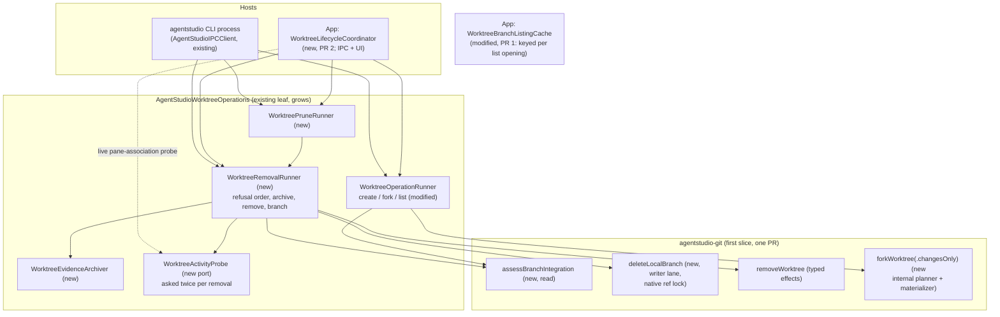
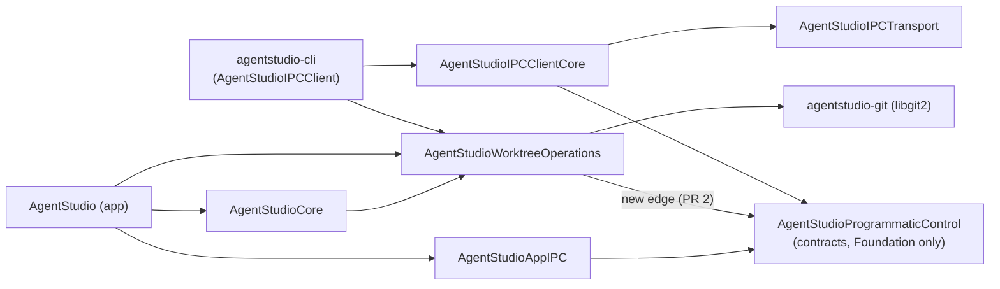
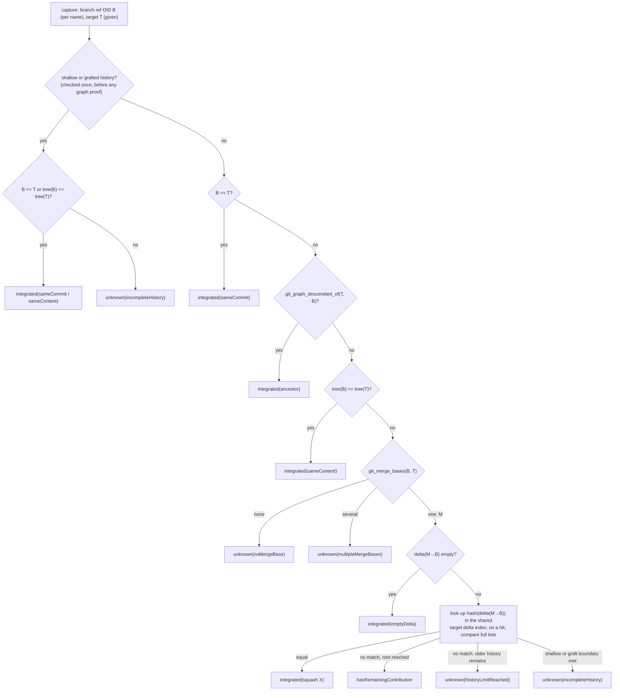
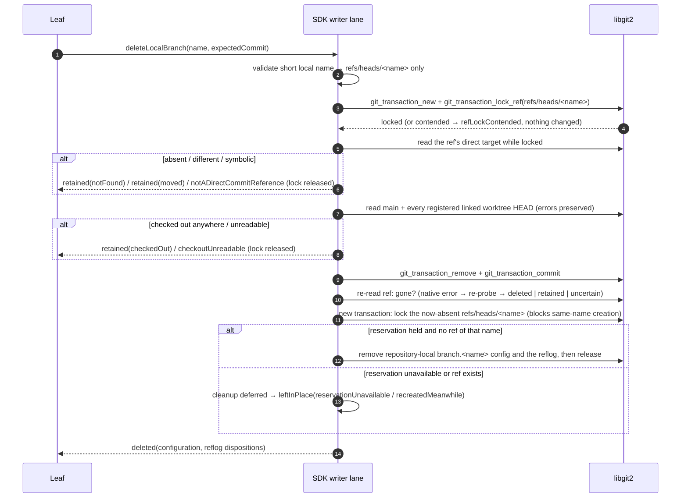
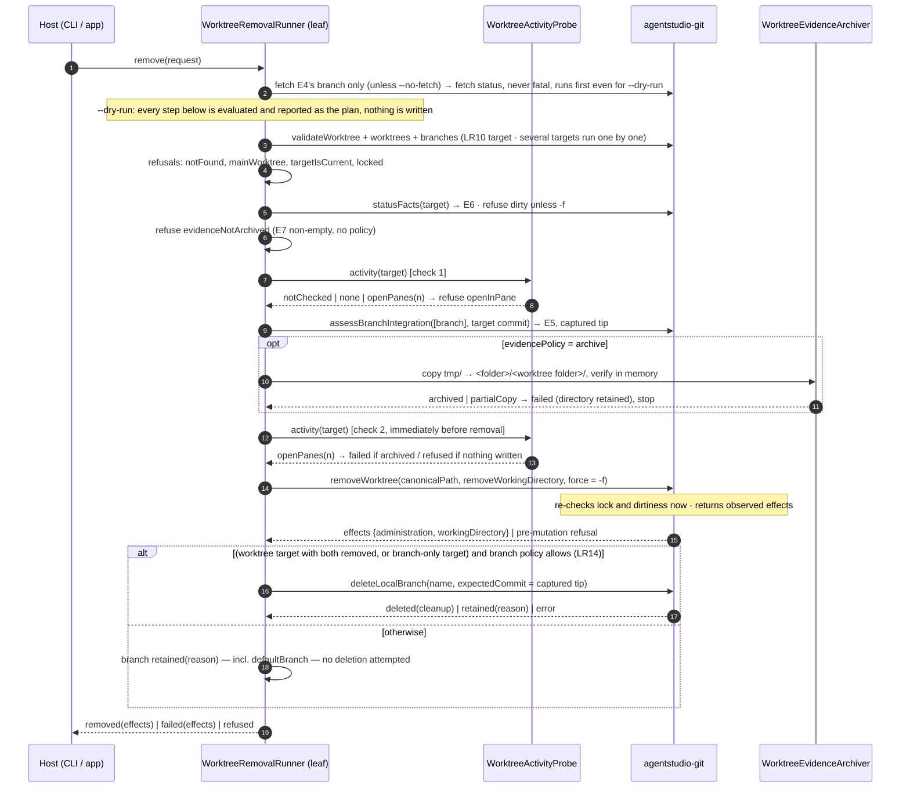
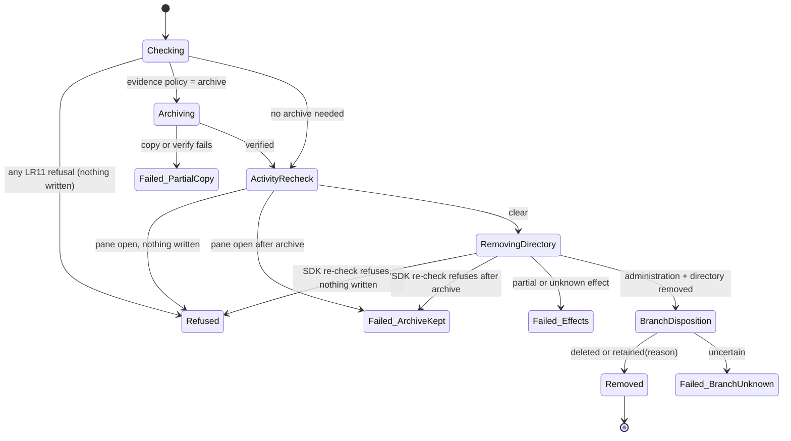
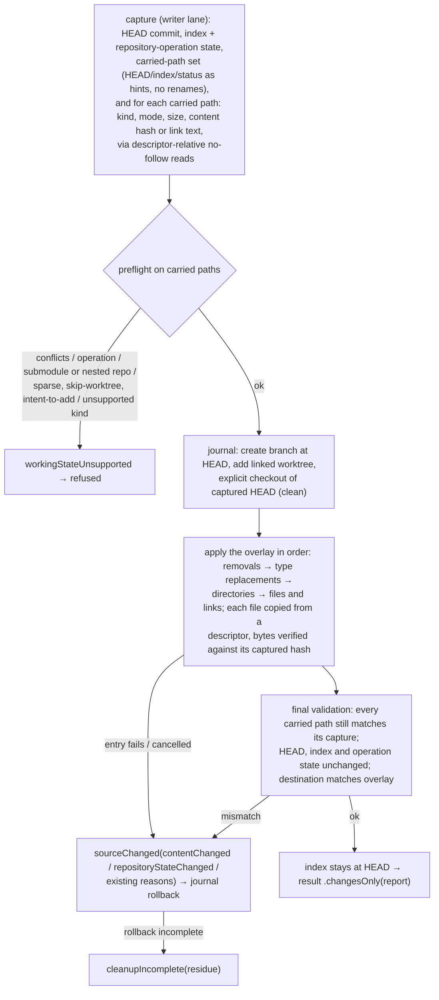
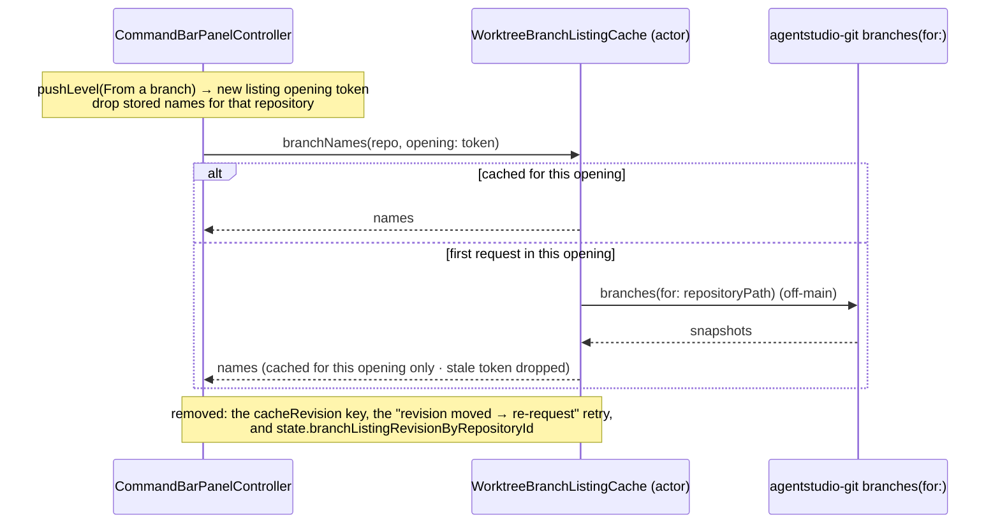

# Worktree lifecycle: how it is built

Date: 2026-09-30, revision 6 (owner decisions: open panes warn with options incl. `removeWithOpenPanes`; D1/D4/D6/D7 recorded). Revision 5 (review round 3: F12-V own-lock residue on every failure path; F15 dry-run gates pane closing).

Revision 4 history:
- Revision 4 corrects review round 2 and the Advisor's revision-3 notes:
  - F11: the fetch is reported, and dry-run removes nothing;
  - F12 and R3-SDK-2: exact lock facts and command-owned lock cleanup;
  - F13: several-target results and the exit code;
  - F14: the default branch is protected at deletion, not at worktree removal;
  - R3-SDK-1: the one-branch fetch's arguments.

Revision 3 history:
- Revision 3 applies the owner's Socratic round:
  - every stop carries reason, details and options;
  - automatic fetch of the default branch;
  - `tmp/` and git-lock refusals, with `--archive-to-main` and `--remove-stale-lock`;
  - several targets, `--dry-run`, safe retries;
  - sane-default policy values.
- It also closes review residuals F4, F5, F9 and F10, and the Advisor's two follow-ups.
- Revision 2 corrects review round 1: findings F1–F9, plus the Advisor's SDK pass.
- It covers the SDK contracts, deletion under a native ref lock, removal effects, the changes-only overlay, branch-list currentness, the live activity recheck, IPC prune, and the fast-CLI IPC contract and target graph.

It realizes [the Specification](2026-09-30-worktree-lifecycle-specification.md) (LR1–LR24) for [the Requirements](2026-09-30-worktree-lifecycle-requirements.md). It builds on the shipped [worktree CLI design](../2026-09-27-worktree-cli/2026-09-27-worktree-cli-program-design.md): the `AgentStudioWorktreeOperations` leaf, its outcome contract and its error mapper stay, and grow.

Anchors:
- agent-studio `07006b402`;
- agentstudio-git `origin/main` `8719325`;
- libgit2 as pinned by agentstudio-git, `f7164261`.

## The shape in one picture



| Unit | Owns | Depends on |
|---|---|---|
| **agentstudio-git PR (first slice)** | Git truth: integration assessment, expected-commit branch deletion, typed removal effects, the changes-only fork | nothing new |
| **App PR 1: agent CLI + branch-list currentness** | CLI `new --from-branch`, `fork --changes-only`, `list` with state, `remove`, `prune`; the leaf's removal/prune/archive policy; the branch list read fresh per opening (LR22); one pin bump to the merged SDK | merged SDK commit |
| **App PR 2: app-executed lifecycle (IPC + UI)** | the app executor; the `worktree.*` IPC methods compiled into the CLI; Remove Worktree… and the changes-only fork in the UI; the open-pane refusal; waiting for the sidebar | PR 1, and the IPC team's fast-CLI + store PR |

**The SDK slice is one PR, built in three commit groups that are reviewed separately:**
1. integration assessment + branch deletion;
2. typed removal effects;
3. changes-only fork.

The Advisor proposed a three-PR stack. One PR follows the owner's rule that one owner-defined piece is one PR. The commit groups keep the separate review the stack would have given. The app stays on its current pin until the whole SDK slice is merged, then cuts over once (D6 sets the app PR cut).

## Target graph



- Every arrow points one way. `ProgrammaticControl` imports only Foundation, so nothing can loop back into the leaf, and libgit2 never reaches an IPC client.
- The new `WorktreeOperations → ProgrammaticControl` edge is deliberate. It updates the pinned allowlist in `CommandLineClientLeafTargetArchitectureTests.swift:34-38`.
- The IPC team's own new target, `AgentStudioCLIStore`, isn't used by worktree work: the worktree verbs persist no state.

## What exists (checked in code)

| Area | Fact | Anchor |
|---|---|---|
| SDK conventions | Reads go through `LibGit2BlockingReadExecutor`, mutations through the per-repository writer lane. Public payloads are `Codable, Equatable, Hashable, Sendable` with public initializers. OIDs are `String` (for example `GitHeadSnapshot.oid`). `GitRevisionTarget` wraps a revision **name** that is resolved later. | `LibGit2AgentStudioGitLocalClient.swift:62-150`; `GitStatusContracts.swift:9-20`; `GitRepositoryIdentity.swift:23` |
| SDK remove | `GitWorktreeRemovalResult{removedWorktreeID, removedWorkingDirectory, partialFailure: String?}`. `partialFailure` is returned whenever `metadataStillExists` is false, and that probe returns false on **every** read error. `removedWorkingDirectory` echoes the request. | `GitWorktreeContracts.swift:105-128`; `LibGit2WorktreeWriter.swift:123-181`; `LibGit2WorktreeRemovalSafety.swift:62-68` |
| libgit2 prune | `git_worktree_prune` recursively deletes the administration **first**, then the working directory; either can fail after a partial delete. | libgit2 `worktree.c:633-663` |
| libgit2 branch delete | `git_branch_delete` removes configuration before the ref. `git_branch_is_checked_out` collapses enumeration errors to false. The filesystem refdb's delete removes the **reflog before** comparing the expected value, so a moved branch keeps its ref but loses its reflog. The ref transaction path (`git_transaction_lock_ref`, then `git_transaction_remove`) reaches the compare without that reflog deletion. | libgit2 `branch.c:179-226`; `refdb_fs.c:1732-1791`; `refdb_fs.c:1242-1255`; `transaction.h:34-107` |
| SDK fork | The APFS planner walks the whole source and applies volume checks. The linked-worktree add helper uses `GIT_CHECKOUT_NONE`. The index is rebuilt from the captured HEAD. The rollback journal confirms ownership before any compensation and reports residue. Race reasons are `entryMissing`, `entryKindChanged`, `entryIdentityChanged` and `containmentEscape`. `GitWorktreeForkRejectionReason` is a `String` raw enum, so it can't take a payload case. Eligibility takes only source and destination. | `WorktreeForkPlanner.swift:20-85`; `WorktreeForkGitHandles.swift:73`; `WorktreeForkIndexBuilder.swift:13`; `WorktreeForkRollbackJournal.swift:6-153`; `GitWorktreeForkError.swift:20-52`; `AgentStudioGitSDK.swift:13` |
| SDK status | Status entries carry paths and flags, no content identity; they prefer the head-to-index path. | `GitStatusContracts.swift:137-171`; `LibGit2StatusReader.swift:185-249` |
| SDK diff | The public diff always does rename finding and line stats, so it's the wrong primitive for exact deltas. | `LibGit2DiffReader.swift:8-21,255-278` |
| Leaf | `WorktreeOperationRunner`, outcome types, error mapper, arguments, formatter; the CLI dispatches `worktree` before any IPC. | `Sources/AgentStudioWorktreeOperations/*`; `Sources/AgentStudioIPCClient/main.swift:13-32` |
| App creation | `WorktreeCreationCoordinator` holds publication, creates, then awaits `refreshWatchedFolder`. "From a branch" is a new branch at the chosen tip. | `WorktreeCreationCoordinator.swift:80-180` |
| App panes | Each pane carries `durableContextFacets.worktreeId`. Discovery removal clears the association and keeps the pane. | `WorkspaceMutationCoordinator.swift:259-276` |
| IPC conventions | Types are `IPC<Noun><Verb>Params` / `IPC<Noun><Verb>Result`. Descriptor structs live in `BuiltInDescriptors/` (for example `IPCSessionMethodDescriptors`). The fast path is `IPCBuiltInMethodCatalog.locallyResolvableDescriptors`. | `Sources/AgentStudioProgrammaticControl/`; IPC team, board 01a0cdc9, activity 3533 |
| **The L6 miss** | The branch cache re-queries only when app-wide `repoCache.cacheRevision` moves, and a ref-only change can leave it unchanged. The per-session `rootSessionGeneration` doesn't advance on `pushLevel`/`popLevel`, so reopening the branch list inside one command-bar session reuses stored names. | `WorktreeCreationPorts.swift:42-103`; `CommandBarPanelController+WorktreeCreation.swift:77-125`; `CommandBarState.swift:236-291,364-390` |

## Choices

1. **The SDK owns Git truth; the leaf owns lifecycle policy; hosts own what only they know.** No archive, activity or product policy enters the SDK. The leaf keeps product notions such as "no default target" and "detached worktree". The SDK assesses branches against a target it is given.
2. **One removal sequence for every host.** `WorktreeRemovalRunner` runs for the CLI, IPC and UI. Only the injected probe differs.
3. **No new cross-process lock.** Each destructive step re-checks at the moment it runs, using Git's own mutation boundaries:
   - the SDK's remove re-reads dirtiness and lock;
   - branch deletion compares the tip under libgit2's native ref lock.

   These are the ordinary per-ref locks Git itself uses, not a new repository-wide lock. The residual windows are named in the Specification's "Not promised".
4. **The branch list is current per opening** (LR22). Each time the branch-list level is pushed, the controller starts a new listing opening. It drops stored names for that repository, and the cache keys on that opening's token. Concurrent requests in one opening share one read, and stale responses are rejected by token. No event, bus fact, atom or observer is added.
5. **Integration is exact, read-only and bounded.** Graph proofs come first. Then one exact aggregate-delta comparison runs against up to 500 first-parent target commits, computed lazily and shared by every branch in the call. No patch-id, no rename detection, no normalization. A hash only finds candidates; the full lists are always compared.
6. **Changes-only is a public materialization of `forkWorktree`, with its own internal planner and materializer.**
   - It shares the fork's source/destination/branch capture, cancellation, linked-identity creation and rollback journal.
   - It doesn't share the APFS planner, which walks the whole source and checks volumes.
   - It performs an explicit checkout of the captured HEAD inside the journaled transaction, because the add helper doesn't check out.
7. **Branch deletion is ref-first, under a native ref transaction lock**, with metadata cleanup reported separately. It never calls `git_branch_delete` (config before ref) or `git_reference_delete` (reflog before compare).
   - Cleanup of `branch.<name>` configuration and the reflog runs under a **fresh** native lock on the now-absent ref. Holding that lock stops anyone creating a same-name branch while cleanup runs.
   - If that lock can't be taken, or a ref of that name exists, cleanup is deferred and reported `leftInPlace`. Nothing is removed on a guess.
8. **Removal reports what it observed, never what it assumes.** Directory and administration effects are observed independently after the prune call, on success and failure. An unreadable path is `unknown`, never "gone".
9. **App activity is checked live, twice.** The app's probe reads current pane associations each time it is asked. The leaf asks before archiving and again as the last step before it submits the SDK remove.
   - The SDK writer-lane queue wait after that is **not** observed: a pane opened then isn't blocked (Spec LR16, D5).
   - The alternative, a host callback executed inside the SDK lane, would put app knowledge into the SDK. It's rejected.
10. **Every stop is agent-actionable.**
    - One table in the leaf, `WorktreeStopCatalog`, maps each reason code to its message template, its details and its options (flags or commands, with their effect).
    - The formatter and the IPC result both render from it, so no view or caller spells options by hand.
    - Hard stops (`mainWorktree`, `defaultBranch`) carry no options.
11. **Fetch is automatic, one branch, fail-soft, always reported.**
    - The leaf resolves E4, then calls agentstudio-git's remote client with a new optional `branchName` on `GitFetchRequest`. For a non-nil branch, the SDK validates the branch and remote names and runs system git with an explicit refspec `+refs/heads/<branch>:refs/remotes/<remote>/<branch>`. It passes `--no-tags --no-prune --no-prune-tags --no-recurse-submodules --refmap=` so nothing else is fetched. A nil branch keeps today's whole-remote fetch.
    - After a successful fetch, the leaf re-resolves E4 and assesses against the new commit. E4 as a local `main`/`master` with no remote gives `skipped(noRemote)`.
    - The status (`fetched(commit)`, `skipped(reason)`, `failed(reason)`) goes into every list, removal, prune and plan outcome.
    - The fetch is the one write allowed in a refusal, a dry-run or a prune preview. It runs first, before any lifecycle step, so a later stop never hides it (F11).
12. **Git locks are surfaced with exact facts, and only exact facts are actionable** (F12, R3-SDK-2).
    - **Path provenance.** Each SDK operation knows which resources it changes (the index, a named ref, `packed-refs`, `config`) and so which lock path each would use.
      - On libgit2 `GIT_ELOCKED`, the SDK checks whether that resource's exact lock file exists. If it does, it raises `lockHeld(GitLockFact{path, resource})`.
      - If it doesn't, the cause is permission or unknown: libgit2 maps `EACCES` to `GIT_ELOCKED` (`fs_path.c:744`), and a persistent worktree lock also reads "locked" (`worktree.c:432+`). Those keep their own errors (`permissionDenied`, the existing worktree-locked refusal), or `lockUnidentified(resource)` when a lock is certain but the file isn't.
      - For system git, the single mapping "Unable to create '<path>': File exists" is accepted only when the path is a lock inside this repository's Git directories.
    - **Command-owned cleanup evidence.** After each mutation, the SDK checks that every lock path it created is gone. Native free/unlock calls return nothing, so absence is observed, not assumed. A leftover becomes `lockResidue: [path]` in that operation's result or effects. Pre-existing foreign locks are never touched.
    - **Leaf.** The leaf adds the age and a best-effort "git process found" probe, then decides "looks stale" (older than `WorktreeLifecyclePolicy.staleLockAge`, 2 minutes, and no git process). This is a heuristic: a libgit2 writer, such as the app itself, isn't a `git` process.
    - **Removal.** `--remove-stale-lock` is offered only for a `lockHeld` fact. It re-checks the same file identity (device, inode, mtime) and staleness before removing exactly that file.
13. **Several targets: resolve all, run each to the end, aggregate** (F13). The leaf resolves every input first and merges inputs that name the same worktree or branch. It then runs the removal sequence per target, in input order, never stopping early. The outcome is `removal(entries)`, each entry `removed | alreadyRemoved | refused(stop) | failed(effects) | planned(plan)`. Exit precedence: any failed → 2, else any refused → 1, else 0.
14. **Default-branch protection sits at branch disposition** (F14). A linked worktree checked out on E4's branch goes through the normal removal. Its branch is always `retained(defaultBranch)`, even with `-D`. Only a branch-only target naming E4's branch is a hard stop.
15. **Sane defaults live in one policy type.** `WorktreeLifecyclePolicy` in the leaf holds:
    - the 500-commit squash bound;
    - the 2-minute stale-lock age;
    - fetch on/off;
    - the `<main worktree>/tmp/<worktree folder>/` archive rule.
16. **IPC follows the fast-CLI rule (PR 2).**
    - The contracts are `IPCWorktreeCreateParams`/`Result` (and `Fork`, `Remove`, `Prune`, `List`), in `AgentStudioProgrammaticControl`, with one `BuiltInDescriptors/IPCWorktreeMethodDescriptors.swift`.
    - They are listed in `locallyResolvableDescriptors`, so a call goes straight to the app with one connection, one login and no per-call catalog fetch.
    - The app registers them from `App/IPCComposition/Worktrees/`.
    - The leaf's outcome and the IPC result are the same Codable shape, defined once in `ProgrammaticControl`. The CLI's `--json` prints it, and IPC returns it.

## Where each thing lives

| Entity | Semantic owner | Home | Status |
|---|---|---|---|
| E1 Repository, E2 Worktree | SDK (identity), leaf (discovery rules) | `GitWorktreeSnapshot`; leaf discovery (shipped) | existing |
| E3 Local branch | SDK | `GitBranchSnapshot`; `deleteLocalBranch` | modified |
| E4 Integration target | leaf | shipped default start-point resolver; the resolved commit is passed to the SDK as the target | existing |
| E5 Assessment | SDK | `GitBranchIntegrationAssessment` (`AgentStudioGitContracts`) | new |
| E6 Working changes | SDK | `statusFacts` counts; removal safety | existing |
| E7 Evidence folder, E8 Archive | leaf | `WorktreeEvidenceArchiver` (in-memory verification, no files written) | new |
| E9 Pane activity | host | `WorktreeActivityProbe` (leaf port); app implementation over pane `worktreeId` | new |
| E10 Removal | leaf over SDK effects | `WorktreeRemovalRunner`; `GitWorktreeRemovalEffects` (SDK) | new |
| E11 Materialization | SDK | `GitWorktreeForkMaterialization`, `GitWorktreeMaterializationResult` | modified |
| E12 Outcome | leaf; wire shape in `ProgrammaticControl` | `WorktreeOperationOutcome` (leaf) → `IPCWorktree<Verb>Result` (contracts) | modified |
| E13 Branch list | App | `WorktreeBranchListingCache` keyed by listing-opening token | modified |
| E14 Git lock file | SDK (exact facts, own-lock cleanup evidence); leaf (age, staleness, explicit removal) | `GitLockFact`, `GitLockResource`, `lockResidue` (SDK); `WorktreeStaleLockAssessment` (leaf) | new |

## SDK interfaces (first slice)

These are the contracts the implementation must match. Every public payload follows SDK convention: `Codable, Equatable, Hashable, Sendable`, public initializers, explicit tags on associated-value enums, and invalid states rejected at decoding.

```swift
// ── Integration (E5): one blocking read, one opened repository, never the writer lane.
func assessBranchIntegration(
    _ request: GitBranchIntegrationRequest
) async throws(GitDataPlaneError) -> GitBranchIntegrationReport

struct GitBranchIntegrationRequest {
    let repositoryPath: URL
    let branchNames: [String]          // short local names; empty → empty report, no walk
    let targetCommit: String           // an OID the caller already resolved (E4); validated as a commit
    let squashSearchCommitLimit: Int   // 0...10_000; 0 disables the squash search; leaf passes 500
}
struct GitBranchIntegrationReport {
    let targetCommit: String                                  // echoes what was assessed
    let assessments: [GitBranchIntegrationAssessment]         // one per requested name, input order
}
struct GitBranchIntegrationAssessment {
    let branchName: String
    let branchCommit: String?          // the captured ref OID; nil only when the ref is absent/unreadable
    let grade: GitBranchIntegrationGrade
}
enum GitBranchIntegrationGrade {
    case integrated(GitIntegrationProof)
    case hasRemainingContribution
    case unknown(GitIntegrationUnknownReason)
}
enum GitIntegrationProof { case sameCommit, ancestor, sameContent, emptyDelta, squash(commit: String) }
enum GitIntegrationUnknownReason {
    case branchNotFound, noMergeBase, multipleMergeBases,
         historyLimitReached, incompleteHistory, missingObjects, readFailed
}
// Throws only for repository-level failures (repository or target unopenable). A failure on one
// branch becomes that branch's .unknown(.readFailed), never an error for the whole batch.

// ── Branch deletion (E3): one complete mutation on the writer lane, no suspension inside it.
func deleteLocalBranch(
    _ request: GitDeleteLocalBranchRequest
) async throws(GitLockedOperationFailure<GitDeleteLocalBranchErrorReason>) -> GitDeleteLocalBranchResult
struct GitDeleteLocalBranchRequest { let repositoryPath: URL; let branchName: String; let expectedCommit: String }
enum GitDeleteLocalBranchResult {
    case deleted(GitBranchMetadataCleanup)
    case retained(GitBranchRetentionReason)       // ref, configuration and reflog all untouched
    case uncertain(GitDataPlaneError)             // a native error after the removal was staged, and the re-probe couldn't tell
}
struct GitBranchMetadataCleanup {
    let configuration: GitBranchMetadataDisposition   // removed | absent | leftInPlace(reason)
    let reflog: GitBranchMetadataDisposition
}
enum GitBranchMetadataLeftInPlaceReason { case recreatedMeanwhile, reservationUnavailable, removalFailed }
enum GitBranchRetentionReason {
    case notFound
    case moved(currentCommit: String)
    case checkedOut(worktreePaths: [URL])
}
enum GitDeleteLocalBranchErrorReason {         // no ref, config or reflog change; thrown inside GitLockedOperationFailure
    case invalidBranchName, refLockContended, checkoutUnreadable(worktreePath: URL?)
    case notADirectCommitReference
    case gitFailure(GitDataPlaneError)
}                                              // every case here means nothing changed

// ── Fetch (LR5): one optional field on the existing request; nil keeps today's whole-remote fetch.
struct GitFetchRequest { let repositoryPath: URL; let remoteName: String; let branchName: String? }
// branchName != nil: validated names; explicit single refspec; --no-tags --no-prune --no-prune-tags
// --no-recurse-submodules --refmap=. Result carries the fetched commit of refs/remotes/<remote>/<branch>.

// ── Locks (LR26): exact facts only.
struct GitLockFact { let path: URL; let resource: GitLockResource }
enum GitLockResource { case index(worktreePath: URL), reference(name: String), packedRefs, config }
// GitDataPlaneError gains:
//    case lockHeld(GitLockFact)                 // the exact lock file for a known resource exists
//    case lockUnidentified(GitLockResource)     // a lock is certain, but its file couldn't be established
//    case permissionDenied(path: URL?)          // EACCES that libgit2 reported as GIT_ELOCKED
// Every SDK operation that can take a lock carries its own-lock evidence on EVERY terminal path, success or failure:
//   success results:  `lockResidue: [URL]` (normally empty) on GitWorktreeRemovalEffects,
//                     GitDeleteLocalBranchResult.deleted / .retained / .uncertain, GitFetchResult;
//   thrown failures:  struct GitLockedOperationFailure<Reason>: Error { let reason: Reason; let lockResidue: [URL] }
//                     — thrown by deleteLocalBranch (Reason = GitDeleteLocalBranchErrorReason, the former error cases),
//                     removeWorktree after its first mutation, and fetch (Reason = GitDataPlaneError);
//   fork:             GitWorktreeForkResidueKind gains .lockFile, so cleanupIncomplete lists it with the other residue.
// The original failure is never replaced; the leaf maps both into the outcome and never reports a clean finish
// while `lockResidue` is non-empty.

// ── Removal (E10): observed effects replace the String partial.
struct GitWorktreeRemovalResult {               // name kept; String partial removed (hard cutover)
    let removedWorktreeID: GitWorktreeID
    let effects: GitWorktreeRemovalEffects
}
struct GitWorktreeRemovalEffects {
    let administration: GitRemovalEffect        // removed | retained | partial | unknown
    let workingDirectory: GitRemovalEffect      // …plus notRequested
    let failure: GitWorktreeRemovalFailureKind? // nil on complete success; closed native kinds, no text
}
// Pre-mutation refusals (main, locked, dirty, path mismatch) stay GitDataPlaneError, unchanged.

// ── Changes-only fork (E11).
enum GitWorktreeForkMaterialization { case copyOnWrite, changesOnly }
// GitForkWorktreeRequest gains `materialization` (no default).
// forkWorktreeEligibility(sourceWorktreePath:destinationPath:materialization:). For .changesOnly, "available"
// means only the capability; volume and APFS checks are skipped, while root/parent/overlap validation
// stays. The operation's own preflight remains authoritative.
enum GitWorktreeMaterializationResult {
    case copyOnWrite(GitWorktreeMaterializationReport)
    case changesOnly(GitChangesOnlyMaterializationReport)   // changedTrackedPaths, copiedUntrackedPaths
}
// Rejection: GitWorktreeForkError.rejected keeps its String reason enum for existing cases; changes-only
// working-state refusals use a new case:
//   GitWorktreeForkError.workingStateUnsupported(GitWorktreeWorkingStateRefusal)
//   GitWorktreeWorkingStateRefusal { reason: conflicts | operationInProgress | submoduleChanged |
//     nestedRepository | sparseOrSkipWorktree | intentToAdd | unsupportedEntryKind; relativePath: String? }
// Source races: GitWorktreeForkSourceRaceReason gains contentChanged and repositoryStateChanged.
```

The leaf maps each SDK error through its existing total mapper, extended case by case. No raw libgit2 text reaches output.

## Leaf interfaces (app PR 1)

`AgentStudioWorktreeOperations` owns requests, policy and outcomes; the wire shape of each outcome is the `IPCWorktree<Verb>Result` type in `ProgrammaticControl` (PR 2), which the CLI's `--json` also prints.

```swift
enum WorktreeOperationRequest: Sendable, Equatable {
    case createFromDefault(start: URL, branch: String)
    case createFromBranch(start: URL, branch: String, startBranch: String)                 // LR1
    case fork(start: URL, branch: String, materialization: WorktreeForkMaterialization)   // LR2-LR4
    case list(start: URL, targets: [String], fetchPolicy: WorktreeFetchPolicy)             // LR9
    case remove(WorktreeRemovalRequest)                                                    // LR10-LR16, LR25, LR26
    case prune(WorktreePruneRequest)                                                       // LR17
}
struct WorktreeRemovalRequest: Sendable, Equatable {
    let start: URL                               // --repo or current directory
    let callerDirectory: URL?                    // for targetIsCurrent; nil from app hosts
    let targets: [String]                        // branch names or paths, handled one by one
    let discardWorkingChanges: Bool              // -f
    let branchPolicy: WorktreeBranchPolicy       // .deleteIfIntegrated | .deleteAtObservedCommit (-D) | .keep
    let evidencePolicy: WorktreeEvidencePolicy   // .requireEmpty | .archiveToMain | .archive(to: URL) | .discard
    let fetchPolicy: WorktreeFetchPolicy         // .defaultBranch | .skip
    let removeStaleLock: Bool                    // --remove-stale-lock
    let closePanes: Bool                         // IPC/UI only; the CLI never sets it
    let removeWithOpenPanes: Bool                // IPC/UI only (D5): proceed past openInPane; panes lose their worktree link
    let dryRun: Bool                             // --dry-run -> .planned
}
struct WorktreePruneRequest: Sendable, Equatable {
    let start: URL; let callerDirectory: URL?
    let apply: Bool; let evidencePolicy: WorktreeEvidencePolicy; let fetchPolicy: WorktreeFetchPolicy
}

/// What a host knows about panes. The CLI passes one that answers `.notChecked`;
/// the app passes a live one that reads current pane associations on each call.
protocol WorktreeActivityProbe: Sendable {
    func activity(forWorktreeAt canonicalPath: URL) async -> WorktreeActivity
}
enum WorktreeActivity: Sendable, Equatable { case notChecked, none, openPanes([WorktreePaneReference]) }

enum WorktreeOperationOutcome: Sendable, Equatable {
    case created(WorktreeCreatedSummary)
    case listed(WorktreeListingSummary)            // + target, fetch status, per-row state, removable, blockers
    case removal(WorktreeRemovalReport)            // entries in input order: removed | alreadyRemoved | refused | failed | planned
    case pruned(WorktreePruneSummary)
    case refused(WorktreeOperationRefusal)         // nothing written; carries its options
    case failed(WorktreeOperationFailure)          // create/fork keep `leftovers`; remove carries `effects`
}
/// One row per stop reason: message, details, options. Hard stops have no options.
struct WorktreeStopCatalog { static func entry(for reason: WorktreeStopReason) -> WorktreeStopEntry }
struct WorktreeStopOption: Sendable, Equatable { let action: WorktreeStopAction; let effect: String } // .flag / .command
enum WorktreeLifecyclePolicy {
    static let squashSearchCommitLimit = 500
    static let staleLockAge: Duration = .seconds(120)
    static let fetchesDefaultBranch = true
    static func archiveToMainDestination(mainWorktree: URL, worktreeFolder: String) -> URL  // <main>/tmp/<folder>/
}
```

New stop reasons: `defaultBranch` (hard, branch-only targets only), `mainWorktree` (hard), `gitLockUnidentified` (retry only), `notFound`, `alreadyRemoved`, `startBranchNotFound`, `unsupportedWorkingState`, `targetIsCurrent`, `worktreeLocked`, `dirty`, `evidenceInTmp`, `openInPane`, `gitLockHeld`, `archiveDestinationExists`, `archiveDestinationInsideWorktree`. `forkUnavailable` gains the `changesOnly` option.

## How integration is assessed



**Delta.**
- A delta is the list of leaf entries `(raw path bytes, old mode, old OID, new mode, new OID)`, from `git_diff_tree_to_tree`.
- Options:
  - `GIT_DIFF_SKIP_BINARY_CHECK`;
  - no `git_diff_find_similar`;
  - no patch or hunk construction;
  - submodule ignore forced to none;
  - no type-change-trees flag (a type change is a delete plus an add);
  - no pathspec, case folding or Unicode normalization.
- Entries are sorted by raw path bytes, never by Swift `String` equality or locale. User config (`diff.ignoreSubmodules`, `core.filemode`, `core.ignorecase`, attributes, drivers) can't change the result.

**Shared target index.**
- The index is built lazily in one call:
  - walk T, then parent 0, then parent 0 again, up to `squashSearchCommitLimit` candidates;
  - compute each candidate's delta against its first parent once;
  - keep a hash → candidates bucket;
  - stop as soon as every unresolved branch is answered.
- Candidate numbering:
  - T is candidate 1, and candidate 500 is evaluated;
  - candidate 501 isn't;
  - a parent is observed only to decide whether history remains.
- Merge commits are candidates, compared to parent 0. A root ends the walk, and it isn't a candidate. A shallow or grafted boundary is detected and gives `incompleteHistory`, never an empty-tree delta.
- `missingObjects` means objects the proof needs: commits, trees and parents. Blob and gitlink OIDs are compared, never read.
- The index lives for one call only: no cache and no actor. Nothing writes objects, the index, refs, configuration or working files.

**The 500 bound limits recall, not runtime.** Heavy ancestry or very large trees stay on the read executor. If a further object or byte budget proves necessary, it returns `unknown` with a named reason. It never truncates a list and compares a prefix.

## How a branch is deleted



- **Order.** The compare happens **after** the lock is held; transaction removal takes no expected value itself, so the locked compare is essential. The checkout scan reuses the SDK's linked-worktree administration reading, and a read failure refuses deletion.
- **Metadata cleanup.**
  - Only the repository-local `branch.<name>` section and the branch's reflog are touched, never global or included configuration.
  - Cleanup runs only if no ref of that name exists after the commit. If a same-name branch was created meanwhile, cleanup is `leftInPlace(recreatedMeanwhile)`.
  - Cleanup isn't atomic with the ref deletion; partial cleanup is reported, not hidden.
- **Residual race.** The ref lock doesn't stop another process checking the branch out in the moment after the HEAD scan. This is named, not locked out (choice 3).

## How a removal runs



**`refused` vs `failed`.** `refused` is returned only when nothing was written. A check that fails after an archive exists returns `failed`. That covers the second activity check and the SDK's own re-check, and the failure carries directory `retained`, administration `retained`, branch `retained` and evidence `archived`. The archive is never deleted to fake a no-change result. A branch-only target skips the directory steps.

### Removal states



| Failure | Detected by | Contained by | Reported effects |
|---|---|---|---|
| Archive copy/verify fails | in-memory comparison | stop before the directory | directory retained, branch retained, evidence `partialCopy(path)` |
| Pane opened, or SDK re-check refuses, after archive | activity check 2 / SDK | nothing removed | failed; archive kept; everything else retained |
| Prune fails partway | SDK observed effects | branch step skipped | administration/directory `partial` or `unknown`, branch retained |
| Branch moved / checked out / unreadable checkout | `deleteLocalBranch` | branch kept, metadata untouched | `removed`, branch retained(reason) |
| Metadata cleanup incomplete | SDK cleanup disposition | ref already gone | `removed`, branch deleted, cleanup warning |
| Native error after staging deletion | SDK re-probe (`uncertain`) | — | failed: directory removed, branch `deleted`/`retained`/`unknown` as observed |
| A git lock blocks a step | `lockHeld(path)` | stop at that step | refused if nothing written, else failed with effects; options: retry, or `--remove-stale-lock` when stale |

## How a changes-only fork runs



- **The overlay.** For each carried path, the destination ends with the source's file on disk: absent, file, directory or symlink, with the same mode. It never gets an index-only version. That makes LR2's cases fall out naturally:
  - a staged delete followed by recreation copies the recreated file;
  - a staged new file that was then deleted is absent in the source, and absent in HEAD, so nothing happens;
  - a staged change undone on disk matches HEAD, so it isn't carried.
- **Validation.** Validation is per carried path plus repository state, not a whole-worktree snapshot. Paths that aren't carried may change. Rollback, residue and cancellation reuse the existing journal: ownership is confirmed before compensation, a created branch is compensated only at its expected OID, and cancellation returns only after compensation.
- **Reporting.** Counts are net: changed HEAD-tracked paths, and copied untracked paths.

## How the branch list stays current (PR 1)



Worktree rows keep their existing paths: discovery for add and remove, and enrichment for the checked-out branch (LR20, LR21; unchanged code).

## The app executor (PR 2)

`WorktreeLifecycleCoordinator` lives in `App/Coordination`. It is `@MainActor` and owns no state. For each app-executed operation it:
1. resolves the target from the workspace;
2. hands the leaf a **live** probe, which reads current pane associations on MainActor each time the leaf asks.
   - With `closePanes` on a real run, before the leaf's first activity check, the coordinator dispatches the existing pane-close action for each associated pane and awaits each pane's closed fact. A pane that doesn't close stops the removal with `openInPane`, listing it.
   - With `dryRun`, the coordinator dispatches nothing. The plan lists the panes it would close, and the leaf plans as if they were closed (F15). Pane closing is a durable workspace write, so the preview guard must sit here, before any host action, not only in the leaf;
3. runs the leaf runner off-main;
4. awaits the existing `refreshWatchedFolder` for the affected watched folder (creation keeps its publication hold);
5. returns the outcome.

The IPC methods and the UI both call it.

| Surface | Change |
|---|---|
| Contracts (`AgentStudioProgrammaticControl`) | `IPCWorktreeCreateParams`/`Result`, `IPCWorktreeForkParams`/`Result`, `IPCWorktreeRemoveParams`/`Result`, `IPCWorktreePruneParams`/`Result`, `IPCWorktreeListParams`/`Result`; `BuiltInDescriptors/IPCWorktreeMethodDescriptors.swift`; listed in `locallyResolvableDescriptors` |
| App IPC composition | `App/IPCComposition/Worktrees/` registers `worktree.create/fork/remove/prune/list` and dispatches to the coordinator. Privilege: the existing `appCommandExecute` for mutations and `workspaceRead` for list, since the standalone CLI already performs the same work with no credential. |
| `AppCommand` (UI verbs) | New `removeWorktree` and `forkWorktreeChangesOnly` spec entries (label, `CommandIcon`, help, surface policy), with IPC classified in the same change as reachable through the `worktree.*` methods. The existing creation commands keep their interactive role. |
| UI | Worktree row menu → Remove Worktree…. The command bar opens a removal step (Features/CommandBar) showing the assessment, changes, branch disposition and evidence choice (`NSOpenPanel` for the archive folder). Close Panes and Remove dispatches the existing pane-close action per listed pane, then removes. New Worktree → Fork gains the changes-only row. |

## Concurrency and ordering

- **SDK:** mutations for one repository run FIFO on its writer lane. Assessment and status reads run on the read executor. Branch deletion holds a native ref lock only for its compare-and-remove.
- **Across processes:** no new lock. Correctness rests on:
  - the SDK remove re-checking at execution;
  - the locked compare in branch deletion;
  - the preserved-error checkout scan.
- **App MainActor:** only the probe reads and outcome publication run there. Everything else runs off-main.
- **Branch list:** one read per repository per listing opening, shared.

## Cross-cutting realization

| Obligation | Realized by |
|---|---|
| No raw Git text (WR5 carried) | closed SDK effect, failure and cleanup kinds; the leaf's total mapper extended |
| Privacy | the archiver writes only to the caller's folder; OTLP carries operation and outcome kinds only |
| No CLI state files | the archive is verified in memory; nothing else is written |
| Performance | lazy shared delta index; cheap proofs short-circuit; the 500 bound is leaf policy data; `list` duration measured on this repository |
| Safety | refusal order is one leaf function; locks are never overridden; branch deletion is compare-under-lock; effects are observed, not assumed |

## Proof seams

| Seam | Real vs fake | What it observes |
|---|---|---|
| SDK integration | real temporary repositories via the existing Git fixtures, with scrubbed config; the #388/#395 objects as a checked-in, non-thin pack plus manifest, imported with system Git (no network); targets pinned at an advanced commit where #388 and #395 sit at first-parent positions 14 and 4 of `07006b402` | every grade, proof and unknown; bound edges 1/499/500/501 and limit 0; byte-exact paths and modes; binary, symlink, gitlink; shallow and graft boundaries; a batch with one bad branch; before/after filesystem snapshot plus mutation monitor proving zero writes; #388 against its own squash → `sameContent`, both against the advanced target → `squash` |
| SDK branch deletion | real repositories; a second native Git client moves the tip or checks out the branch at a named barrier seam | loose and packed refs; moved after lookup (ref, config and reflog untouched); checked out in main or linked; unreadable linked administration; lock contention; cleanup success, failure and recreated-meanwhile; tags and remotes untouched |
| SDK removal effects | real repositories with permission faults on the owning prune path | partial administration; partial directory; unreadable observation → `unknown`; `removeWorkingDirectory: false` → `notRequested` |
| SDK changes-only | real repositories; the existing named fault and cancellation seams | the LR2 payload cases; LR3 refusals; content-changed-with-same-status, HEAD move, symlink swap → `sourceChanged`; failure or cancellation after every phase → rollback or exact residue; the APFS clone path is never invoked; injected non-APFS host facts prove the gate is bypassed (not real non-APFS proof) |
| Fetch | a local bare repository as the remote (no network) | E4 advances after the fetch; `--no-fetch`; a failed fetch and a held ref lock fall back with their status |
| Git locks | real repositories with planted index, ref, packed-refs and config locks, fresh and older than the stale age, with and without a running git process; an `EACCES` directory; a worktree lock; a denied unlink of a command-owned lock (named fault seam) | each blocker reported by its actual path and resource; EACCES → `permissionDenied`, not a lock; `lockUnidentified` offers retry only; `--remove-stale-lock` removes exactly that file after its identity re-check; own-lock leftovers appear in `lockResidue` on success and on failure (a checkout read failing after the ref lock is taken, then a denied release; a failed fetch; an uncertain delete), next to the original failure; foreign locks survive refusals |
| Leaf removal/prune | real SDK and repositories; the activity probe is a scripted double that answers per call (a host fact) | refusal order; `failed` (not `refused`) after the archive; effects projection; branch step skipped on partial effects |
| CLI | real top-level dispatch with injected output | goldens for every outcome, exit codes, no IPC client or credential read |
| Branch list | the real cache and SDK against a temporary repository | pop and re-push inside one command-bar session re-reads after an external delete, create, rename or pack; one read shared within an opening |
| App executor + IPC (PR 2) | the real registry and coordinator, real SDK; await the typed topology fact, never time | parity with the CLI; `dryRun` + `closePanes` leaves the pane open and workspace state unchanged, while the real run closes and awaits it; a pane opened after check 1 → refusal or failure; the sidebar reflects the change when the call returns; no per-call catalog fetch |
| Real app | debug build, CLI and plain `git` from outside | rows and branch lists per LR20–LR22 |

## Trace

| U | R | E | Owner | Interface | Shape and home | State | Failure | Proof |
|---|---|---|---|---|---|---|---|---|
| L3 | LR1 from-branch | E3 | leaf runner | `createFromBranch` | leaf request | — | `startBranchNotFound` | leaf integration |
| L4 | LR2 overlay payload | E11 | SDK changes-only materializer | `forkWorktree(.changesOnly)` | `GitWorktreeMaterializationResult` (SDK) | journaled fork | `sourceChanged(contentChanged, repositoryStateChanged, …)`, `cleanupIncomplete` | SDK fork tests |
| L4 | LR3 refusals | E6, E11 | SDK changes-only planner | `workingStateUnsupported` | `GitWorktreeWorkingStateRefusal` (SDK) | preflight | `refused unsupportedWorkingState` | SDK fork tests |
| L4 | LR4 no fallback | E11, E12 | leaf formatter | outcome shape | `forkUnavailable` + alternative | — | — | CLI golden |
| L2, L11 | LR5 target + automatic fetch | E4 | leaf + SDK remote client | `fetch(GitFetchRequest.branchName)` → resolved target commit | shipped resolver; `fetch` status in outcome | — | fetch failure/lock → local fallback; `unknown(noTarget)` in the leaf | fetch from a local bare remote |
| L2 | LR6 proofs | E5 | SDK | `assessBranchIntegration` | `GitBranchIntegrationGrade` | per call | — | SDK integration tests |
| L2 | LR7 squash | E5 | SDK | `assessBranchIntegration` | `.squash(commit:)`; shared delta index | per call | `historyLimitReached`, `incompleteHistory` | SDK tests + #388/#395 pack |
| L2 | LR8 unknowns | E5 | SDK (+ leaf for `noTarget`, detached) | `assessBranchIntegration` | `GitIntegrationUnknownReason`; overlay check first | per branch | never integrated; shallow/graft → `incompleteHistory` before graph proofs | SDK + leaf tests |
| L5 | LR9 list, failure granularity | E5–E7, E9 | leaf runner | `.list` | `WorktreeListingSummary` → `IPCWorktreeListResult` | per row | whole-list read failure → `notNeeded`; row failures → `unknown` | CLI golden (mixed list) |
| L1 | LR10 targets | E2, E3 | leaf removal runner | `WorktreeRemovalRequest.targets` (resolved, merged, run to the end) | `WorktreeRemovalReport` entries | per target | `notFound`, `alreadyRemoved` (absent now) | leaf integration (mixed, duplicate, repeat) |
| L1, L10, L13 | LR11 stops with options | E2, E6, E7, E9, E14 | leaf removal runner | stop order + `WorktreeStopCatalog` | `WorktreeOperationRefusal` + options | Checking | `refused` only when nothing written; hard stops carry no options | leaf table test (every code has its options) |
| L10 | LR12 archive | E7, E8 | leaf archiver | `WorktreeEvidenceArchiver` (`archiveToMain`, `archive(to:)`) | in-memory verification | Archiving | `failed`, `partialCopy` | leaf integration |
| L1 | LR13 directory | E2, E6 | SDK remove | `removeWorktree` | `GitWorktreeRemovalEffects` | RemovingDirectory | observed `partial`/`unknown` | SDK removal tests |
| L1, L2 | LR14 branch | E3, E5 | SDK writer + leaf policy | `deleteLocalBranch(expectedCommit:)` | `GitDeleteLocalBranchResult` (incl. `uncertain`)/`Error` (no-change only) | BranchDisposition (branch-only targets enter directly) | retained(moved/checkedOut), `checkoutUnreadable`, cleanup `leftInPlace` under reservation | SDK deletion tests |
| L1 | LR15 effects + exit | E10, E12 | leaf over SDK effects | `WorktreeRemovalReport` | `WorktreeRemovalEffects` per entry; exit 2 > 1 > 0 | terminal | failed entries with every effect | leaf failure-table test + aggregate-exit golden |
| L1, L7 | LR16 activity | E9 | host | `WorktreeActivityProbe`, asked twice (last check just before SDK submit) | leaf port; live app implementation; `closePanes` option | two checks | `openInPane` with options, or failed after archive | leaf scripted double + IPC test |
| L1, L2 | LR17 prune | E2–E10 | leaf prune runner | `.prune`; `worktree.prune` | `WorktreePruneSummary` → `IPCWorktreePruneResult` | per candidate | per-entry failed → exit 2 | leaf + IPC integration |
| L1, L7 | LR18 IPC | E12 | app coordinator (PR 2) | `worktree.create/fork/remove/prune/list` | `IPCWorktree<Verb>Params/Result` (ProgrammaticControl) | awaits rescan | same outcomes | IPC registry tests |
| L1 | LR25 dry run | E10, E12 | leaf removal runner + app coordinator (no pane close in preview) | `dryRun` | `planned` entries in `WorktreeRemovalReport` | only the reported fetch written | same codes and options as a real run; `--remove-stale-lock` reported, not done | CLI golden + snapshot (refs change only by the reported fetch) |
| L13 | LR26 git locks | E14 | SDK (exact facts, own-lock cleanup evidence) + leaf (age, staleness, removal) | `lockHeld(GitLockFact)`, `lockUnidentified`, `permissionDenied`; `lockResidue` on results and `GitLockedOperationFailure`; `removeStaleLock` | `GitLockFact`, `WorktreeStaleLockAssessment` | per step | removal only for an exact stale fact; residue reported by path | lock integration (competing locks, EACCES, denied own-lock cleanup) |
| L1 | LR19 standalone | — | CLI dispatch | `WorktreeCommandLine.dispatch` | shipped | — | — | dispatch test |
| L6 | LR20 worktree rows | E2 | discovery (existing) | scan → reconciliation | existing | existing | existing | real-app proof |
| L6 | LR21 branch label | E2, E3 | enrichment (existing) | `branchChanged` | existing | existing | existing | real-app proof |
| L6 | LR22 branch list per opening | E13 | App cache | `branchNames(…, opening:)` | `WorktreeBranchListingCache` | per opening | query failure shown (existing) | cache integration + real app |
| L7 | LR23 Remove UI | E5, E6, E9, E10 | CommandBar step + app coordinator | `removeWorktree` command | command spec | confirmation step | same refusals shown | native screenshots |
| L4, L7 | LR24 changes-only UI | E11 | command spec | `forkWorktreeChangesOnly` | command spec | — | as LR3/LR4 | native screenshot |

## Deviations and decisions for the owner

- **D1, D4–D7** (Requirements) carry their defaults; D2 is decided (everything unstaged), D3 is replaced by L10's options. D7 (does the CLI do the work in its own process?) is needed before app PR 1's runner, not for the SDK slice.
- **SDK additions from the Socratic round:** `GitFetchRequest.branchName` and `GitDataPlaneError.lockHeld(path:)`. Both are additive.
- **New coordinator responsibility** (CLAUDE.md "ask first"): `WorktreeLifecycleCoordinator` in PR 2.
- **New IPC pieces** (PR 2): five method pairs and one descriptor file, following the IPC team's conventions; one new target edge (`WorktreeOperations → ProgrammaticControl`). All additive.
- **No new atom, store, bus event, observer or lock.** The L6 fix changes one cache key. Deletion uses Git's own ref lock.
- **SDK breaking changes**, hard cutover in one pin bump:
  - the fork request's `materialization` field and the eligibility signature;
  - the materialization result enum;
  - `GitWorktreeRemovalResult` gains observed effects in place of the `String` partial.
- **Gap:** no generated UI images for LR23 and LR24; the screens are specified in words.
