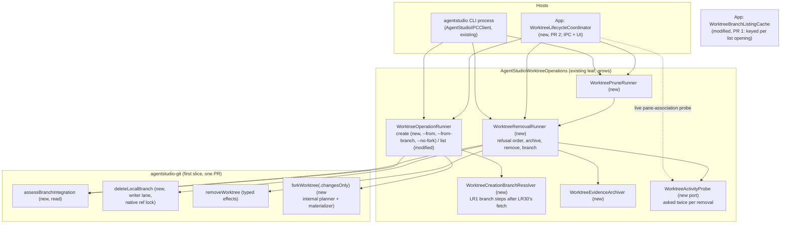
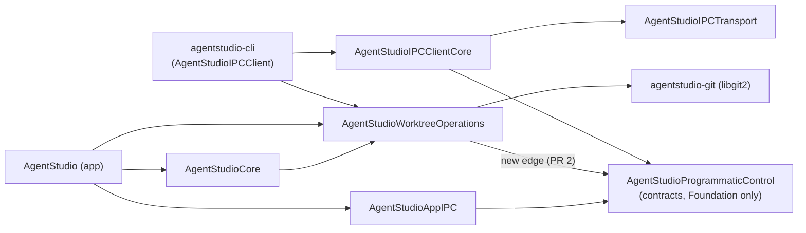
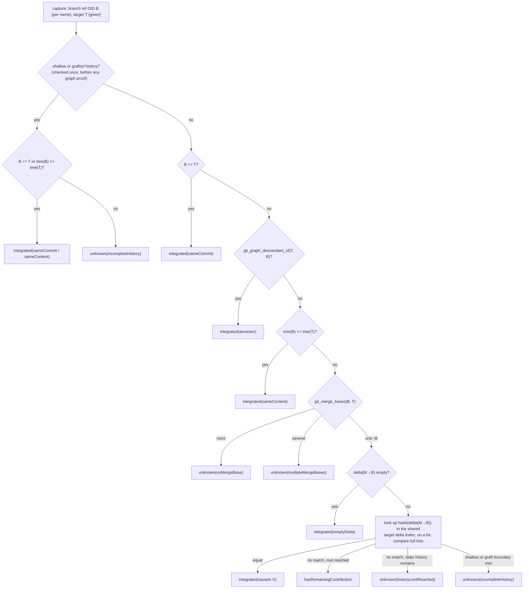
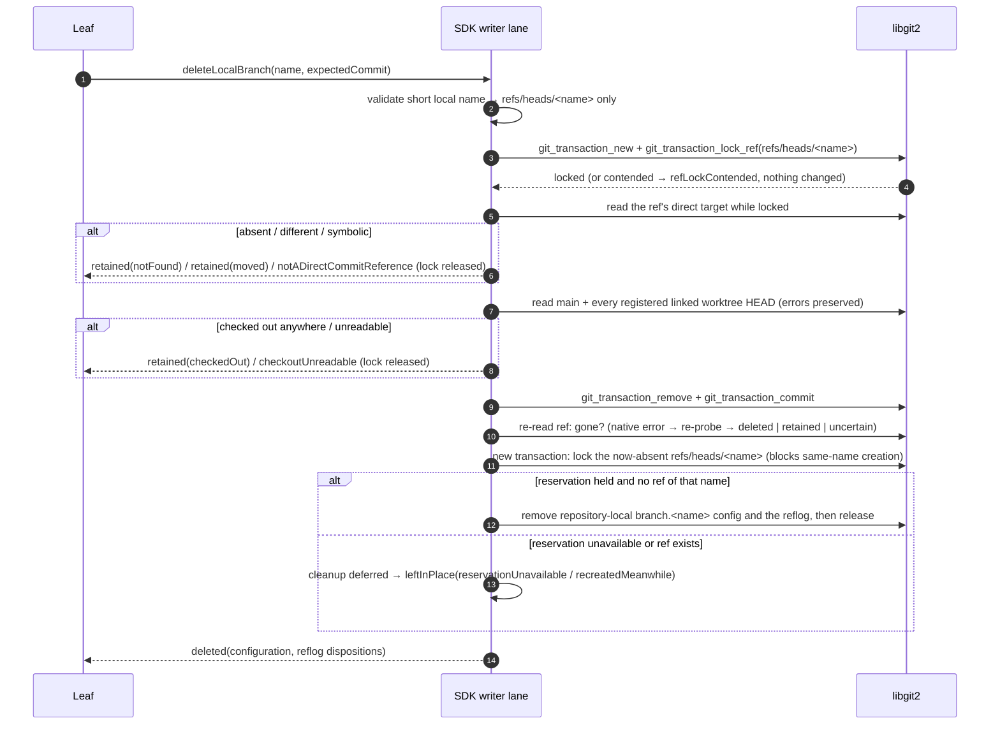
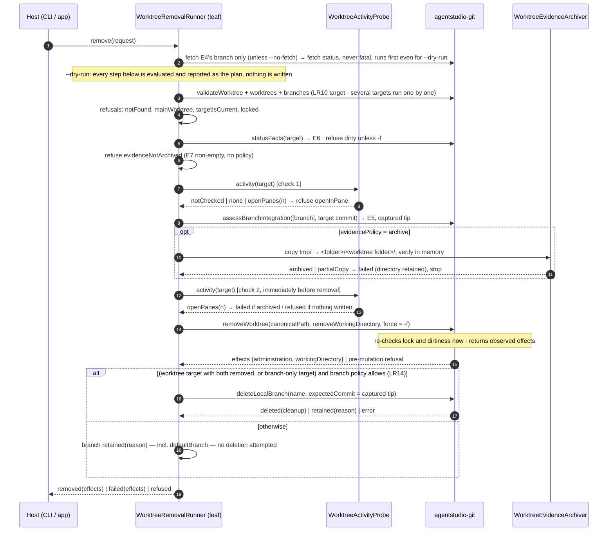
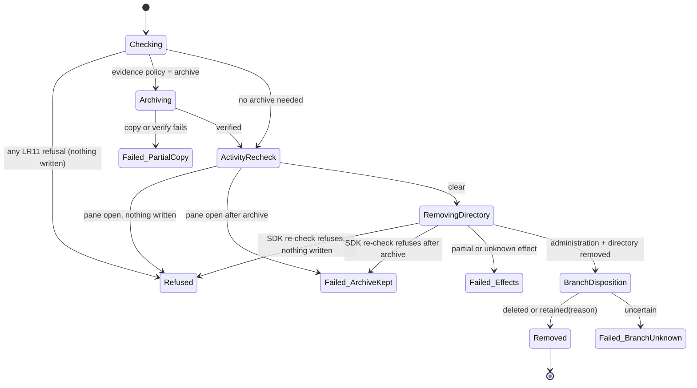
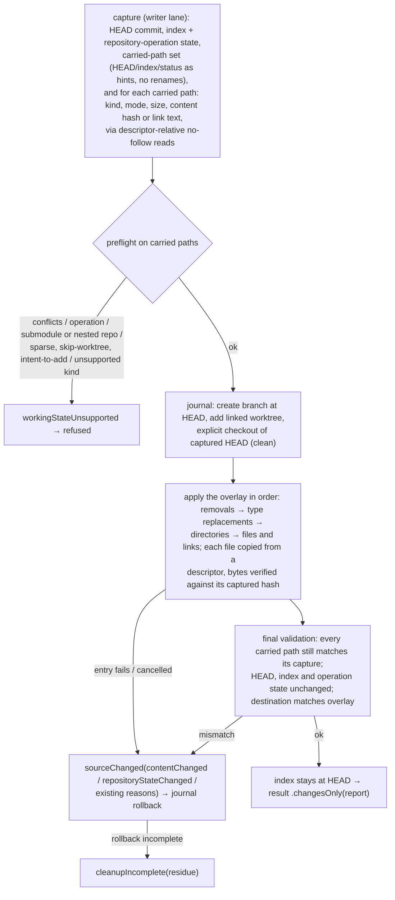
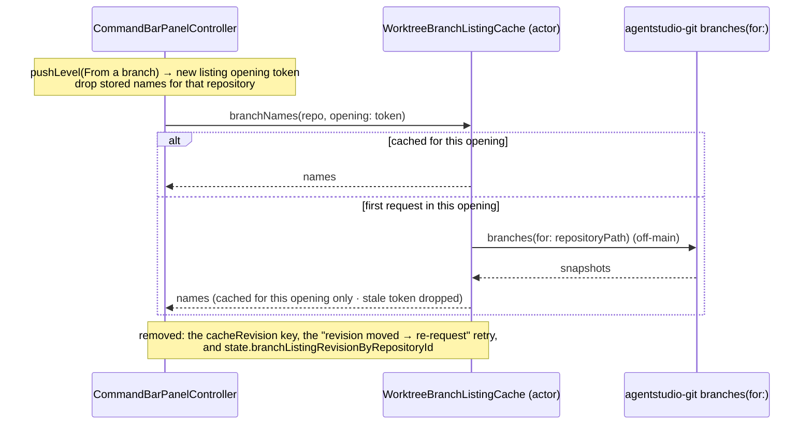
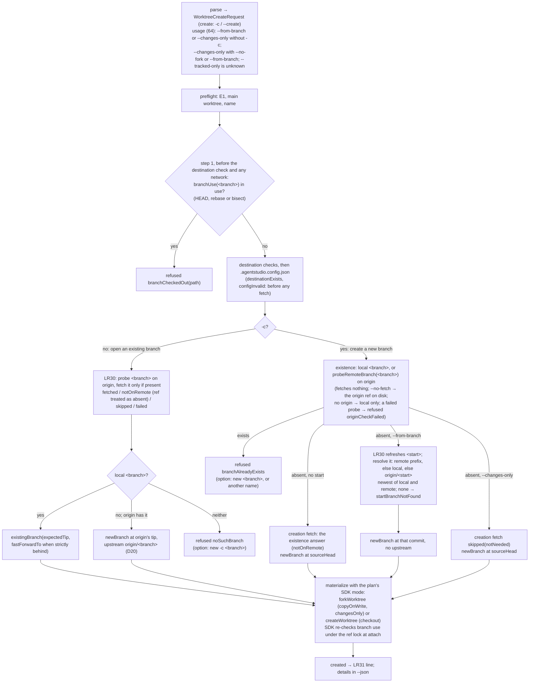
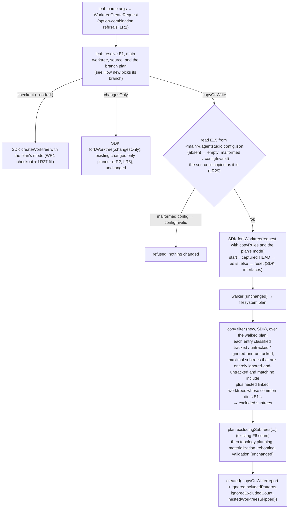

# Worktree lifecycle: how it is built

Date: 2026-10-09, revision 44 (D23 review round 2: Lead-authored choices list updated for fail-closed `-c` and changes-only). Revision 43 (design review of D23: the create field, noSuchBranch, a failed -c existence probe refuses originCheckFailed, stale same-name and plain-new text fixed). Revision 42 (D23: `-c` creates and refuses an existing name, local or on origin; `new` opens an existing branch or refuses noSuchBranch; the same-name start is gone). Revision 41 (D22: create's undo is confirmed only by its own re-read; another writer's change, even back to `from`, is reported and left alone). Revision 40 (other-family app review: a start is checked as a ref name, not against the destination policy; an attach-time `branchCheckedOut` keeps its fetch). Revision 39 (app review: branch use runs before the destination check; `configInvalid` precedes the fetch; created documents are Encodable only until PR 2; `.fetch` naming). Revision 38 (other-family SDK review B1: a ref commit can fail after its rename lands; create undoes a landed fast-forward and reports `branchMoveNotUndone` when it can't). Revision 37 (SDK review: HEAD is written under the branch lock before a single-ref commit, for forks too; create attaches last and needs no undo; the fill runs before the post-attach validation). Revision 36 (other-family design review F2, F4, C1, U1: the fetch survives refusals and failures; LR27 trace row; pinning applies only to the destination branch; compensation uses the locked expected-OID deletion. F1 is pre-existing and F3 belongs to PR 2, both logged). Revision 35 (round-1 verification R1–R3: step 4 keeps the existing stat-evidence rule so dirty as-is and changes-only forks stay valid; the copy validator checks the detached registration; a reset doesn't carry sparse state). Revision 34 (design review round 1, F1–F13: `aheadBehind` for strictly-behind; `probeRemoteBranch` only for `new`, `GitFetchResult` unchanged; one locked attach with a branch-use re-check for every fork; the reset validated after attach; reset filter, submodule removal and sparse stated; contract and choice lists completed). Revision 33 (owner decisions D13–D20: the SDK fork takes a start and resets the copy when the start isn't the source's HEAD; existing-branch forks and checkouts can fast-forward under a journaled ref move; the one-branch fetch reports a branch the remote lacks; the leaf gains a branch resolver and `--no-fork` replaces `--tracked-only`; `new` prints one line. See [How `new` picks its branch](#how-new-picks-its-branch-lr1-lr30-lr31)). Revision 32 (2026-10-07, LR1 `--from-branch` alone; nested repositories copied as content by the SDK). Revision 31 (LR29: the leaf's default-source refusal is removed; `new` copies its source as it is). Revision 30 (2026-10-05, app PR 1 review: the config file is read only for copy-on-write, so `--tracked-only` stays the escape from a bad config; a default-source status failure refuses `changesUnknown`; stale busy-lock text removed). Revision 29 (SDK review: one compiled matcher and a pruned single pass; submodules kept; independent repositories follow their location's rule; hard-link groups re-elect a kept primary; tracked set from every index entry). Revision 28 (D9 narrowed: busy locks removed; no build detection). Revision 27 (design review R20 F1–F5: tracked = HEAD or index, included descendants keep their ancestors, unreadable index refuses; default-source guard; declared busy locks over the whole build; one create contract; E15 binding, the shared path-pattern type, three-way creation result, LR1/LR28/LR29 trace). Revision 26 (owner D8–D12: one warm `new`; SDK copy filter for ignored paths and nested same-repository worktrees; leaf reads `.agentstudio.config.json` and checks the main worktree's state and busy locks; `fork` verb removed). Revision 25 (app PR 1 review: three-way E4 result; name-keyed default protection; pre-effect lock preflight; fetched lockResidue; prune gate on fresh assessment; stale-lock identity last). Revision 24 (Advisor R17-A1: GitLargeFileFill.scan complete | incomplete). Revision 23 (reviewer LFS-F1/F2/F5/F7: owned-temp residue, fork fallback on the fork's own descriptor, no false objectAbsent for source-restored paths). Revision 22 (Advisor LFS-A1–A6/D1: no index stat rewrite; removal safety uses the LFS cleanliness check; temp ownership; fill only non-carried paths; empty lfs.storage = default; destination-ownership assumption). Revision 21 (LR27 result: typed per-path misses and index-update status; fill problems never throw). Revision 20 (LR27: LFS fill from the local store in the SDK; LFS-aware status). Revision 19 (B7 stop: one fetching-read-failure document shared by list, remove and prune). Revision 18 (B6 batch: branch-retention options; failed entries carry the blocking lock's stop document). Revision 17 (B4 stop: `changesUnknown` / `evidenceUnknown` stop reasons; unknown never counts as clean). Revision 16 (batched carrier audit: typed stop details, lock observation, removal lock residue, branch dispositions, prune skips). Revision 15 (B4 stop: the list request carries `callerDirectory` like removal and prune, so `isCurrent` survives `--repo`). Revision 14 (B3b stop: `WorktreeFetchSkipReason.noTarget` when E4 is none). Revision 13 (B3b stop: `WorktreeFetchStatus.failed` carries an optional lock fact and lock residue). Revision 12 (B3b stop: the upstream is the SDK's exact `GitBranchSnapshot.upstreamName` ref; only an `origin` upstream is fetched, matching the shipped origin-only rule). Revision 11 (B3b stop: the E4 resolver for integration takes the fallback branch's upstream; `new`'s start point is unchanged). Revision 10 (S6 stop: refuse a source whose `.gitattributes` differs from HEAD, so the standard attribute lookup equals HEAD's). Revision 9 (S6 stop: verified LFS content for paths that aren't carried; other custom filter drivers refused). Revision 8 (S5: the fetch's lockResidue is optional; nil = not observed, for the legacy whole-remote fetch). Revision 7 (S4 implementation stop: removeWorktree returns partial and failed outcomes instead of throwing, so observed effects reach the caller). Revision 6 (owner decisions: open panes warn with options incl. `removeWithOpenPanes`; D1/D4/D6/D7 recorded). Revision 5 (review round 3: F12-V own-lock residue on every failure path; F15 dry-run gates pane closing).

Revision 4 history:
- Revision 4 corrects review round 2 and the Advisor's revision-3 notes:
  - F11: the fetch is reported, and dry-run removes nothing;
  - F12 and R3-SDK-2: exact lock facts and command-owned lock cleanup;
  - F13: several-target results and the exit code;
  - F14: the default branch is protected at deletion, not at worktree removal;
  - R3-SDK-1: the one-branch fetch's arguments.

Revision 3 history:
- Revision 3 applies the owner's Socratic round:
  - every stop carries reason, details and options;
  - automatic fetch of the default branch;
  - `tmp/` and git-lock refusals, with `--archive-to-main` and `--remove-stale-lock`;
  - several targets, `--dry-run`, safe retries;
  - sane-default policy values.
- It also closes review residuals F4, F5, F9 and F10, and the Advisor's two follow-ups.
- Revision 2 corrects review round 1: findings F1–F9, plus the Advisor's SDK pass.
- It covers the SDK contracts, deletion under a native ref lock, removal effects, the changes-only overlay, branch-list currentness, the live activity recheck, IPC prune, and the fast-CLI IPC contract and target graph.

It realizes [the Specification](2026-09-30-worktree-lifecycle-specification.md) (LR1–LR24) for [the Requirements](2026-09-30-worktree-lifecycle-requirements.md). It builds on the shipped [worktree CLI design](../2026-09-27-worktree-cli/2026-09-27-worktree-cli-program-design.md): the `AgentStudioWorktreeOperations` leaf, its outcome contract and its error mapper stay, and grow.

Anchors:
- agent-studio `07006b402`;
- agentstudio-git `origin/main` `8719325`;
- libgit2 as pinned by agentstudio-git, `f7164261`.

## The shape in one picture



| Unit | Owns | Depends on |
|---|---|---|
| **agentstudio-git PR (first slice)** | Git truth: integration assessment, expected-commit branch deletion, typed removal effects, the changes-only fork; then the copy-rules filter (LR28) as a second SDK PR | nothing new |
| **Creation follow-up (D13–D20): one SDK PR, then one app PR** | SDK: fork start + reset copy, one locked attach with the branch-use re-check, existing-branch fast-forward, upstream, `probeRemoteBranch`, `aheadBehind`, `branchUse`, `remoteNames`. App: the branch resolver, `--no-fork`, `--no-fetch` on `new`, the one-line output, the pin bump | the merged SDK PR |
| **App PR 1: agent CLI + branch-list currentness** | CLI `new` (copy-on-write by default; `--from`, `--changes-only`, `--no-fork`, `--from-branch`), `list` with state, `remove`, `prune`; the leaf's removal/prune/archive policy; the branch list read fresh per opening (LR22); one pin bump to the merged SDK | merged SDK commit |
| **App PR 2: app-executed lifecycle (IPC + UI)** | the app executor; the `worktree.*` IPC methods compiled into the CLI; Remove Worktree… and the changes-only fork in the UI; the open-pane refusal; waiting for the sidebar | PR 1, and the IPC team's fast-CLI + store PR |

**The SDK slice is one PR, built in three commit groups that are reviewed separately:**
1. integration assessment + branch deletion;
2. typed removal effects;
3. changes-only fork.

The Advisor proposed a three-PR stack. One PR follows the owner's rule that one owner-defined piece is one PR. The commit groups keep the separate review the stack would have given. The app stays on its current pin until the whole SDK slice is merged, then cuts over once (D6 sets the app PR cut).

## Target graph



- Every arrow points one way. `ProgrammaticControl` imports only Foundation, so nothing can loop back into the leaf, and libgit2 never reaches an IPC client.
- The new `WorktreeOperations → ProgrammaticControl` edge is deliberate. It updates the pinned allowlist in `CommandLineClientLeafTargetArchitectureTests.swift:34-38`.
- The IPC team's own new target, `AgentStudioCLIStore`, isn't used by worktree work: the worktree verbs persist no state.

## What exists (checked in code)

| Area | Fact | Anchor |
|---|---|---|
| SDK conventions | Reads go through `LibGit2BlockingReadExecutor`, mutations through the per-repository writer lane. Public payloads are `Codable, Equatable, Hashable, Sendable` with public initializers. OIDs are `String` (for example `GitHeadSnapshot.oid`). `GitRevisionTarget` wraps a revision **name** that is resolved later. | `LibGit2AgentStudioGitLocalClient.swift:62-150`; `GitStatusContracts.swift:9-20`; `GitRepositoryIdentity.swift:23` |
| SDK remove | `GitWorktreeRemovalResult{removedWorktreeID, removedWorkingDirectory, partialFailure: String?}`. `partialFailure` is returned whenever `metadataStillExists` is false, and that probe returns false on **every** read error. `removedWorkingDirectory` echoes the request. | `GitWorktreeContracts.swift:105-128`; `LibGit2WorktreeWriter.swift:123-181`; `LibGit2WorktreeRemovalSafety.swift:62-68` |
| libgit2 prune | `git_worktree_prune` recursively deletes the administration **first**, then the working directory; either can fail after a partial delete. | libgit2 `worktree.c:633-663` |
| libgit2 branch delete | `git_branch_delete` removes configuration before the ref. `git_branch_is_checked_out` collapses enumeration errors to false. The filesystem refdb's delete removes the **reflog before** comparing the expected value, so a moved branch keeps its ref but loses its reflog. The ref transaction path (`git_transaction_lock_ref`, then `git_transaction_remove`) reaches the compare without that reflog deletion. | libgit2 `branch.c:179-226`; `refdb_fs.c:1732-1791`; `refdb_fs.c:1242-1255`; `transaction.h:34-107` |
| SDK fork | The APFS planner walks the whole source and applies volume checks. The linked-worktree add helper uses `GIT_CHECKOUT_NONE`. The index is rebuilt from the captured HEAD. The rollback journal confirms ownership before any compensation and reports residue. Race reasons are `entryMissing`, `entryKindChanged`, `entryIdentityChanged` and `containmentEscape`. `GitWorktreeForkRejectionReason` is a `String` raw enum, so it can't take a payload case. Eligibility takes only source and destination. | `WorktreeForkPlanner.swift:20-85`; `WorktreeForkGitHandles.swift:73`; `WorktreeForkIndexBuilder.swift:13`; `WorktreeForkRollbackJournal.swift:6-153`; `GitWorktreeForkError.swift:20-52`; `AgentStudioGitSDK.swift:13` |
| SDK status | Status entries carry paths and flags, no content identity; they prefer the head-to-index path. | `GitStatusContracts.swift:137-171`; `LibGit2StatusReader.swift:185-249` |
| SDK diff | The public diff always does rename finding and line stats, so it's the wrong primitive for exact deltas. | `LibGit2DiffReader.swift:8-21,255-278` |
| Leaf | `WorktreeOperationRunner`, outcome types, error mapper, arguments, formatter; the CLI dispatches `worktree` before any IPC. | `Sources/AgentStudioWorktreeOperations/*`; `Sources/AgentStudioIPCClient/main.swift:13-32` |
| App creation | `WorktreeCreationCoordinator` holds publication, creates, then awaits `refreshWatchedFolder`. "From a branch" is a new branch at the chosen tip. | `WorktreeCreationCoordinator.swift:80-180` |
| App panes | Each pane carries `durableContextFacets.worktreeId`. Discovery removal clears the association and keeps the pane. | `WorkspaceMutationCoordinator.swift:259-276` |
| IPC conventions | Types are `IPC<Noun><Verb>Params` / `IPC<Noun><Verb>Result`. Descriptor structs live in `BuiltInDescriptors/` (for example `IPCSessionMethodDescriptors`). The fast path is `IPCBuiltInMethodCatalog.locallyResolvableDescriptors`. | `Sources/AgentStudioProgrammaticControl/`; IPC team, board 01a0cdc9, activity 3533 |
| **The L6 miss** | The branch cache re-queries only when app-wide `repoCache.cacheRevision` moves, and a ref-only change can leave it unchanged. The per-session `rootSessionGeneration` doesn't advance on `pushLevel`/`popLevel`, so reopening the branch list inside one command-bar session reuses stored names. | `WorktreeCreationPorts.swift:42-103`; `CommandBarPanelController+WorktreeCreation.swift:77-125`; `CommandBarState.swift:236-291,364-390` |

## Choices

1. **The SDK owns Git truth; the leaf owns lifecycle policy; hosts own what only they know.** No archive, activity or product policy enters the SDK. The leaf keeps product notions such as "no default target" and "detached worktree". The SDK assesses branches against a target it is given.
2. **One removal sequence for every host.** `WorktreeRemovalRunner` runs for the CLI, IPC and UI. Only the injected probe differs.
3. **No new cross-process lock.** Each destructive step re-checks at the moment it runs, using Git's own mutation boundaries:
   - the SDK's remove re-reads dirtiness and lock;
   - branch deletion compares the tip under libgit2's native ref lock.

   These are the ordinary per-ref locks Git itself uses, not a new repository-wide lock. The residual windows are named in the Specification's "Not promised".
4. **The branch list is current per opening** (LR22). Each time the branch-list level is pushed, the controller starts a new listing opening. It drops stored names for that repository, and the cache keys on that opening's token. Concurrent requests in one opening share one read, and stale responses are rejected by token. No event, bus fact, atom or observer is added.
5. **Integration is exact, read-only and bounded.** Graph proofs come first. Then one exact aggregate-delta comparison runs against up to 500 first-parent target commits, computed lazily and shared by every branch in the call. No patch-id, no rename detection, no normalization. A hash only finds candidates; the full lists are always compared.
6. **Changes-only is a public materialization of `forkWorktree`, with its own internal planner and materializer.**
   - It shares the fork's source/destination/branch capture, cancellation, linked-identity creation and rollback journal.
   - It doesn't share the APFS planner, which walks the whole source and checks volumes.
   - It performs an explicit checkout of the captured HEAD inside the journaled transaction, because the add helper doesn't check out.
7. **Branch deletion is ref-first, under a native ref transaction lock**, with metadata cleanup reported separately. It never calls `git_branch_delete` (config before ref) or `git_reference_delete` (reflog before compare).
   - Cleanup of `branch.<name>` configuration and the reflog runs under a **fresh** native lock on the now-absent ref. Holding that lock stops anyone creating a same-name branch while cleanup runs.
   - If that lock can't be taken, or a ref of that name exists, cleanup is deferred and reported `leftInPlace`. Nothing is removed on a guess.
8. **Removal reports what it observed, never what it assumes.** Directory and administration effects are observed independently after the prune call, on success and failure. An unreadable path is `unknown`, never "gone".
9. **App activity is checked live, twice.** The app's probe reads current pane associations each time it is asked. The leaf asks before archiving and again as the last step before it submits the SDK remove.
   - The SDK writer-lane queue wait after that is **not** observed: a pane opened then isn't blocked (Spec LR16, D5).
   - The alternative, a host callback executed inside the SDK lane, would put app knowledge into the SDK. It's rejected.
10. **Every stop is agent-actionable.**
    - One table in the leaf, `WorktreeStopCatalog`, maps each reason code to its message template and its options (flags or commands, with their effect). The per-call facts travel in a typed `WorktreeStopDetails` payload next to the reason, shared by refusal entries, list blockers and prune skips (JSON `"details"`):
      - `worktreeLocked(reason: String?)`; `targetIsCurrent(path)`; `notFound(target)`; `archiveDestinationExists(path)`, `archiveDestinationInsideWorktree(path)`;
      - `changesUnknown` (no details) and `evidenceUnknown(path)`: E6 or E7 couldn't be read, so the row fails closed (never removable, never a prune candidate) in LR11 order right after `dirty` and `evidenceInTmp`;
      - `dirty(staged, unstaged, untracked, conflicted, firstPaths)` and `evidenceInTmp(fileCount, byteCount, firstPaths)`, with `firstPaths` capped by `WorktreeLifecyclePolicy.firstPathsLimit` (10);
      - `openInPane(panes: [{paneId, title?}])`;
      - `gitLockHeld(WorktreeLockObservation)` and `gitLockUnidentified(resource)`. `WorktreeLockObservation` is `{path, resource, ageSeconds, gitProcessFound, looksStale}`; the SDK's `GitLockFact` gives path and resource, and the leaf's stale assessment adds the rest. The same payload rides on a failed entry whose cause was a blocking lock, as an optional `stop` document (reason, details, catalog options) next to the failure kind and effects. Typically this is a lock met after an earlier effect such as an archive.
    - Removal effects carry `lockResidue: [path]` from the SDK's removal and branch-deletion results, always present (`[]` when none was left), so a removed entry can't hide an owned lock. The fetch's own lock/residue encoding is unchanged.
    - Branch disposition is `deleted | retained(reason) | alreadyAbsent | unknown`; the SDK's `retained(.notFound)` maps to `alreadyAbsent`. A retained branch carries an always-present `options` array of full commands (Spec LR14):
      - `hasRemainingContribution`, `unknown(assessment)` → `agentstudio worktree remove --repo <repo> <branch> -D`;
      - `movedSinceAssessment` → `agentstudio worktree remove --repo <repo> <branch>` (run again to reassess);
      - `checkedOut` (in another worktree; details carry that worktree's path) → `agentstudio worktree remove --repo <repo> <that worktree path>`;
      - `checkoutUnknown` → the same `remove <branch>` (retry once the checkouts can be read);
      - `defaultBranch`, `branchPolicyKeep` (`--no-delete-branch`) → no options. A known `deleteLocalBranch` error after directory removal maps to `branchDeletionFailed(WorktreeGitErrorKind)`; `branchDeletionUncertain` stays for an unobserved outcome.
    - Prune entries are `removed | wouldRemove | skipped(WorktreePruneSkip) | failed(effects)`. `WorktreePruneSkip` is `{reason, details?, options}`. Its reasons are the applicable LR11 stop or `notIntegrated`, `assessmentUnknown(reason)`, `detached`, `defaultBranch` (Spec LR17). Options are full `remove` commands; `evidenceInTmp` also offers `prune --archive-to-main`. `WorktreePruneSummary` is `{target, fetch, applied, entries}`.
    - The formatter and the IPC result both render from it, so no view or caller spells options by hand.
    - Hard stops (`mainWorktree`, `defaultBranch`) carry no options.
11. **Fetch is automatic, one branch, fail-soft, always reported.**
    - The leaf resolves E4, then calls agentstudio-git's remote client with a new optional `branchName` on `GitFetchRequest`. For a non-nil branch, the SDK validates the branch and remote names and runs system git with an explicit refspec `+refs/heads/<branch>:refs/remotes/<remote>/<branch>`. It passes `--no-tags --no-prune --no-prune-tags --no-recurse-submodules --refmap=` so nothing else is fetched. A nil branch keeps today's whole-remote fetch.
    - E4 comes from a leaf **integration-target resolver**, separate from the shipped start-point resolver (which `new` no longer uses since r33; the app UI's "From Default" does). It takes `origin/HEAD` when present. Otherwise it takes local `main`, else `master`; when that branch has an upstream (SDK `GitBranchSnapshot.upstreamName`, the full ref from `git_branch_upstream_name`, e.g. `refs/remotes/origin/main`), E4 is that ref, used as-is with no parsing. The fetch needs a remote and a branch, so it is attempted only when the ref starts with `refs/remotes/origin/`: remote `origin`, branch = the remainder (the shipped resolver already trusts only `origin`). Any other upstream is assessed as-is, unrefreshed, and the fetch reports `failed(upstreamNotOrigin)`; no remote-name boundary is ever guessed. With no upstream, E4 is the local branch and the fetch reports `skipped(noRemote)`. With no E4 at all, the fetch reports `skipped(noTarget)`, ahead of `noFetchFlag`.
    - After a successful fetch, the leaf re-resolves E4 and assesses against the new commit. E4's branch (for `defaultBranch` protection) is the branch name in every case.
    - **E4 resolution has three outcomes**, never collapsed by `try?`: `resolved(branchName, ref, commit)`, `absent` (legitimately none), and `unreadable(branchName?, cause)`. The branch name comes from the resolver's pure plan (origin/HEAD, or main/master). It is known whenever the plan succeeded, even if the commit read failed. A refresh failure after a successful fetch is `unreadable(branchName, cause)` with the fetch status kept as `fetched(commit)`.
    - **Protection** uses `branchName` from `resolved` or `unreadable`. With `unreadable(nil, _)`, the removal runner deletes no branch in that call (`defaultBranchUnverified`: a branch-only target refuses, a worktree target's branch is retained). `-D` doesn't override it.
    - **Granularity** (Spec LR9): `list`, `prune` and `remove` continue on an `unreadable` target, with assessments `unknown(readFailed)`. `WorktreeFetchingReadFailure` is only for the repository or worktree-list read.
    - **Fetched residue:** `WorktreeFetchStatus.fetched` gains an optional `lockResidue: [path]`, mapped from a non-empty `GitFetchResult.lockResidue` and rendered on every outcome that carries the fetch status.
    - The status (`fetched(commit)`, `skipped(reason)`, `failed(reason, lock?, lockResidue?)`) goes into every list, removal, prune and plan outcome. The SDK's `GitLockedOperationFailure<GitDataPlaneError>` maps to `failed`: `lockHeld(fact)` → reason `gitLockHeld` + `lock{path, resource}`; `lockUnidentified(resource)` → `gitLockUnidentified` + `lock{resource}`; its non-empty `lockResidue` → `lockResidue`. Nil residue (not observed) and empty residue both omit the field. Fail-soft is unchanged.
    - A repository or worktree-list read failure after the fetch uses one shared `WorktreeFetchingReadFailure {kind: readFailed, leftovers: notNeeded, fetch}` for `list`, `remove` and `prune`; `new`/`fork` keep the generic failure.
    - The fetch is the one write allowed in a refusal, a dry-run or a prune preview. It runs first, before any lifecycle step, so a later stop never hides it (F11).
12. **Git locks are surfaced with exact facts, and only exact facts are actionable** (F12, R3-SDK-2).
    - **Path provenance.** Each SDK operation knows which resources it changes (the index, a named ref, `packed-refs`, `config`) and so which lock path each would use.
      - On libgit2 `GIT_ELOCKED`, the SDK checks whether that resource's exact lock file exists. If it does, it raises `lockHeld(GitLockFact{path, resource})`.
      - If it doesn't, the cause is permission or unknown: libgit2 maps `EACCES` to `GIT_ELOCKED` (`fs_path.c:744`), and a persistent worktree lock also reads "locked" (`worktree.c:432+`). Those keep their own errors (`permissionDenied`, the existing worktree-locked refusal), or `lockUnidentified(resource)` when a lock is certain but the file isn't.
      - For system git, the single mapping "Unable to create '<path>': File exists" is accepted only when the path is a lock inside this repository's Git directories.
    - **Command-owned cleanup evidence.** After each mutation, the SDK checks that every lock path it created is gone. Native free/unlock calls return nothing, so absence is observed, not assumed. A leftover becomes `lockResidue: [path]` in that operation's result or effects. Pre-existing foreign locks are never touched.
    - **Leaf.** The leaf adds the age and a best-effort "git process found" probe, then decides "looks stale" (older than `WorktreeLifecyclePolicy.staleLockAge`, 2 minutes, and no git process). This is a heuristic: a libgit2 writer, such as the app itself, isn't a `git` process.
    - **Removal.** `--remove-stale-lock` is offered only for a `lockHeld` fact. The final identity (device, inode, mtime, regular file) and staleness check runs **after** the last git-process probe, immediately before unlinking exactly that file; any change refuses.
- **Pre-effect lock preflight.** Before the first effect (archive), the removal runner observes the locks it will need (the index; the branch ref when deletion is planned). A held lock refuses `gitLockHeld` with its observation, in LR11 order. Dry-run runs the same preflight. A lock first seen after an effect is a failure with truthful effects (LR15).
- **Prune gate.** `prune --apply` gates the directory step on the fresh candidate assessment. A candidate that no longer qualifies becomes `skipped` with its reason, and nothing is removed.
13. **Several targets: resolve all, run each to the end, aggregate** (F13). The leaf resolves every input first and merges inputs that name the same worktree or branch. It then runs the removal sequence per target, in input order, never stopping early. The outcome is `removal(entries)`, each entry `removed | alreadyRemoved | refused(stop) | failed(effects) | planned(plan)`. Exit precedence: any failed → 2, else any refused → 1, else 0.
14. **Default-branch protection sits at branch disposition** (F14). A linked worktree checked out on E4's branch goes through the normal removal. Its branch is always `retained(defaultBranch)`, even with `-D`. Only a branch-only target naming E4's branch is a hard stop.
15. **Sane defaults live in one policy type.** `WorktreeLifecyclePolicy` in the leaf holds:
    - the 500-commit squash bound;
    - the 2-minute stale-lock age;
    - fetch on/off;
    - the `<main worktree>/tmp/<worktree folder>/` archive rule.
16. **IPC follows the fast-CLI rule (PR 2).**
    - The contracts are `IPCWorktreeCreateParams`/`Result` (with source and materialization), `Remove`, `Prune` and `List`, in `AgentStudioProgrammaticControl`, with one `BuiltInDescriptors/IPCWorktreeMethodDescriptors.swift`.
    - They are listed in `locallyResolvableDescriptors`, so a call goes straight to the app with one connection, one login and no per-call catalog fetch.
    - The app registers them from `App/IPCComposition/Worktrees/`.
    - The leaf's outcome and the IPC result are the same Codable shape, defined once in `ProgrammaticControl`. The CLI's `--json` prints it, and IPC returns it.

## Where each thing lives

| Entity | Semantic owner | Home | Status |
|---|---|---|---|
| E1 Repository, E2 Worktree | SDK (identity), leaf (discovery rules) | `GitWorktreeSnapshot`; leaf discovery (shipped) | existing |
| E3 Local branch | SDK | `GitBranchSnapshot`; `deleteLocalBranch`; the fork's and checkout's `existingBranch(expectedTip, fastForwardTo)` and `newBranch(upstream)` | modified |
| E4 Integration target | leaf | integration-target resolver (origin/HEAD, else main/master's upstream, else the local branch); the resolved commit is passed to the SDK as the target. `new` doesn't use E4: its start is E16 | new |
| E5 Assessment | SDK | `GitBranchIntegrationAssessment` (`AgentStudioGitContracts`) | new |
| E6 Working changes | SDK | `statusFacts` counts; removal safety | existing |
| E7 Evidence folder, E8 Archive | leaf | `WorktreeEvidenceArchiver` (in-memory verification, no files written) | new |
| E9 Pane activity | host | `WorktreeActivityProbe` (leaf port); app implementation over pane `worktreeId` | new |
| E10 Removal | leaf over SDK effects | `WorktreeRemovalRunner`; `GitWorktreeRemovalEffects` (SDK) | new |
| E11 Materialization | SDK (fork kinds); leaf (creation result) | SDK: `GitWorktreeForkMaterialization`, `GitWorktreeMaterializationResult` (copyOnWrite report gains `ignoredIncludedPatterns`, `ignoredExcludedCount`, `nestedWorktreesSkipped`). Leaf: `WorktreeCreatedMaterialization = .copyOnWrite(report) \| .changesOnly(report) \| .checkout(GitLargeFileFill)`, the one shape the CLI and IPC print. The copyOnWrite report gains `sourceState` (`asIs \| reset`), `submodulesNotAtStart` and, for a reset, `largeFiles` | modified |
| E16 Creation start | leaf (resolution); SDK (the as-is-or-reset rule) | leaf: `WorktreeCreationBranchResolver` → `WorktreeBranchPlan { target, start, branch, fetch }`. SDK: `GitForkStart = .sourceHead \| .commit(oid)`, compared with the captured HEAD inside the fork | new |
| E12 Outcome | leaf; wire shape in `ProgrammaticControl` | `WorktreeOperationOutcome` (leaf) → `IPCWorktree<Verb>Result` (contracts) | modified |
| E13 Branch list | App | `WorktreeBranchListingCache` keyed by listing-opening token | modified |
| E14 Git lock file | SDK (exact facts, own-lock cleanup evidence); leaf (age, staleness, explicit removal) | `GitLockFact`, `GitLockResource`, `lockResidue` (SDK); `WorktreeStaleLockAssessment` (leaf) | new |
| E15 Copy rules | leaf (the file and its decoding); SDK (pattern grammar and copy filtering) | leaf: `AgentStudioRepositoryConfig { worktree: WorktreeCopyConfig { include: [String] } }`, decoded with `Codable` from `<main worktree>/.agentstudio.config.json`, unknown keys ignored, never written by the tool. SDK: `GitPathPattern` (parse + match, gitignore grammar without negation; parse rejects `!`) and `GitWorktreeCopyRules { ignoredPaths: .copyAll \| .copyMatching([GitPathPattern]) }`. The leaf compiles `include` with it, so there's one matcher | new |

## SDK interfaces (first slice)

These are the contracts the implementation must match. Every public payload follows SDK convention: `Codable, Equatable, Hashable, Sendable`, public initializers, explicit tags on associated-value enums, and invalid states rejected at decoding.

```swift
// ── Integration (E5): one blocking read, one opened repository, never the writer lane.
func assessBranchIntegration(
    _ request: GitBranchIntegrationRequest
) async throws(GitDataPlaneError) -> GitBranchIntegrationReport

struct GitBranchIntegrationRequest {
    let repositoryPath: URL
    let branchNames: [String]          // short local names; empty → empty report, no walk
    let targetCommit: String           // an OID the caller already resolved (E4); validated as a commit
    let squashSearchCommitLimit: Int   // 0...10_000; 0 disables the squash search; leaf passes 500
}
struct GitBranchIntegrationReport {
    let targetCommit: String                                  // echoes what was assessed
    let assessments: [GitBranchIntegrationAssessment]         // one per requested name, input order
}
struct GitBranchIntegrationAssessment {
    let branchName: String
    let branchCommit: String?          // the captured ref OID; nil only when the ref is absent/unreadable
    let grade: GitBranchIntegrationGrade
}
enum GitBranchIntegrationGrade {
    case integrated(GitIntegrationProof)
    case hasRemainingContribution
    case unknown(GitIntegrationUnknownReason)
}
enum GitIntegrationProof { case sameCommit, ancestor, sameContent, emptyDelta, squash(commit: String) }
enum GitIntegrationUnknownReason {
    case branchNotFound, noMergeBase, multipleMergeBases,
         historyLimitReached, incompleteHistory, missingObjects, readFailed
}
// Throws only for repository-level failures (repository or target unopenable). A failure on one
// branch becomes that branch's .unknown(.readFailed), never an error for the whole batch.

// ── Branch deletion (E3): one complete mutation on the writer lane, no suspension inside it.
func deleteLocalBranch(
    _ request: GitDeleteLocalBranchRequest
) async throws(GitLockedOperationFailure<GitDeleteLocalBranchErrorReason>) -> GitDeleteLocalBranchResult
struct GitDeleteLocalBranchRequest { let repositoryPath: URL; let branchName: String; let expectedCommit: String }
enum GitDeleteLocalBranchResult {
    case deleted(GitBranchMetadataCleanup)
    case retained(GitBranchRetentionReason)       // ref, configuration and reflog all untouched
    case uncertain(GitDataPlaneError)             // a native error after the removal was staged, and the re-probe couldn't tell
}
struct GitBranchMetadataCleanup {
    let configuration: GitBranchMetadataDisposition   // removed | absent | leftInPlace(reason)
    let reflog: GitBranchMetadataDisposition
}
enum GitBranchMetadataLeftInPlaceReason { case recreatedMeanwhile, reservationUnavailable, removalFailed }
enum GitBranchRetentionReason {
    case notFound
    case moved(currentCommit: String)
    case checkedOut(worktreePaths: [URL])
}
enum GitDeleteLocalBranchErrorReason {         // no ref, config or reflog change; thrown inside GitLockedOperationFailure
    case invalidBranchName, refLockContended, checkoutUnreadable(worktreePath: URL?)
    case notADirectCommitReference
    case gitFailure(GitDataPlaneError)
}                                              // every case here means nothing changed

// ── Fetch (LR5): one optional field on the existing request; nil keeps today's whole-remote fetch.
struct GitFetchRequest { let repositoryPath: URL; let remoteName: String; let branchName: String? }
// branchName != nil: validated names; explicit single refspec; --no-tags --no-prune --no-prune-tags
// --no-recurse-submodules --refmap=. Result carries the fetched commit of refs/remotes/<remote>/<branch>.

// ── Locks (LR26): exact facts only.
struct GitLockFact { let path: URL; let resource: GitLockResource }
enum GitLockResource { case index(worktreePath: URL), reference(name: String), packedRefs, config }
// GitDataPlaneError gains:
//    case lockHeld(GitLockFact)                 // the exact lock file for a known resource exists
//    case lockUnidentified(GitLockResource)     // a lock is certain, but its file couldn't be established
//    case permissionDenied(path: URL?)          // EACCES that libgit2 reported as GIT_ELOCKED
// Every SDK operation that can take a lock carries its own-lock evidence on EVERY terminal path, success or failure:
//   success results:  `lockResidue: [URL]` (normally empty) on GitWorktreeRemovalEffects,
//                     GitDeleteLocalBranchResult.deleted / .retained / .uncertain, GitFetchResult;
//   thrown failures:  struct GitLockedOperationFailure<Reason>: Error { let reason: Reason; let lockResidue: [URL] }
//                     — thrown by deleteLocalBranch (Reason = GitDeleteLocalBranchErrorReason, the former error cases)
//                     and fetch (Reason = GitDataPlaneError);
//   removeWorktree:   never throws after its first mutation. It keeps `throws(GitDataPlaneError)` for pre-mutation
//                     refusals only (main, locked, dirty, path mismatch, unreadable before any change). Once prune has
//                     been called, every outcome — complete, partial, or failed — is RETURNED as GitWorktreeRemovalResult
//                     whose effects carry the observed administration/directory dispositions, `failure` (a closed
//                     GitWorktreeRemovalFailureKind, nil on complete success) and `lockResidue`. A thrown error could
//                     not carry the observed effects that choice 8 requires.
//   fork:             GitWorktreeForkResidueKind gains .lockFile, so cleanupIncomplete lists it with the other residue.
// The original failure is never replaced; the leaf maps both into the outcome and never reports a clean finish
// while `lockResidue` is non-empty.
// Fetch only: `lockResidue` is optional ([URL]?) on GitFetchResult and on a fetch's GitLockedOperationFailure.
// nil = not observed (the legacy whole-remote fetch, branchName == nil, unchanged); [] = observed, none left
// (the one-branch fetch the worktree commands use).

// ── Removal (E10): observed effects replace the String partial.
struct GitWorktreeRemovalResult {               // name kept; String partial removed (hard cutover)
    let removedWorktreeID: GitWorktreeID
    let effects: GitWorktreeRemovalEffects
}
struct GitWorktreeRemovalEffects {
    let administration: GitRemovalEffect        // removed | retained | partial | unknown
    let workingDirectory: GitRemovalEffect      // …plus notRequested
    let failure: GitWorktreeRemovalFailureKind? // nil on complete success; closed native kinds, no text
}
// Pre-mutation refusals (main, locked, dirty, path mismatch) stay GitDataPlaneError, unchanged.

// ── Changes-only fork (E11).
enum GitWorktreeForkMaterialization { case copyOnWrite, changesOnly }
// GitForkWorktreeRequest gains `materialization` (no default).
// forkWorktreeEligibility(sourceWorktreePath:destinationPath:materialization:). For .changesOnly, "available"
// means only the capability; volume and APFS checks are skipped, while root/parent/overlap validation
// stays. The operation's own preflight remains authoritative.
enum GitWorktreeMaterializationResult {
    case copyOnWrite(GitWorktreeMaterializationReport)
    case changesOnly(GitChangesOnlyMaterializationReport)   // changedTrackedPaths, copiedUntrackedPaths
}
// Rejection: GitWorktreeForkError.rejected keeps its String reason enum for existing cases; changes-only
// working-state refusals use a new case:
//   GitWorktreeForkError.workingStateUnsupported(GitWorktreeWorkingStateRefusal)
//   GitWorktreeWorkingStateRefusal { reason: conflicts | operationInProgress | submoduleChanged |
//     nestedRepository | sparseOrSkipWorktree | intentToAdd | unsupportedEntryKind | customFilter | attributesChanged;
//     relativePath: String? }
// Source races: GitWorktreeForkSourceRaceReason gains contentChanged and repositoryStateChanged.
```

The leaf maps each SDK error through its existing total mapper, extended case by case. No raw libgit2 text reaches output.

**Creation follow-up (D13–D20), one SDK PR, breaking, hard cutover in one pin bump.** The fork stops being "always at the captured HEAD". Its old doc comment rejected a start point because a different base "would turn the copied filesystem into an ambiguous overlay". The reset below defines that overlay exactly, so the reason no longer holds.

```swift
// ── Fork start and branch target (LR1, LR29).
public enum GitForkWorktreeMode {
    /// A new local branch at `start`. `upstream` writes branch.<name>.remote and .merge.
    case newBranch(name: String, start: GitForkStart, upstream: GitBranchUpstream?)
    /// An existing local branch that no worktree has checked out and whose tip, read under its native
    /// ref lock, is `expectedTip` (else `branchMoved`). With `fastForwardTo`, the ref first moves from
    /// `expectedTip` to that commit, which must descend from it; the move is journaled and undone if
    /// the fork fails. The start is the resulting tip.
    case existingBranch(name: String, expectedTip: String, fastForwardTo: String?)
    case detached(start: GitForkStart)
}
public enum GitForkStart { case sourceHead; case commit(String) }   // OID, validated as a commit
public struct GitBranchUpstream { let remoteName: String; let branchName: String }
// The as-is-or-reset rule lives here, next to the captured HEAD: a start equal to the captured HEAD
// keeps today's as-is copy (sourceState .asIs); any other start resets the copy (sourceState .reset).
// .changesOnly accepts only a start equal to the captured HEAD; anything else is an invalid request.
// GitWorktreeMaterializationReport gains: sourceState: .asIs | .reset; submodulesNotAtStart: [String];
// largeFiles: GitLargeFileFill? (present for .reset only).

// ── The plain checkout (`--no-fork`) takes the same branch shapes.
public enum GitWorktreeCreateMode {
    case newBranch(name: String, startPoint: GitRevisionTarget, upstream: GitBranchUpstream?)
    case existingBranch(name: String, expectedTip: String, fastForwardTo: String?)
    case detached(startPoint: GitRevisionTarget)
}

// ── Does the remote have this branch? Asked only by `new` (LR30); `fetch` is unchanged, so LR5's
// list/remove/prune fetch pays no extra round trip.
func probeRemoteBranch(_ request: GitRemoteBranchProbeRequest) async throws(GitDataPlaneError)
    -> GitRemoteBranchPresence
struct GitRemoteBranchProbeRequest { let repositoryPath: URL; let remoteName: String; let branchName: String }
enum GitRemoteBranchPresence { case present(commit: String); case absent }
// Runs `git ls-remote --exit-code <remote> refs/heads/<b>`: exit 0 → present (its OID), exit 2 → absent
// (git computes 2 on the client, for every transport; the runner keeps the exit code, no stderr parsing),
// anything else → thrown, and the leaf fetches nothing. insteadOf and credential helpers apply as for fetch.

// ── Ahead/behind of two commits (read executor, git_graph_ahead_behind), for LR1's strictly-behind and
// diverged tests. countCommitRange can't answer this: it returns .unrelated when the base isn't an ancestor.
func aheadBehind(_ request: GitAheadBehindRequest) async throws(GitDataPlaneError) -> GitAheadBehind
struct GitAheadBehindRequest { let repositoryPath: URL; let localCommit: String; let otherCommit: String }
struct GitAheadBehind { let ahead: Int; let behind: Int }   // commits only local has / only other has

// ── Configured remote names, for `--from-branch <remote>/<name>` (read executor, git_remote_list).
func remoteNames(for repositoryPath: URL) async throws(GitDataPlaneError) -> [String]

// ── Branch use, the same rule at the leaf's step (1) and at the SDK's attach: a branch is in use when a
// worktree's HEAD names it, or a worktree is rebasing it (rebase-merge/head-name, rebase-apply/head-name)
// or bisecting from it (BISECT_START), as `git worktree add` treats it.
func branchUse(_ request: GitBranchUseRequest) async throws(GitDataPlaneError) -> GitBranchUse
enum GitBranchUse { case free; case inUse(worktreePath: URL) }

// ── New errors: fork rejection `branchMoved` and `branchCheckedOut(path)`; `createWorktree` gains the same
// two, plus `GitDataPlaneError.branchMoveNotUndone(branchName:fromOID:toOID:)` for a fast-forward its own undo
// couldn't confirm (D22). `branchNotAtCapturedHead` is deleted (an existing branch no longer has to be at the
// captured HEAD). Fork residue gains kind `branchMoveNotUndone`, with the ref name in `location` and no tip; the
// leaf adds both commits from its own plan.
// `.copyAll` with a start other than the captured HEAD is an invalid request (only the app UI uses .copyAll,
// always at .sourceHead).
```

- **The reset copy** (copyOnWrite, start ≠ captured HEAD; steps 3 and 4 apply to every fork; steps 1, 2, 5, 6 and 7 only to a reset) runs inside the fork's journaled transaction, before finalization, so any failure rolls the whole fork back:
  1. The copy filter excludes an entry only when it is neither in the captured HEAD tree nor an ignored path E15 includes (submodules are HEAD gitlinks, so they stay). That leaves out the source's work in progress: untracked files that aren't ignored, independent nested repositories outside an included ignored folder, and entries only in the source index (staged additions, intent-to-add). The last group matters because the reset's baseline below is HEAD, so a checkout would leave them behind as strays. Inside an included **ignored** folder everything is kept, nested repositories included (SwiftPM checkouts under `.build*/`). The filter's matched-directory short-cut (`WorktreeForkCopyFilter.swift`, which keeps a matched subtree unclassified) still applies to ignored folders. A matched folder that **isn't** ignored is classified entry by entry in reset mode, so untracked files in it don't slip through.
  2. After materialization, rehoming, the index rebuild from the captured HEAD, and the copy's own validation, the SDK checks out E16's tree into the destination with that index as the baseline, forced. Files whose content differs from E16 get E16's content. Files tracked in the baseline and absent at E16 are removed. Untracked files (the included ignored ones) are left alone, except where E16 tracks the same path. Files equal to E16 aren't rewritten, so they keep their copied timestamps. The index becomes E16's tree, and HEAD becomes the branch (or detached) at E16. The baseline is passed explicitly (`baseline_index` = the rebuilt index), never left to libgit2's default. That default is HEAD's tree, so if HEAD already named E16, files tracked at the source but absent at E16 would read as untracked and survive. The existing `checkoutCapturedHead` helper (`WorktreeForkGitHandles.swift`) is the seam to extend. The linked worktree is added detached at the captured HEAD (for every fork, see "One attach" below). The copy's validation checks that detached registration at the captured HEAD, where `validateHead` today checks the branch ref; step 4 checks the branch after the attach.
  3. **Attach, under the branch's ref lock** (`git_transaction_lock_ref`, as branch deletion does in `LibGit2LocalBranchDeletionWriter.swift:155-167`). Moving the attach out of `git_worktree_add` also moved it out of libgit2's only checked-out guard: `git_repository_set_head` checks other worktrees only when the current HEAD is symbolic, and here it's detached. With the lock held, the SDK:
     - re-reads branch use (`branchUse`) and refuses `branchCheckedOut(path)`;
     - for an existing branch, checks the tip equals `expectedTip` (else `branchMoved`) and writes the fast-forward;
     - for a new branch, creates it at E16;
     - writes the destination's HEAD naming the branch, still under the branch lock;
     - commits a transaction that holds only the branch ref. A multi-ref libgit2 transaction releases its refs one at a time in hash order, so with HEAD in the same transaction the branch lock could be released before HEAD named the branch (SDK review F1).

     Each step is journaled; a failure rolls the whole fork back. The writer lane only serializes callers inside one process, so this lock is what stops two CLI processes both attaching to `feat`.
  4. **Validate after the attach.** For every fork: HEAD names the branch at E16 (or is detached there for `.detached`), the index tree equals E16's tree, and the returned `GitWorktreeSnapshot` is re-read after the attach, so it reports the branch, not the detached copy. Stats follow the existing evidence rule (`WorktreeForkIndexValidation`): an unrefreshed entry is allowed only where the file differs from the index. That keeps a dirty as-is fork and a changes-only fork valid, and after a reset it means every entry is refreshed except the LFS-filled ones. After a reset the expected skip-worktree set is empty (not `plan.gitTopology.rootSparse`), or a sparse source would fail `sparseStateMismatch`. Fault seams are added after the reset checkout and after the attach.
  5. LR27's fill runs over E16's LFS paths whose file is a pointer, through the fork's own destination descriptor. It runs right after the attach (it enumerates HEAD's tree) and before step 4's validation, which therefore covers the filled result. An unchanged LFS file keeps the source's real content, because the checkout doesn't rewrite it.
  6. Submodules: a submodule E16 has at another commit, or not initialized (new at E16, so an empty directory), is listed in `submodulesNotAtStart`. Submodule checkouts are not changed. A submodule E16 doesn't have is removed with its directory by the forced checkout (libgit2 `checkout.c` REMOVE with recursive rmdir) and isn't listed.
  7. A sparse source's skip-worktree bits don't survive: the forced checkout recreates every missing E16 path, so the result is a full checkout of E16 (a stated limit in LR29). The rehomer doesn't write the source's sparse state (`info/sparse-checkout`, `core.sparseCheckout` in `config.worktree`) into a reset destination, so a later `git switch` doesn't make it sparse again.
- **The fast-forward** (`existingBranch` with `fastForwardTo`) on a fork is the compare-and-swap of step 3, journaled with its old tip and undone if a later step fails. An undo that fails is reported as residue `branchMoveNotUndone`, never silently. **`createWorktree`** orders things so no undo exists. It validates everything, registers the worktree detached and checks out the pinned start, validates, and only then attaches (lock, branch-use re-read, compare-and-swap or create, HEAD, single-ref commit) as its last step that can fail. A new branch's upstream is written after the commit; if that write fails, rollback deletes only the branch this call created. No existing branch is ever moved by a failing call. One native exception exists (other-family SDK review B1): libgit2 renames a ref's lockfile into place and only then fsyncs the parent directory, so with fsync enabled a commit can report failure after the ref has already moved. After any commit error, create re-reads the ref. A landed fast-forward is undone with the existing locked compare-and-swap (`LibGit2BranchMoveUndo`, re-reading after its own commit). If the undo can't be confirmed, the call fails with `GitDataPlaneError.branchMoveNotUndone(branchName, from, to)` instead of the original error, so the moved branch is always reported, never left silently. Confirmed means this call's undo moved the branch back and its re-read saw `from`. The undo writes only while the branch is still at `to`, so when another writer changed it in the window, even back to `from`, the undo leaves that change alone and the call still reports `branchMoveNotUndone` (D22): the payload is the attempted transition, and the agent should know another writer touched the branch.
- **One attach for every fork.** An as-is fork (start equals the captured HEAD) also adds the linked worktree detached at the captured HEAD and attaches through step 3; it just skips the checkout in step 2. So there is one branch-attach mechanism, with one guard, for as-is and reset forks alike, and an as-is fork that also fast-forwards needs nothing special.
- **Compensation never uses `git_branch_delete` on a branch someone else could write (design review U1).** That call removes the branch's config, and with it the reflog, before comparing the ref. Undoing a branch this call created (in the fork journal and in create's rollback) uses the existing locked expected-OID deletion primitive that LR14's branch deletion uses. A branch that moved meanwhile is left in place and reported as residue. The carrier is the exception: its name is unique and owned by the call, so plain deletion is fine.
- **Upstream** is written only when the request names one; the leaf names it only for a branch created from the same-named remote branch.
- **Callers.** The app's UI fork and its two UI `createWorktree` calls pass `.newBranch(name, start: .sourceHead, upstream: nil)` and `upstream: nil`. Their behavior doesn't change.

## Leaf interfaces (app PR 1)

`AgentStudioWorktreeOperations` owns requests, policy and outcomes; the wire shape of each outcome is the `IPCWorktree<Verb>Result` type in `ProgrammaticControl` (PR 2), which the CLI's `--json` also prints.

```swift
enum WorktreeOperationRequest: Sendable, Equatable {
    case create(WorktreeCreateRequest)                                                      // LR1-LR4, LR28, LR29
    case list(start: URL, callerDirectory: URL?, targets: [String], fetchPolicy: WorktreeFetchPolicy) // LR9; callerDirectory → isCurrent, nil from app hosts
    case remove(WorktreeRemovalRequest)                                                    // LR10-LR16, LR25, LR26
    case prune(WorktreePruneRequest)                                                       // LR17
}
struct WorktreeCreateRequest: Sendable, Equatable {
    let start: URL                               // --repo or current directory: finds E1 and its main worktree
    let branch: String
    let create: Bool                             // -c / --create: make a new branch; without it, open an existing one (D23)
    let source: WorktreeCreateSource             // .mainWorktree (default) | .worktree(URL) (--from)
    let startBranch: String?                     // --from-branch <start>, as typed (local, `<remote>/<name>`, or origin's)
    let materialization: WorktreeCreateMaterialization // .copyOnWrite (default) | .checkout (--no-fork) | .changesOnly
    let fetchPolicy: WorktreeFetchPolicy         // .fetch (default) | .skip (--no-fetch); `.defaultBranch` is renamed `.fetch`
}
struct WorktreeRemovalRequest: Sendable, Equatable {
    let start: URL                               // --repo or current directory
    let callerDirectory: URL?                    // for targetIsCurrent; nil from app hosts
    let targets: [String]                        // branch names or paths, handled one by one
    let discardWorkingChanges: Bool              // -f
    let branchPolicy: WorktreeBranchPolicy       // .deleteIfIntegrated | .deleteAtObservedCommit (-D) | .keep
    let evidencePolicy: WorktreeEvidencePolicy   // .requireEmpty | .archiveToMain | .archive(to: URL) | .discard
    let fetchPolicy: WorktreeFetchPolicy         // .fetch | .skip
    let removeStaleLock: Bool                    // --remove-stale-lock
    let closePanes: Bool                         // IPC/UI only; the CLI never sets it
    let removeWithOpenPanes: Bool                // IPC/UI only (D5): proceed past openInPane; panes lose their worktree link
    let dryRun: Bool                             // --dry-run -> .planned
}
struct WorktreePruneRequest: Sendable, Equatable {
    let start: URL; let callerDirectory: URL?
    let apply: Bool; let evidencePolicy: WorktreeEvidencePolicy; let fetchPolicy: WorktreeFetchPolicy
}

/// What a host knows about panes. The CLI passes one that answers `.notChecked`;
/// the app passes a live one that reads current pane associations on each call.
protocol WorktreeActivityProbe: Sendable {
    func activity(forWorktreeAt canonicalPath: URL) async -> WorktreeActivity
}
enum WorktreeActivity: Sendable, Equatable { case notChecked, none, openPanes([WorktreePaneReference]) }

enum WorktreeOperationOutcome: Sendable, Equatable {
    case created(WorktreeCreatedSummary)
    case listed(WorktreeListingSummary)            // + target, fetch status, per-row state, removable, blockers
    case removal(WorktreeRemovalReport)            // entries in input order: removed | alreadyRemoved | refused | failed | planned
    case pruned(WorktreePruneSummary)
    case refused(WorktreeOperationRefusal)         // nothing written; carries its options
    case failed(WorktreeOperationFailure)          // create/fork keep `leftovers`; remove carries `effects`
}
/// One row per stop reason: message, details, options. Hard stops have no options.
struct WorktreeStopCatalog { static func entry(for reason: WorktreeStopReason) -> WorktreeStopEntry }
struct WorktreeStopOption: Sendable, Equatable { let action: WorktreeStopAction; let effect: String } // .flag / .command
enum WorktreeLifecyclePolicy {
    static let squashSearchCommitLimit = 500
    static let staleLockAge: Duration = .seconds(120)
    static let fetchesDefaultBranch = true
    static func archiveToMainDestination(mainWorktree: URL, worktreeFolder: String) -> URL  // <main>/tmp/<folder>/
}
```

Follow-up stop reasons (D13–D20): `branchCheckedOut(path)` (option: `cd <path>`, work in the existing worktree), `branchMoved` (option: run again), and `branchAlreadyExists` gains its options (`new <branch>` without `-c`, which opens it; another name). D23 adds `noSuchBranch` (option: `new -c <branch>`) and `originCheckFailed` (with the reason; option: `--no-fetch`). `trackedOnlyExcludesSource` is deleted. The shared option that named `--tracked-only` names `--no-fork`: "a plain checkout of tracked files at the same commit; no ignored files or build outputs".

New stop reasons: `defaultBranch` (hard, branch-only targets only), `mainWorktree` (hard), `gitLockUnidentified` (retry only), `notFound`, `alreadyRemoved`, `startBranchNotFound`, `unsupportedWorkingState`, `targetIsCurrent`, `worktreeLocked`, `dirty`, `evidenceInTmp`, `openInPane`, `gitLockHeld`, `archiveDestinationExists`, `archiveDestinationInsideWorktree`. `forkUnavailable` gains the `changesOnly` option.

## How integration is assessed



**Delta.**
- A delta is the list of leaf entries `(raw path bytes, old mode, old OID, new mode, new OID)`, from `git_diff_tree_to_tree`.
- Options:
  - `GIT_DIFF_SKIP_BINARY_CHECK`;
  - no `git_diff_find_similar`;
  - no patch or hunk construction;
  - submodule ignore forced to none;
  - no type-change-trees flag (a type change is a delete plus an add);
  - no pathspec, case folding or Unicode normalization.
- Entries are sorted by raw path bytes, never by Swift `String` equality or locale. User config (`diff.ignoreSubmodules`, `core.filemode`, `core.ignorecase`, attributes, drivers) can't change the result.

**Shared target index.**
- The index is built lazily in one call:
  - walk T, then parent 0, then parent 0 again, up to `squashSearchCommitLimit` candidates;
  - compute each candidate's delta against its first parent once;
  - keep a hash → candidates bucket;
  - stop as soon as every unresolved branch is answered.
- Candidate numbering:
  - T is candidate 1, and candidate 500 is evaluated;
  - candidate 501 isn't;
  - a parent is observed only to decide whether history remains.
- Merge commits are candidates, compared to parent 0. A root ends the walk, and it isn't a candidate. A shallow or grafted boundary is detected and gives `incompleteHistory`, never an empty-tree delta.
- `missingObjects` means objects the proof needs: commits, trees and parents. Blob and gitlink OIDs are compared, never read.
- The index lives for one call only: no cache and no actor. Nothing writes objects, the index, refs, configuration or working files.

**The 500 bound limits recall, not runtime.** Heavy ancestry or very large trees stay on the read executor. If a further object or byte budget proves necessary, it returns `unknown` with a named reason. It never truncates a list and compares a prefix.

## How a branch is deleted



- **Order.** The compare happens **after** the lock is held; transaction removal takes no expected value itself, so the locked compare is essential. The checkout scan reuses the SDK's linked-worktree administration reading, and a read failure refuses deletion.
- **Metadata cleanup.**
  - Only the repository-local `branch.<name>` section and the branch's reflog are touched, never global or included configuration.
  - Cleanup runs only if no ref of that name exists after the commit. If a same-name branch was created meanwhile, cleanup is `leftInPlace(recreatedMeanwhile)`.
  - Cleanup isn't atomic with the ref deletion; partial cleanup is reported, not hidden.
- **Residual race.** The ref lock doesn't stop another process checking the branch out in the moment after the HEAD scan. This is named, not locked out (choice 3).

## How a removal runs



**`refused` vs `failed`.** `refused` is returned only when nothing was written. A check that fails after an archive exists returns `failed`. That covers the second activity check and the SDK's own re-check, and the failure carries directory `retained`, administration `retained`, branch `retained` and evidence `archived`. The archive is never deleted to fake a no-change result. A branch-only target skips the directory steps.

### Removal states



| Failure | Detected by | Contained by | Reported effects |
|---|---|---|---|
| Archive copy/verify fails | in-memory comparison | stop before the directory | directory retained, branch retained, evidence `partialCopy(path)` |
| Pane opened, or SDK re-check refuses, after archive | activity check 2 / SDK | nothing removed | failed; archive kept; everything else retained |
| Prune fails partway | SDK observed effects | branch step skipped | administration/directory `partial` or `unknown`, branch retained |
| Branch moved / checked out / unreadable checkout | `deleteLocalBranch` | branch kept, metadata untouched | `removed`, branch retained(reason) |
| Metadata cleanup incomplete | SDK cleanup disposition | ref already gone | `removed`, branch deleted, cleanup warning |
| Native error after staging deletion | SDK re-probe (`uncertain`) | — | failed: directory removed, branch `deleted`/`retained`/`unknown` as observed |
| A git lock blocks a step | `lockHeld(path)` | stop at that step | refused if nothing written, else failed with effects; options: retry, or `--remove-stale-lock` when stale |

## How a changes-only fork runs



- **The overlay.** For each carried path, the destination ends with the source's file on disk: absent, file, directory or symlink, with the same mode. It never gets an index-only version. That makes LR2's cases fall out naturally:
  - a staged delete followed by recreation copies the recreated file;
  - a staged new file that was then deleted is absent in the source, and absent in HEAD, so nothing happens;
  - a staged change undone on disk matches HEAD, so it isn't carried.
- **Filters (S6 stop, 2026-09-30).** libgit2's checkout runs only its built-in CRLF and ident filters (`checkout.c:1556`, `filter.c:191-208`), never external drivers such as Git LFS. agent-studio itself uses LFS (`web/**/*.png` and others). So:
  - for each path in captured HEAD whose attributes name `filter=lfs` and which isn't carried, the materializer parses the HEAD blob as an LFS pointer (SHA-256 oid plus size). If the source worktree's file is a regular file whose bytes hash to that oid and size, it copies those bytes, descriptor-relative and verified, over the checked-out pointer. Otherwise it falls back to the local LFS store (LR27, below), and only if that misses does it leave the pointer the checkout wrote;
  - this reuses the SDK's existing LFS pointer parsing and verification (`LibGit2LargeFilePointerCleanliness`);
  - a path whose attributes name any other filter driver is refused in preflight as `workingStateUnsupported(customFilter, path)`;
  - attribute evaluation must follow captured HEAD. libgit2 looks at the worktree file and the index before HEAD (`attr.c:82-90, 520-540`). So preflight first refuses `workingStateUnsupported(attributesChanged, path)` when any `.gitattributes` differs from HEAD (carried, or staged differently). When none differs, the standard lookup yields HEAD's rules exactly. No separate HEAD-only evaluator is added;
  - no external process and no network.
- **Validation.** Validation is per carried path plus repository state, not a whole-worktree snapshot. Paths that aren't carried may change. Rollback, residue and cancellation reuse the existing journal: ownership is confirmed before compensation, a created branch is compensated only at its expected OID, and cancellation returns only after compensation.
- **Reporting.** Counts are net: changed HEAD-tracked paths, and copied untracked paths.

## How Git LFS files are filled (LR27)

- **Owner and placement.** The SDK owns it, inside the worktree writer lane, right after checkout for `createWorktree` (`new --no-fork`) and right after a reset copy's checkout inside the fork (LR29). The changes-only fork's existing LFS materializer gains the same store as a fallback. The leaf only reports.
- **Store.** `lfs.storage` from the repository config if set (relative to the common git dir), else `<common git dir>/lfs/objects/<oid[0:2]>/<oid[2:4]>/<oid>`. It is read-only and local; no `git-lfs` binary, no network.
- **Per path** (HEAD attributes `filter=lfs`, checked-out file equals the HEAD blob's pointer, pointer parsed by the existing `LargeFilePointer`):
  1. open the store object no-follow; require a regular file whose size equals the pointer's size;
  2. copy it to a temporary file in the destination directory with an APFS clone (`clonefile`, falling back to a verified byte copy off-APFS), and verify the SHA-256 equals the pointer's oid;
  3. set the index entry's mode, then rename it over the pointer;
  4. a missing or mismatched object leaves the pointer and adds the path to `missing`.
- **No index rewrite.** The fill never writes the index. libgit2's public API can't lock, re-read and write the index atomically, so rewriting it would risk discarding a `git add` made during the fill, or adopting the stats of a file other than the verified one (Advisor LFS-A1/A2). The cost: until a `git status` with git-lfs installed refreshes those stats, status re-hashes size-matching LFS files. That's correct, just slower for large payloads.
- **LFS-aware cleanliness, one rule in two readers.** `statusFacts` (E6) **and** `LibGit2WorktreeRemovalSafety` (the LR11 `dirty` check) both reuse `LibGit2LargeFilePointerCleanliness`: a worktree-modified delta on a `filter=lfs` path whose file is the pointer, or content matching it (size + SHA-256), is unchanged. Staged, mode, type, conflict and untracked facts keep refusing. This also covers worktrees made by other tools.
- **Temp ownership.** Only a temporary file this call positively created (a successful `fclonefileat` or `O_EXCL` open) is ever unlinked; a failed acquisition such as `EEXIST` leaves the name alone and reports `writeFailed(errno)`.
- **Store location.** Unset or empty `lfs.storage` means `<common git dir>/lfs`; a non-empty value is resolved against the common git dir. Objects live under `<storage>/objects` in both cases (git-lfs's layout).
- **Changes-only scope.** The fork's fallback fills only HEAD LFS paths that aren't carried, aren't under a carried ancestor or type replacement, and weren't already restored from the source. Carried pointer bytes and modes stay as captured, and a source-restored path is never reported `objectAbsent`. It works through the fork's already-owned destination descriptor, never reopening or re-resolving the destination by pathname.
- **Concurrency assumption.** The destination worktree was created moments earlier by this same call, and no other process knows its paths until the call returns. The fill doesn't tolerate other writers inside it during that window (a write between the pointer check and the rename can be replaced). The in-process writer lane serializes our own writers. This is a stated limitation, not a guarantee.
- **Result.** `createWorktree` returns `GitWorktreeCreation {worktree: GitWorktreeSnapshot, largeFiles: GitLargeFileFill}`. `GitLargeFileFill {materializedCount, missing: [GitLargeFileFillMiss {path, reason: objectAbsent | objectMismatch | readFailed(errno) | writeFailed(errno)}], residuePaths: [String], scan: complete | incomplete(GitLargeFileScanFailure: readFailed(errno) | gitFailure(kind))}` (no index field). `incomplete` is reported when the repository, HEAD or attributes can't be read far enough to enumerate LFS candidates; it never throws, and no placeholder `missing` entry is invented. `residuePaths` lists temporary files this call created but couldn't unlink; it's empty when cleanup is observed complete. The fill takes no git lock, since it never writes the index. The leaf renders LR27's `largeFiles` with `git -C <worktree> lfs pull` when anything is missing.
- **Failure.** Nothing in the fill throws or deletes the new worktree. `LibGit2WorktreeWriter`'s existing rollback-on-any-error must not cover the fill phase: fill runs after creation is committed. A per-path problem is a typed `missing` entry. Only errors before the worktree exists keep today's thrown, rolled-back behaviour.

## How the branch list stays current (PR 1)



Worktree rows keep their existing paths: discovery for add and remove, and enrichment for the checked-out branch (LR20, LR21; unchanged code).

## The app executor (PR 2)

`WorktreeLifecycleCoordinator` lives in `App/Coordination`. It is `@MainActor` and owns no state. For each app-executed operation it:
1. resolves the target from the workspace;
2. hands the leaf a **live** probe, which reads current pane associations on MainActor each time the leaf asks.
   - With `closePanes` on a real run, before the leaf's first activity check, the coordinator dispatches the existing pane-close action for each associated pane and awaits each pane's closed fact. A pane that doesn't close stops the removal with `openInPane`, listing it.
   - With `dryRun`, the coordinator dispatches nothing. The plan lists the panes it would close, and the leaf plans as if they were closed (F15). Pane closing is a durable workspace write, so the preview guard must sit here, before any host action, not only in the leaf;
3. runs the leaf runner off-main;
4. awaits the existing `refreshWatchedFolder` for the affected watched folder (creation keeps its publication hold);
5. returns the outcome.

The IPC methods and the UI both call it.

| Surface | Change |
|---|---|
| Contracts (`AgentStudioProgrammaticControl`) | `IPCWorktreeCreateParams`/`Result` (source, materialization), `IPCWorktreeRemoveParams`/`Result`, `IPCWorktreePruneParams`/`Result`, `IPCWorktreeListParams`/`Result`; `BuiltInDescriptors/IPCWorktreeMethodDescriptors.swift`; listed in `locallyResolvableDescriptors` |
| App IPC composition | `App/IPCComposition/Worktrees/` registers `worktree.create/remove/prune/list` and dispatches to the coordinator. Privilege: the existing `appCommandExecute` for mutations and `workspaceRead` for list, since the standalone CLI already performs the same work with no credential. |
| `AppCommand` (UI verbs) | New `removeWorktree` and `forkWorktreeChangesOnly` spec entries (label, `CommandIcon`, help, surface policy), with IPC classified in the same change as reachable through the `worktree.*` methods. The existing creation commands keep their interactive role. |
| UI | Worktree row menu → Remove Worktree…. The command bar opens a removal step (Features/CommandBar) showing the assessment, changes, branch disposition and evidence choice (`NSOpenPanel` for the archive folder). Close Panes and Remove dispatches the existing pane-close action per listed pane, then removes. New Worktree → Fork gains the changes-only row. |

## How `new` picks its branch (LR1, LR30, LR31)



- **Owners.** The leaf owns resolution, because choosing which branch an agent meant is product policy over Git facts. The SDK stays policy-free. It receives an exact mode with OIDs and enforces it under its locks, including the as-is-or-reset rule (which needs the captured HEAD) and the branch-use re-check at attach.
- **Reads.** `branchUse`, `branches(for:)`, `remoteNames(for:)`, `resolveRevision` for `refs/heads/<n>` and `refs/remotes/<r>/<n>`, `probeRemoteBranch`, and `aheadBehind`. All of them run on the SDK read executor or the remote client, off-main.
- **Step (1) first.** The branch-use check runs before any network call, so a refusal costs nothing. The SDK repeats it under the ref lock at attach, which is what makes it hold against another process.
- **A start is validated as a git ref name, not as a new destination (other-family app review F2).** The destination-name policy (including its length cap) applies only to `<branch>`. Any existing local or remote branch can be a start (D15).
- **No same-name start any more (D23).** A `--from-branch` start is only used with `-c`, and a `-c` name that exists is refused before any start is read, so the old same-name rule is gone.
- **Starts with a remote prefix.** A `<start>` whose first segment names a configured remote (`remoteNames`) is that remote's branch. Otherwise it is a local branch, otherwise `origin/<start>`. Agents write `origin/x` meaning origin's branch, so the remote reading wins over a local branch literally named `origin/x`.
- **One newest-of helper** serves step (2) and a local `--from-branch` start. It uses `aheadBehind(local L, remote R)`:
  - equal → L;
  - ahead 0 and behind > 0 → R (strictly behind);
  - ahead > 0 → L, with `localOnlyCommits` = ahead.

  Step (2) turns R into `fastForwardTo: R`. A `--from-branch` start only uses R's OID and never moves the local ref. If the read fails, `new` fails `readFailed` with nothing changed; it never guesses a direction. When LR30 reported `notOnRemote`, R doesn't exist and the helper isn't called.
- **Pinning.** Every resolved ref becomes an OID before the SDK call. An existing destination branch carries `expectedTip`: if it moves between resolution and the attach, the call refuses `branchMoved`. A start read from another ref (`--from-branch`, or `origin/<branch>` for step 3) is pinned to the OID the resolver saw: the new branch is created at that commit even if that ref moves meanwhile, and no lock is taken on it.
- **`--no-fork` at `sourceHead`** passes the source worktree's HEAD OID as the checkout's start point. An unborn source HEAD refuses as today's checkout does.
- **Fetch.** A new `WorktreeCreationFetchStep` sits beside `WorktreeFetchStep` and shares `WorktreeFetchFailureMapper`. Its own status type is `WorktreeCreationFetchStatus = fetched(commit, lockResidue?) | notOnRemote | skipped(noFetchFlag | noRemote | notNeeded) | failed(reason, lock?, lockResidue?)`, so LR5's `WorktreeFetchStatus` and its outputs are unchanged. It probes first; `absent` → `notOnRemote`, and the resolver ignores that remote ref; `present` → LR5's one-branch fetch; a probe failure → `failed`, with no fetch. The branch it refreshes is:
  - `<branch>` from origin, when the call opens an existing branch (no `-c`: steps 2–4);
  - `<start>`'s name from its remote, or from origin for a local or bare start, with `-c --from-branch`;
  - with `-c` and no start, nothing is fetched: the creation fetch reports the existence probe of `<branch>` (`notOnRemote` when absent).
  - With `-c`, the existence of `<branch>` on origin is its own `probeRemoteBranch` read, separate from the refresh. A present answer refuses `branchAlreadyExists` (detail: the origin ref). A failed probe refuses `originCheckFailed` with the reason and nothing created, failing closed (Lead design choice under D23; option `--no-fetch`). `--no-fetch` answers from the `origin/<branch>` ref on disk; no `origin` remote means only local branches count.
  - No such remote → `skipped(noRemote)`; `--no-fetch` → `skipped(noFetchFlag)`; `--changes-only` → `skipped(notNeeded)`.
- **The fetch survives every outcome (LR30, design review F2).** Once the fetch step has run, every creation outcome carries its `fetch` document: created, and also a refusal (`branchAlreadyExists`, `startBranchNotFound`, `branchMoved`, …; the preflight `branchCheckedOut`, `destinationExists` and `configInvalid` come before the fetch, so they carry none; a `branchCheckedOut` from the SDK's attach-time re-check is a race after the fetch and carries it) or failure (SDK rollback) that happens after it. `WorktreeOperationRefusal` and `WorktreeOperationFailure` gain an optional creation `fetch` that is set only after the fetch step. JSON prints it, and the human output adds the existing fetch line (the shared `WorktreeCommandLineFormatter+Fetch` rendering that list/remove/prune use) when the fetch ran. The fork's own cleanup evidence (`leftovers`) stays separate from it.
- **Output (LR31).** `WorktreeCommandLineFormatter+Created` renders one line: the materialization, then notes in a fixed order (existing branch, fast-forwarded, kept local, from remote, fetch failed, large files left as pointers). Every other report field is in `--json` only. The created document gains `branch`, `start` (with `localOnlyCommits`) and `fetch`. They are Encodable only in this PR (the CLI only writes them); PR 2's IPC result makes them Codable and adds `localOnlyCommits.remoteName` to the wire so a decoder can rebuild the note.
- **Parser and dead code.** `--tracked-only` is removed: an unknown option, exit 64, with no alias. `--no-fork` maps to `.checkout`, `new` accepts `--no-fetch`, and `--from` with `--from-branch` is accepted. `trackedOnlyExcludesSource` is deleted, and so is the runner's use of the default start-point resolver for creation (the app UI's "From Default" keeps its own).

## How `new` copies (LR28, LR29)



- **Owners.**
  - The **SDK** owns the copy filter, because it's a property of a copy-on-write fork and needs the fork's plan and topology. It takes rules as data and knows no file names.
  - The **leaf** owns the repository's config file, which belongs to Agent Studio, not to Git. It runs no checks on the source's working state or branch (LR29).
- **SDK request.** `GitForkWorktreeRequest` gains `copyRules: GitWorktreeCopyRules { ignoredPaths: .copyAll | .copyMatching([GitPathPattern]) }`. Excluding nested same-repository worktrees isn't a field: it always applies to copy-on-write forks, because copying another live worktree of the same repository is never wanted, and flattening one into an independent repository silently duplicates someone else's work.
  - The app's own UI fork (New Worktree → Fork) keeps `.copyAll` until app PR 2 decides its UI. That's an explicit, recorded difference, not a second code path: same SDK call, different data.
- **Classifying ignored paths.** The filter runs over the walker's plan, not over a Git status list. A non-recursive status misses ignored files inside an ignored directory that also holds tracked content, and the SDK's ignored-status mode always recurses (review R20).
  - A path is **tracked** when it's in the captured HEAD tree or in the captured source index. That's the same union the changes-only planner uses, so a HEAD file staged for deletion and recreated on disk is still tracked and copied with its working content. If the source index can't be captured, the fork refuses `sourceIndexUnreadable` rather than treating everything as untracked.
  - An untracked path is **ignored** by libgit2's per-path ignore check with the source repository's rules.
  - A directory is excluded as a unit only when every entry under it is ignored and untracked, **and** no include pattern matches it, any of its ancestors, or any path beneath it. A directory with an included descendant is descended, keeping that descendant's chain of directories. A file is excluded when it's ignored, untracked, and neither it nor an ancestor matches.
  - Tracked paths and untracked non-ignored paths are never excluded. A matching ignored directory is kept whole.
  - Matching uses `GitPathPattern` (SDK): gitignore grammar without negation, so patterns are an unordered set and their order doesn't matter. Ignore rules are the source repository's own. A submodule (a gitlink in HEAD or the index) is a tracked descendant, so its chain is always kept. An independent nested repository is an opaque entry classified by its location like any path, never by its siblings. A kept nested repository is copied whole, including files it ignores itself, such as `vendor/ghostty`'s build outputs. Patterns are compiled once; the classifier is one top-down pass over the sorted plan that stops descending at the first excluded or matched directory.
- **Nested worktrees of the same repository.** The topology planner already classifies nested Git entries. A nested linked worktree whose common directory resolves to E1's common directory is added to the excluded subtrees **before** topology capture, so it's never flattened or re-homed. Submodules keep today's handling: they are rebuilt for the destination. Independent nested repositories and linked worktrees of *other* repositories are copied as content and never opened (agentstudio-git PR #20).
- **Exclusion uses the existing seam.** `WorktreeForkFilesystemPlan.excludingSubtrees` (added for F6) removes excluded subtrees from the plan, so the materializer, validator, finalization and clean adoption never see them. Each path of a hard-link group is classified on its own; when the cloned primary is excluded and another path is kept, a kept path becomes the primary, so exclusion never fails a fork.
- **The config file.** `.agentstudio.config.json`, decoded with `Codable` into `AgentStudioRepositoryConfig { worktree: { include: [String] } }`. Unknown keys are ignored, so the file can grow. It's read from the main worktree, because it's a repository-level declaration; a worktree's local edits don't change another worktree's copy. agent-studio commits its own file listing its caches: `.build*/`, `Frameworks/`, `node_modules/`, `BridgeWeb/node_modules/`, and the vendor build outputs `scripts/vendor-worktree.sh` names. It lists no `tmp/`.
- **Removing `fork`.** The parser no longer knows `fork`, so it's a usage error, exit 64, whose single line names `new -c --from`. There's no alias (hard cutover).
- **Proof seams.**
  - SDK: integration tests on temporary repositories for each LR28 case, through `forkWorktree`, asserting the plan's excluded subtrees and the destination's contents.
  - Leaf: unit tests for config decoding and option combinations; integration tests on temporary repositories that a dirty main (untracked-only, and with an unstaged change) and a main on a non-default branch are copied as they are by default `new -c`, with the main worktree unchanged.
  - Real checkout: `new -c` from the agent-studio main checkout, then `mise run build` without setup.

## What runs where

Owner, 2026-09-30: "make sure you properly create separations, nothing in main actor". This follows the project's performance rule: publish on MainActor, derive off it.

| Work | Where it runs | Why |
|---|---|---|
| Integration assessment, status reads, lock facts | agentstudio-git read executor (blocking pool) | libgit2 is blocking I/O |
| Branch deletion, worktree removal, forks | agentstudio-git writer lane (a serial queue per repository) | one mutation at a time per repository |
| One-branch fetch | agentstudio-git remote client (system git subprocess), awaited off-main | network and process I/O |
| `tmp/` archive copy and verification | the leaf, `@concurrent nonisolated` | filesystem I/O |
| Stale-lock age and "git process found" probe, stale-lock removal | the leaf, `@concurrent nonisolated` | filesystem and process I/O |
| Refusal order, stop catalog, outcome building | the leaf, a plain async function, no actor | pure logic |
| CLI host | the CLI process's own async main; no MainActor work at all | no UI |
| App: resolving the target from the workspace | MainActor, one synchronous read of topology values, handed off as plain values | the state lives in MainActor atoms |
| App: the pane-activity probe | MainActor, one synchronous read of pane associations per check | the state lives in MainActor atoms; no work beyond the read |
| App: running the leaf | off-main (`Task` / `@concurrent`); the coordinator only awaits | keeps MainActor free while git works |
| App: `closePanes` | MainActor dispatch of the existing pane-close action, then await its closed fact | pane closing is an existing MainActor-owned action |
| App: sidebar refresh after the operation | the existing `refreshWatchedFolder` (filesystem actor), awaited | existing path |
| App: the branch list | `WorktreeBranchListingCache` actor, off-main SDK read; MainActor only records the returned names | existing path, new key |
| Publishing the outcome (IPC reply, command-bar state) | MainActor, assignment only | UI publication |

No atom, store, observer, timer or bus event is added. The coordinator owns no state and makes no domain decisions: it sequences reads, the off-main leaf call, and the refresh.

## Concurrency and ordering

- **SDK:** mutations for one repository run FIFO on its writer lane. Assessment and status reads run on the read executor. Branch deletion holds a native ref lock only for its compare-and-remove.
- **Across processes:** no new lock. Correctness rests on:
  - the SDK remove re-checking at execution;
  - the locked compare in branch deletion;
  - the preserved-error checkout scan.
- **App MainActor:** only the probe reads and outcome publication run there. Everything else runs off-main.
- **Branch list:** one read per repository per listing opening, shared.

## Cross-cutting realization

| Obligation | Realized by |
|---|---|
| No raw Git text (WR5 carried) | closed SDK effect, failure and cleanup kinds; the leaf's total mapper extended |
| Privacy | the archiver writes only to the caller's folder; OTLP carries operation and outcome kinds only |
| No CLI state files | the archive is verified in memory; nothing else is written |
| Performance | lazy shared delta index; cheap proofs short-circuit; the 500 bound is leaf policy data; `list` duration measured on this repository |
| Safety | refusal order is one leaf function; locks are never overridden; branch deletion is compare-under-lock; effects are observed, not assumed |

## Proof seams

| Seam | Real vs fake | What it observes |
|---|---|---|
| SDK integration | real temporary repositories via the existing Git fixtures, with scrubbed config; the #388/#395 objects as a checked-in, non-thin pack plus manifest, imported with system Git (no network); targets pinned at an advanced commit where #388 and #395 sit at first-parent positions 14 and 4 of `07006b402` | every grade, proof and unknown; bound edges 1/499/500/501 and limit 0; byte-exact paths and modes; binary, symlink, gitlink; shallow and graft boundaries; a batch with one bad branch; before/after filesystem snapshot plus mutation monitor proving zero writes; #388 against its own squash → `sameContent`, both against the advanced target → `squash` |
| SDK branch deletion | real repositories; a second native Git client moves the tip or checks out the branch at a named barrier seam | loose and packed refs; moved after lookup (ref, config and reflog untouched); checked out in main or linked; unreadable linked administration; lock contention; cleanup success, failure and recreated-meanwhile; tags and remotes untouched |
| SDK removal effects | real repositories with permission faults on the owning prune path | partial administration; partial directory; unreadable observation → `unknown`; `removeWorkingDirectory: false` → `notRequested` |
| SDK changes-only | real repositories; the existing named fault and cancellation seams | the LR2 payload cases; LR3 refusals; content-changed-with-same-status, HEAD move, symlink swap → `sourceChanged`; failure or cancellation after every phase → rollback or exact residue; the APFS clone path is never invoked; injected non-APFS host facts prove the gate is bypassed (not real non-APFS proof) |
| Fetch | a local bare repository as the remote (no network) | E4 advances after the fetch, both with `origin/HEAD` and with only an upstream on local `main`; `--no-fetch`; a failed fetch and a held ref lock fall back with their status. `new`'s probe: present → fetched; absent → `notOnRemote` with no fetch run and a stale tracking ref ignored; a probe failure (unreachable remote) → `failed` with no fetch run |
| SDK fork start | real repositories; the existing named fault seams plus new ones after the reset checkout and after the attach; a barrier seam before the attach | a dirty source forked onto another commit: E16's tracked files and index, HEAD on the branch at E16 and the returned snapshot saying so; no untracked non-ignored or staged-only files; included ignored files and a nested repository under an included ignored folder with the source's timestamps; tracked files equal at both commits keeping clone identity and timestamps while a source-modified one is rewritten; a path E16 tracks over an included ignored file; `submodulesNotAtStart` for a changed and a new submodule, and a removed submodule gone; an unchanged LFS file keeping real content and changed ones filled; a sparse source coming out full; a start equal to the captured HEAD as is; `existingBranch` with a moved tip → `branchMoved`, nothing changed; another worktree checking out the branch at the barrier → `branchCheckedOut`, rolled back; a fast-forward undone after an injected failure in each later phase, and a failed undo reported as `branchMoveNotUndone`; `.changesOnly` or `.copyAll` with another start rejected; `aheadBehind` for equal, behind, ahead, diverged and unrelated pairs; `probeRemoteBranch` present, absent and unreachable against a local bare remote; `branchUse` for HEAD, rebase-merge, rebase-apply and bisect |
| Leaf creation resolution | real SDK and repositories with a local bare `origin` and a second bare remote | each LR1 step and `--from-branch` form (Spec proof row LR1–LR4), including a branch deleted on origin with its stale tracking ref (absent), `noSuchBranch` without `-c`, `branchAlreadyExists` for `-c` with a local and with an origin-only name, `originCheckFailed`, `branchCheckedOut` before any fetch, and a remote-prefixed start over a same-named local branch; `--no-fork` at the same start as the fork; the LR31 line and `--json` for each; `--tracked-only` → exit 64 |
| Git locks | real repositories with planted index, ref, packed-refs and config locks, fresh and older than the stale age, with and without a running git process; an `EACCES` directory; a worktree lock; a denied unlink of a command-owned lock (named fault seam) | each blocker reported by its actual path and resource; EACCES → `permissionDenied`, not a lock; `lockUnidentified` offers retry only; `--remove-stale-lock` removes exactly that file after its identity re-check; own-lock leftovers appear in `lockResidue` on success and on failure (a checkout read failing after the ref lock is taken, then a denied release; a failed fetch; an uncertain delete), next to the original failure; foreign locks survive refusals |
| Leaf removal/prune | real SDK and repositories; the activity probe is a scripted double that answers per call (a host fact) | refusal order; `failed` (not `refused`) after the archive; effects projection; branch step skipped on partial effects |
| CLI | real top-level dispatch with injected output | goldens for every outcome, exit codes, no IPC client or credential read |
| Branch list | the real cache and SDK against a temporary repository | pop and re-push inside one command-bar session re-reads after an external delete, create, rename or pack; one read shared within an opening |
| App executor + IPC (PR 2) | the real registry and coordinator, real SDK; await the typed topology fact, never time | parity with the CLI; `dryRun` + `closePanes` leaves the pane open and workspace state unchanged, while the real run closes and awaits it; a pane opened after check 1 → refusal or failure; the sidebar reflects the change when the call returns; no per-call catalog fetch |
| Real app | debug build, CLI and plain `git` from outside | rows and branch lists per LR20–LR22 |

## Trace

| U | R | E | Owner | Interface | Shape and home | State | Failure | Proof |
|---|---|---|---|---|---|---|---|---|
| L3, L14 | LR1 copy, then set the branch | E2, E3, E11, E16 | leaf parser + runner + `WorktreeCreationBranchResolver` | `create(WorktreeCreateRequest)` | `WorktreeBranchPlan` → SDK fork/create mode | — | `branchCheckedOut`, `branchAlreadyExists`, `noSuchBranch`, `originCheckFailed`, `startBranchNotFound`, `branchMoved`, `changesOnlyNeedsFrom`; usage (64): `--from-branch` or `--changes-only` without `-c`, `--changes-only` with `--no-fork`/`--from-branch`, `--tracked-only`, `fork` | leaf parser + resolution integration |
| L3, L13 | LR27 LFS fill from the local store | E11 | SDK (fill after checkout, reset copy and changes-only fallback); leaf reports | `createWorktree` / `forkWorktree` result `largeFiles` | `GitLargeFileFill` (SDK), rendered by the leaf (LR31 note `<n> large files left as pointers`) | after checkout, or after a reset's attach; never writes the index | never throws; per-path `missing` with reason; `scan: incomplete` when it can't enumerate | SDK fill tests (existing) + reset-copy LFS test + CLI golden for the note |
| L14 | LR28 copy rules | E11, E15 | SDK copy filter over the walked plan | `forkWorktree(.copyOnWrite, copyRules)` → `excludingSubtrees` | `GitWorktreeCopyRules`, `GitPathPattern`, report fields | before topology capture | `sourceIndexUnreadable`, `configInvalid` (leaf) | SDK filter integration; real-checkout `new` |
| L14 | LR29 as-is or reset copy | E2, E6, E16 | SDK fork (the rule compares the start with the captured HEAD) | `GitForkStart`; reset inside the journaled fork | `sourceState`, `submodulesNotAtStart`, `largeFiles` | journaled, before finalization | rollback on any failure | SDK fork-start tests; leaf integration (dirty and off-branch main as is; reset onto another branch) |
| L3 | LR30 fetch first | E3, E16 | leaf `WorktreeCreationFetchStep` + SDK remote client | `probeRemoteBranch` → `GitRemoteBranchPresence`, then `fetch(GitFetchRequest.branchName)` | `{remote, branch, status}` in the created document | — | fail-soft: continues with refs on disk | fetch from local bare remotes |
| L14 | LR31 one line | E12 | leaf formatter | `WorktreeCommandLineFormatter+Created` | line + `--json` (`branch`, `start`, `fetch`) | — | refusals unchanged | CLI goldens |
| L4 | LR2 overlay payload | E11 | SDK changes-only materializer | `forkWorktree(.changesOnly)` | `GitWorktreeMaterializationResult` (SDK) | journaled fork | `sourceChanged(contentChanged, repositoryStateChanged, …)`, `cleanupIncomplete` | SDK fork tests |
| L4 | LR3 refusals | E6, E11 | SDK changes-only planner | `workingStateUnsupported` | `GitWorktreeWorkingStateRefusal` (SDK) | preflight | `refused unsupportedWorkingState` | SDK fork tests |
| L4 | LR4 no fallback | E11, E12 | leaf formatter | outcome shape | `forkUnavailable` + alternative | — | — | CLI golden |
| L2, L11 | LR5 target + automatic fetch | E4 | leaf + SDK remote client | `fetch(GitFetchRequest.branchName)` → resolved target commit | shipped resolver; `fetch` status in outcome | — | fetch failure/lock → local fallback; `unknown(noTarget)` in the leaf | fetch from a local bare remote |
| L2 | LR6 proofs | E5 | SDK | `assessBranchIntegration` | `GitBranchIntegrationGrade` | per call | — | SDK integration tests |
| L2 | LR7 squash | E5 | SDK | `assessBranchIntegration` | `.squash(commit:)`; shared delta index | per call | `historyLimitReached`, `incompleteHistory` | SDK tests + #388/#395 pack |
| L2 | LR8 unknowns | E5 | SDK (+ leaf for `noTarget`, detached) | `assessBranchIntegration` | `GitIntegrationUnknownReason`; overlay check first | per branch | never integrated; shallow/graft → `incompleteHistory` before graph proofs | SDK + leaf tests |
| L5 | LR9 list, failure granularity | E5–E7, E9 | leaf runner | `.list` | `WorktreeListingSummary` → `IPCWorktreeListResult` | per row | whole-list read failure → `notNeeded`; row failures → `unknown` | CLI golden (mixed list) |
| L1 | LR10 targets | E2, E3 | leaf removal runner | `WorktreeRemovalRequest.targets` (resolved, merged, run to the end) | `WorktreeRemovalReport` entries | per target | `notFound`, `alreadyRemoved` (absent now) | leaf integration (mixed, duplicate, repeat) |
| L1, L10, L13 | LR11 stops with options | E2, E6, E7, E9, E14 | leaf removal runner | stop order + `WorktreeStopCatalog` | `WorktreeOperationRefusal` + options | Checking | `refused` only when nothing written; hard stops carry no options | leaf table test (every code has its options) |
| L10 | LR12 archive | E7, E8 | leaf archiver | `WorktreeEvidenceArchiver` (`archiveToMain`, `archive(to:)`) | in-memory verification | Archiving | `failed`, `partialCopy` | leaf integration |
| L1 | LR13 directory | E2, E6 | SDK remove | `removeWorktree` | `GitWorktreeRemovalEffects` | RemovingDirectory | observed `partial`/`unknown` | SDK removal tests |
| L1, L2 | LR14 branch | E3, E5 | SDK writer + leaf policy | `deleteLocalBranch(expectedCommit:)` | `GitDeleteLocalBranchResult` (incl. `uncertain`)/`Error` (no-change only) | BranchDisposition (branch-only targets enter directly) | retained(moved/checkedOut), `checkoutUnreadable`, cleanup `leftInPlace` under reservation | SDK deletion tests |
| L1 | LR15 effects + exit | E10, E12 | leaf over SDK effects | `WorktreeRemovalReport` | `WorktreeRemovalEffects` per entry; exit 2 > 1 > 0 | terminal | failed entries with every effect | leaf failure-table test + aggregate-exit golden |
| L1, L7 | LR16 activity | E9 | host | `WorktreeActivityProbe`, asked twice (last check just before SDK submit) | leaf port; live app implementation; `closePanes` option | two checks | `openInPane` with options, or failed after archive | leaf scripted double + IPC test |
| L1, L2 | LR17 prune | E2–E10 | leaf prune runner | `.prune`; `worktree.prune` | `WorktreePruneSummary` → `IPCWorktreePruneResult` | per candidate | per-entry failed → exit 2 | leaf + IPC integration |
| L1, L7 | LR18 IPC | E12 | app coordinator (PR 2) | `worktree.create/remove/prune/list` | `IPCWorktree<Verb>Params/Result` (ProgrammaticControl) | awaits rescan | same outcomes | IPC registry tests |
| L1 | LR25 dry run | E10, E12 | leaf removal runner + app coordinator (no pane close in preview) | `dryRun` | `planned` entries in `WorktreeRemovalReport` | only the reported fetch written | same codes and options as a real run; `--remove-stale-lock` reported, not done | CLI golden + snapshot (refs change only by the reported fetch) |
| L13 | LR26 git locks | E14 | SDK (exact facts, own-lock cleanup evidence) + leaf (age, staleness, removal) | `lockHeld(GitLockFact)`, `lockUnidentified`, `permissionDenied`; `lockResidue` on results and `GitLockedOperationFailure`; `removeStaleLock` | `GitLockFact`, `WorktreeStaleLockAssessment` | per step | removal only for an exact stale fact; residue reported by path | lock integration (competing locks, EACCES, denied own-lock cleanup) |
| L1 | LR19 standalone | — | CLI dispatch | `WorktreeCommandLine.dispatch` | shipped | — | — | dispatch test |
| L6 | LR20 worktree rows | E2 | discovery (existing) | scan → reconciliation | existing | existing | existing | real-app proof |
| L6 | LR21 branch label | E2, E3 | enrichment (existing) | `branchChanged` | existing | existing | existing | real-app proof |
| L6 | LR22 branch list per opening | E13 | App cache | `branchNames(…, opening:)` | `WorktreeBranchListingCache` | per opening | query failure shown (existing) | cache integration + real app |
| L7 | LR23 Remove UI | E5, E6, E9, E10 | CommandBar step + app coordinator | `removeWorktree` command | command spec | confirmation step | same refusals shown | native screenshots |
| L4, L7 | LR24 changes-only UI | E11 | command spec | `forkWorktreeChangesOnly` | command spec | — | as LR3/LR4 | native screenshot |

## Deviations and decisions for the owner

- **D1, D4–D7** (Requirements) carry their defaults; D2 is decided (everything unstaged), D3 is replaced by L10's options. D7 (does the CLI do the work in its own process?) is needed before app PR 1's runner, not for the SDK slice.
- **SDK additions from the Socratic round:** `GitFetchRequest.branchName` and `GitDataPlaneError.lockHeld(path:)`. Both are additive.
- **New coordinator responsibility** (CLAUDE.md "ask first"): `WorktreeLifecycleCoordinator` in PR 2.
- **New IPC pieces** (PR 2): four method pairs and one descriptor file, following the IPC team's conventions; one new target edge (`WorktreeOperations → ProgrammaticControl`). All additive.
- **No new atom, store, bus event, observer or lock.** The L6 fix changes one cache key. Deletion uses Git's own ref lock.
- **SDK breaking changes**, hard cutover in one pin bump:
  - the fork request's `materialization` field and the eligibility signature;
  - the materialization result enum;
  - `GitWorktreeRemovalResult` gains observed effects in place of the `String` partial.
- **Gap:** no generated UI images for LR23 and LR24; the screens are specified in words.
- **Lead-authored choices in r26** (not owner decisions; each is reversible and is listed for the owner to override):
  - ~~**`--from-branch <x>` stands alone:** it creates a tracked-files checkout of local branch `x`. `--from` and `--from-branch` together are a usage error, because each selects a source.~~ Superseded in r33 by D13 and D15: `--from-branch` forks and takes any branch, and it combines with `--from`.
  - **The app's own Fork button keeps `.copyAll`** until app PR 2 designs its UI (CLI-only scope for D11).
- **SDK breaking change (r26):** `GitForkWorktreeRequest.copyRules` and three report fields, hard cutover in one pin bump.
- **SDK breaking changes (r33, revised after design review round 1)**, hard cutover in one pin bump: `GitForkWorktreeMode` (start, upstream, `expectedTip`/`fastForwardTo`) and `GitWorktreeCreateMode` (the same); fork and create errors `branchMoved` and `branchCheckedOut(path)`; `branchNotAtCapturedHead` deleted; fork residue `branchMoveNotUndone` (its ref name in `GitWorktreeForkResidue.location`); three report fields; the new reads `probeRemoteBranch`, `aheadBehind`, `branchUse` and `remoteNames(for:)`. `GitFetchResult` and LR5 are unchanged.
- **Lead-authored choices in r33** (not owner decisions; each is reversible and listed for the owner to override):
  - **`--no-fork` starts where the fork would**: at the source checkout's HEAD commit (or the resolved branch). `--tracked-only` used to start at the default start point (origin's HEAD branch or local main). The owner's words cover the name and that `--no-fork` works with `--from`, not the start commit.
  - **A reset copy leaves out the source's untracked, non-ignored files.** `git reset --hard` would keep them; here they are the source's work in progress and don't belong to another branch's worktree.
  - **`--changes-only` refuses an existing branch** (`branchAlreadyExists`), because it only carries changes at the source's own commit. Under D23 it needs `-c`, so this is now the `-c` rule; it refreshes nothing (`skipped(notNeeded)`) but `-c`'s origin existence question still runs.
  - **L3's parity with the app is "at least"**: the app's own "From a branch" UI keeps its local list and no fetch.
  - `--from` and `--from-branch` combine (copy that worktree, then set the branch), because in the new model one picks the files and the other the branch.
  - A local `--from-branch` start that is strictly behind origin starts at origin's commit without moving the local branch; a diverged one starts at the local tip, with a note.
  - A `<start>` with a remote prefix (`origin/x`) means that remote's branch, even over a local branch literally named `origin/x`; non-origin remotes come from `remoteNames(for:)`.
  - An upstream is written only for a branch created from the same-named remote branch (D20), so `git push` with `push.default=simple` keeps working. Step (2) compares with `origin/<branch>` even when the branch tracks another upstream, following the owner's "fetch latest from origin".
  - Submodules are reported in `submodulesNotAtStart`, not moved; a submodule the start lacks is removed, as checking out that commit does. A sparse source comes out as a full checkout.
  - A branch being rebased or bisected counts as in use, as `git worktree add` treats it. Branch deletion (LR14) keeps its HEAD-only check for now; aligning it is a logged follow-up.
  - Every fork attaches its branch through one locked step (as-is forks included), so there is one guard for all of them.
  - `--changes-only` refreshes nothing; under `-c` its origin existence question still runs (D23).
  - Only `new` asks the remote first (`ls-remote --exit-code`), so LR5's verbs are unchanged and nothing parses fetch's stderr. `new -c --from-branch` makes two such questions (the name's existence, then the start's refresh).
  - **Under `-c`, a failed origin existence question refuses `originCheckFailed`** (option `--no-fetch`) instead of falling back to the refs on disk, so `-c` never creates a branch origin already has (D23 fail-closed; Lead choice, 2026-10-09). With no origin remote configured, only local branches count.
  - LR31's notes stay on the one line.
