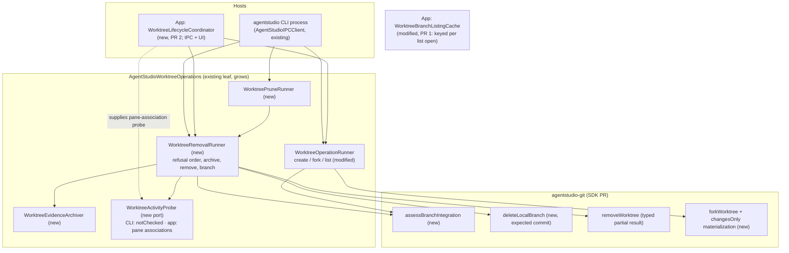
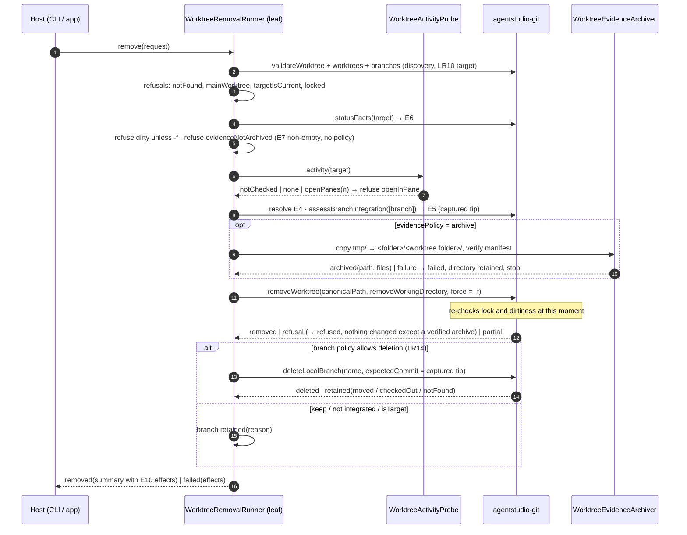
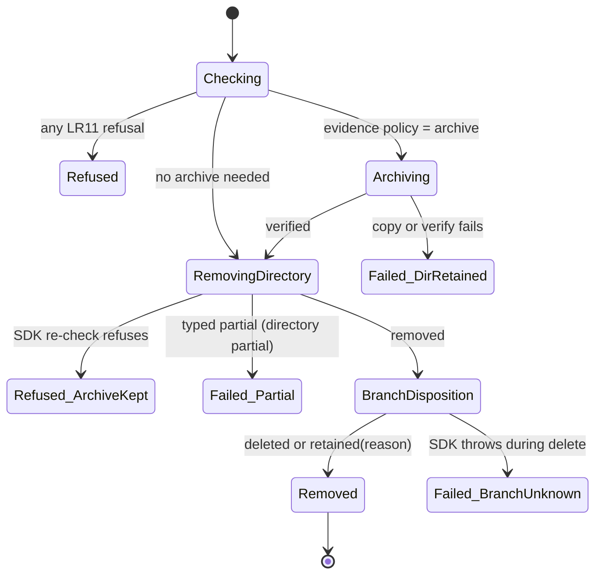
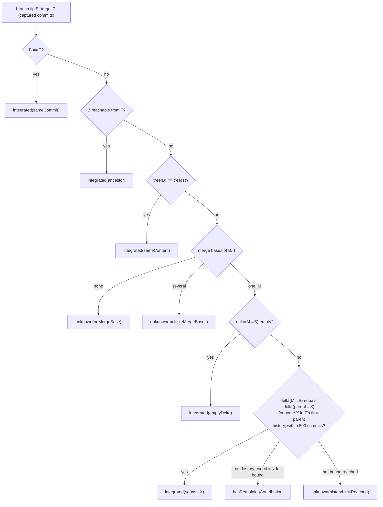
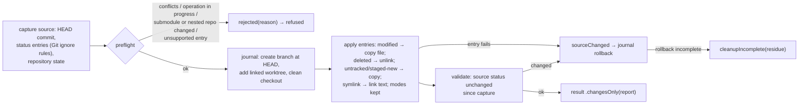
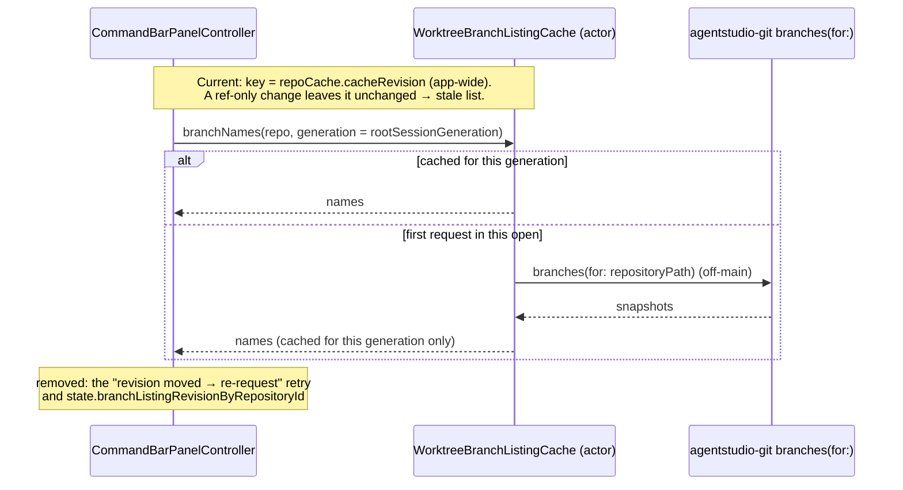

# Worktree lifecycle: how it is built

Date: 2026-09-30, revision 1. Realizes [the Specification](2026-09-30-worktree-lifecycle-specification.md) (LR1–LR24) for [the Requirements](2026-09-30-worktree-lifecycle-requirements.md). Builds on the shipped [worktree CLI design](../2026-09-27-worktree-cli/2026-09-27-worktree-cli-program-design.md): the `AgentStudioWorktreeOperations` leaf, its outcome contract and its error mapper stay, and grow. Anchors are agent-studio `07006b402` and agentstudio-git `origin/main` `8719325`.

## The shape in one picture



Three delivery units, in order:

| Unit | Owns | Depends on |
|---|---|---|
| **agentstudio-git PR** | Git truth: integration assessment, expected-commit branch deletion, typed removal partial result, changes-only fork | nothing new |
| **App PR 1: agent CLI + branch-list currentness** | CLI `new --from-branch`, `fork --changes-only`, `list` with state, `remove`, `prune`; the leaf's removal/prune/archive policy; branch list read fresh per open (LR22); the SDK pin bump | merged SDK commit |
| **App PR 2: app-executed lifecycle (IPC + UI)** | App executor; IPC commands and the state query; Remove Worktree… and the changes-only fork in the UI; open-pane refusal; await-sidebar | PR 1 |

IPC moves to PR 2 because it needs the same app-side executor as the UI: the pane-association probe, the awaited rescan, and target resolution from the workspace. PR 1 is complete for agents on its own: the CLI covers every verb. This is decision **D6** in the Requirements.

## What exists (checked in code)

| Area | Fact | Anchor |
|---|---|---|
| SDK remove | `removeWorktree(GitRemoveWorktreeRequest{worktreeID?, canonicalPath?, removeWorkingDirectory, forceDiscardChanges})`. It refuses `mainWorktree`, `locked` (always), and `stagedChanges` / `dirtyTrackedChanges` / `untrackedFiles` unless forced. Ignored files aren't counted. It never deletes a branch. Result `partialFailure: String?` when prune errs after metadata is gone. No "current worktree" refusal. | `LibGit2WorktreeWriter.swift:123-181`; `GitDataPlaneError.swift:247-255`; `GitWorktreeContracts.swift:105-128` |
| SDK branch | `branches(for:)` → `name, isCurrent, upstreamName?`; no public delete; an internal `deleteBranch` exists for fork rollback. | `GitStatusContracts.swift:21-25`; `WorktreeForkGitHandles.swift:105` |
| SDK history | `git_merge_bases` is used privately and fails closed on several bases; `readTree`, `diff`, `countCommitRange` exist; no ancestry, integration or patch comparison API. | `LibGit2ContributionDiffReader.swift:288-317`; `GitDiffContentContracts.swift:150-206` |
| SDK fork | APFS fork rebuilds the index from the captured HEAD, never from source staging, so staged work arrives unstaged. It has a rollback journal and typed residue. | `WorktreeForkIndexBuilder.swift:13-50`; `WorktreeForkRollbackJournal.swift:76-132`; spec table `docs/specs/2026-08-15-apfs-cow-worktree-creation/specification.md:246-252` |
| SDK concurrency | One FIFO writer lane per repository, **per process**; no cross-process lock. | `GitRepositoryWriterRegistry.swift:4-75` |
| Leaf | `WorktreeOperationRunner`, outcome types, error mapper, arguments, formatter; CLI dispatches `worktree` before any IPC. | `Sources/AgentStudioWorktreeOperations/*`; `Sources/AgentStudioIPCClient/main.swift:13-32` |
| App creation | `WorktreeCreationCoordinator` holds publication, creates via the SDK, then awaits `refreshWatchedFolder`; "From a branch" is a new branch at the chosen branch's tip. | `WorktreeCreationCoordinator.swift:80-180` |
| App IPC | The four creation `AppCommand`s are `.debugTesting`, `.noArguments`, and headless-unavailable. `command.execute` results are generic (`applied`, `accepted`, …) with no payload. Workspace headless execution is `async`. | `AppCommand+IPCProjection.swift:67-77,232,294`; `AppDelegate+HeadlessIPCCommandHandling.swift:47-50`; `IPCCommandResultVariant.swift:5-12`; `AppCommandExecution.swift:84-101` |
| App panes | Each pane carries `durableContextFacets.worktreeId`; `pane.list` exposes `worktreeId`. Discovery removal clears the association and keeps the pane. | `WorkspaceMutationCoordinator.swift:259-276`; `IPCQueryContracts.swift:195-226` |
| App discovery | Worktree add/remove reaches the sidebar through watched-folder scan → `RepositoryLifecycleReconciliation` → topology atom. Any `/.git/` path triggers a scan. | `WatchedFolderTopologyAdmission.swift:9-53`; `RepositoryLifecycleReconciliation.swift:27-276` |
| **The L6 miss** | `WorktreeBranchListingCache` re-queries only when the app-wide `repoCache.cacheRevision` moves. A local ref change raises `containsGitInternalChanges`, the projector refreshes, and an equal status snapshot is suppressed, so the revision need not move. The command bar has a per-open `rootSessionGeneration`. | `WorktreeCreationPorts.swift:42-103`; `CommandBarPanelController+WorktreeCreation.swift:77-125`; `FilesystemPathFilter.swift:60-80`; `RepoCacheAtom.swift:131-151,395-399` |

## Choices

1. **The SDK owns Git truth; the leaf owns lifecycle policy; hosts own what only they know.** The SDK answers "is this branch integrated, and how", "delete this branch only at this commit", "remove this worktree", "fork with changes only". The leaf decides refusal order, archiving, branch disposition, prune selection and output. The CLI host supplies "activity not checked"; the app host supplies pane associations and waits for the sidebar. No archive, activity or product policy enters the SDK.
2. **One removal sequence for every host.** `WorktreeRemovalRunner` runs the same code for the CLI, IPC and UI (LR16 differs only by the injected probe).
3. **No cross-process lock.** Each destructive step re-checks at the moment it runs: the SDK's remove re-reads dirtiness and lock, and branch deletion compares the tip to the assessed commit. The residual window (a tool writes a file between the last check and the directory removal) is named in the Specification's "Not promised". A cooperative lock would only order agentstudio processes, not git or editors, and would add a stale-lock recovery path.
4. **The branch list is keyed per open, not per enrichment revision** (LR22). The cache key becomes the command bar's `rootSessionGeneration`, and the retry-on-revision-move logic goes. One read per open, shared by concurrent requests in that open. This adds no event, bus fact, atom or observer. It matches the owner's "live list when I open the cmd bar … lazy".
5. **Integration is exact and bounded.** Cheap graph proofs first, then one exact aggregate-delta comparison against the target's recent first-parent commits (500). No patch-id: libgit2's is whitespace-normalizing (Advisor [L1]), which would weaken the proof.
6. **Changes-only is a second materialization of `forkWorktree`, not a new verb in the SDK.** It reuses the fork's capture, rollback journal, residue types and error cases, so the leaf's error mapper and leftovers contract apply unchanged.
7. **IPC goes through `AppCommand` (PR 2).** Create, fork and remove are user-visible verbs, so they stay `AppCommand`s with `ipcSpec` arguments (the command-spec rule), plus one new result variant that carries the operation outcome. The state read is a query method in the IPC registry, like `pane.list`. Privilege is the existing `appCommandExecute`. A stronger gate would protect nothing, because the standalone CLI performs the same removal with no credential.

## Where each thing lives

| Entity | Semantic owner | Home | Status |
|---|---|---|---|
| E1 Repository, E2 Worktree | SDK (identity), leaf (discovery rules) | `GitWorktreeSnapshot`; leaf discovery (shipped) | existing |
| E3 Local branch | SDK | `GitBranchSnapshot`; `deleteLocalBranch` | modified (delete) |
| E4 Integration target | leaf | `WorktreeDefaultStartPoint` resolver (shipped) → passed to SDK as `GitRevisionTarget` | existing |
| E5 Assessment | SDK | `GitBranchIntegrationAssessment` in `AgentStudioGitContracts` | new |
| E6 Working changes | SDK | `statusFacts` summary counts; removal safety | existing |
| E7 Evidence folder, E8 Archive | leaf | `WorktreeEvidenceArchiver` | new |
| E9 Pane activity | host | `WorktreeActivityProbe` port in leaf; app implementation over pane `worktreeId` | new |
| E10 Removal | leaf | `WorktreeRemovalRunner`, `WorktreeRemovalSummary` / `WorktreeRemovalEffects` | new |
| E11 Materialization | SDK | `GitWorktreeForkMaterialization` + result report enum | modified |
| E12 Outcome | leaf | `WorktreeOperationOutcome` (+ `removed`, `pruned`); formatter; IPC result variant (PR 2) | modified |
| E13 Branch list | App | `WorktreeBranchListingCache` keyed by `rootSessionGeneration` | modified |

## Interfaces

### agentstudio-git (new and changed)

```swift
// Integration (E5). Batched so target history deltas are computed once per call.
func assessBranchIntegration(
    _ request: GitBranchIntegrationRequest
) async throws(GitDataPlaneError) -> [GitBranchIntegrationAssessment]

struct GitBranchIntegrationRequest: Sendable, Equatable {
    let repositoryPath: URL
    let branchNames: [String]
    let target: GitRevisionTarget           // resolved by the caller (E4)
    let squashSearchCommitLimit: Int        // 500 from the leaf's policy
}
struct GitBranchIntegrationAssessment: Sendable, Equatable {
    let branchName: String
    let branchCommit: GitObjectID?           // nil only for .unknown(.branchNotFound)
    let targetCommit: GitObjectID
    let grade: GitBranchIntegrationGrade
}
enum GitBranchIntegrationGrade: Sendable, Equatable {
    case integrated(GitIntegrationProof)
    case hasRemainingContribution
    case unknown(GitIntegrationUnknownReason)
}
enum GitIntegrationProof: Sendable, Equatable {
    case sameCommit, ancestor, sameContent, emptyDelta
    case squash(commit: GitObjectID)
}
enum GitIntegrationUnknownReason: Sendable, Equatable {
    case branchNotFound, noMergeBase, multipleMergeBases, historyLimitReached, missingObjects
}

// Branch deletion (E3). Runs on the repository's writer lane.
func deleteLocalBranch(
    _ request: GitDeleteLocalBranchRequest
) async throws(GitDataPlaneError) -> GitDeleteLocalBranchResult
struct GitDeleteLocalBranchRequest: Sendable, Equatable {
    let repositoryPath: URL
    let branchName: String
    let expectedCommit: GitObjectID
}
enum GitDeleteLocalBranchResult: Sendable, Equatable {
    case deleted(configurationCleanup: GitBranchConfigurationCleanup)  // .complete | .incomplete
    case retained(GitBranchRetentionReason)   // .notFound | .moved(current:) | .checkedOut(worktreePath:)
}

// Removal (E10): the String partial becomes typed (no raw libgit2 text can leak).
struct GitRemoveWorktreeResult { let removedWorktreeID: …; let removedWorkingDirectory: Bool
                                 let partialFailure: GitWorktreeRemovalPartialFailure? }
enum GitWorktreeRemovalPartialFailure: Sendable, Equatable {
    case workingDirectoryIncomplete      // administration gone, some directory content remains
}

// Changes-only fork (E11). Hard cutover of the result's materialization field.
enum GitWorktreeForkMaterialization: Sendable, Equatable { case copyOnWrite, changesOnly }
// GitForkWorktreeRequest gains `materialization` (no default: every caller states it).
enum GitWorktreeMaterializationResult: Sendable, Equatable {
    case copyOnWrite(GitWorktreeMaterializationReport)          // the existing report
    case changesOnly(GitChangesOnlyMaterializationReport)       // trackedChanges, untrackedFiles
}
// GitWorktreeForkRejectionReason gains: conflictsPresent, operationInProgress,
// submoduleOrNestedRepositoryChanged, unsupportedEntry(relativePath:)
```

`forkWorktreeEligibility` answers `.available` for `.changesOnly` without volume checks. Changes-only needs no APFS.

### AgentStudioWorktreeOperations (leaf)

```swift
enum WorktreeOperationRequest: Sendable, Equatable {
    case createFromDefault(start: URL, branch: String)
    case createFromBranch(start: URL, branch: String, startBranch: String)        // new (LR1)
    case fork(start: URL, branch: String, materialization: WorktreeForkMaterialization)  // modified
    case list(start: URL)
    case remove(WorktreeRemovalRequest)                                            // new
    case prune(WorktreePruneRequest)                                               // new
}
struct WorktreeRemovalRequest: Sendable, Equatable {
    let start: URL                        // --repo or current directory
    let callerDirectory: URL?             // for targetIsCurrent; nil from app hosts
    let target: String                    // branch name or path (LR10)
    let discardWorkingChanges: Bool       // -f
    let branchPolicy: WorktreeBranchPolicy       // .deleteIfIntegrated | .deleteAtObservedCommit (-D) | .keep
    let evidencePolicy: WorktreeEvidencePolicy   // .requireEmpty | .archive(to: URL) | .discard
}
struct WorktreePruneRequest: Sendable, Equatable {
    let start: URL; let callerDirectory: URL?
    let apply: Bool; let archiveRoot: URL?
}

/// What a host knows about panes. The CLI passes `.notChecked`; the app passes a live snapshot.
protocol WorktreeActivityProbe: Sendable {
    func activity(forWorktreeAt canonicalPath: URL) async -> WorktreeActivity
}
enum WorktreeActivity: Sendable, Equatable { case notChecked, none, openPanes(Int) }

enum WorktreeOperationOutcome: Sendable, Equatable {
    case created(WorktreeCreatedSummary)       // materialization becomes the E11 enum
    case listed(WorktreeListingSummary)        // + target, per-worktree state (LR9)
    case removed(WorktreeRemovalSummary)       // new (LR15)
    case pruned(WorktreePruneSummary)          // new (LR17)
    case refused(WorktreeOperationRefusal)     // + LR1/LR3/LR11 reasons
    case failed(WorktreeOperationFailure)      // create/fork keep `leftovers`; remove carries `effects`
}
struct WorktreeRemovalEffects: Sendable, Equatable {
    let directory: WorktreeDirectoryEffect         // removed | retained | partial | unknown | notApplicable
    let administration: WorktreeAdministrationEffect  // removed | retained | unknown | notApplicable
    let branch: WorktreeBranchEffect               // deleted | retained(reason) | unknown | notApplicable
    let evidence: WorktreeEvidenceEffect           // archived(path, files) | discarded | none
}
```

New refusals: `startBranchNotFound`, `unsupportedWorkingState(reason, relativePath?)`, `notFound`, `mainWorktree`, `targetIsCurrent`, `locked`, `dirty(counts)`, `evidenceNotArchived`, `openInPane(count)`, `archiveDestinationExists`, `archiveDestinationInsideWorktree`. `forkUnavailable` gains the `changesOnly` alternative in output only.

The JSON shapes are a `Codable` outcome document owned by the leaf. The CLI formatter prints it; the PR 2 IPC result carries the same document (one shape, LR18).

## How a removal runs

This path is new. Its predecessor is `wt remove`, outside this system.



The branch is never deleted before the directory is gone, so a failure can't leave a worktree whose HEAD names a missing branch. If the SDK's remove refuses after an archive was written (someone dirtied the tree in between), the outcome is `refused` with the evidence effect `archived`, and the archive is kept, never deleted. A branch-only target (LR10) skips the directory steps.

### Removal states and failure effects



| Failure | Detected by | Contained by | Reported effects |
|---|---|---|---|
| Archive copy/verify fails | archiver manifest comparison | stop before directory | directory retained, branch retained, evidence none (partial copy left in the new destination folder, named) |
| SDK remove refuses at execution | SDK re-check | nothing removed | `refused`, evidence archived if written |
| SDK remove partial | typed `workingDirectoryIncomplete` | branch step skipped | directory partial, administration removed, branch retained |
| Branch moved / checked out | `deleteLocalBranch` CAS / HEAD scan | branch kept | `removed` with branch retained(reason) |
| Branch config cleanup incomplete | SDK result | ref already deleted | `removed`, branch deleted; a warning names the leftover configuration |
| SDK throws during branch delete | typed error | — | `failed`: directory removed, branch unknown |

## How integration is assessed



A **delta** is the sorted list of `(path, old mode, old object, new mode, new object)` from a recursive tree diff with rename detection off. Two deltas are equal when the lists are identical. One call computes each target commit's delta at most once and indexes it by a hash of the list. Every branch in a batched `list` or `prune` looks up that index. A missing object anywhere yields `unknown(missingObjects)`. The walk never writes objects, the index, or the working tree.

## How a changes-only fork runs



The index stays at the new HEAD, so every carried change is unstaged or untracked, the same staging result as the APFS fork (D2). Ignored files are never enumerated, because the status read excludes them. A tracked file that matches an ignore rule is still a tracked change and is carried. The source is read only.

## How the branch list stays current (PR 1)



Each open of the command bar starts a new generation, so any branch created, deleted, renamed or packed since the last open is read fresh. Worktree rows keep their existing path: discovery for add and remove, enrichment for the checked-out branch (LR20, LR21, unchanged code). The separate intake measurement track may later narrow what triggers a scan; LR20 is the invariant it must keep.

## The app executor (PR 2)

`WorktreeLifecycleCoordinator` (App/Coordination, `@MainActor`, owns no state) sequences an app-executed operation:

1. Resolve the target from the workspace (repository id, worktree id, or path).
2. Capture a pane-association snapshot as the probe: a worktree's canonical path maps to the count of panes whose `worktreeId` is that worktree.
3. Run the leaf runner off-main.
4. Await the existing `refreshWatchedFolder` for the affected watched folder. Creation keeps the existing publication hold.
5. Return the outcome.

Both the IPC handler and the UI call it.

| Surface | Change |
|---|---|
| `AppCommand` | `newWorktreeFromDefault`, `newWorktreeFromBranch`, `forkWorktree` get argument variants and `.headless` exposure. New `forkWorktreeChangesOnly` and `removeWorktree` get spec entries (label, `CommandIcon`, help, surface policy, `ipcSpec`), classified in the same change. |
| `IPCCommandArgumentVariant` | `worktreeCreation` (target, branch, start branch?) and `worktreeRemoval` (target, `force`, `branchPolicy`, `evidence`) |
| `IPCCommandResultVariant` | `worktreeOperation`, carrying the leaf's outcome document |
| IPC registry | `worktree.list` query (`workspaceRead`): LR9's document with `activity` from the probe |
| UI | Worktree row menu → Remove Worktree…; command bar opens a removal step (Features/CommandBar) that shows the assessment, changes, branch disposition and evidence choice (`NSOpenPanel` for the archive folder). Close Panes and Remove dispatches the existing pane-close action for each listed pane, then removes. New Worktree → Fork gains the changes-only row. |

All copy, icons and help come through the command spec catalog. No view defines its own verb.

## Concurrency and ordering

- **Within one process:** SDK mutations for one repository run FIFO on its writer lane (existing). Assessment and status reads are off the lane, on the SDK's read executor.
- **Across processes (two agents, CLI and app):** there is no lock (choice 3). Correctness rests on:
  - the SDK's remove re-checking at execution;
  - `deleteLocalBranch` comparing the tip to the expected commit;
  - libgit2 refusing to delete a checked-out branch.

  Two agents removing the same worktree: the second sees `notFound`, or a refusal from the SDK re-check.
- **App MainActor:** only the pane snapshot capture and the outcome publication run on MainActor. Assessment, status, archive and SDK calls run off-main. That keeps the performance lane directive: publish on MainActor, derive off it.
- **Branch list:** one in-flight query per repository per generation, shared (existing mechanism, new key).

## Cross-cutting realization

| Obligation | Realized by |
|---|---|
| No raw Git text (WR5 carried) | typed SDK removal partial and branch results; the leaf maps every SDK error through the existing total mapper, extended |
| Privacy | archiver writes only to the caller's folder; the app's OTLP events carry operation kind and outcome kind only, no paths or branch names (existing scrub rule) |
| Performance | batched assessment with a shared delta index; cheap proofs short-circuit; the 500-commit bound is `WorktreeCreationPolicy` data in the leaf, not a UI style |
| Safety | refusal order is one function in the leaf, covered by one table test; the lock is never overridden, because the SDK itself refuses |

## Proof seams

| Seam | Real vs fake | What it observes |
|---|---|---|
| SDK integration and branch deletion | real libgit2 against temporary repositories built by Git fixtures; the #388 and #395 object pairs imported as fixture objects | each grade/proof/unknown; CAS retention on a moved tip; checked-out retention |
| SDK changes-only fork | real temporary repositories, including a non-APFS-independent path | the payload table, refusals, `sourceChanged` rollback, residue |
| Leaf removal/prune | real SDK and temporary repositories; the activity probe is a test double that returns `openPanes(n)` (a host fact, not the behavior under test) | refusal order, archive-before-remove, effects on each failure, branch dispositions |
| CLI | the real top-level dispatch with injected output | goldens, exit codes, no IPC client or credential read |
| Branch list | the real `WorktreeBranchListingCache` with the real SDK query against a temporary repository | a new generation re-reads after a branch is deleted, created or packed with no status change |
| App executor + IPC (PR 2) | the real IPC registry and coordinator; real SDK; await the typed topology fact for the affected folder, never time | outcome parity with the CLI; `openInPane`; sidebar reflects the change at return |
| Real app | debug build, CLI and plain `git` from outside | rows and branch lists per LR20–LR22 |

## Trace

| U | R | E | Owner | Interface | Shape and home | State | Failure | Proof |
|---|---|---|---|---|---|---|---|---|
| L3 | LR1 from-branch | E3 | leaf runner | `createFromBranch` | `WorktreeOperationRequest` (leaf) | — | `startBranchNotFound` | leaf integration |
| L4 | LR2 changes-only payload | E11 | SDK fork writer | `forkWorktree(materialization: .changesOnly)` | `GitWorktreeMaterializationResult` (SDK) | journaled fork | `sourceChanged`, `entryFailed`, `cleanupIncomplete` → leftovers | SDK fork tests |
| L4 | LR3 refusals | E6, E11 | SDK fork writer | rejection reasons | `GitWorktreeForkRejectionReason` (+4) | preflight | `refused unsupportedWorkingState` | SDK fork tests |
| L4 | LR4 no fallback | E11, E12 | leaf formatter | outcome document | `forkUnavailable` + alternative | — | — | CLI golden |
| L2, L11 | LR5 target, offline | E4 | leaf | default start point → `GitRevisionTarget` | shipped resolver | — | `unknown(noTarget)` | leaf integration, no network |
| L2 | LR6 proofs | E5 | SDK | `assessBranchIntegration` | `GitBranchIntegrationGrade` (SDK) | per call | — | SDK integration tests |
| L2 | LR7 squash | E5 | SDK | same | `.squash(commit:)` | shared delta index | `historyLimitReached` | SDK tests + #388/#395 pairs |
| L2 | LR8 unknown | E5 | SDK | same | `GitIntegrationUnknownReason` | — | never integrated | SDK tests |
| L5 | LR9 list state | E5–E7, E9 | leaf runner | `.list` | `WorktreeListingSummary` (leaf) | — | read failure → `notNeeded` (shipped) | CLI golden |
| L1 | LR10 target | E2, E3 | leaf removal runner | `WorktreeRemovalRequest.target` | leaf | — | `notFound` | leaf integration |
| L1, L10 | LR11 refusal order | E2, E6, E7, E9 | leaf removal runner | refusal function | `WorktreeOperationRefusal` (leaf) | Checking | `refused`, nothing changed | leaf table test |
| L10 | LR12 archive | E7, E8 | leaf archiver | `WorktreeEvidenceArchiver` | manifest (leaf) | Archiving | failed, directory retained | leaf integration |
| L1 | LR13 directory | E2, E6 | SDK remove | `removeWorktree(force:)` | typed partial (SDK) | RemovingDirectory | SDK re-check refusal; partial | leaf integration |
| L1, L2 | LR14 branch disposition | E3, E5 | leaf runner + SDK | `deleteLocalBranch(expectedCommit:)` | `GitDeleteLocalBranchResult` (SDK) | BranchDisposition | retained(moved/checkedOut) | SDK + leaf tests |
| L1 | LR15 effects | E10 | leaf | outcome document | `WorktreeRemovalEffects` (leaf) | terminal | failed with effects | leaf failure-table test |
| L1, L7 | LR16 activity | E9 | host | `WorktreeActivityProbe` | leaf port; app impl (PR 2) | captured snapshot | `openInPane` | leaf test double + IPC test |
| L1, L2 | LR17 prune | E2–E10 | leaf prune runner | `.prune` | `WorktreePruneSummary` (leaf) | per-candidate removal | per-entry failed → exit 2 | leaf integration |
| L1, L7 | LR18 IPC | E12 | app coordinator (PR 2) | `command.execute` + `worktree.list` | result variant `worktreeOperation` (ProgrammaticControl) | awaits rescan | same outcomes | IPC registry tests |
| L1 | LR19 standalone | — | CLI dispatch | `WorktreeCommandLine.dispatch` | shipped | — | — | dispatch test |
| L6 | LR20 worktree rows | E2 | discovery (existing) | scan → reconciliation | existing | existing | existing | real-app proof |
| L6 | LR21 branch label | E2, E3 | enrichment (existing) | `branchChanged` | existing | existing | existing | real-app proof |
| L6 | LR22 branch list per open | E13 | App cache | `branchNames(…, generation:)` | `WorktreeBranchListingCache` (modified) | per generation | query failure shown (existing) | cache integration + real-app |
| L7 | LR23 Remove UI | E5, E6, E9, E10 | CommandBar step + app coordinator (PR 2) | `removeWorktree` command | command spec | confirmation step | same refusals shown | native screenshots |
| L4, L7 | LR24 changes-only UI | E11 | command spec | `forkWorktreeChangesOnly` | command spec | — | same as LR3/LR4 | native screenshot |

## Deviations and decisions for the owner

- **D1–D6** (Requirements) are written in with their defaults. D6 also sets the PR cut above: IPC ships with the UI in app PR 2.
- **New coordinator responsibility** (CLAUDE.md "ask first"): `WorktreeLifecycleCoordinator` in PR 2. It could instead extend `WorktreeCreationCoordinator` into a lifecycle coordinator. I recommend a separate one: creation holds publication, and removal doesn't.
- **New IPC contract pieces** (PR 2): two argument variants, one result variant, one query method. Each is additive.
- **No new atom, store, bus event or observer.** The L6 fix changes one cache key.
- **SDK breaking changes**, hard cutover in one pin bump: the fork request's `materialization` field, the fork result's materialization enum, and the typed removal partial.
- **Gap:** no generated UI images for LR23 and LR24; this session has no image generation, so the screens are specified in words.
