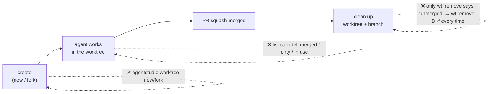
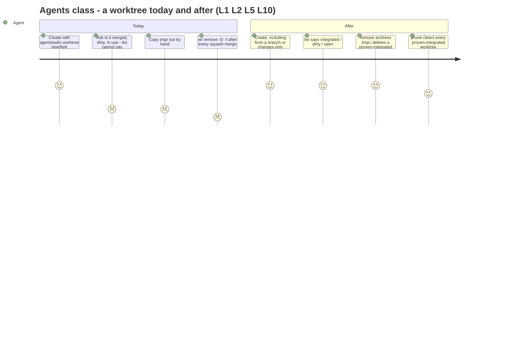

# Worktree lifecycle: what it needs and why

Date: 2026-10-08, revision 10 (design review round 1: the Lead's gloss on the `--no-fork` start commit moved out of D14's owner row; L3's app parity reads "at least"). Revision 9 (owner decisions D13–D19: every creation path is a fork unless `--no-fork`; `--from-branch` takes any branch after a fetch; an existing branch gets a worktree; `new` prints only what it created). Revision 8 (2026-10-07, D9 withdrawn: the dirty/off-branch refusal was never the owner's answer; `new` copies its source as it is). Revision 7 (2026-10-04, D9 narrowed: no build detection). Revision 6 (owner decisions D8–D12: one `new` verb that forks the main checkout by default; L14). Revision 5 (owner decisions D1, D4–D7 recorded; open panes warn with options). Revision 4 (owner's Socratic round: agents decide, the tool informs and offers options; automatic fetch; `tmp/` and git-lock refusals with options; sane defaults). Revision 3: L12 confirmed, the agentstudio-git slice first, D7, the fast-CLI IPC rule. Revision 2 wrote the whole design before owner review; open decisions carry a written-in default, listed at the end. Author: Worktrees orchestrator (Claude 9304749a). This extends the shipped [worktree CLI requirements](../2026-09-27-worktree-cli/2026-09-27-worktree-cli-requirements.md). W1–W4, W6 and W7 stay in force. W5 stays in force for the CLI and is extended by an IPC surface (L1). Authority comes from the owner's words on 2026-09-30, quoted here. Rows marked *default* are written into the design with a recommended answer and wait for the owner's confirmation in [Decisions waiting on the owner](#owner-decisions-2026-09-30).

Next: [Specification](2026-09-30-worktree-lifecycle-specification.md) → [Program Design](2026-09-30-worktree-lifecycle-program-design.md).

## The problem

Agents and the owner still depend on `wt` (worktrunk) for the parts of a worktree's life that Agent Studio can't do yet:

Observed this week (2026-09-26 to 30):
- every squash-merged branch needed `wt remove -D -f`, because wt called squash-merged branches "unmerged";
- `tmp/` evidence was copied out by hand before each removal;
- `agentstudio worktree list` (#388) shows path and branch only;
- a branch deleted outside the app can stay in the app's "From a branch" list, because nothing tells that list a branch changed.

The app has no remove-worktree action. "Remove repo" only forgets a repo inside Agent Studio. agentstudio-git can remove a worktree, but it can't:
- delete a branch;
- tell whether a squash-merged branch is merged;
- copy only uncommitted changes.

## Who it's for

| Class | Job | Authority |
|---|---|---|
| Agents in Agent Studio panes (primary) | create, fork, list and clean up worktrees from the CLI or IPC while working | owner: "this meant to be used by agents mostly" |
| The owner, in the app | see and remove worktrees in the app, with the same rules as the CLI | owner: "good to have parity" |
| The owner, in a terminal | the same, from any terminal, app open or closed (W5) | shipped W5 |

## How the tool treats an agent

Owner, 2026-09-30:
- "The agent needs to know how to respond in these scenarios … the right feedback and flags to continue, override, have a pathway … while the agent can make those decisions."
- "if tmp is there show agent error they can override it"
- "same with lock show lock error and tell agent what options they have, at that point they decide"
- "wt is done really well, but it is definitely done for humans with some agent things bolted on"
- "have sane defaults"

So:
- **The agent decides.** When something is in the way, the tool stops, shows what's there, and lists the exact options that continue.
- **The tool may refresh information on its own** (a fetch), because that loses nothing. It never makes a lossy choice for the agent.
- **Hard stops, which no option overrides:** removing the main worktree, and deleting the default branch.
- **The CLI is agent-native:** machine-readable outcomes, a stable reason code, the options that continue, a preview (`--dry-run`), and safe retries.

## The needs

| # | Need | Why | Authority | Priority |
|---|---|---|---|---|
| L1 | Replace every `wt` step agents use, from the `agentstudio worktree` CLI and an equivalent IPC surface: create (new, from a branch, fork), list, remove a worktree and its branch, and clean up merged ones | agents stop depending on worktrunk; the CLI works without the app, IPC lets the app apply what only it knows | **authorized**: "agent first is better", "why not both … usable in app and outside app" (2026-09-30); the replacement direction (2026-09-27) | Must |
| L2 | A branch merged by **squash** counts as merged, validated on real squash-merged branches | the `-D -f` friction every time | **authorized**: "make sure squash merge is validated" | Must |
| L3 | Create from a chosen branch in the CLI and IPC, offering at least what the app's "From a branch" offers (the app's own UI keeps its local-branch list and doesn't fetch): any branch, local or on any remote, read after a fetch from origin; an existing branch with no worktree gets a worktree on it (D15–D17) | parity with the app (#395); a stale local ref makes agents start from old code | **authorized**: "good to have parity"; 2026-10-08: "you need to allow any branch even remote ones"; "fetting latest form orgin prevets horrible msitakes by agents" | Must |
| L4 | A **changes-only** fork keeps uncommitted work when an APFS fork isn't wanted or possible, with wt-like ergonomics. It is chosen explicitly and never replaces a failed APFS fork on its own | forking must still keep your work; a silent, narrower fork would surprise the caller | **authorized**: "yes so change only for same ergonomics its part of 2. wt has ergonomics down really well". staging decided (owner, 2026-09-30, "yes"): everything arrives unstaged, matching the APFS fork. *default D4*: explicit choice, no automatic fallback | Must |
| L5 | `list` shows each worktree's state: integrated (merged), uncommitted changes, locked, current, `tmp/` evidence, and, when the app answers (IPC), whether it's open in a pane | agents decide what to clean up | **authorized** as part of the accepted verb set ("yeah agent first … parity") | Must |
| L6 | Agent Studio shows every add, change and removal of **worktrees and local branches**, whichever tool made it (CLI, git, wt, the app) | one truth; no stale rows or branch lists | **authorized**: "we need both" (removal as well as add/change) | Must |
| L7 | The app offers the same lifecycle actions as the CLI (remove worktree, integrated state), with the same rules | parity | **authorized**: "good to have parity"; "this can be 2 PRs" | Must (second PR) |
| L8 | No interactive switcher or picker in the CLI. Agent Studio's UI is where you switch and resume | Agent Studio is the UI | **authorized**: "we dont need wt switch tui gui etc we have agent studio" | Must |
| L9 | Worktrees stay beside the repository (the shipped naming rule). The event-intake cost is fixed at the source, not by moving worktrees | moving them broke things (the `/private/tmp` alias, lint, config overrides) | **authorized** direction: fix at the source (2026-09-30) | Must |
| L10 | Removing a worktree never silently loses its `tmp/` evidence. When `tmp/` has files, removal stops and offers the ways through: copy it into the main worktree's `tmp/`, copy it to a folder the agent names, or discard it | the manual copy before every removal | **authorized**: "if tmp is there show agent error they can override it"; "copy things to main worktree tmp or tell them to do so" | Must |
| L11 | Merged detection uses local git content, not GitHub. Before judging, the tool fetches the default branch on its own, skippable with `--no-fetch`. If the fetch fails, it carries on with local content and says so | right after a GitHub merge the local target is stale; no forge or auth dependency | **authorized**: "yes i agree with recommendation for fetch" (2026-09-30) | Must |
| L12 | agentstudio-git may change: branch deletion, an integration check, typed removal effects, a changes-only fork. It ships first, as its own slice, well designed and well tested | the SDK can't do these today, and the owner owns it | **authorized** (2026-09-30): "it doesnt stop our work on agentstudio git"; "get that done and well tested and well design reviewed first as first slice of work with advisor" | Must |
| L14 | **One creation verb, warm by default.** `new` makes a copy-on-write fork of the main checkout, so a new worktree has the main checkout's build outputs and needs no setup or LFS download. A plain tracked-files checkout is an explicit exception. Which ignored files are copied is declared by the repository, never guessed from folder names | agents pick a command by its name and kept choosing the cold `new` over `fork`, then forgot setup and `lfs pull`; and many cold worktrees aren't sustainable in disk and CPU | **authorized** (2026-10-04): "i want worktree new (should fork automatically) — some flag to do the backup mechanism"; "fork is default, else it's not sustainable in resources"; "how do we even know this there needs to be a rule based system"; "we only have stuff for vendored git submodules, rest should be rule based … no git ignored copy" | Must |
| L13 | A git lock in the way (`index.lock`, a ref lock) is shown to the agent with its path, its age, and whether it looks stale (older than 2 minutes, no git process running), plus the options: wait and retry, or remove it if stale. The tool's own commands never leave a lock file behind | lock errors block agents; the agent decides | **authorized**: "show lock error and tell agent what options they have"; "if lock is older than 2 min usually it's stale" | Must |

## Boundary

- **Changes:** agentstudio-git first (L12). Then the `agentstudio worktree` CLI with every verb, plus the app's branch-list fix for L6 (first app PR). Then the operations executed by the running app: IPC and Agent Studio's UI together (second app PR), since both need the same app-side executor (D6).
- **Not in this change:**
  - `wt merge`-style merging (squash, rebase, push);
  - an interactive switch or picker (L8);
  - moving worktrees out of the watched folder (L9);
  - GitHub or pull-request state (L11 uses local git content after a fetch);
  - deleting remote branches, tags, or any ref other than the worktree's local branch;
  - sweeping local branches that have no worktree (`prune` handles worktrees only);
  - stopping or killing processes that run in a worktree;
  - hooks beyond the `tmp/` archive.
- **Stays in force:** W1–W4, W6, W7; W5 for the CLI; the shipped outcome contract (created, listed, refused, failed; exit codes 0/1/2/64).
- **Separate track:** the event-intake measurement (scan triggers, build churn). L6 relies on it staying correct.

## Screens that change

The second PR adds:
- a **Remove Worktree…** action in a linked worktree's row menu and the command bar, whose confirmation shows the integrated state, uncommitted changes, what happens to the branch, and the `tmp/` choice;
- a changes-only option in New Worktree's Fork section.

The current app has no remove-worktree UI (`no current UI` for that moment). Rows don't gain a live integrated marker: that would need integration tracked continuously, and the confirmation is where the decision is made. The Specification (LR23, LR24) pins what the user sees. A generated screen image is a gap: this session has no image generation, so the screens are described in words.

## Owner decisions (2026-09-30)

| # | Question | Owner's answer | What it changes |
|---|---|---|---|
| D1 | What "merged" means | **integrated at some point**: a later revert doesn't unmerge it; the proof kind is reported | Spec LR6–LR8 |
| D2 | Changes-only staging | **everything unstaged**, matching the APFS fork ("yes") | Spec LR2 |
| D4 | Silent fallback to changes-only after a failed APFS fork? | **no**: the failure is reported, and `--changes-only` is offered | Spec LR4 |
| D5 | Open panes and the moment between the last check and the removal | **"if gap happens it's fine"; "we allow the user to do this … we just warn them"**: open panes produce a warning with options (close them and remove, remove anyway, cancel), not a flat refusal | Spec LR16, LR23 |
| D6 | IPC ships with the UI in app PR 2, after the fast-CLI PR | **"sure"** | Spec LR18; PR cut |
| D7 | Where CLI worktree verbs do their work | **A: in the CLI's own process**; works with the app closed | Spec LR19 |
| D8 | What `new` does | **copy-on-write fork of the main checkout by default**; `--tracked-only` is the plain checkout ("fork is default, else it's not sustainable in resources") | Spec LR1, LR28 |
| D9 | `new` when the main checkout is dirty or off its default branch | **Withdrawn 2026-10-07.** The refusal first recorded here ("refuse with a message naming `--tracked-only` or commit/stash") was the Lead's addition, never the owner's answer; no owner words backed it. Owner, 2026-10-07: "i enver ased fro this? ... this is the fuckign point of the fucking cow" and "i crate a new repo from branch or path ... it shoudc fukcign work". The only copy rules the owner gave are ignored files and `tmp/`. `new` copies its source as it is. No build detection either: a mid-build check was also the Lead's addition, and the owner removed it (2026-10-04: "why the fuck are you solving this build lock problem"), because the tool can't know a repository's language or build system | Spec LR29 |
| D10 | Verbs | **one verb**: `new`; `fork` is removed, `new --from <worktree>` carries a worktree's uncommitted work | Spec Surface, LR2 |
| D11 | What a warm copy includes | tracked files and vendored submodules always; nested worktrees of the same repository never; ignored files **only** when they match `worktree.include` in `.agentstudio.config.json` (no file: none); the same rules for `new` and `new --from` | Spec LR28 |
| D12 | Rule file format | **JSON**, `.agentstudio.config.json` at the repository root (not Claude Code's `.worktreeinclude`, which Claude Code would apply to its own copies) | Spec LR28 |
| D13 | The creation model | **every creation is a copy-on-write fork, then the branch is set**: owner (2026-10-08): "cow -> resett branch/chagne brnach". `new <b>` forks main as it is; `new <b> --from <path>` forks that worktree as it is; `new <b> --from-branch <x>` forks main, then changes the branch to `x` (owner: "form path an dform branch need be forks") | Spec LR1 |
| D14 | The non-fork option | **`--no-fork`**: owner: "--no-fork that sthe name". It replaces `--tracked-only` with a hard cutover (owner: "i dont like thracke donly"). It works with every source (owner, of `--from <path>`: "shokuld we not allow --no-fork with this?"). It is the only path that isn't copy-on-write. Which commit a `--no-fork` worktree starts at is the Lead's design choice, listed in the Program Design's Lead-authored choices | Spec LR1 |
| D15 | Which branches `--from-branch` takes | **any branch, local or on any remote**: owner: "you need to allow any branch even remote ones" | Spec LR1 |
| D16 | Stale refs | **fetch from origin before using a branch**, skippable with `--no-fetch`: the owner answered "yes to 1" to the Lead's option 1 (fetch first), and added "fetting latest form orgin prevets horrible msitakes by agents" | Spec LR1, LR5 |
| D17 | `new <b>` when branch `<b>` exists but no worktree has it | **make a worktree on that existing branch**, after fetching the latest from origin: owner: "b, fetch latest from korogin". The local branch moves up to origin's latest only when it is simply behind; if it has commits origin lacks, it is kept as it is and the outcome says so, so no local work is lost (that last rule is the Lead's safety detail, stated to the owner) | Spec LR1 |
| D18 | What `new` prints | **only what it created**: owner: "i eman we hsoku donly print for new what we created not everythning". One line: `created <b> at <path> (copy-on-write)` or `(checkout)`; the copy report details stay in `--json` | Spec LR1 |
| D19 | Jumping to an existing worktree | **no switch or jump command**: owner: "ok ignore jukmp to worktree". A branch already checked out in a worktree is refused, naming that worktree's path. Also not wanted now: auto-`cd`, running a command after create, merge, hooks | Spec LR1 |
| D20 | `new <b>` when `<b>` exists only on origin | *default, waiting on the owner*: create local `<b>` from origin's `<b>`, after the fetch. This is the Lead's recommendation; today `new` starts a fresh `<b>` from main and ignores origin's. It is not an owner decision until the owner answers | Spec LR1 |
| — | New app coordinator + `worktree.*` IPC methods | approved with D6; the owner asks for clean separations with nothing heavy on the MainActor | Program Design |
| — | Who builds the CLI (app PR 1) | **the Worktrees orchestrator**: "properly plan it with orchestrator skills … coordinate with ipc agent" | delivery |
