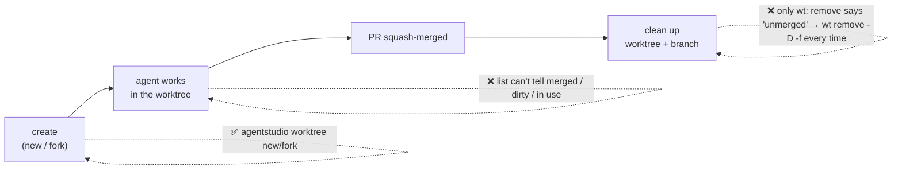
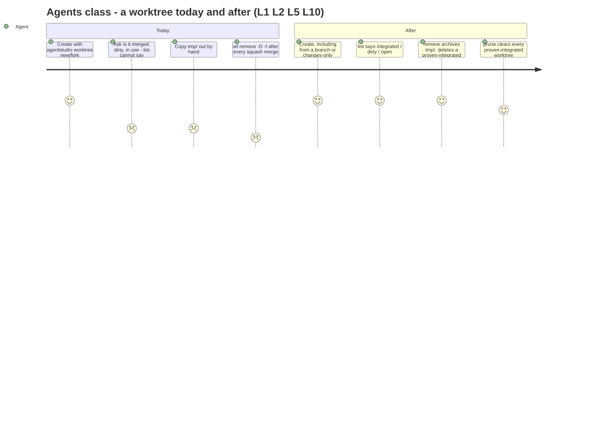

# Worktree lifecycle: what it needs and why

Date: 2026-09-30, revision 2 (the whole design written before owner review; open decisions carry a written-in default, listed at the end). Author: Worktrees orchestrator (Claude 9304749a). This extends the shipped [worktree CLI requirements](../2026-09-27-worktree-cli/2026-09-27-worktree-cli-requirements.md). W1–W4, W6 and W7 stay in force. W5 stays in force for the CLI and is extended by an IPC surface (L1). Authority comes from the owner's words on 2026-09-30, quoted here. Rows marked *default* are written into the design with a recommended answer and wait for the owner's confirmation in [Decisions waiting on the owner](#decisions-waiting-on-the-owner).

Next: [Specification](2026-09-30-worktree-lifecycle-specification.md) → [Program Design](2026-09-30-worktree-lifecycle-program-design.md).

## The problem

Agents and the owner still depend on `wt` (worktrunk) for the parts of a worktree's life that Agent Studio can't do yet:

Observed this week (2026-09-26 to 30):
- every squash-merged branch needed `wt remove -D -f`, because wt called squash-merged branches "unmerged";
- `tmp/` evidence was copied out by hand before each removal;
- `agentstudio worktree list` (#388) shows path and branch only;
- a branch deleted outside the app can stay in the app's "From a branch" list, because nothing tells that list a branch changed.

The app has no remove-worktree action. "Remove repo" only forgets a repo inside Agent Studio. agentstudio-git can remove a worktree, but it can't:
- delete a branch;
- tell whether a squash-merged branch is merged;
- copy only uncommitted changes.

## Who it's for

| Class | Job | Authority |
|---|---|---|
| Agents in Agent Studio panes (primary) | create, fork, list and clean up worktrees from the CLI or IPC while working | owner: "this meant to be used by agents mostly" |
| The owner, in the app | see and remove worktrees in the app, with the same rules as the CLI | owner: "good to have parity" |
| The owner, in a terminal | the same, from any terminal, app open or closed (W5) | shipped W5 |

## The needs

| # | Need | Why | Authority | Priority |
|---|---|---|---|---|
| L1 | Replace every `wt` step agents use, from the `agentstudio worktree` CLI and an equivalent IPC surface: create (new, from a branch, fork), list, remove a worktree and its branch, and clean up merged ones | agents stop depending on worktrunk; the CLI works without the app, IPC lets the app apply what only it knows | **authorized**: "agent first is better", "why not both … usable in app and outside app" (2026-09-30); the replacement direction (2026-09-27) | Must |
| L2 | A branch merged by **squash** counts as merged, validated on real squash-merged branches | the `-D -f` friction every time | **authorized**: "make sure squash merge is validated" | Must |
| L3 | Create from a chosen existing branch in the CLI and IPC, matching the app's "From a branch" | parity with the app (#395) | **authorized**: "good to have parity" | Must |
| L4 | A **changes-only** fork keeps uncommitted work when an APFS fork isn't wanted or possible, with wt-like ergonomics. It is chosen explicitly and never replaces a failed APFS fork on its own | forking must still keep your work; a silent, narrower fork would surprise the caller | **authorized**: "yes so change only for same ergonomics its part of 2. wt has ergonomics down really well". *default D4*: explicit choice, no automatic fallback | Must |
| L5 | `list` shows each worktree's state: integrated (merged), uncommitted changes, locked, current, `tmp/` evidence, and, when the app answers (IPC), whether it's open in a pane | agents decide what to clean up | **authorized** as part of the accepted verb set ("yeah agent first … parity") | Must |
| L6 | Agent Studio shows every add, change and removal of **worktrees and local branches**, whichever tool made it (CLI, git, wt, the app) | one truth; no stale rows or branch lists | **authorized**: "we need both" (removal as well as add/change) | Must |
| L7 | The app offers the same lifecycle actions as the CLI (remove worktree, integrated state), with the same rules | parity | **authorized**: "good to have parity"; "this can be 2 PRs" | Must (second PR) |
| L8 | No interactive switcher or picker in the CLI. Agent Studio's UI is where you switch and resume | Agent Studio is the UI | **authorized**: "we dont need wt switch tui gui etc we have agent studio" | Must |
| L9 | Worktrees stay beside the repository (the shipped naming rule). The event-intake cost is fixed at the source, not by moving worktrees | moving them broke things (the `/private/tmp` alias, lint, config overrides) | **authorized** direction: fix at the source (2026-09-30) | Must |
| L10 | Removing a worktree never silently loses its `tmp/` evidence: it's archived to a place the caller names, or discarded only when the caller says so | the manual copy before every removal | *default D3*: explicit archive destination or explicit discard | Should |
| L11 | Merged detection works offline, from local git content, with no GitHub | works for any repository and branch, no network or auth | *default D1/L11*: offline only | Must if confirmed |
| L12 | agentstudio-git may change: branch deletion, an integration check, a changes-only fork | the SDK can't do these today, and the owner owns it | *default L12*: yes | Must if confirmed |

## Boundary

- **Changes:** agentstudio-git first (L12). Then the `agentstudio worktree` CLI with every verb, plus the app's branch-list fix for L6 (first app PR). Then the operations executed by the running app: IPC and Agent Studio's UI together (second app PR), since both need the same app-side executor (D6).
- **Not in this change:**
  - `wt merge`-style merging (squash, rebase, push);
  - an interactive switch or picker (L8);
  - moving worktrees out of the watched folder (L9);
  - GitHub or pull-request state (L11);
  - deleting remote branches, tags, or any ref other than the worktree's local branch;
  - sweeping local branches that have no worktree (`prune` handles worktrees only);
  - stopping or killing processes that run in a worktree;
  - hooks beyond the `tmp/` archive.
- **Stays in force:** W1–W4, W6, W7; W5 for the CLI; the shipped outcome contract (created, listed, refused, failed; exit codes 0/1/2/64).
- **Separate track:** the event-intake measurement (scan triggers, build churn). L6 relies on it staying correct.

## Screens that change

The second PR adds:
- a **Remove Worktree…** action in a linked worktree's row menu and the command bar, whose confirmation shows the integrated state, uncommitted changes, what happens to the branch, and the `tmp/` choice;
- a changes-only option in New Worktree's Fork section.

The current app has no remove-worktree UI (`no current UI` for that moment). Rows don't gain a live integrated marker: that would need integration tracked continuously, and the confirmation is where the decision is made. The Specification (LR23, LR24) pins what the user sees. A generated screen image is a gap: this session has no image generation, so the screens are described in words.

## Decisions waiting on the owner

Each has a recommended default already written into the Specification and Program Design. Confirming keeps it; correcting changes the rows named.

| # | Question | Default written in | What it changes |
|---|---|---|---|
| D1 | What "merged" means: integrated **at some point** (a later revert doesn't unmerge it), or **still fully present** in the target today? | integrated at some point, labelled with its proof kind (ancestor, same content, or squash) | Spec E6, LR5–LR7 |
| D2 | Changes-only fork and staging: keep staged vs unstaged separate, or match today's APFS fork (everything arrives unstaged)? | match the APFS fork: everything unstaged | Spec LR12 |
| D3 | `tmp/` on remove: must the caller name an archive folder or say discard? | yes: a non-empty `tmp/` is refused unless `--archive-to <folder>` or `--discard-tmp` | Spec LR9, LR10 |
| D4 | Changes-only: always an explicit choice, never a fallback after a failed APFS fork? | explicit only | Spec LR11 |
| D5 | Unattended `prune` when the CLI can't see what's open in the app: warn, or skip? | standalone CLI warns ("activity not checked"); IPC and UI refuse worktrees open in a pane | Spec LR8, LR14 |
| D6 | IPC: expose the same operations through the running app, so it can refuse removing a worktree open in a pane and wait until the sidebar shows the change? (The CLI stays standalone either way.) | yes: create, fork, remove and worktree state through IPC, same outcome object as the CLI; shipped with the UI in app PR 2 (both need the app-side executor), so app PR 1 is CLI-only for agents | Spec LR16, LR18; PR cut |
| L11 | Offline only (no GitHub)? | yes | Spec LR5 |
| L12 | agentstudio-git may change? | yes | Program Design topology |
