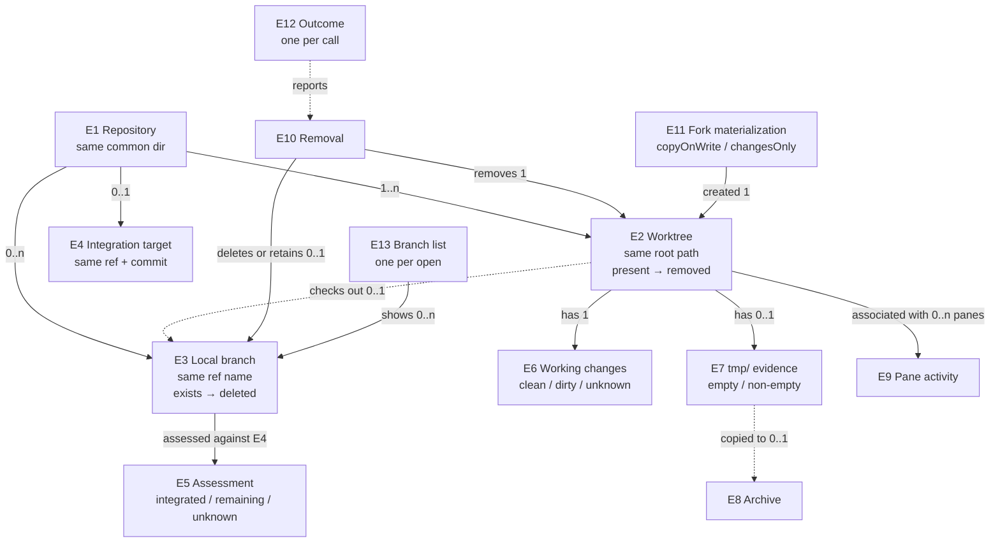

# Worktree lifecycle: what must be true

Date: 2026-09-30, revision 1. Serves [the Requirements](2026-09-30-worktree-lifecycle-requirements.md) (L1–L12). Extends the shipped [worktree CLI specification](../2026-09-27-worktree-cli/2026-09-27-worktree-cli-specification.md) (WR1–WR10 stay in force unless a rule here names a change). Rules tagged **(D#)** carry the written-in default of that open decision; confirming the decision confirms the rule. Realized by [the Program Design](2026-09-30-worktree-lifecycle-program-design.md).

## Who touches what


## Things

| Id | Thing | Same when | Always true | States |
|---|---|---|---|---|
| E1 | Repository | same Git common directory | found from any folder inside any of its worktrees, or `--repo <path>` (shipped E1) | — |
| E2 | Worktree | same canonical root path | belongs to one E1; exactly one main worktree per E1; the **current worktree** is the one containing the caller's current directory | present → removed; may be locked |
| E3 | Local branch | same full ref name `refs/heads/<name>` in one E1 | has one tip commit; checked out by at most one E2 | exists → deleted; tip moves |
| E4 | Integration target | same ref and commit | the E1's default start point (origin's HEAD, else local `main`, else `master`), resolved from local refs only, no fetch (shipped WR1). Always reported with its commit | resolved / none |
| E5 | Integration assessment | same E3 tip commit and same E4 commit | one grade: **integrated** (with its proof), **hasRemainingContribution**, or **unknown** (with a reason). A later call with any moved commit is a new assessment; an assessment never authorizes a later removal by itself | — |
| E6 | Working changes | one per E2 at the moment read | staged, unstaged and untracked (non-ignored) entries and conflicts, per Git's status | clean / dirty / unknown (unreadable) |
| E7 | Evidence folder | the E2's top-level `tmp/` directory | ignored or not, it is lost when the worktree's directory is removed | absent or empty / non-empty |
| E8 | Archive | same destination path | a copy of one E7 at `<archive folder>/<worktree folder name>/`; the destination didn't exist before; it lies outside the E2 being removed | written and verified |
| E9 | Pane activity | one per E2 at the moment read | the Agent Studio panes whose worktree association is that E2 | open (count) / none / notChecked |
| E10 | Removal | one per worktree per call | three separately reported effects: the directory, the local branch, the E7 evidence | see LR15 |
| E11 | Fork materialization | one per created fork | **copyOnWrite** (the shipped APFS fork) or **changesOnly** (a clean checkout of the source HEAD plus the source's working changes) | — |
| E12 | Outcome | one per call | extends shipped E4 with **removed** and **pruned**: created, listed, removed, pruned, refused (nothing changed), failed (says what changed) | — |
| E13 | Branch list | one per open of the list | the local E3s shown by "New Worktree → From a branch" and Find | open → closed |



## Surface

```text
agentstudio worktree new    <branch> [--from-branch <existing>] [--repo <path>] [--json]
agentstudio worktree fork   <branch> [--changes-only] [--from <path>] [--json]
agentstudio worktree list   [--repo <path>] [--json]
agentstudio worktree remove <branch-or-path> [--repo <path>] [-f|--force] [-D] [--no-delete-branch]
                            [--archive-to <folder> | --discard-tmp] [--json]
agentstudio worktree prune  [--repo <path>] [--apply] [--archive-to <folder>] [--json]
```

The same operations are IPC commands executed by the running app (LR18). No interactive switch, picker or prompt exists on any CLI verb (L8): every verb runs to an outcome from its arguments.

## Rules

### Create

| Rule | What must be true | Needs |
|---|---|---|
| LR1 | `new --from-branch <existing>` creates the worktree on a **new** branch `<branch>` starting at the tip of local branch `<existing>`, exactly as the app's "From a branch" does. A missing `<existing>` is refused `startBranchNotFound`. Without `--from-branch`, `new` behaves as shipped WR1. | L3 |
| LR2 | `fork --changes-only` creates E3 `<branch>` at the source worktree's HEAD commit (main or linked, found as in WR2), checks it out clean at the sibling destination (shipped E3), then applies the source's working changes. The result matches the APFS fork's staging rule **(D2)**: a staged or unstaged modification arrives unstaged; a staged new file or an untracked file arrives untracked; a tracked deletion arrives as an unstaged deletion. Files matched by Git's ignore rules (root and nested `.gitignore`, `info/exclude`, global excludes) are not copied, unless they are tracked. File modes are kept; a symlink is copied as a link with the same target text, never by following it. The source worktree is not changed. | L4 |
| LR3 | `fork --changes-only` refuses, before changing anything, a source with any of: unresolved conflicts; a merge, rebase, cherry-pick or revert in progress; changed or dirty submodules or nested repositories; an entry that isn't a regular file, directory or symlink. The refusal is `unsupportedWorkingState` with the reason and relative path. | L4 |
| LR4 | Neither kind of fork turns into the other on its own **(D4)**. A refused or failed APFS fork reports that outcome (shipped WR4, WR5); a `forkUnavailable` refusal names `--changes-only` as the alternative (human line and `"alternative":"changesOnly"` in JSON). A created fork reports its E11 materialization kind: `{"kind":"copyOnWrite", …shipped report}` or `{"kind":"changesOnly","trackedChanges":n,"untrackedFiles":n,"ignoredExcluded":true}`. | L4 |

### Integration (merged)

| Rule | What must be true | Needs |
|---|---|---|
| LR5 | Integration is assessed only against E4, from local objects and refs, with no network, fetch or forge **(L11)**. When E4 is `none`, every assessment is `unknown(noTarget)`. The output always includes E4's ref and commit, so a caller who wants a fresher answer can fetch first. | L2, L11 |
| LR6 | A branch is **integrated** when one of these holds, checked in this order **(D1)**: `sameCommit` (tip equals E4's commit); `ancestor` (tip is reachable from E4's commit); `sameContent` (tip's tree equals E4's tree); `emptyDelta` (the branch's net change since its merge base with E4 is empty); `squash` (LR7). "Integrated" means **integrated at some point**: a later revert on the target does not make it unintegrated. | L2 |
| LR7 | `squash` holds when the branch's aggregate change, from its single merge base with E4 to its tip, is **exactly equal** to one commit's change (that commit against its first parent), and that commit is reachable from E4's commit within the most recent 500 commits of E4's first-parent history. "Exactly equal" compares every changed path with its before and after mode and object. No whitespace, line-ending or rename normalization is applied. The assessment names the matching commit. | L2 |
| LR8 | Anything else is **hasRemainingContribution** (a merge base exists and no proof holds within the bound) or **unknown** with a reason: `noTarget`, `noMergeBase`, `multipleMergeBases`, `historyLimitReached`, `missingObjects`, `detachedHead`, `readFailed`. Unknown is never treated as integrated. A branch that *is* E4 has no assessment and is reported `isTarget`. | L2 |

### List

| Rule | What must be true | Needs |
|---|---|---|
| LR9 | `list` keeps shipped WR6's fields and adds, for each worktree: `isCurrent`, `isLocked`, E6 as `{"status":"clean"\|"dirty"\|"unknown","staged","unstaged","untracked","conflicted"}`, E5 (or `null` for a detached HEAD or the target branch), E7 as `"empty"\|"nonEmpty"`, and E9 as `"notChecked"` from the CLI or `{"openPanes":n}` from IPC. The top level adds `"target":{"ref","commit"}` or `null`. The human form keeps shipped WR6's line and appends the changes status and the grade, for example `worktree feature/x at /p  clean  integrated (squash 2c9fe2f)`. Exit 0. | L5 |

### Remove

| Rule | What must be true | Needs |
|---|---|---|
| LR10 | `remove` takes one target. If it names an existing directory (relative to the current directory), the target is the worktree containing it. Otherwise it is a branch name in E1 (found from `--repo` or the current directory). A branch checked out in a linked worktree targets that worktree. A branch with no worktree targets the branch alone (directory effect `notApplicable`). Neither found → refused `notFound`. | L1 |
| LR11 | Refused before anything changes, checked in this order: `notFound`; `mainWorktree`; `targetIsCurrent` (the caller's current directory is inside it); `locked` (never overridden by any flag); `dirty` with E6's counts, unless `-f`; `evidenceNotArchived` when E7 is non-empty and neither `--archive-to` nor `--discard-tmp` was given **(D3)**; `openInPane` with the pane count (IPC and UI only, LR16 **(D5)**); `archiveDestinationExists` or `archiveDestinationInsideWorktree`. A refusal prints the reason and the flag that would allow it, if one exists. Exit 1. | L1, L10 |
| LR12 | With `--archive-to <folder>`, E7 is copied to `<folder>/<worktree folder name>/` **before** the directory is touched, and the copy is verified (every file's relative path, size and content hash match the source). If copying or verification fails, nothing is removed and the outcome is failed with directory `retained`. `--discard-tmp` removes E7 with the directory. `-f` never implies either. | L10 |
| LR13 | The worktree's directory and its Git administration are removed only after LR11 and LR12 pass. `-f` permits discarding E6's changes and nothing else: not a lock, not a branch, not E7. | L1 |
| LR14 | After the directory is removed, the worktree's branch is **deleted** when its assessment is integrated, or when `-D` is given. It is **retained**, with a reason, when: `--no-delete-branch`; `hasRemainingContribution` or `unknown` without `-D`; it is E4 (`isTarget`, even with `-D`); it is checked out in another worktree; or its tip moved since the assessment (`movedSinceAssessment`, even with `-D`). Deletion only succeeds if the tip is still the assessed commit. Only that one local branch is ever deleted: never a remote branch, tag, or other ref. | L1, L2 |
| LR15 | A **removed** outcome reports each E10 effect: `directory: removed \| notApplicable`; `branch: {name, commit, disposition: deleted \| retained, reason?}`; `evidence: {status: archived, path, files} \| discarded \| none`; the E5 used; and E9. Exit 0, including when the branch is retained. A **failed** outcome after any change reports each effect as `removed \| retained \| partial \| unknown` for the directory and administration, `deleted \| retained \| unknown` for the branch, and the evidence status, plus the typed failure kind. It never prints raw Git text (shipped WR5). Exit 2. | L1 |
| LR16 | **(D5)** The standalone CLI can't see Agent Studio's panes: it reports E9 `notChecked` and doesn't refuse on activity. An IPC or UI removal refuses `openInPane` when any pane is associated with the target worktree. Nothing stops, kills or closes a process as a side effect of removal. | L1, L7 |

### Prune

| Rule | What must be true | Needs |
|---|---|---|
| LR17 | `prune` considers linked worktrees only. A **candidate** is not current, not locked, has a checked-out branch whose assessment is integrated, has clean E6, and has an empty E7 or was given `--archive-to` (each archive goes to `<folder>/<worktree folder name>/`). Without `--apply`, it changes nothing and lists each worktree as `wouldRemove` or `skipped` with its reason. With `--apply`, each candidate is removed by the LR11–LR15 sequence, re-checked at that moment, with branch deletion as in LR14. `-f` and `-D` don't exist on `prune`. The outcome is `pruned` with `applied` and one entry per worktree (`removed`, `wouldRemove`, `skipped` with reason, or `failed` with its effects). Exit 0 unless an entry failed, then 2. Local branches without a worktree are never touched. | L1, L2 |

### IPC and the standalone CLI

| Rule | What must be true | Needs |
|---|---|---|
| LR18 | Through IPC `command.execute`, the running app performs create from default, create from a branch, fork (either materialization) and remove, with the same arguments, rules and outcome object as the CLI's `--json`. Worktree state (LR9's fields, E9 as open-pane counts) is readable through IPC. An IPC call returns only after the app's sidebar reflects the change (the worktree row appears, or disappears). **(D6)** | L1, L7 |
| LR19 | The CLI verbs still run in the CLI process, open no socket, read no credential, and work with the app closed (shipped WR7). | L1 (W5) |

### What the app shows (any tool, any process)

| Rule | What must be true | Needs |
|---|---|---|
| LR20 | When a worktree in a watched folder is added or removed by any tool, the sidebar row appears or disappears through discovery, with no restart. Panes associated with a removed worktree stay open and lose that association (current behavior, kept). | L6 |
| LR21 | When a worktree's checked-out branch changes by any tool, its row shows the new branch (current behavior, kept). | L6 |
| LR22 | Each time a branch list (E13) opens, it shows the repository's local branches as they are at that moment: branches created, deleted, renamed or packed by any tool since the last open are reflected. While a list stays open, it isn't required to change; choosing a branch deleted meanwhile is refused `startBranchNotFound`. | L6 |

### App UI (second PR)

| Rule | What must be true | Needs |
|---|---|---|
| LR23 | A **Remove Worktree…** action appears in a linked worktree row's menu (beside Fork This Worktree) and in the command bar for a worktree target. It isn't offered for the main worktree. Before removing, it shows the E5 grade and proof, E6, what happens to the branch (LR14), and E7's choice: choose an archive folder, or discard. It applies LR11–LR16 exactly. When panes are open in the worktree, it lists them and offers **Close Panes and Remove** as an explicit choice; closing happens only if chosen. | L7 |
| LR24 | New Worktree's Fork section offers a changes-only fork beside the APFS fork, with the help text "Tracked changes and untracked files; no ignored files or build outputs". | L4, L7 |

## Not promised

- No sweeping of local branches without a worktree; no remote branch, tag or remote-ref deletion.
- No proof that a squash with conflict edits, a partial squash, or a squash older than the 500-commit bound was merged: those stay `hasRemainingContribution` or `unknown`, and `-D` remains the explicit way out.
- No stopping, closing or killing of processes or panes as a side effect (UI closes panes only when the user picks Close Panes and Remove).
- No protection from an unrelated tool writing into a worktree during the moment between the last check and the directory removal.
- The CLI promises disk completion, not app display timing (shipped WR8). IPC calls wait for the sidebar (LR18).
- No fetch. Freshness of `origin/HEAD` is the caller's business.

## Cross-cutting

- **Privacy:** archives are local copies only, never uploaded. The app's telemetry (OTLP) exports no paths, branch names or archive contents; operation kinds and outcome kinds only.
- **Safety under races:** every destructive step re-checks its precondition at the moment it runs (dirtiness, lock, branch tip). The branch is deleted only at the assessed commit.
- **Performance:** `list` computes integration for every worktree with the LR7 bound. Its duration on this repository (about 20 worktrees) is measured and recorded; no threshold is promised before that measurement.
- **Accessibility:** the UI actions are reachable from the command bar by keyboard.

## Proof

| Rules | Evidence |
|---|---|
| LR5–LR8 | Integration tests on real temporary repositories for each grade and proof and each unknown reason, including: exact squash; squash plus later target edits to other files (still squash); squash plus later edits to the same files (still squash, delta compared at the squash commit); target edits to the same files that landed *before* the squash (not squash: the before-objects differ, a deliberate safe miss); a conflict-resolved squash (not squash); a partial squash (remaining); a whitespace-only difference (not squash); binary, mode, symlink and rename changes; multiple merge bases; beyond the bound (unknown). Plus the two real squash pairs from this repository, #388 (`89f96271…` / `899bd9c7…`) and #395 (`900cb5ca…` / `2c9fe2f3…`), both assessed `integrated (squash)` |
| LR10–LR16 | Integration tests on temporary repositories for every refusal in LR11 (nothing changed on disk afterwards), archive success and archive failure (worktree intact), each branch disposition, `-f`, `-D`, and `--no-delete-branch`; a moved-tip race (branch retained); CLI golden output for removed, refused and failed |
| LR17 | Integration test: a repository with integrated, dirty, locked, current, unintegrated and evidence-holding worktrees; preview changes nothing; apply removes exactly the candidates |
| LR1–LR4, LR24 | Integration tests: from-branch start point; changes-only payload table (each staging row, ignored excluded, tracked-but-ignored kept, mode, symlink); each LR3 refusal; the `forkUnavailable` alternative; the materialization report |
| LR9 | CLI golden output (human and JSON) for a repository with each state |
| LR18 | IPC tests through the real registry for each command: outcomes match the CLI; `openInPane` refusal; sidebar reflects the change when the call returns |
| LR19 | The shipped dispatch test extended to `remove` and `prune` (no IPC client, no credential read) |
| LR20–LR22 | Real-app proof on a debug build: create, fork and remove a worktree with the CLI and with plain `git`; observe the row appear and disappear. Create, delete, rename and pack branches with plain `git` while no checkout status changes; reopen the branch list and observe each change. Observed through typed facts and the branch-list result, not timed waits |
| LR23 | Native debug-build screenshots of the Remove Worktree confirmation (integrated, remaining, dirty, open panes) |
| Performance | `list` duration on this repository, recorded |

## Coverage

| Need | Things | Rules | Proof |
|---|---|---|---|
| L1 | E1–E3, E6–E10, E12 | LR10–LR19 | remove/prune integration, IPC, dispatch |
| L2 | E3–E5 | LR5–LR8, LR14 | integration grades + real #388/#395 pairs |
| L3 | E3 | LR1 | from-branch integration |
| L4 | E11 | LR2–LR4, LR24 | changes-only payload + refusals |
| L5 | E5–E7, E9 | LR9 | list golden |
| L6 | E2, E3, E13 | LR20–LR22 | real-app proof |
| L7 | E9, E10 | LR16, LR18, LR23, LR24 | IPC tests + native screenshots |
| L8 | — | Surface (no prompts) | argument parser tests (no interactive path exists) |
| L9 | E2 | shipped E3 naming unchanged | existing naming tests |
| L10 | E7, E8 | LR11, LR12 | archive integration |
| L11 | E4 | LR5 | integration tests run with no network |
| L12 | — | realized in Program Design | SDK tests |
