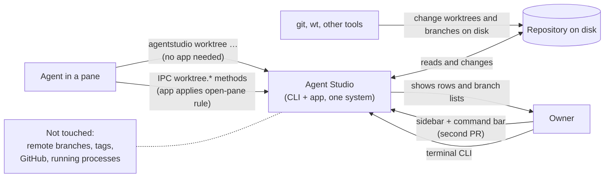
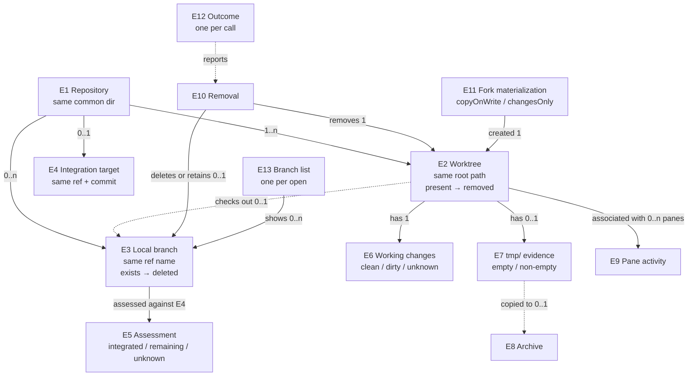

# Worktree lifecycle: what must be true

Date: 2026-10-01, revision 9 (B3b stop: no E4 reports `skipped(noTarget)`). Revision 8 (B3b stop: a failed fetch carries its exact lock fact and any leftover lock it created). Revision 7 (B3b stop: E4 uses the default branch's upstream when `origin/HEAD` is absent, so the automatic fetch refreshes what is assessed). Revision 6 (S6 stop: changes-only refuses a source whose `.gitattributes` differs from HEAD). Revision 5 (S6 implementation stop: Git LFS paths in a changes-only fork get verified real content; other custom filter drivers are refused). Revision 4 (review round 2: F11 fetch and preview effects, F12 exact lock facts, F13 several-target results, F14 default-branch protection scoped to deletion). Revision 3 applied the owner's Socratic round. Serves [the Requirements](2026-09-30-worktree-lifecycle-requirements.md) (L1–L13). Extends the shipped [worktree CLI specification](../2026-09-27-worktree-cli/2026-09-27-worktree-cli-specification.md) (WR1–WR10 stay in force unless a rule here names a change). Rules tagged **(D#)** carry an owner decision recorded in the Requirements. Realized by [the Program Design](2026-09-30-worktree-lifecycle-program-design.md).

## Who touches what



## Things

| Id | Thing | Same when | Always true | States |
|---|---|---|---|---|
| E1 | Repository | same Git common directory | found from any folder inside any of its worktrees, or `--repo <path>` (shipped E1) | — |
| E2 | Worktree | same canonical root path | belongs to one E1; exactly one main worktree per E1; the **current worktree** is the one containing the caller's current directory | present → removed; may be locked |
| E3 | Local branch | same full ref name `refs/heads/<name>` in one E1 | has one tip commit; checked out by at most one E2 | exists → deleted; tip moves |
| E4 | Integration target | same ref and commit | resolved from local refs: origin's HEAD; else local `main`, else `master`, **as its upstream remote-tracking ref when it has one**, otherwise the local branch itself. It equals the shipped default start point (WR1) except in that upstream case, where `new` still starts from the local branch. **E4's branch** is the branch name (`main` for `origin/main`). Always reported with its ref and commit | resolved / none |
| E5 | Integration assessment | same E3 tip commit and same E4 commit | one grade: **integrated** (with its proof), **hasRemainingContribution**, or **unknown** (with a reason). A later call with any moved commit is a new assessment; an assessment never authorizes a later removal by itself | — |
| E6 | Working changes | one per E2 at the moment read | staged, unstaged and untracked (non-ignored) entries and conflicts, per Git's status | clean / dirty / unknown (unreadable) |
| E7 | Evidence folder | the E2's top-level `tmp/` directory | ignored or not, it is lost when the worktree's directory is removed | absent or empty / non-empty |
| E8 | Archive | same destination path | a copy of one E7 at `<archive folder>/<worktree folder name>/`; the destination didn't exist before; it lies outside the E2 being removed | written and verified |
| E9 | Pane activity | one per E2 at the moment read | the Agent Studio panes whose worktree association is that E2 | open (count) / none / notChecked |
| E10 | Removal | one per worktree per call | three separately reported effects: the directory, the local branch, the E7 evidence | see LR15 |
| E11 | Fork materialization | one per created fork | **copyOnWrite** (the shipped APFS fork) or **changesOnly** (a clean checkout of the source HEAD plus the source's working changes) | — |
| E12 | Outcome | one per call | extends shipped E4: created, listed, **removal** (one entry per target: removed, alreadyRemoved, refused, failed, or planned), pruned, refused (the whole call stopped; nothing in the lifecycle changed), failed (says what changed) | — |
| E13 | Branch list | one per open of the list | the local E3s shown by "New Worktree → From a branch" and Find | open → closed |
| E14 | Git lock file | same path | a `.lock` file git or libgit2 creates next to the index, a ref, `packed-refs` or `config` while changing it; another writer can't proceed while it exists. Only a lock whose exact path the tool established is ever named or offered for removal | held (a git process is running, or it's younger than 2 minutes) / looks stale (older than 2 minutes and no git process found; a best-effort judgment, since a non-git writer such as a libgit2 app isn't a `git` process) / unidentified (the tool knows a lock blocked it but not which file) |



## Surface

```text
agentstudio worktree new    <branch> [--from-branch <existing>] [--repo <path>] [--json]
agentstudio worktree fork   <branch> [--changes-only] [--from <path>] [--json]
agentstudio worktree list   [<target>...] [--repo <path>] [--no-fetch] [--json]
agentstudio worktree remove <target>... [--repo <path>] [-f|--force] [-D] [--no-delete-branch]
                            [--archive-to-main | --archive-to <folder> | --discard-tmp]
                            [--remove-stale-lock] [--no-fetch] [--dry-run] [--json]
agentstudio worktree prune  [--repo <path>] [--apply] [--archive-to-main | --archive-to <folder>]
                            [--no-fetch] [--json]
```

The same operations are IPC methods executed by the running app (LR18). No interactive switch, picker or prompt exists on any CLI verb (L8): every verb runs to an outcome from its arguments.

## How every command talks to the agent

The agent decides; the tool informs. Every outcome, human and `--json`, carries:
- a stable **reason code**;
- a one-line **message**;
- the **details** the agent needs to decide (counts, paths, ages, commits);
- the **options** that continue: `"options":[{"flag"|"command": …, "effect": …}]`, each an exact flag or command with what it does.

Rules for what the tool may do on its own:
- **Refreshing information is automatic.** Before judging "merged", the tool fetches the default branch (LR5), because a fetch loses nothing. That fetch is the one write a command may make even when it then stops or only previews; it is always reported in `fetch`.
- **Lossy choices are always the agent's.** Discarding changes, discarding `tmp/`, deleting an unproven branch, and removing a lock file each need their flag.
- **Two hard stops have no options:** removing the main worktree, and deleting the default branch. A linked worktree that has the default branch checked out can still be removed; the default branch itself is always kept.
- **`--dry-run` shows the whole plan without changing anything** (LR25).
- **Re-running a finished removal is safe** (LR10).

## Rules

### Create

| Rule | What must be true | Needs |
|---|---|---|
| LR1 | `new --from-branch <existing>` creates the worktree on a **new** branch `<branch>` starting at the tip of local branch `<existing>`, exactly as the app's "From a branch" does. A missing `<existing>` is refused `startBranchNotFound`. Without `--from-branch`, `new` behaves as shipped WR1. | L3 |
| LR2 | `fork --changes-only` creates E3 `<branch>` at the source worktree's HEAD commit (main or linked, found as in WR2), checks it out clean at the sibling destination (shipped E3), then makes the destination's files equal the source's files for every **carried path**, with the index left at HEAD (staging decided by the owner). Carried paths are: every path tracked in HEAD or in the source index whose file on disk differs from HEAD (including deleted and newly recreated files), plus every untracked file that Git's ignore rules (root and nested `.gitignore`, `info/exclude`, global excludes) don't exclude. What lands is the **file on disk at capture**, never an index-only version: a staged change later undone on disk isn't carried; a file staged as new and then deleted from disk isn't carried; a file staged as deleted and then recreated is carried with its new content. So every carried change is unstaged or untracked in the destination, the same staging result as the APFS fork. File modes are kept; a symlink is copied as a link with the same target text, never followed. Renames arrive as a delete plus an add. The source worktree is not changed. | L4 |
| LR3 | `fork --changes-only` refuses, before changing anything, a source with any of: unresolved conflicts; a merge, rebase, cherry-pick, revert or bisect in progress; a changed or dirty submodule, or an untracked nested repository among the carried paths; sparse checkout, skip-worktree, assume-unchanged or intent-to-add entries; a carried path that isn't a regular file, directory or symlink; a path in HEAD governed by a custom Git filter driver other than Git LFS (for example a `filter=` attribute naming another driver), which can't be checked out with verified content; a `.gitattributes` file whose content differs from HEAD (carried, or staged differently), because the fork's filter handling must follow HEAD's rules (options: commit or stash that change first, or use the APFS fork). Only carried paths are inspected, so an ignored socket in a build folder doesn't block it. Submodules unchanged from HEAD arrive uninitialized, as `git worktree add` leaves them. Git LFS paths that aren't carried arrive with the same content the source worktree has: the real file when the source has it, verified against the pointer's SHA-256 and size, otherwise the pointer text. The refusal is `unsupportedWorkingState` with the reason and relative path. | L4 |
| LR4 | Neither kind of fork turns into the other on its own **(D4)**. A refused or failed APFS fork reports that outcome (shipped WR4, WR5); a `forkUnavailable` refusal names `--changes-only` as the alternative (human line and `"alternative":"changesOnly"` in JSON). A created fork reports its E11 materialization kind: `{"kind":"copyOnWrite", …shipped report}` or `{"kind":"changesOnly","trackedChanges":n,"untrackedFiles":n,"ignoredExcluded":true}`. | L4 |

### Integration (merged)

| Rule | What must be true | Needs |
|---|---|---|
| LR5 | Integration is assessed only against E4, from local objects and refs, with no forge **(L11)**. Before assessing, `list`, `remove` (including `--dry-run`) and `prune` (including its preview) fetch E4's branch alone from its remote, with no tags, no pruning and no submodules, so a squash just merged on GitHub is visible. E4 is then re-resolved from the refreshed ref. `--no-fetch` skips the fetch. The outcome always reports `"fetch":{"status":"fetched","commit"}` \| `{"status":"skipped","reason":"noFetchFlag"\|"noRemote"\|"noTarget"}` \| `{"status":"failed","reason"}`, next to E4's ref and assessed commit. A failed fetch blocked by a git lock adds `"lock":{"path","resource"}` when the exact file was established (`gitLockHeld`) or `"lock":{"resource"}` when it wasn't (`gitLockUnidentified`); any lock the fetch itself created and couldn't remove adds `"lockResidue":[path]` (LR26). Neither stops the command, and no lock option is offered for the fetch. `noRemote` means E4 is a local `main` or `master` with no upstream. When E4 is an upstream ref, the fetch refreshes that ref from its own remote; a locally merged but unpushed branch then reads as not yet integrated, so it is retained (the safe miss). A failed fetch (network, auth, a git lock) never stops the command: it carries on with local content. When E4 is `none`, nothing is fetched (`skipped(noTarget)`, which wins over `noFetchFlag`) and every assessment is `unknown(noTarget)`. | L2, L11 |
| LR6 | A branch is **integrated** when one of these holds, checked in this order **(D1)**: `sameCommit` (tip equals E4's commit); `ancestor` (tip is reachable from E4's commit); `sameContent` (tip's tree equals E4's tree); `emptyDelta` (the branch's net change since its merge base with E4 is empty); `squash` (LR7). "Integrated" means **integrated at some point**: a later revert on the target does not make it unintegrated. | L2 |
| LR7 | `squash` holds when the branch's aggregate change, from its single merge base with E4 to its tip, is **exactly equal** to one commit's change (that commit against its first parent), and that commit is reachable from E4's commit within the most recent 500 commits of E4's first-parent history. "Exactly equal" compares every changed path with its before and after mode and object. No whitespace, line-ending or rename normalization is applied. The assessment names the matching commit. | L2 |
| LR8 | Anything else is **hasRemainingContribution** (one merge base exists, and the search reached a root or completed within the bound with no proof) or **unknown** with a reason: `noTarget` (E4 is none), `noMergeBase`, `multipleMergeBases`, `historyLimitReached` (older history remained past the bound), `incompleteHistory` (the repository has a shallow or grafted history, which makes ancestry and merge-base answers untrustworthy; checked **before** any proof that depends on history, so only `sameCommit` and `sameContent` can still hold), `missingObjects` (an object the proof needs is absent), `readFailed` (this branch's refs or objects couldn't be read). Unknown is never treated as integrated. One branch's unknown never hides another row's result. A root commit ends the squash search; it isn't a candidate. A branch that *is* E4 has no assessment and is reported `isTarget`; a worktree with a detached HEAD has no branch and so no assessment (`null`, shown as `detached`). | L2 |

### List

| Rule | What must be true | Needs |
|---|---|---|
| LR9 | `list` keeps shipped WR6's fields and adds, for each worktree: `isCurrent`, `isLocked`, E6 as `{"status":"clean"\|"dirty"\|"unknown","staged","unstaged","untracked","conflicted"}`, E5 (or `null` for a detached HEAD or the target branch), E7 as `"empty"\|"nonEmpty"\|"unknown"`, and E9 as `"notChecked"` from the CLI or `{"openPanes":n}` from IPC. The top level adds `"target":{"ref","commit"}` or `null`. **Failure granularity:** if the repository or its worktree list can't be read, the outcome is failed `readFailed` with leftovers `notNeeded` (shipped WR6). Anything narrower becomes that row's `unknown` field: a worktree whose status can't be read has changes `unknown`; a branch that can't be assessed has integration `unknown(readFailed)`; a target that can't be resolved makes every row `unknown(noTarget)`. The list still returns every row, exit 0. Each row also answers "can I clean this up?": `"removable":true\|false`, the `blockers` (each a reason code with its options, as LR11), and the exact `remove` command that would succeed. `list <target>...` limits the rows. The human form keeps shipped WR6's line and appends the changes status and the grade, for example `worktree feature/x at /p  clean  integrated (squash 2c9fe2f)`. | L5 |

### Remove

| Rule | What must be true | Needs |
|---|---|---|
| LR10 | `remove` takes one or more targets. It first resolves each to a worktree or branch; inputs that resolve to the same one are merged into one entry listing both inputs. Then it handles every target **independently, in order, to the end**: one target stopping never skips the rest. A target that names an existing directory (relative to the current directory) means the worktree containing it. Otherwise it's a branch name in E1 (found from `--repo` or the current directory). A branch checked out in a linked worktree targets that worktree; a branch with no worktree targets the branch alone (directory and administration effects `notApplicable`). A target that matches nothing is `alreadyRemoved` when no worktree, sibling folder or branch of that name exists now, which says only that it's absent now, not who removed it; so a retry after a crash is safe. Anything else unmatched is refused `notFound`. | L1 |
| LR11 | Stops before anything changes, checked in this order, each with its options. **Hard stop (no options):** `mainWorktree`; and `defaultBranch` for a branch-only target that names E4's branch. **Refusals:** `notFound`; `targetIsCurrent` (options: run from elsewhere, or `--repo`); `worktreeLocked` with its lock reason (option: `git worktree unlock <path>`, then retry); `dirty` with E6's counts and the first changed paths (options: `-f` to discard, commit first, or `fork --changes-only` to keep the work, then remove); `evidenceInTmp` with E7's file count, size and first paths (options: `--archive-to-main`, `--archive-to <folder>`, `--discard-tmp`); `openInPane` with the panes (IPC and UI only; options: close them, `closePanes`, or `removeWithOpenPanes`; LR16); `gitLockHeld` (LR26); `archiveDestinationExists` or `archiveDestinationInsideWorktree` (option: `--archive-to <other folder>`). A refusal means nothing in the lifecycle changed: no worktree, branch, `tmp/` or lock. The automatic fetch (LR5) may have refreshed E4's remote-tracking ref, as its `fetch` status reports. A stop **after** an archive was written is a failure (LR15). | L1, L10, L13 |
| LR12 | The archive options copy E7 **before** the directory is touched: `--archive-to-main` copies it to `<main worktree>/tmp/<worktree folder name>/`, and `--archive-to <folder>` copies it to `<folder>/<worktree folder name>/`. The copy is verified (every file's relative path, size and content hash match the source). If copying or verification fails, nothing else is removed, and the outcome is failed with directory `retained` and evidence `partialCopy`, naming the destination folder, which is left as is. `--discard-tmp` removes E7 with the directory. `-f` never implies any of these. Verification is done in memory; no manifest or state file is written. | L10 |
| LR13 | The worktree's directory and its Git administration are removed only after LR11 and LR12 pass. `-f` permits discarding E6's changes and nothing else: not a lock, not a branch, not E7. | L1 |
| LR14 | For a worktree target, only after the directory **and** the administration are both `removed`; for a branch-only target, whose effects are `notApplicable`, straight away. The branch is **deleted** when its assessment is integrated, or when `-D` is given. It is **retained**, with a reason and its options, when: it is E4's branch (`defaultBranch`, no option, even with `-D`); `--no-delete-branch`; `hasRemainingContribution` or `unknown` without `-D` (option: `-D`); it is checked out in any worktree, or a worktree's checkout can't be read (`checkoutUnknown`); or its tip moved since the assessment (`movedSinceAssessment`, even with `-D`; option: run again to reassess). A partial or unknown worktree effect never leads to branch deletion. Deletion only removes the branch if its tip is still the assessed commit, checked while the branch is locked against other writers. A retained branch keeps its ref, configuration and reflog exactly as they were. A deleted branch's configuration and reflog are cleaned up only while no branch of that name can be created meanwhile; otherwise they're left in place and reported as a warning. Only that one local branch is ever deleted. | L1, L2 |
| LR15 | Each **removed** entry reports each E10 effect: `directory: removed \| notApplicable`; `administration: removed \| notApplicable`; `branch: {name, commit, disposition: deleted \| retained, reason?, cleanupWarnings?}`; `evidence: {status: archived, path, files} \| discarded \| none`; the E5 used; and E9. A **failed** entry after any change reports every effect separately and truthfully: directory and administration each `removed \| retained \| partial \| unknown` (unknown whenever the result couldn't be observed; an unreadable path is never reported as removed), branch `deleted \| retained \| unknown`, and evidence `archived \| partialCopy \| discarded \| none`, plus the typed failure kind. It never prints raw Git text (shipped WR5). **Exit code for the whole call:** 2 if any entry failed; else 1 if any entry was refused; else 0 (every entry removed, alreadyRemoved or planned). The top-level outcome is `removal` with its entries in input order, so an agent can see exactly which targets to retry, even for a single target. | L1 |
| LR16 | **(D5)** The standalone CLI can't see Agent Studio's panes: it reports E9 `notChecked` and doesn't stop on activity. An IPC or UI removal **warns** with `openInPane` when any pane is associated with the target worktree, listing the panes, and offers three options: close them first (the agent calls `pane.close`, or passes `closePanes`, which closes them before removing); `removeWithOpenPanes`, which proceeds, leaving those panes open without their worktree association (as with any outside removal, LR20); or stop. The warning is checked twice: before archiving, and again at the last moment before the app hands the removal to agentstudio-git. A pane opened after that last check isn't blocked, and ends like the `removeWithOpenPanes` case (owner: "if gap happens it's fine"). Nothing stops or kills a process as a side effect. | L1, L7 |

### Prune

| Rule | What must be true | Needs |
|---|---|---|
| LR17 | `prune` considers linked worktrees only. A **candidate** is not current, not locked, has a checked-out branch whose assessment is integrated, has clean E6, and has an empty E7 or was given an archive option (`--archive-to-main` or `--archive-to <folder>`, each archive going to its own `<worktree folder name>/`). Without `--apply`, it changes nothing in the lifecycle (its only write is the reported LR5 fetch) and lists each worktree as `wouldRemove` or `skipped` with its reason and options. With `--apply`, each candidate is removed by the LR11–LR15 sequence, re-checked at that moment, with branch deletion as in LR14. `-f` and `-D` don't exist on `prune`. The outcome is `pruned` with `applied` and one entry per worktree (`removed`, `wouldRemove`, `skipped` with reason, or `failed` with its effects). Exit 0 unless an entry failed, then 2. Local branches without a worktree are never touched. | L1, L2 |

### IPC and the standalone CLI

| Rule | What must be true | Needs |
|---|---|---|
| LR18 | The running app performs create from default, create from a branch, fork (either materialization), remove and prune (preview and apply) through the IPC methods `worktree.create`, `worktree.fork`, `worktree.remove`, `worktree.prune` and `worktree.list`. These have the same arguments, rules and outcome object as the CLI's `--json`. The methods follow the fast-CLI rule: their contracts are compiled into the CLI, and a call goes straight to the app with no per-call catalog fetch. An IPC call that changes worktrees returns only after the app's sidebar reflects the change (rows appear, or disappear). **(D6)** | L1, L7 |
| LR19 | The CLI verbs still run in the CLI process, open no socket, read no credential, and work with the app closed (shipped WR7). | L1 (W5) |
| LR25 | `remove --dry-run` removes, archives, deletes and unlocks nothing: no worktree, branch, `tmp/` or lock file changes, even with `--remove-stale-lock`, which it reports as "would remove". Its only write is the reported LR5 fetch, and `--no-fetch` makes it fully read-only. It reports, per target, the plan it would run and where it would stop: fetch, checks, archive destination, directory removal, and branch disposition. It uses the same reason codes and options as a real run. Each entry is `planned`; exit 0 unless a target can't even be resolved. | L1 |
| LR26 | When a git lock file blocks a step, the command stops with `gitLockHeld`. It names the lock's exact path and the resource it guards (index, ref, packed-refs, config), with the lock's age, whether a git process was found, and whether it looks stale. Options: wait and retry; and, only when the exact path was established and it looks stale, `--remove-stale-lock`, which removes exactly that file after re-checking it's the same file and still stale. When the tool knows a lock blocked it but can't establish which file, it reports `gitLockUnidentified` with the resource, and offers only retry. A permission error or a deliberate worktree lock is never reported as a git lock. The worktree commands remove every lock they create, on success and failure. If the operating system refuses that removal, the outcome names the leftover lock path; it never claims a clean finish. A process that is killed can't clean up, and that is outside this promise. The stale threshold (2 minutes) is a policy default. | L13 |

### What the app shows (any tool, any process)

| Rule | What must be true | Needs |
|---|---|---|
| LR20 | When a worktree in a watched folder is added or removed by any tool, the sidebar row appears or disappears through discovery, with no restart. Panes associated with a removed worktree stay open and lose that association (current behavior, kept). | L6 |
| LR21 | When a worktree's checked-out branch changes by any tool, its row shows the new branch (current behavior, kept). | L6 |
| LR22 | Each time a branch list (E13) opens, it shows the repository's local branches as they are at that moment: branches created, deleted, renamed or packed by any tool since the last open are reflected. While a list stays open, it isn't required to change; choosing a branch deleted meanwhile is refused `startBranchNotFound`. | L6 |

### App UI (second PR)

| Rule | What must be true | Needs |
|---|---|---|
| LR23 | A **Remove Worktree…** action appears in a linked worktree row's menu (beside Fork This Worktree) and in the command bar for a worktree target. It isn't offered for the main worktree. Before removing, it shows the E5 grade and proof, E6, what happens to the branch (LR14), and E7's choice: choose an archive folder, or discard. It applies LR11–LR16 exactly. When panes are open in the worktree, it warns and lists them, offering **Close Panes and Remove**, **Remove Anyway** (the panes stay open without their worktree), and **Cancel**; nothing happens to the panes unless chosen. | L7 |
| LR24 | New Worktree's Fork section offers a changes-only fork beside the APFS fork, with the help text "Tracked changes and untracked files; no ignored files or build outputs". | L4, L7 |

## Not promised

- No sweeping of local branches without a worktree; no remote branch, tag or remote-ref deletion.
- No proof that a squash with conflict edits, a partial squash, or a squash older than the 500-commit bound was merged: those stay `hasRemainingContribution` or `unknown`, and `-D` remains the explicit way out.
- No stopping, closing or killing of processes or panes as a side effect (UI closes panes only when the user picks Close Panes and Remove).
- No protection from an unrelated tool writing into a worktree during the moment between the last check and the directory removal, and no block on a pane opening after the last activity check (LR16).
- "Looks stale" for a git lock is a best-effort judgment (age plus no running git process); the agent decides whether to remove it.
- No atomic snapshot of a whole worktree for a changes-only fork: each carried file must match what was captured, and the repository state must be unchanged at the end; paths that aren't carried may change freely.
- No persisted CLI state: the worktree commands write no state or manifest files. The `tmp/` archive is a copy of the caller's own files.
- The CLI promises disk completion, not app display timing (shipped WR8). IPC calls wait for the sidebar (LR18).
- The fetch is of E4's branch only; other branches and remotes are never fetched, and nothing is ever pushed.

## Cross-cutting

- **Privacy:** archives are local copies only, never uploaded. The app's telemetry (OTLP) exports no paths, branch names or archive contents; operation kinds and outcome kinds only.
- **Safety under races:** every destructive step re-checks its precondition at the moment it runs (dirtiness, lock, branch tip). The branch is deleted only at the assessed commit.
- **Performance:** `list` computes integration for every worktree with the LR7 bound. Its duration on this repository (about 20 worktrees) is measured and recorded; no threshold is promised before that measurement.
- **Accessibility:** the UI actions are reachable from the command bar by keyboard.

## Proof

| Rules | Evidence |
|---|---|
| LR5–LR8 | Integration tests on real temporary repositories: the automatic fetch updating E4 from a local bare remote (with `origin/HEAD`, and without it where local `main` tracks the remote, so E4 is the upstream ref), `--no-fetch`, and a failed fetch falling back with its status; a shallow and a grafted repository giving `incompleteHistory` before any ancestry proof; each grade and proof and each unknown reason, including: exact squash; squash plus later target edits to other files (still squash); squash plus later edits to the same files (still squash, delta compared at the squash commit); target edits to the same files that landed *before* the squash (not squash: the before-objects differ, a deliberate safe miss); a conflict-resolved squash (not squash); a partial squash (remaining); a whitespace-only difference (not squash); binary, mode, symlink and rename changes; multiple merge bases; beyond the bound (unknown). Plus the two real squash pairs from this repository, #388 (`89f96271…` / `899bd9c7…`) and #395 (`900cb5ca…` / `2c9fe2f3…`), both assessed `integrated (squash)` |
| LR10–LR16, LR25, LR26 | Integration tests on temporary repositories for every stop in LR11, each with its reason code and options (nothing changed on disk afterwards); several targets with mixed results (removed, refused, alreadyRemoved, failed) processed to the end, with the aggregate exit code; duplicate targets merged; `alreadyRemoved` on a repeat; `--dry-run` with a newer remote tip and with `--remove-stale-lock` (only the reported fetch changes anything); a refusal after a successful fetch reporting that fetch; a linked worktree on the default branch removed with the branch kept, and a branch-only `-D` on the default branch hard-stopped; `--archive-to-main`; competing index, ref and config locks, each reported by its actual path; an unidentifiable lock (retry only); a permission error not reported as a lock; `--remove-stale-lock` removing exactly that file; a denied removal of the command's own lock reported by path; a branch-only target deleting the branch straight away; archive success, archive failure (worktree intact, `partialCopy`), and a lock or dirty refusal after the archive (failed, archive kept, exit 2); each branch disposition, `-f`, `-D`, and `--no-delete-branch`; a tip moved after lookup and before deletion (branch, configuration and reflog unchanged); an unreadable linked worktree (`checkoutUnknown`); a same-name branch recreated after deletion (its metadata untouched, warning reported); partial or unobservable directory and administration removal (reported `partial`/`unknown`, no branch deletion); CLI golden output for removed, refused and failed |
| LR17 | Integration test: a repository with integrated, dirty, locked, current, unintegrated and evidence-holding worktrees; preview changes nothing; apply removes exactly the candidates. Through IPC: preview, apply with mixed results, and an open-pane worktree skipped |
| LR1–LR4, LR24 | Integration tests: from-branch start point; changes-only payload for each LR2 case (staged and unstaged edits to one file, staged delete then recreate, staged new then deleted, rename and rename chains, file↔symlink and file↔directory replacement, modes, ignored excluded across root/nested/info/global rules, tracked-but-ignored kept), asserting destination bytes and a HEAD index; each LR3 refusal; a carried file edited after capture with its status unchanged, a HEAD move, and a path swapped for a symlink (each `sourceChanged`, rolled back or residue reported); the `forkUnavailable` alternative; the materialization report |
| LR9 | CLI golden output (human and JSON) for a repository with each state, including a mixed list with an unreadable worktree, a missing branch object, no target, a detached HEAD and a shallow history, each shown as its row's unknown while the other rows stay exact |
| LR18 | IPC tests through the real registry for each method: outcomes match the CLI; `openInPane` refusal, including a pane opened after the first check and before removal; sidebar reflects the change when the call returns; no per-call catalog fetch |
| LR19 | The shipped dispatch test extended to `remove` and `prune` (no IPC client, no credential read) |
| LR20–LR22 | Real-app proof on a debug build: create, fork and remove a worktree with the CLI and with plain `git`; observe the row appear and disappear. Create, delete, rename and pack branches with plain `git` while no checkout status changes; reopen the branch list and observe each change. Observed through typed facts and the branch-list result, not timed waits |
| LR23 | Native debug-build screenshots of the Remove Worktree confirmation (integrated, remaining, dirty, open panes) |
| Performance | `list` duration on this repository, recorded |

## Coverage

| Need | Things | Rules | Proof |
|---|---|---|---|
| L1 | E1–E3, E6–E10, E12 | LR10–LR19 (prune on CLI and IPC) | remove/prune integration, IPC, dispatch |
| L2 | E3–E5 | LR5–LR8, LR14 | integration grades + real #388/#395 pairs |
| L3 | E3 | LR1 | from-branch integration |
| L4 | E11 | LR2–LR4, LR24 | changes-only payload + refusals |
| L5 | E5–E7, E9 | LR9 | list golden |
| L6 | E2, E3, E13 | LR20–LR22 | real-app proof |
| L7 | E9, E10 | LR16, LR18, LR23, LR24 | IPC tests + native screenshots |
| L8 | — | Surface (no prompts) | argument parser tests (no interactive path exists) |
| L9 | E2 | shipped E3 naming unchanged | existing naming tests |
| L10 | E7, E8 | LR11, LR12 | archive integration incl. `--archive-to-main` |
| L11 | E4 | LR5 | fetch from a local bare remote; `--no-fetch`; failed fetch fallback |
| L13 | E14 | LR11, LR26 | held/stale lock integration |
| L12 | — | realized in Program Design | SDK tests |
