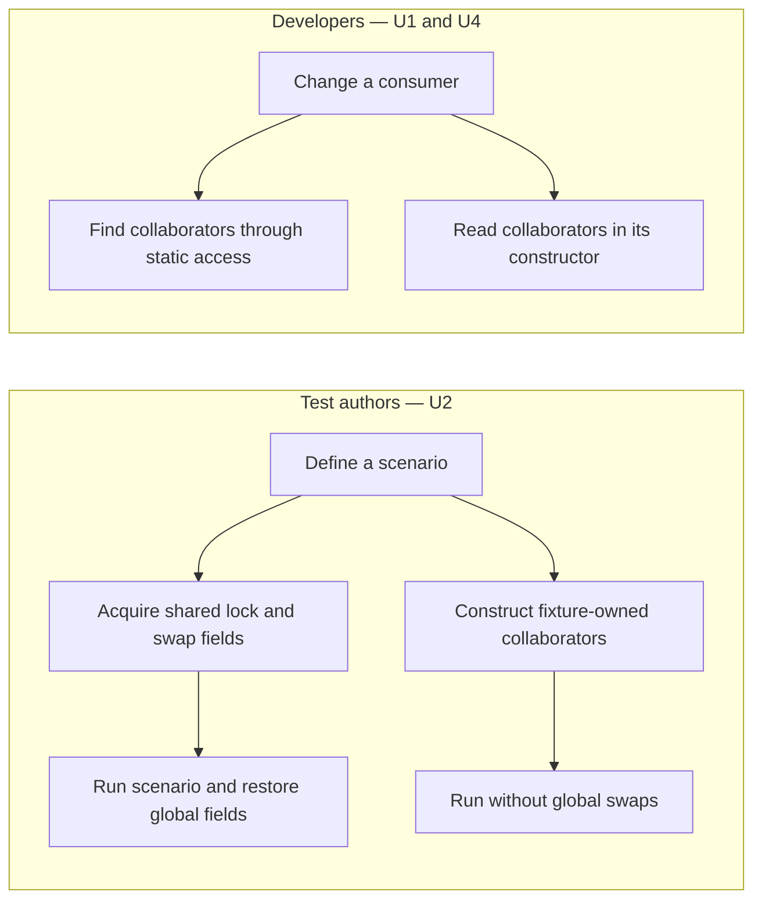

# Composition-Root Dependency Injection — Requirements

Date: 2026-10-02 (decisions through 2026-10-06)
Artifact: `Requirements` (problem statement). The Specification and Program
Design are separate, later artifacts.
Status: **goal boundary owner-confirmed 2026-10-06** (see
[Goal boundary](#goal-boundary)).

## Identity and authority

Requirements identity: `REQ-2026-10-02-COMPOSITION-ROOT-DI`

Goal in the owner's words (2026-10-04): dependency injection and
composability, so that testing improves.

Authority is the owner's direction and answers:

- Owner direction 2026-10-02, relayed by the CI Lead: treat the command
  dispatcher, the Ghostty runtime registry, and the startup trace recorder as
  one problem. They become objects that startup code creates and passes in, not
  one-off patches. The motivation is testability and explicit ownership, not CI
  speed.
- Owner constraints 2026-10-02: compile-time safety where possible, easier to
  reason about, hardened; no real-engine isolation tests now.
- Owner answers 2026-10-04: D3–D6 below, and the scope cut recorded in D2.
- Owner direction 2026-10-04: the work runs on sunclaw, led by a sunclaw Lead,
  with the Sunbook Lead as its Advisor.
- Owner answers 2026-10-06: "no wait for 27" to restarting design, and
  "Confirm as written" to the goal boundary. Design restarts now; implementation
  remains subject to reviewed design, a plan, and explicit implementation go.

Implementation sources cited here are observational evidence about today's
behavior, not authority for the desired behavior.

## Terms

- **Global**: an object kept in a `static` that any code can reach, such as
  `AppCommandDispatcher.shared`.
- **Startup code**: [`main.swift`](../../../Sources/AgentStudio/main.swift) and
  `AppDelegate`, where objects are created at launch.
- **Ghostty engine**: the one Ghostty instance every terminal pane uses
  (`ghostty_app_t`, wrapped by `Ghostty.App`). Upstream Ghostty also keeps one
  per process.
- **Ghostty callback**: Ghostty calling our code to report on a terminal
  (title, folder, bell, exit, close) or on the engine (wake up).
- **Callback code**: today's static `Ghostty.ActionRouter` functions and their
  static fields, which handle Ghostty callbacks.
- **Terminal lookup**: `SurfaceManager`, which maps terminal views to terminal
  and pane identities.

## Decisions

| Id | Decision | Why (owner's reason) | Rejected | Status |
|---|---|---|---|---|
| D1 | Nothing is designed for more than one copy. The app keeps one dispatcher, one runtime registry, one recorder, one terminal lookup, and one Ghostty engine, as it does today. The change is that startup code creates them and passes them in. | Matches how the app and upstream Ghostty already work; no current need for more. | Designing for several copies per process. | accepted 2026-10-02, reworded 2026-10-04 |
| D2 | A launch-time guard against a second copy, and its stable-build behavior. | — | — | **superseded 2026-10-04**: the owner cut it as scope the Lead had added. Also cut: the "app setup" term and the A/B/C framing, and the question about a dependency container. |
| D3 | Hardening is in scope: the lock-protected callback stores become compiler-checked, and work done inside Ghostty's call is separated from work done later on the main thread, so the compiler refuses to mix them. | Owner: make it compile-time safe and hardened while the code is reshaped. | Hardening as a follow-up. | accepted 2026-10-04 |
| D4 | Done means deletion plus proof: the globals and their test-isolation helpers are gone, and the test suites whose only shared state was these globals run in the normal parallel test lane. | Owner: show the testability gain, not only claim it. | Deletion only. | accepted 2026-10-04 |
| D5 | The Linear project "AgentStudio/Refactoring, better ci and tests" is an umbrella; this work is one milestone in it. | Owner answer. | A project for this work only. | accepted 2026-10-04 |
| D6 | The other globals the callback code reaches are removed everywhere, not only from the callback path, in three steps: (1) callback code and startup; (2) the uses that already take the object as a parameter, plus the engine; (3) the view uses. If step 3 becomes difficult, steps 1–2 ship and step 3 becomes its own ticket. | Owner: "ok", after seeing that most uses are mechanical and that step 1 alone equals the smaller option. | Pass them in to the callback code only. | accepted 2026-10-04 |

## Consumers and affected outcomes

| Id | Class | Need or outcome | Evidence | Authority | Priority |
|---|---|---|---|---|---|
| U1 | Developers changing app code (owner and agents) | The command dispatcher, the Ghostty runtime registry, the startup trace recorder, the terminal lookup, and the Ghostty engine are created by startup code and handed to the code that uses them. No code reaches them through a static. | 65 dispatcher uses in 21 app files; the registry is set by a static setter; 19 terminal-lookup uses outside the callback code | authorized (owner 10-02; D6) | must (owner) |
| U2 | Test authors | A test builds its own dispatcher, registry, terminal lookup, and callback handling, with fakes. The global lock-and-swap helpers no longer exist. | `withIsolatedCommandDispatcher` swaps four global fields under a lock; 62 test files overwrite the registry global | authorized (owner 10-02; D4) | must (owner) |
| U3 | CI lane owner | The suites whose only shared state was these globals run in the normal parallel lane, as the lane inventory shows. | ~20 such suites by text match (CI Advisor R4, 2026-09-30), not yet measured | authorized (D4) | must (owner) |
| U4 | Developers | Where the compiler can enforce the setup's rules, it does; build-time lint covers the rest. Collaborators cannot be swapped after startup, only startup code constructs the engine and callback handling, and immediate and later callback work cannot be mixed. | Owner constraint 10-02; D3 | authorized | must (owner) |
| U5 | — | superseded 2026-10-04 (launch-time guard, cut with D2) | — | — | — |
| U6 | — | superseded 2026-10-04 (stable-build guard behavior, cut with D2) | — | — | — |
| U7 | Terminal users | Terminal behavior is unchanged: titles, working folder, bell, exit, close, and the startup milestones recorded for the observability proofs. A closed pane never receives a late update. | Standing rule: preserve established behavior | authorized (existing contract) | must |

Out-of-scope classes: hosts other than the GUI app. A headless daemon runs in its
own process, per owner direction 2026-09-26, and is not built here.

## Current observable problem

Test authors need independently constructed fixtures instead of shared swaps
(U2); developers need visible construction and ownership (U1, U4). This view
shows their different jobs and where the current globals impose a cost:

The upper current path is evidenced by the dispatcher isolation helper; the
static consumer path is evidenced below. The lower alternatives are desired
outcomes. No user-visible screen or control changes are requested.

P1 — Three objects are globals, reachable from anywhere. Their owners plug in
collaborators at launch:

- the main window's tab controller and `AppDelegate` set the dispatcher's
  handlers
  ([PaneTabViewController.swift:569](../../../Sources/AgentStudio/App/Panes/PaneTabViewController.swift#L569),
  [AppDelegate+WorkspaceBoot.swift:513](../../../Sources/AgentStudio/App/Boot/AppDelegate+WorkspaceBoot.swift#L513));
- `WorkspaceSurfaceCoordinator` overwrites the callback code's registry each
  time it is constructed
  ([WorkspaceSurfaceCoordinator.swift:309](../../../Sources/AgentStudio/App/Coordination/WorkspaceSurfaceCoordinator.swift#L309));
- `AppDelegate` copies the startup recorder into a static
  ([AppDelegate.swift:170-171](../../../Sources/AgentStudio/App/Boot/AppDelegate.swift#L170)).

P2 — On each terminal callback, the callback code reaches several globals:

- the terminal lookup (`SurfaceManager.shared`);
- the registry override, plus a fallback registry (`RuntimeRegistry.shared`);
- a translator (`GhosttyAdapter.shared`);
- the startup recorder;
- three static stores: the trace queue, the drain scheduler, and the
  accumulator
  ([GhosttyActionRouter.swift:26-41](../../../Sources/AgentStudio/Features/Terminal/Ghostty/GhosttyActionRouter.swift#L26)).

The engine itself is also a global (`Ghostty.sharedApp`,
[Ghostty.swift:14](../../../Sources/AgentStudio/Features/Terminal/Ghostty/Ghostty.swift#L14)).

P3 — Instead of building their own objects, tests protect themselves with
process isolation and global swaps. In production each global is set once; the
harm falls on tests and on ownership nobody can see.

P4 — Nothing in the code forces these globals:

- Every Ghostty callback carries a pointer back to the engine or to the
  terminal (`ghostty_app_userdata` and `ghostty_surface_userdata` in the
  vendored header).
- The dispatcher already has a protocol (`AppCommandDispatching`).
- Production has exactly one runtime registry; boot passes it in
  ([AppDelegate+WorkspaceBoot.swift:443](../../../Sources/AgentStudio/App/Boot/AppDelegate+WorkspaceBoot.swift#L443)).
  The fallback to a second registry fires only in tests.

## Existing foundation to reuse

- Startup code already creates the preferences, the trace runtime, and the
  startup recorder before `AppDelegate`, and passes them in
  ([main.swift:10](../../../Sources/AgentStudio/main.swift#L10)).
  `TerminalActivityRouter` already receives the recorder through its
  constructor.
- The `AppCommandDispatching` protocol and the `GhosttyActionRoutingLookup`
  test seam.
- Of the 19 terminal-lookup uses outside the callback code, 4 already take the
  lookup as a parameter with the global as the default, and 4 are in startup
  code.
- The fallback registry and the translator are used only by the callback code.
- The callback stores are already keyed by terminal ID and lock-protected.
- The architecture lint (`Tools/AgentStudioArchitectureLint`) and the #441
  singleton ledger, which shrinks as globals are removed.

## Dependencies and location

- Owner 2026-10-04: implementation and proof run on sunclaw.
- Owner direction 2026-10-06: design restarts now without waiting for the
  Xcode 27 migration. Implementation targets `main` on Xcode 27 after the
  migration lands; Xcode 26.x will no longer run its Swift test lanes.
- Implementation and proof run on sunclaw with Xcode 27.0. No Xcode 26.6
  install is needed. Starting implementation before the migration lands requires
  deliberate toolchain coordination with the CI owner; no workaround is implied.
- The per-target runner preserves the process-isolation contract. Removing a
  global does not remove unrelated isolation requirements. Delete any serialized
  suite shell emptied by this work; a zero-test isolated suite fails preflight.
- The Ghostty callback code and terminal hosting belong to the Panes Lead's
  area; startup and the dispatcher touch the IPC Lead's area.

## Goal boundary

Status: **owner-confirmed as written on 2026-10-06.**

- **Goal:** the dispatcher, runtime registry, startup recorder, terminal
  lookup, and Ghostty engine are created by startup code and passed in. Once
  nothing reaches them, the fallback registry and the translator are deleted.
  Tests build their own objects and run in parallel.
- **Affected classes:** U1–U4 and U7 above.
- **Missing observable difference:**
  - nothing reaches these objects through a static;
  - the test-isolation swap helpers are gone;
  - the affected suites run in the parallel lane.
- **May change:**
  - startup and boot code;
  - command hosting and windows;
  - the Ghostty callback code and terminal hosting;
  - `RuntimeRegistry`;
  - tests and test helpers;
  - the architecture lint (a new construction-site rule);
  - the test lane inventory (with the CI Lead).
- **Protected:**
  - vendored Ghostty and zmx (no vendor changes);
  - user-visible terminal behavior (U7);
  - observability trace names and milestones;
  - the command catalog and spec system;
  - the IPC wire contract.
- **Non-goals:**
  - designing for more than one copy (D1);
  - real-engine isolation tests;
  - a daemon or other host;
  - the other globals on the #441 ledger that this work does not reach: event
    buses, telemetry, URL history, geometry diagnostics, renderer state
    delivery, restore trace, view registries, and sequence counters.
- **Acceptable complexity:**
  - Expected: constructor parameters passed through existing owners; one
    callback object replacing the static callback code; checked lock types;
    one lint rule; deleted test helpers.
  - Injection means passing objects through constructors. Renewed approval is
    needed for:
    - a new atom, store, coordinator, or bus event;
    - any change to the IPC wire or the command catalog;
    - vendor changes;
    - a container or service locator that hands out objects.
- **Acceptable evidence:**
  - the globals and helpers are absent from `Sources/` and `Tests/`;
  - the #441 ledger entries for the touched files drop, and the ratchet passes;
  - the lane inventory shows the affected suites in the parallel lane;
  - `mise run test` passes on sunclaw;
  - a debug launch on sunclaw shows terminal titles, folder, exit, close, and
    the startup milestones unchanged (`mise run verify-debug-observability`).
