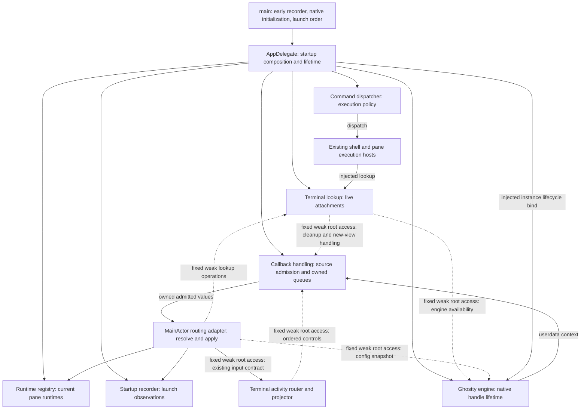
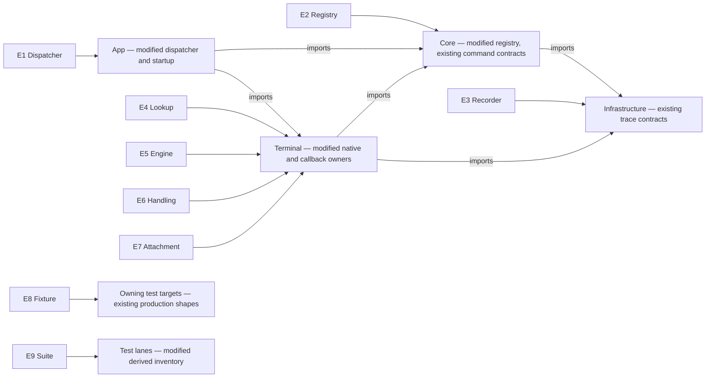
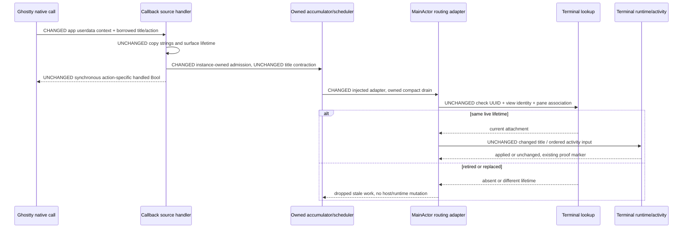
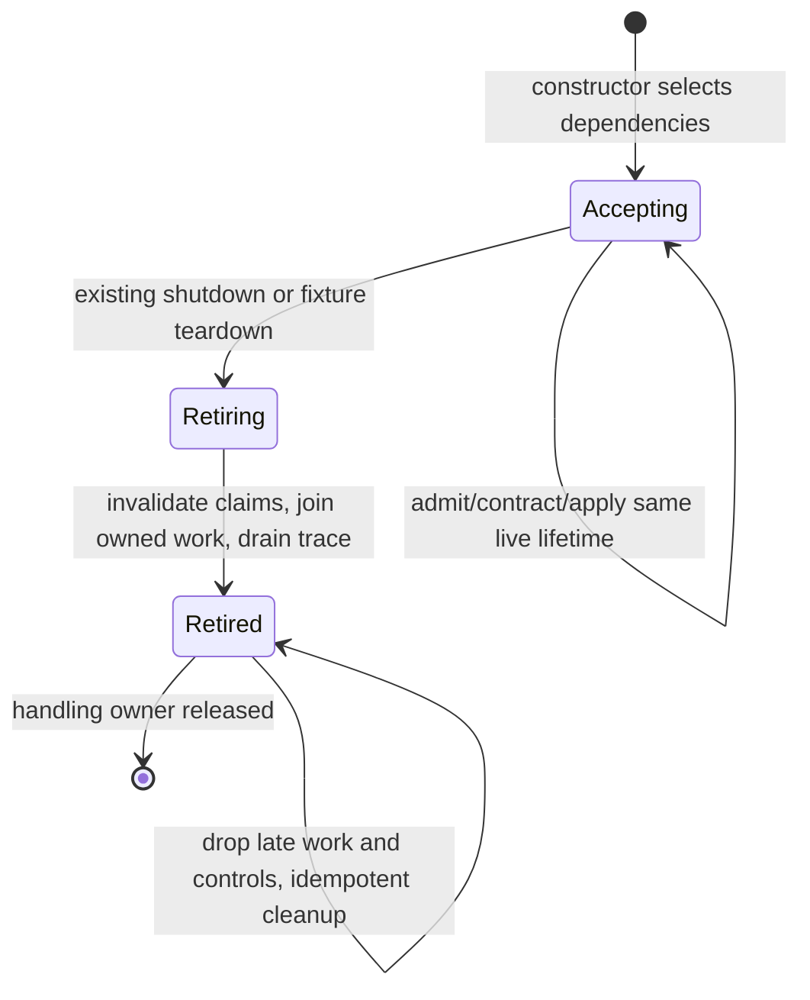
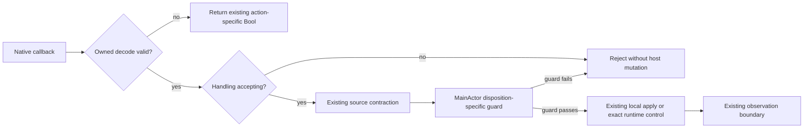
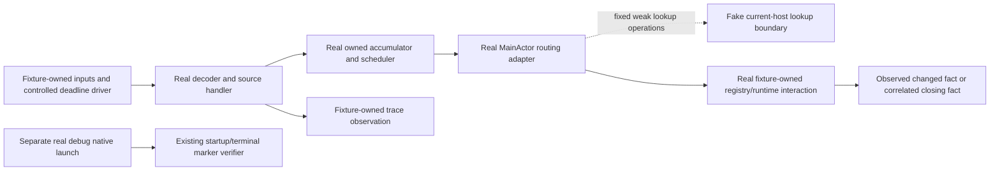

# Composition-root dependency injection — Program Design

Program Design identity: `DESIGN-2026-10-06-COMPOSITION-ROOT-DI`.
Observable obligations: [Specification](2026-10-06-composition-root-di-specification.md)
(`SPEC-2026-10-06-COMPOSITION-ROOT-DI`). Goal and protected boundaries:
[Requirements](2026-10-02-composition-root-di-requirements.md).

## Startup owns the objects; consumers receive them

The reader question is who constructs and retains the selected objects, and
where the callback boundary ends. Startup means the existing `main.swift` and
AppDelegate boot owner, not a new dependency container.



The lifetime owners are root → engine/native handle, root → lookup/attachments,
and root → callback handling. Handling retains its adapter, registry and recorder;
the adapter's fixed lookup operations weakly capture the selected lookup. Surface
views may retain their selected engine and handler, but neither path retains
lookup back through the adapter. Root owns lookup lifetime. This breaks the
indirect lookup → view → handling → adapter → lookup cycle as well as the
construction cycles; natural weak-target absence drops work, never selects a
replacement. Reverse calls use fixed weak target closures. Activity
projection, command policy, native focus synchronization and surface retirement
keep their existing owners. Their reason to change remains their current domain
behavior, not dependency retrieval.

### Bind each entity to its implementation home

The table binds the Specification terms; it does not redefine their identities.
The Swift conventions are actor-isolated owners, package visibility, native
payload enums and Sendable cross-executor values. Runtime references are not
persisted, derived snapshots or new caches. E9's inventory is derived evidence.

| Entity | Semantic owner | Module/home and change | Type/shape home | Boundary shape | Storage/disposition |
| --- | --- | --- | --- | --- | --- |
| E1 Command dispatcher | App startup retains it; dispatcher owns dispatch policy | App/Commands, modified `AppCommandDispatcher` | Core existing `AppCommandDispatching`, `AppCommand`, execution requests; App existing concrete dispatcher | Constructor-selected MainActor owner-access closures; existing typed requests and Bool/`AppCommandExecutionOutcome` results | Runtime-only; neither persisted, derived nor cache |
| E2 Runtime registry | Registry owns pane registration; App startup retains the chosen instance | Core/RuntimeEventSystem/Registry, modified `RuntimeRegistry` | Core existing `PaneId`, `PaneRuntime`, `RegistrationResult` | `PaneId` → optional `any PaneRuntime`; registered identity stays singular | Runtime-only |
| E3 Startup recorder | Recorder owns observations; main creates it before delegate | Infrastructure/Diagnostics, existing `AgentStudioStartupTraceRecorder` | Existing Infrastructure trace values | Existing startup phase/outcome/attributes; fixed recorder reference | Existing diagnostic output persistence only; no new storage |
| E4 Terminal lookup | Lookup owns live mappings; startup retains it | Terminal/Ghostty, modified `SurfaceManager` | Existing Terminal `GhosttyActionRoutingLookup`, `WorkspaceSurfaceManaging`, surface types | Surface UUID + view `ObjectIdentifier` → optional current pane/runtime host; narrow engine-access closure for creation | Runtime-only live membership |
| E5 Ghostty engine | Engine wrapper owns native app/config handles | Terminal/Ghostty, modified `Ghostty.App`, existing `AppHandle` | Existing native `ghostty_app_t`, existing surface configuration; new typed engine availability in Terminal | MainActor availability `available(App)` or `unavailable`; native handles remain inside engine-facing owner | Runtime-only; native resources |
| E6 Callback handling | Source handler owns admission state; MainActor adapter owns routing access | Terminal/Ghostty, modified `Ghostty.ActionRouter`; new `GhosttyCallbackContext` and thin `GhosttyActionRoutingHost` | Terminal new owned callback work enums; existing disposition, drain request and activity input types | Private synchronous native decoder → owned Sendable action/target → MainActor apply; existing terminal events/trace attributes | Runtime-only; bounded pending state |
| E7 Terminal attachment | Lookup owns membership; surface view owns native surface | Terminal/Ghostty and Terminal/Hosting, modified existing owners | Existing UUIDv7 surface ID, view identity and `PaneId`; existing local-action and runtime shapes | Fixed terminal lifetime snapshot + copied action; exact paths resolve current membership, direct paths use `GhosttyNativeViewApplyOperation` across native-live states | Runtime-only; existing checkpoint behavior unchanged |
| E8 Test fixture | Scenario owns its real routing/admission owners and fake external boundaries | Existing test targets appropriate to each owning module | Same production contracts, fake command/lookup/native boundaries | Typed owned actions, observed dispatch/trace/runtime effects, controlled scheduler callbacks | Runtime-only; fixture-scoped |
| E9 Test suite | Test lane owner classifies and runs suites | Existing scripts/test declarations, modified inventory | Existing lane classification and suite selector shapes | Current effects inventory → isolated or parallel row + nonzero execution evidence | Derived source/lane evidence |

This entity-to-home view makes package direction visible before interface detail:



Core does not import App or Terminal. Feature consumers use Core command
contracts and their own injected interfaces. SharedComponents remains stateless
and receives values/callbacks; it does not read this composition.

## Construction without a container or replaceable dependencies

The construction cycles are dispatcher ↔ shell/pane hosts, engine → handling
→ lookup → engine, lookup ↔ handling, and handling/adapter ↔ activity router.
The lookup calls handling on detach/close and passes it to new surface views;
the activity router calls handling for ordered activity controls. Fixed weak
root-access closures break these reverse edges, without service-registration
slots or mutual lazy-property forcing. The adapter's config-cache apply also
needs the selected engine; app lifecycle binding needs its selected instance.

| Direction | What it buys | What it costs / why selected or rejected |
| --- | --- | --- |
| Inject already-constructed concrete hosts into every constructor | Direct references; few abstractions | Cannot construct the dispatcher, lookup/handling/engine and activity reverse edges without staged mutable fields. Reject that cycle as the root structure. |
| Introduce bindable forwarding holders or a general resolver | Explicit construction order | Adds mutable dependency slots or a container, obscures lifetime and permits rebinding. Outside the confirmed acceptable structure. |
| Fixed typed access closures at the existing root — selected | Preserves late host appearance and engine creation order; consumers receive narrow stable contracts | Root needs weak captures and explicit forcing of lazy local owners during startup. Tests must provide realistic owner absence/readiness. No generic lookup or replacement API. |

AppDelegate owns private, read-only-to-consumers construction properties for the
dispatcher, lookup and callback handling. Where self-dependent closures require
Swift's two-phase initialization, these are private lazy properties created by
startup before the application event loop. The construction rule forbids later
assignment/reset as well as construction outside the admitted startup homes.
They are not an ambient registry: each consumer receives its specific object or
operation through a constructor. Only production construction of the public
engine/handling identities is confined to `main.swift` and AppDelegate's
startup constructors/private construction properties in App/Boot. Terminal
constructor definitions may build their private context/handle/state children;
they are not additional callsite homes for creating an engine/handling identity.
Test targets may construct handling and its adapter with fake engine-facing
boundaries; real native-engine construction is not admitted in these fixtures.
The lint restriction applies to both Sources and Tests, with these explicit
homes, and rejects global defaults, outside production callsites and resets.
Tests construct the real dispatcher directly
with fake command owners and construct callback handling without AppDelegate.

The dispatcher initializer selects shell-owner access, workspace-owner access,
interaction-probe access and refresh observation as immutable MainActor
closures. The shell closure weakly references AppDelegate but returns it only
after a root-owned shell-install readiness predicate becomes true at the existing
`bootInstallShellRuntimeOwners` install point (WorkspaceBoot:513, the
`.establishRuntimeBus` presentation prerequisite). It is absent before that
point, so menu validation/dispatch still disables or rejects shell commands
before their boot-installed services exist. The root's private readiness value
is initially `.awaitingShellInstall` and becomes `.installed` at that existing install point, with no await between
installation and the boot service assignments. It is readiness, not a
replaceable dependency slot; it changes only at that existing boot transition.
The workspace closure uses the existing `paneTabViewController()` lookup.
That lookup follows the current main-window lifecycle, replacing the singleton's last-installed weak
handler. It must preserve the existing `registersAsCommandHandler` eligibility
for auxiliary/test controllers; a controller excluded from that role cannot
be selected by the accessor. The dispatcher samples the target for each
operation on MainActor and keeps current validation/routing policy.

The lookup receives the dispatcher through its constructor, removing
`setAppCommandDispatcher`. Its engine-access closure returns the startup-owned
engine's typed availability only when surface creation is requested; lookup
construction never forces engine construction. This breaks engine ↔ lookup
without a fallback engine. Main forces the engine only after NSApplication and
delegate creation, under the existing startup milestones. All surface creation,
including undo restore, uses that same access closure and retains existing
bounded creation retries and errors.

**Deliberate behavior change — engine access:** the direct global accessor's
`fatalError("Ghostty not initialized")` becomes typed `unavailable`. Access
before native engine availability does not crash or select a fallback engine.
Engine creation still records the existing startup milestone/outcome, and
surface creation retains its existing not-initialized result. This changes the
global accessor's failure behavior, not healthy terminal behavior.

Callback handling receives an immutable MainActor routing adapter. The adapter
has fixed registry/recorder references and fixed weak operations bound to the
selected lookup, which the root retains. Its activity operations are
fixed closures to the existing boot-owned activity router. Before that router
is active they return the existing absent-context/no-input outcome. Its own
start/stop state determines acceptance; no global bind/unbind slot participates.
This replaces the file-level activity binding without adding a coordinator,
atom, bus case or second activity owner.

### Reference kinds and non-recursive construction

| Edge | Fixed dependency / reference kind | Construction and lifetime rule |
| --- | --- | --- |
| Handling → adapter → registry/recorder and lookup | Strong adapter/registry/recorder; fixed lookup operations weakly capture the selected lookup | Lookup is constructed first and root-retained. Views can retain handling without retaining lookup back through the adapter; no indirect fixture retain cycle. |
| Lookup → handling | Constructor-selected MainActor cleanup and handling-access closures, weakly capturing the root | Lookup initialization stores but does not call them. Detach/close and surface creation resolve the already-built handling. No strong lookup→handling cycle. |
| Lookup → engine | Constructor-selected engine-availability closure, weak root capture | Called only during surface operations; never during lookup initialization. |
| Adapter → engine | Constructor-selected MainActor config-snapshot operation, weak root capture | Samples the already-selected engine only during owned config-cache apply, not adapter initialization. Returns typed unavailable when no live engine exists. |
| Adapter → activity router | Fixed weak-root context/input operations | Absent until the existing router is started; never forces activity-router construction. |
| Activity router → handling | Constructor-selected ordered-control operation, weak root capture | The router is boot-created after handling; calling it never creates a second handling. |
| App lifecycle → engine | Explicit existing instance lifecycle bind | Boot receives the already-selected engine; no `Ghostty.bindApplicationLifecycleStore` static access. |
| Surface view → handling | Constructor-selected handling reference, supplied by lookup's access closure | Created after engine/handling readiness; view does not own lookup. Native callbacks reach that same handling. |

The structural forcing order is recorder/native library prerequisites →
AppDelegate → dispatcher → lookup (stores reverse closures without calling them)
→ MainActor adapter → handling → engine/context/native handle → existing boot
services/activity router/windows → surfaces. Callback reconstruction during
native creation only copies/schedules owned work; MainActor work cannot run
inside the synchronous initializer and does not force a lazy engine property.
Reverse closures are not invoked until those selected properties are built;
construction bodies only store them. They do not force lazy fields while another
constructor is still running. Operation-time access after failed engine creation
returns typed unavailable; weak-target loss returns absence, never a replacement.
There is no public rebinding, a second-copy guard or a generic provider lookup.

Lookup-originated detach still seals final activity when it has a pane, or
removes local pending state when it does not; retired handling answers these
cleanup calls idempotently without creating tasks. Activity-originated controls
return `.dropped(.retiredHandling)` after retirement, with no new state, apply or
activity submission; callers still complete their existing cleanup. Before
retirement those same instance calls preserve ordering and context semantics.

These closures may observe current host membership or readiness; they cannot
change which startup-owned collaborator supplies those facts. Compiler checks
enforce immutable captures and actor boundaries. Construction-site lint covers
the private lazy-property reset case the type system cannot express.

## The native boundary ends inside the callback

Keep the native callback table as stateless C trampolines. They reconstruct
their selected owner from userdata during the native call and synchronously copy
the payload/identity needed by later work. They do not defer pointer restoration.

`GhosttyCallbackContext` is a checked Sendable reference owned by the engine
wrapper. It contains its fixed checked source handler and a MainActor-isolated
weak engine target. The private engine-construction path establishes that weak
target before creating the native handle. The engine strongly retains the
context through native free. The weak target can become unavailable during
retirement; it cannot be publicly rebound. That is lifetime state, not a second
engine-construction guard.

- Wakeup userdata is the context, not an integer-encoded pointer to `Ghostty.App`.
  Wakeup synchronously captures a strong Swift context reference; the later
  MainActor task checks its weak live engine target and calls the existing tick.
- Action callbacks call `ghostty_app_userdata` while the native app is valid,
  recover the context and invoke its source handler synchronously.
- Surface userdata remains the surface view to preserve clipboard/C ABI
  behavior. The view has a nonisolated immutable surface lifetime ID and callback
  handler reference. Close and surface actions copy those identities during the
  call; later applies use the disposition-specific guards below. Native-live
view updates do not require a live pane association.
- Clipboard read/confirmation/write stay synchronous at the existing native
  boundary, with their existing privacy/approval behavior and buffer lifetime.
  DI adds no clipboard policy or native request retention.

### Contract shapes

All new shapes live in Terminal. Code below fixes boundary semantics rather
than production method spelling or task order. Existing payload variants are
retained when moving the stateless translator's mapping into pure decoding.

```swift
enum GhosttyOwnedTarget: Sendable {
    case application
    case surface(surfaceID: UUID, viewObjectID: ObjectIdentifier)
}

// Payload is the current ActionPayload closed sum with copied strings/scalars.
enum GhosttyOwnedCallbackWork: Sendable {
    case action(target: GhosttyOwnedTarget, tag: GhosttyActionTag,
                payload: GhosttyActionPayload)
    case directHost(surfaceID: UUID, viewObjectID: ObjectIdentifier,
                    update: GhosttyDirectHostUpdate)
    case close(surfaceID: UUID, viewObjectID: ObjectIdentifier)
}

// Copies the existing direct-view inputs; nil pwd still clears the view cache.
// Geometry/cache operations retain their existing typed scalar payloads.
enum GhosttyDirectHostUpdate: Sendable {
    case closeRequested
    case workingDirectory(String?)
    case reportedInitialSize(width: UInt32, height: UInt32)
    case reportedCellSize(width: UInt32, height: UInt32)
    case cache(tag: GhosttyActionTag, payload: GhosttyActionPayload)
}

// Selected once by startup. Production resolves the same native-live view
// from lookup and applies this copied operation; fixtures capture outcomes.
typealias GhosttyNativeViewApplyOperation = @MainActor @Sendable (
    UUID, ObjectIdentifier, GhosttyDirectHostUpdate
) -> GhosttyDeferredApplyResult

enum GhosttyCallbackDecodeResult: Sendable {
    case work(GhosttyOwnedCallbackWork, handled: Bool)
    case handledWithoutWork
    case rejected(GhosttyCallbackRejectReason)
}

enum GhosttyCallbackRejectReason: Sendable {
    case missingUserdata
    case invalidTarget
    case invalidPayload
    case unsupportedAction
    case retired
}

enum GhosttyDeferredApplyResult: Sendable {
    case applied
    case unchanged
    case dropped(GhosttyDeferredDropReason)
}

enum GhosttyDeferredDropReason: Sendable {
    case retiredHandling
    case staleSurface
    case paneNotMapped
    case runtimeNotFound
    case engineUnavailable
}
```

The native Bool mapping remains action-specific, matching current
`handledResult` behavior. Rejected/queued/applied are internal diagnostics, not
new IPC results. Handling a native action synchronously does not claim the
eventual host apply succeeded. Exhaustive disposition follows copying and
pure translation; exact facts/controls cross to MainActor through an owned
action, while local samples pass through existing bounded contraction first.

The private synchronous decoder is the audited unsafe C boundary. All deferred
entrypoints accept only the closed owned-work/drain shapes, and all host apply
operations require MainActor: trying to pass a raw target/action as deferred
input, or to call a host apply synchronously from native ingress, is a type or
isolation error. Raw C types are never fields of deferred work. Lack of Sendable
conformance alone is not a general pointer-lifetime guarantee: unsafe trampoline
code still needs source scrutiny. This design does not add experimental lifetime
compiler features or claim to make arbitrary native pointer misuse impossible.

### Guards follow the existing disposition

| Work | MainActor guard and permitted target | Preservation / retired result |
| --- | --- | --- |
| Exact runtime fact/control | Existing surface UUID + view identity → current pane association → selected runtime | Keep existing exact-path checks and title barrier. Stale/unmapped/missing runtime drops with its existing reason. |
| Contracted local drain | Existing mounted-host resolver and the drain lane's lifetime/pane checks | Apply only the current mounted/eligible host; preserve equality, aggregate and barrier rules. |
| Direct pwd, reported size, host-cache update, close request | Injected native-live-view lookup by surface UUID and `ObjectIdentifier`, covering active, hidden and pending-undo views; no pane association required | Preserve today's weak-view/native-lifetime effect. A pending-undo view can keep receiving copied pwd/cell-size/cache changes; a natively retired or replaced view cannot. |
| Config/reload cache | Same native-live-view guard plus the fixed engine snapshot operation | Use the selected engine; typed unavailable returns `.dropped(.engineUnavailable)`, never a global read. |
| Lookup cleanup / router ordered control | Same handling instance with accepting/retired check | Accepting preserves existing seal/control ordering; retired cleanup is idempotent and control returns dropped without new work. |

The lookup's native-live-view query resolves existing active, hidden and undo
collections and checks the current view's fixed surface ID, object identity and
native lifetime; it does not introduce a second mapping or storage owner. The
adapter receives a fixed `GhosttyNativeViewApplyOperation`: production's thin
MainActor operation resolves that view and calls the existing view effect,
while fixtures replace this native-view boundary with captured typed outcomes.
It does not carry an AppKit view in Sendable work or move view policy into a
new lookup store. Owned close work maps to `.closeRequested` at this boundary.
Pane retirement and native-surface retirement are distinct: closing a pane into
undo retention does not make that native-live view stale. A nil pwd payload
still schedules the direct cache clear even though no exact CWD event is emitted
and the native handled result remains its current value. A nonnil pwd snapshot
feeds both the direct native-live-view update and exact CWD admission; success
of the former is not conditional on the latter's pane/runtime lookup. Raw
AppKit views and native pointers never travel in owned deferred work.

The stateless translator object is deleted. Its mapping, payload sum and
malformed-payload classification remain pure functions/types. In particular,
command-finished payloads retain `sourceInstant: ContinuousClock.Instant`,
captured in the native callback. The adapter/runtime forwarding must preserve
that original instant into the runtime envelope and Sessions ingestion rather
than substitute the later MainActor delivery time. A pure static
function is not replacement global mutable state; tests exercise the same
mapping as callback ingress and delivery.

## Current-to-proposed call paths

The source anchors identify the current baseline; this is a source reconstruction,
not a runtime trace. The changed path answers how a title reaches its real effect
and how a stale lifetime is rejected:



| Path / obligation | Current anchored path | Proposed delta and preserved edges |
| --- | --- | --- |
| Startup and tracing — R1, R4, R8 | `main.swift:10` creates recorder → `AppDelegate.swift:170–171` binds global trace state → `main.swift:76` initializes global engine | **Changed:** startup creates instance callback state and engine; **removed:** static recorder/queue setters and engine access; **unchanged:** recorder before delegate/native engine, existing milestone order and error outcomes. |
| Command — R1, R2, R4, R6 | Menu/keyboard/IPC host → singleton dispatcher (`AppCommandDispatcher.swift:14`) → mutable weak shell/pane handlers (`PaneTabViewController.swift:569`, `AppDelegate+WorkspaceBoot.swift:513`) → existing owner policy/result | **Changed:** constructor dispatcher and fixed typed owner access; **removed:** singleton, mutable setup fields and test swap actor; **unchanged:** catalog, validation, shell-first dispatch, workspace fallback within the same composition, typed results. |
| Surface/engine — R1, R4, R6, R7 | `SurfaceManager.swift:205–247` → global initialized check/app → surface constructor; `Ghostty.swift:20` traps on direct access before initialization | **Changed:** injected engine availability and weak lookup operations; direct accessor crash becomes typed unavailable; **removed:** global engine and lookup defaults; **unchanged:** surface ID generation, bounded retries, configuration, focus, initialization milestone/outcome and native free owner. |
| Callback — R1, R5–R8 | `GhosttyCallbackRouter.swift:17–22` → static action handler → `GhosttyActionRouter.swift:707–805` source admission and scheduler → global lookup/registry/translator fallback (`GhosttyActionRouter+RuntimeRouting.swift:60–85`) | **Changed:** userdata-owned handler, checked queues and injected adapter; **removed:** static store/default/fallback reads; **unchanged:** disposition, contraction, exact barriers, synchronous Bool, exact/drain lifetime checks, disposition-specific direct-view guards, runtime and trace effects. |
| Activity — R2, R7, R9 | `TerminalActivityRouter.swift:148,183` binds/unbinds file-level object (`GhosttyActionRouter+TerminalActivityInput.swift:10`) → global sink/context | **Changed:** fixed constructor operations reference boot-owned router readiness; **removed:** global binding/ID arbitration; **unchanged:** activity router/projector lifecycle, inputs, semantic output and bus policy. |
| Wakeup and close — R5, R7 | Wakeup captures pointer bits for later reconstruction (`GhosttyCallbackRouter.swift:38–48`); close reconstructs view then schedules weak apply (`:180–197`) | **Changed:** reconstruct context/identity synchronously; deferred tick resolves weak live engine, close re-resolves the same native-live view; **removed:** delayed native pointer dereference; **unchanged:** tick/close effect and weak lifetime rejection. |
| Lookup cleanup/new view — R1, R4, R7 | `SurfaceManager+TerminalLocalActionLifetime.swift:5–10` calls static close/retire from detach/move/destroy; surface construction hands dependencies to the view | **Changed:** fixed weak-root handling operations and new-view handler access; **removed:** static cleanup calls; **unchanged:** final close seal, accumulator invalidation and selected handler identity in each native view. |
| Activity reverse control — R1, R7, R9 | `TerminalActivityRouter.swift:199,330,554` calls static ordered-activity controls | **Changed:** injected weak-root ordered-control operation; **removed:** static calls; **unchanged:** contextual aggregate/control order while accepting; retired handling drops without effect. |
| Config and app lifecycle — R1, R4, R6 | `GhosttyActionRouter.swift:825–826` reads global engine snapshot; `AppDelegate+LifecycleRouting.swift:67–69` statically binds lifecycle | **Changed:** injected engine snapshot operation and existing instance lifecycle bind; **removed:** engine global access; **unchanged:** native-live cache/focus effects after engine availability. |
| Termination — R2, R7, R8 | `AppDelegate+Termination.swift:160–172` stops activity router, then drains static action trace; production never releases the engine global at quit | **NEW:** handler-wide close/invalidate/join/instance trace drain before activity-router stop, inside the existing bounded termination drain; **removed:** later static action-trace stage; **unchanged:** remaining stages, deadline/overrun behavior and process-exit native resource release. No quit-time surface sweep or engine free is added. |
| Command-finished timing — R5, R6 | `GhosttyActionRouter.swift:399–410` captures `ContinuousClock.now` in `.commandFinished`; `GhosttyAdapter.swift:124–135` forwards it; `TerminalRuntime.swift:288` stamps the envelope; `WorkspaceSurfaceCoordinator.swift:698` forwards `reportedAt` to Sessions ingestion | **Intentionally unchanged:** original source timestamp survives copied payload, admitted work, translation and envelope publication; replacing the translator cannot resample time at delivery. Existing Sessions ingestion is a consumer to preserve, not a new DI-owned responsibility. |

Ordinary consumers obtain the selected references through existing window,
pane, mount and runtime constructors. SwiftUI views receive specific values or
callbacks, not a root object. D6's view step removes global defaults as well as
direct calls. If that step is deferred under D6, its exact remaining consumers
are tracked separately and full R1 deletion is not claimed.

## Checked callback state and unchanged scheduling policy

The source handler is a final checked Sendable class with immutable references
to its state owners and a `@MainActor @Sendable` apply operation. Mutable
accumulator, scheduler and trace-queue-store state moves inside
`Synchronization.Mutex<State>` properties, removing application-owned
`@unchecked Sendable` from those callback owners. The engine wrapper becomes
MainActor-isolated instead of unchecked Sendable. The owned callback values
contain no native pointer, AppKit mutable object or borrowed buffer.

Mutex is already an Infrastructure convention. Its SDK API accepts
`consuming sending Value` and executes synchronous `withLock` over
`inout sending Value`. No await occurs under a lock; mutable non-Sendable state
cannot be aliased out of it. Existing Infrastructure trace runtime/queue
implementation remains its own boundary: this work does not pretend to harden
every unchecked type reached by diagnostics.

The accumulator retains the current independent immediate/title lanes, fixed
retained keys, search epoch watermarks, equal-value suppression, preceding-title
barriers and bounded activity sufficient statistics. The complete application
lock order is **accumulator → scheduler → task-owner → trace-store**. Actual
nested acquisition remains accumulator→scheduler and accumulator→task-owner
(the scheduler releases its lock before enqueue); the trace-store is accessed
without any of the other three locks held. Nothing acquires accumulator or
scheduler while holding task-owner, and no trace operation calls back into them.
External apply, awaiting, diagnostic queue calls and user callbacks occur after
lock release. The trace-store takes/snapshots its queue under its own mutex,
then calls the existing Infrastructure queue only after releasing that mutex.

Source accumulator transitions check accepting under task-owner while holding
accumulator, release task-owner, then mutate/offer under accumulator. Thus a
transition begun before closing admission finishes before retirement can clear
that accumulator; a transition acquiring accumulator afterward sees closed
admission and inserts nothing. Scheduler callbacks never reacquire accumulator
under scheduler/task-owner. Claim creation is under scheduler only; enqueue is
after scheduler release, through task-owner. Task-owner's critical section owns
only accepting-check, Task creation/handle registration and handle snapshots;
it performs no scheduler/accumulator/trace operation.

The scheduler retains the current key `(surfaceID, lane)`, claim token,
follow-up request and absolute title deadline. Its injected deadline operation
becomes `@Sendable (UInt64, @escaping @Sendable () -> Void) -> Void`, rather
than passing a non-Sendable `DispatchWorkItem` out of protected state.
Production still uses the existing dispatch deadline queue. Deadline callbacks
carry only key/token and a weak scheduler reference; cancellation removes the
claim, so a queued callback is rejected before MainActor admission. No new
deadline, delay, timer owner, retry path or cadence is introduced. The queued
closure retains no terminal/native resource. Its driver can be controlled in
tests through the same scheduling boundary.

Immediate drains remain admitted with the existing token check. A completing
drain owns only its captured token: completion cannot delete a newer claim.
Removing an attachment removes its pending accumulator values, watermarks and
claims. A MainActor adapter resolves the same terminal lifetime again before
apply and after any await whose intervening retirement could make an effect
stale. Close may preserve its sealed final activity input while prohibiting
later mutation of the retired terminal, as current local-close behavior does.

**NEW lifecycle behavior — handler-wide retirement and join (R2, R7):**
callback handling owns every Task it creates for exact/direct-host actions,
wakeup/close application and scheduler drains. There are no fire-and-forget
Tasks outside that owner. A private mutex state contains accepting/retiring
phase and the in-flight `Task<Void, Never>` handles keyed by owner-local task
identity; identity allocation happens for admitted work, not each raw sample.
Scheduling admission and handle registration are one synchronous critical
section. Completion removes only its own handle. No native handle, view or
borrowed payload lives in that bookkeeping.

The scheduler's injected MainActor enqueue goes through the same task owner,
so every admitted drain is included in retirement. `retire()` takes task-owner
alone to close admission and snapshot its in-flight handles, then releases it.
Only afterward does it invalidate scheduler claims under scheduler alone and
clear accumulator state under accumulator alone. Closing admission already
rejects racing enqueues, so invalidation needs no cross-lock atomic operation.
It awaits handles with no lock held, then drains the instance trace store after
its own queue-take lock has been released. Calls while retiring await the same
retirement completion; retired calls are idempotent, with no reopen/rebinding.
The retirement completion driver is not an apply handle it would join.

Already-accepted sealed close activity completes before the activity-router
stop when the bounded stage completes; other stale work fails its disposition's
lifetime guard. Production invokes retirement from the existing termination
sequence, and fixtures invoke it from teardown, never from a joined apply task.
Deadline callbacks retain only a weak owner/token; after cancellation or closing
admission they cannot create a new tracked task.
This bookkeeping belongs to the callback owner, serves fixture-owned teardown
(R2), retirement safety (R7), and the repository's requirement that tests fully
shut down owned tasks without test-only production hooks. It is not a new
task registry service, persistence store, cache or coordinator.

## State, failures and resource release



| Owner/state | Transition and guard | Failure / illegal path |
| --- | --- | --- |
| Engine | Creation produces available or unavailable; root retains the selected engine through process exit. If the engine-facing owner is explicitly released, surface release precedes app/config free. | No new production quit-time native free; failure preserves existing milestone/outcome and no fallback. |
| Callback handling | Accepting → retiring closes/snapshots under task-owner alone; after release, scheduler and accumulator are invalidated separately; join/trace drain have no lock held. Retired follows completion. | Late/duplicate retirement is idempotent. New work after retiring is rejected. Root/fixture retirement cannot join itself. There is no reopen/rebind transition. |
| Attachment | Pane association may end into native-live undo retention; only native retirement ends direct-view access. Deferred work carries original UUID/view identity. | Exact/drain paths still require their current association; direct-view paths admit the same native-live view without a pane. Retired/replaced native lifetimes drop work. |
| Scheduler | No claim → admitted title deadline or immediate claim → drain → optional follow-up; each completion checks token. | Cancellation invalidates the claim; stale deadline/completion cannot clear or dispatch a newer claim. |
| Activity input | Existing router start/stop decides whether its injected operations accept input. | Missing/not-started router behaves like today's absent binding. Stop joins router/projector work without altering another handling instance. |
| Diagnostics | Queue records while open; drain takes the owned queue and finishes it. | Export/drain failure is reported and contained; normal startup remains fail-open. No global rebind to recover lost traces. |

### Production termination and conditional native release

Production retains the engine-facing owner through process exit, as today.
DI does **not** add a quit-time sweep of live/hidden/undo surfaces or a call to
`ghostty_app_free`. Handler retirement is distinct from native engine release.
The existing bounded `"Ghostty action trace"` stage moves immediately before
`terminalActivityRouter.stop()` and now performs instance callback retirement
(close admission, invalidate, join, drain). Its existing stage name/deadline is
retained; the old later static drain is removed rather than run a second time. Other termination
stages, deadline and overrun behavior stay at their current owning boundary.

The existing stage timeout does not cancel its operation: if retirement exceeds
that bound, termination records the existing timed-out outcome and continues;
the callback owner remains closed and the operation keeps its own handles.
It must not free native resources or claim completed sealed-input delivery.
A completed stage joins sealed close activity before the router stops; the
existing deadline prevents a stalled join from hanging production quit.
Fixture teardown awaits the actual retirement completion, never treats the
production timeout as quiescence proof, and uses the runner hang bound only.

When native resources are actually released, the engine-facing owner enforces
this invariant: close callback/task admission; retire its remaining native
surfaces while app/context are alive; join admitted Swift work; clear the weak
tick target; free app/config while retaining the context; release context last.
Surface destruction preserves surface userdata through its native free. This
is a release invariant, not a newly scheduled production quit stage. Reentrant
native callbacks during surface free keep the existing action-specific handled
Bool (including intercepted `quit_timer`) but create no deferred work once
handling is closed. Late router controls return dropped; no global fallback.

The engine state, separate from callback handling, is:

| Engine state | Transition/owner | Production observation |
| --- | --- | --- |
| Unavailable | Constructor failed; selected owner still records existing outcome | Startup failure and existing surface-creation result |
| Available | Native handle exists and root retains it | Normal debug terminals and per-surface lifecycle |
| Retired | Only an actual engine-owner release frees app/config after surfaces; no reopen | Not newly executed at production quit; source free-order invariant, not claimed app-quit runtime proof |

At the pinned native boundary, surface teardown joins renderer/IO workers before
shared state deinit. The launched lifetime proof therefore observes existing
per-surface destroy/retirement (including undo expiry) and stale-work rejection;
fixture proof observes handler close/join with fake engine boundaries. There is
no real-engine isolation test or invented quit-time engine-free proof. Static
inspection and later compiler checks establish the conditional context/free
order; fake fixtures do not establish native execution.



No new recovery, persistence or bus plane is needed. Shutdown is the existing
AppDelegate/host lifecycle with explicit callback cleanup, not a coordinator
with new domain responsibilities. Termination retirement drains the
instance trace queue at the explicit pre-activity-stop stage; its existing
bounded completion/timed-out outcome remains the app shutdown contract.

## Proof follows the real routing owners

Fixtures replace native engine operations, command execution sinks and host
lookup results where those are outside the claim. They keep the real dispatcher,
pure decoder/translation, source disposition, accumulator, scheduler,
MainActor adapter and registry when proving their interaction. Fixture-owned
recorders/capturing sinks observe outcomes separately, and controlled deadline
drivers allow ordering and negative claims without wall-clock waits.



The fixture graph proves injection, source contraction, routing and teardown.
The separate debug launch proves engine/native surface wiring, real terminal
effects, per-surface destruction and milestone delivery. It does not claim
quit-time engine deinit, which production does not newly perform. Conditional
engine-owner release order is inspected statically; fixture release uses a fake
engine boundary and is not native runtime proof.
Marker-scoped probes establish MainActor drain and contraction behavior for the
often/heavy lane; unit timing or feel does not.

### Per-suite execution is observed in the event stream

For every newly admitted suite, evidence pairs its current lane/effects inventory
with the retained event-stream file of the **normal concurrent fast invocation**,
identified by its invocation receipt/arguments (the existing fast `--skip`
invocation). The stream's `kind: "test"` definitions map IDs to suite/function
kinds and `isParameterized`; `kind: "event"` records identify executed functions
by `payload.testID`. Match each admitted suite's canonical fully-qualified ID
and its descendant ID boundary, not display names or arbitrary substrings.

At least one non-skipped function must have a balanced start/end under that
suite; parameterized execution also needs a positive balanced case count for
that function. Suite-container events and presence in discovery/preflight are
not function execution. Retain per-suite executed function/case IDs and counts,
skips and failing issues; the lane's existing complete-stream and failure
verdicts still apply. Missing/truncated/unreadable or zero/only-skipped evidence
leaves that suite unverified even if the aggregate invocation passed.

The current facts receipt counts only whole-invocation `tests_run`; it cannot
prove a moved suite ran. This design assumes **no new runner/receipt format or
runtime scheduling change**: a reviewable per-suite attribution report can read
the already-retained ABI event stream. Any implementation need to change
inventory/preflight or add that extractor belongs to the existing CI lane owner,
coordinated with the CI Lead, and cannot replace or weaken the current receipts.

### How each obligation reaches proof

| U | R and contract | E | Owner | Interface | Shape and home | State | Failure | Proof seam |
| --- | --- | --- | --- | --- | --- | --- | --- | --- |
| U1 | R1 explicit access — C1 | E1–E6 | App startup | Constructors and typed owner/engine access | Core command protocol; Terminal availability and adapter references | Fixed selection; dynamic membership only | Unavailable target returns existing result; no fallback | Source/default/alias inspection and shrink-only ledger |
| U2 | R2 fixture ownership — C2 | E1, E2, E4, E6, E8 | Scenario fixture | Real owners with fake external boundaries | Existing Core/Terminal contracts | Construct → run → joined teardown | No cross-fixture selection or swap lock | Two-fixture interaction observation through real routing owners |
| U3 | R3 parallel admission — C3 | E9 | CI lane owner | Current effect classification and retained fast-invocation event stream | Existing suite selectors plus ABI test definitions/`payload.testID` in runner artifacts | Isolated → eligible → per-suite executed parallel | Retain unrelated isolation; zero/only-skipped or unreadable suite evidence is not proof | Transitive effects inventory + function `testEnded`/parameterized-case records attributable to each admitted suite in the concurrent invocation |
| U4 | R4 fixed construction — C1 | E1–E6 | App startup and construction lint | Immutable constructor inputs; private startup properties | MainActor closures and fixed refs in App/Terminal | No reset/rebind transition | Compiler or lint rejects forbidden construction/reset | Negative construction/access admission evidence |
| U4 | R5 checked callback boundary — C1 | E6, E7 | Source handler | Private synchronous decode → owned work → actor apply | Raw C decoder inputs versus Sendable owned enums in Terminal; Mutex state | Borrowed call → owned admitted state | Deferred API rejects raw input; actor errors; no pointer bits | Compiler boundary checks, unsafe ingress inspection and real ordering/contraction seam |
| U7 | R6 behavior preserved — C4 | E1, E5–E7 | Dispatcher and terminal admission/apply owners | Existing dispatch policy; disposition/drain/runtime contracts | Core requests/results; existing Terminal event and barrier sums | Same accepted effects and exact ordering | Same malformed/unmapped/unsupported handled/drop policy | Command interaction proof and real terminal/native marker proof |
| U7 | R7 lifetime safe — C2/C4 | E6–E8 | Native handle, lookup and callback handling | Disposition-specific lifetime check; handler retirement/join; conditional engine release | Surface UUID/view identity and typed drop result in Terminal | Pane association may end while native-live; native retired rejects work; handler accepting → retired | Drop stale claims; no quit-time engine free; conditional context retained through native free | Controlled interleavings and fixture join + launched per-surface destroy/undo-expiry markers + static engine release-order inspection |
| U7 | R8 observations preserved — C5 | E3, E6 | Startup recorder and callback trace owner | Existing startup record and instance trace drain | Existing Infrastructure tag/body/attributes | Record from early launch; drain on shutdown | Export/drain failure contained; scrub unchanged | Existing launched startup/terminal verifier and export privacy seam |
| U2, U4 | R9 activity binding scoped — C2 | E6, E8 | Activity router and injected routing adapter | Fixed activity context/input operations | Existing TerminalActivitySourceInput/context in Terminal | Existing started/stopped state | Missing/stopped input stays local; no global override | Two fixtures with separate activity routers and correlated teardown |

E1–E9 are covered by the binding table. C1–C5 and V1–V8 are covered by the rows
above and the production/fixture graphs. U5/U6 and D2 remain owner-superseded;
none of their guard behavior is realized. D1 is realized by one production
selection and fake engine boundaries; D3 by checked source/apply ownership; D4
by removal plus actual lane proof; D5 remains tracking authority rather than a
runtime component; D6 by the scoped hard cutovers below.

Illegal dependency replacement is prevented by immutable inputs/access control
and the lazy-reset lint restriction. Illegal borrowed/deferred transfer is
rejected by strict concurrency/type checking. Applying stale terminal work is
rejected at the trusted MainActor lifetime check. Missing runtime is rejected
there instead of querying a global fallback. Native-handle operations are
confined to the engine-facing MainActor owner. These are production boundaries,
not test-only hooks.

## Cutover and retained boundaries

D6 admits three responsibility cutovers, with no compatibility wrapper or old
and new callback path running together:

| Cutover | Authority and readers | Transition / failure / proof |
| --- | --- | --- |
| Callback and startup | The selected callback object/registry/recorder and its fixed operations become the only callback truth. | All trampolines and direct callback helpers switch together; old static stores and binding setters are removed. Fixture interaction and startup/native lifetime proof establish this cutover. |
| Existing parameter seams and engine | Existing owners receive lookup/dispatcher/engine dependencies explicitly; removed singleton defaults cannot remain as convenience overloads. | Engine creation/failure and native surface operations use one selected instance. Missing dependencies are compile errors or existing typed unavailability, not fallback global recovery. |
| View consumers | Existing hosts pass specific props/callbacks into views; no ambient app container. | Complete removal includes view/default/helper access. If difficult, the authorized D6 deferral lists those exact residuals as unfinished work and does not claim complete deletion. |

The cutover also supersedes the sanctioned-global reader clauses in
[AppKit/SwiftUI — Embedded Ghostty Host Boundary](../../architecture/hosting/appkit_swiftui_architecture.md#embedded-ghostty-host-boundary),
[Ghostty surface — Embedded Host Composition](../../architecture/runtime/ghostty_surface_architecture.md#embedded-ghostty-host-composition),
[Ghostty surface — Public Read API](../../architecture/runtime/ghostty_surface_architecture.md#public-read-api),
and the singleton inventory/testability note in
[Component Architecture](../../architecture/structure/component_architecture.md).
These sections currently prescribe `Ghostty.shared`, `SurfaceManager.shared`,
`GhosttyAdapter.shared` or dispatcher singleton access. Implementation must
reconcile those clauses to explicit instance access in the same cutover, without
rewriting unrelated architecture. Until cutover they describe current code;
afterward they must not guide consumers back to removed globals.

These are delivery boundaries, not dual-path migrations or persisted-data
versions. Reverting a cutover reverts its source/lint/inventory changes together;
there is no schema migration or runtime reconciliation. Untouched telemetry,
buses, renderer delivery, view registries and framework globals keep their
existing ownership and isolation obligations.

Privacy and observability are realized by retaining the existing source scrub
and export projection, with fixed instance trace access. Performance is realized
by the same source contraction/scheduler policies and marker-scoped proof.
Accessibility and visible styling have no changed surface. No network,
authentication or persisted-data boundary changes. Swift 6.4 Sendable-implying
conformances remain in their owning type declarations when those types change.

## Source basis and remaining feasibility proof

The [current architectural import graph](../../architecture/structure/directory_structure.md#import-rule-hard-boundary)
and [command owner contracts](../../architecture/commands/command_specs.md#choosing-the-execution-owner)
remain authoritative. Callback rules come from [Contract 7](../../architecture/runtime/pane_runtime_architecture.md#contract-7-typed-ghostty-source-admission-and-contraction)
and [admission/hop shape](../../architecture/runtime/pane_runtime_eventbus_design.md#admission-and-hop-shape).
The current native pin is `ghostty-org/ghostty` revision
`2fb0c9cacb3fc75dbc8aedee9b7ed4321f091d33`; its
[userdata and free entrypoints](https://github.com/ghostty-org/ghostty/blob/2fb0c9cacb3fc75dbc8aedee9b7ed4321f091d33/src/apprt/embedded.zig#L1699)
establish the C ownership boundary. Installed Swift SDK Mutex and Dispatch
interfaces establish the checked lock/Sendable constraints.

Still to prove through admitted implementation: Swift 6.4 compile acceptance
of the concrete callbacks and immutable root access; every remaining callback
task's retirement/join path; native worker shutdown and exact context lifetime;
per-suite eligibility and actual parallel execution; native terminal effects,
marker-scoped performance and export privacy. Design changes no proof gate and
uses no stand-in as production evidence.
