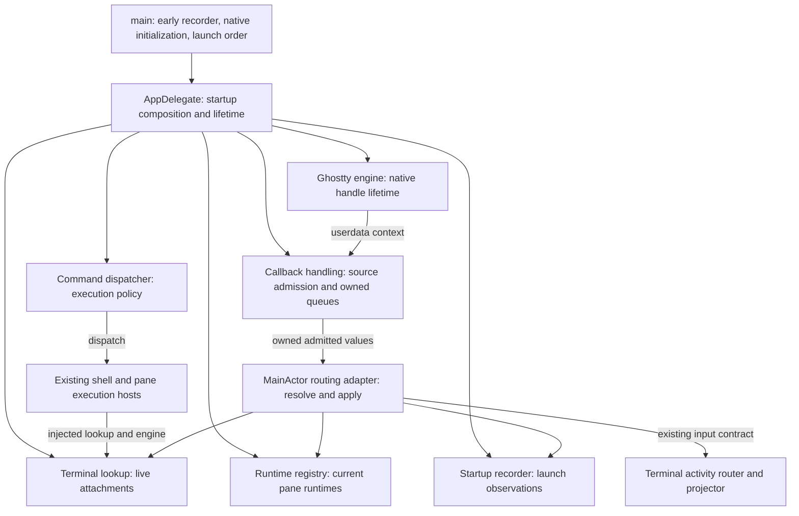
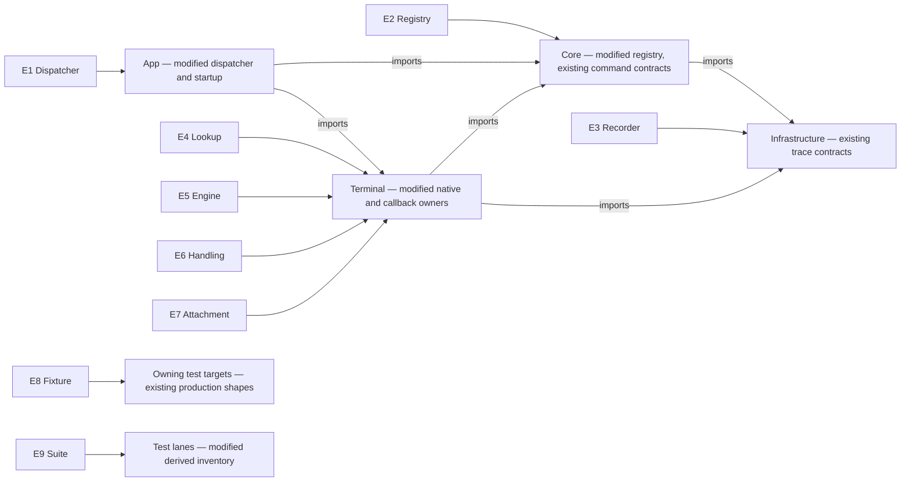
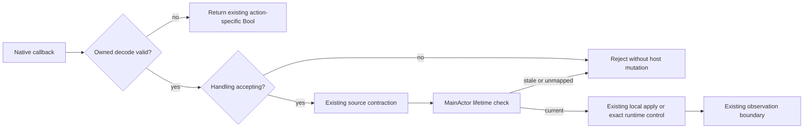
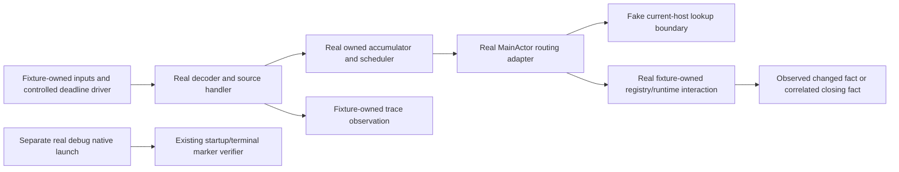

# Composition-root dependency injection — Program Design

Program Design identity: `DESIGN-2026-10-06-COMPOSITION-ROOT-DI`.
Observable obligations: [Specification](2026-10-06-composition-root-di-specification.md)
(`SPEC-2026-10-06-COMPOSITION-ROOT-DI`). Goal and protected boundaries:
[Requirements](2026-10-02-composition-root-di-requirements.md).

## Startup owns the objects; consumers receive them

The reader question is who constructs and retains the selected objects, and
where the callback boundary ends. Startup means the existing `main.swift` and
AppDelegate boot owner, not a new dependency container.



The lifetime owners are root → engine/native handle, root → lookup/attachments,
and root → callback handling. Consumers retain only the dependencies they use;
reverse calls use weak target closures to avoid ownership cycles. Activity
projection, command policy, native focus synchronization and surface retirement
keep their existing owners. Their reason to change remains their current domain
behavior, not dependency retrieval.

### Bind each entity to its implementation home

The table binds the Specification terms; it does not redefine their identities.
The Swift conventions are actor-isolated owners, package visibility, native
payload enums and Sendable cross-executor values. Runtime references are not
persisted, derived snapshots or new caches. E9's inventory is derived evidence.

| Entity | Semantic owner | Module/home and change | Type/shape home | Boundary shape | Storage/disposition |
| --- | --- | --- | --- | --- | --- |
| E1 Command dispatcher | App startup retains it; dispatcher owns dispatch policy | App/Commands, modified `AppCommandDispatcher` | Core existing `AppCommandDispatching`, `AppCommand`, execution requests; App existing concrete dispatcher | Constructor-selected MainActor owner-access closures; existing typed requests and Bool/`AppCommandExecutionOutcome` results | Runtime-only; neither persisted, derived nor cache |
| E2 Runtime registry | Registry owns pane registration; App startup retains the chosen instance | Core/RuntimeEventSystem/Registry, modified `RuntimeRegistry` | Core existing `PaneId`, `PaneRuntime`, `RegistrationResult` | `PaneId` → optional `any PaneRuntime`; registered identity stays singular | Runtime-only |
| E3 Startup recorder | Recorder owns observations; main creates it before delegate | Infrastructure/Diagnostics, existing `AgentStudioStartupTraceRecorder` | Existing Infrastructure trace values | Existing startup phase/outcome/attributes; fixed recorder reference | Existing diagnostic output persistence only; no new storage |
| E4 Terminal lookup | Lookup owns live mappings; startup retains it | Terminal/Ghostty, modified `SurfaceManager` | Existing Terminal `GhosttyActionRoutingLookup`, `WorkspaceSurfaceManaging`, surface types | Surface UUID + view `ObjectIdentifier` → optional current pane/runtime host; narrow engine-access closure for creation | Runtime-only live membership |
| E5 Ghostty engine | Engine wrapper owns native app/config handles | Terminal/Ghostty, modified `Ghostty.App`, existing `AppHandle` | Existing native `ghostty_app_t`, existing surface configuration; new typed engine availability in Terminal | MainActor availability `available(App)` or `unavailable`; native handles remain inside engine-facing owner | Runtime-only; native resources |
| E6 Callback handling | Source handler owns admission state; MainActor adapter owns routing access | Terminal/Ghostty, modified `Ghostty.ActionRouter`; new `GhosttyCallbackContext` and thin `GhosttyActionRoutingHost` | Terminal new owned callback work enums; existing disposition, drain request and activity input types | Private synchronous native decoder → owned Sendable action/target → MainActor apply; existing terminal events/trace attributes | Runtime-only; bounded pending state |
| E7 Terminal attachment | Lookup owns membership; surface view owns native surface | Terminal/Ghostty and Terminal/Hosting, modified existing owners | Existing UUIDv7 surface ID, view identity and `PaneId`; existing local-action and runtime shapes | Fixed terminal lifetime snapshot + copied action; MainActor re-resolves current membership | Runtime-only; existing checkpoint behavior unchanged |
| E8 Test fixture | Scenario owns its real routing/admission owners and fake external boundaries | Existing test targets appropriate to each owning module | Same production contracts, fake command/lookup/native boundaries | Typed owned actions, observed dispatch/trace/runtime effects, controlled scheduler callbacks | Runtime-only; fixture-scoped |
| E9 Test suite | Test lane owner classifies and runs suites | Existing scripts/test declarations, modified inventory | Existing lane classification and suite selector shapes | Current effects inventory → isolated or parallel row + nonzero execution evidence | Derived source/lane evidence |

This entity-to-home view makes package direction visible before interface detail:



Core does not import App or Terminal. Feature consumers use Core command
contracts and their own injected interfaces. SharedComponents remains stateless
and receives values/callbacks; it does not read this composition.

## Construction without a container or replaceable dependencies

The crux is two real cycles: the dispatcher calls shell/pane hosts that consume
it, and callback routing needs the lookup while lookup creation needs the
engine. The selected structure makes those reverse references narrow immutable
access closures, not mutable service-registration slots.

| Direction | What it buys | What it costs / why selected or rejected |
| --- | --- | --- |
| Inject already-constructed concrete hosts into every constructor | Direct references; few abstractions | Cannot construct dispatcher ↔ AppDelegate or engine ↔ lookup without staged mutable fields. Reject that cycle as the root structure. |
| Introduce bindable forwarding holders or a general resolver | Explicit construction order | Adds mutable dependency slots or a container, obscures lifetime and permits rebinding. Outside the confirmed acceptable structure. |
| Fixed typed access closures at the existing root — selected | Preserves late host appearance and engine creation order; consumers receive narrow stable contracts | Root needs weak captures and explicit forcing of lazy local owners during startup. Tests must provide realistic owner absence/readiness. No generic lookup or replacement API. |

AppDelegate owns private, read-only-to-consumers construction properties for the
dispatcher, lookup and callback handling. Where self-dependent closures require
Swift's two-phase initialization, these are private lazy properties created by
startup before the application event loop. The construction rule forbids later
assignment/reset as well as construction outside the admitted startup homes.
They are not an ambient registry: each consumer receives its specific object or
operation through a constructor. Tests construct the real dispatcher directly
with fake command owners and construct callback handling without AppDelegate.

The dispatcher initializer selects shell-owner access, workspace-owner access,
interaction-probe access and refresh observation as immutable MainActor
closures. The shell closure weakly references AppDelegate; the workspace closure
uses its existing `paneTabViewController()` lookup. That lookup follows the
current main-window lifecycle, replacing the singleton's last-installed weak
handler. It must preserve the existing `registersAsCommandHandler` eligibility
for auxiliary/test controllers; a controller excluded from that role cannot
be selected by the accessor. The dispatcher samples the target for each
operation on MainActor and keeps current validation/routing policy.

The lookup receives the dispatcher through its constructor, removing
`setAppCommandDispatcher`. Its engine-access closure returns the startup-owned
engine's typed availability only when surface creation is requested; lookup
construction never forces engine construction. This breaks engine ↔ lookup
without a fallback engine. Main forces the engine only after NSApplication and
delegate creation, under the existing startup milestones. All surface creation,
including undo restore, uses that same access closure and retains existing
bounded creation retries and errors.

Callback handling receives an immutable MainActor routing adapter. The adapter
has fixed registry, lookup and recorder references. Its activity operations are
fixed closures to the existing boot-owned activity router. Before that router
is active they return the existing absent-context/no-input outcome. Its own
start/stop state determines acceptance; no global bind/unbind slot participates.
This replaces the file-level activity binding without adding a coordinator,
atom, bus case or second activity owner.

These closures may observe current host membership or readiness; they cannot
change which startup-owned collaborator supplies those facts. Compiler checks
enforce immutable captures and actor boundaries. Construction-site lint covers
the private lazy-property reset case the type system cannot express.

## The native boundary ends inside the callback

Keep the native callback table as stateless C trampolines. They reconstruct
their selected owner from userdata during the native call and synchronously copy
the payload/identity needed by later work. They do not defer pointer restoration.

`GhosttyCallbackContext` is a checked Sendable reference owned by the engine
wrapper. It contains its fixed checked source handler and a MainActor-isolated
weak engine target. The private engine-construction path establishes that weak
target before creating the native handle. The engine strongly retains the
context through native free. The weak target can become unavailable during
retirement; it cannot be publicly rebound. That is lifetime state, not a second
engine-construction guard.

- Wakeup userdata is the context, not an integer-encoded pointer to `Ghostty.App`.
  Wakeup synchronously captures a strong Swift context reference; the later
  MainActor task checks its weak live engine target and calls the existing tick.
- Action callbacks call `ghostty_app_userdata` while the native app is valid,
  recover the context and invoke its source handler synchronously.
- Surface userdata remains the surface view to preserve clipboard/C ABI
  behavior. The view has a nonisolated immutable surface lifetime ID and callback
  handler reference. Close and surface actions copy those identities during the
  call; any later apply goes through the injected current lookup.
- Clipboard read/confirmation/write stay synchronous at the existing native
  boundary, with their existing privacy/approval behavior and buffer lifetime.
  DI adds no clipboard policy or native request retention.

### Contract shapes

All new shapes live in Terminal. Code below fixes boundary semantics rather
than production method spelling or task order. Existing payload variants are
retained when moving the stateless translator's mapping into pure decoding.

```swift
enum GhosttyOwnedTarget: Sendable {
    case application
    case surface(surfaceID: UUID, viewObjectID: ObjectIdentifier)
}

// Payload is the current ActionPayload closed sum with copied strings/scalars.
enum GhosttyOwnedCallbackWork: Sendable {
    case action(target: GhosttyOwnedTarget, tag: GhosttyActionTag,
                payload: GhosttyActionPayload)
    case close(surfaceID: UUID, viewObjectID: ObjectIdentifier)
}

enum GhosttyCallbackDecodeResult: Sendable {
    case work(GhosttyOwnedCallbackWork, handled: Bool)
    case handledWithoutWork
    case rejected(GhosttyCallbackRejectReason)
}

enum GhosttyCallbackRejectReason: Sendable {
    case missingUserdata
    case invalidTarget
    case invalidPayload
    case unsupportedAction
    case retired
}

enum GhosttyDeferredApplyResult: Sendable {
    case applied
    case unchanged
    case dropped(GhosttyDeferredDropReason)
}

enum GhosttyDeferredDropReason: Sendable {
    case retiredHandling
    case staleSurface
    case paneNotMapped
    case runtimeNotFound
}
```

The native Bool mapping remains action-specific, matching current
`handledResult` behavior. Rejected/queued/applied are internal diagnostics, not
new IPC results. Handling a native action synchronously does not claim the
eventual host apply succeeded. Exhaustive disposition follows copying and
pure translation; exact facts/controls cross to MainActor through an owned
action, while local samples pass through existing bounded contraction first.

The private synchronous decoder is the audited unsafe C boundary. All deferred
entrypoints accept only the closed owned-work/drain shapes, and all host apply
operations require MainActor: trying to pass a raw target/action as deferred
input, or to call a host apply synchronously from native ingress, is a type or
isolation error. Raw C types are never fields of deferred work. Lack of Sendable
conformance alone is not a general pointer-lifetime guarantee: unsafe trampoline
code still needs source scrutiny. This design does not add experimental lifetime
compiler features or claim to make arbitrary native pointer misuse impossible.

The stateless translator object is deleted. Its mapping, payload sum and
malformed-payload classification remain pure functions/types. A pure static
function is not replacement global mutable state; tests exercise the same
mapping as callback ingress and delivery.

## Current-to-proposed call paths

The source anchors identify the current baseline; this is a source reconstruction,
not a runtime trace. The changed path answers how a title reaches its real effect
and how a stale lifetime is rejected:

```mermaid
sequenceDiagram
    participant Native as Ghostty native call
    participant Ingress as Callback source handler
    participant State as Owned accumulator/scheduler
    participant Host as MainActor routing adapter
    participant Lookup as Terminal lookup
    participant Runtime as Terminal runtime/activity
    Native->>Ingress: CHANGED app userdata context + borrowed title/action
    Ingress->>Ingress: UNCHANGED copy strings and surface lifetime
    Ingress->>State: CHANGED instance-owned admission; UNCHANGED title contraction
    Ingress-->>Native: UNCHANGED synchronous action-specific handled Bool
    State->>Host: CHANGED injected adapter; owned compact drain
    Host->>Lookup: UNCHANGED check UUID + view identity + pane association
    alt same live lifetime
        Lookup-->>Host: current attachment
        Host->>Runtime: UNCHANGED changed title / ordered activity input
        Runtime-->>Host: applied or unchanged; existing proof marker
    else retired or replaced
        Lookup-->>Host: absent or different lifetime
        Host-->>State: dropped stale work; no host/runtime mutation
    end
```

| Path / obligation | Current anchored path | Proposed delta and preserved edges |
| --- | --- | --- |
| Startup and tracing — R1, R4, R8 | `main.swift:10` creates recorder → `AppDelegate.swift:176–177` binds global trace state → `main.swift:80` initializes global engine | **Changed:** startup creates instance callback state and engine; **removed:** static recorder/queue setters and engine access; **unchanged:** recorder before delegate/native engine, existing milestone order and error outcomes. |
| Command — R1, R2, R4, R6 | Menu/keyboard/IPC host → singleton dispatcher (`AppCommandDispatcher.swift:14`) → mutable weak shell/pane handlers (`PaneTabViewController.swift:565`, `AppDelegate+WorkspaceBoot.swift:513`) → existing owner policy/result | **Changed:** constructor dispatcher and fixed typed owner access; **removed:** singleton, mutable setup fields and test swap actor; **unchanged:** catalog, validation, shell-first dispatch, workspace fallback within the same composition, typed results. |
| Surface/engine — R1, R4, R6, R7 | `SurfaceManager.swift:205–247` → global initialized check/app → surface constructor; focus/config reads also reach globals | **Changed:** injected engine availability and weak lookup operations; **removed:** global engine and lookup defaults; **unchanged:** surface ID generation, bounded retries, configuration, focus and native free owner. |
| Callback — R1, R5–R8 | `GhosttyCallbackRouter.swift:17–22` → static action handler → `GhosttyActionRouter.swift:703–801` source admission and scheduler → global lookup/registry/translator fallback (`GhosttyActionRouter+RuntimeRouting.swift:60–85`) | **Changed:** userdata-owned handler, checked queues and injected adapter; **removed:** static store/default/fallback reads; **unchanged:** disposition, contraction, exact barriers, synchronous Bool, current lifetime check, runtime and trace effects. |
| Activity — R2, R7, R9 | `TerminalActivityRouter.swift:148,183` binds/unbinds file-level object (`GhosttyActionRouter+TerminalActivityInput.swift:10`) → global sink/context | **Changed:** fixed constructor operations reference boot-owned router readiness; **removed:** global binding/ID arbitration; **unchanged:** activity router/projector lifecycle, inputs, semantic output and bus policy. |
| Wakeup and close — R5, R7 | Wakeup captures pointer bits for later reconstruction (`GhosttyCallbackRouter.swift:38–48`); close reconstructs view then schedules weak apply (`:180–197`) | **Changed:** reconstruct context/identity synchronously; deferred tick resolves weak live engine, close re-resolves live attachment; **removed:** delayed native pointer dereference; **unchanged:** tick/close effect and weak lifetime rejection. |

Ordinary consumers obtain the selected references through existing window,
pane, mount and runtime constructors. SwiftUI views receive specific values or
callbacks, not a root object. D6's view step removes global defaults as well as
direct calls. If that step is deferred under D6, its exact remaining consumers
are tracked separately and full R1 deletion is not claimed.

## Checked callback state and unchanged scheduling policy

The source handler is a final checked Sendable class with immutable references
to its state owners and a `@MainActor @Sendable` apply operation. Mutable
accumulator, scheduler and trace-queue-store state moves inside
`Synchronization.Mutex<State>` properties, removing application-owned
`@unchecked Sendable` from those callback owners. The engine wrapper becomes
MainActor-isolated instead of unchecked Sendable. The owned callback values
contain no native pointer, AppKit mutable object or borrowed buffer.

Mutex is already an Infrastructure convention. Its SDK API accepts
`consuming sending Value` and executes synchronous `withLock` over
`inout sending Value`. No await occurs under a lock; mutable non-Sendable state
cannot be aliased out of it. Existing Infrastructure trace runtime/queue
implementation remains its own boundary: this work does not pretend to harden
every unchecked type reached by diagnostics.

The accumulator retains the current independent immediate/title lanes, fixed
retained keys, search epoch watermarks, equal-value suppression, preceding-title
barriers and bounded activity sufficient statistics. Its lock order remains
accumulator → scheduler, and scheduler callbacks never reacquire the accumulator
under either lock. External apply/diagnostic work occurs after lock release.

The scheduler retains the current key `(surfaceID, lane)`, claim token,
follow-up request and absolute title deadline. Its injected deadline operation
becomes `@Sendable (UInt64, @escaping @Sendable () -> Void) -> Void`, rather
than passing a non-Sendable `DispatchWorkItem` out of protected state.
Production still uses the existing dispatch deadline queue. Deadline callbacks
carry only key/token and a weak scheduler reference; cancellation removes the
claim, so a queued callback is rejected before MainActor admission. No new
deadline, delay, timer owner, retry path or cadence is introduced. The queued
closure retains no terminal/native resource. Its driver can be controlled in
tests through the same scheduling boundary.

Immediate drains remain admitted with the existing token check. A completing
drain owns only its captured token: completion cannot delete a newer claim.
Removing an attachment removes its pending accumulator values, watermarks and
claims. A MainActor adapter resolves the same terminal lifetime again before
apply and after any await whose intervening retirement could make an effect
stale. Close may preserve its sealed final activity input while prohibiting
later mutation of the retired terminal, as current local-close behavior does.

Callback handling owns every Task it creates for exact/direct-host actions,
wakeup/close application and scheduler drains. There are no fire-and-forget
Tasks outside that owner. A private mutex state contains accepting/retiring
phase and the in-flight `Task<Void, Never>` handles keyed by owner-local task
identity; identity allocation happens for admitted work, not each raw sample.
Scheduling admission and handle registration are one synchronous critical
section. Completion removes only its own handle. No native handle, view or
borrowed payload lives in that bookkeeping.

The scheduling operation handed to the scheduler goes through the same task
owner, so its MainActor task is included in retirement. `retire()` atomically
closes new task admission, invalidates pending deadline/drain claims, snapshots
the in-flight handles, releases the lock, then awaits their completion before
draining its trace queue. Already-accepted sealed close activity is completed
before the activity router is stopped; other stale work fails the adapter's
lifetime check. Retirement runs from root shutdown or fixture teardown, never
inside a task it would join. Deadline closures retain only a weak owner and
token; a callback firing after cancellation cannot create a new tracked task.
This bookkeeping belongs to the callback owner, serves R7, and is not a new
task registry service, persistence store, cache or coordinator.

## State, failures and resource release

```mermaid
stateDiagram-v2
    [*] --> Accepting: constructor selects dependencies
    Accepting --> Accepting: admit/contract/apply same live lifetime
    Accepting --> Retiring: existing shutdown or fixture teardown
    Retiring --> Retired: reject ingress; cancel/join owned work; free native resources
    Retired --> Retired: drop stale owned work
    Retired --> [*]: release context after native free
```



| Owner/state | Transition and guard | Failure / illegal path |
| --- | --- | --- |
| Engine | Creation produces available or unavailable native handle; only available handles create surfaces. Retirement follows shutdown of native surfaces. | Native creation failure preserves existing milestone/outcome; no fallback engine or new retry owner. |
| Callback handling | Accepting → retiring atomically closes task admission and snapshots owned handles, invalidates scheduled claims, then joins outside the lock; retiring → retired follows task/trace completion. | Late/duplicate retirement is idempotent. New work after retiring is rejected. Root/fixture retirement cannot join itself. There is no reopen/rebind transition. |
| Attachment | Live lookup membership → removed/retired; pending work carries its original UUID and view identity. | A replacement in the same pane cannot satisfy the old lifetime check. Stale work is dropped, never routed through a fallback registry. |
| Scheduler | No claim → admitted title deadline or immediate claim → drain → optional follow-up; each completion checks token. | Cancellation invalidates the claim; stale deadline/completion cannot clear or dispatch a newer claim. |
| Activity input | Existing router start/stop decides whether its injected operations accept input. | Missing/not-started router behaves like today's absent binding. Stop joins router/projector work without altering another handling instance. |
| Diagnostics | Queue records while open; drain takes the owned queue and finishes it. | Export/drain failure is reported and contained; normal startup remains fail-open. No global rebind to recover lost traces. |

The native teardown path is ordered: stop admitting new surface/callback work;
retire live and hidden/undo native surfaces through the existing retirement
boundary; cancel and join callback scheduling/application/activity work; clear
the context's weak tick target; free the raw app/config handles while retaining
the Swift context; release the context last. Surface userdata similarly remains
valid through surface free. Root ownership and this order prevent a delayed
pointer dereference; weak engine/view references prevent retained cycles.

The pinned native `ghostty_app_free` destroys the app wrapper and then the core
app. Its core surface teardown signals and joins renderer/IO workers before
freeing shared state. Freeing native surfaces while the app/context remain
alive therefore closes their native callback sources before app free. A delayed
callback already copied into Swift retains only safe values or a Swift context.
Exact native free-order and worker shutdown remain source/runtime proof gates,
not an assumption that `passUnretained` retains anything. Fake-engine fixtures
cannot establish the launched native gate.



No new recovery, persistence or bus plane is needed. Shutdown is the existing
AppDelegate/host lifecycle with explicit callback cleanup, not a coordinator
with new domain responsibilities. Termination draining must include the
instance trace queue rather than a static queue; its completion remains the
existing app shutdown outcome.

## Proof follows the real routing owners

Fixtures replace native engine operations, command execution sinks and host
lookup results where those are outside the claim. They keep the real dispatcher,
pure decoder/translation, source disposition, accumulator, scheduler,
MainActor adapter and registry when proving their interaction. Fixture-owned
recorders/capturing sinks observe outcomes separately, and controlled deadline
drivers allow ordering and negative claims without wall-clock waits.



The fixture graph proves injection, source contraction, routing and teardown.
The separate debug launch proves engine/native surface wiring, real terminal
effects and milestone delivery. Source inspection of native callbacks/free
order complements, rather than replaces, launched lifecycle evidence.
Marker-scoped probes establish MainActor drain and contraction behavior for the
often/heavy lane; unit timing or feel does not.

### How each obligation reaches proof

| U | R and contract | E | Owner | Interface | Shape and home | State | Failure | Proof seam |
| --- | --- | --- | --- | --- | --- | --- | --- | --- |
| U1 | R1 explicit access — C1 | E1–E6 | App startup | Constructors and typed owner/engine access | Core command protocol; Terminal availability and adapter references | Fixed selection; dynamic membership only | Unavailable target returns existing result; no fallback | Source/default/alias inspection and shrink-only ledger |
| U2 | R2 fixture ownership — C2 | E1, E2, E4, E6, E8 | Scenario fixture | Real owners with fake external boundaries | Existing Core/Terminal contracts | Construct → run → joined teardown | No cross-fixture selection or swap lock | Two-fixture interaction observation through real routing owners |
| U3 | R3 parallel admission — C3 | E9 | CI lane owner | Current effect classification and lane inventory | Existing suite selectors/row types in runner | Isolated → eligible → actually executed parallel | Retain unrelated isolation; remove empty shell | Per-suite executed helper/default inventory + parallel lane receipt |
| U4 | R4 fixed construction — C1 | E1–E6 | App startup and construction lint | Immutable constructor inputs; private startup properties | MainActor closures and fixed refs in App/Terminal | No reset/rebind transition | Compiler or lint rejects forbidden construction/reset | Negative construction/access admission evidence |
| U4 | R5 checked callback boundary — C1 | E6, E7 | Source handler | Private synchronous decode → owned work → actor apply | Raw C decoder inputs versus Sendable owned enums in Terminal; Mutex state | Borrowed call → owned admitted state | Deferred API rejects raw input; actor errors; no pointer bits | Compiler boundary checks, unsafe ingress inspection and real ordering/contraction seam |
| U7 | R6 behavior preserved — C4 | E1, E5–E7 | Dispatcher and terminal admission/apply owners | Existing dispatch policy; disposition/drain/runtime contracts | Core requests/results; existing Terminal event and barrier sums | Same accepted effects and exact ordering | Same malformed/unmapped/unsupported handled/drop policy | Command interaction proof and real terminal/native marker proof |
| U7 | R7 lifetime safe — C2/C4 | E6–E8 | Native handle, lookup and callback handling | Current-lifetime check; retirement and drain/join | Surface UUID/view identity and typed drop result in Terminal | Live → retired; accepting → retired | Drop stale claims; release context after native free | Controlled interleaving through real owners + native free-order/lifecycle proof |
| U7 | R8 observations preserved — C5 | E3, E6 | Startup recorder and callback trace owner | Existing startup record and instance trace drain | Existing Infrastructure tag/body/attributes | Record from early launch; drain on shutdown | Export/drain failure contained; scrub unchanged | Existing launched startup/terminal verifier and export privacy seam |
| U2, U4 | R9 activity binding scoped — C2 | E6, E8 | Activity router and injected routing adapter | Fixed activity context/input operations | Existing TerminalActivitySourceInput/context in Terminal | Existing started/stopped state | Missing/stopped input stays local; no global override | Two fixtures with separate activity routers and correlated teardown |

E1–E9 are covered by the binding table. C1–C5 and V1–V8 are covered by the rows
above and the production/fixture graphs. U5/U6 and D2 remain owner-superseded;
none of their guard behavior is realized. D1 is realized by one production
selection and fake engine boundaries; D3 by checked source/apply ownership; D4
by removal plus actual lane proof; D5 remains tracking authority rather than a
runtime component; D6 by the scoped hard cutovers below.

Illegal dependency replacement is prevented by immutable inputs/access control
and the lazy-reset lint restriction. Illegal borrowed/deferred transfer is
rejected by strict concurrency/type checking. Applying stale terminal work is
rejected at the trusted MainActor lifetime check. Missing runtime is rejected
there instead of querying a global fallback. Native-handle operations are
confined to the engine-facing MainActor owner. These are production boundaries,
not test-only hooks.

## Cutover and retained boundaries

D6 admits three responsibility cutovers, with no compatibility wrapper or old
and new callback path running together:

| Cutover | Authority and readers | Transition / failure / proof |
| --- | --- | --- |
| Callback and startup | The selected callback object/registry/recorder and its fixed operations become the only callback truth. | All trampolines and direct callback helpers switch together; old static stores and binding setters are removed. Fixture interaction and startup/native lifetime proof establish this cutover. |
| Existing parameter seams and engine | Existing owners receive lookup/dispatcher/engine dependencies explicitly; removed singleton defaults cannot remain as convenience overloads. | Engine creation/failure and native surface operations use one selected instance. Missing dependencies are compile errors or existing typed unavailability, not fallback global recovery. |
| View consumers | Existing hosts pass specific props/callbacks into views; no ambient app container. | Complete removal includes view/default/helper access. If difficult, the authorized D6 deferral lists those exact residuals as unfinished work and does not claim complete deletion. |

These are delivery boundaries, not dual-path migrations or persisted-data
versions. Reverting a cutover reverts its source/lint/inventory changes together;
there is no schema migration or runtime reconciliation. Untouched telemetry,
buses, renderer delivery, view registries and framework globals keep their
existing ownership and isolation obligations.

Privacy and observability are realized by retaining the existing source scrub
and export projection, with fixed instance trace access. Performance is realized
by the same source contraction/scheduler policies and marker-scoped proof.
Accessibility and visible styling have no changed surface. No network,
authentication or persisted-data boundary changes. Swift 6.4 Sendable-implying
conformances remain in their owning type declarations when those types change.

## Source basis and remaining feasibility proof

The [current architectural import graph](../../architecture/structure/directory_structure.md#import-rule-hard-boundary)
and [command owner contracts](../../architecture/commands/command_specs.md#choosing-the-execution-owner)
remain authoritative. Callback rules come from [Contract 7](../../architecture/runtime/pane_runtime_architecture.md#contract-7-typed-ghostty-source-admission-and-contraction)
and [admission/hop shape](../../architecture/runtime/pane_runtime_eventbus_design.md#admission-and-hop-shape).
The current native pin is `ghostty-org/ghostty` revision
`82232ecde55405559dec29c5466cb9e39938cb41`; its
[userdata and free entrypoints](https://github.com/ghostty-org/ghostty/blob/82232ecde55405559dec29c5466cb9e39938cb41/src/apprt/embedded.zig#L1699)
establish the C ownership boundary. Installed Swift SDK Mutex and Dispatch
interfaces establish the checked lock/Sendable constraints.

Still to prove through admitted implementation: Swift 6.4 compile acceptance
of the concrete callbacks and immutable root access; every remaining callback
task's retirement/join path; native worker shutdown and exact context lifetime;
per-suite eligibility and actual parallel execution; native terminal effects,
marker-scoped performance and export privacy. Design changes no proof gate and
uses no stand-in as production evidence.
