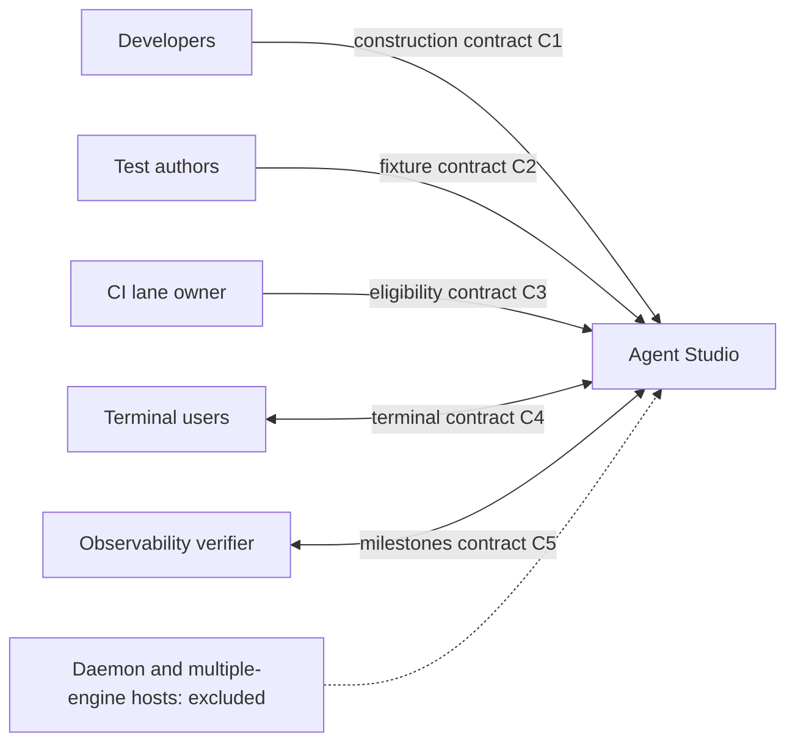
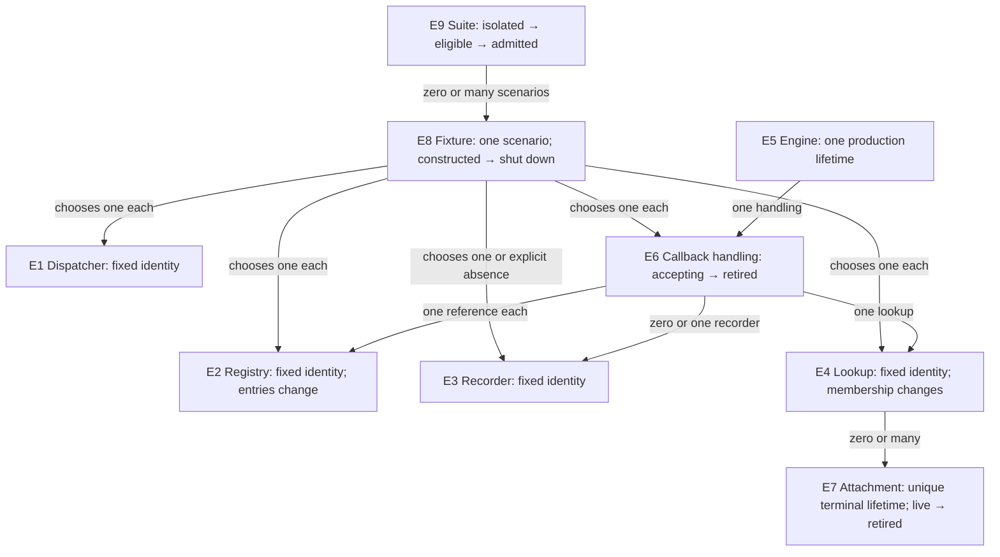

# Composition-root dependency injection — Specification

Specification identity: `SPEC-2026-10-06-COMPOSITION-ROOT-DI`.
Governing needs and limits: [Requirements](2026-10-02-composition-root-di-requirements.md)
(`REQ-2026-10-02-COMPOSITION-ROOT-DI`, U1–U4 and U7).
Structural realization: [Program Design](2026-10-06-composition-root-di-program-design.md).

## What changes for consumers

Application developers can identify dependencies at construction. Test authors
can build their own collaborators and callback handling without replacing
process-wide state. CI admits only suites that no longer depend on any conflicting
process-global state. Terminal users retain current behavior.

This context view answers who observes the contract, keeping the application
opaque:

## Entities and identity

Objects used by one production launch are distinct from objects built by a test
fixture. This distinction supports isolation of tests; it does not promise
multiple production compositions or multiple native engines in one process.

| Entity | Identity and relationships | Invariants and observable states | Basis |
| --- | --- | --- | --- |
| E1 Command dispatcher | The dispatcher chosen for one launch or fixture; 0..many command consumers reference that same dispatcher. | Its construction-selected collaborators remain fixed; current command targets may appear/disappear through their existing host lifecycle. Available or unavailable execution targets produce existing dispatch results. | U1, U2, U4 |
| E2 Runtime registry | The registry chosen for one launch or fixture. It maps each pane identity to at most one current runtime. | It is the sole registry used by that callback handling; no second registry supplies a missing runtime. Entries retain existing register/unregister behavior. | U1, U2, U7 |
| E3 Startup recorder | The recorder created for one launch or fixture; launch observations before and after engine creation refer to the same recorder. | Existing startup milestones retain their names, order and outcomes. Recorder absence in an explicitly recording-free test does not select a global substitute. | U1, U4, U7 |
| E4 Terminal lookup | The lookup chosen for one launch or fixture, linking terminal identities, view identities and pane identities. | Current membership may change; the lookup's identity may not. A removed terminal cannot be resolved as its old live attachment. | U1, U2, U7 |
| E5 Ghostty engine | The one native engine for a production launch. A fixture can substitute the engine-facing boundary without creating a real engine. | Unavailable, available, then retired; retirement ends use of its native resources. No requirement to construct multiple real engines. | U1, U4, U7; D1 |
| E6 Callback handling | The handling created for one launch or fixture, referencing its E2/E3/E4 and, in production, its E5. | Callback mutable state belongs to this handling. Immediate work and later work are distinct; callbacks cannot route through another fixture's state. Accepting, retiring, then retired. | U2, U4, U7 |
| E7 Terminal attachment | One terminal lifetime and its current pane association. Recreating a terminal, even in the same pane or view, is a different lifetime. | Live or retired. Deferred updates apply only to the same live terminal lifetime; an old attachment must not update its replacement. | U7; existing surface-lifetime contract |
| E8 Test fixture | One scenario's constructed collaborators, inputs and teardown. Distinct fixtures do not share mutable state solely to work around the named globals. | Constructed, executing, then shut down; it completes teardown before its scenario returns. Fake boundaries do not establish native-engine/runtime proof. | U2, U4 |
| E9 Test suite | A stable suite declaration in the lane inventory, including its executed helper/default paths. | Isolated, eligible, or admitted to normal parallel execution. Eligibility is per suite; a zero-test isolated shell is removed rather than treated as executed proof. | U3; D4; runner contract |

The entity view answers which identities can change and which must remain fixed.
The table above owns the definitions.

## Outcomes and obligations

O1 is visible dependency ownership; O2 is independently constructed fixtures;
O3 is proven parallel admission; O4 is compiler-enforced callback safety; O5 is
preservation of terminal behavior and proof signals. These outcomes refine,
rather than expand, the Requirements goal boundary.

| Id | Normative obligation | Success and negative case | Basis |
| --- | --- | --- | --- |
| R1 | Startup MUST create E1–E5 and pass the selected objects to their consumers. Consumers MUST NOT obtain them through process-global access or global defaults. E6 MUST NOT use a fallback E2. The unused fallback registry and translator object MUST be deleted without losing translation behavior. | Constructor/caller inspection finds explicit dependencies, including helpers, views and defaults. No hidden global alias remains. D6's authorized view deferral is explicitly reported as incomplete view coverage. | U1; D1, D6 |
| R2 | An E8 MUST be able to construct E1, E2, E4 and E6 with fake external boundaries, without swapping global fields or taking global isolation locks for those objects. Their lock-and-swap helpers MUST be deleted. | Two fixtures can exercise the real injected routing owners without affecting each other's registrations, records or delivered actions. This does not require real engines. | U2; D4 |
| R3 | An E9 whose only conflicting shared state was removed by this work MUST run in the normal parallel lane. Admission MUST follow a current inventory of executed constructors, helpers, defaults and teardown. | Source eligibility and actual parallel-lane execution are separately evidenced. A suite still touching an unrelated global stays isolated. Historical text-match counts alone cannot establish success. | U3; D4 |
| R4 | Construction-selected E1–E6 collaborators MUST NOT be replaceable after startup. Production engine and callback-handling construction MUST be confined to startup code, with compiler enforcement where possible and build-time lint for construction-site restrictions. Test targets MAY construct E6 with fake engine-facing boundaries; these DI fixtures MUST NOT construct a real E5. | Rebinding selected objects is rejected by type/access rules or lint. Existing membership, active-host routing and start/stop transitions remain mutable where required by the established contract. | U4; D3 |
| R5 | E6's lock-protected callback state MUST have compiler-checked concurrency boundaries. Immediate callback work MUST be distinct from later work, so borrowed native payloads cannot be carried as deferred inputs. | Mutable callback state is protected through checked owners, and invalid actor/payload transfers are refused. A broad unchecked conformance or integer-encoded pointer carried to deferred work cannot substitute for the distinction. | U4; D3 |
| R6 | E1, E5 and E6 MUST preserve existing command and terminal results: title, tab title, working folder, bell, exit and close, along with existing source admission, equality suppression, aggregation and exact-control ordering. | Same accepted command/action produces the same result/effect. The synchronous native handled result remains separate from eventual delivery. This refactor adds no command, bus case, IPC field or new event policy. | U7; protected systems |
| R7 | Once E7 is retired, deferred callback work MUST NOT mutate that attachment or a replacement attachment. E6 retirement MUST cancel its scheduled work and preserve native userdata lifetime through native resource release. | Stale callbacks are rejected using current lifetime/membership. Teardown cannot dereference released userdata or leave fixture work running after completion. | U7; existing lifetime contract |
| R8 | E3 and E6 MUST preserve early startup milestones and callback observability names, meanings and source-scrubbing boundaries. Normal startup MUST remain fail-open for exporter failure or collector absence. | Early events remain observable before delegate/engine construction; terminal and startup verifiers retain their existing signals. Mock records alone do not prove the launched app's signal path. | U7; observability contract |
| R9 | Callback mutable state associated with E6, including the terminal-activity input binding, MUST belong to the selected callback handling instead of a process-global slot. | Starting/stopping one fixture's activity input cannot redirect another fixture's callback path. This does not authorize removing unrelated bus, telemetry or renderer globals. | U2, U4; callback-handling scope |

## Observable contracts

**C1 — Construction and access (R1, R4, R5).** A consumer receives its chosen
collaborators explicitly. Defaults may represent an authorized local choice or
absence, but cannot retrieve the named globals. No new service locator or
general dependency container is part of this contract. Constant catalogs and
pure functions can remain static. Existing framework globals and the explicitly
excluded singleton ledger entries are outside this removal obligation.

**C2 — Fixture ownership (R2, R7, R9).** A fixture exercises actual routing,
registration and callback contraction, replacing only external or native
boundaries. Callback state, recorder and lookup belong to that fixture.
Teardown awaits completion of fixture-owned work. A cancelled or retired path
cannot choose another fixture as a fallback. The test verdict uses events,
correlated facts or controlled time rather than wall-clock delay.

**C3 — Suite admission (R3).** CI observes an inventory row/declaration for
every moved suite, including the reason its remaining effects are fixture-owned.
Eligible does not mean executed: evidence must also show the suite ran in the
normal parallel lane. Empty isolated declarations are removed. No particular
number of freed suites or CI duration is promised.

**C4 — Commands, terminals and lifetime (R6, R7).** Existing interactive and
IPC callers keep the same catalog, targeting, validation and dispatch results.
Direct engine access before initialization changes from a crash to a typed
unavailable result; no fallback engine is selected. This exception to preserving
current failure behavior leaves initialization milestones/outcomes and existing
surface-creation failure results unchanged.
For terminals, exact facts and controls keep their established relative
ordering; local latest-state samples retain contraction instead of introducing
one MainActor or bus wake per raw sample. Duplicate/equal values keep existing
suppression. Missing lookup membership/runtime and stale lifetimes retain
fail-closed/drop behavior; there is no fallback-registry recovery. Engine
creation failure retains the existing startup outcome and cannot create a
surface from an unavailable engine. No retry, timeout, buffering or queue
capacity policy changes are authorized by DI.

**C5 — Observability (R8).** Recorder creation precedes the observations it
already captures. Startup phase names/outcomes and marker-scoped terminal proof
remain stable. Diagnostic drain failure remains contained and reported; it
does not prevent normal app startup. Raw paths, UUIDs, prompts, errors and
payloads retain their current JSONL-only/scrubbed-export boundary.

## Need-to-proof coverage

The Requirements owns P1–P4 and U1–U4/U7. Each row below gives one inspectable
need → entity → problem → outcome → obligation → contract → proof path.

| Need | Entities | Problem | Outcome | Obligation | Contract | Proof |
| --- | --- | --- | --- | --- | --- | --- |
| U1 | E1–E6 | P1, P2 | O1 | R1 | C1 | V1 |
| U2 | E1, E2, E4, E6, E8 | P3 | O2 | R2 | C2 | V2 |
| U3 | E9 | P3 | O3 | R3 | C3 | V3 |
| U4 | E1–E6 | P1, P2 | O1, O4 | R4 | C1 | V4 |
| U4 | E6, E7 | P2 | O4 | R5 | C1 | V5 |
| U7 | E1, E5–E7 | P2 | O5 | R6 | C4 | V6 |
| U7 | E6–E8 | P2, P3 | O5 | R7 | C2, C4 | V7 |
| U7 | E3, E6 | P1, P2 | O5 | R8 | C5 | V8 |
| U2, U4 | E6, E8 | P2, P3 | O2, O4 | R9 | C2 | V2, V5 |

| Proof | Required modality and observation | What does not establish it |
| --- | --- | --- |
| V1 | Source/static inspection: no named global access, default or alias; corresponding shrink-only ledger entries removed. | Renaming globals or passing a global as a hidden default. |
| V2 | Automated behavioral interaction: fixture-owned dispatcher/registry/lookup/callback handling exercise real routing and contraction concurrently, with separately observed outcomes and joined teardown. | Mocking away the routing/contraction under test; serial lock-protected swaps. |
| V3 | Current per-suite effects inventory plus actual lane classification/execution evidence for admitted suites. | A text search count, empty suite or fast-lane label without execution. |
| V4 | Compiler/access enforcement and negative static-rule evidence for forbidden collaborator replacement and non-startup construction. | A comment claiming startup-only construction. |
| V5 | Compiler-checked callback owners and immediate/deferred boundary evidence, plus behavioral ordering/contraction proof through those owners. | Unchecked pointer transport or concurrency annotations without real ownership. |
| V6 | Automated real-path command and terminal behavior plus launched debug terminal evidence where native effects are not covered by the suite. Marker-scoped evidence for the often/heavy callback lane. | A fake engine described as runtime smoke; feel or unit tests as performance proof. |
| V7 | Behavioral stale-lifetime, retirement and teardown evidence, plus native userdata/free-order source analysis and launched lifecycle proof. | Waiting briefly and observing no update. |
| V8 | Launched startup/terminal verifier evidence with preserved milestones and export privacy; contained diagnostic failure behavior. | Merely matching strings or replaying stale JSONL. |

The aggregate repository gates and host-specific debug proof required by the
Requirements remain mandatory. Program Design identifies the seams; planning
selects the commands and tests. Design diagrams and author self-checks do not
claim any executable proof has run.

## Constraints and negative space

The [confirmed goal boundary](2026-10-02-composition-root-di-requirements.md#goal-boundary)
owns permitted/protected systems, D6 cutover/defer policy and non-goals. This
Specification introduces no persistence, identity migration, user interface,
authentication, accessibility or external-service behavior. Existing command,
IPC, native clipboard, privacy, performance and source-admission contracts
remain authoritative. No native-engine isolation test, extra app instance,
launch guard, container, new atom/store/coordinator responsibility, or unrelated
singleton cleanup is implied.

Current authoritative contracts: [command execution owners](../../architecture/commands/command_specs.md#command-specs-and-execution-owners),
[Ghostty source admission](../../architecture/runtime/pane_runtime_architecture.md#contract-7-typed-ghostty-source-admission-and-contraction),
[admission and hops](../../architecture/runtime/pane_runtime_eventbus_design.md#admission-and-hop-shape),
[test waits](../../architecture/testing/testing_architecture.md#how-a-test-may-wait),
and [observability proof](../../architecture/observability/observability_and_traceability.md#proof-model).
