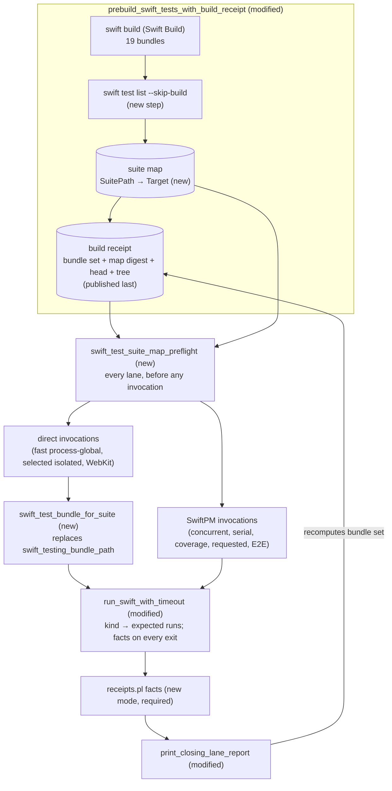

# Program Design: Swift test runner on per-target bundles (Xcode 27)

Requirements: [2026-10-04-swift-test-runner-per-target-bundles-requirements.md](2026-10-04-swift-test-runner-per-target-bundles-requirements.md) (U1-U7)
Specification: [2026-10-04-swift-test-runner-per-target-bundles-specification.md](2026-10-04-swift-test-runner-per-target-bundles-specification.md) (E1-E8, R1-R15, V1-V6)

The runner stays a set of bash functions in `scripts/swift-test-helpers.sh` and
`scripts/run-swift-test-task.sh`, plus the Perl event-stream reader
`scripts/swift-test-invocation-receipts.pl`. This design changes three things
inside them and nothing about lanes, entry points, isolation membership, or
concurrency:

1. **Which bundle.** A suite map, produced from the build and sealed into the
   build receipt, says which bundle holds each suite. Every lane checks it
   before running anything. Each isolated suite runs against its own bundle.
2. **Who decides the verdict.** Facts read from the event stream decide pass or
   fail on every terminal path, including a hang. Console text no longer does.
3. **What the receipt identifies.** The whole set of bundles plus the suite
   map, not one bundle.

## Current system (measured, Xcode 27 on sunclaw unless noted)

| Fact | Evidence |
|---|---|
| Swift Build produces 19 per-target bundles, `<Target>.xctest`, under `$BUILD_PATH/out/Products/Debug`; `$BUILD_PATH/debug` points there | `ls .build-agent-1/out/Products/Debug` on sunclaw: 19 `.xctest` |
| The runner looks for one bundle, `*/debug/AgentStudioPackageTests.xctest/...`, which does not exist | `swift-test-helpers.sh:1543-1550` |
| Three direct-helper call sites use that one bundle: fast process-global, selected isolated, WebKit (ordinary branch) | `:1450-1492`, `:1705-1727`, `:2819-2824` |
| These run through `swift test` (SwiftPM) and so already reach every bundle: the fast and large concurrent and serial phases, WebKit under coverage (`:2810-2817`), requested filters and E2E (`run-swift-test-task.sh:336-357`) | source |
| One `swift test` call runs every bundle one after another and appends one `runStarted`/`runEnded` pair per bundle to a single event-stream file | probe: a two-suite filter gave 19 pairs, both suites' `testID`s in one file, exit 0 |
| `swift test list --skip-build` prints every test as `<Module>.<Suite path>/<test>()`, nested suites included (`AgentStudioTests.WebKitSerializedTests/BridgeContentWorldIsolationTests/test_…()`) | 9,453 lines, 14 s, exit 0 (one sample, load average ≈6) |
| Isolated selectors include nested suite paths and one test-specific selector | `webkit_suite_filters` `:1852-1872`; `BridgeTransportIntegrationTests.swift:15-24` |
| Isolation membership is explicit inventory and exception rows plus suites discovered from `@MainActor` + `.serialized` annotations | `:1205-1214`, `:1240-1341`, `:1122-1125` |
| The verdict comes from console text: `swift_test_output_has_failures` | `:2478-2481`, `:2602-2611` |
| Consumers of that console reader: `CIFastLaneWorkflowTests.swift:590-597`, `SwiftTestFailureScannerScriptTests.swift:24-32`, `ObservabilityLaunchScriptsTests.swift:108-110,139`; console peak fixture `SwiftLaneRunnerReportTests.swift:778-789` | grep |
| A hang returns 124 before the judging block, after preserving the stream | `:2382-2442` |
| The event reader is sourced fail-open: if it cannot load, observation degrades and execution continues | `:24-46` |
| `--event-stream-version 6.3` and `6.4` are accepted on Xcode 27, with the same record kinds the reader uses | probe |
| ABI ≥ 6.3 issues carry `isFailure` (`!isKnown && severity >= .error`); v0 has only `isKnown` | DeepWiki `swiftlang/swift-testing` (source not opened) |
| `testStarted` is posted before the parallelization gate; `testCaseStarted` is inside it, but only for parameterized cases | `:128-136`, `:157-164`; `testing_architecture.md:451-454` |
| The failed-isolated-suite record keeps suite, status and signal only | `:1568-1576`; `run-swift-test-task.sh:125-130` |
| The receipt identifies one executable; the report and width comparison print it | `:594-692`; `run-swift-test-task.sh:90-147`, `:242-256` |

## Crux and the choice

**Where does "which bundle holds suite S" come from?**

| Option | Gains | Costs | Falsifier |
|---|---|---|---|
| **A. Built-product map (selected).** After the prebuild, run `swift test list --skip-build` once and seal the map into the build receipt | Ground truth from the build that will run; nested paths and duplicates are visible directly; no Package.swift or source parsing | ≈14 s per build (one sample); one new file in the build path | If `swift test list` stops printing `<Module>.<path>`, the map is empty and every lane fails its preflight by name: loud, not silent |
| B. Source map: grep `Tests/<dir>/` for the type declaration | No extra run | Test folders aren't 1:1 with targets, so it needs Package.swift `path:` parsing; it can disagree with the build | A suite declared outside its target's path |
| C. Try each bundle until one runs tests | No map | Up to 19 launches per suite; hides duplicates | rejected: cannot satisfy R3 |
| D. `swift test --skip-build --filter <suite>` per isolated suite | Public CLI only | Measured: 18.5 s per call for a 0.08 s suite; 4 concurrent calls took 18.7 s (no lock). 444 isolated suites ÷ 4 ≈ +34 min per run (arithmetic from one sample). Duplicates run silently, so R3 still needs the listing | owner chose A, 2026-10-05 |

A is SwiftPM's own `--parallel` design: `TestingSupport.getTestSuites` lists each
built test product once, and `ParallelTestRunner` launches each
`(productPath, specifier)` pair against its own bundle (DeepWiki over
`swiftlang/swift-package-manager`). The coupling it keeps
(`swiftpm-testing-helper` and its environment) is a dependency the runner
already has; this design moves it into one function.

## Entity binding

| E | Semantic owner | Home | Shape at each boundary | Persisted / derived | Convention |
|---|---|---|---|---|---|
| E1 Test bundle | Swift Build (the prebuild) | existing product `$BUILD_PATH/debug/<Target>.xctest/Contents/MacOS/<Target>` | path; identity line `<Target>@<size>@<mtime>` | derived from the build | existing identity line, now one per bundle |
| E2 Suite | the built bundles' test listing | **new** `$BUILD_PATH/agentstudio-test-suite-map` and the raw listing `$BUILD_PATH/agentstudio-test-list`, both written by the prebuild and both sealed by digest | one line per (suite path, target): `<SuitePath>\t<Target>`. `SuitePath` is the listing id with the `<Module>.` prefix and the final `/<test>()` component removed, so nested suites keep their full path (`WebKitSerializedTests/BridgePaneControllerTests`); every enclosing suite path is also a row | persisted; sealed by digest in the build receipt | tab-separated like the failed-suite record |
| E3 Lane | `run-swift-test-task.sh` | existing | unchanged | — | — |
| E4 Isolation list | inventory rows, exception rows, `.serialized` discovery | existing, **unchanged** | unchanged | in repository and source | unchanged |
| E5 Invocation | `run_swift_with_timeout` | **modified** | in: label, timeout, command. The kind comes from the command: *direct* when it runs `swiftpm-testing-helper`, *SwiftPM* when it runs `swift test`, *build* for `swift build` / `swift test list` (no stream). Out: exit status `0 / 1 / 124 / 128+n` and the invocation facts | — | extends `swift_test_command_accepts_event_stream` |
| E6 Event stream | Swift Testing | existing file per invocation, now `--event-stream-version 6.3` | JSON lines; the reader consumes `runStarted`, `runEnded`, `test{kind}`, `testStarted`, `testEnded`, `testCaseStarted`, `testCaseEnded`, `issueRecorded{isKnown,isFailure}` | retained per the existing rules | existing `.events.jsonl` |
| E6′ Invocation facts | **new** `facts` mode of `swift-test-invocation-receipts.pl` | modified file | stdout `key=value` lines: `stream=complete\|truncated\|missing\|unreadable`, `unreadable_records=N`, `runs=N`, `tests_run=N`, `peak_announced_tests=N`, `peak_running_parameterized_cases=N`, and one `failing_test=<testID>` per test with a failing issue | derived from E6 | the reader's existing `key=value` lines |
| E7 Build receipt | `prebuild_swift_tests_with_build_receipt` | **modified** `$BUILD_PATH/agentstudio-test-build-receipt` | `bundle=<Target>@<size>@<mtime>` (one per bundle, sorted), `bundle_set=<16 hex sha256 of the sorted bundle lines>`, `bundle_count=N`, `suite_map_digest=<first 16 hex of sha256 over the map's bytes followed by the listing's bytes>` (one canonical digest; `swift_test_suite_map_digest` computes it for both writer and reader), `head_sha=`, `tree_dirty=` | persisted; published last | existing `key=value` receipt |
| E8 Lane report | `print_closing_lane_report` | **modified** | `bundle_identity=` becomes `bundle_set=` and `bundle_count=`; new `failing_test=` lines per invocation; `failed_isolated_suite=` gains `reason=`; peak labels keep today's names | printed | existing `lane-report key=value` |

Design-only concepts:
- **suite map** (E2 bound to E1) serves R1-R3;
- **map preflight** serves R2 and R3 for every lane;
- **invocation facts** (E6′) serve R6-R10 and R12.

## Target composition

| Component | One job | Change |
|---|---|---|
| `prebuild_swift_tests_with_build_receipt` | Build, then publish what was built | deletes the old receipt and map first; builds; lists; publishes the map by atomic rename; publishes the receipt (with the map's digest) last |
| `swift_test_suite_map_preflight` | Prove the map belongs to this build and covers what the lane must run | new. Checks the map against the receipt's digest, fails on any suite path with two targets, and resolves every mandatory selector (below) |
| `swift_test_bundle_for_suite` | Selector → bundle executable, or a named failure | new; replaces `swift_testing_bundle_path` at the 3 direct call sites |
| `swift_testing_helper_environment` | Env a direct helper needs on per-target bundles | new; adds `DYLD_LIBRARY_PATH=<platform>/Developer/usr/lib` beside `DYLD_FRAMEWORK_PATH` |
| `run_swift_with_timeout` | Run one invocation within the hang bound; return its status | derives the expected run count from the invocation kind; reads the facts on every terminal path (normal and 124); decides the returned status from facts + exit status |
| `receipts.pl facts` | Event stream → facts | new mode in the existing reader. **Required**: if the reader cannot run, the invocation fails with `reason=facts_reader_unavailable`. The rest of F2 observation stays fail-open as today |
| `swift_test_record_failed_isolated_suite` | Record a failed isolated suite | gains a `reason` field |
| `print_closing_lane_report` | Summarise the lane | prints failing tests, resolution reasons, bundle set; peak lines keep today's labels, computed from facts |

Deleted, with no Xcode 26 fallback:
- `swift_testing_bundle_path`;
- `swift_test_output_has_failures` and the judging block's two console branches;
- `swift_test_peak_announced_from_output`;
- the `*AgentStudioPackageTests*` case in the hang matcher.

On a 26.x native build the listing has no per-target modules behind the map, so every lane fails its preflight by name. That is the toolchain consequence the requirements accepted.

## Suite map and selector resolution (R1-R3)

A selector is what the runner passes to `--filter` today: a bare suite name
(`RepoScannerTests`), a nested path (`WebKitSerializedTests/BridgePaneControllerTests`)
or a test-specific path (`…/BridgeTransportIntegrationTests/test_bridgeReady_…`).
The anchored filter pattern (`\.<selector>(/|$)`) already ties a selector to a
path that starts right after the module, so the map uses the same root.

A selector resolves only through an **exact** suite path; an ancestor never
stands in for a missing child.

- **Suite selector** (`RepoScannerTests`, `WebKitSerializedTests/BridgePaneControllerTests`): its own path must be a map row. The targets are those of the rows equal to `SEL`.
- **Test-specific selector** (its last component names a test function, which is how the inventory writes it today, `…/test_bridgeReady_…`): its containing suite (`SEL` without the last component) must be a map row, and the test must be in the listing under that suite. The prebuild keeps the listed test ids beside the map for this check.

Because the map emits every enclosing suite path as its own row, a parent that
exists says nothing about a child that doesn't.

| Targets found | Result |
|---|---|
| exactly one, T, and `debug/T.xctest/Contents/MacOS/T` exists | prints the executable |
| none | `reason=not_in_any_bundle` |
| two or more | `reason=duplicate_bundles=T1,T2` |
| one, but the executable is missing | `reason=bundle_missing=T` |

**Preflight, every lane, before its first invocation:**
1. Both the map and the listing exist, `swift_test_suite_map_digest` over the pair equals the receipt's `suite_map_digest`, and every target in the map is a `bundle=` line of the receipt. Otherwise the lane fails with `suite_map_unlinked`. This also covers lanes that reuse a build (`SWIFT_TEST_SKIP_PREBUILD=1`), so a stale map can't be used.
2. No `SuitePath` has two targets. Otherwise the lane fails, naming each such path and its targets. This is what stops a SwiftPM invocation from silently running a duplicate (R3).
3. Every mandatory selector the lane will run resolves to exactly one target. Mandatory selectors are the lane's explicit inventory rows, exception rows, WebKit filters and annotation-discovered suites. Otherwise the lane fails with the selector and its reason (R2).

Preflight failures go to the closing report as `failed_isolated_suite=<selector> status=1 signal=none reason=<reason>`. The `reason` field is new.

## Invocation facts and the returned status (R6-R10, R12)

**Expected runs by kind:**
- direct invocation: 1;
- SwiftPM invocation: the receipt's `bundle_count`;
- build commands: no event stream, judged by exit status only, as today.

`stream=complete` requires every `runStarted` to have its `runEnded`, the number of runs to equal the expected count, and **every record to decode**. A record the reader can't decode (invalid bytes, malformed JSON, or a line without its newline before a later record) makes the stream `unreadable`: it could be the only failing issue. Failing tests from the records that did decode are still reported.

**Failing issue:** `isFailure: true`, or, if `isFailure` is absent, `isKnown: false`. Known issues and warnings carry `isFailure: false` and never fail a lane (R9).

The facts are read on **every** terminal path. On the hang path they are read after the stream is preserved and before the stream file is removed, so the ordering of today's pre-reap evidence is unchanged. Several facts can be true at once, and the report prints all of them:

| Exit status | Facts | Returned status | Report lines |
|---|---|---|---|
| 124 (hang bound) | any | 124 | today's hang evidence + every `failing_test=` + `stream=` |
| non-zero, not 124 | failing tests | the child's status | every `failing_test=` + `stream=` |
| non-zero, not 124 | no failing tests | the child's status | `crashed status=<n> signal=<name>` + `stream=` |
| 0 | failing tests | 1 | every `failing_test=` (R7) |
| 0 | stream not complete (truncated, missing or unreadable) | 1 | `reason=event_stream_incomplete stream=<state> runs=<n>/<expected> unreadable_records=<n>` (R10) |
| 0 | `tests_run` = 0 | 1 | `reason=no_matching_tests` |
| 0 | complete, tests ran, no failing issue | 0 | — |
| any | reader unavailable | the child's status if non-zero, else 1 | `reason=facts_reader_unavailable` |

**Peaks (R12):** both peaks keep today's names and meanings.
- `peak_announced_tests` is the largest count of started-but-not-ended `function` tests (before the gate, as today).
- `peak_running_parameterized_cases` is computed as today.

Only the source changes, from console text to the stream.

## Receipt (E7, R11, R14)

**Publication order:**
1. remove the receipt;
2. remove the map and the listing;
3. build;
4. list; stage the listing and the map; rename both into place (both are complete before step 5);
5. compute `swift_test_suite_map_digest` over the published pair, write the receipt with it, and rename the receipt into place.

A failed or interrupted step leaves no receipt, so no lane can link to it.

`lane_build_receipt_link_reason` compares the `bundle_set` recomputed at close with the recorded one. Any rebuilt, added or removed bundle gives `reused_bundle_unlinked`. A lane that ran a subset still compares the whole set; that is stricter, and correct for one build. The width comparison names its ledger directory from `bundle_set`.

## Hang evidence (R13)

Direct helper command lines contain `<Target>.xctest`, so `*.xctest*` matches them. SwiftPM invocations launch `swiftpm-testing-helper … <Target>.xctest` children, which the same case matches. Drop `*AgentStudioPackageTests*`, and change the `SwiftLaneHangEvidenceTests` fixtures to a target-named bundle.

Whether the sampler actually attaches to a real Xcode 27 test process is proved at V5, not by the fixtures.

## Cutover of existing consumers (R15)

| Consumer | Becomes |
|---|---|
| `CIFastLaneWorkflowTests.swift:590-597` (invalid bytes through the console scanner) | two cases through the real wrapper: invalid bytes in **console** output beside a valid event stream (judged from the stream as normal), and an invalid **event** record (returns 1 with `stream=unreadable`; already-decoded failing tests still named) |
| `SwiftTestFailureScannerScriptTests` (early failure in large output) | early failing issue followed by a large stream through the real wrapper: returns 1 and names the test |
| `ObservabilityLaunchScriptsTests.swift:108-110,139` (asserts the scanner and its no-match text exist) | asserts the facts-based guards: `failing_test=` and `reason=no_matching_tests` |
| `SwiftLaneRunnerReportTests.swift:339-360, 778-789, 821` | bundle-set and event-derived peak assertions |
| `SwiftLaneReceiptTests.swift:106-130, 238-292, 354-385` | per-target fixture bundles, bundle set, map digest |
| `SwiftLaneHangEvidenceTests` fixtures | target-named bundle |
| `JSONRPCCodecTests.swift:280-296` | the per-target bundle path |

Also in the same change:
- the Xcode 27 migration commits already on the branch;
- CI and release workflows moved to the xcode-27 image and Xcode 27 (U1).

## Failure, recovery, concurrency

- **Prebuild or listing fails:** the prebuild fails and publishes neither file.
- **Concurrent direct invocations:** each has its own stream file. They only read the map and the receipt, so no lock is needed.
- **Reader missing on a machine:** every invocation fails with a named reason. A runner that cannot judge must not pass.
- **No reruns, no budgets, no changed bounds** (R14, U7).

## Proof seams

| R | Seam | Proof |
|---|---|---|
| R1-R3 | the **real** map producer over a captured Xcode 27 `swift test list` output (nested WebKit paths and a test-specific selector included), then `swift_test_bundle_for_suite` and the preflight | V1: whole suites, nested and test-specific selectors resolve; a duplicate path (both targets named) fails; a **missing child under a present parent** and a **test-specific selector whose containing suite is missing** fail the preflight even when other tests exist for the concurrent phase; an unlinked map or listing fails |
| R4, R5 | dispatch and membership unchanged | V2: existing dispatcher and inventory tests stay green; membership of every suite unchanged |
| R6-R10, R12 | the **real** `run_swift_with_timeout` and closing report, driven by child commands that write captured Xcode 27 records to the real `--event-stream-output-path` and exit with controlled statuses | V3: exit 0 with a failing issue → 1 and named; known issue and warning → 0; truncated multi-bundle stream → 1; an undecodable issue record in an otherwise complete stream with exit 0 → 1 with `stream=unreadable`; no matching tests → 1; crash after an issue → status kept and test named; hang after an issue → 124 and test named; reader unavailable → 1 with reason; both peaks from the stream. **The record lines are captured from a real Xcode 27 run of a scratch suite that records each kind**, so `isFailure` is proven on real output |
| R11, R14 | receipt functions over per-target fixture bundles, maps and listings | V4: a fresh pair passes; changing or removing only the listing, or only the map, fails the preflight, including on a skip-prebuild lane |
| R13 | `SwiftLaneHangEvidenceTests` with a target-named fake | V1, plus V5 for real attachment |
| R15 | `mise run test` on sunclaw, Xcode 27, clean tree; one deliberately failing test named red | V5; PR CI on xcode-27: V6 |

## Trace

| U | R | Component | Proof |
|---|---|---|---|
| U2 | R1-R3 | suite map, preflight, `swift_test_bundle_for_suite` | V1 |
| U5 | R4, R5 | dispatch and membership (unchanged) | V2 |
| U4 | R6-R10, R12 | facts reader and `run_swift_with_timeout` | V3 |
| U4 | R11 | bundle-set receipt with map digest | V4 |
| U4 | R13 | hang matcher | V1, V5 |
| U3, U7 | R14 | unchanged topology, bounds and entry points; width naming | V2, V5 |
| U1 | R15 | everything above, plus the consumer cutover and workflow pins | V5, V6 |

## Known gaps

- The `swift test list` cost is one 14 s sample under load. Timing it in the V5 run settles it.
- `isFailure` on 6.3 issues is known from DeepWiki only. The V3 capture settles it on real output before the reader depends on it.
- The SwiftPM invocations run bundles one after another. Wall time against Xcode 26 is not measured here; speed is the next slice (U6).
