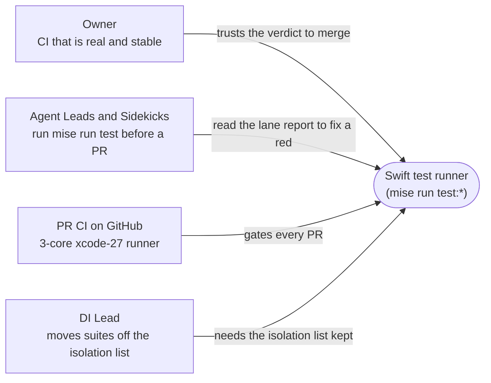

# Requirements: Swift test runner on per-target bundles (Xcode 27)

Specification: [2026-10-04-swift-test-runner-per-target-bundles-specification.md](2026-10-04-swift-test-runner-per-target-bundles-specification.md)

## Who needs what

No user interface changes: `no current UI`. The runner is a command-line and CI surface.

## Current pain

On Xcode 27 (Swift 6.4, SwiftPM's default Swift Build engine) the Swift lanes cannot produce a trustworthy verdict:

- The build produces one test bundle per test target (19 bundles), but the runner looks for one combined bundle. The isolated, fast process-global and WebKit lanes find nothing to run.
- The runner reads failures out of console text. Swift 6.4 changed that text, and the reader also has a pipe defect: it reports "no failures" when a failure appears early in a large output. On Xcode 27 a real test failure was reported as "exited 1 with no recorded test failure". The same defect exists on today's main and can hide a failure behind a green exit.

## Requirements

| ID | Need or outcome | Why it matters | Evidence | Authority | Priority |
|---|---|---|---|---|---|
| U1 | Move agentstudio to Xcode 27 / Swift 6.4 now, and make the tests pass on 27 directly | The toolchain move is blocked on the tests | Owner, 2026-10-04: "ok if prod works why we dont move to 27?", "and fix the fucking tests?" | authorized (owner) | must |
| U2 | Use per-target test bundles, not the deprecated `--build-system native` workaround | The native engine is deprecated in Swift 6.4; per-target bundles are where SwiftPM is going | Owner Q10, 2026-10-04: "worth splitting the bundles instead of our sloppy workaround" | authorized (owner) | must |
| U3 | Stability first | The CI core took two weeks to stabilise | Owner, 2026-10-04: "important is stability" | authorized (owner) | must |
| U4 | A red lane names what failed; a green lane never hides a failure | "CI that is real": a red is diagnosed from its lane report and event-stream artifact, never rerun | Owner CI goal; repo CLAUDE.md "When a run is red" | authorized (owner + repo contract) | must |
| U5 | Keep the explicit per-suite process-isolation list and one-suite-per-process runs inside each bundle | 120 of the 151 specially handled suites live in one target, AgentStudioTests; DI's proof moves suites off this list | DI Lead request; owner-confirmed boundary Q11, 2026-10-04 | authorized (owner Q11) | must |
| U6 | F5 v2 sharding and the isolated-phase speedup come in the NEXT slice, not this one | One change of shape at a time on a beta toolchain | Owner Q11, 2026-10-04: "Boundary OK, F5 v2 next" | authorized (owner) | non-goal here |
| U7 | No CI reruns, no raised time limits or budgets | A green earned by rerunning or loosening proves nothing | Repo CLAUDE.md; owner rules | authorized (repo contract) | must |

## Boundary (owner-confirmed, Q11, 2026-10-04)

- **In:**
  - each suite runs from its own bundle;
  - the build receipt and the width ledger cover every bundle;
  - failure and in-flight detection come from the event stream;
  - hang evidence matches target-named executables.
- **Kept as-is:**
  - the isolation list and one suite per process;
  - the lane topology (fast, large, WebKit, E2E, benchmark, zmx);
  - the hang bound and the no-rerun policy;
  - `mise run test:*` as the only entry points.
- **Out:**
  - XCTest;
  - rewriting suites;
  - raising time limits or adding reruns;
  - `--build-system native`;
  - F5 v2 and the isolated-phase speedup (next slice).
- **Toolchain:** Xcode 27 everywhere: CI, release and developer machines. Consequence: a machine still on Xcode 26.x cannot run the Swift lanes after this lands.

## Open hypotheses

None that change obligations. The supported-toolchain consequence above is an owner action (install Xcode 27), not an open question.
