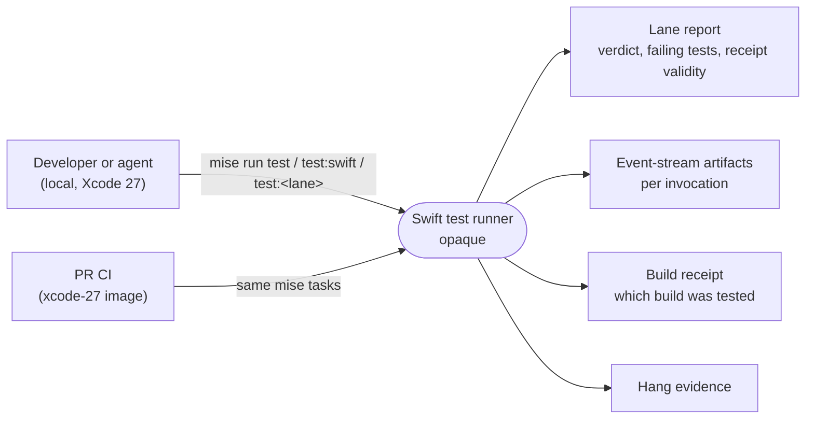
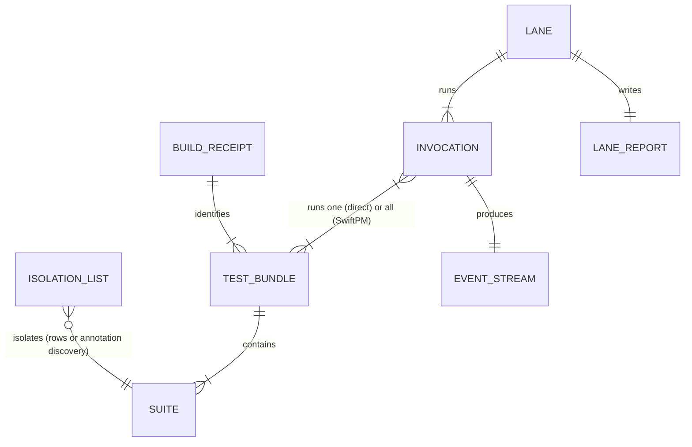

# Specification: Swift test runner on per-target bundles (Xcode 27)

Requirements: [2026-10-04-swift-test-runner-per-target-bundles-requirements.md](2026-10-04-swift-test-runner-per-target-bundles-requirements.md) (U1-U7)
Program Design: [2026-10-04-swift-test-runner-per-target-bundles-program-design.md](2026-10-04-swift-test-runner-per-target-bundles-program-design.md)

## What the runner promises, from outside

Negative space: the runner does not rerun anything; does not change suites or their lanes; does not shard (F5 v2 is the next slice); does not support Xcode 26.x after this change.

## Domain entities

| ID | Term | Identity rule | Relationships | Invariants | Observable states | Basis |
|---|---|---|---|---|---|---|
| E1 | Test bundle | One per SwiftPM test target in the build; two bundles are the same if they name the same test target (e.g. `AgentStudioTests`) | contains 1..n Suites; a build yields every test target's bundle | every test target in the package has exactly one bundle per build | built for HEAD / stale (built from other sources) / missing | U2 |
| E2 | Suite | Its full Swift Testing suite path (`Parent/Child` for nested suites); the path is unique across all bundles of one build | belongs to exactly one Test bundle; has 1..n tests | no suite path appears in two bundles of one build | listed / not found | U2, U5 |
| E3 | Lane | A named `mise run test:*` task (fast, large, WebKit, E2E, benchmark, zmx) | runs a set of Suites through 1..n Invocations | lane names and membership rules unchanged by this change | running / pass / fail / unverified | U3 |
| E4 | Isolation list | The set of suites that must run one per process, as the repository decides it today: explicit inventory and exception rows, plus suites discovered from their `@MainActor` + `.serialized` source annotations | references Suites; each explicit row names a lane | membership rules unchanged by this change | a suite is isolated or not | U5 |
| E5 | Invocation | One command the runner starts and judges, identified by its lane, label and suite filter. Two kinds: a **direct** invocation reads exactly one Test bundle; a **SwiftPM** invocation (`swift test`) runs every Test bundle of the build, one after another | belongs to one Lane; produces one Event stream | an isolated suite's tests run only inside the Test bundle that contains it | passed / failed (issue recorded) / crashed (signal or abort) / hung (hit the hang bound) | U2, U4 |
| E6 | Event stream | The machine-readable record Swift Testing writes for one Invocation: one run (started … ended) per Test bundle the Invocation ran, with test started/ended and issue recorded (with whether it counts as a failure) | belongs to exactly one Invocation | independent of console text format | complete (every run that started also ended, and the number of runs matches the Invocation's kind) / truncated / missing | U4 |
| E7 | Build receipt | The record linking lane runs to the build they tested: source HEAD plus the identity of every Test bundle in that build | covers all Test bundles of one build; referenced by each Lane's report | a lane that ran a bundle not in the receipt cannot report a valid receipt | valid / invalid (with reason) | U4 |
| E8 | Lane report | The per-lane summary: verdict, failing tests, receipt validity, evidence locations | belongs to one Lane run | names every failing test the Event streams record | written at lane end | U4 |

## Requirements

| ID | Requirement | Basis | Success | Failure expectation | Proof |
|---|---|---|---|---|---|
| R1 | For every Suite a Lane runs, the runner runs it in an Invocation that reads the Test bundle containing it. | U2 | every listed suite reports its tests from its own bundle | — | V1, V5 |
| R2 | If a Suite a Lane must run is in no Test bundle, then the Lane fails and the Lane report names that Suite. | U4 | — | no silent skip | V1 |
| R3 | If one Suite path appears in two Test bundles, then the Lane fails and the report names the Suite and both bundles. | U4 | — | no arbitrary choice | V1 |
| R4 | While running suites on the Isolation list, the runner runs each one in its own Invocation, with no more concurrent isolated Invocations than today (4). | U5, U3 | same isolation as today, per bundle | — | V1, V5 |
| R5 | The Isolation list's membership rules stay as they are today (explicit rows plus annotation discovery); for a suite governed by an explicit row, adding or removing it stays a one-row change. | U5 | membership of every suite unchanged by this change | — | V2 |
| R6 | A Lane's verdict and its list of failing tests are determined from the Event streams of its Invocations, not from console text. | U4, U1 | verdict unchanged by console-format changes | — | V3 |
| R7 | If an Invocation exits 0 but its Event stream records an issue that is not a known issue, then the Lane fails and names the test. | U4 | — | a failure can never pass as green | V3 |
| R8 | If an Invocation exits non-zero or hits the hang bound and its Event stream records failing issues, then the Lane report names those tests. If it exits non-zero with none recorded, then the report says it crashed or aborted and gives the signal or exit status. An incomplete Event stream never hides either fact. | U4 | — | the failure cause is never misnamed | V3 |
| R9 | A known issue (expected failure) never fails a Lane by itself. | U4 | unchanged behavior | — | V3 |
| R10 | If an Event stream is missing or truncated for an Invocation that ran, then the Lane is not reported as pass. | U4 | — | absence of evidence is not success | V3 |
| R11 | The Build receipt identifies every Test bundle of the build. A Lane reports its receipt valid only if every bundle it ran matches the receipt. | U4 | valid receipt on a clean, freshly built tree | invalid with reason otherwise | V4 |
| R12 | The in-flight and peak-concurrency figures in the Lane report come from the Event streams and keep today's meanings: announced tests (started, not yet ended) and running parameterized cases. | U4 | figures non-zero and consistent with what ran | — | V3 |
| R13 | When an Invocation hits the hang bound, hang evidence is captured for that Invocation's process under per-target bundles. | U4 | evidence names the hung invocation | — | V1 |
| R14 | Lane names, the hang bound, the no-rerun policy and `mise run test:*` as the only entry points stay unchanged. The width-comparison lane compares runs over the same set of bundles. | U3, U7 | — | no budget or retry added | V2, V5 |
| R15 | On Xcode 27, `mise run test` passes on a clean tree locally and the PR's CI passes on the xcode-27 image. | U1 | both green | a red names its failing tests | V5, V6 |

## Cross-cutting

- **Reliability:** R2, R3, R7, R8, R10 forbid any silent pass.
- **Performance:** no obligation beyond R4 (no new concurrency limits). Speed is the next slice.
- **Security / privacy:** not applicable; no new inputs or outputs.

## Proof

| ID | Evidence class | What it must show |
|---|---|---|
| V1 | automated behavior (script tests with real per-target bundle fixtures) | suite to bundle resolution; missing and duplicate suites fail with names; one suite per process; hang evidence names the process |
| V2 | state inspection | every membership authority (explicit inventory and exception rows, annotation discovery) is unchanged, so each suite's membership is unchanged; for an explicitly governed suite, a one-row change moves it |
| V3 | automated behavior through the real invocation wrapper and lane report (child commands that write captured Xcode 27 event-stream records to the real stream path and return controlled statuses), including an exit-0 run with a recorded issue, a known issue, a warning, a truncated multi-bundle stream, no matching tests, a crash after an issue, a hang after an issue, and an unavailable reader | returned status, retained evidence and the report's failing-test names follow the event stream |
| V4 | automated behavior | receipt valid for a matching bundle set, invalid with reason for any mismatch |
| V5 | runtime evidence | `mise run test` on Xcode 27 (sunclaw) passes on a clean tree; a deliberate failing test makes its lane red with that test named |
| V6 | release or runtime evidence | PR CI green on the xcode-27 image |
