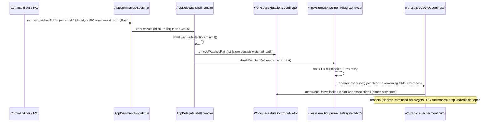

# Program design: remove a watched folder

Spec: `specification.md` (S1–S6). Grounded at main d7cf957e5.

## Crux
Hiding "only what this folder alone found" sounds like it needs provenance, a record of which folder found each repo. It does not, because the filesystem actor already computes current folder references (E3) when the watched list shrinks:
1. `reconcileWatchedFolderRegistrations` (FilesystemActor+WatchedFolderScanning.swift:198-283) retires the removed folder's FSEvents registration, scheduler work and inventory.
2. At :281 it calls `emitRemovedClones(noLongerReferencedByAnyWatchedFolder:)` (FilesystemActor.swift:860-888). That emits `.topology(.repoRemoved)` only for clones that no remaining inventory references, and for every clone once the last folder is gone.
3. `WorkspaceCacheCoordinator.handleRepoRemoved` (…+TopologyIngress.swift:236-278) answers that event:
   - `markRepoUnavailable` hides the repo and keeps its row;
   - `clearPaneAssociations(forRemovedWorktreeID:)` (WorkspaceMutationCoordinator.swift:279-296) keeps each pane and its cwd and clears only repo/worktree facets;
   - `topologyDidChange` follows, and no pane or drawer is retired.

Two pieces are missing:
- **An entry point.** `removeWatchedPath` (WorkspaceMutationCoordinator+RepositoryTopology.swift:197) has no caller, and there is no command. Persistence observes `watchedPaths` (RepositoryTopologyStore.swift:101-114), but nothing refreshes the watched-folder pipeline when the list shrinks. The add flow refreshes it explicitly (AppDelegate.swift:659).
- **Two readers that ignore "hidden".** The IPC repository projection (WorkspaceStore+ProgrammaticControlSnapshot.swift:98-113, used by `workspace.list` / `workspace.current` in AgentStudioIPCQueryAdapter.swift:147-169) and the command bar's targeted repo and worktree rows (CommandBarDataSource.swift:533-563) list every stored repo. The sidebar already excludes unavailable repos (RepoExplorerProjectionInputCapture.swift:606-615).

Selected: wire one command into the existing chain, and filter the two readers. Rejected: a provenance table. It is new persisted state no requirement needs.

## Entity bindings
| Entity | Owner and home | Role |
|---|---|---|
| E1 Watched folder | `WatchedPath` in `RepositoryTopologyAtom.watchedPaths`; `RepositoryTopologyStore` persists it to the `watched_path` table, rewritten per save (WorkspaceCoreRepository+TopologyMutation.swift:50-57) | persisted |
| E2 Repo, hidden or visible | `Repo` in `RepositoryTopologyAtom.repos`, plus the unavailable set; absence records persisted in the live `unavailable_repo` table (RepositoryAbsenceStorage.swift:14-17, 85-89) | persisted row and flag; visibility is derived by each reader |
| E3 Folder reference | `FilesystemWatchedFolderInventory` per `FilesystemSourceID` in the actor's `inventoryBySourceID` (FilesystemWatchedFolderScanState.swift:10-12). Rebuilt from the persisted list at launch | cached, in memory |
| E4 Pane link | the pane's repo/worktree facets in `WorkspacePaneGraphAtom` (cleared at :564-585), persisted with the pane | persisted |

## Flow

## Components
No new atom, store, table, migration, bus event or coordinator responsibility is added.

- **Command identity (Core/Actions/Commands):**
  - `AppCommand.removeWatchedFolder`, with an `AppCommandSpec` beside Watch Folder (AppCommand+Catalog.swift:659-681): label "Remove Watched Folder", icon `folderBadgeMinus`, help "Stop watching a folder and hide the repositories only it found", surface `.exposed([.commandBar])`, `targeting: .targeted([.watchedFolder])`, group "Repo";
  - no `visibleWhen`, and no shortcut;
  - `SearchItemType.watchedFolder` is a new case. `AppCommandDispatcher.ipcHandleKind(for:)` (:309-319) maps it to `nil`: it is an interactive folder id, not an IPC handle;
  - the new command is also classified in the existing exhaustive shell, workspace-owner and catalog-coverage switches.
- **IPC projection (AppCommand+IPCProjection.swift).** The same rows as `.watchFolder`:

  | Row | Value | Watch Folder anchor |
  |---|---|---|
  | argument | `[.directory]`, the existing `IPCDirectoryCommandArguments(workspaceWindowId, directoryPath)` (IPCCommandArguments+Records.swift:175-182) | :147-148 |
  | exposure | `.debugTesting` | :215, :238 |
  | execution mode | `.headless` | :276, :300 |
  | privilege | `.layoutMutate` | :356, :371 |
  | target kinds | `[.window]` | :399-403 |
  | result | `[.accepted]` | :467-470 |
  | agent | `.notYetAllowed` | :547, :573 |

  No new transport method or handle kind.
- **Command bar (Features/CommandBar):**
  - targeted rows for `.watchedFolder` list `repositoryTopologyAtom.watchedPaths` (title is the folder name, subtitle the path) as `.dispatchTargeted(.removeWatchedFolder, target: watchedPath.id, targetType: .watchedFolder)`;
  - `isSearchItemAvailable` checks that the id is still listed;
  - the existing targeted repo and worktree rows (CommandBarDataSource.swift:533-563) skip repos that `isRepoUnavailable` marks, matching the async search filter already in CommandBarPanelController+Search.swift:150-173 (F1).
- **IPC repository projection (Core persistence snapshot).** `programmaticControlSnapshot()` maps only repos that are not unavailable (F1). Pane snapshots are unchanged. This removes every hidden repo from `workspace.list` / `workspace.current`, including repos hidden for other reasons: a visible IPC output change, called out in the PR.
- **Execution owner (App/Boot):**
  - `handleRemoveWatchedFolderRequested(_ watchedPathID: UUID) async`, mirroring `handleWatchFolderRequested`:
    1. `await workspaceCacheCoordinator.waitForRetentionCommit()`;
    2. `store.mutationCoordinator.removeWatchedPath(id)`, promoted from internal to `package`;
    3. `await watchedFolderCommands.refreshWatchedFolders(store.repositoryTopologyAtom.watchedPaths)`.
  - Interactive path: the shell's targeted `canExecute(_:target:targetType:)` (AppDelegate+ShellCommandHandling.swift:247-261) returns true for `.removeWatchedFolder` only with `targetType == .watchedFolder` and an id in the current list (no contextual fallback). Targeted `execute` starts the handler.
  - IPC path: the headless directory handler routes `.removeWatchedFolder` to a remove branch. It finds the watched entry by `StableKey.fromPath(directoryPath)`. With no match it returns `.unavailable(.noApplicableTarget)`. Otherwise it starts the handler and returns `.accepted(operationId: nil)`. Unlike Watch Folder there is no on-disk existence check, so a folder deleted from disk can still be removed. IPC authorization stays separate from interactive enablement (AppCommandDispatcher.swift:123-158).

## Obligation realization
| Obligation | Owner and interface | State | Failure | Proof |
|---|---|---|---|---|
| S1 folder gone, no watch | handler → `removeWatchedPath` → `refreshWatchedFolders(remaining)` → actor retires the registration | `watched_path` rewritten by the store's observed autosave and its termination flush (AppDelegate+Termination.swift:137-140); launch registers only the persisted list (AppDelegate+WorkspaceBoot.swift:923-934) | an accepted receipt is not a durability receipt | actor test (registration retired); App test (list persisted); real-app restart |
| S2 exclusive hidden, shared kept | the existing shrink chain plus the two filtered readers | unavailable set persisted. At launch every stored repo is replayed unscanned (:902-921), which keeps it unavailable (TopologyIngress.swift:55-79) | known limits in the spec | nested-pair actor test; App test through the IPC summaries and empty-query targets, before and after restore |
| S3 panes stay | `clearPaneAssociations` from `handleRepoRemoved` | pane facets cleared and persisted; launch does not relink to unavailable repos (WorkspacePersistenceTransformer.swift:53-81) | none added | App test: pane, tab and drawer membership and cwd unchanged |
| S4 command | catalog spec, targeted rows, shell `canExecute`/`execute`, IPC directory branch | none | stale id refused by `canExecute`; unwatched path → noApplicableTarget | catalog and IPC exhaustiveness; targeted dispatch with current and stale ids; IPC unknown and deleted paths |
| S5 last folder | same as S1 and S2, with an empty list (FilesystemGitPipeline.swift:359-366 takes its immediate-refresh branch) | empty `watched_path` | as S2 | actor test, empty list |
| S6 re-watch | Watch Folder → scan → `.watchedFolderReconciled` (FilesystemActor+WatchedFolderResultApplication.swift:176-194) → scoped reconciliation clears absence (RepositoryLifecycleReconciliation.swift:65-108, applied by WorkspaceCacheCoordinator+ScopedTopology.swift:27-45) | absence record removed | unchanged | existing reconciliation tests plus the real-app re-watch |

## Failure and ordering
- Removal is ordered after any in-flight retention commit (the same guard as add). An ordinary removal also waits for an active manual refresh (FilesystemActor+WatchedFolderScanning.swift:57-78). Late scan results for the retired source are ignored (FilesystemActor+WatchedFolderResultApplication.swift:92-98, 122-125).
- Topology delivery to `WorkspaceCacheCoordinator` uses the critical, unbounded subscription (WorkspaceCacheCoordinator.swift:120-134; EventBus.swift:531-538). A burst of removals converges without drops (WorkspaceCacheCoordinatorIntegrationTests.swift:583-638). No retry, replay or timer is added.
- The two spec known limits (an incomplete inventory elsewhere, and the pre-existing missing-main launch repair at AppDelegate+WorkspaceBoot.swift:762-782) stay as named limits with no added mechanism.

## Proof seams
- `FilesystemActorWatchedFolderTests`, extending the shrink case at :509-533:
  - with a nested pair, removing the outer folder emits removal only for its exclusive clones;
  - an empty list emits removal for every clone.
- `WorkspaceCacheCoordinatorIntegrationTests` (unavailable replay and critical delivery) and `PaneContextRepositoryRemovalTests` (currently hard delete; extend it for the unavailable path):
  - command → exclusive repo unavailable, its pane unlinked but present;
  - the shared repo stays listed;
  - IPC summaries and empty-query targets are checked before and after restore.
- `AppCommandTests` and `AgentStudioIPCCommandRealOwnerCoverageTests` (Watch Folder row at :101):
  - catalog and IPC exhaustiveness;
  - `.watchedFolder` maps to no handle kind;
  - targeted current and stale ids;
  - IPC unwatched and deleted paths.
- Real app:
  - debug build; `command.execute removeWatchedFolder` with `workspaceWindowId` and `directoryPath`;
  - `pane.snapshot` and `workspace.current` checked;
  - restart, then re-watch.
