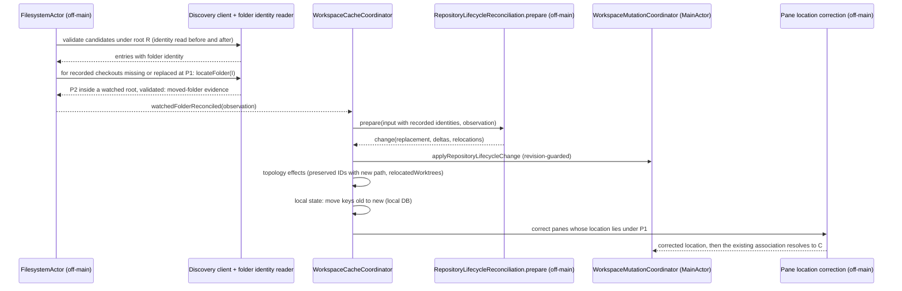

# Program design: repositories keep their identity when folders move

[Requirements](requirements.md) → [Specification](specification.md) (S1–S13) → this document. Grounded at `584f9992d` (main merged into `remove-watched-folder`). The agentstudio-git pin is `372fedb0`, and this design needs no package change.

## Crux

**1. Which fact proves a move?** Today the app knows a checkout only by its path:

- `RepositoryLifecycleReconciliation.prepare` matches by path or stored stable key, and otherwise issues `UUIDv7.generate()` (RepositoryLifecycleReconciliation.swift:69-83);
- the package's identity is `common:<canonicalCommonDirectory.path>` (pin `372fedb0`, `GitDiscoveryReadContracts.swift:117-144`).

A move proof needs a fact that survives a rename and does not survive a copy.

| Signal | Survives `mv` | Survives a copy or clone | Cost | Decision |
|---|---|---|---|---|
| Folder identity: volume plus object IDs of the checkout folder and its Git directory | yes | no: new objects | Reads only. Fails across volumes and for copy-then-delete (both stay independent). | **Selected** (owner decision D1) |
| A marker file written into `.git` | yes, also across volumes | yes: copies duplicate it | Writes into user Git metadata, which Sep 11's protected scope excludes. Duplicate markers need their own ambiguity rules. | Rejected |
| Git history, remote, root commit or name | yes | yes: clones share them | It would merge independent clones, which M3 forbids. | Rejected as a matcher. It is not a guard either, because it cannot tell clones apart. |

The SDK and this host back the selected signal:

- `VOL_CAP_FMT_PATH_FROM_ID` "implies that object ids on this file system are persistent and not recycled" (`MacOSX.sdk/usr/include/sys/attr.h:212-217`).
- A read-only probe on the home volume (device 16777231, shared by `~/code`, `~/Documents` and `/private/tmp`) reported:
  - persistent object IDs, PATH_FROM_ID, and 64-bit IDs: valid and set;
  - directory hard links: valid and not set.
- Measured on that volume:
  - `mv` kept the IDs of both the checkout folder and `.git`;
  - `cp -R`, `git clone` and `cp -c` produced new IDs;
  - a plain `mv` of a linked checkout kept its folder ID, and its admin directory in `.git/worktrees/<name>` was unchanged;
  - `fsgetpath(fsid, objectID)` returned the folder's new path after a move, and `ENOENT` after deletion, without extra privileges.

**2. Asking, not waiting.** `fsgetpath` lets the app ask the filesystem where a recorded folder is now. So the proof does not depend on which watched folder is scanned first. Without it, the destination scan could issue a new UUID before the source scan runs. Or a different clone that now occupies P1 could inherit the old identity through Sep 11 R1, the July `[X, Y]` case.

**3. Same UUID, new path.** Today a different-path reassociation issues a new checkout UUID (`WorkspaceCacheCoordinatorRepoMoveTests.swift:91-154`). So no consumer has ever seen a preserved worktree ID change its path. The observation-lifetime index already keys lifetimes by (ID, path), so a path change advances them, and late facts for the old path are rejected (RepositoryObservationLifetime.swift:26-60). Path-keyed state still needs explicit work:

- stored stable keys are UNIQUE (worktree and repo tables);
- recents and local activity are keyed by them (WorkspaceLocalRepository+RepositoryRetention.swift:24-29);
- `recordOpened` writes `repo.stableKey` from the current path (WorkspaceSurfaceCoordinator+ActionExecution.swift:609-617).

**4. Panes cannot follow by identity alone.** Association derives from the reported working directory (WorkspaceMutationCoordinator.swift:299-340). The Ghostty zsh integration reports `$PWD` at every prompt (`vendor/ghostty/src/shell-integration/zsh/ghostty-integration:235-241`), and after a move that path is stale and missing. That is why 22 production panes are unlinked. The true location belongs to the shell process. The app already holds the shell's process incarnation in `ZmxSessionIdentity.terminalLeader` (ZmxSessionIdentity.swift:10-17).

## Components

No new atom, store, table, bus event or coordinator responsibility is added. There is no package change. One persisted-format change: three nullable columns on `worktree`.

| Component | Slice | Owns | Change |
|---|---|---|---|
| `DarwinFolderIdentityReader` (new) | Infrastructure/FolderIdentity | Darwin facts only: whether a volume qualifies (E4), `(volumeUUID, objectID)` for a path, and lookup of a folder by `(volumeUUID, objectID)` to its current canonical path (`fsgetpath` after mapping the volume UUID to the mounted fsid). No Git. | New. Typed outcomes: `.identified`, `.unsupportedVolume`, `.unreadable` / `.located(URL)`, `.notFound`, `.volumeNotMounted`, `.unreadable`. |
| `RepoScannerGitDiscoveryClient` | Infrastructure | Package validation into scanner evidence | It reads the folder identity of `canonicalWorktreePath` and `canonicalGitDirectory` before and after the package read. If they are equal, it attaches them to `ResolvedGitEntry.folderIdentity`; on an unsupported volume it attaches nil. If they differ, the result is a transient failure: a replacement during validation (S1). It currently discards the Git directory (:51-91). |
| `CheckoutFolderIdentity` (new value) | Core/Models | `volumeUUID`, `checkoutFolderObjectID`, `gitDirectoryObjectID` | Value type with Equatable and Hashable conformance. |
| `RepositoryTopologyReplacement` and `RepositoryTopologyAtom` | Core | The canonical topology replacement | Adds `worktreeFolderIdentitiesByID`, beside `worktreeStableKeysByID`, with equal-write suppression. Precedent: the stable keys and absence records already ride here without a UI subscriber. New validation: no two checkouts record one identity (`duplicateFolderIdentity`, the TA9 floor). |
| Core persistence | Core/State/MainActor/Persistence | `worktree` rows | Additive migration, `ALTER TABLE worktree ADD COLUMN`: `folder_volume_uuid TEXT`, `folder_checkout_object_id INTEGER`, `folder_git_directory_object_id INTEGER`. The UInt64 values are bit-cast to Int64. All three present decodes to an identity; all absent decodes to none; any other combination decodes to none, logs a diagnostic, and is rewritten at the next validation. No CHECK and no trigger. |
| `FilesystemActor` observation assembly | Core/RuntimeEventSystem/Filesystem | Building `WatchedFolderTopologyObservation` (FilesystemActor+WatchedFolderResultApplication.swift:176-192) | `WatchedFolderScanBaseline` carries the recorded identity per checkout. An authoritative observation for root R gains `movedFolderEvidence` (detailed below). |
| `RepositoryLifecycleReconciliation.prepare` | Core coordination (off-main) | Identity resolution (July TA2) | Adds an identity-claims phase before path matching (detailed below). `RepositoryLifecycleChange` gains `relocations: [CheckoutRelocation]`, each with the worktree ID, family ID, previous and new worktree keys, and, for a main checkout, previous and new family keys. |
| `WorkspaceCacheCoordinator+ScopedTopology` | App | Ordering effects after an accepted change | After `applyRepositoryLifecycleChange`, it re-keys local state for each relocation and asks the pane location service to correct panes under the old path. Existing deltas and root sync handle the rest. |
| `WorkspaceLocalRepository` | Core persistence (local DB) | `local_entity_recency`, `local_repository_activity` | `moveRepositoryLocalState(from:to:)`: a keyed move in one transaction. When the destination key already has a row, the destination row wins. |
| `WorktreeTopologyDelta` | Core | Topology effect contract | Adds `relocatedWorktrees: [RelocatedWorktreeEntry(id, previousPath, path)]`. Owners of path-keyed registrations retire the old path explicitly instead of inferring it. |
| `TerminalTrueLocationReader` (new) | Infrastructure | Reading a process's current directory | It checks the terminal-leader incarnation (pid and start time) with `PROC_PIDTBSDINFO`, then reads `PROC_PIDVNODEPATHINFO` for `pvi_cdir`. Outcomes: `.located(URL)`, `.processGone`, `.identityMismatch`, `.unreadable`. |
| Pane location correction (new step) | Features/Terminal runtime | The S8 decision: is the reported location missing, and what is the true location? | Off-main. Its input is the pane, its zmx session, and the reported path with that report's revision. It applies only if the report is still current. It publishes the corrected location through the existing runtime CWD route. It never sends input to the terminal. |

## Moved-folder evidence: how the observation is assembled

The `FilesystemActor` checks each baseline checkout under R that has a recorded identity I. A checkout is a candidate when its path is absent from the new inventory, or present with a different identity. For each candidate:

1. `locateFolder(I.volume, I.checkoutFolder)`.
2. If the folder is located at P2 ≠ P1, check that P2 is inside a current watched root (canonical containment).
3. Validate P2 with the discovery client.
4. Attach `(P1, validated entry at P2)` to the observation.

The actor reports evidence and decides nothing.

## Identity claims in `prepare`

1. **Index.** Index the recorded identities. Any identity recorded on two checkouts is excluded from claims (S5).
2. **Claims.**
   - From entries, including `otherObservedEntries`: an entry whose identity equals checkout C's recorded identity while its path ≠ C's path.
   - From `movedFolderEvidence`.
3. **One-to-one.** Drop every claim on a destination path that two records claim, every record that claims two destinations, and every identity that two current entries present.
4. **Git agreement.** Keep a claim only if the entry kind matches C's role (`cloneRoot` with main, `linkedWorktree` with linked). The Git-directory part is already in the identity.
5. **Apply.** For each surviving claim, update C:
   - `path`, `name`, and the family's `repoPath` when C is main;
   - clear the absences of C and its family;
   - re-derive the stable keys of C and its family from P2;
   - record a `CheckoutRelocation`.

   Claimed records and destination paths are consumed.
6. **Existing matching** then runs over what remains. It skips consumed records, so a different folder at P1 cannot reuse a record that moved (S6). Every matched entry refreshes that record's recorded identity. Same-path reuse with a different identity under R1 refreshes the identity to the new folder.

Re-keying stable keys on relocation is required, for three reasons:

- a sticky key derived from P1 would later let a new folder at P1 match the moved record by key (:69-72);
- it would collide with that folder's UNIQUE key;
- it would split recents, which `recordOpened` writes under the key of the current path.

Session IDs are opaque UUIDv7 values and do not depend on the key (ZmxSessionID.swift:4-14), so no session is renamed. The Bridge root token is `worktree.stableKey` (BridgeWorktreeFileSourceProvider.swift:39), so a relocation advances it, and file sources re-subscribe. That is correct for a location change, and no Bridge edit is needed.

## Flow

## State, failure and concurrency

| Concern | Disposition |
|---|---|
| Scan order (S3) | Claims come from destination entries (path 2.1) and from source-side `locateFolder` evidence (path 2.2). The two paths converge on the same result whichever root is reconciled first. When neither applies yet, the record is hidden, as today, and the later scan restores it by the same rule. |
| A stale observation | Unchanged: `baselineMembershipRevision` and lifecycle-revision guards; retry, then `refreshStaleObservation` (ScopedTopology.swift:12-27, 101). |
| A folder moved again between evidence and commit | The commit uses the revision guard. The next observation re-locates the folder. No lock and no wait. |
| A folder replaced during validation | The before and after identities differ, so the result is a transient failure. That is not absence evidence. |
| Volume not mounted, or TCC denial | `locateFolder` returns `.volumeNotMounted` or `.unreadable`. No claim is made, and the existing absence rules apply. |
| Duplicate identity, such as a cloned volume image | S5: no transfer for anyone. A diagnostic counter is recorded. The replacement validation backstops it with `duplicateFolderIdentity`. |
| Crash between the core commit and the local re-key | Old-key local rows become orphans and the existing sweep prunes them. Recents and activity for that checkout are lost. Topology identity is not. This is accepted, and no mechanism is added for it. |
| Pane report races (S8) | The correction applies only if the pane's latest report revision is still the missing path. A newer report wins. The accumulator suppresses repeats of the same raw report (GhosttyActionRouter+LocalActions.swift:99-103), so stale prompts do not flip the location back. |
| The panes at launch | After terminal runtimes attach, correct each pane whose stored location does not exist (22 today). The work is bounded by that count. |

## Obligation realization and proof seams

| Obligation | Owner | Proof seam |
|---|---|---|
| S1 | discovery client, folder identity reader, codec | Real-filesystem tests in a temporary directory: `mv` keeps the identity; `cp -R`, `git clone` and `cp -c` change it; a replacement during validation yields a transient failure; an unsupported-volume seam yields none. A codec round trip and malformed columns decode to none. |
| S2, S3, S6 | `prepare` identity claims, `movedFolderEvidence` | Pure reconciliation tests: rename within one root; moves across roots in both orders; a move while the app was closed (restored input); P1 replaced by another clone while X sits at P2; moves of a main checkout and of a linked checkout. Integration on real folders plus package and SQLite: UUID, pin, note, tags and recents preserved across restart, with no duplicate row. The existing `relocationKeepsPaneAndAssignsDistinctCheckoutIdentity` expectation is replaced, because its contract changes. |
| S4, S5, S7 | the same | Negative cases: a copy beside the original; two clones with identical history; a duplicate recorded identity; a destination outside watched folders; a Git role mismatch; a linked checkout moved with `mv`, rejected before `git worktree repair` and relocated after it. |
| Runtime effects | `WorktreeTopologyDelta.relocatedWorktrees`, Git projector, root sync, Forge, repo cache | An effects test: the old-path registration is retired, the new one registered, and a late fact for the old lifetime rejected. The plan audits every `WorktreeTopologyDelta` consumer and proves each with one test. |
| S8, S9 | pane location correction, true-location reader | Reader tests against a real child process whose working directory is moved. A runtime test drives a missing report, the correction, a repeated stale report (no flip) and a newer valid report (wins). An App test: after a relocation, a pane under P1 links to the same checkout ID. Real app: a zmx terminal inside a moved folder keeps its chip and its session ID. |
| S10, S11 | Oct 7 design; retention preparation if D2 is accepted | Oct 7 proof. With D2: a collection test for rows not covered by any watched root. |
| S12, S13 | all of the above | A source check: no Git CLI, no writes into user folders. Marker-scoped counters for relocation and correction outcomes, and MainActor occupancy measured separately from off-main time (Sep 11 R6). |

Real-app proof uses the debug build and the journey in the Specification, followed by a restart.

## Delivery shape

These are three independent PRs, each with its own proof:

1. **Remove Watched Folder** (Oct 7 design, plus S11 if D2 is accepted). Its design is already reviewed.
2. **Pane location truth** (S8, S9 for unproved cases). It is independent of identity and relinks the 22 legacy panes on launch.
3. **Folder identity and relocation** (S1–S7, S12, S13).

Recorded folder identities exist only for checkouts validated after PR 3 ships. Moves made before that stay independent (D3).
