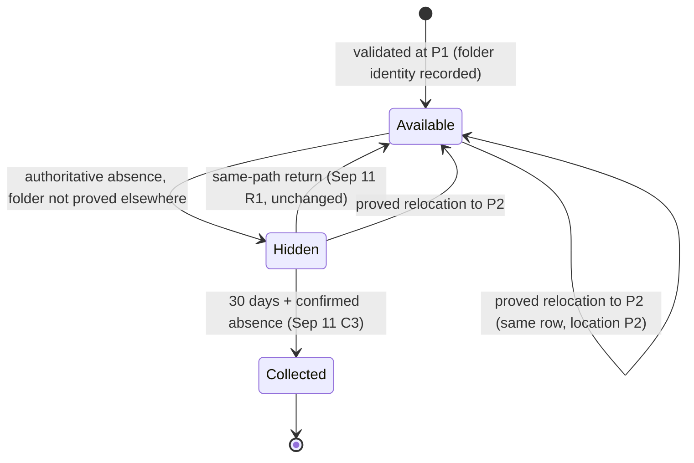

# Specification: repositories keep their identity when folders move

[Requirements](requirements.md) (M1–M7) → this Specification → [Program design](program-design.md).

The [September lifecycle specification](../2026-09-11-repository-lifecycle/specification.md) (C1–C6) and the [October 7 specification](../2026-10-07-remove-watched-folder/specification.md) (S1–S6) remain in force, except for two explicit cutovers:

- **Sep 11 C1** said there was no automatic cross-path move proof. That is replaced by S1–S8 here.

The September exclusion of persistent move-correlation identity is superseded as stated in the Requirements. Until owner decision D1 is made, this Specification is a proposal.

## What the user experiences

A user moves `~/Documents/dev/app` to `~/code/app` on the Mac's startup disk: a `mv`, a Finder move, a rename, or a move of a parent folder. If the new place is inside a watched folder:

- the sidebar row keeps its pin, note, tags and recents, shows the new path, and never appears twice;
- a terminal whose shell was inside the folder shows the new location and keeps its git chip;
- an open file viewer or review pane for that checkout keeps working at the new location.

A copy, a fresh clone, or a move to another disk stays a separate row, exactly as today.

An unproved new location becomes an independent new row. The old row follows the Hidden path above.

## Entities

| Id | Entity | Identity and relationships | Observable states |
|---|---|---|---|
| E1 | Checkout | The application record for one Git working-tree location. Its identity is its UUID. Its *recorded location* is a validated canonical path. A record **holds** that path. It belongs to exactly one family and has a role: main or linked. | available, hidden (retained), collected |
| E2 | Family | The repository record. Its identity is its UUID. Its location is its main checkout's location. It owns pin, note and tags. | available, hidden, collected |
| E3 | Startup volume | The mounted volume instance that holds the user's home folder. It *qualifies* only if it declares two things: object numbers that persist and are never reused (`VOL_CAP_FMT_PATH_FROM_ID`), and no directory hard links. On a qualifying startup volume, a folder object has one number and one path at a time. | qualifying, not qualifying |
| E4 | Folder identity | For a checkout location, this is the triple (startup-volume UUID, number of the checkout folder, number of the Git directory). The Git directory is the one agentstudio-git resolves for that checkout: `.git` for a main checkout, `.git/worktrees/<name>` for a linked one. The identity is defined only when both folders are on the qualifying startup volume. Two identities are equal when all three parts are equal. | — |
| E5 | Recorded folder identity | The E4 last recorded for a checkout. It survives restart. At most one record holds a given identity. Legacy rows, other volumes and unreadable reads have none. | recorded, none |
| E6 | Folder lookup | The startup volume's answer, at one moment, to "where is the folder with this number now?" | located at a path, not found, unavailable |
| E7 | Pane location | For a terminal pane, two locations. The *reported* location is the shell's last working-directory report, which Ghostty admits only from the local host. The *true* location is the current directory of the leader of the terminal's foreground process group. That holds only if, while the directory is read, the leader stays alive, descends from the session's terminal leader, and keeps the terminal's foreground. Otherwise the true location is unsupported. | — |
| E8 | Bound pane | A pane whose content is bound to a checkout. Today these are Bridge file-viewer and review panes, including Zoom companions, which store the checkout's root path. | — |

## C1 — Recording folder identity (M1, M2, M7)

- **S1.** Each validation of a checkout at its own location records its folder identity (E5), when E4 is defined there. Later validations refresh it, and it survives restart. When E4 is undefined, nothing is recorded. That covers an unreadable read, a non-qualifying volume, and a Git directory or checkout folder on another volume. Validating a *different* folder at a record's location changes that record's identity only under S7.

## C2 — Proved relocation (M1–M4)

- **S2. Evidence.** The only evidence of where a folder is, is a folder lookup (E6) made for the decision.
  - Folder numbers seen in scans only choose which records to look up.
  - A cached observation from an earlier scan is never evidence of a folder's location, and never competes with a lookup.
- **S3. Admission.** Checkout C, with recorded identity I at P1, relocates to P2 when all six conditions hold:
  1. a lookup locates C's checkout folder at P2 ≠ P1;
  2. P2 is inside a current watched folder;
  3. agentstudio-git validates P2 as a non-bare checkout in C's role, and P2's folder identity equals I, including its Git-directory part, both before and after that validation;
  4. no other record holds I;
  5. no record holds P2, except a record that relocates away earlier in the same decision. A chain resolves head first; a cycle never resolves;
  6. immediately before publication, conditions 1 and 3 are checked again and still hold.

  If any condition fails, C does not relocate in that decision. A failed condition 6 is checked again at the next observation.
- **S4. Effect.**
  - C keeps its UUID, its recorded location becomes P2, and any hidden state clears. Its checkout note follows.
  - When C is main, its family keeps its UUID, pin, note and tags, and the family location becomes P2.
  - Other checkouts of the family keep their identities.
  - Recents follow as S9 defines (a chain clears them, and local activity restarts at P2); bound and terminal panes follow (S10–S12).
- **S5. Order independence.** S3 and S4 hold in every order:
  - whichever watched folder is reconciled first;
  - whether the move happened while the app ran or while it was closed;
  - whether P1 is now missing or holds another folder.

  Identity for a folder at P2 is decided before any new UUID is issued for it. A relocated checkout never appears as two rows.
- **S6. Without proof**, the September behavior applies unchanged. The new location becomes an independent record, and the old record follows absence and retention. This covers:
  - no recorded identity (including legacy rows);
  - E4 undefined;
  - a lookup that finds nothing or is unavailable;
  - a destination outside the watched folders;
  - Git validation that fails or disagrees, for example a linked checkout moved with plain `mv`, until `git worktree repair` (Agent Studio never repairs Git metadata);
  - another volume, a copy, a clone or an APFS clone;
  - a destination held by a record that does not move away earlier in the decision, including every cycle and swap (S3.5).

  In the last case, Sep 11 R1 reuses the holder for the folder now at P2. The moved checkout's own metadata stays with its old record, which then retires. This is a known limit, and its behavior equals today's.
- **S7. Same-path return (Sep 11 R1) is unchanged.** Relocations are decided before same-path matching. So a record whose folder relocated in that decision no longer holds its old path, and a different folder found there becomes a new record. When R1 reuse gives a record a folder whose identity another record holds, that other record loses its identity: one identity belongs to one record.
- **S8. No false merge.** On the qualifying startup volume, two different folders never share a folder identity. A copy, a clone, an APFS clone, an image or a snapshot is a different volume instance or a different folder, so it never satisfies S3. Equal history, remote, branch, name or common-directory path is not considered, and grants nothing.

## C3 — Local state (M1)

- **S9.** Each relocated checkout's recents follow it when its move is *simple*: no record held its new path when the decision began. When a checkout relocates as part of a chain, its recents are cleared rather than moved. A record that keeps or gains an old path never receives the moved checkout's recents. Local activity is measured at a location, so it restarts at the new one. A crash during a relocation can lose recents, but never assigns them to another checkout. This limit is to be acknowledged with D1.

## C4 — Panes follow (M1, M5)

- **S10. Bound panes.**
  - A bound pane (E8) of a relocated checkout rebinds to P2: its stored checkout root moves from P1 to P2, and it reopens its content at P2. After the rebind, no bound pane of that checkout reads from P1.
  - Pane identity, layout, annotations and review history stay unchanged. A Zoom companion keeps its source pane relationship.
- **S11. Terminal pane truth.** Two triggers start a correction:
  1. an admitted report names a path that does not exist;
  2. after a relocation from P1, every terminal pane whose location lies under P1 is checked, even when P1 exists. At launch, every terminal pane whose stored location does not exist is checked the same way.

  Behavior of a correction:
  - **Correction.** The pane's location becomes its true location (E7) when that location is readable, exists, and differs from the pane's location. The repository link then resolves through the existing CWD-derived association.
  - **Newer report wins.** A newer report always wins over a correction in flight.
  - **Stale repeats.** The shell's repeated stale report does not undo a correction.
  - **Unsupported.** When the true location is unsupported, the pane keeps its reported location. It is checked again at the next trigger: a different report, a relocation under it, or the next launch.
  - **Settled outcome.** Every correction ends in one outcome, correlated to its pane and trigger: corrected, unchanged or unsupported.
  - **No interference.** Agent Studio never sends `cd`, restarts or signals a process, changes focus, or closes a pane for this.
- **S12.** After a relocation, every pane whose location lies inside P2 links to the same checkout UUID as before. Pane identity, tab, drawer, session, undo and history stay unchanged (Sep 11 R4).

## C5 — Remove Watched Folder (M6)

- **S13.** Oct 7 S1–S6 apply unchanged: the folder is unwatched, its exclusive repositories are hidden, and their panes are unlinked and kept.
- **S14 — pending owner decision D2, not authorized yet.** Recommended wording:
  - A hidden row whose covering watched folders were all removed by Remove Watched Folder is collected 30 days after it was first hidden. The interval is its existing absence interval when it had one, never restarted or shortened, and otherwise starts at the removal.
  - Watching a covering folder again before collection restores normal reconciliation (Oct 7 S6).
  - A configured watched folder that is missing on disk still covers its rows. Removing it with the command, which accepts a missing path (Oct 7 S4), starts their interval.

  Without S14, such rows stay hidden indefinitely, because Sep 11 C2 defers collection when no scope covers them.

## C6 — Boundaries and responsiveness (M7)

- **S15.** All of this work runs off MainActor:
  - lookups and folder-identity reads;
  - Git validation;
  - process location reads;
  - batch key computation.

  The work is bounded by the number of changed locations and affected panes. There is no polling and no per-repository timer. Git facts come only through agentstudio-git. Nothing is written into user folders or Git metadata, and Agent Studio never acts on another process. MainActor applies only committed outcomes (Sep 11 R6).
- **S16.** Bounded counters record two kinds of outcome:
  - relocation: relocated, no recorded identity, identity undefined, not found, lookup unavailable, outside watched folders, Git disagreement, held destination, duplicate identity, stale at publication;
  - terminal correction: corrected, unchanged, unsupported.

  No raw path, UUID or folder number is exported.

## Coverage and proof

| Need | Contract | Required evidence |
|---|---|---|
| M1, M2 | S1–S7 | V1, real startup-volume filesystem: `mv` keeps the identity; `cp -R`, `git clone` and `cp -c` change it; lookup after a move returns the new path, and after deletion returns not found; a Git directory on another volume leaves the identity undefined. V2: persisted identity round-trips across restart, a malformed value means none, and recorded identities reach the scan baseline without any membership change. V3, assignment matrix: rename within one folder; moves across folders in both orders, with a held stale receipt; a move while closed; P1 replaced by another clone; a held destination; a chain spanning three roots in both orders; a swap (falls back to R1); Git directory retargeted during validation; destination stale at publication. V4: real watched folders, package discovery and SQLite. A moved repository keeps its UUID, pin, note, tags and recents across restart, with no duplicate row. |
| M3, M4 | S3.3, S3.4, S8 | Negative cases: a copy beside the original; two clones with identical history; a duplicate recorded identity; a role mismatch; an unrepaired linked checkout. |
| M1 local state | S9 | A simple move; a chain (recents cleared); a reused P1; a restart between the recency write and the topology publication. Loss is allowed only as specified, and misattribution never. |
| M1 bound panes | S10 | An open file viewer, a review pane, and visible and hidden Zoom companions. After relocation, content is served from P2; an old-generation request is rejected; P1 replaced by another clone is never read. |
| M5 | S11, S12 | Reader tests with real child processes. The foreground handoff during a read, a dead group leader, and a nested shell are each read correctly or reported unsupported. Runtime cases, each ending at its correlated settled outcome: a missing report then a correction; P1 replaced while the shell stays inside the moved folder; a held correction overtaken by a newer report; repeated stale reports with no flip. Real app: a zmx terminal keeps its chip and session ID, and the legacy panes relink at launch. |
| Runtime | S4, S15 | Watcher, Git observation and Forge registration move to P2, and late results for the old path are rejected. |
| M6 | S13 (S14 if D2 is accepted) | The Oct 7 proof. With D2, a controlled-clock collection test for rows whose folders were removed. |
| M7 | S15, S16 | A source check: no MainActor I/O, no Git CLI, no writes into user folders, no process signals. Marker-scoped counters. |

A debug build is required as the real-app proof:

1. Watch two folders. Pin and tag a repository in one of them. Open a terminal and a file viewer inside it.
2. `mv` the repository into the other folder.
3. Confirm that the sidebar shows one row with its pin and tag at the new path, the terminal keeps its git chip, and the file viewer shows the new location.
4. Restart the app and confirm again.
