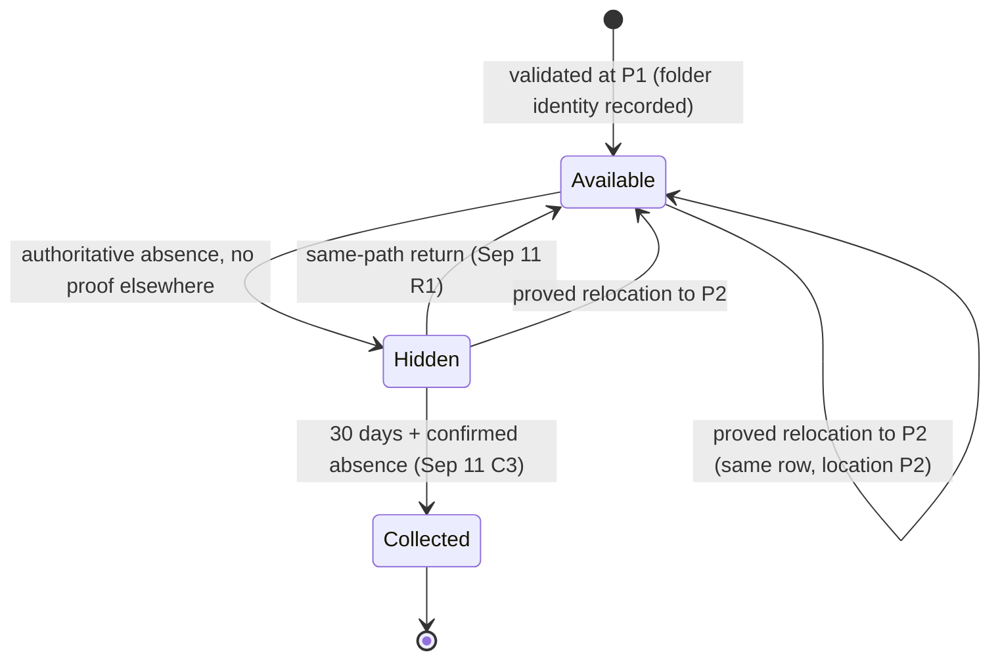

# Specification: repositories keep their identity when folders move

[Requirements](requirements.md) (M1–M7) → this Specification → [Program design](program-design.md).

The [September lifecycle specification](../2026-09-11-repository-lifecycle/specification.md) (C1–C6) and the [October 7 specification](../2026-10-07-remove-watched-folder/specification.md) (S1–S6) remain in force. This document changes only Sep 11 C1, which said "no automatic cross-path move proof". It also adds pane location truth.

## What the user experiences

A user moves `~/Documents/dev/app` to `~/code/app`, or renames it, or moves its parent folder, on the same disk. If the new place is inside a watched folder, the sidebar row keeps its pin, note, tags and recents. It shows the new path, and it never appears twice. A terminal whose shell was inside the folder shows the new location and keeps its git chip. A copy, a fresh clone, or a move to another disk stays a separate row, exactly as today.

Unproved new location → independent new row. The old row follows the Hidden path above.

## Entities

| Id | Entity | Identity and relationships | Observable states |
|---|---|---|---|
| E1 | Checkout | The application record for one Git working-tree location. Its identity is its UUID. Its location is a validated canonical path. It belongs to exactly one family and has a role: main or linked. | available, hidden (retained), collected |
| E2 | Family | The repository record. Its identity is its UUID. Its location is its main checkout's location. It owns pin, note and tags. | available, hidden, collected |
| E3 | Folder identity | For a validated checkout location on a qualifying volume, this is the triple (volume, checkout folder object, Git directory object). The Git directory is the one agentstudio-git resolves for that checkout: `.git` for a main checkout, `.git/worktrees/<name>` in the family for a linked one. Two locations have the same folder identity exactly when all three parts are equal. | — |
| E4 | Qualifying volume | A mounted volume that declares two things: (1) its object identities are persistent and never reused (`VOL_CAP_FMT_PATH_FROM_ID`), and (2) it has no directory hard links. On such a volume a folder object has exactly one path at a time. | qualifying, not qualifying |
| E5 | Recorded folder identity | The E3 most recently observed for a checkout at a validated location. It survives restart. Legacy rows, non-qualifying volumes and unreadable reads have none. | recorded, none |
| E6 | Pane location | A terminal pane's working directory. The *reported* location is the shell's last OSC 7 report. The *true* location is the shell process's current directory, as the operating system reports it. | — |
| E7 | Watched folder | Unchanged (Oct 7 E1). | — |

## C1 — Recording folder identity (M1, M2, M7)

- **S1.** Every validation of a checkout location records that location's folder identity (E5), when the location is on a qualifying volume. Each later validation refreshes it, and it survives restart. A non-qualifying volume, an unreadable identity, or a folder replaced during validation records none. A record with no identity can never relocate.

## C2 — Proved relocation (M1–M4)

- **S2.** Checkout C, with recorded identity I and location P1, relocates to P2 when all four conditions hold:
  1. the filesystem locates C's recorded checkout folder at P2 ≠ P1;
  2. P2 is inside a current watched folder;
  3. agentstudio-git validates P2 as a non-bare checkout whose Git directory has I's Git-directory part, and whose role equals C's role;
  4. S5 admits the transfer.

  On relocation:
  - C keeps its UUID, its location becomes P2, and any hidden state clears;
  - C's checkout note, recents and local activity follow it;
  - when C is the main checkout, its family keeps its UUID, pin, note and tags, and the family location becomes P2;
  - the family's other checkouts keep their identities.
- **S3.** S2 holds regardless of order:
  - which watched folder is reconciled first;
  - whether the move happened while the app ran or while it was closed;
  - whether P1 is now missing or holds a different folder.

  Identity for P2 is decided before any new UUID is issued for it. A relocated checkout never appears as two rows.
- **S4.** Without proof, behavior stays exactly as in Sep 11. The new location is an independent record, and the old record follows absence and retention. This covers:
  - no recorded identity (including legacy rows);
  - a non-qualifying volume;
  - a folder object that was not found;
  - a destination outside the watched folders;
  - Git validation that fails, names a different Git directory, or reports a different role;
  - a move to another volume, a copy, a clone or an APFS clone.

  A linked checkout moved with plain `mv` fails Git validation until `git worktree repair`. After the repair it relocates. Agent Studio never repairs Git metadata.
- **S5.** A folder identity backs at most one checkout. If two checkouts record the same identity, or two current locations present one identity, no transfer happens for any of them. Each location is then handled as in S4, and a bounded diagnostic is recorded. "First scan wins" is never allowed.
- **S6.** Same-path return (Sep 11 R1) is unchanged, with one exception. If C's recorded folder is proved at another location P2 (S2), C follows its folder, and a different folder now at P1 becomes a new record.
- **S7.** Two different folders never share a folder identity, so S2 cannot merge separate checkouts or independent clones. Equal history, remote, branch, name or common-directory path is not considered, and grants nothing.

## C3 — Pane location truth (M5)

- **S8.** When a terminal pane's reported location does not exist, the pane's location becomes the shell's true location (E6). Its repository link then resolves from that location through the existing CWD-derived association. This applies:
  - when the report arrives;
  - at launch, to every pane whose stored location does not exist;
  - after a relocation, to panes whose location lay under the old path.

  The shell keeps reporting the same missing path, and those repeats do not undo the correction. A report of an existing path is used as reported. If the true location cannot be read, the pane keeps its reported location and stays unlinked, as today. Agent Studio never sends `cd`, restarts a session, changes focus, or closes a pane for this.
- **S9.** After a relocation, a pane whose location lies inside P2 links to the same checkout UUID as before. Pane identity, tab, drawer, session, undo and history stay unchanged (Sep 11 R4).

## C4 — Remove Watched Folder (M6)

- **S10.** Oct 7 S1–S6 apply unchanged: the folder is unwatched, its exclusive repositories are hidden, and their panes are unlinked and kept.
- **S11 — pending owner decision D2, not authorized yet.** Recommended wording: "A hidden row that no current watched folder covers is collected 30 days after it was first hidden. A row first hidden by Remove Watched Folder starts its interval at the removal. An earlier absence interval is kept, never restarted or shortened. Watching the folder again before collection restores its rows (Oct 7 S6)." Without S11, such rows stay hidden indefinitely (Sep 11 C2 defers collection when no scope covers them).

## C5 — Boundaries and responsiveness (M7)

- **S12.** All of this work runs off MainActor:
  - folder identity reads and filesystem location lookups;
  - Git validation and process location reads.

  The work is bounded by the number of changed locations and affected panes. There is no polling and no per-repository timer. Git facts come only through agentstudio-git. Nothing is written into user folders or Git metadata. MainActor applies only committed outcomes (Sep 11 R6).
- **S13.** Bounded counters record two kinds of outcome:
  - relocation: relocated, no recorded identity, not found, outside watched folders, Git mismatch, ambiguous;
  - pane correction: corrected, unreadable.

  No raw path, UUID or object identity is exported.

## Coverage and proof

| Need | Contract | Required evidence |
|---|---|---|
| M1, M2 | S1–S4, S6 | V1: real-filesystem identity: `mv` keeps it; `cp -R`, `git clone` and `cp -c` change it; lookup after a move returns the new path; lookup after deletion returns not-found. V2: persisted identity round-trips across restart, and a malformed value means no proof. V3: a reconciliation matrix covering rename within a folder, moves across folders in both scan orders, a move while closed, P1 replaced by another clone, a destination outside watched folders, and a legacy row. V4: real watched folders, package discovery and SQLite. Moving a repository keeps its UUID, pin, note, tags and recents across restart, with no duplicate row. |
| M3, M4 | S5, S7, S2.3 | V3 negative cases: a copy beside the original; two clones with identical history; a duplicated identity; a Git role mismatch; a linked checkout moved without repair, then after repair. |
| M5 | S8, S9 | V5: a real zmx terminal in a folder that moves. The pane location and link follow, and repeated stale reports cause no flip. Unreadable process → unchanged. No command is injected, and the session ID is unchanged. The legacy panes relink at launch. |
| Runtime | S2, S12 | V6: watcher and Git observation move to the new path. Late results for the old path are rejected. A Bridge file source re-subscribes. |
| M6 | S10 (S11 if D2 is accepted) | Oct 7 proof, plus a collection test for unwatched rows if S11 is authorized. |
| M7 | S12, S13 | Source review: no MainActor I/O, no Git CLI, no writes into user folders. Marker-scoped counts. |

A debug build is required as the real-app proof:

1. Watch two folders, and pin and tag a repository in one of them. Open a terminal inside it.
2. `mv` the repository into the other folder.
3. Confirm that the sidebar shows one row with its pin and tag at the new path, and that the terminal keeps its git chip.
4. Restart the app and confirm again.
